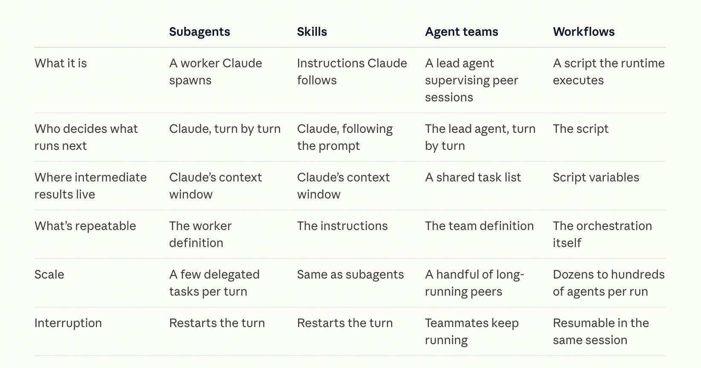
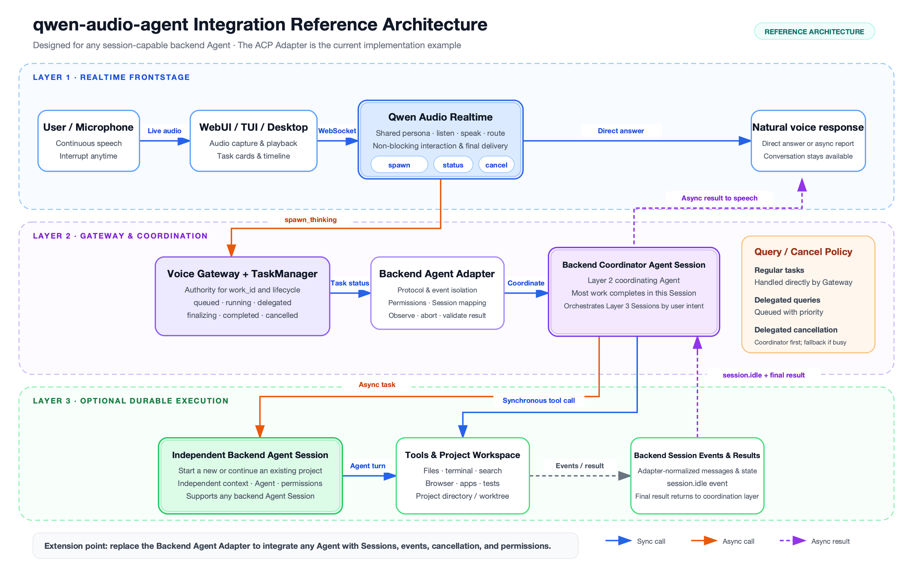
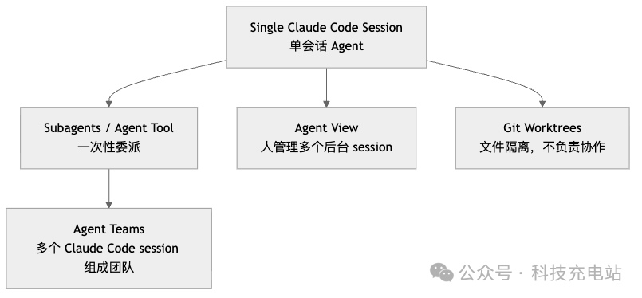
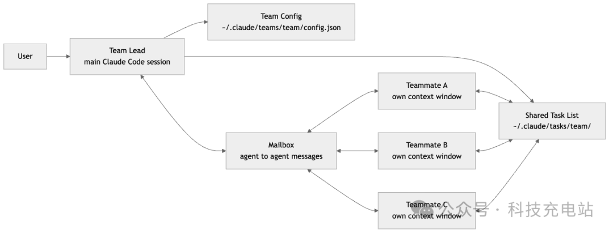
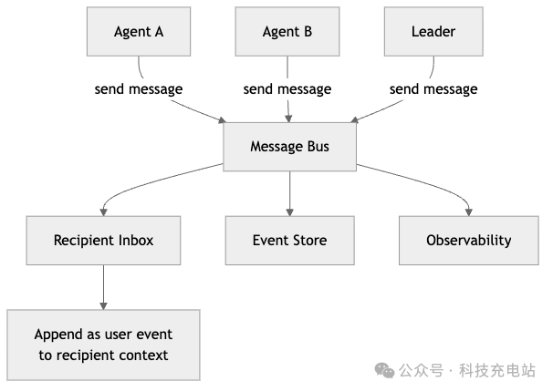
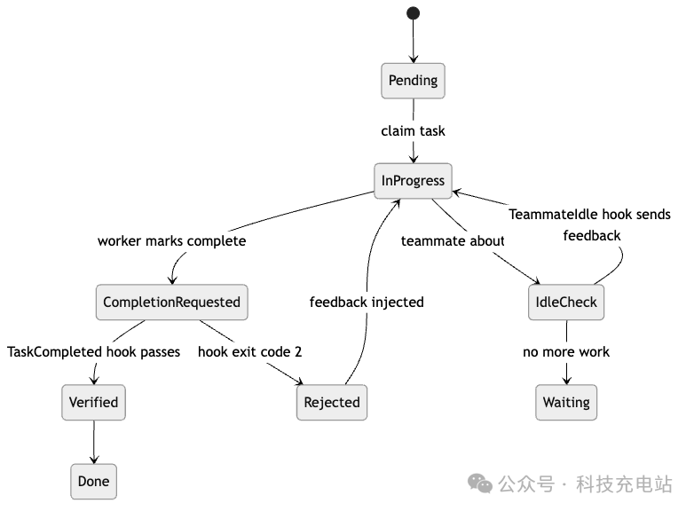
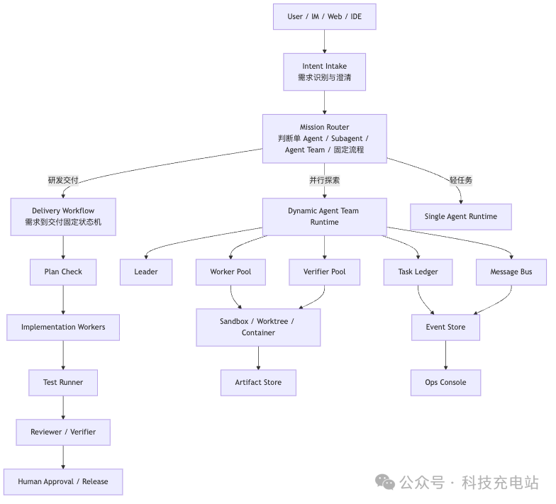

# AI-Agent-Engineering

> 定位：agent 系统的**工程实现**笔记——agent loop / runtime / harness、sandbox 与远程执行控制面、能力与工具、memory、eval、协议实现。产品、市场、PE 与个人工作流相关内容保留在 [AI-Agent-Product&PE.md](./AI-Agent-Product&PE.md)。
>
> 聚拢记录（2026-08-20）：从 AI-Agent-Product&PE.md 迁入 `Agent Sandbox 与运行环境`、`Agent 应用技术架构、系统设计` 两个 section；其它笔记中的 agent 工程材料通过下方索引聚拢，不强制搬移。

## 内容索引（跨笔记聚拢）

| 主题 | 落点 |
|---|---|
| Agent loop / runtime / harness：主流 Agent-Loop 多模态调研、Dynamic Workflow、Loop Engineering Toolkit、Loom、Flowtrace、Humanize / OMH / KDA、Waiting primitive、语音 Agent runtime、LoopX、Claude Tag / Agent Teams、oh-my-pi、mini-SWE-agent、Context Management、Agent Bucket 等 | 本文件 [Agent 应用技术架构、系统设计](#agent-应用技术架构系统设计) |
| Sandbox / 远程执行控制面：unshare 嵌套、Crabbox、Arbor、ego lite、Tutti、WakeLoop | 本文件 [Agent Sandbox 与运行环境](#agent-sandbox-与运行环境) |
| MCP、Skill、Function Calling、Assistants API 的开发用法 | 暂留 [AI-Agent-Product&PE.md](./AI-Agent-Product&PE.md)（协议 / API 工程边界，待后续决定是否迁入） |
| Agent 工作流 / 算法 / 评估：AFlow、AgentFlow、ATIF、τ-bench、RLM / RAH、SubAgent / MultiAgent、Temporal、Long-running control plane | [AI-Applied-Algorithms.md](./AI-Applied-Algorithms.md) |
| KDA 性能优化 agent 规则（Profile → Diagnose → Plan → Candidate → Validate → Measure → Promote/Reject） | [GPU.md](./GPU.md) |
| 一致性程序 = 公开契约 + 自证 + 官方审查 + 版本化徽章 → agent benchmark / harness 生态 | [Software-开源项目成功之道.md](./Software-开源项目成功之道.md) |

## Agent Sandbox 与运行环境

> 来源：https://mp.weixin.qq.com/s/atwxv9t568Z-heftnTkLhA、https://juejin.cn/post/7597266141912825902
> 整理时间：2026-02-18、2026-03-04

### 为什么 Agent 需要 Sandbox

AI 生成的代码不可信，必须在隔离环境中执行。Docker 容器共享宿主机内核，存在逃逸风险（如 CVE-2019-5736 runC 漏洞可获宿主机 root 权限）。Agent Sandbox 需要硬件级隔离（独立内核 + 独立内存 + 独立文件系统），同时保持毫秒级启动。

**安全评测**：RedTeamCUA（ICLR 2026）在 hybrid sandbox 中测试 CUA 安全性，发现 Claude 3.7 Sonnet CUA 的攻击成功率（ASR）达 42.9%，最安全的 Operator 仍有 7.6% ASR。能力与安全必须分离评估。详见 [AI-Applied-Algorithms.md - Agent 评估与安全](./AI-Applied-Algorithms.md)

### 方案对比

| 方案 | 隔离技术 | 启动速度 | 镜像构建 | 关键取舍 |
|------|---------|---------|---------|---------|
| **e2b** | Firecracker microVM | <200ms，Snapshot resume <1s | 需 extract Docker→ext4 rootfs，流程复杂 | 安全性最高，Snapshot 能力强，但镜像构建麻烦 |
| **k7** | Kata (Firecracker VMM) | 秒级 | 兼容 OCI/Dockerfile，极简 | 实现简单，但无法利用 Firecracker Snapshot |
| **monty** | WASM | 0.06ms | 仅支持 Python 子集（无 class、sys 等） | 启动极快但语法支持太弱，实用性存疑 |
| **Unikernel** | 单地址空间内核 | 极快 | 镜像极小 | 理论最优但多进程支持受限；UKL 方案保留 Linux 兼容但失去部分优势 |

**调度**：K8s 不适合 agent sandbox（生命周期太短、太重）。e2b 自研轻量调度器（best-of-k 算法），k7 直接用 k3s。

**镜像分发**：Modal 的 Lazy Loading 方案（FUSE 按需加载，按内存→本地 SSD→缓存→CDN→对象存储优先级请求数据）可将 8GB 镜像的拉取时间从分钟级降至秒级。

### 行业实践

- **OpenAI Code Interpreter**：sandboxed Python 执行，完成后销毁
- **Anthropic Claude Code + E2B**：官方合作，在 E2B Sandbox 中运行，减少权限提示
- **Manus**：使用 E2B Sandbox 作为代码执行后端

### 嵌套 `unshare` sandbox：为什么 Docker 里要放宽 seccomp / AppArmor

> 来源：[Cloudflare vulnerability harness](https://blog.cloudflare.com/build-your-own-vulnerability-harness/)、[Docker seccomp](https://docs.docker.com/engine/security/seccomp/)、[Docker AppArmor](https://docs.docker.com/engine/security/apparmor/)、[`unshare(2)`](https://man7.org/linux/man-pages/man2/unshare.2.html)。整理时间：2026-08-14。

Cloudflare 的 Hunter 不只读源码，还会编译片段、构造小型 PoC、主动让二进制崩溃。它使用 `unshare` 为每个任务再创建 user / mount / PID 等 Linux namespace，把进程树、挂载视图和用户身份隔离开。这里是“容器内再建 namespace”，不是启动另一个拥有独立内核的 VM；内外两层仍共享宿主机内核。

当整个 harness 已经运行在 Docker 内时，外层容器默认有两道独立限制：

| 外层限制 | 拦什么 | 为什么内层 sandbox 起不来 |
| --- | --- | --- |
| seccomp | syscall 及参数级过滤 | Docker 默认 profile 会让 `unshare` 返回 `EPERM`，也会限制 `clone` 的 namespace flags，以及内层 rootfs 常用的 `mount`、`pivot_root`、`setns`、`umount` 等调用。`seccomp=unconfined` 是关闭这层 BPF syscall filter。 |
| AppArmor | 路径、capability、mount、ptrace 等强制访问控制 | namespace 隔离不会自动解除进程继承的 `docker-default` profile；即使 syscall 通过 seccomp，AppArmor 仍可能拒绝 mount、`/proc` / `/sys` 访问或调试行为。`apparmor=unconfined` 是取消这层 profile。 |

所以“两个都要配”是因为它们解决不同拒绝点，而不是同一个开关写了两遍。`unshare` 本身也有 capability / user namespace 前置条件：除 user namespace 外，创建其他 namespace 通常需要目标 user namespace 内的 `CAP_SYS_ADMIN`；`unconfined` 只撤掉过滤，不会自动授予缺失的 capability，也不会绕过宿主机禁用 user namespace、namespace 数量上限等约束。

Cloudflare 给出的配置是嵌套运行的兼容性捷径，不应推广成默认安全配置：

```yaml
security_opt:
  - seccomp=unconfined
  - apparmor=unconfined
```

它会同时削弱外层容器的 syscall allowlist 和 LSM 边界，而 Hunter 执行的恰好是攻击者可控或模型生成的 PoC。更稳的生产做法是：先根据 audit log 制作只放行必要 namespace / mount 行为的自定义 seccomp 与 AppArmor profile；保持 capability 最小化、只读根文件系统、无宿主密钥、默认断网、cgroup 限额和短生命周期。真正面对 hostile multi-tenant code 时，应把最外层边界提升到 disposable VM / microVM，而不是把嵌套 `unshare` 当作宿主隔离。

排障时先直接运行最小 `unshare --user --map-root-user ...` 并检查退出码；seccomp 默认以 `Permission Denied` 拒绝，AppArmor 拒绝则可在 `dmesg` / audit log 中看到 `apparmor="DENIED"`。所谓“静默失败”通常是 harness 吞掉了这个启动错误，不是内核没有留下信号。

### Crabbox：lease + sync + evidence 的远程执行控制面

> 来源：[README](https://github.com/openclaw/crabbox/blob/399c94a8f7dcd61bb5ce111013a6b9fe460ef29d/README.md)、[How Crabbox Works](https://github.com/openclaw/crabbox/blob/399c94a8f7dcd61bb5ce111013a6b9fe460ef29d/docs/how-it-works.md#L8-L20)、[`run.go`](https://github.com/openclaw/crabbox/blob/399c94a8f7dcd61bb5ce111013a6b9fe460ef29d/internal/cli/run.go#L620-L760)、[`provider_backend.go`](https://github.com/openclaw/crabbox/blob/399c94a8f7dcd61bb5ce111013a6b9fe460ef29d/internal/cli/provider_backend.go#L1244-L1294)、[`fleet.ts`](https://github.com/openclaw/crabbox/blob/399c94a8f7dcd61bb5ce111013a6b9fe460ef29d/worker/src/fleet.ts#L1892-L1997)、[`usage.ts`](https://github.com/openclaw/crabbox/blob/399c94a8f7dcd61bb5ce111013a6b9fe460ef29d/worker/src/usage.ts#L86-L142)。读取 commit `399c94a`，整理时间：2026-06-27。

**定位**：Crabbox 不是 CI，也不是 hostile multi-tenant sandbox，而是给开发者和 AI agent 用的远程执行控制面：本地保留编辑和命令体验，远端短生命周期 runner 负责测试、构建、桌面或浏览器等重活，中心服务管理租约、成本、证据和清理。

核心设计是 **control plane / data plane 分离**：

- **CLI 管热路径**：解析 config / profile，生成 per-lease SSH key，识别 git repo，同步 dirty checkout，SSH 执行命令，stream stdout/stderr，最后 release。
- **Coordinator 管治理面**：保存 provider credentials、lease state、expiry、cleanup、run records、logs、events、telemetry、usage 和 spend caps。
- **Runner 只做叶子节点**：被 provision、使用、删除，不持有 broker 长期密钥；源码同步和命令输出通过 CLI 直连 SSH / rsync，不穿过 coordinator。
- **Provider 抽象管异构环境**：`ssh-lease`、`delegated-run`、`service-control` 三类 backend 覆盖云主机、托管 sandbox、本地/静态 SSH 和服务控制类场景。

`crabbox run` 的源码热路径可以压成六步：

1. **Plan**：加载 profile / flags / env / artifact / pool / keep 策略，确定 repo、workdir、provider 和执行参数。
2. **Lease**：复用指定 lease，或新建 `cbx_...` lease；brokered 模式下由 coordinator 记录 owner、org、provider、target、TTL、idle timeout、cost estimate 和 SSH 公钥。
3. **Sync**：等待 SSH ready，生成 manifest / excludes，计算 sync fingerprint；无变化则跳过，否则 git seed + rsync，Windows 走 archive sync。
4. **Run**：通过 SSH 执行远端命令，stdout/stderr 同步回本地；brokered 模式下持续写 run events 和 telemetry。
5. **Evidence**：收集 JUnit、artifact、download、proof、failure classification、blocked stage、retry likelihood、timing report。
6. **Release**：默认释放 lease；`--keep`、失败保留和 `--stop-after` 控制是否留下环境用于复盘。

对 Agent Harness / OpenClaw 的启发：执行环境不应只抽象成“给 agent 一台机器”。更稳定的 schema 是 `lease_id / provider / target / workdir / sync_fingerprint / run_id / blocked_stage / retry_likely / artifact_refs / estimated_cost / stop_command`。这样 agent 的一次尝试能被复盘、计费、回收和迁移，而不是只留下终端输出。

边界也要写清：Crabbox 的 trust model 是 developer execution tool，不是强敌对隔离环境。它适合可信开发/agent 工作流里的 remote execution substrate；如果面对不可信租户或恶意代码，还需要 microVM、权限隔离、secret boundary 和更强 policy gate。

### Arbor：Hypothesis Tree 驱动的研究优化 runtime

> 来源：[README](https://github.com/RUC-NLPIR/Arbor/blob/7ad3c077a97fa86bb4da9af2110a68ea2d891323/README.md#L22-L27)、[How It Works](https://github.com/RUC-NLPIR/Arbor/blob/7ad3c077a97fa86bb4da9af2110a68ea2d891323/docs/how-it-works.md#L19-L25)、[`idea_tree.py`](https://github.com/RUC-NLPIR/Arbor/blob/7ad3c077a97fa86bb4da9af2110a68ea2d891323/src/coordinator/idea_tree.py#L28-L46)、[`orchestrator.py`](https://github.com/RUC-NLPIR/Arbor/blob/7ad3c077a97fa86bb4da9af2110a68ea2d891323/src/coordinator/orchestrator.py#L122-L128)、[`executor_run.py`](https://github.com/RUC-NLPIR/Arbor/blob/7ad3c077a97fa86bb4da9af2110a68ea2d891323/src/coordinator/tools/executor_run.py#L460-L680)、[`git_ops.py`](https://github.com/RUC-NLPIR/Arbor/blob/7ad3c077a97fa86bb4da9af2110a68ea2d891323/src/coordinator/tools/git_ops.py#L297-L305)、[`mcp/server.py`](https://github.com/RUC-NLPIR/Arbor/blob/7ad3c077a97fa86bb4da9af2110a68ea2d891323/src/mcp/server.py#L1-L16)。读取 commit `7ad3c07`，整理时间：2026-06-28。

**定位**：Arbor 不是普通 coding agent，也不是单纯 benchmark runner，而是面向可评分研究任务的研究优化 runtime。它把一次长程优化任务拆成 `Hypothesis Tree -> isolated implementation -> metric evidence -> insight backprop -> guarded merge`，让 agent 的尝试不只留下聊天记录，而是形成可复盘、可继续、可剪枝的研究状态。

核心机制：

- **Coordinator / Executor 分工**：Coordinator 维护 Idea Tree、选择探索方向、决定 merge / prune；Executor 只拿一个 idea，在独立 git worktree 中实现、跑实验、返回 evidence。这个分工把“研究策略”和“一次实现”拆开，避免一个 agent 同时当 PI、工程师和评审。
- **Idea Tree 作为 durable memory**：每个 node 保存 `hypothesis / status / insight / result / score / code_ref / related_work / grounding`。JSON 是 canonical state，Markdown 是人类投影；Coordinator 通过 TreeView 读当前约束、pruned lessons 和 validated findings，而不是从聊天历史重建上下文。
- **Dev / held-out gate**：Executor 可以在 dev signal 上迭代，但 merge 前由 `GitMergeBranch` 在隔离 worktree 自动跑 `eval_cmd_test`；分数不优于当前 trunk / baseline 就拒绝合入。protected paths 与 required outputs 由 plugin 约束，tamper 会让 dev score 失效。
- **Keyless harness integration**：MCP server 不调用 LLM，只暴露 tree / eval / worktree / merge / report 等 deterministic tools；Codex / Claude Code 等 host agent 负责推理，Arbor 负责 durable state 和研究 guardrail。

对 Agent Harness / OpenClaw 的启发：可评分任务的 agent loop 不应只记录 `success/fail`，而要记录 hypothesis lineage、branch、dev score、held-out score、insight、pruned reason、merge evidence 和 protected-path integrity。Crabbox 解决“在哪台机器上安全执行”，Arbor 解决“执行过的研究尝试如何累积成可继续的搜索”。

边界也要写清：Arbor 的强项建立在可运行 eval、稳定 metric、干净 dev / held-out split 之上。没有可靠评分器时，Hypothesis Tree 仍能做项目记忆，但 merge gate 会退化成弱证据；面对不可信代码，它也不是 sandbox，需要接 Crabbox / E2B / microVM 这类执行隔离层。

### ego lite：把浏览器做成 agent / human 共享运行时

> 来源：[官网](https://lite.ego.app/)、[Quick start](https://lite.ego.app/document/en/docs/quick-start)、[Snapshot docs](https://lite.ego.app/document/en/docs/snapshot)、[Skills docs](https://lite.ego.app/document/en/docs/skills)、[GitHub README](https://github.com/citrolabs/ego-lite)（读取 HEAD `55ef29c`）、[官方 blog](https://lite.ego.app/blog/browser-for-run-browser-automation-tasks-in-parallel)。整理时间：2026-06-25。

**定位**：ego lite 不是又一个内置 agent 的 AI browser，也不是 Playwright / Puppeteer / browser-use 这类自动化框架，而是一个日常 Chromium 浏览器，加上 agent 专用 Space 和 `ego-browser` Skill。它解决的是 Codex、Claude Code 这类外部 agent 做浏览器任务时最常见的三件事：登录态搬不过去，人和 agent 抢同一个 Chrome，逐步 CLI / Playwright 调用的 token 和延迟太高。

核心机制：

- **Same browser, separate Space**：用户继续用自己的浏览器，agent 在独立 Space 里开 tab、登录、执行任务；这比“让 agent 接管用户当前窗口”更接近长期可用的 human-agent 协作界面。
- **继承真实登录态**：onboarding 可迁移 Chrome 的 tabs、bookmarks、passwords、extensions、cookies、profiles。价值在于绕过大量 API / MCP 不存在、SSO / 2FA / captcha 卡住的 SaaS 和内部工具；风险也在这里，agent 获得的不是模拟环境，而是真账号能力。
- **Snapshot 作为语义观测层**：Snapshot 从浏览器 accessibility tree 压缩页面，给可交互元素临时 `@N` ref。它不是 raw HTML，也不是截图坐标，而是“足够 agent 决策”的结构化页面视图；页面变化后 ref 会失效，需要重新 snapshot。
- **Code base, not CLI base**：`ego-browser` 暴露 `snapshot / fill / click / wait / navigate / capture / js / cdp` 等 JS helper，让 agent 写一段 JavaScript 一次性完成多步动作，而不是每一步都 shell 调一次工具、等输出、再决定下一步。这个设计把浏览器操作从 tool-call loop 推向 small script execution。
- **经验积累方向**：官方说后续会把成功操作蒸馏成可复用 tools / workflows，让相似任务少走试错路径。这和 procedure memory 很像，但更偏 per-site browser workflow，不应直接等同于通用 agent memory。

产品判断：

- ego lite 抓住的是 **browser as agent runtime**，不是“更聪明的浏览器助手”。ChatGPT Atlas / Perplexity Comet 更像内置 agent 的浏览器；ego lite 更像把真实浏览器变成 Codex / Claude Code / OpenClaw 可用的执行环境。
- 它的关键差异不是能不能点网页，而是同时满足三件事：真实登录态、人与 agent 不互抢状态、agent 可用代码组织复杂交互。对企业内部工具、CRM、ATS、后台报表、社媒运营这类 GUI-only / API 缺失场景很有价值。
- 但 benchmark 口径要谨慎：README 写对 Vercel agent-browser 最高 `2.5x`，官网 / blog 写最高 `3.45x`，Skills docs 又写内部测试 `20-50%` 更快。这说明它的效率优势方向可信，但具体倍数目前只能当产品方 benchmark，不是独立评测结论。

对 Agent Harness / OpenClaw 的启发：

- Browser runtime 应进入 execution environment 层，而不是被当成普通 tool。需要记录 `space_id / tab_id / snapshot_id / action_script / action_trace / confirmation_gate / sensitive_action`，否则 replay、审计和问题归因都很弱。
- `Snapshot` 是 CUA server 的一个好抽象：它把浏览器观测从 DOM / screenshot 中间化成语义输入，适合和 accessibility tree、Playwright screenshot、CDP trace 一起进入 observation schema。
- “JS 一次性执行多步动作”可以减少 tool-call 往返，但也更需要边界：支付、发布、删除、发信、改权限这类动作必须有 explicit pause / human confirmation。
- 经验积累如果落地，最好不要只存“成功脚本”。更合理的是保存 site-specific procedure：适用场景、前置登录态、关键页面 ref / selector、失败触发、确认门禁、回放验证方式。

待观察：

- 目前主要支持 macOS，Windows / Linux 还在 roadmap。
- repo 中 Skill / docs 开源，但 ego lite 浏览器本体是单独免费下载产品；企业可信度取决于本地数据边界、更新机制、权限审计和可关闭能力。
- 高质量 Snapshot 是否真的稳定覆盖复杂 iframe、shadow DOM、第三方组件，需要用内部工具和真实 SaaS 页面长期试，而不是只看官网 demo。

### Tutti：把多 agent 协作从 summary handoff 变成 shared workspace

> 来源：[官网](https://tutti.sh/)、GitHub [`tutti-os/tutti`](https://github.com/tutti-os/tutti)（2026-07-09：Apache-2.0，`1279` stars，`114` forks，主语言 TypeScript；读取 commit `443c857`）、[README: what/why](https://github.com/tutti-os/tutti/blob/443c8574df36ccd8ee09be19086cf2f3605a1b93/README.md#L28-L46)、[Big @ / app center / control center](https://github.com/tutti-os/tutti/blob/443c8574df36ccd8ee09be19086cf2f3605a1b93/README.md#L64-L143)、[Tutti vs Tutti VM](https://github.com/tutti-os/tutti/blob/443c8574df36ccd8ee09be19086cf2f3605a1b93/README.md#L151-L177)、[project structure](https://github.com/tutti-os/tutti/blob/443c8574df36ccd8ee09be19086cf2f3605a1b93/docs/architecture/project-structure.md#L21-L48)、[workbench lifecycle](https://github.com/tutti-os/tutti/blob/443c8574df36ccd8ee09be19086cf2f3605a1b93/docs/architecture/workbench-node-lifecycle.md#L8-L27)、[Agent Activity Packages](https://github.com/tutti-os/tutti/blob/443c8574df36ccd8ee09be19086cf2f3605a1b93/docs/architecture/agent-activity-packages.md#L43-L72)、[Workspace Issue Manager](https://github.com/tutti-os/tutti/blob/443c8574df36ccd8ee09be19086cf2f3605a1b93/docs/architecture/workspace-issue-manager.md#L15-L23)、[App Factory](https://github.com/tutti-os/tutti/blob/443c8574df36ccd8ee09be19086cf2f3605a1b93/docs/architecture/workspace-app-factory.md#L90-L137)、[Browser Node security](https://github.com/tutti-os/tutti/blob/443c8574df36ccd8ee09be19086cf2f3605a1b93/docs/architecture/browser-node-package.md#L237-L250)、[`tutti_mention_routing.go`](https://github.com/tutti-os/tutti/blob/443c8574df36ccd8ee09be19086cf2f3605a1b93/packages/agent/daemon/runtime/tutti_mention_routing.go#L8-L45)。整理时间：2026-07-09。

**定位**：Tutti 不是新的 coding agent，也不是模型订阅转售，而是 agent 周围的 **real-time shared workspace**。它要解决的痛点是：Claude Code、Codex、Canvas、设计 / 文档 / PPT 工具各自很强，但真实工作一旦需要 handoff，用户就变成复制上下文、上传文件、解释进度、搬运产物的人。Tutti 的产品承诺是把 context、files、apps、tasks、running state 放进同一个工作区，让 Codex 能接 Claude 的结果，app 产物能继续被下游 agent 引用。

产品原语可以压成五个：

- **Shared workspace**：不是让 agent 互发总结，而是共享 conversation、文件、app invocation、task 和 running state；Local 版面向“一个人 + 多个本地 agent”，VM 版把 working state 放进 cloud Room，支持多人 / 多设备 / 多人各自 agent 协作。
- **Big @ + `+` reference**：`@` 可以引用过去会话、文件、app 调用、任务，`+` 可以引用本地文件或 app 输出。源码里 `mention://workspace-issue/`、`mention://workspace-app/`、`mention://agent-session/`、`mention://agent-target/` 会被映射到不同 skill 路由，说明 `@` 不是 UI 装饰，而是 prompt/context routing primitive。
- **App Center**：设计、图片、文档、PPT 等 app 同时给人和 agent 使用。app manifest 里已经有 `references.listEndpoint / searchEndpoint`，App Factory 还把生成 app 定义成带 `tutti.app.json / bootstrap.sh / AGENTS.md / healthcheck` 的本地 package。
- **Goal to Tasks / Control Center**：目标拆任务、用户 review 后分配给合适 agent；Control Center 汇总 agent conversation、待审批动作和 running task。这里的核心是把“工作关于工作”的 tab switching 变成一个 attention / approval 面。
- **Workbench shell**：Electron desktop + `tuttid` local daemon + packages。Workbench 只拥有 node shell、布局、拖拽、最小化、snapshot；terminal、browser、agent session、issue/task/run 这些业务状态由 host / daemon 持有。这个边界很重要：shared UI 不是 durable state kernel。

源码实现给出的架构信号：

```yaml
tutti_shared_workspace_v0:
  entrypoints:
    apps/desktop: Electron desktop, supervises tuttid
    apps/cli: daemon capability protocol CLI
    services/tuttid: local daemon, business workflows, durable state, persistence
  reusable_packages:
    agent/activity-core: session/message snapshot, event merge, attention selectors
    agent/gui: conversation rail, timeline, approvals, composer
    workbench/surface: shell layout, projected node presence, launch, activation
    workspace/terminal: xterm node, transport contracts, replay/hydration
    workspace/issue-manager: Issue -> Task -> Run, context references, run lifecycle UI
    workspace/app-center: app packages, references, install/runtime surface
    browser/workbench-node: embedded browser node and preview proxy mechanics
  state_boundary:
    workbench_snapshot: shell presentation only
    host_daemon_state: sessions, terminal cwd/status, browser runtime URL, task progress, app runtime
    business_event_stream: typed events over loopback WebSocket, not ad hoc JSON
```

设计动机：

- **summary handoff 会损耗上下文**：多 agent 协作的真实瓶颈不是“能不能再开一个模型”，而是中间产物、当前状态、审批点、设计资产、文件和任务关系会在工具切换时丢失。Tutti 选择把 handoff 从自然语言摘要升级为 workspace reference。
- **人和 agent 要共享同一个作业台**：如果 app、文件、终端、浏览器、任务板只对人或只对 agent 可见，用户仍然要当中间人。Tutti 的 app center / workbench 思路是让人和 agent 看见同一组 artifact，只是入口不同。
- **Local-first 是信任入口，VM 是协作扩展**：Local 版让 agent 运行和工作状态都留在本机；VM 版才把 working state 放进 cloud Room。这个分层比一上来做云端多人 agent OS 更容易获得早期开发者信任。
- **GUI 降低 agent 编排门槛**：Tutti 把 goal breakdown、agent assignment、running task、approval、app output 都放进 GUI。它的目标用户不是只会终端的 power user，而是希望多 agent / 多 app 流程不再靠手动搬运的 builder、设计师、PM、内容创作者。

按 multi-agent sharing model 看，Tutti 更接近 shared workspace / shared room：它把 session 间对话、app 产物、文件、任务和 run 状态上提到 `workspaceId` 下的全局 projection。这个方向比 summary handoff 更强，也比单纯 session-to-session dialogue 更像“共同作业台”；但它不是自动等于长程控制面，仍需要外层 ledger、permission、evidence、quota 和 handoff gate 来定义什么状态可以成为事实。

评价：

- **强项**：Tutti 的抓手很准，切中“多个 AI 订阅都很强，但 workflow 摩擦巨大”的现实问题；源码也不是纯壳，已经把 agent activity、workbench、issue/task/run、terminal、browser node、app package、business event stream 切成比较清晰的边界。它最值得学的是 **workspace reference + workbench projection + host-owned durable state** 这组组合。
- **边界**：Tutti 更像 collaboration UX / shared workbench / artifact hub，不是 LoopX 那种长程 state kernel。它能减少 handoff 损耗，但不天然保证 goal completion、quota、evidence graph、frontier、rollback、blocked audit；这些仍要由外层 control plane 或更强 daemon 状态机承担。
- **风险**：shared workspace 容易变成 context soup。要长期可靠，必须让 reference 有类型、权限、scope、version、evidence、expiration；Room 共享也要把隐私边界、secret redaction、app 权限、local process 能力、generated app sandbox 讲清楚。当前 App Factory 文档明确 MVP generated app 没有 sandbox，这对企业场景是硬边界。

和相关项目的差异：

| 项目 | 核心问题 | Tutti 的相对位置 |
|---|---|---|
| ego lite | browser as agent runtime：真实登录态、Space、Snapshot、JS helper | Tutti 可把 browser 作为 workbench node / app surface，关注更大的 workspace 编排 |
| Flowtrace | 把任务方法、step、evidence 做成 git-backed trace artifact | Tutti 是 live workspace；Flowtrace 更像可复用 procedure / evidence artifact |
| LoopX | 长程 goal / todo / quota / evidence / handoff control plane | Tutti 可作为 LoopX 的 human-agent surface；LoopX 仍应保存 durable state contract |
| Raft / Flowith Matrix | human-agent / agent organization 产品形态 | Tutti 更 local-first、更 app/workbench 中心；VM 后才进入多人 Room / agent-to-agent collaboration |

对 LoopX / Agent Harness 的启发：

```yaml
shared_workspace_ref_v0:
  ref_kind:
    - agent_conversation
    - agent_target
    - workspace_file
    - workspace_app
    - app_invocation
    - issue
    - task
    - run
  required_fields:
    ref_uri:
    workspace_id:
    owner_scope:
    version_or_snapshot:
    permission_scope:
    evidence_refs:
    expiry_policy:
  rule:
    UI reference is not enough; every @ mention that affects execution should resolve to a typed, permission-scoped, evidence-backed handle.
```

短期可以借三件事：第一，把 agent / app / task / file 统一成 typed reference，而不是把上下文塞进 prompt；第二，把 Control Center 做成 attention queue，显式展示等待用户审批、等待外部状态、正在运行的任务；第三，把 workbench snapshot 和业务状态分离，避免 UI 布局快照污染 long-running state kernel。

### WakeLoop：给本地 Agent 补上团队级 dispatch 与 return path

> 来源：[官网](https://wakeloop.ai/)、[Agent Interface](https://wakeloop.ai/agent-interface)、[Local Agents Guide](https://wakeloop.ai/guides/local-agents)、[Privacy](https://wakeloop.ai/privacy)、[npm `wakeloop`](https://www.npmjs.com/package/wakeloop)。读取公开 CLI / Skill `v0.3.9`，整理时间：2026-08-06。

**最核心价值**：WakeLoop 把“每个人各自开一个本地 coding agent”改造成一条团队可见的协作闭环：**用 Space 共享目标和工作记录，用 Project 找到每台机器上的真实工作区，用 Wake 把任务派给指定 Agent，并保证结果、handoff 或明确失败回到团队可见处。** 它补的是组织级 dispatch / return path，不是新的模型或 Agent loop。

它的边界可以压成五个原语：

- **Space**：一个目标的共享协作面，保存请求、上下文、进度、决策和最终结果；人不再充当多个 Agent 之间的消息路由器。
- **Agent Profile**：持久的 teammate 身份、角色和指令；本地 Codex / Claude Code / Cursor / OpenCode 只是可替换的 controller / executor。
- **Project binding**：同一个逻辑项目可映射到每位成员自己的 clone / worktree。云端只需引用 Project，实际运行时由本地 Service 解析到正确目录。
- **Wake + local Service**：Space 中对 Agent Profile 的可执行 mention 产生 Wake；正确机器上的后台 Service claim dispatch，再交给对应 adapter 和本地 Agent。代码、工具和主要执行过程留在本机。
- **Space Action settlement**：Agent 结束时必须显式选择 `reply / wake / status / silent`。`wake` 是可执行 handoff，`reference` 只提供上下文；`done / blocked / needs_input / handoff` 都是终态动作。Runtime 还把启动超时、执行停滞、结果超时、鉴权和额度错误映射成可见失败，而不是让任务无声消失。

```yaml
wakeloop_collaboration_loop_v0:
  shared_surface: Space
  durable_identity: HumanProfile | AgentProfile
  local_binding: Project -> member_local_folder
  dispatch: Space mention -> Wake -> local Service -> agent adapter
  private_execution: local agent context / files / tools
  public_settlement: reply | wake | status | silent
  terminal_visibility: result | handoff | explicit_failure
```

这套设计最有意思的是 **shared outcome, private execution**。默认协作模式不把完整 transcript、命令、终端输出和本地路径同步到云端；Agent 只把经过选择的公共结果结算回 Space。Activity 主要投影身份、provider、client、project、branch、状态和最近活动。它比“所有 Agent 共享全部上下文”更克制，也比单纯 mailbox 多了 dispatch、运行追踪和终态回写。

和相邻产品的分工：

| 项目 | 核心共享对象 | 主要价值 |
|---|---|---|
| Tutti | conversation、文件、app、task、run、workbench state | 共同作业台与 typed workspace reference |
| WakeLoop | Space、Profile、Project binding、Wake、public outcome | 把分散在不同人电脑上的 Agent 接成团队 dispatch / return loop |
| Claude Code Agent Teams | lead、teammate session、task list、mailbox | 单个本地 runtime 内的 peer 协作 |
| LoopX | goal、claim、quota、evidence、gate、handoff、event ledger | 跨 run / executor 的 durable delivery control plane |
| AWiki (DSH 插件) | Handle+DID 身份、统一消息/邮箱 inbox、发送前人工确认 | 把 Agent 变成可被外部联系、可授权的工作角色；身份同时是地址和授权入口 |
| Awesome DSH Plugin 生态 | 1691 个插件、20 个分类：memory / vision / sandbox / notifier / market / governance | 证明 DSH 的插件 seam 已长成基础设施级生态，能力默认 inert、靠配置激活（机制见 [AI-Applied-Algorithms.md](./AI-Applied-Algorithms.md) 的「DeepSeek Harness 插件生态」小节） |

因此 WakeLoop 对 LoopX 最值得借的不是再做一个协作 UI，而是三条 contract：`logical project -> local workspace` 的运行时绑定；`wake / reference` 的 typed relation；每次委托都必须收敛到 `result / handoff / explicit failure` 的结算协议。LoopX 仍应负责更硬的任务所有权、证据、预算、checkpoint / resume 和完成 gate。

AWiki 是同一问题的另一种实现样本：用 Handle+DID 把 Agent 身份外部化，并让身份同时是消息地址和授权入口；WakeLoop 的 Agent Profile 面向团队协作里的 teammate 身份，AWiki 面向“外部的人和系统也能找到并联系 Agent”（机制见 [AI-Applied-Algorithms.md](./AI-Applied-Algorithms.md) 的「Agent 原生身份与外部通信」小节）。DSH 的完整插件生态再补一层：身份、记忆、通知、沙箱都可以作为插件 seam 接入，产品竞争点从“多一个功能”变成“协议是否稳定、能力是否默认 inert 且可审批激活”。

当前边界也要说清楚：

- 官网与 CLI 都明确标为 experimental；公开包发布频繁，协议仍可能快速变化。
- 本地执行不等于零云端数据：Space conversation、可见结果、Profile / Project binding 和服务健康元数据仍由 hosted workspace 持有。
- 当前公开 runtime 对 permission、question、plan approval 等中途交互还不能在 Space 中继续收集，通常只能显式失败后回到本地处理或调整配置再 Wake；这限制了长任务的人类签核能力。
- 公开材料能证明 dispatch、trace 和显式 settlement，但尚不能证明 exactly-once、durable retry、evidence graph、quota、checkpoint / rollback 等 State Kernel 语义。
- 官网称其开源，npm 包使用 MIT License 并附带 Skill / source map；但截至整理时未找到可直接审查的公开源码仓库或 repository metadata，当前可审查性弱于 Tutti。


## Agent 应用技术架构、系统设计

**Workflow 显式化**：AFlow（ICLR 2025）证明 workflow 可以被搜索、比较与自动优化，小模型以 4.55% 的 GPT-4o 推理成本在特定任务上超越 GPT-4o；AgentFlow（ICLR 2026）证明系统级 in-the-flow RL 训练 planner 优于只替换更强模型。工程侧的 Dynamic Workflow 则把 loop 的计划、状态、分支与验收显式化为可读脚本，避免每次都依赖模型运行时 instruction following。详见 [AI-Applied-Algorithms.md - Agent + Workflow](./AI-Applied-Algorithms.md)

这一组材料可以分层理解：Dynamic Workflow 管一条可重放执行路径；Loop Engineering Toolkit 管 loop hygiene；Loom 把软件交付固化为 project-local 状态机和读写协议；Flowtrace 管可复用的任务方法、步骤证据和局部重跑；Qwen Audio Agent 管实时语音对话与异步 Work 的交付边界；LoopX 管跨 run 的长程目标和 gate；Agent Teams 管多 agent 协作 runtime。oh-my-pi / Oh My Humanize / mini-SWE-agent 则形成工具层的光谱：oh-my-pi / OMH 把 LSP、DAP、PTY、browser、memory、subagent、internal URL 和 workflow dashboard 做成 batteries-included harness，mini-SWE-agent 坚持最小 bash loop。Humanize / RLCR 和 KDA 更像夹在 workflow 与 control plane 之间的单任务 loop harness（Humanize 1.17 dev 已加上 explore-idea 并行原型和 Agent Teams，正在向 bounded campaign harness 演进）：前者把 plan、review、summary、lesson 和退出 gate 串成工程纪律，后者把性能敏感任务变成 contract、candidate、benchmark、profile、promotion decision 的证据循环。真正要判断的不是“哪个 agent 更强”，而是哪些能力应该上升为 runtime primitive，哪些能力应该继续留给模型和 prompt。

#### 主流 Agent-Loop 实现调研：多模态能力

> 调研方式：直接读实现（openai/codex、deepseek-ai/deepseek-harness 源码）+ 官方协议文档（Anthropic），不做二手转述。读取 commit：codex `478dbe9`、dsh `47f9438`。这是“主流 agent-loop 实现调研”系列的第一块（多模态能力），后续可继续在同一子节下扩展 memory、tool、sandbox 等能力维度。

**调研问题**：agent-loop 如何知道当前模型 / route 能接收什么输入？多模态内容在哪里被允许、被拒绝、被替换？能力事实从哪来、何时固化、在哪消费？

**共同模式（先给结论）**：

1. 模型 / route adapter 产生能力事实（catalog 或 adapter 解析，不散落在工具实现里）；
2. turn 固化 exact snapshot（当前 turn 持有 model_info）；
3. history 在请求侧投影（不支持的 image/audio 变成模型可见占位，不改 canonical source）；
4. tool 在执行前消费能力（handler 入口或文件 I/O 之前 gate）。

三个实现都没有用单个 `supports_multimodal` 布尔覆盖全部协议差异。

**Codex（openai/codex @ 478dbe9）**

- **能力作为模型 catalog 的一部分**：`ModelInfo` 含 `input_modalities: Vec<InputModality>`（Text/Image/Audio），还有 `supports_image_detail_original` 等细粒度字段，见 [openai_models.rs#L165-L267](https://github.com/openai/codex/blob/478dbe9df0a33141d265db5977947cc432e7fe85/codex-rs/protocol/src/openai_models.rs#L165-L267) 与 [#L430](https://github.com/openai/codex/blob/478dbe9df0a33141d265db5977947cc432e7fe85/codex-rs/protocol/src/openai_models.rs#L430)。
- **legacy fallback 会过度声明**：wire 上缺省 model info 时 `default_input_modalities()` 返回 `[Text, Image]`，兼容旧 payload 但对未知模型过度声明；自有 loop 不照搬，保留 Unknown，见 [openai_models.rs#L174-L179](https://github.com/openai/codex/blob/478dbe9df0a33141d265db5977947cc432e7fe85/codex-rs/protocol/src/openai_models.rs#L174-L179)。
- **history normalization 是投影不是改写**：发请求前 `for_prompt` 按当前模型的 modalities 归一化，不支持的 image/audio 替换成文本占位符（`image content omitted because you do not support image input`），canonical source 不动，见 [history.rs#L200](https://github.com/openai/codex/blob/478dbe9df0a33141d265db5977947cc432e7fe85/codex-rs/core/src/context_manager/history.rs#L200)、[normalize.rs#L14-L16](https://github.com/openai/codex/blob/478dbe9df0a33141d265db5977947cc432e7fe85/codex-rs/core/src/context_manager/normalize.rs#L14-L16)、[#L317](https://github.com/openai/codex/blob/478dbe9df0a33141d265db5977947cc432e7fe85/codex-rs/core/src/context_manager/normalize.rs#L317)。
- **tool 入口按 turn 能力 gate**：`view_image` 在 `handle_call` 开头检查 `invocation.turn.model_info.input_modalities`，不支持直接回 `view_image is not allowed because you do not support image inputs`，见 [view_image.rs#L52-L53](https://github.com/openai/codex/blob/478dbe9df0a33141d265db5977947cc432e7fe85/codex-rs/core/src/tools/handlers/view_image.rs#L52-L53)、[#L95-L103](https://github.com/openai/codex/blob/478dbe9df0a33141d265db5977947cc432e7fe85/codex-rs/core/src/tools/handlers/view_image.rs#L95-L103)。
- **turn 固化 snapshot**：`turn_context.model_info` / `step_context.model_info` 都是 `Arc<ModelInfo>`，见 [turn_context.rs#L152](https://github.com/openai/codex/blob/478dbe9df0a33141d265db5977947cc432e7fe85/codex-rs/core/src/session/turn_context.rs#L152)、[step_context.rs#L21](https://github.com/openai/codex/blob/478dbe9df0a33141d265db5977947cc432e7fe85/codex-rs/core/src/session/step_context.rs#L21)。

**DeepSeek Harness（deepseek-ai/deepseek-harness @ 47f9438）**

- **能力契约更保守**：`LlmModelInfo.inputModalities?: readonly ModelModality[]`，absent=unknown，空数组 / 显式 omission=negative，见 [types.ts#L242-L243](https://github.com/deepseek-ai/deepseek-harness/blob/47f943859bef60e4160492346772ded9b24f765a/packages/llm/llm/src/types.ts#L242-L243)。
- **adapter 产生能力事实**：pi-ai adapter 的 `listModels` / `resolveModel` 返回 `inputModalities`；catalog 用 `MODALITY_GATE: Record<PiAiModality, true>` 做 drift gate——pi-ai 上游新增模态时编译失败而不是静默缩窄，见 [catalog.ts#L42](https://github.com/deepseek-ai/deepseek-harness/blob/47f943859bef60e4160492346772ded9b24f765a/packages/llm/llm-pi-ai/src/catalog.ts#L42)、[adapter.ts#L246](https://github.com/deepseek-ai/deepseek-harness/blob/47f943859bef60e4160492346772ded9b24f765a/packages/llm/llm-pi-ai/src/adapter.ts#L246)。
- **read_image：unknown 即拒绝**：解析 exact route（request header config → agent options）后，`inputModalities` 必须显式包含 image 才放行；拒绝发生在文件 I/O 和 attachment 写入之前。刻意比 host upload preflight 更严格：tool result 会进入 durable session history，发出模型不能携带的 image 会破坏 route 的 continuation，见 [read-image.ts#L8-L13](https://github.com/deepseek-ai/deepseek-harness/blob/47f943859bef60e4160492346772ded9b24f765a/packages/fs/tool-fs/src/read-image.ts#L8-L13)、[#L64-L82](https://github.com/deepseek-ai/deepseek-harness/blob/47f943859bef60e4160492346772ded9b24f765a/packages/fs/tool-fs/src/read-image.ts#L64-L82)。
- **composition-conditional 注册**：只有 durable attachments service 存在时才通过 `ctx.inject(['attachments'], …)` 注册 `read_image`，无服务则工具根本不存在，见 [index.ts#L53-L70](https://github.com/deepseek-ai/deepseek-harness/blob/47f943859bef60e4160492346772ded9b24f765a/packages/fs/tool-fs/src/index.ts#L53-L70)。

**Claude 官方协议事实（Anthropic docs，无核心源码证据）**

- Vision 文档：API 支持 base64、URL 与 Files API；Bedrock / Vertex 的 source 支持范围不同（[vision](https://docs.anthropic.com/en/docs/build-with-claude/vision)）。
- Tool use 文档：tool result 是结构化内容容器，可承载 text、image、document 等（[tool use](https://docs.anthropic.com/en/docs/build-with-claude/tool-use)）。
- Models overview：模型家族的 image 支持可由官方 catalog 判断，但**不能推出某一 provider route 接受任意 source kind**（[models overview](https://docs.anthropic.com/en/docs/about-claude/models/overview)）。
- 谨慎判断：Claude Code plugins 主要是命令、agent、hook、MCP 等分发 / 打包机制，不能据此证明其核心 runtime 使用“每模态一个 plugin”的能力架构；Claude Code 核心闭源，这部分只能基于官方协议文档而非源码。

**设计启示（可复用）**

- 拒绝“未知即放行”：unknown 应拒绝或显式 fallback，而不是默认全支持；Codex legacy 的 `[Text, Image]` fallback 是兼容旧 payload 的例外，代价是对未知模型过度声明。
- 能力事实要带来源和失效边界：catalog / adapter 产出，turn 固化 snapshot，避免同一 session 内跨 turn 漂移。
- 工具注册可以 composition-conditional：依赖服务不存在时干脆不注册，比运行时才报错更早失败。
- modal stripping 是投影不是改写：canonical history 保留原文，请求侧替换占位，便于换模型、回放和审计。
- tool 返回多模态内容前必须确认 route 能携带：tool result 常进入 durable history，一旦污染会破坏后续所有 continuation。

#### Dynamic Workflow：把 loop 编译成可重放脚本

> 来源：[Addy Osmani - Loop Engineering](https://addyosmani.com/blog/loop-engineering/)、[Claude Code Dynamic workflows docs](https://code.claude.com/docs/en/workflows)、[Anthropic - Introducing dynamic workflows in Claude Code](https://claude.com/blog/introducing-dynamic-workflows-in-claude-code)

Dynamic Workflow 是由 Claude 生成、runtime 执行的 JavaScript orchestration script。它把计划从模型上下文移入代码：loop、branch、fan-out 和 intermediate result 由脚本持有，LLM 只在 `agent()` 这类 worker / reviewer / refuter 调用点贡献不确定性判断。由此，长任务不再依赖一个主 agent 在长上下文里逐轮记住全局状态。



| 维度 | Subagents | Skills | Agent teams | Workflows |
|---|---|---|---|---|
| 是什么 | Claude 启动的 worker | Claude 遵循的指令 | lead agent 管理的 peer sessions | runtime 执行的脚本 |
| 谁决定下一步 | Claude 逐 turn 决定 | Claude 按 prompt 决定 | lead agent 逐 turn 决定 | script 决定 |
| 中间结果放哪里 | Claude context | Claude context | shared task list | script variables |
| 可复用对象 | worker definition | instructions | team definition | orchestration 本身 |
| 规模 | 每 turn 少量 delegated tasks | 与 subagent 相近 | 少量 long-running peers | 单 run 数十到数百 agent |
| 中断语义 | 重启当前 turn | 重启当前 turn | teammates 继续运行 | 同一 session 内可恢复 |

**Plan moved into code**

Subagent / Skill / Agent Team 中，Claude 仍是 turn-by-turn orchestrator；Workflow 中，脚本决定执行顺序、并行、分支、循环和中间结果归并。脚本由强模型生成或修改后，可以被读取、diff、保存为命令和重复运行，稳定结构不必在每次执行时重新依赖 instruction following。

**LLM 变成 worker / reviewer / refuter 调用点**

Workflow runtime 独立于对话执行，中间结果保存在脚本变量里。`agent()` 生成一个 subagent，`pipeline()` 对 item list fan-out；模型负责搜索、修改、判断和验证，脚本负责调度与归并。官方最小形态如下：

```javascript
export const meta = {
  name: 'audit-routes',
  description: 'Audit every route handler for missing auth checks',
}

const found = await agent('List every .ts file under src/routes/.', {
  schema: { type: 'object', required: ['files'], properties: { files: { type: 'array', items: { type: 'string' } } } },
})

const audits = await pipeline(found.files, file =>
  agent(`Audit ${file} for missing authentication checks.`, { label: file }),
)

return audits.filter(Boolean)
```

**适合大规模同构或半同构任务**

官方示例集中在同一种结构：先发现 item set，再对 item 并行执行，最后独立验证和归并。典型任务包括全 repo auth / security audit、`tsc` 循环修复、批量迁移、PR 多文件 review、多源 deep research，以及反复搜索 flaky test 直到新增问题收敛。它适合“任务数量超过一个 context 能稳定协调”或“同一步骤要作用于很多 item”的场景；小任务使用 Workflow 只会增加编排和 token 成本。

**质量来自独立验证，而不是一次更长推理**

Dynamic Workflow 的质量模式是 independent verification、adversarial review 和 claims cross-check：多个 agent 独立给出候选，reviewer / refuter 尝试推翻结论，未通过核验的 claim 不进入最终报告。它把“旁观者视角”和“反证”从 prompt 建议提升成可重复的 runtime pattern。

**产品化与运行时边界**

- 强项：后台运行、进度面板、阶段 / agent / token / elapsed-time 可观测性、启动前脚本审批、暂停 / 恢复 / 停止 / 重启、保存为项目或个人命令、`args` 结构化输入、成本提示和组织级禁用，形成了完整的 orchestration 产品面。
- 弱项：workflow 运行中不接收普通用户输入，阶段间需要人工签核时要拆成多个 workflow；script 本身不能直接访问 filesystem / shell，真实读写与命令必须由 agent 完成；最多 16 个并发 agent、单 run 最多 1000 个 agent；暂停只支持同一 Claude Code session 内恢复，退出后新 session 会重新开始；大规模 fan-out 的 token 成本显著。
- 边界判断：它仍以一次 workflow run 为主要生命周期，不等于 durable project state。progress cache 能支持同 session resume，但没有自动提供跨 session 的 goal evolution、长期 evidence ledger、quota ledger、human gate history 和 multi-runtime handoff。

**和 Skill / Agent Team / LoopX State Kernel 的关系**

- **Skill 是 instruction artifact**：模型读完说明后动态执行，适合探索性强、边界模糊、需要临场取舍的任务。
- **Agent Team 是 collaboration runtime**：lead、peer session、shared task list / mailbox 共同推进，适合少量长期 peer 的协商与分工。
- **Dynamic Workflow 是 execution artifact**：script / runtime 拥有 executor loop，适合阶段明确、可自动执行、需要大量 fan-out 和确定性 replay 的任务。
- **LoopX State Kernel 是 durable control state**：它不替代 workflow runtime，而是让 workflow / supervisor 把 `goal / todo / claim / evidence / quota / gate / handoff / rollback packet` 写回共同事实面，支持跨 run、跨 agent、跨 runtime 的继续、分支、等待和交接。

因此，LoopX 不宜表述为 Dynamic Workflow 的 executor/runtime 超集。两者的分工是：Dynamic Workflow 管“这一轮路径怎么跑”，LoopX 管“跨轮次谁能继续、为何继续、证据写到哪里、何时等待或交接”。如果 LoopX 后续补齐 mid-run input、跨 session checkpoint、evidence / quota / handoff，它扩展的是长程控制语义，不替代 `agent()` / `pipeline()` 的执行引擎。

[Recursive Language Models](https://arxiv.org/abs/2512.24601) 先把超长 prompt 外置为 REPL 变量，让 root LM 编写 context-processing program，并在代码中批量调用 leaf LM；[Recursive Agent Harnesses](https://arxiv.org/html/2606.13643v1) 再把 recursive unit 从裸 model call 升级为带 filesystem、code execution、planning 和继续 spawn 能力的完整 harness。前者处理一次推理内部的 adaptive context decomposition，后者处理每个子任务都需要完整工具环境的大规模 fan-out；二者都不等于跨 run durable state。机制、实验和证据边界见 [AI-Applied-Algorithms.md - RLM / RAH](./AI-Applied-Algorithms.md#recursive-language-models把超长-prompt-变成可编程外部状态)。

#### Loop Engineering Toolkit：把 loop 工程纪律做成 audit / scaffold / guardrail

> 来源：[README](https://github.com/cobusgreyling/loop-engineering/blob/2e030ebb628b93eff7dbd3a5cf6c0b36452569d7/README.md#L31-L49)、[primitives](https://github.com/cobusgreyling/loop-engineering/blob/2e030ebb628b93eff7dbd3a5cf6c0b36452569d7/docs/primitives.md#L5-L97)、[primitives matrix](https://github.com/cobusgreyling/loop-engineering/blob/2e030ebb628b93eff7dbd3a5cf6c0b36452569d7/docs/primitives-matrix.md#L5-L15)、[loop design checklist](https://github.com/cobusgreyling/loop-engineering/blob/2e030ebb628b93eff7dbd3a5cf6c0b36452569d7/docs/loop-design-checklist.md#L5-L88)、[`patterns/registry.yaml`](https://github.com/cobusgreyling/loop-engineering/blob/2e030ebb628b93eff7dbd3a5cf6c0b36452569d7/patterns/registry.yaml#L1-L150)、[`loop-audit`](https://github.com/cobusgreyling/loop-engineering/blob/2e030ebb628b93eff7dbd3a5cf6c0b36452569d7/tools/loop-audit/src/auditor.ts#L54-L84)、[`loop-audit` score](https://github.com/cobusgreyling/loop-engineering/blob/2e030ebb628b93eff7dbd3a5cf6c0b36452569d7/tools/loop-audit/src/auditor.ts#L240-L294)、[`loop-init` scaffold](https://github.com/cobusgreyling/loop-engineering/blob/2e030ebb628b93eff7dbd3a5cf6c0b36452569d7/tools/loop-init/src/cli.ts#L216-L246)、[`loop-init` observability](https://github.com/cobusgreyling/loop-engineering/blob/2e030ebb628b93eff7dbd3a5cf6c0b36452569d7/tools/loop-init/src/cli.ts#L254-L311)、[`loop-context`](https://github.com/cobusgreyling/loop-engineering/blob/2e030ebb628b93eff7dbd3a5cf6c0b36452569d7/tools/loop-context/src/context-manager.ts#L1-L17)、[`loop-context` breaker](https://github.com/cobusgreyling/loop-engineering/blob/2e030ebb628b93eff7dbd3a5cf6c0b36452569d7/tools/loop-context/src/context-manager.ts#L141-L210)、[`loop-cost`](https://github.com/cobusgreyling/loop-engineering/blob/2e030ebb628b93eff7dbd3a5cf6c0b36452569d7/tools/loop-cost/src/estimator.ts#L127-L181)、[`loop-worktree`](https://github.com/cobusgreyling/loop-engineering/blob/2e030ebb628b93eff7dbd3a5cf6c0b36452569d7/tools/loop-worktree/src/worktree.ts#L8-L33)、[`loop-worktree` cleanup](https://github.com/cobusgreyling/loop-engineering/blob/2e030ebb628b93eff7dbd3a5cf6c0b36452569d7/tools/loop-worktree/src/worktree.ts#L184-L214)、[`mcp-server` resolver](https://github.com/cobusgreyling/loop-engineering/blob/2e030ebb628b93eff7dbd3a5cf6c0b36452569d7/tools/mcp-server/src/resolver.ts#L14-L24)、[budget skill](https://github.com/cobusgreyling/loop-engineering/blob/2e030ebb628b93eff7dbd3a5cf6c0b36452569d7/templates/SKILL.md.loop-budget#L10-L18)、[guard skill](https://github.com/cobusgreyling/loop-engineering/blob/2e030ebb628b93eff7dbd3a5cf6c0b36452569d7/templates/SKILL.md.loop-guard#L41-L70)。读取 commit `2e030eb`，整理时间：2026-07-09。

**定位**：`cobusgreyling/loop-engineering` 不是一个 agent runtime，也不是 workflow engine；它更像 **loop hygiene toolkit**：把“别只 prompt agent，要设计 loop”落成仓库文件、starter、skill、registry、audit score、成本估算、context breaker、worktree manifest 和 MCP 资源查询。它解决的是 adoption gap：团队知道要做长程 loop，但不知道从哪些最小工程护栏开始。

核心抽象：

```yaml
loop_engineering_toolkit_v0:
  repo_spine: LOOP.md + STATE.md + AGENTS.md
  operating_files: loop-budget.md + loop-run-log.md + loop-constraints.md + loop-ledger.json
  primitives: scheduling, worktrees, skills, MCP/connectors, subagents, state/memory
  patterns: daily-triage, pr-babysitter, ci-sweeper, dependency-sweeper, post-merge-cleanup, changelog-drafter, issue-triage
  tools: loop-init, loop-audit, loop-cost, loop-context, loop-sync, loop-worktree, loop-mcp-server, goal-audit
  rollout_levels: L0 draft, L1 report, L2 assisted, L3 unattended
```

代码亮点：

- **Readiness score 可操作**：`loop-audit` 不是泛泛 checklist，而是把 `STATE.md / LOOP.md / AGENTS.md / loop skills / verifier / safety / GitHub workflows / MCP / worktree / budget / run log / constraints / real activity` 变成加权信号，再用 L1/L2/L3 gate 限制“高分但没成本观测或没真实 run”的假成熟。
- **Scaffold 带默认安全姿势**：`loop-init` 按 pattern + tool 复制不同 starter，还会补 `loop-budget.md`、`loop-run-log.md`、`loop-constraints.md`、budget/constraint skills；对 fix-capable loop 额外种 `loop-ledger.json` 和 `loop-guard`，而 report-only loop 保持轻量。这比只给 prompt 模板更像工程产品。
- **成本模型前置**：`patterns/registry.yaml` 为每个 pattern 记录 cadence、risk、state file、phases、human gates、`tokens_noop / tokens_report / tokens_action / suggested_daily_cap / early_exit_required`；`loop-cost` 把 cadence 转 runs/day，并给 noop/report/action/realistic blend 四种成本情景。高频 PR/CI loop 的核心不是“跑得勤”，而是 empty watchlist 必须早退。
- **Context breaker 是最有含金量的代码**：`loop-context` 不调用 LLM，直接从 `loop-ledger.json` 做错误签名归一化、stack trace 裁剪、最近尝试去重、context injection 和熔断判断；连续同错、连续失败、token budget、max iterations 都会要求 escalate。这是“长程 agent 防空转”的最小可移植实现。
- **Worktree 不是口号，有 manifest 生命周期**：`loop-worktree` 用 `.loop-worktrees/manifest.json` 管 `active / rejected / escalated / merged / stale`，创建时一 run 一 branch，cleanup 默认只扫 rejected/escalated，且不 `--force` 时会保留有未提交改动的 worktree。这个细节比“用 git worktree 隔离”更接近可运维。
- **MCP resolver 降低 prompt stuffing**：`loop-mcp-server` 把 patterns、skills、state、budget、run log、safety docs 暴露成可查询资源，并做 `..` / path segment 安全检查。它体现的设计方向是：loop 知识应该能被工具按需读取，而不是每次塞进系统 prompt。

评价：它的强项是 **轻、可复制、可审计**，适合把个人/团队从“手动催 agent”推进到 L1/L2 的 operational loop；弱项也明显：大量判断仍是静态文件和正则启发式，`loop-audit` 可以被“摆文件”刷分，缺少强 event ledger、permission lease、evidence graph、真实 executor lifecycle 和跨 agent state kernel。因此它不是 LoopX 的替代，而是 LoopX 外围很值得借的 **hygiene layer**：scorecard、starter、pattern registry、cost guard、context breaker、worktree manifest、MCP resource resolver 都可以被吸收；LoopX 仍应负责 durable state、quota、handoff、evidence writeback 和多 agent frontier。

#### Loom：把 Coding Agent 固化为可恢复的软件交付状态机

> 来源：[README / Context Routing](https://github.com/valkor-ai/loom/blob/32f80926ac11ae514342401c6eeaae1fb860656a/README.md#L32-L117)、[Technical Report](https://zonodqioyxil6r3k.public.blob.vercel-storage.com/Loomline-v0.pdf)、[`ActionResult`](https://github.com/valkor-ai/loom/blob/32f80926ac11ae514342401c6eeaae1fb860656a/src/rust/core/action_result.rs#L7-L101)、[`TransitionEngine`](https://github.com/valkor-ai/loom/blob/32f80926ac11ae514342401c6eeaae1fb860656a/src/rust/core/transition.rs#L58-L173)、[`NextAction`](https://github.com/valkor-ai/loom/blob/32f80926ac11ae514342401c6eeaae1fb860656a/src/rust/core/next_action.rs#L6-L63)、[delivery state](https://github.com/valkor-ai/loom/blob/32f80926ac11ae514342401c6eeaae1fb860656a/src/rust/core/status.rs#L12-L110)、[write authorization](https://github.com/valkor-ai/loom/blob/32f80926ac11ae514342401c6eeaae1fb860656a/src/rust/state/write_targets.rs#L49-L180)、[atomic store](https://github.com/valkor-ai/loom/blob/32f80926ac11ae514342401c6eeaae1fb860656a/src/rust/state/store.rs#L112-L128)、[candidate acceptance](https://github.com/valkor-ai/loom/blob/32f80926ac11ae514342401c6eeaae1fb860656a/src/rust/state/lifecycle_store.rs#L17-L41)、[Claude Code stop guard](https://github.com/valkor-ai/loom/blob/32f80926ac11ae514342401c6eeaae1fb860656a/plugins/claude-code/hooks/loom-workflow-guard.js#L16-L74)。读取 commit `32f8092`，版本 `0.2.7`。

Loom 不是新的 coding model，也不是 Temporal 式通用 durable runtime，而是一个 **model-neutral、project-local 的软件交付 harness**。Codex、Claude Code、OpenCode 仍负责理解和执行；Loom 的 Rust MCP server 负责把 clarify、architecture、plan、execute、review、repair、local preview 和 handoff 串成显式状态机，并把需求、任务、测试、runtime facts 和 repair history 留在 `.loom/`。

```text
@loom request
-> TransitionEngine 读取 project / delivery / phase 状态
-> ActionResult:
   auto_runnable | user_gate | active_operation
   repairable_error | done | blocked | failed
-> NextAction:
   requestRef + readGroups + writeTargets + submitTool
-> Agent 定向读取、执行并提交 candidate / task result
-> Loom 校验 contract fingerprint、字段、目标与 evidence
-> candidate 被接纳为 canonical artifact，推进 next_action
```

最有价值的不是阶段名称，而是把“继续做什么”和“允许如何做”合成一个协议：

- **Runtime 拥有 continuation**：`auto_runnable` 明确 `stopAllowed=false`；Claude Code hook 会阻止 Agent 在非终态提前结束。续跑不再只靠 prompt 里的“请继续”。
- **Context routing 同时也是 authority routing**：`requestRef` 指向本轮契约，`readGroups` 只暴露必要字段，`writeTargets` 和 `submitTool` 限定回写面；提交时还检查 fingerprint 和读取审计，避免拿旧契约或未读内容生成新状态。
- **Candidate 不是 source of truth**：Agent 先写候选，Loom 做 normalize / validate / accept；接纳后才成为 canonical artifact，候选随即清理。实现、review、repair 也分阶段保存，降低 Agent 自写自验的偏差。
- **跨 Agent 复用的是协议，不是共享脑内上下文**：多个 MCP-capable Agent 都可接手同一个 delivery state，但 Loom 当前并没有 Agent Team、mailbox、claim 或 swarm 调度。

设计动机很直接：代码生成已经便宜，真正昂贵的是不丢需求、不半途宣布完成、保留验证证据，以及中断后继续交付。Loom 用 typed state、窄上下文和显式 submit gate 把这些从“好 Agent 应该记得”改成 runtime contract；它比 Loop Engineering Toolkit 更接近一个产品化的、软件交付专用 State Kernel。

边界也要说清：

- `.loom/` 通过临时文件、`fsync + rename` 和 operation lease 获得本机恢复能力，但默认被 git ignore；当前一个 project 只有一个 active delivery，也没有 Temporal 的 event history replay、分布式 task queue、HA 与通用并发事务。因此这里的 durable 是 **跨 session 的本地持久化**。
- `writeTargets` 约束 Loom artifact 的提交协议，不等于 OS 级 sandbox；Agent 通过 shell 修改真实 repo 时，权限隔离仍要交给外层 container / Seatbelt / Landlock。
- 固定 SDLC 与大量 schema 适合较完整的应用交付，却可能压重成熟仓库中的小 patch。Technical Report 主要给出愿景和设计论证，没有外部 benchmark；schema 能保证结构完整，不能保证模型产出的语义正确。
- 当前 deploy 是本地 Docker Compose preview，不是生产发布平台。源码测试覆盖很广，但干净 checkout 直接跑完整 Rust suite 仍依赖另行安装 Python knowledge worker 的 `jieba` 等包。

| 对比 | 主要拥有者 | 与 Loom 的差异 |
| --- | --- | --- |
| Dynamic Workflow | 单次 run 的 script control flow | Loom 额外持久化软件交付阶段、契约、证据与 repair state |
| Temporal | 通用 durable execution、retry、task queue、replay | Loom 提供领域语义与 Agent 协议，但不是分布式执行底座 |
| LoopX | 跨 run / agent 的 goal、claim、quota、evidence、gate、handoff | Loom 更窄、更深、阶段更固定；接近 software-delivery-specific State Kernel |

LoopX 最值得借的是 `ActionResult + stopAllowed`、`requestRef + readGroups + writeTargets + submitTool`、candidate-to-canonical acceptance、repairable error 和 transition decision log；不宜照搬的是巨大的领域 schema、固定 SDLC，以及缺少共享并发 authority 的本地隐藏状态。

#### Flowtrace：把 agent 工作从 transcript 变成 git-backed trace

> 来源：[README](https://github.com/AIScientists-Dev/Flowtrace/blob/1571c76365c02c13d50b943cedd36e3b21865757/README.md#L23-L94)、[trace folder layout](https://github.com/AIScientists-Dev/Flowtrace/blob/1571c76365c02c13d50b943cedd36e3b21865757/README.md#L153-L175)、[PHILOSOPHY](https://github.com/AIScientists-Dev/Flowtrace/blob/1571c76365c02c13d50b943cedd36e3b21865757/docs/trace/PHILOSOPHY.md#L3-L12)、[soft execution model](https://github.com/AIScientists-Dev/Flowtrace/blob/1571c76365c02c13d50b943cedd36e3b21865757/docs/trace/PHILOSOPHY.md#L70-L132)、[CLI reference](https://github.com/AIScientists-Dev/Flowtrace/blob/1571c76365c02c13d50b943cedd36e3b21865757/docs/trace/CLI.md#L7-L19)、[`Trace` / `StepSpec`](https://github.com/AIScientists-Dev/Flowtrace/blob/1571c76365c02c13d50b943cedd36e3b21865757/crates/flowtrace-core/src/schema.rs#L7-L77)、[`RunState`](https://github.com/AIScientists-Dev/Flowtrace/blob/1571c76365c02c13d50b943cedd36e3b21865757/crates/flowtrace-core/src/state.rs#L13-L35)、[`reply` / evidence schema](https://github.com/AIScientists-Dev/Flowtrace/blob/1571c76365c02c13d50b943cedd36e3b21865757/crates/flowtrace-core/src/output.rs#L12-L49)、[`make-trace` skill](https://github.com/AIScientists-Dev/Flowtrace/blob/1571c76365c02c13d50b943cedd36e3b21865757/skills/make-trace/SKILL.md#L30-L50)。读取 commit `1571c76`，整理时间：2026-07-04。

**定位**：Flowtrace 不是 workflow engine，也不是另一个聊天 UI，而是把 agent 工作过程外部化为一个 **git-backed、file-backed、可检查、可复用、可局部重跑的 trace artifact**。它解决的是高价值知识工作里 chat transcript 的四个问题：太长看不住、结果难核验、中间假设难 steer、成功经验会蒸发在 scrollback 里。

核心抽象：

```yaml
flowtrace_contract_v0:
  trace_root:
    trace.json:
      id:
      title:
      description:
      version:
      steps:
        "<step_id>":
          name:
          does:
          from_steps: []
          assets: []
      deliverable:
        description:
        assets: []
    steps/<step_id>/STEP.md: per-step contract + implementation hints
    resources/: shared static inputs
    runs/<run_id>/:
      state.json: single source of truth for run status
      replies/NNNN.json: append-only structured-output stream
      <step_id>/: runtime files, official assets, scratch
```

设计动机：

- **把 composition knowledge 从 prompt / transcript 里拿出来**：Skill 复用的是动作，Workflow 复用的是执行控制流，Flowtrace 复用的是“这类任务该如何拆、哪些步骤并行、哪些产物喂给下游、最终交付物是什么”。它自称 soft scaffold for cognition，重点是方法图，不是调度引擎。
- **用文件和 git 代替口头进度**：每个 step 写出文件，`state.json` 记录 status / assets，`replies/NNNN.json` 记录结构化结论和 evidence；每次 CLI write 都只提交声明路径，不做 `add -A`。这让 run 的中间过程可审计、可时光回看，也让“我做完了”变成 asset + evidence，而不是文本声明。
- **把 steer 从重跑整条 chat 变成重跑局部 DAG**：`done` 不是终态，step 可以重新进入 `running`；`flowtrace show --downstream <step_id>` 给出拓扑有序的下游步骤。它刻意不把 stale flag 写进 state，因为 trace 是软方法图，传播责任属于 executor。
- **降低 agent 的 context 压力**：agent 不必背完整历史，只要按结构读 `trace.json`、当前 step 的 `STEP.md`、上游 declared assets 和当前 run state。结构化读取替代线性 scrollback，适合长 session、复用 runbook、技能沉淀和高风险报告。

`make-trace` skill 暴露了它真正难的部分：不是写 JSON，而是把一个 SKILL.md、runbook、chat log 或已完成任务 **lift 成 faithful DAG**。它要求判断哪些认知动作该升成 step，哪些只是 step 内部规则；要求独立二次核验 DAG 是否忠于来源；还强调互斥 deliverable 应拆成多个 trace，而不是在一个 trace 里塞条件分支。

评价：

- **强项**：它非常适合“会重复、要核验、要交给别人或未来自己复用”的任务，例如投研、尽调、安全 gate、复杂调研、bug-fix learning loop。相比普通 agent trace / observability，它更接近 procedure memory：把过程、证据、交付物和局部重跑边界保存成可读文件。
- **边界**：Flowtrace 不是 executor，不负责调度、权限、预算、sandbox、grader，也不强制 step output schema。它的 soft 设计避免过早把认知方法硬编译成 workflow，但也意味着生产级长程 agent 仍需要外层 control plane：谁来执行、何时执行、失败如何 gate、staleness 如何强制传播、哪些 evidence 足以验收。
- **和 Dynamic Workflow 的差异**：Dynamic Workflow 是 execution artifact，适合阶段明确、可自动执行、需要确定性 replay 的任务；Flowtrace 是 knowledge artifact，描述“这类任务如何做”，允许 executor 跳过、重排、替换实现。前者管路径，后者管方法和证据。

对 LoopX / Agent Harness 的启发：Flowtrace 可以作为 `task_trace_artifact_v0`，被 LoopX 这类 control plane 引用为某个 goal / todo 的工作账本。短期值得借的是：`trace.json` 的 step/dependency/deliverable schema、`state.json` 的 run SOT、append-only replies、path-backed evidence、exact-path git commit、downstream rerun 查询，以及从成功 run 反向沉淀 procedure trace 的 `make-trace` 流程。

#### Humanize：用 Codex review 把 Ralph Loop 变成工程闭环

> 来源：[README](https://github.com/PolyArch/humanize/blob/0ec921a36b4365df503511c5567bbd3e02db0df5/README.md#L7-L26)、[Quick Start](https://github.com/PolyArch/humanize/blob/0ec921a36b4365df503511c5567bbd3e02db0df5/README.md#L42-L77)、[Usage / Plan Understanding Quiz](https://github.com/PolyArch/humanize/blob/0ec921a36b4365df503511c5567bbd3e02db0df5/docs/usage.md#L5-L40)、[`start-rlcr-loop` command](https://github.com/PolyArch/humanize/blob/0ec921a36b4365df503511c5567bbd3e02db0df5/commands/start-rlcr-loop.md#L13-L195)、[`setup-rlcr-loop.sh`](https://github.com/PolyArch/humanize/blob/0ec921a36b4365df503511c5567bbd3e02db0df5/scripts/setup-rlcr-loop.sh#L821-L907)、[`loop-codex-stop-hook.sh`](https://github.com/PolyArch/humanize/blob/0ec921a36b4365df503511c5567bbd3e02db0df5/hooks/loop-codex-stop-hook.sh#L785-L940)、[`codex review` phase](https://github.com/PolyArch/humanize/blob/0ec921a36b4365df503511c5567bbd3e02db0df5/hooks/loop-codex-stop-hook.sh#L1209-L1316)、[`ask-codex.sh`](https://github.com/PolyArch/humanize/blob/0ec921a36b4365df503511c5567bbd3e02db0df5/scripts/ask-codex.sh#L244-L415)、[BitLesson](https://github.com/PolyArch/humanize/blob/0ec921a36b4365df503511c5567bbd3e02db0df5/docs/bitlesson.md#L25-L50)。读取 commit `0ec921a`，整理时间：2026-07-05。

**定位**：Humanize 是一个 Claude Code plugin，核心工作流叫 RLCR（Ralph-Loop with Codex Review）。它不是新的代码生成模型，也不是完整 agent control plane，而是把“Claude 一轮轮实现”放进 **plan gate + stop hook + independent Codex review + code review phase** 的工程闭环里：Claude 负责实现，Codex 负责独立审查 summary / diff，问题反馈回下一轮，直到 acceptance criteria 和 code review 都过。

核心抽象：

```yaml
humanize_rlcr_contract_v0:
  input:
    idea: /humanize:gen-idea
    plan: /humanize:gen-plan --input draft.md --output plan.md
    refined_plan: /humanize:refine-plan --input plan.md
  preflight:
    plan_compliance_check: repo relevance + no branch-switching
    plan_understanding_quiz: two MCQs before execution
  loop_state:
    root: .humanize/rlcr/<timestamp>/
    state: state.md
    plan_backup: plan.md
    goal_tracker: goal-tracker.md
    round_contract: round-N-contract.md
    round_summary: round-N-summary.md
    review_result: round-N-review-result.md
  phases:
    implementation: Claude implements, then Codex reviews summary via codex exec
    review: codex review --base <base_commit> checks actual code changes
    finalize: cleanup / simplification before exit
  memory:
    bitlesson: .humanize/bitlesson.md
    per_round_delta: Action none|add|update
```

设计动机：

- **Ralph Loop 的问题不是“不够循环”，而是“循环会放大错误计划”**：Humanize 把这个称为 wishful coding。`start-rlcr-loop` 前先做 plan compliance check，再用独立 agent 出两道 plan understanding quiz；quiz 不强制阻断，但制造一个很有价值的摩擦：用户必须知道自己准备让 agent 执行什么。
- **把 review 变成退出 gate，而不是靠 Claude 自觉**：Claude 想结束时，Stop hook 会检查 summary、round contract、BitLesson Delta、todo 是否完成、branch 是否漂移、plan 是否被改、工作区是否干净、文件是否过大；随后用 `codex exec` 审查本轮 summary。只有 Codex 最后一行给出 `COMPLETE`，才进入代码审查阶段。
- **把“实现完成”与“代码质量过关”拆成两阶段**：Implementation Phase 关注是否按 plan / goal tracker 推进；Review Phase 调 `codex review --base <base_commit>` 看真实 diff，并用 `[P0-9]` severity marker 判断是否继续循环。这个设计避免 summary 自洽但代码有问题，也避免一开始就让 code review 承担所有目标对齐职责。
- **用 BitLesson 做 project-level 过程记忆**：每轮 summary 必须包含 `## BitLesson Delta`，记录是否新增 / 更新项目经验。它试图解决 Ralph Loop 的另一个问题：同一个项目里 agent 反复踩同一个坑，但经验没有进入下一轮。

评价：

- **强项**：它是非常现实的 AI coding harness 样本。价值不在“Claude + Codex”这个组合本身，而在把 plan 理解、独立审查、退出拦截、diff review、过程记忆、monitor dashboard 全部做成可运行协议。它把 Ralph Loop 从“脚本不断重启 Claude”升级成“每轮必须留下 summary / contract / review / lesson”。
- **边界**：它强依赖 Claude Code hooks、Codex CLI、shell 脚本和 Markdown 状态文件；很多 gate 仍通过文本 marker、文件命名和 hook 行为维持，不是强类型事件系统。它也不是 LoopX 那类多目标 control plane：同一 repo 默认只允许一个 active loop，缺少 durable task ledger / permission lease / budget ledger / typed artifact store。
- **和 Flowtrace / LoopX 的差异**：Flowtrace 保存“方法图和证据”，Humanize 驱动“具体 coding loop 的准入、执行、review 和退出”；LoopX 管多目标长程状态，Humanize 更像单个 coding task 的 loop harness。三者可以组合：LoopX 选任务和 gate，Humanize 跑 coding loop，Flowtrace / run log 保存可复用方法和证据。

对 LoopX / Agent Harness 的启发：短期可借 `plan_understanding_gate_v0`、`round_contract_v0`、`cross_model_review_gate_v0`、`mainline_progress_verdict`、`review_phase_by_base_commit`、`bitlesson_delta_v0`。但实现上不要照搬 hook-script + Markdown marker 作为唯一事实源，更好的方向是把这些变成 typed event / state transition / artifact ref：`summary_submitted -> summary_reviewed -> code_review_started -> review_issues_found -> finalize_ready`。

#### RLCR Loop 调研补充：2026-08 状态

> 来源：[README main](https://github.com/PolyArch/humanize/blob/0ec921a36b4365df503511c5567bbd3e02db0df5/README.md#L7-L26)、[dev README 1.17.0](https://github.com/PolyArch/humanize/blob/517dcf49158dbdefe45d710f344f4c82dfe08fda/README.md#L9-L26)、[dev usage：gen-idea / explore-idea / capability map / agent-teams](https://github.com/PolyArch/humanize/blob/517dcf49158dbdefe45d710f344f4c82dfe08fda/docs/usage.md#L80-L187)、[start-rlcr-loop command](https://github.com/PolyArch/humanize/blob/517dcf49158dbdefe45d710f344f4c82dfe08fda/commands/start-rlcr-loop.md#L130-L154)、[agent-teams-core.md](https://github.com/PolyArch/humanize/blob/517dcf49158dbdefe45d710f344f4c82dfe08fda/prompt-template/claude/agent-teams-core.md#L1-L25)、[install-for-codex.md](https://github.com/PolyArch/humanize/blob/0ec921a36b4365df503511c5567bbd3e02db0df5/docs/install-for-codex.md#L3-L34)、[Tessl humanize-rlcr skill](https://tessl.io/registry/skills/github/PolyArch/humanize/humanize-rlcr)、[SGLang SOTA Humanize Loop](https://github.com/BBuf/AI-Infra-Auto-Driven-SKILLS/blob/00fefe32639c87e013030e9ad2db74e571b65010/skills/sglang-sota-humanize-loop/SKILL.md#L1-L12)。读取 commit：main `0ec921a`、dev `517dcf4`、BBuf `00fefe3`，整理时间：2026-08-21。

**现状**：canonical repo 仍是 `PolyArch/humanize`；`humania-org/humanize` 会 301 重定向到 PolyArch，DeepWiki / 插件站里的旧路径只是别名。main 分支 v1.16.0 停在 `0ec921a`（2026-04-30），dev 分支 v1.17.0 在 `517dcf4`（2026-07-18），GitHub Releases 为空，所以 dev 能力仍是 experimental。RLCR 的定义没变：Ralph-Loop with Codex Review，也可读作 Reinforcement Learning with Code Review。

**重要修正**：RLCR 现在不是只能跑在 Claude Code hooks 里。main 分支的 `docs/install-for-codex.md` 已提供 Codex 原生安装路径：同步 `humanize-rlcr` 等 skill 到 `$CODEX_HOME/skills`，写入 `$CODEX_HOME/hooks.json` 的 `HumanizeStop` 原生 Stop hook，启用 `codex_hooks`，Codex CLI 需要 >= 0.114.0；Tessl 注册页把它作为 Codex 入口 flow（`/flow:humanize-rlcr`）。实现边界仍是“hook + shell + Markdown marker”，但不再是 Claude Code 专属。

**1.17 dev 的新增量**：

1. `gen-idea` 从单一 brainstorm 变成 directed-diversity：lead agent 选 N 个正交方向，N 个 Explore subagent 各自基于 repo 取证，输出 draft + `directions.json`；`explore-idea` 再为每个方向起 bounded parallel prototype worker（默认 6，worker 最多 2 轮、60 分钟超时），每个 worker 在独立 git worktree 里跑，产出 `manifest.json / dispatch-prompts / worker-results.jsonl / explore-report.md / final-idea.md`。这解决了“方向探索不能并行”的问题。
2. `gen-plan --coach` 在每个 planning stage 后做 mandatory short-answer quiz，mismatch 被归类成 design drift / AI correction / background gap；生成的 plan 带 `Feature Map / Capability Map`，RLCR 的 Goal Tracker 和 round contract 记录 `Capability Anchor`，让 Claude 实现和 Codex review 都钉在全局 capability 节点上，而不是只盯局部 task。
3. task tag routing：`coding -> Claude`、`analyze -> Codex`；`--agent-teams` 让 Claude 只当 team leader（不写代码），用 Task tool 拆分 5-6 个独立任务、严格 file ownership、成员冷启动、按需 blockedBy 串行、BitLesson 纪律，最后 leader 合并 commit。这是 RLCR 对实现层并行的尝试，收敛 gate 不变。
4. `humanize monitor web` 提供 per-project browser dashboard，只读 `.humanize/rlcr/<session>/` 和 Codex 日志，不支持远程 WebSocket，SSH tunnel 是推荐远程方式。它本质是 observer，不是新的 capture pipeline。

**对 harness 的启示**：RLCR 1.17 的演进方向值得 LoopX 吸收：把方向级并行（worktree 隔离）、实现级并行（team leader + file ownership）、能力级上下文（capability anchor）都放在同一套 plan gate / review gate 之内；并行不能绕过收敛。可沉淀的 schema 线索：`directions.json`、`explore/manifest.json`、`capability_anchor`、`task_tag: coding|analyze`、`agent_teams: true`、`file_ownership_boundary`。SGLang 侧的 `sglang-sota-humanize-loop` 是 RLCR 在真实 serving 优化里的领域化样例：先固定 benchmark，再让 gap decision / profiling / patch / revalidation 全部住在同一个 RLCR loop 内，失败 candidate 也留 artifact。

#### Oh My Humanize：把 Humanize 从 hook loop 推成 workflow-native terminal agent

> 来源：[humanfia/oh-my-humanize README](https://github.com/humanfia/oh-my-humanize/blob/1a9f715c10024348065f0b1be64bac4abc5d2868/README.md#L19-L22)、[workflow advanced](https://github.com/humanfia/oh-my-humanize/blob/1a9f715c10024348065f0b1be64bac4abc5d2868/README.md#L81-L107)、[tool surface](https://github.com/humanfia/oh-my-humanize/blob/1a9f715c10024348065f0b1be64bac4abc5d2868/README.md#L193-L316)、[workflow artifact / freeze / promotion policy](https://github.com/humanfia/oh-my-humanize/blob/1a9f715c10024348065f0b1be64bac4abc5d2868/docs/workflows.md#L3-L87)、[read-only node contract](https://github.com/humanfia/oh-my-humanize/blob/1a9f715c10024348065f0b1be64bac4abc5d2868/docs/workflows.md#L89-L99)、[Humanize RLCR candidate](https://github.com/humanfia/oh-my-humanize/blob/1a9f715c10024348065f0b1be64bac4abc5d2868/docs/workflows.md#L101-L156)、[KDA Humanize candidate](https://github.com/humanfia/oh-my-humanize/blob/1a9f715c10024348065f0b1be64bac4abc5d2868/docs/workflows.md#L173-L211)、[workflow dashboard](https://github.com/humanfia/oh-my-humanize/blob/1a9f715c10024348065f0b1be64bac4abc5d2868/docs/workflows.md#L245-L316)、[authoring notes](https://github.com/humanfia/oh-my-humanize/blob/1a9f715c10024348065f0b1be64bac4abc5d2868/docs/workflows.md#L363-L380)、[`humanize-rlcr.omhflow`](https://github.com/humanfia/oh-my-humanize/blob/1a9f715c10024348065f0b1be64bac4abc5d2868/packages/coding-agent/examples/workflow/experimental/humanize-rlcr/humanize-rlcr.omhflow#L21-L78)、[`humanize-rlcr` edges](https://github.com/humanfia/oh-my-humanize/blob/1a9f715c10024348065f0b1be64bac4abc5d2868/packages/coding-agent/examples/workflow/experimental/humanize-rlcr/humanize-rlcr.omhflow#L230-L278)、[`kda-humanize.omhflow`](https://github.com/humanfia/oh-my-humanize/blob/1a9f715c10024348065f0b1be64bac4abc5d2868/packages/coding-agent/examples/workflow/experimental/kda-humanize/kda-humanize.omhflow#L21-L50)、[`kda-humanize` nested Humanize + promotion](https://github.com/humanfia/oh-my-humanize/blob/1a9f715c10024348065f0b1be64bac4abc5d2868/packages/coding-agent/examples/workflow/experimental/kda-humanize/kda-humanize.omhflow#L111-L201)、[task agent discovery](https://github.com/humanfia/oh-my-humanize/blob/1a9f715c10024348065f0b1be64bac4abc5d2868/docs/task-agent-discovery.md#L22-L38)、[advisor](https://github.com/humanfia/oh-my-humanize/blob/1a9f715c10024348065f0b1be64bac4abc5d2868/docs/advisor-watchdog.md#L3-L6)、[memory](https://github.com/humanfia/oh-my-humanize/blob/1a9f715c10024348065f0b1be64bac4abc5d2868/docs/memory.md#L1-L21)、[bash runtime](https://github.com/humanfia/oh-my-humanize/blob/1a9f715c10024348065f0b1be64bac4abc5d2868/docs/bash-tool-runtime.md#L76-L112)、[Hashline](https://github.com/humanfia/oh-my-humanize/blob/1a9f715c10024348065f0b1be64bac4abc5d2868/packages/hashline/src/prompt.md#L3-L43)、[approval mode / subagents](https://github.com/humanfia/oh-my-humanize/blob/1a9f715c10024348065f0b1be64bac4abc5d2868/docs/approval-mode.md#L1-L23)。读取 commit `1a9f715`，整理时间：2026-07-06。

**定位**：Oh My Humanize（OMH）不是 PolyArch/humanize 的轻量插件，也不是单纯“让输出更像人”的 prompt 包，而是一个 **workflow-native terminal coding agent**。它把 Humanize / RLCR 的 plan gate、human gate、implementation loop、Codex-style review 和 code-review cleanup，提升成 `.omhflow + resources` artifact、production freeze、checkpoint / restart、TUI workflow dashboard、experimental flow promotion policy，再叠加一整套 coding agent 工具基座：Hashline edits、LSP / DAP、persistent Python / Bun、browser、subagents、advisor、memory、internal URL schemes、native shell / PTY。

核心抽象：

```yaml
omh_workflow_native_agent_contract_v0:
  workflow_artifact:
    file: "*.omhflow"
    resources: same-name directory with prompts/scripts/fixtures
    production_run: immutable freeze
    lifecycle: stop -> checkpoint -> approved_change -> refreeze -> restart
  flow_library:
    tiers: built_in_practical | experimental | external_candidate | demo
    promotion_evidence: >8h Project x Flow x Task + audited artifacts
    stable_builtin_set: intentionally empty until evidence-backed
  node_contract:
    workspaceAccess: read | write
    read_node_guard: fail activation if tracked/staged/untracked workspace changed
    context: workflowContext / OMP_WORKFLOW_CONTEXT
  humanize_rlcr_candidate:
    gates: plan_compliance -> human_understanding -> implementation_summary_review -> code_review -> final_alignment
    loop_verdicts: CONTINUE | COMPLETE, ISSUES | CLEAN, rework | finish
  kda_humanize_candidate:
    outer_flow: task_contract -> workspace_inspection -> plan -> humanize_subflow -> candidate_validation -> promotion_decision
    subflow_boundary: imported Humanize shown as function-like call
  tool_substrate:
    edit_integrity: hashline content-hash anchors + stale-anchor rejection
    execution: bash with PTY / non-PTY / async jobs, persistent Python and Bun eval
    code_intel: LSP + DAP
    collaboration: first-class subagents + typed output + advisor sidecar
    memory: project-scoped Hindsight / memory://
    resources: pr:// issue:// agent:// skill:// rule:// artifact:// memory:// conflict://
```

设计动机：

- **把 RLCR 从 hook-script 约束推到 workflow runtime 约束**：PolyArch/humanize 依赖 Claude Code hook、shell 脚本和 Markdown marker；OMH 把同样的 plan / implement / review / cleanup 结构写进 `.omhflow` 的 node、edge、resources、stateSchema 和 gates。模型仍然做实现与判断，但 loop 的拓扑、准出门、重启边界和资源依赖变成可审计 artifact。
- **把“长程”定义成 evidence policy，而不是睡够八小时**：OMH 明确把稳定内置 flow 留空，实验 flow 需要跨真实项目和任务的长程证据才能晋升；一次八小时 run 只是候选证据。它还强调 flow 不能靠 sleep / hold / duration-check 保活，必须由 transcript 和 artifacts 证明持续有效工作。
- **把 operator experience 做成一等接口**：workflow dashboard 不是打印一张图，而是持续展示 topology、loopback、frontier、active agent、checkpoint、steer / interrupt / stop / restart / change。这个点对长程 agent 很关键：用户不该只在最终报告里发现 agent 早就跑偏。
- **把工具可靠性前置到 harness 层**：Hashline 用 read/search 产生的 content-hash tag 锚定编辑，stale anchor 直接拒绝；bash runtime 区分 PTY / non-PTY / async job / output artifact；LSP / DAP / browser / eval / internal URL 都收进同一工具面。它的判断是：长程 coding agent 的上限不仅取决于模型，还取决于 edit、exec、observe、review、resume 这些 primitive 是否够硬。

评价：

- **强项**：OMH 是一个很好的“端侧 agent runtime 设计标本”。它把 Humanize 的工程纪律、oh-my-pi 的工具基座、Dynamic Workflow 的 artifact 化思路、KDA 的 candidate / promotion 思路揉在一起，给 LoopX 这类项目提供了很多可借的设计语言：flow tier、freeze、checkpoint、read-only node guard、operator deck、typed subagent output、advisor sidecar、hash-anchored edits、internal resource URL。
- **边界**：它的能力面非常大，短期理解成本和集成成本高；GitHub metadata 上不是 fork，但 `package.json` 大量依赖 `@oh-my-pi/* 16.3.4`，更像 OMH-branded productization / derivative。文档里稳定 built-in practical flow 为空，`humanize-rlcr` 和 `kda-humanize` 仍是 `experimental::`，所以不能把 README 里的完整工具宣称等同于已验证的长程价值交付。
- **风险**：approval 默认 `yolo`，subagents 为避免 UI stall 也 headless `yolo`，虽然父 `task` approval 被视为授权边界，但企业 / 多 repo / 私密 workspace 场景必须重新设计 permission lease、tool policy、workspace scope 和 audit log。advisor 默认只读，但 `WATCHDOG.yml` 可以授予 mutating tools；这很强，也很容易越权。
- **和 LoopX 的关系**：OMH 更像强 executor / workflow runner / local terminal cockpit；LoopX 更应该保留外部 State Kernel / durable ledger / quota / handoff / evidence graph。短期不应把 LoopX 变成 OMH，而是把 OMH 的成熟 primitive 拆出来吸收：`workflow_artifact_v0`、`flow_promotion_evidence_v0`、`node_workspace_access_guard_v0`、`operator_frontier_dashboard_v0`、`hash_anchored_edit_evidence_v0`、`advisor_sidecar_v0`。最理想的组合是：LoopX 管长程目标与跨 agent 状态，OMH 这类 runtime 负责单个 bounded workflow / executor loop。

#### Kernel Design Agents：把 CUDA kernel 优化变成 evidence-backed candidate loop

> 来源：KDA [README](https://github.com/mit-han-lab/kernel-design-agents/blob/dda6be3cf1baedd3ed9c76511ef02f72243cc14c/README.md#L3-L70)、[agent-flow](https://github.com/mit-han-lab/kernel-design-agents/blob/dda6be3cf1baedd3ed9c76511ef02f72243cc14c/docs/agent-flow.md#L3-L50)、[basic-flow prompt](https://github.com/mit-han-lab/kernel-design-agents/blob/dda6be3cf1baedd3ed9c76511ef02f72243cc14c/prompts/basic-flow.md#L5-L39)、[CLAUDE.md](https://github.com/mit-han-lab/kernel-design-agents/blob/dda6be3cf1baedd3ed9c76511ef02f72243cc14c/CLAUDE.md#L3-L33)、KernelWiki [README](https://github.com/mit-han-lab/KernelWiki/blob/2777d18ffb3a3d682d8f25a3e3b8864d925a5ff1/README.md#L37-L126) / [SKILL.md](https://github.com/mit-han-lab/KernelWiki/blob/2777d18ffb3a3d682d8f25a3e3b8864d925a5ff1/SKILL.md#L14-L112)、ncu-report-skill [README](https://github.com/mit-han-lab/ncu-report-skill/blob/1cf238d6b41c79bd35041192506c4d45e765a3f1/README.md#L10-L40) / [SKILL.md](https://github.com/mit-han-lab/ncu-report-skill/blob/1cf238d6b41c79bd35041192506c4d45e765a3f1/SKILL.md#L14-L91)。读取 KDA commit `dda6be3`，整理时间：2026-07-05。

**定位**：Kernel Design Agents（KDA）不是一个完整 CUDA benchmark harness，也不是“让 agent 自动写 kernel”的魔法仓库，而是一个很小的 **agent-centric workflow reference**：面向性能敏感 CUDA kernel 任务，让 coding agent 做调研、实现、验证、测量和迭代。主仓库刻意保持 task-agnostic；真实代码、测试、数据集、benchmark 脚本、私有规则和生成产物都放到独立 task workspace。

核心抽象：

```yaml
kda_contract_v0:
  task_contract:
    objective:
    inputs_outputs:
    correctness_requirements:
    constraints:
    validation_command:
    evaluation_command:
    promotion_criteria:
  workspace_artifacts:
    docs/draft.md: first plan draft
    docs/plan.md: executable plan
    benchmark.csv: measurable result log
    candidates.jsonl: candidate name, parent link, status
    profile/: profiler outputs and report summaries
    runs_or_outputs/: generated artifacts
  loop:
    - inspect workspace and baseline
    - write draft before editing
    - convert draft into executable plan
    - implement one candidate at a time
    - validate correctness
    - measure target metric
    - record evidence
    - promote | revise | reject
  optional_skills:
    KernelWiki: Blackwell/Hopper kernel knowledge retrieval
    ncu_report_skill: Nsight Compute profiling and diagnosis
    humanize: plan generation and implementation loop
```

设计动机：

- **性能优化是实验搜索，不是一次性生成**：kernel 任务天然有 correctness、shape、硬件、编译器、profile、指标噪声和 promotion criteria。KDA 把 agent 从“写一个更快版本”约束成“提出一个 candidate、证明 correctness、测指标、记录证据、决定晋升或淘汰”。
- **把 reusable workflow 和 task workspace 分离**：KDA 主 repo 只放通用流程和 starter prompt，下游工作区拥有私有 evaluator、数据、生成 kernel、benchmark log 和 profile。这个设计避免把一次比赛/私有 harness 固化进通用模板，也让 workflow 可以迁移到 compiler pass、runtime kernel、infra change 等其他性能敏感任务。
- **把 domain knowledge 做成 skill，而不是塞进 prompt**：KernelWiki 是 Blackwell / Hopper kernel 优化知识库，按 `sources -> wiki -> queries` 三层组织，带 confidence、reproducibility、version-sensitive claim 和 upstream source trace；ncu-report-skill 则把 Nsight Compute 工作流拆成 run directory、standalone harness、full/source 两类 profile、Python 解析、六个分析维度、diagnosis playbook 和 evidence-backed report。KDA 的 agent 不是靠长 prompt 背硬件知识，而是在需要时调用可追溯知识库和 profiler 分析器。
- **核心文化是 evidence-before-change**：ncu-report-skill 的黄金规则是 `Profile -> Diagnose -> Plan`，要求不要先猜，不要先改，不要写泛泛建议，而要拿具体 metric、stall hotspot、timeline、rule engine speedup 和 input distribution 来支撑判断。这正是 agent 做底层工程时最容易缺失的纪律。

评价：

- **强项**：KDA 很小，但抓住了 agent 做 hard engineering 的关键：外部世界有可测指标时，agent 应该被设计成实验 runner，而不是聊天式建议器。`candidate ledger + benchmark/profile evidence + promotion rule` 比“多轮自我反思”更接近工程真实闭环。
- **边界**：它目前仍是早期流程原型，主 repo 几乎没有 executor / scheduler / typed state / benchmark adapter / parallel search / budget control。是否有效高度依赖下游 workspace、GPU 环境、evaluator 质量、skill 是否被正确调用，以及人类是否能及时修正错误方向。它更像 runbook + prompt + skill bundle，不是 autonomous kernel-search system。
- **和 Humanize / Flowtrace / LoopX 的差异**：Humanize 负责单个 coding loop 的 plan/review/exit gate；Flowtrace 保存方法图和证据；LoopX 管多目标长程状态；KDA 则是一个具体垂直场景里的 performance candidate loop。它的通用价值在于把“候选实现如何晋升”说清楚，而不是发明新 agent runtime。

对 LoopX / Agent Harness 的启发：KDA 可以抽象成 `performance_candidate_loop_v0`：`task_contract -> baseline -> candidate -> validation_result -> eval_metric -> profile_evidence -> promotion_decision`。如果做 AI infra 开源贡献、LLM serving benchmark、agent runtime profiling，应该借 KDA 的思想：每个 agent 改动都必须有 candidate parent、可复现命令、指标表、profile/trace evidence 和明确的 promote/reject reason；否则长程 agent 只是在堆实现，没有形成可学习的实验历史。

#### Waiting primitive：yield_time_ms 与 /loop 的设计差异

> 来源：用户整理；Claude Code 官方文档：[Commands](https://code.claude.com/docs/en/commands)、[Run prompts on a schedule](https://code.claude.com/docs/en/scheduled-tasks)，核验时间：2026-06-30。

这组对比的重点不是“谁的 Bash 工具更烂”，而是 **runtime primitive 和产品工作流的边界**。

`yield_time_ms` 这类 shell 执行能力属于底层原语：agent 可以启动长命令，先等待一小段时间返回；如果进程还没结束，就保留 session handle，后续继续 poll 增量输出和退出状态。它适合处理部署、测试、日志 tail、长 benchmark、依赖安装这类“等一会儿再看证据”的任务，agent 不需要临时写 `while sleep ...`、后台进程、临时 log 文件和 head/tail 拼装。

Claude Code 的 `/loop` 属于上层工作流。官方文档把它定位为 session 内重复运行 prompt：可以写 `/loop 5m check if the deployment finished`，也可以省略 interval，让 Claude 每轮根据观察动态选择下一次唤醒时间；它还和 cron task、session scope、7 天过期、后台 session 等产品语义绑定。它解决的是“过一段时间重新唤醒 agent 做判断”，不等价于单次 shell 命令的非阻塞执行。

更准确的判断：

- **底层 wait primitive**：解决一个外部活动如何非阻塞启动、如何拿增量输出、如何判断完成、如何 kill / resume。
- **上层 loop workflow**：解决 agent 何时重新醒来、用什么 prompt 重新检查、是否继续推进当前会话里的任务。
- 二者相关但不等价。工具层越弱，产品层越容易长出 `/loop`、scheduler、cron prompt 这类补偿性抽象；工具层越强，很多等待场景可以自然地落在 process/session primitive 上。

一个好的 agent runtime 至少要有：

```yaml
agent_process_wait_contract_v0:
  command_id:
  start_mode: foreground | background
  initial_yield_ms:
  poll:
    output_mode: incremental | full_log | exit_status
    timeout_ms:
  control:
    write_stdin:
    kill:
    extend_wait:
  evidence_event:
    stdout_ref:
    stderr_ref:
    exit_code:
    observed_at:
  resume_policy: poll_again | schedule_wakeup | ask_user | fail_closed
```

设计结论：等待不是一个小 UX 细节，而是 agent runtime 的核心能力。没有暂停、恢复、轮询、增量输出和证据事件，长任务就会退化成 prompt 层自我催眠；有了这些 primitive，`/loop` 这类上层工作流才能专注于“何时重新判断”，而不是替工具层补洞。

#### 语音 Agent runtime：把 conversation presence 与 durable work 解耦

> 源码样本：[`QwenAudio/qwen-audio-agent`](https://github.com/QwenAudio/qwen-audio-agent)，读取 commit `ea29524`、版本 `1.1.1`。主要依据：[产品与三层架构](https://github.com/QwenAudio/qwen-audio-agent/blob/ea29524b61cb9e909c3f200cd4229f78db4735c7/docs/architecture.md#L5-L138)、[Realtime 六个窄工具](https://github.com/QwenAudio/qwen-audio-agent/blob/ea29524b61cb9e909c3f200cd4229f78db4735c7/server/src/voice/frontend-tools.mjs#L6-L160)、[非阻塞 Work 提交](https://github.com/QwenAudio/qwen-audio-agent/blob/ea29524b61cb9e909c3f200cd4229f78db4735c7/server/src/voice/tools/tool-call-handler.mjs#L138-L184)、[Work 状态机与 scheduler lane](https://github.com/QwenAudio/qwen-audio-agent/blob/ea29524b61cb9e909c3f200cd4229f78db4735c7/server/src/task/task-manager.mjs#L247-L446)、[持久 Coordinator Session](https://github.com/QwenAudio/qwen-audio-agent/blob/ea29524b61cb9e909c3f200cd4229f78db4735c7/server/src/agent/acp-backend-adapter.mjs#L270-L329)、[异步 Project Session](https://github.com/QwenAudio/qwen-audio-agent/blob/ea29524b61cb9e909c3f200cd4229f78db4735c7/server/src/agent/acp-backend-adapter.mjs#L786-L930)、[委托完成与最终整理](https://github.com/QwenAudio/qwen-audio-agent/blob/ea29524b61cb9e909c3f200cd4229f78db4735c7/server/src/agent/acp-backend-adapter.mjs#L1241-L1295)、[结果 claim / ack / retry](https://github.com/QwenAudio/qwen-audio-agent/blob/ea29524b61cb9e909c3f200cd4229f78db4735c7/server/src/voice/announcement/announcement-manager.mjs#L235-L340)、[语音打断与 turn correlation](https://github.com/QwenAudio/qwen-audio-agent/blob/ea29524b61cb9e909c3f200cd4229f78db4735c7/server/src/voice/realtime-gateway.mjs#L719-L825)。

`qwen-audio-agent` 不是 Qwen Audio 模型仓库，也不是新的通用 Agent loop。它是一个 **voice channel runtime + backend Agent bridge**：Qwen Audio Realtime 维持低延迟双工对话，Gateway 把需要搜索、文件、代码、应用或长时间处理的请求转成后台 Work，再通过 ACP 交给 Codex、Claude Code、OpenCode、OpenClaw、Kimi 等现有 Agent。

它抓住了语音 Agent 的核心矛盾：**conversation presence 追求低延迟、可打断和持续回应；durable work 追求工具权限、长时间执行、恢复和可靠交付。** 二者若共享一个同步 turn，用户要么等工具跑完才能继续说话，要么一打断就把长任务一起取消。更合理的建模是三个时间尺度：

| 时间尺度 | 主要对象 | 目标 |
|---|---|---|
| 百毫秒到秒 | Realtime voice turn | ASR、直接回答、打断、连续对话 |
| 秒到分钟 | Gateway Work | 排队、状态、取消、权限、结果交付 |
| 分钟到更久 | Backend Agent / project Session | 工具调用、文件与代码、独立上下文、持续执行 |



源码中的完整链路是：

```text
PCM audio -> Qwen Audio Realtime WebSocket
-> Smart Turn + streaming / final ASR
-> Realtime model：direct answer | spawn_thinking(objective)
-> Gateway 立即返回 accepted，创建 owner-scoped Work
-> 同一 owner 的 Coordinator lane 串行进入持久 ACP Session
-> Coordinator 直接完成，或用 session_start / session_send 启动独立 Project Session
-> Project Session 异步执行；Coordinator lane 释放，可接收下一项语音请求
-> runtime 观察目标 Session 状态，按 delegation_id + session_id 关联真实结果
-> Work: delegated -> finalizing；runtime 重新驱动 Coordinator 生成最终 presentation
-> Work 完成，结果等待安全的双工插入窗口
-> 注入 Realtime context 并生成口语回复
-> 客户端 playback.started 后才确认 delivered
```

几个值得复用的设计：

- **前台工具面必须窄**：Realtime 只有 `spawn_thinking / cancel_agent_task / get_agent_task_status / get_current_time / user_memory / respond_agent_permission`。它只表达用户意图和控制动作，不选择 backend、Session、subagent 或执行策略。语音模型负责 presence，不假装拥有完整工具世界。
- **Work 是 delivery receipt，不是 backend task graph**：公共状态只有 `queued / running / delegated / finalizing / cancelling / completed / failed / cancelled`，并隐藏 Session ID、目录、delegation ID 和 raw reasoning。前端需要知道“这项工作怎样交付”，不需要复制 backend 内部拓扑。
- **协调上下文与执行上下文分开**：每个 owner + backend 复用一个持久 Coordinator Session；独立项目任务进入新的或既有 Project Session。Coordinator 只负责理解、委托和最终表达，Project Session 负责真实工作。Gateway 与 ACP adapter 双重串行化 Coordinator 写入，防止同一 Session 内并发 prompt 竞态。
- **Delegation ID 把 multi-agent 委托变成 runtime 可驱动的状态机**：`session_start / session_send` 返回 `started + delegation_id` 后，Coordinator 的当前 turn 即可结束。Runtime 用 opaque handle 持有原 Work 与目标 Session 的关联，负责等待、状态投影、取消和结果校验；收到 completion event 时，它再以 `delegation_id + verified result` 重新驱动 Coordinator。因此 Coordinator 是语义上的 planner / presenter，runtime 才是跨 Agent 状态变化的 supervisor。
- **异步的关键是锁外等待**：Work 进入 `delegated` 后立即释放 scheduler slot 和 Coordinator lane，而不是让 Coordinator poll，也不是在 Coordinator lock 内 `await` 整个 Project Session。锁只保护“写入共享 Coordinator Session”的短临界区；任务完成后，runtime 再短暂获取 lock 完成 presentation。
- **结果回注是交付协议，不是一条消息**：完成结果先 claim，播报期间续租；用户正在说话、前景回复未结束或已有音频排队时延迟插入；生成完不等于送达，只有客户端报告 `playback.started` 才 ack。失败会退避重试，毒结果达到上限后 release，避免阻塞后续完成项。
- **打断只取消当前语音 response，不默认取消后台 Work**：检测到 `speech_started` 后清空播放、取消当前 Realtime response、推进 turn generation，但已提交 Work 继续运行。用户明确说“取消任务”时才走 task cancellation。这是“可打断对话”和“可持续执行”能够同时成立的关键。
- **全双工是音频系统能力，不只是 WebSocket**：macOS TUI 使用 `VoiceProcessingIO`，把远端播放作为 AEC reference，输出消回声的麦克风信号；Linux / Windows 默认半双工，也可显式开启无 AEC 全双工。没有回声消除，模型很容易把自己的播报重新识别成用户输入。

这里所谓“始终是同一个助手”是 **presentation invariant**，不是所有状态都塞进同一上下文。前台 Realtime context、Gateway Work ledger、Coordinator Session、Project Session 各自拥有不同事实；它们通过 final ASR、objective envelope、opaque handle、typed event 和 verified result 连接。统一人格来自稳定的交接协议，而不是共享一块无限 context。

评价：

- **强项**：它把语音 Agent 最容易被低估的并发、打断、权限、结果插入、重复播报和 Session 关联做成了 runtime 状态，而不是继续堆 prompt；ACP adapter 也证明同一个语音产品可以复用不同 Coding Agent 的工具、MCP、Skill 和认证。源码约有 `440` 个测试定义，server / web / TUI / desktop 测试全部通过；Node `24.15.0` 下复核的 OpenClaw runtime-discovery 用例也全部通过。
- **边界**：当前 Realtime provider 虽已拆出 protocol / provider adapter，注册表实际只有 DashScope；“model-neutral”主要成立于 backend Agent，不完全成立于语音前台。普通 `running` Work 在 Gateway 重启后会失败，只有支持 native delegation recovery 的 backend 能重挂部分委托；`tasks.json` 也是本地快照，不是 append-only event ledger。
- **工程风险**：路由仍依赖 Realtime 模型正确判断 direct answer、status query 和 `spawn_thinking`；核心 Gateway / ACP adapter 都超过千行 JavaScript，状态关联复杂。仓库公开时间很短、版本推进很快，测试密度高不等于已经经历长期真实负载。
- **产品边界**：它解决“长任务运行时，用户还能自然说话并可靠收到结果”，但不定义项目级 goal、evidence、quota、claim ownership、checkpoint、completion audit 或 human gate。因此它是 **channel runtime / delivery plane**，不是 durable project control plane。

和 LoopX 的关系可以压成一句：**Qwen Audio Agent 管“如何让后台工作进入并回到语音对话”，LoopX 管“这项工作为什么继续、由谁拥有、哪些证据足以完成”。** 合理组合不是把 Qwen Audio Agent 的 `TaskManager` 升格为项目事实源，而是让它保存 `loopx_work_ref` 和交付状态；真实 goal / evidence / quota / gate 留在 State Kernel，ACP Session 作为 executor handle，最终通过 announcement lease 回到语音渠道。

#### LoopX：长程 agent 的本地控制面

> 来源：[README](https://github.com/huangruiteng/loopx/blob/afd6f7ede061c2e0f34d18fa4c302eb5ce749405/README.md#L11-L29)、[What Is It](https://github.com/huangruiteng/loopx/blob/afd6f7ede061c2e0f34d18fa4c302eb5ce749405/README.md#L44-L69)、[Why Loop Engineering Needs A Control Plane](https://github.com/huangruiteng/loopx/blob/afd6f7ede061c2e0f34d18fa4c302eb5ce749405/README.md#L277-L307)、[Architecture](https://github.com/huangruiteng/loopx/blob/afd6f7ede061c2e0f34d18fa4c302eb5ce749405/docs/architecture.md#L3-L13)、[`cli.py`](https://github.com/huangruiteng/loopx/blob/afd6f7ede061c2e0f34d18fa4c302eb5ce749405/loopx/cli.py#L114-L160)、[`quota.py`](https://github.com/huangruiteng/loopx/blob/afd6f7ede061c2e0f34d18fa4c302eb5ce749405/loopx/quota.py#L6559-L7010)、[`todos.py`](https://github.com/huangruiteng/loopx/blob/afd6f7ede061c2e0f34d18fa4c302eb5ce749405/loopx/todos.py#L635-L760)。读取 commit `afd6f7e`，整理时间：2026-06-28。

**定位**：LoopX 不是新的 agent executor，也不是简单 todo list，而是把 Codex / Claude Code / Cursor 这类 bounded agent loop 接成可管理长程工作的 local control plane。runtime 负责执行一次 agent turn，LoopX 负责保存目标、gate、todo ownership、run history、quota、evidence、handoff 和 public/private boundary，让下一轮不靠聊天记忆续命。

核心机制：

- **七层控制面**：registry、goal state、adapter pre-tick、run log、run history、status / attention queue、compute quota。它把 lifetime goal 变成可恢复状态，而不是把一次聊天 thread 当成项目事实源。
- **status / attention queue**：`loopx status` 聚合 registry、active state、run history 和 contract health，产出第一屏：谁该行动、当前 blocker、最新 evidence、next action 和 dashboard contract。
- **quota should-run**：`build_quota_should_run` 不是单纯限流，而是把 user gate、agent todo、capability gate、workspace guard、self-repair、external evidence、scheduler hint 合成一个 `should_run / decision / interaction_contract`。这回答的是“这一轮该不该花 agent compute”。
- **todo lifecycle as state machine**：todo 带 `task_class / required_write_scopes / required_capabilities / claimed_by / blocks_agent / resume_when / evidence` 等 metadata；side agent 完成工作时必须写 evidence 或生成 handoff todo，避免“我做完了”停在口头状态。

设计动机很清楚：长程 agent 的失败不是单步不会做，而是跨 restart、跨人类反馈、跨 agent handoff 后状态漂移。LoopX 的价值在于把“当前目标是什么、谁被 gate、谁能继续、证据在哪里、下一轮是否允许跑”外部化成机器可读状态。它和 Dynamic Workflow 的关系是：Workflow 管一条可重放执行路径，LoopX 管多轮、多 agent、多 gate 的项目级 control plane。

和 Temporal 的关系是上层控制面与下层 durable execution：Temporal 用 Event History、deterministic replay、Task Queue、timer 和 retry 保证 workflow 跨故障继续；LoopX 定义 goal、claim、quota、evidence 和 completion gate。Temporal 可以成为 LoopX 的可选执行 backend，但 Task Queue 不能替代 task / evidence ledger，Workflow `Completed` 也不能替代目标完成审计。机制与阶段判断见 [Temporal Durable Execution](./AI-Applied-Algorithms.md#temporal-durable-executiondeterministic-replay--side-effect-boundary)。

边界：LoopX 的抽象密度很高，早期用户需要理解 goal / gate / quota / todo / registry / runtime root 等概念；如果没有真实长程任务，它会显得比普通 agent workflow 重。它也不提供执行隔离和模型能力增强，必须和 Codex / Claude / sandbox / CI / benchmark runner 配合使用。

和 Goal mode 的关系：LoopX 管项目级流程控制，Goal mode 管终态审计。前者回答“谁能继续、下一轮是否该跑、状态和证据写哪里”，后者回答“能否宣称完成、是否真的 blocked、预算是否还能继续”。更高层的分类见 [AI-Applied-Algorithms.md - Long-running control plane](./AI-Applied-Algorithms.md#long-running-control-planeworkflow--goal--evidence--quota--handoff)。

和 SubAgent / AgentSwarm / Hermes Kanban 的关系：SubAgent 解决“这一小段工作交给谁做”，AgentSwarm / Agent Jobs 解决“一批相似子任务如何并行跑”，Hermes Kanban 代表“durable task board / worker lifecycle”形态；LoopX 的核心不应是复制某个 executor，而是把 Codex / Claude Code / Cursor / Hermes / shell agent 这些 bounded loop 接成 `LoopX-managed Loop Agent`。更完整的 subagent / durable teammate 概念和 contract 见 [SubAgent / Agent-as-Tool / MultiAgent](./AI-Applied-Algorithms.md#subagent--agent-as-tool--multiagent从多开模型到上下文与证据控制)。

**事实与投影分离 + Next Action 身份绑定**：Todo / Goal State 是事实，Dashboard、Kanban、Next Action 都是投影；Next Action 不能凭聊天上下文生成，必须从当前 Todo 状态重新推导。绑定用 Markdown 注释 `<!-- loopx:next-action schema=loopx_next_action_binding_v0 todo_id=... -->` 作为轻量 foreign key，而不是比较文本（文本可能被改、可能相似、可能换行）。完成 Todo 的固定顺序是：标记 done → 创建并物化 successor → 写回 lineage → 重投影 Next Action；successor 未全部物化前不切换 Next Action（successor fence），防止下一轮 Agent 继续执行过期动作。状态转换规则由 TS 纯函数模块拥有（详见 [TypeScript.md - 纯函数式 transition](./TypeScript.md)），Python 只做文件 / CLI / 兼容入口，保证“Agent 可替换、宿主可替换，但 Goal state、Todo 身份、权限边界和状态转换规则不漂移”。

**演化方式 = Strangler Fig + 单一 owner 硬约束**：LoopX 对 legacy 结构的替换方法与 [Strangler Fig 的逐步替换](./Software-Engineering.md#strangler-fig绞杀式逐步替换) 一致——渐进替换而不是 Big Bang 重写；区别是 LoopX 增加硬约束：**每个 revision、每个语义块只有一个 owner**，同一语义块同时只允许一个 agent / 进程拥有写入权，从控制面杜绝并发改写同一块。TypeScript 侧可用 [project references](https://www.typescriptlang.org/docs/handbook/project-references.html) 把 bounded context 固化成编译期边界（composite project + 显式 references + 构建顺序），让逐块替换的引用关系可被类型系统检查。

控制面语义迁往 TS 的纵向切片、typed Effect kernel 与六层验证方法见 [TypeScript.md - Effect Program 与语义内核](./TypeScript.md)。

#### LoopX 长程 Benchmark 研究计划（RFC v0）

> 来源：[long-horizon-harness-benchmark-research-program-v0](https://github.com/huangruiteng/loopx/blob/main/docs/architecture/rfcs/long-horizon-harness-benchmark-research-program-v0.zh-CN.md)（2026-08-16，Draft，源码基线 e8d40542f）。通用方法论（claim ladder、四 arm、integrity、measurement）已沉淀到 [AI-Applied-Algorithms.md](./AI-Applied-Algorithms.md) 的「长程 agent benchmark 的方法论要点」。

**两条 lane，不能混**：
* **能力论证**：固定版本的 LoopX harness 是否改善 benchmark 原生结果 / 效率 / 恢复；必须给原生 outcome 或 cost-normalized non-inferiority，单次运行、控制面调用次数或内部指标改善都不算数。
* **机制研究**：把 benchmark 任务当实验环境，验证 typed 假设（stride、evidence delivery、replan、research exploration、human attention、memory utility、capability evolution）；负结果是一等输出。

**组合与权威**：ALE（专业工作广度）、LHTB（stall / replan / checkpoint 动态）、DeepSWE（原创长程软件工程验证）三个互补 benchmark；benchmark 原生 runner、任务合同、verifier、score 与发布规则拥有权威，LoopX 只提供 adapter、experiment manifest、typed observation 与 public-safe projection，不得用自己的 coordination score 替换 benchmark truth。

**机制实验场映射**：LHTB 是动态主实验场（semantic replan、checkpoint cadence、contradictory verifier evidence 纠偏）；DeepSWE 验 repository outcome（effect / delivery stride、Todo / evidence 价值，pass patch 是最终权威）；ALE 验异构专业工作（authority stride、cross-surface continuity，也是 human-attention wishlist 主战场；LHTB / DeepSWE 做 negative control，大多数任务无合法 human authority surface）。

**能力孵化路径**：第一份 cohesive slice 从真实 DeepSWE pilot 提炼，而不是整体保留 legacy benchmark 目录：固定 run identity 与 native-runner preflight → arm authority-envelope 声明与 parity check → 私有结构化 integrity audit + public-safe receipt → attempt lifecycle 与 failure attribution → controller-owned completion validation → validation 后才允许 accountable writeback 与 spend → native result reduction 与 claim projection。`benchmark_runner` token 只是 execution-capacity 声明，不授予 task / verifier access 或 result eligibility。

**里程碑**：M0 RFC / source registry → M1 原生复现与 adapter conformance（不发布 uplift claim）→ M2 passive observability baseline（先证 outcome parity + 测 protocol tax）→ M3 第一批 governed experiment（每 benchmark 一个独立 hypothesis）→ M4 复现与跨 benchmark 分析 → M5 human attention 与 capability evolution（held-out eval + maintainer review + non-benchmark canary）。

**非目标**：不做通用 long-horizon 总榜；不替换 native harness / grader / submission rule；不把 Todo / evidence / control call 数量当能力；不用 task-specific prompt 优化 benchmark；不把 hidden task / trajectory / verifier feedback 喂训练；benchmark run 不能自动 install capability 或改生产默认；实验改变 harness 时不得主张 model capability。

**协作目标**：做“行为规范的 benchmark participant”——保留原生 task 与 verifier 语义、adapter 可独立测试、对 versioned trace / checkpoint / result field 达成一致而非解析 prose log、贡献通用 runner / conformance fix 给 upstream、发布 null result 与 harness tax，而不是 fork 出每个 benchmark 的 LoopX edition。

#### Claude Tag：AI Coworker 的范式精华与 LoopX 验证

> 来源：海外独角兽，《[Claude Tag 可能是一个 10x Claude Code 级别的产品](https://mp.weixin.qq.com/s/DfQFOgOZxhReNiXbYG8ybA)》，2026-08-10。

**定位**：Claude Tag 是 Anthropic 在 Slack 里正式推出的 AI Coworker / 数字员工：以频道为运行界面，@Claude 即可派活，云端托管 runtime，每个 thread 起一个临时 sandbox 跑完整 agent loop。文章把它放在产品范式第三阶段 **Chat → Local Coding Agent → AI Coworker**，对应三种迁移：单人到多人、被动到主动、同步单次到异步长程。Anthropic 内部产品团队约 65% 代码已由 Tag 完成，被视为 10x Claude Code 的下一代形态。

**通用精华**：

- **产品范式三阶段**：Chat → Local Coding Agent → AI Coworker，背后是三种迁移（单人到多人、被动到主动、同步单次到异步长程）；每级跃迁对应一个数量级的市场（信息 / 内容 → 生产工具 → 全部白领工作）。
- **Task horizon 决定产品形态**：模型能自主工作几分钟 → chat / autocomplete；约 1 小时 → local coding agent；稳定数小时 → async agent。产品形态不是拍脑袋，而是模型自主工作时长的阶段性最优解；Self-schedule 再把单次 16 小时串联成持续几个月的任务（先做能做的，把“下周三回来检查数据”安排到未来）。
- **记忆：朴素文件系统 + 分层权限**：最好用的记忆就是给模型一块可长期读写的空间，放手让它自己维护；按 Thread context（当前任务）→ Channel memory（频道长期规则 / 决策 / 项目背景）→ Workspace memory（公司级可复用记忆）分层，可查、可改、可删，默认隔离、授权后跨房间。高阶模型的真正差距在“蒸馏能力”：判断经验以后能泛化到哪，而不只是记录事件。
- **AI Coworker 的适用任务**：越需要协作、越依赖 context、越需要及时响应、越碎片越 dirty 没人愿意做的，越适合交给它；它能端到端为结果负责（每周读数据 → 定位问题 → 提出假设 → 改代码提 PR → 小范围发布 → 监控 → 到可评估节点通知负责人）。
- **成本结构**：协作式 Agent 贵在 cache 命中率低——异步多人共享 agent 时上下文不是连续一条线，connector 一多，工具检索和工具描述又推高单次成本；定价锚点从软件预算转向人力工资（替代年薪 10 万的岗位只需小几万），token 消耗从“人类调用驱动”变成“agent 主动持续燃烧”。
- **安全与权限卡点**：企业权限系统像自动驾驶，99% 可靠度不够，剩下 1% 才决定落地；可靠隔离不能只靠 system prompt，需要 runtime 控制的 sandbox、身份、日志和工具权限。
- **护城河与数据**：模型公司的护城河不是记住多少公司信息（记忆可导出），而是持有公司“运行状态”——数百个带权限、数据源、依赖和等待条件的长程任务；同时云端运行会沉淀长链路、上下文完整、带结果反馈的 trajectories，这是下一代训练数据，也会掐断开源模型的数据来源。
- **产品方法论**：Dogfooding 先行——Labs 种下几百个 Prototype，只有内部目标用户跑出足够周活和留存才发布；并面向未来倒推（假设 Claude 8 已存在，今天该搭什么），押注能持续吃到模型进化红利的产品容器。
- **终极形态是 collective intelligence**：人类靠会议、文档、周报合并认知，带宽低、损失大；共享记忆层让 agent 可以轻易 Fork / Merge，把分散经验合并成组织级公共能力（AI Firm OS / 数字分身）。

**切中 LoopX 能力的几个点**：

- **Long-horizon autonomy + Self-schedule → 跨 run 的等待 / 唤醒 / 衔接**：模型单次能自主工作多久决定产品形态（几分钟 → chat，约 1 小时 → local coding agent，数小时 → async agent）；Tag 再叠加 Self-schedule，把单次 16 小时的能力串联成持续几个月的任务（“下周三回来检查数据”）。这正是 LoopX 的 `resume_when` / scheduler hint / status queue / waiting primitive 要外部化的东西：等待、唤醒、衔接不能靠聊天记忆。
- **Memory 三层 + 权限隔离 → durable state / public-private boundary**：Thread context（当前任务）→ Channel memory（频道长期规则 / 决策 / 项目背景）→ Workspace memory（公司级可复用记忆），全部可查、可改、可删，频道之间默认隔离、授权后才能跨房间。这和 LoopX 的 registry / goal state / evidence ledger / public-private boundary 同构；Anthropic 的结论是“最好用的记忆就是最朴素的文件系统”，也支持 project-local state 而非把 thread 当事实源。
- **主动响应 + 端到端为结果负责 → goal ownership / evidence / handoff gate**：Tag 的典型闭环是“每周读数据 → 定位问题 → 提出假设 → 改代码提 PR → 小范围发布 → 监控 → 到可评估节点通知负责人”，甚至可以为一个渠道的留存率负责。这等于把 goal 外部化成可检查状态：谁拥有、下一步跑什么、证据写哪里、何时需要 human gate——正是 LoopX 的 goal / todo / claim / evidence / completion audit 语义。
- **安全与权限是落地卡点 → capability gate 不是可选项**：文章判断“99% 的可靠度仍然不够，剩下的 1% 才决定产品能否落地”，只有顶级模型 + system prompt 约束不够，还需要 runtime 控制的 sandbox、身份、日志和工具权限。LoopX 的 `required_write_scopes` / capability gate / workspace guard 属于这一层，但它本身不提供执行隔离，仍需和 sandbox 配合（见上文边界）。
- **成本卡点：cache 命中率低 → 控制面不能替代 context / runtime 层**：异步多人共享 agent 时上下文不再是连续一条线，connector 多了工具检索和工具描述又推高成本。这是 AI Coworker 规模化最现实的瓶颈；LoopX 解决“为什么继续、证据写哪里”，token / cache 成本仍需 runtime 与 context 层处理。
- **护城河是“运行状态” → durable state 本身有迁移成本**：文章认为模型公司真正的护城河不是记忆（可导出），而是同时运行着的数百个长程任务：各自带权限、数据源、依赖和等待条件，换供应商等于替换一批正在工作的员工。LoopX 的 state kernel 同理：状态可导出 ≠ 切换零成本，跨 run 的 goal / todo / quota / evidence 一旦真实承载工作，本身就是粘性资产。

**一句话**：Claude Tag 把 AI Coworker 从概念变成可用产品，验证的正是 LoopX 在做的“长程目标外部化”：谁拥有、为何继续、何时等待 / 唤醒、证据写哪里、权限边界在哪、预算是否够。

#### Claude Code Agent Teams：从多开会话到可管理 runtime

> 来源：[看完 Claude Code Agent Teams，我更确定接下来拼的是 Agent Runtime，技术拆解：Lead、Task List、Mailbox 和 Hooks 是什么东西](https://mp.weixin.qq.com/s/H28NkOwoyfb9AaCUykrx_Q)、[Claude Code Agent Teams](https://code.claude.com/docs/en/agent-teams)、[Tools Reference](https://code.claude.com/docs/en/tools-reference)、[Costs](https://code.claude.com/docs/en/costs)、[Agent View](https://code.claude.com/docs/en/agent-view)、[Subagents](https://docs.anthropic.com/en/docs/claude-code/sub-agents)。文章发布于 2026-05-22；官方文档核验至 2026-06-30，当前 Agent Teams 已要求 Claude Code v2.1.178+，部分工具名 / 启动细节和文章中的 v2.1.32 版本有差异，因此这里只沉淀 runtime 设计，不把旧工具名当稳定 API。

**定位**：Agent Teams 的核心不是“多个 Claude 聊天”，而是把多 agent 协作做成本地 runtime：lead session、独立 teammate sessions、共享 task list、mailbox、hooks / gates、local state 和 display / observability。它把原来靠 prompt 角色扮演维持的协作，拆成可被 UI、文件状态、事件和权限系统管理的运行时对象。



三类能力需要拆开看：

- **Subagent**：父会话把一个有边界的任务委托出去，子 agent 拥有自己的 context，最后把结果返回父会话；适合局部搜索、审查、测试、文档整理。
- **Agent Teams**：多个独立 Claude Code 实例并行工作，每个 teammate 有自己的 context，可以 claim task、发消息、交付 artifact；适合跨模块并行、互相 review、长任务拆分。
- **Agent View**：人类管理后台会话的控制台，不等于团队 runtime；它解决可见性和切换，不直接提供团队协作协议。



关键 primitive：

- **Lead** 负责 intake、拆解、分配、汇总和冲突处理；但 lead 不是人类 approval boundary，不能把 teammate 的高风险动作自动视为已获用户授权。
- **Shared task list** 是团队事实源，不是 prompt 里的 todo。至少要有 `pending / in_progress / completion_requested / completed`，以及 owner、dependency、artifact refs、verifier、rejection reason。
- **Mailbox** 是协调通道，不是共享上下文。消息应该传 `blocked`、`artifact_ready`、`need_review`、`decision_needed` 和 artifact pointer，不应该塞长日志、diff 或完整推理过程。
- **Local state** 是 runtime-owned state。文章中提到的路径和工具名可以帮助理解机制，但实现层应抽象为 team config、task ledger、mailbox、event store 和 artifact store，而不是绑定具体文件路径。



Mailbox 的设计动机是防止“共享聊天记录”拖垮 context。teammate 不应该读 lead 的完整历史，也不应该彼此共享全部 token；它们只需要知道自己任务、项目约束、最新依赖状态和可追溯 artifact。这样牺牲了一点同步便利，但换来 context isolation、并行性和更清晰的责任边界。

放到 sharing model 里看，Agent Teams 主要覆盖两类能力：`mailbox + task ledger` 和 `session-to-session dialogue`。task list / mailbox 承担受控会议室，teammate 之间的消息承担临时协商；它没有走 Tutti 式全量 shared workspace。LoopX 更应该先把第二类做稳：shared event ledger、per-agent frontier、scoped claim、quota guard、artifact / evidence refs、handoff gate，而不是急着把所有 agent 的空间合成一个大 context。



Hooks 是这套设计最值得借鉴的地方：`TaskCreated` 可以做任务准入，`TaskCompleted` 可以把“我做完了”拦在 `completion_requested`，由 verifier / lead / test gate 决定是否进入 `completed`；`TeammateIdle` 可以在 worker 空转时注入下一步建议或收敛指令。多 agent runtime 的质量控制点不应该只在最终答案，而要前移到任务创建、任务认领、完成请求和 idle recovery。



对 LoopX / Agent Harness 的启发：

- 需要一个 `multi_agent_runtime_contract_v0`：`team_id`、`lead_session_ref`、`teammate_sessions`、`task_ledger_ref`、`mailbox_ref`、`artifact_store_ref`、`event_store_ref`、`hook_gates`、`permission_lease_ref`、`budget_ledger_ref`、`display_surface`。
- 默认路径不应是“能开团队就开团队”，而是 single agent → bounded subagent → dynamic team。只有并行搜索、跨模块开发、对抗性 review、长任务拆分这些场景，才值得付出 7x token 级别的协作成本。
- permission 不能简单继承 lead，尤其不能让 teammate 继承 `--dangerously-skip-permissions` 这类全局能力。更稳的抽象是 capability lease：按 agent、task、目录、命令、时间窗和风险级别授予。
- task completed 不是文本声明，而是 artifact refs + validation refs + event history。mailbox 只传协调消息，长期事实必须落在 ledger / event store / artifact store。
- Agent Teams 更像高质量产品原型和设计样本，不是生产级 orchestration kernel。它仍暴露出 resume / rewind、状态延迟、关停、单 lead、不可嵌套、权限粒度、leader transfer 等边界；真正的长程 agent control plane 需要把这些能力外置成 durable state 和可回放 trace。

#### oh-my-pi：batteries-included coding agent runtime

> 来源：[can1357/oh-my-pi README](https://github.com/can1357/oh-my-pi/blob/b258c790a5b9f584da2a6ac34e6365fde3a1ee8e/README.md#L100-L178)、[tool list / provider / native runtime](https://github.com/can1357/oh-my-pi/blob/b258c790a5b9f584da2a6ac34e6365fde3a1ee8e/README.md#L220-L490)、[`bash` tool runtime](https://github.com/can1357/oh-my-pi/blob/b258c790a5b9f584da2a6ac34e6365fde3a1ee8e/docs/tools/bash.md#L21-L76)、[`task` subagent runtime](https://github.com/can1357/oh-my-pi/blob/b258c790a5b9f584da2a6ac34e6365fde3a1ee8e/docs/tools/task.md#L27-L99)、[`hashline` edit tool](https://github.com/can1357/oh-my-pi/blob/b258c790a5b9f584da2a6ac34e6365fde3a1ee8e/docs/tools/edit.md#L21-L48)、[`memory`](https://github.com/can1357/oh-my-pi/blob/b258c790a5b9f584da2a6ac34e6365fde3a1ee8e/docs/memory.md#L1-L98)、[`compaction`](https://github.com/can1357/oh-my-pi/blob/b258c790a5b9f584da2a6ac34e6365fde3a1ee8e/docs/compaction.md#L24-L142)、[`rulebook`](https://github.com/can1357/oh-my-pi/blob/b258c790a5b9f584da2a6ac34e6365fde3a1ee8e/docs/rulebook-matching-pipeline.md#L29-L80)。读取 commit `b258c79`，整理时间：2026-07-04。

**定位**：oh-my-pi 不是“更花哨的终端聊天”，而是一个终端优先、IDE-aware、工具面极宽的 coding agent runtime。它继承 Pi 的交互式终端形态，但把编码 agent 常见的高频能力内建成一套统一 harness：文件读写、hash-anchored edit、LSP、DAP、persistent bash / PTY、browser、web search、GitHub、subagent、memory、compaction、rules、session fork / resume / share、ACP / RPC / SDK。

设计动机可以概括为三类成本：

- **降低工具调用可靠性成本**：与其让模型反复拼 `rg`、`sed`、`gh`、浏览器、调试器和补丁语法，不如把它们变成一致的 tool surface。`read` 同时覆盖本地文件、URL、PDF、SQLite、archive、notebook 和 `pr://` / `agent://` / `memory://` 等 internal URL；模型只学一个“像文件一样读”的接口。
- **降低输出 token 与编辑失败成本**：`hashline` 要求模型引用 `[PATH#TAG]` 和行号做 `SWAP / DEL / INS`，而不是重打一大段上下文；snapshot tag 可以发现 stale anchor，no-op guard 可以阻止模型在同一个无效补丁上打转。它把“编辑定位”从自然语言相似匹配压成可验证协议。
- **降低长程状态漂移成本**：subagent 有独立 child session、artifact、`agent://<id>` 输出、`history://<id>` 轨迹、可选隔离 workspace 和 idle / parked 生命周期；memory 把跨 session 的技术决策、流程和坑点压成 project-scoped guidance，但明确要求优先相信当前 repo 证据；compaction 把旧历史变成 first-class session entry，而不是把摘要混在普通对话里。

关键机制：

- **Tool surface 大而统一**：README 列了 32 个工具，但它不是简单堆功能；核心设计是把外部世界收敛到少数熟悉接口：`read` 读一切，`bash` 跑进程，`task` 生成子 agent，`resolve` 接受预览动作，`search_tool_bm25` 在隐藏工具索引里按需唤回工具。
- **Native runtime 取代 shell 拼装**：搜索、shell、AST、highlight、PTY、image decode、token counting 等热路径用 Rust / N-API 内建，避免依赖系统上是否有 `rg/find/bash`，也减少 fork/exec 和跨平台差异。它的判断是：agent runtime 的可靠性不该寄托在用户机器上的零散二进制。
- **Bash / PTY / async job 分层**：`bash` 支持 foreground、client terminal、PTY、explicit background、auto-background。长任务不必全靠 prompt 写 `while sleep`，而是可以变成 job id、progress update、completion injection 和 artifact spill。
- **Subagent 是有生命周期的 runtime 对象**：`task` 可以 batch spawn，支持 schema / yield、isolated workspace、patch / branch merge、async job、concurrency semaphore、idle TTL、park / revive；子 agent 不继承完整对话历史，只拿共享 context、workspace、local artifact 和允许工具。
- **规则与记忆是 runtime injection，不只是 prompt 静态文本**：Rulebook 统一 `.omp`、Cursor、Windsurf、Cline 等规则来源，并支持 Time Traveling Stream Rules：当输出触发规则时中断流、注入提醒、从相近位置重试。memory 则被标注为 heuristic，必须和当前 repo evidence 配对使用。

评价：

- **强项**：它非常适合作为 agent runtime 设计样本。尤其值得学的是 internal URL、hash-anchored edits、subagent artifact protocol、async job、memory 可信度约束、rules 的动态注入，以及“工具多但接口少”的产品手法。
- **代价**：这是一条 maximalist 路线，初始上下文、工具说明、配置面、native runtime 和维护成本都会变重。工具面越宽，模型越需要更好的 tool selection；否则 `search_tool_bm25`、tool gating、role-based model routing 这些机制本身又会变成新的复杂度来源。
- **与 mini-SWE-agent 的对照**：mini-SWE-agent 押注“强模型 + 极简 bash loop”；oh-my-pi 押注“把 agent 常踩坑的工具能力都产品化”。二者不是谁消灭谁，而是两个边界测试：当任务短、repo 简单、模型强时，极简 harness 更稳；当任务需要 LSP/DAP/browser/memory/subagent/跨会话协作时，缺 runtime primitive 会把复杂度推回 prompt 和临时脚本。

对 LoopX / Agent Harness 的启发：短期最值得借的是 protocol 形状，而不是整套大 harness。可以优先沉淀 `artifact:// / agent:// / memory:// / pr://` 这类统一 read surface、hash-based edit evidence、job lifecycle event、subagent yield schema、memory exposure trace、rule injection event；等真实 call site 出现，再决定要不要复制 LSP / DAP / browser / native PTY 这些更重能力。

**2026-08 新进展：`externalThinking` 把“外部草稿纸”做成正式功能**

> 来源：JackCui 公众号《[太刑了，GPT-5.6、Fable 5 被 Oh My Pi 作者攻破：完整导出模型推理记录！](https://mp.weixin.qq.com/s/cMrtKodPly2XqjV7Nvc-Pw)》（2026-08-13）。

- `omp` v17.2.14 加入 `externalThinking`：关闭 OpenAI 模型原生隐藏推理，并给模型提供 `think` 工具，要求模型在回答问题 / 改代码 / 调其他工具前先在 `think` 中写分析；作者先用 `deep_think` 实验在 GPT-5.6 Luna 与 Claude Fable 5 上完整导出了推理草稿。
- 修复版本解决 Anthropic / Google 部分接口没有真正关闭原生推理、导致模型“内部想一遍 + 外部写一遍”的双重消耗。
- 机制本质：思考等级是 system prompt 里的数字，外部工具只是给模型换一张草稿纸；副作用是 tool args 成为可观测、可保存的推理侧信道（安全含义见 [AI-Applied-Algorithms：Stealing Reasoning Traces 与 external thinking](./AI-Applied-Algorithms.md#stealing-reasoning-traces-与-external-thinking推理记录是可提取的侧信道)）。

#### 极简 Agent 架构：mini-SWE-agent 的启示

> 来源：[mini-SWE-agent](https://github.com/SWE-agent/mini-SWE-agent) 源码阅读，2026-04-28

mini-SWE-agent（SWE-bench/SWE-agent 团队出品）核心代码仅 ~310 行，SWE-bench verified 达 74%+。其核心洞察：**当 LLM 足够强时，agent 框架应做减法而非加法**。

**架构极简主义**——整个 agent 就是一个 `while True` 循环：query LLM → 执行 bash → 观察 output → 再 query。没有状态机、规划模块、反思循环。

五个关键设计决策：

1. **唯一工具 = bash**：没有 file_editor、search_tool、submit_action。LLM 想编辑用 `sed`，想搜索用 `grep`，想提交用 `echo COMPLETE_TASK_AND_SUBMIT_FINAL_OUTPUT`。bash 是最通用的工具接口，避免了 agent 框架替 LLM 做工具选择的决策
2. **无状态执行**：每次命令用 `subprocess.run` 独立执行，不维护 shell session。代价是环境变量/cd 不持久，但换来：代码极简、天然支持沙箱化（`subprocess.run` → `docker exec` 只需换一个 `execute()` 实现）、无僵尸进程/状态污染问题
3. **线性消息历史**：messages 列表即完整 trajectory，无压缩/摘要/后处理。好处：调试友好（所见即所得）、微调友好（直接拿 messages 做训练数据）
4. **Protocol 替代继承**：`Model`、`Environment`、`Agent` 用 Python Protocol 定义接口（鸭子类型），任何实现了 `query()`/`execute()` 的对象都可注入，零耦合
5. **策略编码在 prompt 而非代码**：工作流引导、格式约束、提交协议、环境适配（macOS/Linux 差异）、输出截断逻辑全部在 YAML 配置的 Jinja2 模板中，LLM 自行理解并遵守

**深层趋势**：在 LLM 能力快速提升的时代，agent 框架的复杂度与性能不成正比，甚至可能负相关——越简单的框架，LLM 自由度越高，反而能发挥更强能力。这也呼应了 ICLR 2025/2026 的综合启示：优先收敛 workflow 定义和 schema/protocol 层，而非过早扩张复杂多 Agent 协作。

* 纯prompt
* prompt + function calling
* RAG（Retrieval-Augmented Generation）

  - 向量数据库：把向量存起来，方便查找
  - 当人看：考试答题时，到书上找相关内容，再结合题目组成答案，然后，**就都忘了**


* Finetuning
  * 值得尝试 Fine-tuning 的情况：
    * 提高模型输出的稳定性
    * 用户量大，降低推理成本的意义很大
    * 提高大模型的生成速度
    * 需要私有部署
  * 一种手段：先用大模型服务，积攒输入输出数据，再用这些数据对小模型做微调


* Notes
  * "准备测试数据"容易被忽略

#### Coding Agent 反摆烂机制：压力话术背后的 workflow 约束

> 来源：[我用大厂PUA话术调教AI，打了3.25后它再也不敢摸鱼了](https://mp.weixin.qq.com/s/qmTIC6b_PlgvdIhYao4_KQ)、[tanweai/pua](https://github.com/tanweai/pua)、[PUAClaw](https://github.com/puaclaw/PUAClaw)，2026-05-01

PUA Skill 表面是大厂黑话，真正有价值的是把 coding agent 的常见失效模式转成可触发的流程约束。它识别五类“摆烂”：

1. 暴力重试：同一命令/同一思路反复跑，然后宣布失败
2. 甩锅用户：未验证就说环境问题、权限问题、需要用户手动处理
3. 工具闲置：有搜索、读文件、终端权限，却不用工具查证
4. 磨洋工：反复改同一行或同一参数，没有产生新信息
5. 被动等待：修了表面问题就停，不验证、不扩展排查同类问题

它的核心不是“骂 AI”，而是四个机制：

- **失败检测**：连续失败、出现 `I cannot`、建议用户手动处理、未验证归因环境时触发
- **压力升级**：L1 换本质不同方案，L2 强制搜索和读源码，L3 执行 7 项检查清单，L4 做最小复现/隔离环境/换技术路线
- **强制检查清单**：读失败信号、主动搜索、读原始材料、验证前置假设、反转假设、最小隔离、换方向
- **Owner 闭环**：修完必须 build/test/curl/实际运行，并检查同类问题、上下游影响、边界情况和预防措施

对 Agent Harness 的启发：

- 反摆烂不应依赖情绪话术，而应做成 `failure detector -> escalation policy -> mandatory evidence checklist -> verification gate -> handoff report`。
- “不允许问用户”不是绝对规则，而是顺序规则：先用工具排查可得信息，再带着证据问只有用户知道的信息。
- 失败报告也要结构化：已验证事实、已排除可能性、问题缩小范围、推荐下一步、可交接上下文。这比一句“我做不到”更有工程价值。
- 如果后续做 long-run runner，可以把这套机制作为 evaluator/guardrail：当 agent 多次失败、重复调用同类工具、缺少验证证据时，自动插入 `debug checklist` 或切换 recovery mode。

安装上可以试用，但不宜把原版作为默认全局行为。原版 `tanweai/pua` 的 Codex Skill 会广泛自动触发，容易污染日常语气；更稳妥的方式是安装成显式触发的实验 skill，只在调试卡死时手动调用。

#### AI Coding 的过程约束：模型懂原则，不等于会稳定执行

> 来源：用户 AI coding 使用体会，2026-05-09。

强模型通常知道“过程拆细一点、中间产物留存、日志输出完整”这些做法，GPT-5.5 平时也经常能主动这样做。问题不在于模型不知道，而在于这些原则没有硬约束时，执行会漂。

鑫哲说的 `fail-fast`、`KISS`、`DRY` 很典型：它们看起来都是工程共识，但如果不强调、不校验，代码和流程就经常不会按这些共识写。模型也一样。它对“好工程习惯”的贯彻更像一种软倾向，不是稳定 contract。

更底层的解释是：如果训练主要面向结果 reward，而不是过程 reward，模型会有偷懒倾向。只要最后能给出一个看似完成的结果，它就可能省略中间验证、压缩日志、跳过复现、用复杂方案掩盖简单问题。过程质量没有被显式奖励，也没有被失败检测惩罚，就不会自然稳定。

对 Agent Harness 的启发：

- 把工程原则写成 **process contract**，而不是只写进 prompt：必须拆阶段、保留中间产物、输出关键日志、记录假设和验证结果。
- 把 `fail-fast / KISS / DRY` 做成可检查项：是否先做最小复现，是否选择了最小可行改动，是否引入重复逻辑，是否在失败后换了本质不同的路径。
- 对 coding agent 的评价不能只看 final diff / final answer，还要看 trace：有没有复现、有没有验证、有没有保留证据、有没有过早扩大改动面。
- 如果没有过程约束，模型会把“工程原则”当成风格建议；只有变成 gate、lint、checklist、trace evaluator，才会从建议变成行为。

#### Context Management 与 Token 效率

> 来源：[Agent Token 的虚假繁荣：停止用消防水龙头浇花](https://zhuanlan.zhihu.com/p/2024430002955986777)
> 整理时间：2026-04-07

**Claude Code 的 Context 问题**：

Anthropic 封锁第三方 harness（如 OpenClaw）使用 Claude 订阅，客观上在倒逼这些框架改进 Context Management。核心问题在于：

- **Session Context 构造未考虑 Cache 复用**：整个 Session 的 Context 构造方式，从一开始就没有为 Prefix Cache 的复用做过认真的设计
- **Token 浪费的三个来源**：
  1. 重复传输已经处理过的 Context
  2. 重复 Parse 已经确认的 Tool Call 结果
  3. 维护一个不断膨胀但信息密度极低的 Conversation History
- **Resume 功能的 Bug**：会导致 KV Cache 直接无法命中

**Token 膨胀的代价**：

类比 RAM 膨胀——1969 年 64KB 内存把阿波罗号送上月球，2026 年打开一个网页 500MB 内存开销轻轻松松。但 LLM 推理不同：

- Token 膨胀的代价是真金白银：GPU 集群的电费、用户的订阅费、整个行业的 Compute Budget
- 这个代价会随着 Agent 使用量的增长指数级放大
- 如果在 Agent 时代早期不建立"Token 应该被高效使用"的工程纪律，后期补课成本极高

**优化方向**：

对于那些动辄消耗 700K Token 的长 Session，可以通过以下方式用 10% 的 Token 完成相同任务：
- 更聪明的 Context 压缩
- 更合理的 Prefix 复用策略
- 更精确的 Tool Call 调度

**Agent-Inference 协同设计**：

现状是 Agent 框架和推理引擎完全解耦——Agent 把推理引擎当成无状态 API，每次携带完整 Context。协同设计的方向：

- Agent 框架感知推理引擎的 Cache 状态，主动构造 Cache 友好的请求
- 推理引擎理解 Agent 的 Session 语义，在 Cache 淘汰策略上做更智能的决策

关于“状态复用”更系统的机制（语义锚点 + radix prefix tree + 循环层 checkpoint）见 [LLM-MLSys.md - Agentic State Reuse](./LLM-MLSys.md#agentic-state-reuse面向-agent-上下文编辑的状态复用)。核心判断是：Agent 每轮编辑上下文都发生在语义块边界（thinking / tool call / tool output / turn），这正是 serving 侧 checkpoint 的最佳锚点；把 context 编辑做成语义块级操作、保留稳定前缀，是让 prefix cache 和 recurrent state 真正复用得起来的前提。FreeToken 把这条链路做成了端侧 serving 系统（多轮 TTFT 降 65-80%），证明它不是论文概念而是可工程化的收益。

**市场判断**：GPU 算力的供给弹性远小于 DRAM，Token Efficiency 是决定谁能活下来的核心竞争力。

#### Claude Code 降智复盘：Agent 工程层退化监控

> 来源：[Anthropic April 23 postmortem](https://www.anthropic.com/engineering/april-23-postmortem)、[Claude adaptive thinking docs](https://platform.claude.com/docs/en/build-with-claude/adaptive-thinking)、[Claude Code issue #42796](https://github.com/anthropics/claude-code/issues/42796)、[Z.ai Scaling Pain](https://z.ai/blog/scaling-pain)、[SGLang PR #22811](https://github.com/sgl-project/sglang/pull/22811)、[Margin Lab Claude Code tracker](https://marginlab.ai/trackers/claude-code/)
> 整理时间：2026-05-06

Claude Code 这次“变笨”最有价值的地方，不是证明某个模型权重下降，而是证明 Coding Agent 的质量是一个工程系统结果：effort 默认值、adaptive thinking、context cleanup、system prompt、prompt cache、public build、serving cache correctness 任一层出错，用户看到的都可能只是“模型降智”。

Anthropic 复盘里三个问题都很典型：

- **默认 effort 是产品策略，不是纯模型参数**：Claude Code 曾把默认 reasoning effort 从 `high` 改成 `medium` 以降低长尾延迟，后续因用户更偏好默认智能而回滚。这里的核心是：Fast / Smart / Cheap 的取舍取决于产品商业阶段和用户分层；对重度工程用户，沉默降 effort 比直接提供“快省模式 / 高正确性模式”更伤信任。
- **context cleanup 是状态机，不是无害压缩**：idle session 的 thinking 清理本应只触发一次，但 bug 让后续每轮都继续清理，表现为健忘、重复、cache miss 和成本上升。长程 agent 的 context lifecycle 应该像分布式系统状态机一样有事件日志、触发条件、一次性标记和回放验证。
- **system prompt 也是质量变更面**：减少 verbosity 的 prompt 约束在 broader ablation 中带来 coding quality drop。这说明 prompt policy 需要 version、diff、灰度、ablation 和回滚，而不是当作“文案小改”。

Adaptive thinking 的难点在于：让模型自己判断“这个任务是否需要深度思考”，本身就是一个需要思考才能做对的判断。一个看起来普通的 bug fix，可能隐含跨文件状态机、异步时序、缓存一致性或历史约定；如果模型先误判简单，再跳过 thinking，后续 tool call 会从一开始偏航。因此 adaptive thinking 更适合做显式可观测策略，而不是对复杂工程任务隐藏生效的默认值。

用户侧日志分析也给了一个很好的监控范式：Claude Code issue #42796 把本地 session JSONL 中的 thinking blocks、tool calls、read/edit 行为、stop hook、user interrupt 等转成趋势指标。它的意义是：agent 降智不必等官方 benchmark 才发现，power user 的本地 trace 可以成为早期 canary。

Serving infra 层也有相同模式。Z.ai 的 Scaling Pain 把 GLM-5 在高并发、长上下文 Coding Agent 场景下的乱码、复读、生僻字定位到 KV cache correctness：PD 分离下的 KV cache 回收/复用竞态，以及 HiCache read-before-ready；对应修复之一提交到了 SGLang PR #22811。关键启发是：cache correctness 是质量问题，不只是性能问题。

对 Agent Harness / agent runtime 的直接启发：

- Benchmark 指标要有，但只是结果层；更早的中间指标包括 `thinking_blocks_count`、`thinking_depth_proxy`、`read_to_edit_ratio`、`edits_without_recent_read_rate`、`context_cleanup_event`、`cache_miss_reason`、`system_prompt_hash`、`public_build_id`。
- failure bucket 应显式区分 `effort_policy_regression`、`adaptive_thinking_underallocation`、`context_cleanup_regression`、`prompt_constraint_regression`、`prompt_cache_reuse_regression`、`serving_cache_race`、`serving_cache_read_before_ready`。
- 公开 tracker（如 Margin Lab 每日跑 Claude Code on SWE-Bench-Pro）适合监控端到端结果；私有 canary 更应该固定 commit / prompt / tool version，观察行为指标和 outcome delta，捕捉“分数还没显著跌，但行为已经变坏”的阶段。

#### Agent Bucket：万亿级 Agent 原生存储桶

> [Agent Bucket：万亿级 Agent 原生存储桶](https://mp.weixin.qq.com/s/A6sUm-s44MwM7ZvIzqs_Eg)

**背景**：AI Agent 快速发展，但传统对象存储（S3/TOS）在多租户场景下面临挑战。

**传统方案问题**：
1. **每用户一桶**：桶数量限制（S3 全 region 仅 10000 配额），扩展性差；且 Bucket Name 需全球唯一
2. **单桶多前缀**：
   - 性能隔离差：用户数据混杂，一个用户的高频访问影响其他用户（邻居效应）
   - 权限管控复杂：IAM Policy 难以维护，易出现配置失误
   - 成本不清晰：难以精确计量每个用户的存储和流量费用

**核心痛点**：多租隔离、权限管控、成本清晰

**本质问题**：S3 是"扁平化"的 KV 存储，缺乏原生的高级目录管理、细粒度元数据控制和租户感知。Agent 需额外消耗 token 管理文件和权限，S3 定义的"Simple Storage Service"对 Agent 来说不够简单。

#### [一口气学会如何思考AI Agent系统设计](https://www.bilibili.com/video/BV1WoeozgEyn/)


