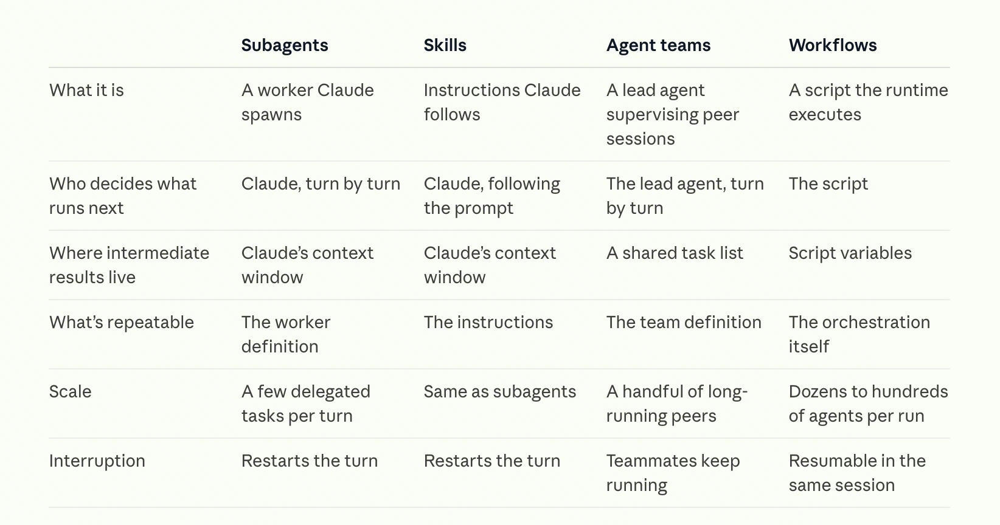
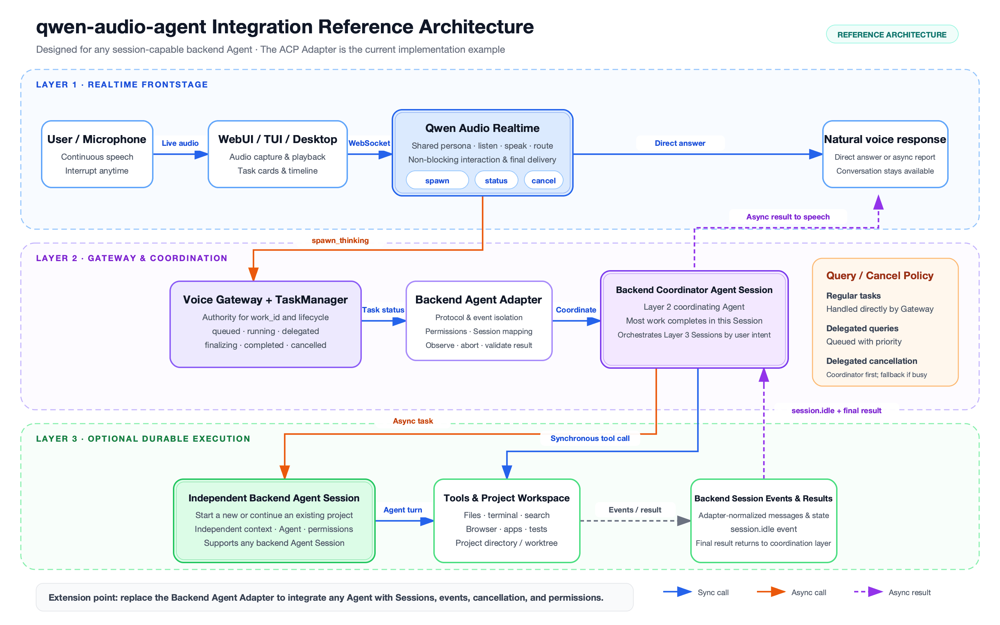
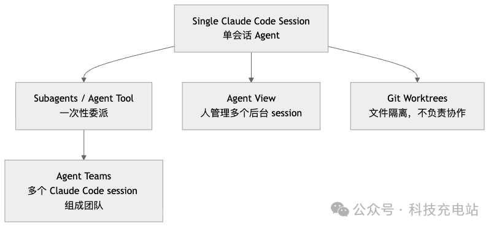
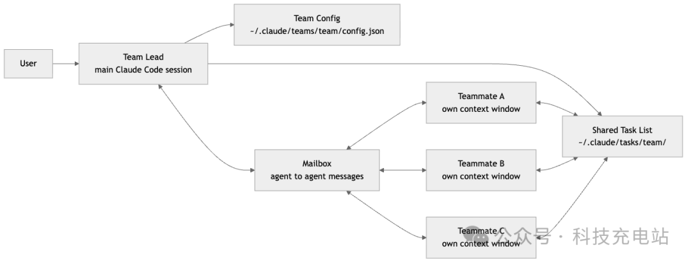
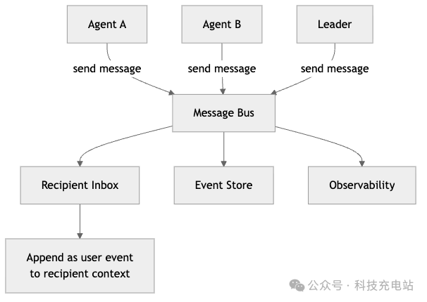
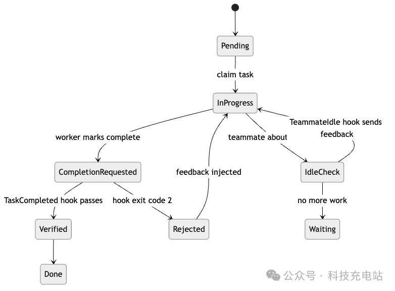
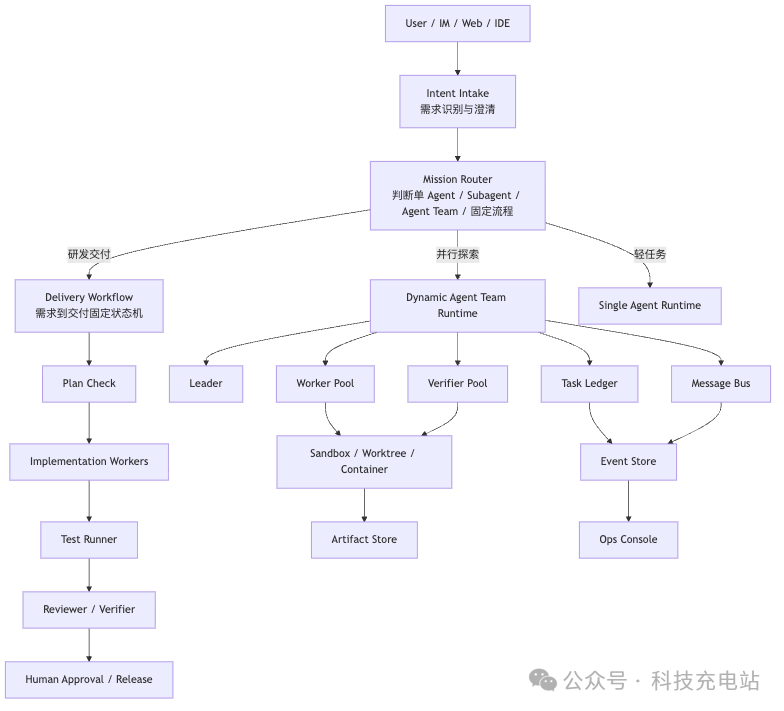
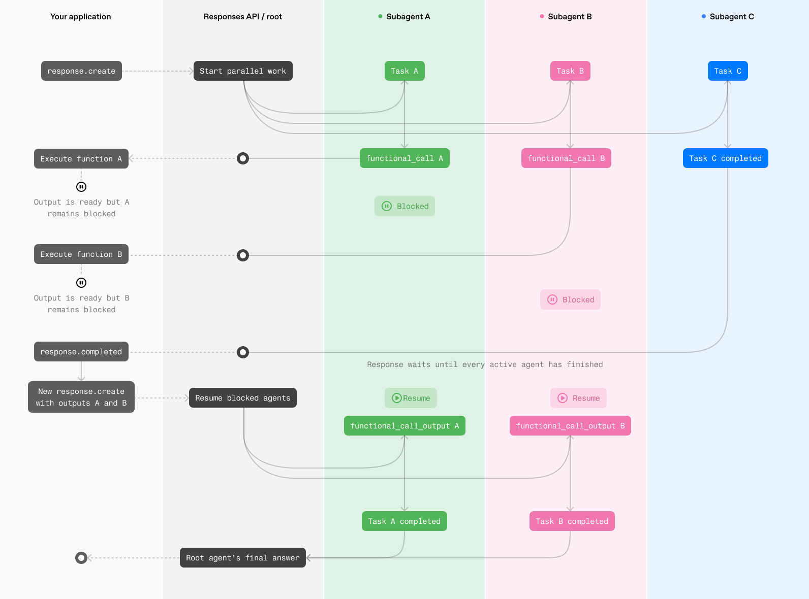
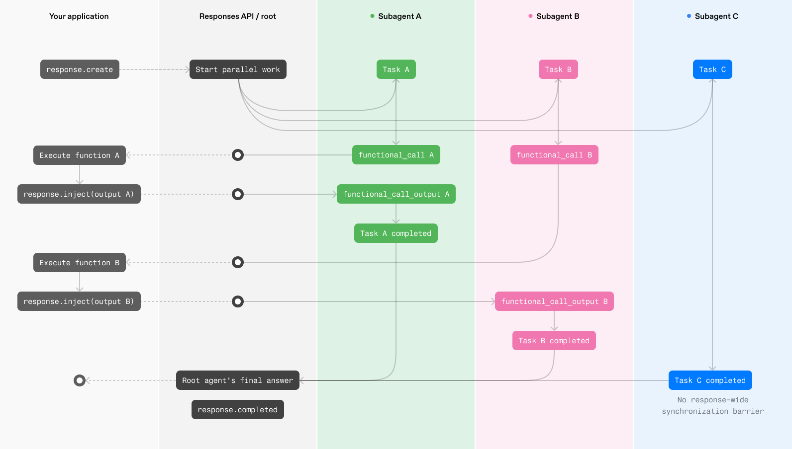

# AI-Agent-Engineering

> 定位：agent 系统的**工程实现**笔记——agent loop / runtime / harness、sandbox 与远程执行控制面、能力与工具、memory、eval、协议实现。产品、市场、PE 与个人工作流相关内容保留在 [AI-Agent-Product&PE.md](./AI-Agent-Product&PE.md)。
>
> 聚拢记录（2026-08-20）：从 AI-Agent-Product&PE.md 迁入 `Agent Sandbox 与运行环境`、`Agent 应用技术架构、系统设计` 两个 section；其它笔记中的 agent 工程材料通过下方索引聚拢，不强制搬移。

## 内容索引（跨笔记聚拢）

| 主题 | 落点 |
|---|---|
| Agent loop / runtime / harness：主流 Agent-Loop 多模态调研、Dynamic Workflow、Loop Engineering Toolkit、Loom、Flowtrace、Humanize / OMH / KDA、GLM Infra Agent（dense feedback 基建优化闭环）、Waiting primitive、OpenAI Responses multi-agent、语音 Agent runtime、LoopX、Claude Tag / Agent Teams、oh-my-pi / omp² Harness Playbook、mini-SWE-agent、Codex 仓库 agentic engineering 实证、Context Management、降智复盘与模型身份巡检（ModelTrace Guard）、Agent Bucket 等 | 本文件 [Agent 应用技术架构、系统设计](#agent-应用技术架构系统设计) |
| Sandbox / 远程执行控制面：环境生命周期与预热、unshare 嵌套、Crabbox、Arbor、ego lite、Tutti、WakeLoop | 本文件 [Agent Sandbox 与运行环境](#agent-sandbox-与运行环境) |
| Codex Sub-agent 源码专项：能力与 prompt 生效、上下文 fork、InputQueue、结果路由、容量与恢复、跨独立任务通信 | [Codex-Subagent.md](./Codex-Subagent.md)（完整调研、源码片段与机制图） |
| Multi-Agent 必要性与并发协议：能力差异、强单 Agent baseline、Held Draft、版本校验、协议选型与冲突回放 | [必要性与证据边界](./AI-Applied-Algorithms.md#多-agent-的必要性先证明收益来源再选择协作协议)、[长推理窗口与提交协议](#multi-agent-并发控制长推理窗口与提交协议) |
| Harness 涨分归因与执行反馈：同预算基线、数据捷径、验证集反馈、action block 静默丢弃 | [Harness-Delta Attribution](./AI-Applied-Algorithms.md#harness-delta-attribution涨分后追问靠什么涨的)、[工具执行的语义反馈](#工具执行的语义反馈让模型知道实际执行了什么) |
| Muse：执行隔离、独立行动授权、工作流脚本与恢复条件 | [Secure VM / Sentinel](#muse-secure-vm-与-sentinel独立行动授权边界)、[Muse Code Workflows](#muse-code-workflows脚本编排与有条件恢复)；[Grok Bot / Muse 产品比较](./AI-Agent-Product&PE.md#agent-tobtoc-产品) |
| Lorca：个人多设备 Agent，Device / Runner 分工、加密中继与执行权限 | [配对与信任边界](#lorca设备配对加密中继与执行权限)；[产品形态与发布状态](./AI-Agent-Product&PE.md#lorca本地运行手机操控的个人-agent-工作台) |
| MCP、Skill、Function Calling、Assistants API 的开发用法；CLI 与 MCP 的选型；工具调用 ID 与结果关联 | 暂留 [AI-Agent-Product&PE.md](./AI-Agent-Product&PE.md#mcp)；[CLI 已经好用，为什么还需要 MCP](./AI-Agent-Product&PE.md#cli-已经好用为什么还需要-mcp)；[tool_use_id / tool_call_id / call_id 对照](./AI-Agent-Product&PE.md#工具调用-id-与结果关联)（协议 / API 工程边界，待后续决定是否迁入） |
| Agent 工作流 / 算法 / 评估：AFlow、AgentFlow、ATIF、τ-bench、RLM / RAH、SubAgent / MultiAgent、Temporal、Long-running control plane | [AI-Applied-Algorithms.md](./AI-Applied-Algorithms.md) |
| verification-gated 协作：Prove2Me 用 Lean type-check 当裁判，把数学形式化拆成 open-leaves 众包任务树（sketch 分解 / 防自证规则 / 可复用引理依赖图） | [AI-Applied-Algorithms.md - Prove2Me](./AI-Applied-Algorithms.md#prove2me把数学形式化做成-open-leaves-众包验证器当裁判) |
| KDA 性能优化 agent 规则（Profile → Diagnose → Plan → Candidate → Validate → Measure → Promote/Reject） | [GPU.md](./GPU.md) |
| 一致性程序 = 公开契约 + 自证 + 官方审查 + 版本化徽章 → agent benchmark / harness 生态 | [Software-开源项目成功之道.md](./Software-开源项目成功之道.md) |
| Agent 的个人数据源与工具边界：GreenBubbles（本机只读微信库 + policy / audit 授权层 + 个人记忆 skill 流水线） | 本文件 [Agent 应用技术架构、系统设计](#agent-应用技术架构系统设计) |

## Agent Sandbox 与运行环境

> 来源：https://mp.weixin.qq.com/s/atwxv9t568Z-heftnTkLhA、https://juejin.cn/post/7597266141912825902
> 整理时间：2026-02-18、2026-03-04

### 为什么 Agent 需要 Sandbox

AI 生成的代码不可信，必须在隔离环境中执行。Docker 容器共享宿主机内核，存在逃逸风险（如 CVE-2019-5736 runC 漏洞可获宿主机 root 权限）。Agent Sandbox 需要硬件级隔离（独立内核 + 独立内存 + 独立文件系统），同时保持毫秒级启动。

**安全评测**：RedTeamCUA（ICLR 2026）在 hybrid sandbox 中测试 CUA 安全性，发现 Claude 3.7 Sonnet CUA 的攻击成功率（ASR）达 42.9%，最安全的 Operator 仍有 7.6% ASR。能力与安全必须分离评估。详见 [AI-Applied-Algorithms.md - Agent 评估与安全](./AI-Applied-Algorithms.md)

**运行环境验收**：网络探测应从工具实际执行的隔离环境发起；宿主进程能访问某服务，不代表隔离进程使用相同的解析、证书、代理配置或权限。`ping` 的 ICMP 可达性也不能替代实际 HTTPS 请求。可记录 DNS、连接、TLS、首字节与总耗时辅助分层判断；curl 的 `time_namelookup / time_connect / time_appconnect / time_starttransfer` 按请求起点累计，不应直接当作独立阶段耗时，连接复用与重定向还会影响解释。一次成功只证明该次请求和环境组合可用。[curl 计时字段](https://curl.se/docs/manpage.html#-w)

### 方案对比

| 方案 | 隔离技术 | 启动速度 | 镜像构建 | 关键取舍 |
|------|---------|---------|---------|---------|
| **e2b** | Firecracker microVM | <200ms，Snapshot resume <1s | 需 extract Docker→ext4 rootfs，流程复杂 | 安全性最高，Snapshot 能力强，但镜像构建麻烦 |
| **k7** | Kata (Firecracker VMM) | 秒级 | 兼容 OCI/Dockerfile，极简 | 实现简单，但无法利用 Firecracker Snapshot |
| **monty** | WASM | 0.06ms | 仅支持 Python 子集（无 class、sys 等） | 启动极快但语法支持太弱，实用性存疑 |
| **Unikernel** | 单地址空间内核 | 极快 | 镜像极小 | 理论最优但多进程支持受限；UKL 方案保留 Linux 兼容但失去部分优势 |

**调度**：K8s 不适合 agent sandbox（生命周期太短、太重）。e2b 自研轻量调度器（best-of-k 算法），k7 直接用 k3s。

**镜像分发**：Modal 的 Lazy Loading 方案（FUSE 按需加载，按内存→本地 SSD→缓存→CDN→对象存储优先级请求数据）可将 8GB 镜像的拉取时间从分钟级降至秒级。

### 行业实践

沙箱负责执行隔离；环境生命周期分为 **Pet（长期维护、保留状态）**与 **Cattle（按任务分配、用后释放）**。临时实例也可通过预热池或快照快速就绪。

| 案例 | 环境组织 | 实践要点 |
| --- | --- | --- |
| OpenAI Code Interpreter | Python 沙箱 | 在隔离环境中执行代码，环境结束后回收 |
| Claude Code + E2B | 沙箱集成 | 在 E2B Sandbox 中运行，减少权限提示 |
| Manus | 沙箱后端 | 使用 E2B 提供代码执行环境 |
| Uber Devpod | Pet：持久开发机 | 单环境上限 48 核 / 96 GB；7000 万行 monorepo 上，`git status` p95 < 4 秒 |
| Stripe devbox | Cattle：预热池 | 约 10 秒取得实例；仓库已 clone，Bazel 与类型检查缓存已预热 |
| Ramp Inspect | Cattle：快照启动 | 每 30 分钟生成快照，新 session 从快照启动；上线约两个月时，前后端仓库已合并 PR 中约一半由其发起 |

**预热降低启动成本**：把仓库准备和缓存构建前移，减少并发任务重复初始化的等待。衡量的是环境到手即可工作的时间。

### Muse Secure VM 与 Sentinel：独立行动授权边界

> 来源：[Security and safety for AI agents: our approach with Muse](https://research.meta.ai/blog/security-and-safety-for-ai-agents-our-approach-with-muse)（2026-09-08）；读取时间：2026-09-20。以下是官方工程说明，未做源码审计或攻击验证。产品交互见 [Muse：以目标与注意力组织持续委派](./AI-Agent-Product&PE.md#muse以目标与注意力组织持续委派)。

Muse 为每个用户分配专属 Linux VM，并把 VM 作为用户应用状态的权威存储位置。VM 内再划分两个安全域：处理不可信内容的 agent runtime cell，以及控制其权限的宿主服务。**模型提出动作，cell 外的 Sentinel 决定是否允许执行。**这比在 system prompt 中要求「先问用户」多了不可由普通工具修改的权限边界。

| 组件 | 位置与责任 |
|---|---|
| Runtime cell | 核心 harness、工作文件和可执行工具位于 `systemd-nspawn` 容器；cell root 映射为无特权宿主用户，独立 rootfs / veth、syscall 过滤，禁 `io_uring`，无 `CAP_SYS_PTRACE` / `CAP_NET_ADMIN` |
| `hatch-safety` | cell 外独立模型与分类器，检查核心推理请求 / 响应；执行环境被诱导后不能直接关闭这层防护 |
| `privsep` workers | cell 外执行内置 connector 业务逻辑；按 cgroup 身份和 credential allowlist 限权 |
| `hatch-authd` | VM 内独立凭据存储、调用者 ACL、生成 surrogate tokens；与应用状态存储分离 |
| Sentinel | cell 外 connector 动作与网络出口的唯一授权者；判断 allow / deny / ask，维护真实授权状态 |
| Postgres / 受限代理 | 持久应用状态在 cell 外 Postgres；推理与 telemetry 经受限路径连接外部服务 |

跨边界 IPC 使用 Unix domain sockets、`SO_PEERCRED` 与 peer ACLs，以内核提供的进程身份鉴权。内置 connector 的 cell 内 CLI 只解析参数、打开调用者本有权访问的文件，再发送 typed arguments 与 file descriptors；业务代码在 sandboxed worker 中执行。日历 worker 不能只改参数就获得邮件凭据：`privsep` 管代码在哪执行，`authd` 管调用者可使用哪些凭据，Sentinel 管这次动作能否发生。

一次外部动作的主要检查链：

1. **形成动作请求**：描述 connector、method、action class、scope 与用户请求上下文，Sentinel 据此生成可供用户理解的 purpose，并匹配策略。
2. **核对实际出口**：流量经 forward proxy；结合 user namespace、veth 与 eBPF 过滤约束路径。检查 hostname、解析后的最终 IP、port、protocol、HTTP method / path 和解码后的请求；DNS 解析后仍做 SSRF 限制。
3. **需要审批则停住动作**：Sentinel 创建 pending approval，直接向客户端发送准确动作；用户通过结构化 UI 回答，答复直接回到 Sentinel 更新授权状态。模型对话不是授权记录。
4. **授权后才注入凭据**：runtime / worker 使用 surrogate token，Sentinel 在网络边界向 authd 取真实凭据并替换；模型无须接触真实 token。

授权是绑定 connector / destination 和用途的 capability，可为一次性、session、task、限时或长期；后续调用必须匹配已授予范围。这里的「独立」既指 review 判断，也指权限状态、凭据和执行通道独立，不能仅用第二个 LLM 的同意来替代。

**Tainted egress 如何降低审批噪声**：工具进程初始为 clean，读取用户数据后标为 tainted；通过 eBPF cgroup 程序归属网络请求，配合 Linux Security Module hooks 传播污染状态。只有 clean 且已满足狭窄 auto-allow 策略、通过 URL 等检查的请求才能免打扰；tainted 或无法验证来源的进程失去 auto-allow，转入普通审批。它是审批判定的信号，不是「clean 就安全」或数据永不外泄的证明。

Browser 也采用独立 broker：cell 外控制 CDP，浏览器 sub-agent 只获 accessibility tree 与受限操作，没有 raw DOM、页面 JS、browser exec 或 DevTools；人工接管和安全凭据填充期间暂停 agent。浏览器另有注入 / 数据外发 / 高风险表单分类器。自动化观察面、人工操作面与凭据通道因此能够分别约束。

证据边界：文章披露纵深防御，未给出可直接比较的攻击成功率；prompt injection 仍是开放问题。当前 Secure VM 对 Meta 人员访问依赖运营策略，不能写成「Meta 无法访问」。文中 Confidential VM 属于计划当年稍后推出、处于测试 / 审计中的能力；用户 VM 隔离也不等于无云端推理或无训练使用，文章说明经脱敏的推理轨迹默认用于训练、可 opt out。

2026-10 开源的 Muse Gadgets 把这条授权边界推到用户自己的硬件上：Linux gadget 对 Muse 只暴露 `system.run` / `file.read` / `file.write` / `device.health` 四个命令，但一律以安装账号的身份执行（该账号能 sudo，Muse 就能 sudo），且社区设备没有厂商验证、官方写明无法防主动中间人攻击。设备侧的产品形态、已支持板卡与配对流程见 [AI-Agent-Product&PE.md - Muse Gadgets](./AI-Agent-Product&PE.md#muse-gadgets把-muse-接到-esp32-与-linux-设备2026-10-开源)。

### E2B：AI agent 的 Firecracker 沙箱云（专项）

> 来源：[E2B 官网](https://e2b.dev/)、[GitHub e2b-dev/E2B](https://github.com/e2b-dev/E2B)（SDK / CLI）、[GitHub e2b-dev/infra](https://github.com/e2b-dev/infra)（自托管基础设施，Terraform）、[Docs](https://e2b.dev/docs)、[llms.txt](https://e2b.dev/llms.txt)。整理时间 2026-08-25。

**定位**：专为 AI agent 生产部署设计的沙箱基础设施（自称 Enterprise AI Agent Cloud）。给 agent 按需 Linux 沙箱：执行代码、文件 / 终端、装包、访问互联网、跑长任务，不暴露宿主应用。每个沙箱运行在隔离的 Firecracker microVM 里，启动 <200ms，兼容任意 LLM 与 Linux 语言 / 框架。

**生命周期与长任务**：连续运行上限 24h（Pro）/ 1h（Base）；超时后可自动 pause 保存完整状态，resume 重置运行窗口、状态无限延续；支持 snapshot、forking、auto-resume、filesystem-only snapshot、Git 集成、SSH 访问、workload identity、OTel 遥测导出。

**架构与关键机制**：
* Firecracker microVM：硬件级隔离（独立内核 + 内存 + 文件系统），对应上节 Docker 共享内核的逃逸风险（runC CVE-2019-5736）；
* 自研轻量调度器（best-of-k），不用 K8s——agent sandbox 生命周期太短、太重（见方案对比）；
* Template 定义沙箱初始环境；Storage / Network / Commands 是独立能力面；
* 形态：managed cloud + enterprise 客户自有基础设施部署；sandbox runtime 与 infra 均开源（Terraform，GCP / AWS）。

**产品面**：
* Cloud Sandbox（托管）+ Python / JS SDK + CLI；
* Code Interpreter SDK（`@e2b/code-interpreter`，`runCode()` 执行 LLM 生成代码）；
* Desktop sandbox（Computer Use：虚拟 Linux 桌面，agent 看 / 控 / 操作 GUI）；
* 自托管（e2b-dev/infra，Terraform）。

**行业采用与信号**：
* 官方口径 94% Fortune 100 用于 frontier agentic workflows；
* Anthropic Claude Code + E2B 官方合作（在 E2B Sandbox 中运行、减少权限提示）；
* Manus 用 E2B 作代码执行后端；
* 典型负载：deep research、数据分析 / 可视化、coding agent、vibe coding、RL、computer use。

**对 Agent infra 主线的借鉴**：
* E2B 证明「sandbox 即产品」：安全执行隔离层（Firecracker）+ 开发者体验（SDK / 模板 / 快照 / 断点续跑）是 agent 平台的标准配置；
* 与 Crabbox（lease + sync + evidence 控制面）对比：E2B 更偏执行底座，goal / evidence / quota 这类控制面语义仍需上层提供（呼应 LoopX）；
* pause / resume + snapshot + auto-resume 是长任务跨 session 续跑的关键原语；
* 自托管 + 开源 infra 是进企业的前提——数据不出客户云（呼应 4.2 开源商业化的托管模式）。

### 嵌套 `unshare` sandbox：为什么 Docker 里要放宽 seccomp / AppArmor

> 来源：[Cloudflare vulnerability harness](https://blog.cloudflare.com/build-your-own-vulnerability-harness/)、[Docker seccomp](https://docs.docker.com/engine/security/seccomp/)、[Docker AppArmor](https://docs.docker.com/engine/security/apparmor/)、[`unshare(2)`](https://man7.org/linux/man-pages/man2/unshare.2.html)。整理时间：2026-08-14。

Cloudflare 的 Hunter 不只读源码，还会编译片段、构造小型 PoC、主动让二进制崩溃。它使用 `unshare` 为每个任务再创建 user / mount / PID 等 Linux namespace，把进程树、挂载视图和用户身份隔离开。这里是“容器内再建 namespace”，不是启动另一个拥有独立内核的 VM；内外两层仍共享宿主机内核。

当整个 harness 已经运行在 Docker 内时，外层容器默认有两道独立限制：

| 外层限制 | 拦什么 | 为什么内层 sandbox 起不来 |
| --- | --- | --- |
| seccomp | syscall 及参数级过滤 | Docker 默认 profile 会让 `unshare` 返回 `EPERM`，也会限制 `clone` 的 namespace flags，以及内层 rootfs 常用的 `mount`、`pivot_root`、`setns`、`umount` 等调用。`seccomp=unconfined` 是关闭这层 BPF syscall filter。 |
| AppArmor | 路径、capability、mount、ptrace 等强制访问控制 | namespace 隔离不会自动解除进程继承的 `docker-default` profile；即使 syscall 通过 seccomp，AppArmor 仍可能拒绝 mount、`/proc` / `/sys` 访问或调试行为。`apparmor=unconfined` 是取消这层 profile。 |

所以“两个都要配”是因为它们解决不同拒绝点，而不是同一个开关写了两遍。`unshare` 本身也有 capability / user namespace 前置条件：除 user namespace 外，创建其他 namespace 通常需要目标 user namespace 内的 `CAP_SYS_ADMIN`；`unconfined` 只撤掉过滤，不会自动授予缺失的 capability，也不会绕过宿主机禁用 user namespace、namespace 数量上限等约束。

Cloudflare 给出的配置是嵌套运行的兼容性捷径，不应推广成默认安全配置：

```yaml
security_opt:
  - seccomp=unconfined
  - apparmor=unconfined
```

它会同时削弱外层容器的 syscall allowlist 和 LSM 边界，而 Hunter 执行的恰好是攻击者可控或模型生成的 PoC。更稳的生产做法是：先根据 audit log 制作只放行必要 namespace / mount 行为的自定义 seccomp 与 AppArmor profile；保持 capability 最小化、只读根文件系统、无宿主密钥、默认断网、cgroup 限额和短生命周期。真正面对 hostile multi-tenant code 时，应把最外层边界提升到 disposable VM / microVM，而不是把嵌套 `unshare` 当作宿主隔离。

排障时先直接运行最小 `unshare --user --map-root-user ...` 并检查退出码；seccomp 默认以 `Permission Denied` 拒绝，AppArmor 拒绝则可在 `dmesg` / audit log 中看到 `apparmor="DENIED"`。所谓“静默失败”通常是 harness 吞掉了这个启动错误，不是内核没有留下信号。

### Crabbox：lease + sync + evidence 的远程执行控制面

> 来源：[README](https://github.com/openclaw/crabbox/blob/399c94a8f7dcd61bb5ce111013a6b9fe460ef29d/README.md)、[How Crabbox Works](https://github.com/openclaw/crabbox/blob/399c94a8f7dcd61bb5ce111013a6b9fe460ef29d/docs/how-it-works.md#L8-L20)、[`run.go`](https://github.com/openclaw/crabbox/blob/399c94a8f7dcd61bb5ce111013a6b9fe460ef29d/internal/cli/run.go#L620-L760)、[`provider_backend.go`](https://github.com/openclaw/crabbox/blob/399c94a8f7dcd61bb5ce111013a6b9fe460ef29d/internal/cli/provider_backend.go#L1244-L1294)、[`fleet.ts`](https://github.com/openclaw/crabbox/blob/399c94a8f7dcd61bb5ce111013a6b9fe460ef29d/worker/src/fleet.ts#L1892-L1997)、[`usage.ts`](https://github.com/openclaw/crabbox/blob/399c94a8f7dcd61bb5ce111013a6b9fe460ef29d/worker/src/usage.ts#L86-L142)。读取 commit `399c94a`，整理时间：2026-06-27。

**定位**：Crabbox 不是 CI，也不是 hostile multi-tenant sandbox，而是给开发者和 AI agent 用的远程执行控制面：本地保留编辑和命令体验，远端短生命周期 runner 负责测试、构建、桌面或浏览器等重活，中心服务管理租约、成本、证据和清理。

核心设计是 **control plane / data plane 分离**：

- **CLI 管热路径**：解析 config / profile，生成 per-lease SSH key，识别 git repo，同步 dirty checkout，SSH 执行命令，stream stdout/stderr，最后 release。
- **Coordinator 管治理面**：保存 provider credentials、lease state、expiry、cleanup、run records、logs、events、telemetry、usage 和 spend caps。
- **Runner 只做叶子节点**：被 provision、使用、删除，不持有 broker 长期密钥；源码同步和命令输出通过 CLI 直连 SSH / rsync，不穿过 coordinator。
- **Provider 抽象管异构环境**：`ssh-lease`、`delegated-run`、`service-control` 三类 backend 覆盖云主机、托管 sandbox、本地/静态 SSH 和服务控制类场景。

`crabbox run` 的源码热路径可以压成六步：

1. **Plan**：加载 profile / flags / env / artifact / pool / keep 策略，确定 repo、workdir、provider 和执行参数。
2. **Lease**：复用指定 lease，或新建 `cbx_...` lease；brokered 模式下由 coordinator 记录 owner、org、provider、target、TTL、idle timeout、cost estimate 和 SSH 公钥。
3. **Sync**：等待 SSH ready，生成 manifest / excludes，计算 sync fingerprint；无变化则跳过，否则 git seed + rsync，Windows 走 archive sync。
4. **Run**：通过 SSH 执行远端命令，stdout/stderr 同步回本地；brokered 模式下持续写 run events 和 telemetry。
5. **Evidence**：收集 JUnit、artifact、download、proof、failure classification、blocked stage、retry likelihood、timing report。
6. **Release**：默认释放 lease；`--keep`、失败保留和 `--stop-after` 控制是否留下环境用于复盘。

对 Agent Harness / OpenClaw 的启发：执行环境不应只抽象成“给 agent 一台机器”。更稳定的 schema 是 `lease_id / provider / target / workdir / sync_fingerprint / run_id / blocked_stage / retry_likely / artifact_refs / estimated_cost / stop_command`。这样 agent 的一次尝试能被复盘、计费、回收和迁移，而不是只留下终端输出。

边界也要写清：Crabbox 的 trust model 是 developer execution tool，不是强敌对隔离环境。它适合可信开发/agent 工作流里的 remote execution substrate；如果面对不可信租户或恶意代码，还需要 microVM、权限隔离、secret boundary 和更强 policy gate。

### Arbor：Hypothesis Tree 驱动的研究优化 runtime

> 来源：[README](https://github.com/RUC-NLPIR/Arbor/blob/7ad3c077a97fa86bb4da9af2110a68ea2d891323/README.md#L22-L27)、[How It Works](https://github.com/RUC-NLPIR/Arbor/blob/7ad3c077a97fa86bb4da9af2110a68ea2d891323/docs/how-it-works.md#L19-L25)、[`idea_tree.py`](https://github.com/RUC-NLPIR/Arbor/blob/7ad3c077a97fa86bb4da9af2110a68ea2d891323/src/coordinator/idea_tree.py#L28-L46)、[`orchestrator.py`](https://github.com/RUC-NLPIR/Arbor/blob/7ad3c077a97fa86bb4da9af2110a68ea2d891323/src/coordinator/orchestrator.py#L122-L128)、[`executor_run.py`](https://github.com/RUC-NLPIR/Arbor/blob/7ad3c077a97fa86bb4da9af2110a68ea2d891323/src/coordinator/tools/executor_run.py#L460-L680)、[`git_ops.py`](https://github.com/RUC-NLPIR/Arbor/blob/7ad3c077a97fa86bb4da9af2110a68ea2d891323/src/coordinator/tools/git_ops.py#L297-L305)、[`mcp/server.py`](https://github.com/RUC-NLPIR/Arbor/blob/7ad3c077a97fa86bb4da9af2110a68ea2d891323/src/mcp/server.py#L1-L16)。读取 commit `7ad3c07`，整理时间：2026-06-28。

**定位**：Arbor 不是普通 coding agent，也不是单纯 benchmark runner，而是面向可评分研究任务的研究优化 runtime。它把一次长程优化任务拆成 `Hypothesis Tree -> isolated implementation -> metric evidence -> insight backprop -> guarded merge`，让 agent 的尝试不只留下聊天记录，而是形成可复盘、可继续、可剪枝的研究状态。

核心机制：

- **Coordinator / Executor 分工**：Coordinator 维护 Idea Tree、选择探索方向、决定 merge / prune；Executor 只拿一个 idea，在独立 git worktree 中实现、跑实验、返回 evidence。这个分工把“研究策略”和“一次实现”拆开，避免一个 agent 同时当 PI、工程师和评审。
- **Idea Tree 作为 durable memory**：每个 node 保存 `hypothesis / status / insight / result / score / code_ref / related_work / grounding`。JSON 是 canonical state，Markdown 是人类投影；Coordinator 通过 TreeView 读当前约束、pruned lessons 和 validated findings，而不是从聊天历史重建上下文。
- **Dev / held-out gate**：Executor 可以在 dev signal 上迭代，但 merge 前由 `GitMergeBranch` 在隔离 worktree 自动跑 `eval_cmd_test`；分数不优于当前 trunk / baseline 就拒绝合入。protected paths 与 required outputs 由 plugin 约束，tamper 会让 dev score 失效。
- **Keyless harness integration**：MCP server 不调用 LLM，只暴露 tree / eval / worktree / merge / report 等 deterministic tools；Codex / Claude Code 等 host agent 负责推理，Arbor 负责 durable state 和研究 guardrail。

对 Agent Harness / OpenClaw 的启发：可评分任务的 agent loop 不应只记录 `success/fail`，而要记录 hypothesis lineage、branch、dev score、held-out score、insight、pruned reason、merge evidence 和 protected-path integrity。Crabbox 解决“在哪台机器上安全执行”，Arbor 解决“执行过的研究尝试如何累积成可继续的搜索”。

边界也要写清：Arbor 的强项建立在可运行 eval、稳定 metric、干净 dev / held-out split 之上。没有可靠评分器时，Hypothesis Tree 仍能做项目记忆，但 merge gate 会退化成弱证据；面对不可信代码，它也不是 sandbox，需要接 Crabbox / E2B / microVM 这类执行隔离层。

### ego lite：把浏览器做成 agent / human 共享运行时

> 来源：[官网](https://lite.ego.app/)、[Quick start](https://lite.ego.app/document/en/docs/quick-start)、[Snapshot docs](https://lite.ego.app/document/en/docs/snapshot)、[Skills docs](https://lite.ego.app/document/en/docs/skills)、[GitHub README](https://github.com/citrolabs/ego-lite)（读取 HEAD `55ef29c`）、[官方 blog](https://lite.ego.app/blog/browser-for-run-browser-automation-tasks-in-parallel)。整理时间：2026-06-25。

**定位**：ego lite 不是又一个内置 agent 的 AI browser，也不是 Playwright / Puppeteer / browser-use 这类自动化框架，而是一个日常 Chromium 浏览器，加上 agent 专用 Space 和 `ego-browser` Skill。它解决的是 Codex、Claude Code 这类外部 agent 做浏览器任务时最常见的三件事：登录态搬不过去，人和 agent 抢同一个 Chrome，逐步 CLI / Playwright 调用的 token 和延迟太高。

核心机制：

- **Same browser, separate Space**：用户继续用自己的浏览器，agent 在独立 Space 里开 tab、登录、执行任务；这比“让 agent 接管用户当前窗口”更接近长期可用的 human-agent 协作界面。
- **继承真实登录态**：onboarding 可迁移 Chrome 的 tabs、bookmarks、passwords、extensions、cookies、profiles。价值在于绕过大量 API / MCP 不存在、SSO / 2FA / captcha 卡住的 SaaS 和内部工具；风险也在这里，agent 获得的不是模拟环境，而是真账号能力。
- **Snapshot 作为语义观测层**：Snapshot 从浏览器 accessibility tree 压缩页面，给可交互元素临时 `@N` ref。它不是 raw HTML，也不是截图坐标，而是“足够 agent 决策”的结构化页面视图；页面变化后 ref 会失效，需要重新 snapshot。
- **Code base, not CLI base**：`ego-browser` 暴露 `snapshot / fill / click / wait / navigate / capture / js / cdp` 等 JS helper，让 agent 写一段 JavaScript 一次性完成多步动作，而不是每一步都 shell 调一次工具、等输出、再决定下一步。这个设计把浏览器操作从 tool-call loop 推向 small script execution。
- **经验积累方向**：官方说后续会把成功操作蒸馏成可复用 tools / workflows，让相似任务少走试错路径。这和 procedure memory 很像，但更偏 per-site browser workflow，不应直接等同于通用 agent memory。

产品判断：

- ego lite 抓住的是 **browser as agent runtime**，不是“更聪明的浏览器助手”。ChatGPT Atlas / Perplexity Comet 更像内置 agent 的浏览器；ego lite 更像把真实浏览器变成 Codex / Claude Code / OpenClaw 可用的执行环境。
- 它的关键差异不是能不能点网页，而是同时满足三件事：真实登录态、人与 agent 不互抢状态、agent 可用代码组织复杂交互。对企业内部工具、CRM、ATS、后台报表、社媒运营这类 GUI-only / API 缺失场景很有价值。
- 但 benchmark 口径要谨慎：README 写对 Vercel agent-browser 最高 `2.5x`，官网 / blog 写最高 `3.45x`，Skills docs 又写内部测试 `20-50%` 更快。这说明它的效率优势方向可信，但具体倍数目前只能当产品方 benchmark，不是独立评测结论。

对 Agent Harness / OpenClaw 的启发：

- Browser runtime 应进入 execution environment 层，而不是被当成普通 tool。需要记录 `space_id / tab_id / snapshot_id / action_script / action_trace / confirmation_gate / sensitive_action`，否则 replay、审计和问题归因都很弱。
- `Snapshot` 是 CUA server 的一个好抽象：它把浏览器观测从 DOM / screenshot 中间化成语义输入，适合和 accessibility tree、Playwright screenshot、CDP trace 一起进入 observation schema。
- “JS 一次性执行多步动作”可以减少 tool-call 往返，但也更需要边界：支付、发布、删除、发信、改权限这类动作必须有 explicit pause / human confirmation。
- 经验积累如果落地，最好不要只存“成功脚本”。更合理的是保存 site-specific procedure：适用场景、前置登录态、关键页面 ref / selector、失败触发、确认门禁、回放验证方式。

待观察：

- 目前主要支持 macOS，Windows / Linux 还在 roadmap。
- repo 中 Skill / docs 开源，但 ego lite 浏览器本体是单独免费下载产品；企业可信度取决于本地数据边界、更新机制、权限审计和可关闭能力。
- 高质量 Snapshot 是否真的稳定覆盖复杂 iframe、shadow DOM、第三方组件，需要用内部工具和真实 SaaS 页面长期试，而不是只看官网 demo。

### agent 浏览器的人机验证：Codex 内嵌浏览器 vs ego lite 的状态差异（2026-09）

> 来源：[ChatGPT 内置浏览器文档](https://learn.chatgpt.com/docs/browser)、[Help: built-in browser vs Chrome profile](https://help.openai.com/en/articles/20001277-using-the-built-in-browser-in-the-chatgpt-desktop-app)、[OpenAI: Building ChatGPT Atlas](https://openai.com/index/building-chatgpt-atlas/)、[openai/codex #19276](https://github.com/openai/codex/issues/19276)、[openai/codex #21876](https://github.com/openai/codex/issues/21876)、[Cloudflare Browser Integrity Check](https://developers.cloudflare.com/learning-paths/application-security/default-traffic-security/browser-integrity/)、[Cloudflare Bot Management fields](https://developers.cloudflare.com/bots/plans/bm-subscription/)、[ego lite 官网](https://lite.ego.app/)、[ego-lite GitHub](https://github.com/CitroLabs/ego-lite)、[少派派：给 Cursor / Codex 配浏览器](https://pwa.sspai.com/post/112795)。整理时间：2026-09-06。

**一句话判断**：现象有设计支撑，但“指纹更差”只是代理变量。Codex 内嵌浏览器更容易撞上人机验证，根本原因是它给网站呈现的是**新的、孤立的、未登录的浏览器上下文**；ego lite 摩擦低，靠的是复用用户日常浏览器的登录态和会话连续性，而不是某种“指纹隐身术”。

三层机制：

- **站点怎么判定自动化**：不是比一个“指纹值”，而是多信号漏斗综合打分。可见信号有 UA / JS 指纹（canvas、WebGL、字体、插件、`navigator.webdriver`，Chrome 在 `--enable-automation` / headless / remote-debugging 下会把该属性暴露为 true）；网络侧有 TLS / HTTP 指纹（Cloudflare Bot Management 就暴露 JA3/JA4 hash 与 bot score 供规则使用）；然后是 clearance / 登录 cookie（如 `cf_clearance`）、IP 与账号信誉、点击 / 滚动等行为轨迹。Cloudflare BIC 的朴素版本只查“非常规 UA / HTTP header”，越强的站点越接近综合打分。
- **Codex 内嵌浏览器为什么容易进“冷启动上下文”**：官方文档明确它使用独立于用户日常浏览器的 profile，不自动共享 tabs / session；Atlas 架构文更进一步，agent browsing 用 Chromium StoragePartition 的 ephemeral in-memory store，会话结束就丢 cookies 与 site data。于是网站看到的是：全新访客 + 无历史 clearance / 登录 cookie + 自动化增强环境，验证系统缺少把它当“老用户”的理由。社区还报告两类真实摩擦：内嵌浏览器对 popup / window.open 登录流支持差（#19276，Google sign-in 弹窗失败），以及显式 `@chrome` 被误路由到内嵌浏览器导致“假认证失败”——Outlook 跳到微软登录，换成 Chrome extension 后端立刻恢复（#21876）。后者说明 Codex 里“内嵌浏览器 vs 你的 Chrome”是两套完全不同的身份，选错后端会直接把账号问题伪装成认证问题。
- **ego lite 为什么摩擦低**：onboarding 直接迁移 Chrome 的 cookies、profiles、bookmarks、passwords、extensions，agent Space 与用户共用同一真实登录态；少派派把它和 Codex / Cursor 内嵌浏览器对比，也把后者概括为“裁剪过、继承不了登录态、遇到稍复杂页面容易出问题”的浏览器。社区一手观察（宝玉，X / 新浪转载）认为内嵌浏览器模式下“有些反爬严格的网站对非标准浏览器环境检测更敏感”，例如在 Codex 内置浏览器登录 X 反复失败。这是经验判断，与官方“独立 profile / 不共享 session”的机制描述互相印证，但不能当可复现对照实验。

证据边界：

- 本调研**没有做同机 fingerprint 对照实测**；结论是产品架构推理 + 官方文档 + 社区经验的一致推断，不是“测过内嵌浏览器指纹更可疑”的因果结论。
- 官方文档有版本演进：较早 Learn 文档和 #19276 引用的版本写“不支持登录 / 只能开无需登录的公开页”，2026-09 的 Help 文章已说它有自己的浏览器状态、支持 sign-in / autofill / extensions；不变的内核是“独立于用户 Chrome profile”。
- ego 官网 / 产品文宣称减少 CAPTCHA / 2FA / SSO 卡点，方向可信，但属于产品方说法，不是独立评测；对从未登录过的站点、新账号或低信誉 IP 冷启动，ego 同样可能被验证。
- 可复现验证：同一网络与账号下，分别用内嵌浏览器和 ego lite（或用户日常 Chrome）打开 `https://bot.sannysoft.com/`、`https://abrahamjuliot.github.io/creepjs/` 等指纹测试站；先对比“登录前 / 登录后”的同站差异，再对比全新 profile 与已登录 profile 的差异，才能把“上下文连续性”和“单一指纹”两个变量分开。

对 Agent infra 的启示：browser runtime 的“反人机验证友好度”不应追求 stealth，而要显式管理 profile 连续性、登录态继承、clearance / checkpoint cookie 与 human handoff gate——这也是把浏览器当作 execution environment 而不是普通 tool 的原因（见上文 ego lite 与 Crabbox 的讨论）。

### Tutti：把多 agent 协作从 summary handoff 变成 shared workspace

> 来源：[官网](https://tutti.sh/)、GitHub [`tutti-os/tutti`](https://github.com/tutti-os/tutti)（2026-07-09：Apache-2.0，`1279` stars，`114` forks，主语言 TypeScript；读取 commit `443c857`）、[README: what/why](https://github.com/tutti-os/tutti/blob/443c8574df36ccd8ee09be19086cf2f3605a1b93/README.md#L28-L46)、[Big @ / app center / control center](https://github.com/tutti-os/tutti/blob/443c8574df36ccd8ee09be19086cf2f3605a1b93/README.md#L64-L143)、[Tutti vs Tutti VM](https://github.com/tutti-os/tutti/blob/443c8574df36ccd8ee09be19086cf2f3605a1b93/README.md#L151-L177)、[project structure](https://github.com/tutti-os/tutti/blob/443c8574df36ccd8ee09be19086cf2f3605a1b93/docs/architecture/project-structure.md#L21-L48)、[workbench lifecycle](https://github.com/tutti-os/tutti/blob/443c8574df36ccd8ee09be19086cf2f3605a1b93/docs/architecture/workbench-node-lifecycle.md#L8-L27)、[Agent Activity Packages](https://github.com/tutti-os/tutti/blob/443c8574df36ccd8ee09be19086cf2f3605a1b93/docs/architecture/agent-activity-packages.md#L43-L72)、[Workspace Issue Manager](https://github.com/tutti-os/tutti/blob/443c8574df36ccd8ee09be19086cf2f3605a1b93/docs/architecture/workspace-issue-manager.md#L15-L23)、[App Factory](https://github.com/tutti-os/tutti/blob/443c8574df36ccd8ee09be19086cf2f3605a1b93/docs/architecture/workspace-app-factory.md#L90-L137)、[Browser Node security](https://github.com/tutti-os/tutti/blob/443c8574df36ccd8ee09be19086cf2f3605a1b93/docs/architecture/browser-node-package.md#L237-L250)、[`tutti_mention_routing.go`](https://github.com/tutti-os/tutti/blob/443c8574df36ccd8ee09be19086cf2f3605a1b93/packages/agent/daemon/runtime/tutti_mention_routing.go#L8-L45)。整理时间：2026-07-09。

**定位**：Tutti 不是新的 coding agent，也不是模型订阅转售，而是 agent 周围的 **real-time shared workspace**。它要解决的痛点是：Claude Code、Codex、Canvas、设计 / 文档 / PPT 工具各自很强，但真实工作一旦需要 handoff，用户就变成复制上下文、上传文件、解释进度、搬运产物的人。Tutti 的产品承诺是把 context、files、apps、tasks、running state 放进同一个工作区，让 Codex 能接 Claude 的结果，app 产物能继续被下游 agent 引用。

产品原语可以压成五个：

- **Shared workspace**：不是让 agent 互发总结，而是共享 conversation、文件、app invocation、task 和 running state；Local 版面向“一个人 + 多个本地 agent”，VM 版把 working state 放进 cloud Room，支持多人 / 多设备 / 多人各自 agent 协作。
- **Big @ + `+` reference**：`@` 可以引用过去会话、文件、app 调用、任务，`+` 可以引用本地文件或 app 输出。源码里 `mention://workspace-issue/`、`mention://workspace-app/`、`mention://agent-session/`、`mention://agent-target/` 会被映射到不同 skill 路由，说明 `@` 不是 UI 装饰，而是 prompt/context routing primitive。
- **App Center**：设计、图片、文档、PPT 等 app 同时给人和 agent 使用。app manifest 里已经有 `references.listEndpoint / searchEndpoint`，App Factory 还把生成 app 定义成带 `tutti.app.json / bootstrap.sh / AGENTS.md / healthcheck` 的本地 package。
- **Goal to Tasks / Control Center**：目标拆任务、用户 review 后分配给合适 agent；Control Center 汇总 agent conversation、待审批动作和 running task。这里的核心是把“工作关于工作”的 tab switching 变成一个 attention / approval 面。
- **Workbench shell**：Electron desktop + `tuttid` local daemon + packages。Workbench 只拥有 node shell、布局、拖拽、最小化、snapshot；terminal、browser、agent session、issue/task/run 这些业务状态由 host / daemon 持有。这个边界很重要：shared UI 不是 durable state kernel。

源码实现给出的架构信号：

```yaml
tutti_shared_workspace_v0:
  entrypoints:
    apps/desktop: Electron desktop, supervises tuttid
    apps/cli: daemon capability protocol CLI
    services/tuttid: local daemon, business workflows, durable state, persistence
  reusable_packages:
    agent/activity-core: session/message snapshot, event merge, attention selectors
    agent/gui: conversation rail, timeline, approvals, composer
    workbench/surface: shell layout, projected node presence, launch, activation
    workspace/terminal: xterm node, transport contracts, replay/hydration
    workspace/issue-manager: Issue -> Task -> Run, context references, run lifecycle UI
    workspace/app-center: app packages, references, install/runtime surface
    browser/workbench-node: embedded browser node and preview proxy mechanics
  state_boundary:
    workbench_snapshot: shell presentation only
    host_daemon_state: sessions, terminal cwd/status, browser runtime URL, task progress, app runtime
    business_event_stream: typed events over loopback WebSocket, not ad hoc JSON
```

设计动机：

- **summary handoff 会损耗上下文**：多 agent 协作的真实瓶颈不是“能不能再开一个模型”，而是中间产物、当前状态、审批点、设计资产、文件和任务关系会在工具切换时丢失。Tutti 选择把 handoff 从自然语言摘要升级为 workspace reference。
- **人和 agent 要共享同一个作业台**：如果 app、文件、终端、浏览器、任务板只对人或只对 agent 可见，用户仍然要当中间人。Tutti 的 app center / workbench 思路是让人和 agent 看见同一组 artifact，只是入口不同。
- **Local-first 是信任入口，VM 是协作扩展**：Local 版让 agent 运行和工作状态都留在本机；VM 版才把 working state 放进 cloud Room。这个分层比一上来做云端多人 agent OS 更容易获得早期开发者信任。
- **GUI 降低 agent 编排门槛**：Tutti 把 goal breakdown、agent assignment、running task、approval、app output 都放进 GUI。它的目标用户不是只会终端的 power user，而是希望多 agent / 多 app 流程不再靠手动搬运的 builder、设计师、PM、内容创作者。

按 multi-agent sharing model 看，Tutti 更接近 shared workspace / shared room：它把 session 间对话、app 产物、文件、任务和 run 状态上提到 `workspaceId` 下的全局 projection。这个方向比 summary handoff 更强，也比单纯 session-to-session dialogue 更像“共同作业台”；但它不是自动等于长程控制面，仍需要外层 ledger、permission、evidence、quota 和 handoff gate 来定义什么状态可以成为事实。

评价：

- **强项**：Tutti 的抓手很准，切中“多个 AI 订阅都很强，但 workflow 摩擦巨大”的现实问题；源码也不是纯壳，已经把 agent activity、workbench、issue/task/run、terminal、browser node、app package、business event stream 切成比较清晰的边界。它最值得学的是 **workspace reference + workbench projection + host-owned durable state** 这组组合。
- **边界**：Tutti 更像 collaboration UX / shared workbench / artifact hub，不是 LoopX 那种长程 state kernel。它能减少 handoff 损耗，但不天然保证 goal completion、quota、evidence graph、frontier、rollback、blocked audit；这些仍要由外层 control plane 或更强 daemon 状态机承担。
- **风险**：shared workspace 容易变成 context soup。要长期可靠，必须让 reference 有类型、权限、scope、version、evidence、expiration；Room 共享也要把隐私边界、secret redaction、app 权限、local process 能力、generated app sandbox 讲清楚。当前 App Factory 文档明确 MVP generated app 没有 sandbox，这对企业场景是硬边界。

和相关项目的差异：

| 项目 | 核心问题 | Tutti 的相对位置 |
|---|---|---|
| ego lite | browser as agent runtime：真实登录态、Space、Snapshot、JS helper | Tutti 可把 browser 作为 workbench node / app surface，关注更大的 workspace 编排 |
| Flowtrace | 把任务方法、step、evidence 做成 git-backed trace artifact | Tutti 是 live workspace；Flowtrace 更像可复用 procedure / evidence artifact |
| LoopX | 长程 goal / todo / quota / evidence / handoff control plane | Tutti 可作为 LoopX 的 human-agent surface；LoopX 仍应保存 durable state contract |
| Raft / Flowith Matrix | human-agent / agent organization 产品形态 | Tutti 更 local-first、更 app/workbench 中心；VM 后才进入多人 Room / agent-to-agent collaboration |

对 LoopX / Agent Harness 的启发：

```yaml
shared_workspace_ref_v0:
  ref_kind:
    - agent_conversation
    - agent_target
    - workspace_file
    - workspace_app
    - app_invocation
    - issue
    - task
    - run
  required_fields:
    ref_uri:
    workspace_id:
    owner_scope:
    version_or_snapshot:
    permission_scope:
    evidence_refs:
    expiry_policy:
  rule:
    UI reference is not enough; every @ mention that affects execution should resolve to a typed, permission-scoped, evidence-backed handle.
```

短期可以借三件事：第一，把 agent / app / task / file 统一成 typed reference，而不是把上下文塞进 prompt；第二，把 Control Center 做成 attention queue，显式展示等待用户审批、等待外部状态、正在运行的任务；第三，把 workbench snapshot 和业务状态分离，避免 UI 布局快照污染 long-running state kernel。

### WakeLoop：给本地 Agent 补上团队级 dispatch 与 return path

> 来源：[官网](https://wakeloop.ai/)、[Agent Interface](https://wakeloop.ai/agent-interface)、[Local Agents Guide](https://wakeloop.ai/guides/local-agents)、[Privacy](https://wakeloop.ai/privacy)、[npm `wakeloop`](https://www.npmjs.com/package/wakeloop)。读取公开 CLI / Skill `v0.3.9`，整理时间：2026-08-06。

**最核心价值**：WakeLoop 把“每个人各自开一个本地 coding agent”改造成一条团队可见的协作闭环：**用 Space 共享目标和工作记录，用 Project 找到每台机器上的真实工作区，用 Wake 把任务派给指定 Agent，并保证结果、handoff 或明确失败回到团队可见处。** 它补的是组织级 dispatch / return path，不是新的模型或 Agent loop。

它的边界可以压成五个原语：

- **Space**：一个目标的共享协作面，保存请求、上下文、进度、决策和最终结果；人不再充当多个 Agent 之间的消息路由器。
- **Agent Profile**：持久的 teammate 身份、角色和指令；本地 Codex / Claude Code / Cursor / OpenCode 只是可替换的 controller / executor。
- **Project binding**：同一个逻辑项目可映射到每位成员自己的 clone / worktree。云端只需引用 Project，实际运行时由本地 Service 解析到正确目录。
- **Wake + local Service**：Space 中对 Agent Profile 的可执行 mention 产生 Wake；正确机器上的后台 Service claim dispatch，再交给对应 adapter 和本地 Agent。代码、工具和主要执行过程留在本机。
- **Space Action settlement**：Agent 结束时必须显式选择 `reply / wake / status / silent`。`wake` 是可执行 handoff，`reference` 只提供上下文；`done / blocked / needs_input / handoff` 都是终态动作。Runtime 还把启动超时、执行停滞、结果超时、鉴权和额度错误映射成可见失败，而不是让任务无声消失。

```yaml
wakeloop_collaboration_loop_v0:
  shared_surface: Space
  durable_identity: HumanProfile | AgentProfile
  local_binding: Project -> member_local_folder
  dispatch: Space mention -> Wake -> local Service -> agent adapter
  private_execution: local agent context / files / tools
  public_settlement: reply | wake | status | silent
  terminal_visibility: result | handoff | explicit_failure
```

这套设计最有意思的是 **shared outcome, private execution**。默认协作模式不把完整 transcript、命令、终端输出和本地路径同步到云端；Agent 只把经过选择的公共结果结算回 Space。Activity 主要投影身份、provider、client、project、branch、状态和最近活动。它比“所有 Agent 共享全部上下文”更克制，也比单纯 mailbox 多了 dispatch、运行追踪和终态回写。

和相邻产品的分工：

| 项目 | 核心共享对象 | 主要价值 |
|---|---|---|
| Tutti | conversation、文件、app、task、run、workbench state | 共同作业台与 typed workspace reference |
| WakeLoop | Space、Profile、Project binding、Wake、public outcome | 把分散在不同人电脑上的 Agent 接成团队 dispatch / return loop |
| Claude Code Agent Teams | lead、teammate session、task list、mailbox | 单个本地 runtime 内的 peer 协作 |
| LoopX | goal、claim、quota、evidence、gate、handoff、event ledger | 跨 run / executor 的 durable delivery control plane |
| AWiki (DSH 插件) | Handle+DID 身份、统一消息/邮箱 inbox、发送前人工确认 | 把 Agent 变成可被外部联系、可授权的工作角色；身份同时是地址和授权入口 |
| Awesome DSH Plugin 生态 | 1691 个插件、20 个分类：memory / vision / sandbox / notifier / market / governance | 证明 DSH 的插件 seam 已长成基础设施级生态，能力默认 inert、靠配置激活（机制见 [AI-Applied-Algorithms.md](./AI-Applied-Algorithms.md) 的「DeepSeek Harness 插件生态」小节） |

因此 WakeLoop 对 LoopX 最值得借的不是再做一个协作 UI，而是三条 contract：`logical project -> local workspace` 的运行时绑定；`wake / reference` 的 typed relation；每次委托都必须收敛到 `result / handoff / explicit failure` 的结算协议。LoopX 仍应负责更硬的任务所有权、证据、预算、checkpoint / resume 和完成 gate。

AWiki 是同一问题的另一种实现样本：用 Handle+DID 把 Agent 身份外部化，并让身份同时是消息地址和授权入口；WakeLoop 的 Agent Profile 面向团队协作里的 teammate 身份，AWiki 面向“外部的人和系统也能找到并联系 Agent”（机制见 [AI-Applied-Algorithms.md](./AI-Applied-Algorithms.md) 的「Agent 原生身份与外部通信」小节）。DSH 的完整插件生态再补一层：身份、记忆、通知、沙箱都可以作为插件 seam 接入，产品竞争点从“多一个功能”变成“协议是否稳定、能力是否默认 inert 且可审批激活”。

当前边界也要说清楚：

- 官网与 CLI 都明确标为 experimental；公开包发布频繁，协议仍可能快速变化。
- 本地执行不等于零云端数据：Space conversation、可见结果、Profile / Project binding 和服务健康元数据仍由 hosted workspace 持有。
- 当前公开 runtime 对 permission、question、plan approval 等中途交互还不能在 Space 中继续收集，通常只能显式失败后回到本地处理或调整配置再 Wake；这限制了长任务的人类签核能力。
- 公开材料能证明 dispatch、trace 和显式 settlement，但尚不能证明 exactly-once、durable retry、evidence graph、quota、checkpoint / rollback 等 State Kernel 语义。
- 官网称其开源，npm 包使用 MIT License 并附带 Skill / source map；但截至整理时未找到可直接审查的公开源码仓库或 repository metadata，当前可审查性弱于 Tutti。


### Lorca：设备配对、加密中继与执行权限

> 基于 [ARCHITECTURE](https://github.com/egoist/lorca/blob/1db14e1df960d54635870aaacce7a59867e858a5/ARCHITECTURE.md)、[安全文档](https://github.com/egoist/lorca/blob/1db14e1df960d54635870aaacce7a59867e858a5/web/content/docs/security.mdx) 与关键代码，读取于 2026-09-25。属于静态机制核查，未做部署、攻击或恢复测试。

Lorca 把**跨端通信、实际执行和动作审批**分开：Mac UI 连接本机 Rust CLI；手机通过 relay 派发工作；Bot 固定在一台桌面 Runner 上执行。单设备不需要 relay，跨设备时 relay 是可自托管的密文邮箱，而不是替用户执行任务的云电脑。

| 层 | 机制 | 保证的边界 |
|---|---|---|
| Device / Runner | 配对的电脑和手机都是 Device；桌面 OS 的 Device 才是 Runner，每个 Bot 绑定一台 Runner | 手机可发起任务和审批，但执行依赖目标电脑在线；这是个人账户内的设备分工 |
| 身份与配对 | 本地身份密钥；临时 X25519 密钥交换配对消息，将账户 DEK 封装给新设备；Ed25519 challenge 签名鉴权 | 配对把新设备加入账户信任域，设备会获得账户解密能力与同步的 provider 凭据 |
| 数据与任务 | 普通内容用账户 DEK、XChaCha20-Poly1305 加密；Job 单独封装给目标 Runner 的公钥 | relay 不读取内容，但仍看到公钥、数据大小、时间、顺序、在线状态及推送 token 等元数据 |
| 推理与工具 | Runner 解密后直接调用模型服务商；shell / 有副作用插件经过 Auto-review 或审批 | 模型服务商仍会收到对话与工具结果；获准的 shell 拥有当前用户权限，E2EE 不提供执行隔离 |

[crypto.rs](https://github.com/egoist/lorca/blob/1db14e1df960d54635870aaacce7a59867e858a5/crates/cli/src/crypto.rs#L14) 明确用随机 24 字节 nonce，并把 blob kind 作为 AEAD 的 associated data；任务则使用接收方公钥 sealed box。这能解释内容加密与目标寻址，不能单凭这些原语推出系统整体已通过安全审计。

**审批不是 OS 沙箱。** [local_review.rs](https://github.com/egoist/lorca/blob/1db14e1df960d54635870aaacce7a59867e858a5/crates/cli/src/local_review.rs#L23) 在工具调用前检查 shell：Auto-review 开启时，识别出的只读命令和满足条件的 Lorca 自有目录内操作走快速放行，其余交给审查；关闭时命令需要询问。审批卡可从其他设备回答，无人值守 Routine 将“需要问人”变成拒绝。规则和模型判断决定是否启动命令，获准后的文件、进程、凭据和网络权限仍来自宿主用户。

**轮流发言是一种明确的协调取舍。** [run_room](https://github.com/egoist/lorca/blob/1db14e1df960d54635870aaacce7a59867e858a5/crates/cli/src/runtime.rs#L284) 在发起端持有 chat lock，依次调度成员；只给听到新内容的成员追加轮次，最多四轮，远端成员等待上限五分钟。新用户消息等待当前成员结束后接管，Stop 则走取消。它限制单次 room exchange 的重叠和对话长度，但该本地锁不能直接证明多个发起端之间也存在全局互斥或事务性副作用。

**同步、恢复、持续执行要分别验证：**

- 普通跨 Runner Job 可在 relay 等目标上线；群聊会跳过离线成员，两种情况的等待语义不同。
- [Routine scheduler](https://github.com/egoist/lorca/blob/1db14e1df960d54635870aaacce7a59867e858a5/crates/cli/src/routines.rs#L194) 在本机检查到期任务，跳过正在运行的同一 Routine；休眠后处理到期工作，不等于承诺逐次补跑所有错过的时点或崩溃后恰好执行一次。
- [恢复身份](https://github.com/egoist/lorca/blob/1db14e1df960d54635870aaacce7a59867e858a5/web/content/docs/devices.mdx#restore-on-another-computer) 可恢复密钥并同步账户，旧电脑上的 Bot 仍需重新分配 Runner，记忆与工作文件留在原盘。解绑可撤销后续 relay 访问，不能据此认为已复制出去的秘密会被远程收回。

可复用的设计判断：手机应能提交工作和处理必要决策，但任务在哪运行、谁持有解密密钥、谁有操作权限、机器离线后如何处理，都必须是明确合同。验证时优先覆盖“Runner 休眠后手机派单”“待审批时关闭客户端”“执行中断线或重启”“恢复身份后检查记忆与文件”这些场景。

## Agent 应用技术架构、系统设计

**Workflow 显式化**：AFlow（ICLR 2025）证明 workflow 可以被搜索、比较与自动优化，小模型以 4.55% 的 GPT-4o 推理成本在特定任务上超越 GPT-4o；AgentFlow（ICLR 2026）证明系统级 in-the-flow RL 训练 planner 优于只替换更强模型。工程侧的 Dynamic Workflow 则把 loop 的计划、状态、分支与验收显式化为可读脚本，避免每次都依赖模型运行时 instruction following。详见 [AI-Applied-Algorithms.md - Agent + Workflow](./AI-Applied-Algorithms.md)

产品集成正在把这些层连接起来：Grok Bot 的 routines / 异步交接、Muse 的 Goals / 低噪通知、Sentinel 的独立授权，以及 Muse Code 的脚本与恢复，各自覆盖部分控制面。比较 Harness 时应分别核实「用户委派闭环、执行状态与恢复、行动授权」的实际合同，不能仅靠 runtime / control plane 的命名区分。见 [产品比较](./AI-Agent-Product&PE.md#agent-tobtoc-产品)、[Sentinel](#muse-secure-vm-与-sentinel独立行动授权边界)、[Muse Code Workflows](#muse-code-workflows脚本编排与有条件恢复)。

这一组材料可以分层理解：Dynamic Workflow 管一条可重放执行路径；Loop Engineering Toolkit 管 loop hygiene；Loom 把软件交付固化为 project-local 状态机和读写协议；Flowtrace 管可复用的任务方法、步骤证据和局部重跑；Qwen Audio Agent 管实时语音对话与异步 Work 的交付边界；LoopX 管跨 run 的长程目标和 gate；Agent Teams 管多 agent 协作 runtime。oh-my-pi / Oh My Humanize / mini-SWE-agent 则形成工具层的光谱：oh-my-pi / OMH 把 LSP、DAP、PTY、browser、memory、subagent、internal URL 和 workflow dashboard 做成 batteries-included harness，mini-SWE-agent 坚持最小 bash loop。Humanize / RLCR 和 KDA 更像夹在 workflow 与 control plane 之间的单任务 loop harness（Humanize 1.17 dev 已加上 explore-idea 并行原型和 Agent Teams，正在向 bounded campaign harness 演进）：前者把 plan、review、summary、lesson 和退出 gate 串成工程纪律，后者把性能敏感任务变成 contract、candidate、benchmark、profile、promotion decision 的证据循环。真正要判断的不是“哪个 agent 更强”，而是哪些能力应该上升为 runtime primitive，哪些能力应该继续留给模型和 prompt。

工具调用的身份也要分层：模型 API 的 call ID 关联调用与结果，MCP 的 JSON-RPC ID 关联一次 RPC 请求与响应，执行 attempt、业务幂等键和 trace 各有独立职责。`tool_use_id` 是 Anthropic 的具体字段，不是全领域标准；adapter 应保留原始关联，history 的 compaction / replay 应维护调用—结果配对，去重与副作用恢复则由 runtime / 业务层实现。协议对照与示例见 [工具调用 ID 与结果关联](./AI-Agent-Product&PE.md#工具调用-id-与结果关联)。

多 agent runtime 还需分开四个面：**创建归属、消息投递、工作启动、结果验收**。父子树不等于通信图或工作 DAG；身份已注册、runtime 已加载、turn 正在执行也不是同一状态。Codex V2 的具体例子见 [Codex Sub-agent：控制域、消息与恢复](#codex-sub-agent控制域消息与恢复)。

**Session 隔离也不决定协作拓扑。**同一树内的独立 Session 通过 AgentControl 与收件 Session 的 mailbox 通信；独立任务之间还可以通过宿主任务工具和 App-server 注入工具级输入。两者在目标 agent loop 汇合，但寻址、缓冲、启动与结果返回合同不同。完整分层与代码链见 [Codex Sub-agent 架构调研](./Codex-Subagent.md)。

#### 主流 Agent-Loop 实现调研：多模态能力

> 调研方式：直接读实现（openai/codex、deepseek-ai/deepseek-harness 源码）+ 官方协议文档（Anthropic），不做二手转述。读取 commit：codex `478dbe9`、dsh `47f9438`。这是“主流 agent-loop 实现调研”系列的第一块（多模态能力），后续可继续在同一子节下扩展 memory、tool、sandbox 等能力维度。

**调研问题**：agent-loop 如何知道当前模型 / route 能接收什么输入？多模态内容在哪里被允许、被拒绝、被替换？能力事实从哪来、何时固化、在哪消费？

**共同模式（先给结论）**：

1. 模型 / route adapter 产生能力事实（catalog 或 adapter 解析，不散落在工具实现里）；
2. turn 固化 exact snapshot（当前 turn 持有 model_info）；
3. history 在请求侧投影（不支持的 image/audio 变成模型可见占位，不改 canonical source）；
4. tool 在执行前消费能力（handler 入口或文件 I/O 之前 gate）。

三个实现都没有用单个 `supports_multimodal` 布尔覆盖全部协议差异。

**Codex（openai/codex @ 478dbe9）**

- **能力作为模型 catalog 的一部分**：`ModelInfo` 含 `input_modalities: Vec<InputModality>`（Text/Image/Audio），还有 `supports_image_detail_original` 等细粒度字段，见 [openai_models.rs#L165-L267](https://github.com/openai/codex/blob/478dbe9df0a33141d265db5977947cc432e7fe85/codex-rs/protocol/src/openai_models.rs#L165-L267) 与 [#L430](https://github.com/openai/codex/blob/478dbe9df0a33141d265db5977947cc432e7fe85/codex-rs/protocol/src/openai_models.rs#L430)。
- **legacy fallback 会过度声明**：wire 上缺省 model info 时 `default_input_modalities()` 返回 `[Text, Image]`，兼容旧 payload 但对未知模型过度声明；自有 loop 不照搬，保留 Unknown，见 [openai_models.rs#L174-L179](https://github.com/openai/codex/blob/478dbe9df0a33141d265db5977947cc432e7fe85/codex-rs/protocol/src/openai_models.rs#L174-L179)。
- **history normalization 是投影不是改写**：发请求前 `for_prompt` 按当前模型的 modalities 归一化，不支持的 image/audio 替换成文本占位符（`image content omitted because you do not support image input`），canonical source 不动，见 [history.rs#L200](https://github.com/openai/codex/blob/478dbe9df0a33141d265db5977947cc432e7fe85/codex-rs/core/src/context_manager/history.rs#L200)、[normalize.rs#L14-L16](https://github.com/openai/codex/blob/478dbe9df0a33141d265db5977947cc432e7fe85/codex-rs/core/src/context_manager/normalize.rs#L14-L16)、[#L317](https://github.com/openai/codex/blob/478dbe9df0a33141d265db5977947cc432e7fe85/codex-rs/core/src/context_manager/normalize.rs#L317)。
- **tool 入口按 turn 能力 gate**：`view_image` 在 `handle_call` 开头检查 `invocation.turn.model_info.input_modalities`，不支持直接回 `view_image is not allowed because you do not support image inputs`，见 [view_image.rs#L52-L53](https://github.com/openai/codex/blob/478dbe9df0a33141d265db5977947cc432e7fe85/codex-rs/core/src/tools/handlers/view_image.rs#L52-L53)、[#L95-L103](https://github.com/openai/codex/blob/478dbe9df0a33141d265db5977947cc432e7fe85/codex-rs/core/src/tools/handlers/view_image.rs#L95-L103)。
- **turn 固化 snapshot**：`turn_context.model_info` / `step_context.model_info` 都是 `Arc<ModelInfo>`，见 [turn_context.rs#L152](https://github.com/openai/codex/blob/478dbe9df0a33141d265db5977947cc432e7fe85/codex-rs/core/src/session/turn_context.rs#L152)、[step_context.rs#L21](https://github.com/openai/codex/blob/478dbe9df0a33141d265db5977947cc432e7fe85/codex-rs/core/src/session/step_context.rs#L21)。

**DeepSeek Harness（deepseek-ai/deepseek-harness @ 47f9438）**

- **能力契约更保守**：`LlmModelInfo.inputModalities?: readonly ModelModality[]`，absent=unknown，空数组 / 显式 omission=negative，见 [types.ts#L242-L243](https://github.com/deepseek-ai/deepseek-harness/blob/47f943859bef60e4160492346772ded9b24f765a/packages/llm/llm/src/types.ts#L242-L243)。
- **adapter 产生能力事实**：pi-ai adapter 的 `listModels` / `resolveModel` 返回 `inputModalities`；catalog 用 `MODALITY_GATE: Record<PiAiModality, true>` 做 drift gate——pi-ai 上游新增模态时编译失败而不是静默缩窄，见 [catalog.ts#L42](https://github.com/deepseek-ai/deepseek-harness/blob/47f943859bef60e4160492346772ded9b24f765a/packages/llm/llm-pi-ai/src/catalog.ts#L42)、[adapter.ts#L246](https://github.com/deepseek-ai/deepseek-harness/blob/47f943859bef60e4160492346772ded9b24f765a/packages/llm/llm-pi-ai/src/adapter.ts#L246)。
- **read_image：unknown 即拒绝**：解析 exact route（request header config → agent options）后，`inputModalities` 必须显式包含 image 才放行；拒绝发生在文件 I/O 和 attachment 写入之前。刻意比 host upload preflight 更严格：tool result 会进入 durable session history，发出模型不能携带的 image 会破坏 route 的 continuation，见 [read-image.ts#L8-L13](https://github.com/deepseek-ai/deepseek-harness/blob/47f943859bef60e4160492346772ded9b24f765a/packages/fs/tool-fs/src/read-image.ts#L8-L13)、[#L64-L82](https://github.com/deepseek-ai/deepseek-harness/blob/47f943859bef60e4160492346772ded9b24f765a/packages/fs/tool-fs/src/read-image.ts#L64-L82)。
- **composition-conditional 注册**：只有 durable attachments service 存在时才通过 `ctx.inject(['attachments'], …)` 注册 `read_image`，无服务则工具根本不存在，见 [index.ts#L53-L70](https://github.com/deepseek-ai/deepseek-harness/blob/47f943859bef60e4160492346772ded9b24f765a/packages/fs/tool-fs/src/index.ts#L53-L70)。

**Claude 官方协议事实（Anthropic docs，无核心源码证据）**

- Vision 文档：API 支持 base64、URL 与 Files API；Bedrock / Vertex 的 source 支持范围不同（[vision](https://docs.anthropic.com/en/docs/build-with-claude/vision)）。
- Tool use 文档：tool result 是结构化内容容器，可承载 text、image、document 等（[tool use](https://docs.anthropic.com/en/docs/build-with-claude/tool-use)）。
- Models overview：模型家族的 image 支持可由官方 catalog 判断，但**不能推出某一 provider route 接受任意 source kind**（[models overview](https://docs.anthropic.com/en/docs/about-claude/models/overview)）。
- 谨慎判断：Claude Code plugins 主要是命令、agent、hook、MCP 等分发 / 打包机制，不能据此证明其核心 runtime 使用“每模态一个 plugin”的能力架构；Claude Code 核心闭源，这部分只能基于官方协议文档而非源码。

**设计启示（可复用）**

- 拒绝“未知即放行”：unknown 应拒绝或显式 fallback，而不是默认全支持；Codex legacy 的 `[Text, Image]` fallback 是兼容旧 payload 的例外，代价是对未知模型过度声明。
- 能力事实要带来源和失效边界：catalog / adapter 产出，turn 固化 snapshot，避免同一 session 内跨 turn 漂移。
- 工具注册可以 composition-conditional：依赖服务不存在时干脆不注册，比运行时才报错更早失败。
- modal stripping 是投影不是改写：canonical history 保留原文，请求侧替换占位，便于换模型、回放和审计。
- tool 返回多模态内容前必须确认 route 能携带：tool result 常进入 durable history，一旦污染会破坏后续所有 continuation。

#### DSH 提示词与模型行为的耦合：极简模式过拟合讨论（知乎）

> 来源：[知乎问题「如何看待DeepSeek-V4 Pro正式版疑似过拟合DeepSeek Harness的极简模式？」](https://www.zhihu.com/question/2071773348753945432)，2026-08 热议（163 回答、58 万+ 浏览）；参考高赞回答：起步十档（502 赞）、猪momo（541 赞）、Archimon（数学优秀答主，222 赞）。整理时间：2026-08-27。注意：这是社区讨论，不是 DeepSeek 官方结论。

**现象**：DeepSeek-V4 Pro 正式版被怀疑对 DeepSeek Harness 的极简模式（Minimal Mode）过拟合。社区实测发现，首条消息只要写上 `You are a helpful software engineer assistant.`（再补一句 `when you thought, thought in ENGLISH, start with "We need.."`），在网页版就能稳定触发“新版思维链”，甚至不需要工具、不需要极简模式本身。

**机制猜测（Archimon 展开版）**：

- **Minimal vs Standard 的首轮注意力差异**：极简模式首轮 prompt 里工具占比低、user prompt 比例高，模型注意力集中在任务本身，进入高效思维链；Standard 模式首轮塞入 25 个工具 schema，稀释 user prompt，模型注意力被工具“带偏”，后续轮次推理轨迹被低效思维链主导（作者戏称模型 ADHD）。
- **底层解释连到 attention sink / First Token Dominance**：softmax 强制注意力权重归一化，不相关 token 的权重也要凑成 1，模型常把“垃圾权重”倒在第一个位置 token（如 `<bos>`）上；可用逐元素 Sigmoid 门控让模型“遗忘”这些 sink token。相关机制见 [AI-Algorithms.md - Streaming LLM: Attention Sink](./AI-Algorithms.md#streaming-llm-attention-sink-global-token)。
- **更准确的叫法是“首轮提示词偏差”**：若过拟合真实存在，可能是后训练（AgenticRL 配 harness）让模型学到与首轮提示词保持强一致性，甚至由首轮提示词完全指导后期行为。这和 attention sink 不等价——harness 首轮本来就是重要的，问题在“首轮怎么组成”。
- **建议“必要工具机制”**：只在需要时加载工具，避免工具 schema 在首轮喧宾夺主。

**对 Harness / LoopX 的启发**：

- Harness 不只是“把工具加进 prompt”：提示词结构（工具数量、user prompt 占比、首轮组成）会实质影响模型推理质量。Minimal vs Standard 不只是能力差异，也是注意力分配差异；这支持“工具按需暴露 / progressive disclosure”的设计，和 Context Management、Mastra Observational Memory 的“先入口后细节”同向。
- 评测和发布纪律：如果 AgenticRL 只在某一种 harness 模式下训练，可能造成对 harness 提示词的过拟合，用户换环境、换工具集就“变笨”。这支持“评测要跨模式、跨工具暴露、跨 prompt 前缀”的结论，也呼应 AI4AI strong-to-weak 与 harness benefit 的归因方法。
- 这不是“模型智商变了”，而是 harness 与模型是联合系统：prompt 前缀、工具 schema、上下文结构都是模型行为的可观测输入，应纳入版本化和回归测试——和 AI-native SDLC playbook 的 continuous evals / CLAUDE.md / skills 同一条纪律。

**边界**：社区推测、非官方结论；具体模型/版本行为未经官方确认；attention sink 是机制类比，不是因果证明。

#### Dynamic Workflow：把 loop 编译成可重放脚本

> 来源：[Addy Osmani - Loop Engineering](https://addyosmani.com/blog/loop-engineering/)、[Claude Code Dynamic workflows docs](https://code.claude.com/docs/en/workflows)、[Anthropic - Introducing dynamic workflows in Claude Code](https://claude.com/blog/introducing-dynamic-workflows-in-claude-code)

Dynamic Workflow 是由 Claude 生成、runtime 执行的 JavaScript orchestration script。它把计划从模型上下文移入代码：loop、branch、fan-out 和 intermediate result 由脚本持有，LLM 只在 `agent()` 这类 worker / reviewer / refuter 调用点贡献不确定性判断。由此，长任务不再依赖一个主 agent 在长上下文里逐轮记住全局状态。



| 维度 | Subagents | Skills | Agent teams | Workflows |
|---|---|---|---|---|
| 是什么 | Claude 启动的 worker | Claude 遵循的指令 | lead agent 管理的 peer sessions | runtime 执行的脚本 |
| 谁决定下一步 | Claude 逐 turn 决定 | Claude 按 prompt 决定 | lead agent 逐 turn 决定 | script 决定 |
| 中间结果放哪里 | Claude context | Claude context | shared task list | script variables |
| 可复用对象 | worker definition | instructions | team definition | orchestration 本身 |
| 规模 | 每 turn 少量 delegated tasks | 与 subagent 相近 | 少量 long-running peers | 单 run 数十到数百 agent |
| 中断语义 | 重启当前 turn | 重启当前 turn | teammates 继续运行 | 同一 session 内可恢复 |

**Plan moved into code**

Subagent / Skill / Agent Team 中，Claude 仍是 turn-by-turn orchestrator；Workflow 中，脚本决定执行顺序、并行、分支、循环和中间结果归并。脚本由强模型生成或修改后，可以被读取、diff、保存为命令和重复运行，稳定结构不必在每次执行时重新依赖 instruction following。

**LLM 变成 worker / reviewer / refuter 调用点**

Workflow runtime 独立于对话执行，中间结果保存在脚本变量里。`agent()` 生成一个 subagent，`pipeline()` 对 item list fan-out；模型负责搜索、修改、判断和验证，脚本负责调度与归并。官方最小形态如下：

```javascript
export const meta = {
  name: 'audit-routes',
  description: 'Audit every route handler for missing auth checks',
}

const found = await agent('List every .ts file under src/routes/.', {
  schema: { type: 'object', required: ['files'], properties: { files: { type: 'array', items: { type: 'string' } } } },
})

const audits = await pipeline(found.files, file =>
  agent(`Audit ${file} for missing authentication checks.`, { label: file }),
)

return audits.filter(Boolean)
```

**适合大规模同构或半同构任务**

官方示例集中在同一种结构：先发现 item set，再对 item 并行执行，最后独立验证和归并。典型任务包括全 repo auth / security audit、`tsc` 循环修复、批量迁移、PR 多文件 review、多源 deep research，以及反复搜索 flaky test 直到新增问题收敛。它适合“任务数量超过一个 context 能稳定协调”或“同一步骤要作用于很多 item”的场景；小任务使用 Workflow 只会增加编排和 token 成本。

**质量来自独立验证，而不是一次更长推理**

Dynamic Workflow 的质量模式是 independent verification、adversarial review 和 claims cross-check：多个 agent 独立给出候选，reviewer / refuter 尝试推翻结论，未通过核验的 claim 不进入最终报告。它把“旁观者视角”和“反证”从 prompt 建议提升成可重复的 runtime pattern。

**产品化与运行时边界**

- 强项：后台运行、进度面板、阶段 / agent / token / elapsed-time 可观测性、启动前脚本审批、暂停 / 恢复 / 停止 / 重启、保存为项目或个人命令、`args` 结构化输入、成本提示和组织级禁用，形成了完整的 orchestration 产品面。
- 弱项：workflow 运行中不接收普通用户输入，阶段间需要人工签核时要拆成多个 workflow；script 本身不能直接访问 filesystem / shell，真实读写与命令必须由 agent 完成；最多 16 个并发 agent、单 run 最多 1000 个 agent；暂停只支持同一 Claude Code session 内恢复，退出后新 session 会重新开始；大规模 fan-out 的 token 成本显著。
- 边界判断：它仍以一次 workflow run 为主要生命周期，不等于 durable project state。progress cache 能支持同 session resume，但没有自动提供跨 session 的 goal evolution、长期 evidence ledger、quota ledger、human gate history 和 multi-runtime handoff。

**Prompt cache 复用细节（用户分享 2026-08-29）**：fan-out 时 Claude Code 不是同时启动所有 subagent，而是先启动第一个，约 5 秒后再启动其余。这样第一个 subagent 计算出的 prompt cache 先写入内存，2-4 号 subagent 运行时可复用同一前缀，降低 prefill 成本。启发：并行 fan-out 与 cache 复用不是天然兼容——同时启动会让所有 subagent 竞争首轮 prefill，谁也吃不到缓存；staggered start 是用约 5 秒延迟换整组命中。对 LoopX / agent runtime：若要在自研 runner 复制这个收益，应把“启动节奏”做成可观测调度策略（first-worker warm-up → staggered fan-out），并记录 cache hit / prefill trace，而不是让所有 subagent 同一时刻裸奔；这也和 Context Management、Agentic State Reuse 的“缓存边界要对齐执行结构”同一条线。

**和 Skill / Agent Team / LoopX State Kernel 的关系**

- **Skill 是 instruction artifact**：模型读完说明后动态执行，适合探索性强、边界模糊、需要临场取舍的任务。
- **Agent Team 是 collaboration runtime**：lead、peer session、shared task list / mailbox 共同推进，适合少量长期 peer 的协商与分工。
- **Dynamic Workflow 是 execution artifact**：script / runtime 拥有 executor loop，适合阶段明确、可自动执行、需要大量 fan-out 和确定性 replay 的任务。
- **LoopX State Kernel 是 durable control state**：它不替代 workflow runtime，而是让 workflow / supervisor 把 `goal / todo / claim / evidence / quota / gate / handoff / rollback packet` 写回共同事实面，支持跨 run、跨 agent、跨 runtime 的继续、分支、等待和交接。

因此，LoopX 不宜表述为 Dynamic Workflow 的 executor/runtime 超集。两者的分工是：Dynamic Workflow 管“这一轮路径怎么跑”，LoopX 管“跨轮次谁能继续、为何继续、证据写到哪里、何时等待或交接”。如果 LoopX 后续补齐 mid-run input、跨 session checkpoint、evidence / quota / handoff，它扩展的是长程控制语义，不替代 `agent()` / `pipeline()` 的执行引擎。

[Recursive Language Models](https://arxiv.org/abs/2512.24601) 先把超长 prompt 外置为 REPL 变量，让 root LM 编写 context-processing program，并在代码中批量调用 leaf LM；[Recursive Agent Harnesses](https://arxiv.org/html/2606.13643v1) 再把 recursive unit 从裸 model call 升级为带 filesystem、code execution、planning 和继续 spawn 能力的完整 harness。前者处理一次推理内部的 adaptive context decomposition，后者处理每个子任务都需要完整工具环境的大规模 fan-out；二者都不等于跨 run durable state。机制、实验和证据边界见 [AI-Applied-Algorithms.md - RLM / RAH](./AI-Applied-Algorithms.md#recursive-language-models把超长-prompt-变成可编程外部状态)。

#### Muse Code Workflows：脚本编排与有条件恢复

> 来源：[Run multi-agent workflows](https://dev.meta.ai/docs/muse-code/workflows)。读取时间：2026-09-20。依据使用文档整理，未运行产品或审计 workflow engine 源码；不能把 Muse 云端产品的 VM / Sentinel 直接当作 Muse Code 的实现。

**先核对可用性**：同时需要包含 `workflow-script-engine-v8` 的构建与 staged `WorkflowTool` rollout。任一条件不满足，工具和 `/workflows` 都不会出现；本次读取时，官方明确公开 `aarch64-apple-darwin` 包未带引擎，Apple Silicon 该发行包不可用。设置 `auto / explicit / off` 控制当前 session 的选择策略，不能替代构建与灰度资格。

Subagent 适合 lead 直接管理的少量有界帮助；workflow 适合重复编排、并行分组、依赖阶段、进度与最终综合。Muse Code 生成 JavaScript orchestration，由引擎调度 child agents，最终把综合结果返回对话。一个 run 生命周期最多调用 1,000 次 child task；活跃并发按 CPU 推导且上限 16，超宽 batch 排队，第 1,001 次调用在启动前失败。因此「1,000 个子任务」不是「1,000 路同时执行」。

| 层次 | 用户能使用的能力 | 实际边界 |
|---|---|---|
| 分工 | 明确每个 child 职责、只读 / 写入范围、验证阶段与最终产物 | 小改动或强耦合任务仍适合主 agent；每个 child 独立模型调用，token 随分工增多 |
| 工作区 | 只读 child 共用 workspace；并行 writer 可显式请求隔离 Git worktrees | worktree 要求 Git 仓库，不会静默 fallback；隔离文件写入不自动消除最终集成冲突 |
| 运行控制 | `/workflows` 显示状态、耗时、tokens、阶段与 child 进度；后台完成自动回传 | 可取消、暂停 / 恢复、跳过 / 重启正在运行的 child；详情页 `R` 不是失败 / 已完成 child 的通用 retry |
| 方法复用 | 保存项目或个人 `.js` workflow；项目作用域覆盖同名个人项 | 项目项需 workspace trust；命名 workflow 在 session 启动时加载，保存后需重启现有 session |
| 产物与记录 | retained session 保存生成脚本，工具返回 `scriptPath` | 缺 retained workflow directory 时退化为进程生命周期临时存储，包括相关 `--no-session-log` 情形；进程退出即无法依此恢复 |

文档中的保存 / 发现命令：

```bash
muse workflows save review-change --from ./review-change.js --scope project
muse workflows list
```

项目文件落在 `.agents/workflows/review-change.js`，仅本地保存，需 commit / 分享后其他 clone 才能获得。Save 只验证文件与名字：普通、非空 UTF-8 文件，最多 512 KiB；不解析或运行 JS，语法错误在 launch 才暴露。脚本终值必须可 JSON 序列化，`undefined` 也会导致失败。「保存成功」不等于「工作流验证成功」。

**恢复不是进程快照，而是重放并复用结果**：

- 同进程修订：等失败 run 的 owner 停止，编辑返回的 `scriptPath`，用该路径和同一 run 的 `resumeFromRunId` 调 Workflow。脚本从头求值，复用「已完成 child calls 的最长不变前缀」。改动靠前调用可能让后续结果不能按此前缀规则复用，不能表述成任意命中历史结果缓存。
- 进程重启：在包含引擎的构建、保留脚本和 records 的前提下，运行下列命令，读取 retained session，复用已提交结果并在适用时重启剩余 child 工作。同一 workflow 同时只能有一个 owner，须等当前 attempt 结束或失败后再恢复。

```bash
muse workflows recover <run-id> --session <session-id> --apply
```

「已提交结果复用」仍不保证任意外部副作用 exactly-once。例如 child 已向外部系统写入、却在结果提交前崩溃，重跑如何避免重复，需要额外幂等键、外部状态核对或补偿策略；这是由恢复边界推导出的设计检查项，不是文档声称已有的保证。该文档也没有证明 goal 级 durable acceptance、跨 runtime handoff 或任意 OS 状态恢复。

对通用 Harness 的启发：spawn / wait 之外，脚本、阶段、可见控制、保留记录与结果复用已进入产品能力范围。独立控制面的增量要落到跨 run / 跨 runtime 的事实一致性、可验收证据与副作用边界；对用户则要体现为失败后少做一次转述、检查与手动重派。

#### Loop Engineering Toolkit：把 loop 工程纪律做成 audit / scaffold / guardrail

> 来源：[README](https://github.com/cobusgreyling/loop-engineering/blob/2e030ebb628b93eff7dbd3a5cf6c0b36452569d7/README.md#L31-L49)、[primitives](https://github.com/cobusgreyling/loop-engineering/blob/2e030ebb628b93eff7dbd3a5cf6c0b36452569d7/docs/primitives.md#L5-L97)、[primitives matrix](https://github.com/cobusgreyling/loop-engineering/blob/2e030ebb628b93eff7dbd3a5cf6c0b36452569d7/docs/primitives-matrix.md#L5-L15)、[loop design checklist](https://github.com/cobusgreyling/loop-engineering/blob/2e030ebb628b93eff7dbd3a5cf6c0b36452569d7/docs/loop-design-checklist.md#L5-L88)、[`patterns/registry.yaml`](https://github.com/cobusgreyling/loop-engineering/blob/2e030ebb628b93eff7dbd3a5cf6c0b36452569d7/patterns/registry.yaml#L1-L150)、[`loop-audit`](https://github.com/cobusgreyling/loop-engineering/blob/2e030ebb628b93eff7dbd3a5cf6c0b36452569d7/tools/loop-audit/src/auditor.ts#L54-L84)、[`loop-audit` score](https://github.com/cobusgreyling/loop-engineering/blob/2e030ebb628b93eff7dbd3a5cf6c0b36452569d7/tools/loop-audit/src/auditor.ts#L240-L294)、[`loop-init` scaffold](https://github.com/cobusgreyling/loop-engineering/blob/2e030ebb628b93eff7dbd3a5cf6c0b36452569d7/tools/loop-init/src/cli.ts#L216-L246)、[`loop-init` observability](https://github.com/cobusgreyling/loop-engineering/blob/2e030ebb628b93eff7dbd3a5cf6c0b36452569d7/tools/loop-init/src/cli.ts#L254-L311)、[`loop-context`](https://github.com/cobusgreyling/loop-engineering/blob/2e030ebb628b93eff7dbd3a5cf6c0b36452569d7/tools/loop-context/src/context-manager.ts#L1-L17)、[`loop-context` breaker](https://github.com/cobusgreyling/loop-engineering/blob/2e030ebb628b93eff7dbd3a5cf6c0b36452569d7/tools/loop-context/src/context-manager.ts#L141-L210)、[`loop-cost`](https://github.com/cobusgreyling/loop-engineering/blob/2e030ebb628b93eff7dbd3a5cf6c0b36452569d7/tools/loop-cost/src/estimator.ts#L127-L181)、[`loop-worktree`](https://github.com/cobusgreyling/loop-engineering/blob/2e030ebb628b93eff7dbd3a5cf6c0b36452569d7/tools/loop-worktree/src/worktree.ts#L8-L33)、[`loop-worktree` cleanup](https://github.com/cobusgreyling/loop-engineering/blob/2e030ebb628b93eff7dbd3a5cf6c0b36452569d7/tools/loop-worktree/src/worktree.ts#L184-L214)、[`mcp-server` resolver](https://github.com/cobusgreyling/loop-engineering/blob/2e030ebb628b93eff7dbd3a5cf6c0b36452569d7/tools/mcp-server/src/resolver.ts#L14-L24)、[budget skill](https://github.com/cobusgreyling/loop-engineering/blob/2e030ebb628b93eff7dbd3a5cf6c0b36452569d7/templates/SKILL.md.loop-budget#L10-L18)、[guard skill](https://github.com/cobusgreyling/loop-engineering/blob/2e030ebb628b93eff7dbd3a5cf6c0b36452569d7/templates/SKILL.md.loop-guard#L41-L70)。读取 commit `2e030eb`，整理时间：2026-07-09。

**定位**：`cobusgreyling/loop-engineering` 不是一个 agent runtime，也不是 workflow engine；它更像 **loop hygiene toolkit**：把“别只 prompt agent，要设计 loop”落成仓库文件、starter、skill、registry、audit score、成本估算、context breaker、worktree manifest 和 MCP 资源查询。它解决的是 adoption gap：团队知道要做长程 loop，但不知道从哪些最小工程护栏开始。

核心抽象：

```yaml
loop_engineering_toolkit_v0:
  repo_spine: LOOP.md + STATE.md + AGENTS.md
  operating_files: loop-budget.md + loop-run-log.md + loop-constraints.md + loop-ledger.json
  primitives: scheduling, worktrees, skills, MCP/connectors, subagents, state/memory
  patterns: daily-triage, pr-babysitter, ci-sweeper, dependency-sweeper, post-merge-cleanup, changelog-drafter, issue-triage
  tools: loop-init, loop-audit, loop-cost, loop-context, loop-sync, loop-worktree, loop-mcp-server, goal-audit
  rollout_levels: L0 draft, L1 report, L2 assisted, L3 unattended
```

代码亮点：

- **Readiness score 可操作**：`loop-audit` 不是泛泛 checklist，而是把 `STATE.md / LOOP.md / AGENTS.md / loop skills / verifier / safety / GitHub workflows / MCP / worktree / budget / run log / constraints / real activity` 变成加权信号，再用 L1/L2/L3 gate 限制“高分但没成本观测或没真实 run”的假成熟。
- **Scaffold 带默认安全姿势**：`loop-init` 按 pattern + tool 复制不同 starter，还会补 `loop-budget.md`、`loop-run-log.md`、`loop-constraints.md`、budget/constraint skills；对 fix-capable loop 额外种 `loop-ledger.json` 和 `loop-guard`，而 report-only loop 保持轻量。这比只给 prompt 模板更像工程产品。
- **成本模型前置**：`patterns/registry.yaml` 为每个 pattern 记录 cadence、risk、state file、phases、human gates、`tokens_noop / tokens_report / tokens_action / suggested_daily_cap / early_exit_required`；`loop-cost` 把 cadence 转 runs/day，并给 noop/report/action/realistic blend 四种成本情景。高频 PR/CI loop 的核心不是“跑得勤”，而是 empty watchlist 必须早退。
- **Context breaker 是最有含金量的代码**：`loop-context` 不调用 LLM，直接从 `loop-ledger.json` 做错误签名归一化、stack trace 裁剪、最近尝试去重、context injection 和熔断判断；连续同错、连续失败、token budget、max iterations 都会要求 escalate。这是“长程 agent 防空转”的最小可移植实现。
- **Worktree 不是口号，有 manifest 生命周期**：`loop-worktree` 用 `.loop-worktrees/manifest.json` 管 `active / rejected / escalated / merged / stale`，创建时一 run 一 branch，cleanup 默认只扫 rejected/escalated，且不 `--force` 时会保留有未提交改动的 worktree。这个细节比“用 git worktree 隔离”更接近可运维。
- **MCP resolver 降低 prompt stuffing**：`loop-mcp-server` 把 patterns、skills、state、budget、run log、safety docs 暴露成可查询资源，并做 `..` / path segment 安全检查。它体现的设计方向是：loop 知识应该能被工具按需读取，而不是每次塞进系统 prompt。

评价：它的强项是 **轻、可复制、可审计**，适合把个人/团队从“手动催 agent”推进到 L1/L2 的 operational loop；弱项也明显：大量判断仍是静态文件和正则启发式，`loop-audit` 可以被“摆文件”刷分，缺少强 event ledger、permission lease、evidence graph、真实 executor lifecycle 和跨 agent state kernel。因此它不是 LoopX 的替代，而是 LoopX 外围很值得借的 **hygiene layer**：scorecard、starter、pattern registry、cost guard、context breaker、worktree manifest、MCP resource resolver 都可以被吸收；LoopX 仍应负责 durable state、quota、handoff、evidence writeback 和多 agent frontier。

#### Loom：把 Coding Agent 固化为可恢复的软件交付状态机

> 来源：[README / Context Routing](https://github.com/valkor-ai/loom/blob/32f80926ac11ae514342401c6eeaae1fb860656a/README.md#L32-L117)、[Technical Report](https://zonodqioyxil6r3k.public.blob.vercel-storage.com/Loomline-v0.pdf)、[`ActionResult`](https://github.com/valkor-ai/loom/blob/32f80926ac11ae514342401c6eeaae1fb860656a/src/rust/core/action_result.rs#L7-L101)、[`TransitionEngine`](https://github.com/valkor-ai/loom/blob/32f80926ac11ae514342401c6eeaae1fb860656a/src/rust/core/transition.rs#L58-L173)、[`NextAction`](https://github.com/valkor-ai/loom/blob/32f80926ac11ae514342401c6eeaae1fb860656a/src/rust/core/next_action.rs#L6-L63)、[delivery state](https://github.com/valkor-ai/loom/blob/32f80926ac11ae514342401c6eeaae1fb860656a/src/rust/core/status.rs#L12-L110)、[write authorization](https://github.com/valkor-ai/loom/blob/32f80926ac11ae514342401c6eeaae1fb860656a/src/rust/state/write_targets.rs#L49-L180)、[atomic store](https://github.com/valkor-ai/loom/blob/32f80926ac11ae514342401c6eeaae1fb860656a/src/rust/state/store.rs#L112-L128)、[candidate acceptance](https://github.com/valkor-ai/loom/blob/32f80926ac11ae514342401c6eeaae1fb860656a/src/rust/state/lifecycle_store.rs#L17-L41)、[Claude Code stop guard](https://github.com/valkor-ai/loom/blob/32f80926ac11ae514342401c6eeaae1fb860656a/plugins/claude-code/hooks/loom-workflow-guard.js#L16-L74)。读取 commit `32f8092`，版本 `0.2.7`。

Loom 不是新的 coding model，也不是 Temporal 式通用 durable runtime，而是一个 **model-neutral、project-local 的软件交付 harness**。Codex、Claude Code、OpenCode 仍负责理解和执行；Loom 的 Rust MCP server 负责把 clarify、architecture、plan、execute、review、repair、local preview 和 handoff 串成显式状态机，并把需求、任务、测试、runtime facts 和 repair history 留在 `.loom/`。

```text
@loom request
-> TransitionEngine 读取 project / delivery / phase 状态
-> ActionResult:
   auto_runnable | user_gate | active_operation
   repairable_error | done | blocked | failed
-> NextAction:
   requestRef + readGroups + writeTargets + submitTool
-> Agent 定向读取、执行并提交 candidate / task result
-> Loom 校验 contract fingerprint、字段、目标与 evidence
-> candidate 被接纳为 canonical artifact，推进 next_action
```

最有价值的不是阶段名称，而是把“继续做什么”和“允许如何做”合成一个协议：

- **Runtime 拥有 continuation**：`auto_runnable` 明确 `stopAllowed=false`；Claude Code hook 会阻止 Agent 在非终态提前结束。续跑不再只靠 prompt 里的“请继续”。
- **Context routing 同时也是 authority routing**：`requestRef` 指向本轮契约，`readGroups` 只暴露必要字段，`writeTargets` 和 `submitTool` 限定回写面；提交时还检查 fingerprint 和读取审计，避免拿旧契约或未读内容生成新状态。
- **Candidate 不是 source of truth**：Agent 先写候选，Loom 做 normalize / validate / accept；接纳后才成为 canonical artifact，候选随即清理。实现、review、repair 也分阶段保存，降低 Agent 自写自验的偏差。
- **跨 Agent 复用的是协议，不是共享脑内上下文**：多个 MCP-capable Agent 都可接手同一个 delivery state，但 Loom 当前并没有 Agent Team、mailbox、claim 或 swarm 调度。

设计动机很直接：代码生成已经便宜，真正昂贵的是不丢需求、不半途宣布完成、保留验证证据，以及中断后继续交付。Loom 用 typed state、窄上下文和显式 submit gate 把这些从“好 Agent 应该记得”改成 runtime contract；它比 Loop Engineering Toolkit 更接近一个产品化的、软件交付专用 State Kernel。

边界也要说清：

- `.loom/` 通过临时文件、`fsync + rename` 和 operation lease 获得本机恢复能力，但默认被 git ignore；当前一个 project 只有一个 active delivery，也没有 Temporal 的 event history replay、分布式 task queue、HA 与通用并发事务。因此这里的 durable 是 **跨 session 的本地持久化**。
- `writeTargets` 约束 Loom artifact 的提交协议，不等于 OS 级 sandbox；Agent 通过 shell 修改真实 repo 时，权限隔离仍要交给外层 container / Seatbelt / Landlock。
- 固定 SDLC 与大量 schema 适合较完整的应用交付，却可能压重成熟仓库中的小 patch。Technical Report 主要给出愿景和设计论证，没有外部 benchmark；schema 能保证结构完整，不能保证模型产出的语义正确。
- 当前 deploy 是本地 Docker Compose preview，不是生产发布平台。源码测试覆盖很广，但干净 checkout 直接跑完整 Rust suite 仍依赖另行安装 Python knowledge worker 的 `jieba` 等包。

| 对比 | 主要拥有者 | 与 Loom 的差异 |
| --- | --- | --- |
| Dynamic Workflow | 单次 run 的 script control flow | Loom 额外持久化软件交付阶段、契约、证据与 repair state |
| Temporal | 通用 durable execution、retry、task queue、replay | Loom 提供领域语义与 Agent 协议，但不是分布式执行底座 |
| LoopX | 跨 run / agent 的 goal、claim、quota、evidence、gate、handoff | Loom 更窄、更深、阶段更固定；接近 software-delivery-specific State Kernel |

LoopX 最值得借的是 `ActionResult + stopAllowed`、`requestRef + readGroups + writeTargets + submitTool`、candidate-to-canonical acceptance、repairable error 和 transition decision log；不宜照搬的是巨大的领域 schema、固定 SDLC，以及缺少共享并发 authority 的本地隐藏状态。

#### Flowtrace：把 agent 工作从 transcript 变成 git-backed trace

> 来源：[README](https://github.com/AIScientists-Dev/Flowtrace/blob/1571c76365c02c13d50b943cedd36e3b21865757/README.md#L23-L94)、[trace folder layout](https://github.com/AIScientists-Dev/Flowtrace/blob/1571c76365c02c13d50b943cedd36e3b21865757/README.md#L153-L175)、[PHILOSOPHY](https://github.com/AIScientists-Dev/Flowtrace/blob/1571c76365c02c13d50b943cedd36e3b21865757/docs/trace/PHILOSOPHY.md#L3-L12)、[soft execution model](https://github.com/AIScientists-Dev/Flowtrace/blob/1571c76365c02c13d50b943cedd36e3b21865757/docs/trace/PHILOSOPHY.md#L70-L132)、[CLI reference](https://github.com/AIScientists-Dev/Flowtrace/blob/1571c76365c02c13d50b943cedd36e3b21865757/docs/trace/CLI.md#L7-L19)、[`Trace` / `StepSpec`](https://github.com/AIScientists-Dev/Flowtrace/blob/1571c76365c02c13d50b943cedd36e3b21865757/crates/flowtrace-core/src/schema.rs#L7-L77)、[`RunState`](https://github.com/AIScientists-Dev/Flowtrace/blob/1571c76365c02c13d50b943cedd36e3b21865757/crates/flowtrace-core/src/state.rs#L13-L35)、[`reply` / evidence schema](https://github.com/AIScientists-Dev/Flowtrace/blob/1571c76365c02c13d50b943cedd36e3b21865757/crates/flowtrace-core/src/output.rs#L12-L49)、[`make-trace` skill](https://github.com/AIScientists-Dev/Flowtrace/blob/1571c76365c02c13d50b943cedd36e3b21865757/skills/make-trace/SKILL.md#L30-L50)。读取 commit `1571c76`，整理时间：2026-07-04。

**定位**：Flowtrace 不是 workflow engine，也不是另一个聊天 UI，而是把 agent 工作过程外部化为一个 **git-backed、file-backed、可检查、可复用、可局部重跑的 trace artifact**。它解决的是高价值知识工作里 chat transcript 的四个问题：太长看不住、结果难核验、中间假设难 steer、成功经验会蒸发在 scrollback 里。

核心抽象：

```yaml
flowtrace_contract_v0:
  trace_root:
    trace.json:
      id:
      title:
      description:
      version:
      steps:
        "<step_id>":
          name:
          does:
          from_steps: []
          assets: []
      deliverable:
        description:
        assets: []
    steps/<step_id>/STEP.md: per-step contract + implementation hints
    resources/: shared static inputs
    runs/<run_id>/:
      state.json: single source of truth for run status
      replies/NNNN.json: append-only structured-output stream
      <step_id>/: runtime files, official assets, scratch
```

设计动机：

- **把 composition knowledge 从 prompt / transcript 里拿出来**：Skill 复用的是动作，Workflow 复用的是执行控制流，Flowtrace 复用的是“这类任务该如何拆、哪些步骤并行、哪些产物喂给下游、最终交付物是什么”。它自称 soft scaffold for cognition，重点是方法图，不是调度引擎。
- **用文件和 git 代替口头进度**：每个 step 写出文件，`state.json` 记录 status / assets，`replies/NNNN.json` 记录结构化结论和 evidence；每次 CLI write 都只提交声明路径，不做 `add -A`。这让 run 的中间过程可审计、可时光回看，也让“我做完了”变成 asset + evidence，而不是文本声明。
- **把 steer 从重跑整条 chat 变成重跑局部 DAG**：`done` 不是终态，step 可以重新进入 `running`；`flowtrace show --downstream <step_id>` 给出拓扑有序的下游步骤。它刻意不把 stale flag 写进 state，因为 trace 是软方法图，传播责任属于 executor。
- **降低 agent 的 context 压力**：agent 不必背完整历史，只要按结构读 `trace.json`、当前 step 的 `STEP.md`、上游 declared assets 和当前 run state。结构化读取替代线性 scrollback，适合长 session、复用 runbook、技能沉淀和高风险报告。

`make-trace` skill 暴露了它真正难的部分：不是写 JSON，而是把一个 SKILL.md、runbook、chat log 或已完成任务 **lift 成 faithful DAG**。它要求判断哪些认知动作该升成 step，哪些只是 step 内部规则；要求独立二次核验 DAG 是否忠于来源；还强调互斥 deliverable 应拆成多个 trace，而不是在一个 trace 里塞条件分支。

评价：

- **强项**：它非常适合“会重复、要核验、要交给别人或未来自己复用”的任务，例如投研、尽调、安全 gate、复杂调研、bug-fix learning loop。相比普通 agent trace / observability，它更接近 procedure memory：把过程、证据、交付物和局部重跑边界保存成可读文件。
- **边界**：Flowtrace 不是 executor，不负责调度、权限、预算、sandbox、grader，也不强制 step output schema。它的 soft 设计避免过早把认知方法硬编译成 workflow，但也意味着生产级长程 agent 仍需要外层 control plane：谁来执行、何时执行、失败如何 gate、staleness 如何强制传播、哪些 evidence 足以验收。
- **和 Dynamic Workflow 的差异**：Dynamic Workflow 是 execution artifact，适合阶段明确、可自动执行、需要确定性 replay 的任务；Flowtrace 是 knowledge artifact，描述“这类任务如何做”，允许 executor 跳过、重排、替换实现。前者管路径，后者管方法和证据。

对 LoopX / Agent Harness 的启发：Flowtrace 可以作为 `task_trace_artifact_v0`，被 LoopX 这类 control plane 引用为某个 goal / todo 的工作账本。短期值得借的是：`trace.json` 的 step/dependency/deliverable schema、`state.json` 的 run SOT、append-only replies、path-backed evidence、exact-path git commit、downstream rerun 查询，以及从成功 run 反向沉淀 procedure trace 的 `make-trace` 流程。

#### Humanize：用 Codex review 把 Ralph Loop 变成工程闭环

> 来源：[README](https://github.com/PolyArch/humanize/blob/0ec921a36b4365df503511c5567bbd3e02db0df5/README.md#L7-L26)、[Quick Start](https://github.com/PolyArch/humanize/blob/0ec921a36b4365df503511c5567bbd3e02db0df5/README.md#L42-L77)、[Usage / Plan Understanding Quiz](https://github.com/PolyArch/humanize/blob/0ec921a36b4365df503511c5567bbd3e02db0df5/docs/usage.md#L5-L40)、[`start-rlcr-loop` command](https://github.com/PolyArch/humanize/blob/0ec921a36b4365df503511c5567bbd3e02db0df5/commands/start-rlcr-loop.md#L13-L195)、[`setup-rlcr-loop.sh`](https://github.com/PolyArch/humanize/blob/0ec921a36b4365df503511c5567bbd3e02db0df5/scripts/setup-rlcr-loop.sh#L821-L907)、[`loop-codex-stop-hook.sh`](https://github.com/PolyArch/humanize/blob/0ec921a36b4365df503511c5567bbd3e02db0df5/hooks/loop-codex-stop-hook.sh#L785-L940)、[`codex review` phase](https://github.com/PolyArch/humanize/blob/0ec921a36b4365df503511c5567bbd3e02db0df5/hooks/loop-codex-stop-hook.sh#L1209-L1316)、[`ask-codex.sh`](https://github.com/PolyArch/humanize/blob/0ec921a36b4365df503511c5567bbd3e02db0df5/scripts/ask-codex.sh#L244-L415)、[BitLesson](https://github.com/PolyArch/humanize/blob/0ec921a36b4365df503511c5567bbd3e02db0df5/docs/bitlesson.md#L25-L50)。读取 commit `0ec921a`，整理时间：2026-07-05。

**定位**：Humanize 是一个 Claude Code plugin，核心工作流叫 RLCR（Ralph-Loop with Codex Review）。它不是新的代码生成模型，也不是完整 agent control plane，而是把“Claude 一轮轮实现”放进 **plan gate + stop hook + independent Codex review + code review phase** 的工程闭环里：Claude 负责实现，Codex 负责独立审查 summary / diff，问题反馈回下一轮，直到 acceptance criteria 和 code review 都过。

核心抽象：

```yaml
humanize_rlcr_contract_v0:
  input:
    idea: /humanize:gen-idea
    plan: /humanize:gen-plan --input draft.md --output plan.md
    refined_plan: /humanize:refine-plan --input plan.md
  preflight:
    plan_compliance_check: repo relevance + no branch-switching
    plan_understanding_quiz: two MCQs before execution
  loop_state:
    root: .humanize/rlcr/<timestamp>/
    state: state.md
    plan_backup: plan.md
    goal_tracker: goal-tracker.md
    round_contract: round-N-contract.md
    round_summary: round-N-summary.md
    review_result: round-N-review-result.md
  phases:
    implementation: Claude implements, then Codex reviews summary via codex exec
    review: codex review --base <base_commit> checks actual code changes
    finalize: cleanup / simplification before exit
  memory:
    bitlesson: .humanize/bitlesson.md
    per_round_delta: Action none|add|update
```

设计动机：

- **Ralph Loop 的问题不是“不够循环”，而是“循环会放大错误计划”**：Humanize 把这个称为 wishful coding。`start-rlcr-loop` 前先做 plan compliance check，再用独立 agent 出两道 plan understanding quiz；quiz 不强制阻断，但制造一个很有价值的摩擦：用户必须知道自己准备让 agent 执行什么。
- **把 review 变成退出 gate，而不是靠 Claude 自觉**：Claude 想结束时，Stop hook 会检查 summary、round contract、BitLesson Delta、todo 是否完成、branch 是否漂移、plan 是否被改、工作区是否干净、文件是否过大；随后用 `codex exec` 审查本轮 summary。只有 Codex 最后一行给出 `COMPLETE`，才进入代码审查阶段。
- **把“实现完成”与“代码质量过关”拆成两阶段**：Implementation Phase 关注是否按 plan / goal tracker 推进；Review Phase 调 `codex review --base <base_commit>` 看真实 diff，并用 `[P0-9]` severity marker 判断是否继续循环。这个设计避免 summary 自洽但代码有问题，也避免一开始就让 code review 承担所有目标对齐职责。
- **用 BitLesson 做 project-level 过程记忆**：每轮 summary 必须包含 `## BitLesson Delta`，记录是否新增 / 更新项目经验。它试图解决 Ralph Loop 的另一个问题：同一个项目里 agent 反复踩同一个坑，但经验没有进入下一轮。

评价：

- **强项**：它是非常现实的 AI coding harness 样本。价值不在“Claude + Codex”这个组合本身，而在把 plan 理解、独立审查、退出拦截、diff review、过程记忆、monitor dashboard 全部做成可运行协议。它把 Ralph Loop 从“脚本不断重启 Claude”升级成“每轮必须留下 summary / contract / review / lesson”。
- **边界**：它强依赖 Claude Code hooks、Codex CLI、shell 脚本和 Markdown 状态文件；很多 gate 仍通过文本 marker、文件命名和 hook 行为维持，不是强类型事件系统。它也不是 LoopX 那类多目标 control plane：同一 repo 默认只允许一个 active loop，缺少 durable task ledger / permission lease / budget ledger / typed artifact store。
- **和 Flowtrace / LoopX 的差异**：Flowtrace 保存“方法图和证据”，Humanize 驱动“具体 coding loop 的准入、执行、review 和退出”；LoopX 管多目标长程状态，Humanize 更像单个 coding task 的 loop harness。三者可以组合：LoopX 选任务和 gate，Humanize 跑 coding loop，Flowtrace / run log 保存可复用方法和证据。

对 LoopX / Agent Harness 的启发：短期可借 `plan_understanding_gate_v0`、`round_contract_v0`、`cross_model_review_gate_v0`、`mainline_progress_verdict`、`review_phase_by_base_commit`、`bitlesson_delta_v0`。但实现上不要照搬 hook-script + Markdown marker 作为唯一事实源，更好的方向是把这些变成 typed event / state transition / artifact ref：`summary_submitted -> summary_reviewed -> code_review_started -> review_issues_found -> finalize_ready`。

#### RLCR Loop 调研补充：2026-08 状态

> 来源：[README main](https://github.com/PolyArch/humanize/blob/0ec921a36b4365df503511c5567bbd3e02db0df5/README.md#L7-L26)、[dev README 1.17.0](https://github.com/PolyArch/humanize/blob/517dcf49158dbdefe45d710f344f4c82dfe08fda/README.md#L9-L26)、[dev usage：gen-idea / explore-idea / capability map / agent-teams](https://github.com/PolyArch/humanize/blob/517dcf49158dbdefe45d710f344f4c82dfe08fda/docs/usage.md#L80-L187)、[start-rlcr-loop command](https://github.com/PolyArch/humanize/blob/517dcf49158dbdefe45d710f344f4c82dfe08fda/commands/start-rlcr-loop.md#L130-L154)、[agent-teams-core.md](https://github.com/PolyArch/humanize/blob/517dcf49158dbdefe45d710f344f4c82dfe08fda/prompt-template/claude/agent-teams-core.md#L1-L25)、[install-for-codex.md](https://github.com/PolyArch/humanize/blob/0ec921a36b4365df503511c5567bbd3e02db0df5/docs/install-for-codex.md#L3-L34)、[Tessl humanize-rlcr skill](https://tessl.io/registry/skills/github/PolyArch/humanize/humanize-rlcr)、[SGLang SOTA Humanize Loop](https://github.com/BBuf/AI-Infra-Auto-Driven-SKILLS/blob/00fefe32639c87e013030e9ad2db74e571b65010/skills/sglang-sota-humanize-loop/SKILL.md#L1-L12)。读取 commit：main `0ec921a`、dev `517dcf4`、BBuf `00fefe3`，整理时间：2026-08-21。

**现状**：canonical repo 仍是 `PolyArch/humanize`；`humania-org/humanize` 会 301 重定向到 PolyArch，DeepWiki / 插件站里的旧路径只是别名。main 分支 v1.16.0 停在 `0ec921a`（2026-04-30），dev 分支 v1.17.0 在 `517dcf4`（2026-07-18），GitHub Releases 为空，所以 dev 能力仍是 experimental。RLCR 的定义没变：Ralph-Loop with Codex Review，也可读作 Reinforcement Learning with Code Review。

**重要修正**：RLCR 现在不是只能跑在 Claude Code hooks 里。main 分支的 `docs/install-for-codex.md` 已提供 Codex 原生安装路径：同步 `humanize-rlcr` 等 skill 到 `$CODEX_HOME/skills`，写入 `$CODEX_HOME/hooks.json` 的 `HumanizeStop` 原生 Stop hook，启用 `codex_hooks`，Codex CLI 需要 >= 0.114.0；Tessl 注册页把它作为 Codex 入口 flow（`/flow:humanize-rlcr`）。实现边界仍是“hook + shell + Markdown marker”，但不再是 Claude Code 专属。

**1.17 dev 的新增量**：

1. `gen-idea` 从单一 brainstorm 变成 directed-diversity：lead agent 选 N 个正交方向，N 个 Explore subagent 各自基于 repo 取证，输出 draft + `directions.json`；`explore-idea` 再为每个方向起 bounded parallel prototype worker（默认 6，worker 最多 2 轮、60 分钟超时），每个 worker 在独立 git worktree 里跑，产出 `manifest.json / dispatch-prompts / worker-results.jsonl / explore-report.md / final-idea.md`。这解决了“方向探索不能并行”的问题。
2. `gen-plan --coach` 在每个 planning stage 后做 mandatory short-answer quiz，mismatch 被归类成 design drift / AI correction / background gap；生成的 plan 带 `Feature Map / Capability Map`，RLCR 的 Goal Tracker 和 round contract 记录 `Capability Anchor`，让 Claude 实现和 Codex review 都钉在全局 capability 节点上，而不是只盯局部 task。
3. task tag routing：`coding -> Claude`、`analyze -> Codex`；`--agent-teams` 让 Claude 只当 team leader（不写代码），用 Task tool 拆分 5-6 个独立任务、严格 file ownership、成员冷启动、按需 blockedBy 串行、BitLesson 纪律，最后 leader 合并 commit。这是 RLCR 对实现层并行的尝试，收敛 gate 不变。
4. `humanize monitor web` 提供 per-project browser dashboard，只读 `.humanize/rlcr/<session>/` 和 Codex 日志，不支持远程 WebSocket，SSH tunnel 是推荐远程方式。它本质是 observer，不是新的 capture pipeline。

**对 harness 的启示**：RLCR 1.17 的演进方向值得 LoopX 吸收：把方向级并行（worktree 隔离）、实现级并行（team leader + file ownership）、能力级上下文（capability anchor）都放在同一套 plan gate / review gate 之内；并行不能绕过收敛。可沉淀的 schema 线索：`directions.json`、`explore/manifest.json`、`capability_anchor`、`task_tag: coding|analyze`、`agent_teams: true`、`file_ownership_boundary`。SGLang 侧的 `sglang-sota-humanize-loop` 是 RLCR 在真实 serving 优化里的领域化样例：先固定 benchmark，再让 gap decision / profiling / patch / revalidation 全部住在同一个 RLCR loop 内，失败 candidate 也留 artifact。

#### Oh My Humanize：把 Humanize 从 hook loop 推成 workflow-native terminal agent

> 来源：[humanfia/oh-my-humanize README](https://github.com/humanfia/oh-my-humanize/blob/1a9f715c10024348065f0b1be64bac4abc5d2868/README.md#L19-L22)、[workflow advanced](https://github.com/humanfia/oh-my-humanize/blob/1a9f715c10024348065f0b1be64bac4abc5d2868/README.md#L81-L107)、[tool surface](https://github.com/humanfia/oh-my-humanize/blob/1a9f715c10024348065f0b1be64bac4abc5d2868/README.md#L193-L316)、[workflow artifact / freeze / promotion policy](https://github.com/humanfia/oh-my-humanize/blob/1a9f715c10024348065f0b1be64bac4abc5d2868/docs/workflows.md#L3-L87)、[read-only node contract](https://github.com/humanfia/oh-my-humanize/blob/1a9f715c10024348065f0b1be64bac4abc5d2868/docs/workflows.md#L89-L99)、[Humanize RLCR candidate](https://github.com/humanfia/oh-my-humanize/blob/1a9f715c10024348065f0b1be64bac4abc5d2868/docs/workflows.md#L101-L156)、[KDA Humanize candidate](https://github.com/humanfia/oh-my-humanize/blob/1a9f715c10024348065f0b1be64bac4abc5d2868/docs/workflows.md#L173-L211)、[workflow dashboard](https://github.com/humanfia/oh-my-humanize/blob/1a9f715c10024348065f0b1be64bac4abc5d2868/docs/workflows.md#L245-L316)、[authoring notes](https://github.com/humanfia/oh-my-humanize/blob/1a9f715c10024348065f0b1be64bac4abc5d2868/docs/workflows.md#L363-L380)、[`humanize-rlcr.omhflow`](https://github.com/humanfia/oh-my-humanize/blob/1a9f715c10024348065f0b1be64bac4abc5d2868/packages/coding-agent/examples/workflow/experimental/humanize-rlcr/humanize-rlcr.omhflow#L21-L78)、[`humanize-rlcr` edges](https://github.com/humanfia/oh-my-humanize/blob/1a9f715c10024348065f0b1be64bac4abc5d2868/packages/coding-agent/examples/workflow/experimental/humanize-rlcr/humanize-rlcr.omhflow#L230-L278)、[`kda-humanize.omhflow`](https://github.com/humanfia/oh-my-humanize/blob/1a9f715c10024348065f0b1be64bac4abc5d2868/packages/coding-agent/examples/workflow/experimental/kda-humanize/kda-humanize.omhflow#L21-L50)、[`kda-humanize` nested Humanize + promotion](https://github.com/humanfia/oh-my-humanize/blob/1a9f715c10024348065f0b1be64bac4abc5d2868/packages/coding-agent/examples/workflow/experimental/kda-humanize/kda-humanize.omhflow#L111-L201)、[task agent discovery](https://github.com/humanfia/oh-my-humanize/blob/1a9f715c10024348065f0b1be64bac4abc5d2868/docs/task-agent-discovery.md#L22-L38)、[advisor](https://github.com/humanfia/oh-my-humanize/blob/1a9f715c10024348065f0b1be64bac4abc5d2868/docs/advisor-watchdog.md#L3-L6)、[memory](https://github.com/humanfia/oh-my-humanize/blob/1a9f715c10024348065f0b1be64bac4abc5d2868/docs/memory.md#L1-L21)、[bash runtime](https://github.com/humanfia/oh-my-humanize/blob/1a9f715c10024348065f0b1be64bac4abc5d2868/docs/bash-tool-runtime.md#L76-L112)、[Hashline](https://github.com/humanfia/oh-my-humanize/blob/1a9f715c10024348065f0b1be64bac4abc5d2868/packages/hashline/src/prompt.md#L3-L43)、[approval mode / subagents](https://github.com/humanfia/oh-my-humanize/blob/1a9f715c10024348065f0b1be64bac4abc5d2868/docs/approval-mode.md#L1-L23)。读取 commit `1a9f715`，整理时间：2026-07-06。

**定位**：Oh My Humanize（OMH）不是 PolyArch/humanize 的轻量插件，也不是单纯“让输出更像人”的 prompt 包，而是一个 **workflow-native terminal coding agent**。它把 Humanize / RLCR 的 plan gate、human gate、implementation loop、Codex-style review 和 code-review cleanup，提升成 `.omhflow + resources` artifact、production freeze、checkpoint / restart、TUI workflow dashboard、experimental flow promotion policy，再叠加一整套 coding agent 工具基座：Hashline edits、LSP / DAP、persistent Python / Bun、browser、subagents、advisor、memory、internal URL schemes、native shell / PTY。

核心抽象：

```yaml
omh_workflow_native_agent_contract_v0:
  workflow_artifact:
    file: "*.omhflow"
    resources: same-name directory with prompts/scripts/fixtures
    production_run: immutable freeze
    lifecycle: stop -> checkpoint -> approved_change -> refreeze -> restart
  flow_library:
    tiers: built_in_practical | experimental | external_candidate | demo
    promotion_evidence: >8h Project x Flow x Task + audited artifacts
    stable_builtin_set: intentionally empty until evidence-backed
  node_contract:
    workspaceAccess: read | write
    read_node_guard: fail activation if tracked/staged/untracked workspace changed
    context: workflowContext / OMP_WORKFLOW_CONTEXT
  humanize_rlcr_candidate:
    gates: plan_compliance -> human_understanding -> implementation_summary_review -> code_review -> final_alignment
    loop_verdicts: CONTINUE | COMPLETE, ISSUES | CLEAN, rework | finish
  kda_humanize_candidate:
    outer_flow: task_contract -> workspace_inspection -> plan -> humanize_subflow -> candidate_validation -> promotion_decision
    subflow_boundary: imported Humanize shown as function-like call
  tool_substrate:
    edit_integrity: hashline content-hash anchors + stale-anchor rejection
    execution: bash with PTY / non-PTY / async jobs, persistent Python and Bun eval
    code_intel: LSP + DAP
    collaboration: first-class subagents + typed output + advisor sidecar
    memory: project-scoped Hindsight / memory://
    resources: pr:// issue:// agent:// skill:// rule:// artifact:// memory:// conflict://
```

设计动机：

- **把 RLCR 从 hook-script 约束推到 workflow runtime 约束**：PolyArch/humanize 依赖 Claude Code hook、shell 脚本和 Markdown marker；OMH 把同样的 plan / implement / review / cleanup 结构写进 `.omhflow` 的 node、edge、resources、stateSchema 和 gates。模型仍然做实现与判断，但 loop 的拓扑、准出门、重启边界和资源依赖变成可审计 artifact。
- **把“长程”定义成 evidence policy，而不是睡够八小时**：OMH 明确把稳定内置 flow 留空，实验 flow 需要跨真实项目和任务的长程证据才能晋升；一次八小时 run 只是候选证据。它还强调 flow 不能靠 sleep / hold / duration-check 保活，必须由 transcript 和 artifacts 证明持续有效工作。
- **把 operator experience 做成一等接口**：workflow dashboard 不是打印一张图，而是持续展示 topology、loopback、frontier、active agent、checkpoint、steer / interrupt / stop / restart / change。这个点对长程 agent 很关键：用户不该只在最终报告里发现 agent 早就跑偏。
- **把工具可靠性前置到 harness 层**：Hashline 用 read/search 产生的 content-hash tag 锚定编辑，stale anchor 直接拒绝；bash runtime 区分 PTY / non-PTY / async job / output artifact；LSP / DAP / browser / eval / internal URL 都收进同一工具面。它的判断是：长程 coding agent 的上限不仅取决于模型，还取决于 edit、exec、observe、review、resume 这些 primitive 是否够硬。

评价：

- **强项**：OMH 是一个很好的“端侧 agent runtime 设计标本”。它把 Humanize 的工程纪律、oh-my-pi 的工具基座、Dynamic Workflow 的 artifact 化思路、KDA 的 candidate / promotion 思路揉在一起，给 LoopX 这类项目提供了很多可借的设计语言：flow tier、freeze、checkpoint、read-only node guard、operator deck、typed subagent output、advisor sidecar、hash-anchored edits、internal resource URL。
- **边界**：它的能力面非常大，短期理解成本和集成成本高；GitHub metadata 上不是 fork，但 `package.json` 大量依赖 `@oh-my-pi/* 16.3.4`，更像 OMH-branded productization / derivative。文档里稳定 built-in practical flow 为空，`humanize-rlcr` 和 `kda-humanize` 仍是 `experimental::`，所以不能把 README 里的完整工具宣称等同于已验证的长程价值交付。
- **风险**：approval 默认 `yolo`，subagents 为避免 UI stall 也 headless `yolo`，虽然父 `task` approval 被视为授权边界，但企业 / 多 repo / 私密 workspace 场景必须重新设计 permission lease、tool policy、workspace scope 和 audit log。advisor 默认只读，但 `WATCHDOG.yml` 可以授予 mutating tools；这很强，也很容易越权。
- **和 LoopX 的关系**：OMH 更像强 executor / workflow runner / local terminal cockpit；LoopX 更应该保留外部 State Kernel / durable ledger / quota / handoff / evidence graph。短期不应把 LoopX 变成 OMH，而是把 OMH 的成熟 primitive 拆出来吸收：`workflow_artifact_v0`、`flow_promotion_evidence_v0`、`node_workspace_access_guard_v0`、`operator_frontier_dashboard_v0`、`hash_anchored_edit_evidence_v0`、`advisor_sidecar_v0`。最理想的组合是：LoopX 管长程目标与跨 agent 状态，OMH 这类 runtime 负责单个 bounded workflow / executor loop。

#### Kernel Design Agents：把 CUDA kernel 优化变成 evidence-backed candidate loop

> 来源：KDA [README](https://github.com/mit-han-lab/kernel-design-agents/blob/dda6be3cf1baedd3ed9c76511ef02f72243cc14c/README.md#L3-L70)、[agent-flow](https://github.com/mit-han-lab/kernel-design-agents/blob/dda6be3cf1baedd3ed9c76511ef02f72243cc14c/docs/agent-flow.md#L3-L50)、[basic-flow prompt](https://github.com/mit-han-lab/kernel-design-agents/blob/dda6be3cf1baedd3ed9c76511ef02f72243cc14c/prompts/basic-flow.md#L5-L39)、[CLAUDE.md](https://github.com/mit-han-lab/kernel-design-agents/blob/dda6be3cf1baedd3ed9c76511ef02f72243cc14c/CLAUDE.md#L3-L33)、KernelWiki [README](https://github.com/mit-han-lab/KernelWiki/blob/2777d18ffb3a3d682d8f25a3e3b8864d925a5ff1/README.md#L37-L126) / [SKILL.md](https://github.com/mit-han-lab/KernelWiki/blob/2777d18ffb3a3d682d8f25a3e3b8864d925a5ff1/SKILL.md#L14-L112)、ncu-report-skill [README](https://github.com/mit-han-lab/ncu-report-skill/blob/1cf238d6b41c79bd35041192506c4d45e765a3f1/README.md#L10-L40) / [SKILL.md](https://github.com/mit-han-lab/ncu-report-skill/blob/1cf238d6b41c79bd35041192506c4d45e765a3f1/SKILL.md#L14-L91)。读取 KDA commit `dda6be3`，整理时间：2026-07-05。

**定位**：Kernel Design Agents（KDA）不是一个完整 CUDA benchmark harness，也不是“让 agent 自动写 kernel”的魔法仓库，而是一个很小的 **agent-centric workflow reference**：面向性能敏感 CUDA kernel 任务，让 coding agent 做调研、实现、验证、测量和迭代。主仓库刻意保持 task-agnostic；真实代码、测试、数据集、benchmark 脚本、私有规则和生成产物都放到独立 task workspace。

核心抽象：

```yaml
kda_contract_v0:
  task_contract:
    objective:
    inputs_outputs:
    correctness_requirements:
    constraints:
    validation_command:
    evaluation_command:
    promotion_criteria:
  workspace_artifacts:
    docs/draft.md: first plan draft
    docs/plan.md: executable plan
    benchmark.csv: measurable result log
    candidates.jsonl: candidate name, parent link, status
    profile/: profiler outputs and report summaries
    runs_or_outputs/: generated artifacts
  loop:
    - inspect workspace and baseline
    - write draft before editing
    - convert draft into executable plan
    - implement one candidate at a time
    - validate correctness
    - measure target metric
    - record evidence
    - promote | revise | reject
  optional_skills:
    KernelWiki: Blackwell/Hopper kernel knowledge retrieval
    ncu_report_skill: Nsight Compute profiling and diagnosis
    humanize: plan generation and implementation loop
```

设计动机：

- **性能优化是实验搜索，不是一次性生成**：kernel 任务天然有 correctness、shape、硬件、编译器、profile、指标噪声和 promotion criteria。KDA 把 agent 从“写一个更快版本”约束成“提出一个 candidate、证明 correctness、测指标、记录证据、决定晋升或淘汰”。
- **把 reusable workflow 和 task workspace 分离**：KDA 主 repo 只放通用流程和 starter prompt，下游工作区拥有私有 evaluator、数据、生成 kernel、benchmark log 和 profile。这个设计避免把一次比赛/私有 harness 固化进通用模板，也让 workflow 可以迁移到 compiler pass、runtime kernel、infra change 等其他性能敏感任务。
- **把 domain knowledge 做成 skill，而不是塞进 prompt**：KernelWiki 是 Blackwell / Hopper kernel 优化知识库，按 `sources -> wiki -> queries` 三层组织，带 confidence、reproducibility、version-sensitive claim 和 upstream source trace；ncu-report-skill 则把 Nsight Compute 工作流拆成 run directory、standalone harness、full/source 两类 profile、Python 解析、六个分析维度、diagnosis playbook 和 evidence-backed report。KDA 的 agent 不是靠长 prompt 背硬件知识，而是在需要时调用可追溯知识库和 profiler 分析器。
- **核心文化是 evidence-before-change**：ncu-report-skill 的黄金规则是 `Profile -> Diagnose -> Plan`，要求不要先猜，不要先改，不要写泛泛建议，而要拿具体 metric、stall hotspot、timeline、rule engine speedup 和 input distribution 来支撑判断。这正是 agent 做底层工程时最容易缺失的纪律。

评价：

- **强项**：KDA 很小，但抓住了 agent 做 hard engineering 的关键：外部世界有可测指标时，agent 应该被设计成实验 runner，而不是聊天式建议器。`candidate ledger + benchmark/profile evidence + promotion rule` 比“多轮自我反思”更接近工程真实闭环。
- **边界**：它目前仍是早期流程原型，主 repo 几乎没有 executor / scheduler / typed state / benchmark adapter / parallel search / budget control。是否有效高度依赖下游 workspace、GPU 环境、evaluator 质量、skill 是否被正确调用，以及人类是否能及时修正错误方向。它更像 runbook + prompt + skill bundle，不是 autonomous kernel-search system。
- **和 Humanize / Flowtrace / LoopX 的差异**：Humanize 负责单个 coding loop 的 plan/review/exit gate；Flowtrace 保存方法图和证据；LoopX 管多目标长程状态；KDA 则是一个具体垂直场景里的 performance candidate loop。它的通用价值在于把“候选实现如何晋升”说清楚，而不是发明新 agent runtime。

对 LoopX / Agent Harness 的启发：KDA 可以抽象成 `performance_candidate_loop_v0`：`task_contract -> baseline -> candidate -> validation_result -> eval_metric -> profile_evidence -> promotion_decision`。如果做 AI infra 开源贡献、LLM serving benchmark、agent runtime profiling，应该借 KDA 的思想：每个 agent 改动都必须有 candidate parent、可复现命令、指标表、profile/trace evidence 和明确的 promote/reject reason；否则长程 agent 只是在堆实现，没有形成可学习的实验历史。

#### GLM Infra Agent：把端到端指标拆成可归因的 Dense Feedback 闭环

> 来源：Z.ai 官方 [Toward Recursive Self-Improvement: How GLM Built Its Own Inference Infrastructure](https://z.ai/blog/glm-built-its-inference-infrastructure)（2026-09，一手原文）；中文二手整理：[智猩猩AI](https://mp.weixin.qq.com/s/79RNnZqgR4fth-wCtkHc6Q)。系统侧数据见 [LLM-MLSys.md - GLM-5.3-Flash](./LLM-MLSys.md#glm-53-flash-ox-alpha成本前沿架构与国芯推理)。整理时间：2026-09-17。

这是上面 KDA 那条 `performance_candidate_loop_v0` 在生产规模上的一次实证：GLM-5.3-Flash 在 10 万+ 国产加速器集群上从零搭推理服务，把一个原本「由工程师经验串起来」的诊断过程，变成 agent 能连续执行的工程闭环。**差异不在 agent 会不会写代码，而在反馈能否归因到具体原因。**

问题定义（官方原文的实质）：代码库只是静态上下文；数值不一致、性能回归、没打中优化目标，通常来自 kernel 实现 / 并行策略 / 通信行为 / 内存管理 / 服务编排的多层动态交互。「精度测试失败」「TTFT 上升 30%」「输出吞吐下降 20%」这类端到端结果只能说明变差了，不能说明是哪一层、为什么当前假设错、下一步该测什么。

Dense feedback 的三条判据（「dense」不是多喂日志）：

- **可归因**：反馈尽量绑定到具体的启动参数、代码变更、kernel、输入条件、线程、执行区间或代码路径，用于缩小问题范围。例：不说「某融合优化后精度下降」，而是给出特定请求在改动前后的输出差异，让 agent 能构造最小复现。
- **可验证**：agent 提出假设 / 改动 / 受控实验后，都有匹配的验证手段——kernel 测试或本地 microbenchmark 能回答的问题，不必每次都全量部署 + 端到端压测；更短的验证周期让 agent 及时纠偏。
- **可判定**：正确与否、性能是否提升，由参考实现、测试结果与可比实验指标决定。运行时信号只能提示可能原因，**相关性本身不能确立根因**，仍需受控实验验证某条具体路径上的改动是否产生预期效果。

三层反馈对应三个问题：**正确性**（算得对不对）/ **系统行为**（时间花在哪）/ **性能**（哪种方案更好、在什么条件下更好）；接入的观测包括正确性测试、运行日志、执行 trace、runtime 事件、microbenchmark 与端到端指标。分工上，**本地验证负责早期淘汰错误或无效改动、挑出值得继续的方向，端到端验证负责确认本地收益能否转化为真实服务提升**——两者角色不同，不能互相替代。

角色分工（这一节最像「harness 设计说明书」的部分）：工程师定义优化目标与系统边界、构建 agent 可直接使用的反馈环境、审查涉及系统架构 / 异步并发 / 生产风险的关键改动；agent 负责提假设、改代码、跑实验，再按反馈保留 / 修正 / 拒绝当前方案；正确性、稳定性与端到端性能共同构成最终验收标准。

三个 case（分别对应「算得对」「为什么不够快」「怎么更快」）：

- **KDA Context Parallelism（正确性）**：先把「并行策略 → kernel 实现」的映射建出来（某种并行配置涉及哪些 kernel、输入如何切分、哪些计算路径需要与未切分实现对比），再按容差对比并行 / 未切分路径的数值结果。CP 与非 CP 结果出现差异后，定位到分片状态合并路径：`M = tl.dot(M_chunk, M)`、`S_next = tl.dot(M, S) + H` 中 `tl.dot` 在输入为 FP32 时仍默认走 TF32，长上下文下误差在状态合并与更新中累积；把相关算子显式设为 `input_precision="tf32x3"`（三次 TF32 Tensor Core 运算换更高精度）修复，补丁已合并进 [Flash Linear Attention PR #1180](https://github.com/fla-org/flash-linear-attention/pull/1180)。
- **KV Transfer（系统行为）**：工程师先定义场景（Prefill alone / Prefill + KV Transfer / Decode alone）与验收标准（同负载下 Prefill + KV Transfer 与 Prefill-only 的差距不得超过 5%），实测部分场景超过 20%。Timeline 显示 Python 侧 KV Transfer 从未与 DeepEP 的 dispatch / combine 区间重叠；继续追到 Python/C++ 边界发现，DeepEP v1.2.1 在该节点内路径未显式释放 GIL，且 dispatch 需要接收 token 数时 CPU 在等 GPU 返回（同版本另一条路径已显式释放 GIL 并带注释说明是为了不阻塞其他线程的 KV Transfer）。在相关 C++ 执行区间释放 GIL 后，差距降到 1% 以内。
- **KDA Decode Kernel（性能）**：kernel 优化必须在推理引擎的真实执行环境里评估——给某个 kernel 更多资源可能缩短它自己、却挤掉 KV Transfer 从而拖慢整条流水线。Agent 从 SGLang、Flash Linear Attention、DeepGEMM 等已有 kernel（跨代码库、语言、硬件平台）中提炼「优化骨架」，包含适用条件、变换方式、资源约束与验证证据。Figure 4 的轨迹：引入 ReplaySSM（以算力换显存）先把 kernel 时间推高（v0→v1）；division 优化把 v1 时间降低 9.6%；随后在「计算是主要瓶颈」的反馈下发现原实现沿 V 维切分，导致同一份 FP32 归一化与 gate 计算被重复执行 4 次，于是把多个 tile 合并进一个 thread block、中间结果留在寄存器，并用 warp 级 reduction 取代重复计算——牺牲部分并行度但消除重复计算，相对 v2 提速 1.71×。
- 闭环：验证过的改动与其适用条件回流进骨架库，下一轮基建优化因此更省力。官方自述的落点是「模型参与优化自己的推理系统」，并明确 `We have not yet reached recursive self-improvement.`——目标设定、反馈环境构建与高风险改动审查仍由人负责。

对 Agent Harness / LoopX 的启发：

- **把「反馈是否可归因」当成 agent 能力的前置条件**：同一个模型，接端到端分数只能慢收敛且容易乱猜，接分层可验证反馈才有稳定实验闭环。这与 [KDA 的 `performance_candidate_loop_v0`](#kernel-design-agents把-cuda-kernel-优化变成-evidence-backed-candidate-loop)、[降智复盘](#claude-code-降智复盘agent-工程层退化监控) 的 failure 分桶互补：一个解决「候选如何晋升」，一个解决「退化的哪一层」，本条解决「多层动态交互中如何定位到可验证的具体原因」。
- **反馈环境本身是资产，需要写清判据边界**：明确「哪类观测能支撑什么判断、它的极限在哪、哪些结论必须再做实验」。原文的反例很具体——大量无结构日志会淹没关键信号，覆盖不全的 profiling 会导致错误归因，microbenchmark 里成立的优化未必转化为端到端收益。
- **人机分工要写进流程而不是口号**：人定义目标 / 约束 / 反馈环境 + 审查关键改动（系统架构、异步并发、生产风险），agent 负责假设 → 改动 → 实验 → 按反馈保留 / 修正 / 拒绝。值得注意的是本条里**没有**把「反馈环境怎么建」交给 agent 自己决定。
- **RSI 的 claim boundary 要标清楚**：官方原文只承认出现了最小闭环，并给出更硬的背景（2025-10 起做网络安全能力研究与可信访问计划、GLM-4.7 之前内部用自家模型写代码还带「义务感」）。唐杰在 X 上更进一步，认为基于真实基建任务构建的分层可验证反馈环境本身可能成为训练下一代模型的环境——那是**推论**，不是本项目的已验证结论，引用时要分开。

#### Waiting primitive：yield_time_ms 与 /loop 的设计差异

> 来源：用户整理；Claude Code 官方文档：[Commands](https://code.claude.com/docs/en/commands)、[Run prompts on a schedule](https://code.claude.com/docs/en/scheduled-tasks)，核验时间：2026-06-30。

这组对比的重点不是“谁的 Bash 工具更烂”，而是 **runtime primitive 和产品工作流的边界**。

`yield_time_ms` 这类 shell 执行能力属于底层原语：agent 可以启动长命令，先等待一小段时间返回；如果进程还没结束，就保留 session handle，后续继续 poll 增量输出和退出状态。它适合处理部署、测试、日志 tail、长 benchmark、依赖安装这类“等一会儿再看证据”的任务，agent 不需要临时写 `while sleep ...`、后台进程、临时 log 文件和 head/tail 拼装。

Claude Code 的 `/loop` 属于上层工作流。官方文档把它定位为 session 内重复运行 prompt：可以写 `/loop 5m check if the deployment finished`，也可以省略 interval，让 Claude 每轮根据观察动态选择下一次唤醒时间；它还和 cron task、session scope、7 天过期、后台 session 等产品语义绑定。它解决的是“过一段时间重新唤醒 agent 做判断”，不等价于单次 shell 命令的非阻塞执行。

更准确的判断：

- **底层 wait primitive**：解决一个外部活动如何非阻塞启动、如何拿增量输出、如何判断完成、如何 kill / resume。
- **上层 loop workflow**：解决 agent 何时重新醒来、用什么 prompt 重新检查、是否继续推进当前会话里的任务。
- 二者相关但不等价。工具层越弱，产品层越容易长出 `/loop`、scheduler、cron prompt 这类补偿性抽象；工具层越强，很多等待场景可以自然地落在 process/session primitive 上。

一个好的 agent runtime 至少要有：

```yaml
agent_process_wait_contract_v0:
  command_id:
  start_mode: foreground | background
  initial_yield_ms:
  poll:
    output_mode: incremental | full_log | exit_status
    timeout_ms:
  control:
    write_stdin:
    kill:
    extend_wait:
  evidence_event:
    stdout_ref:
    stderr_ref:
    exit_code:
    observed_at:
  resume_policy: poll_again | schedule_wakeup | ask_user | fail_closed
```

设计结论：等待不是一个小 UX 细节，而是 agent runtime 的核心能力。没有暂停、恢复、轮询、增量输出和证据事件，长任务就会退化成 prompt 层自我催眠；有了这些 primitive，`/loop` 这类上层工作流才能专注于“何时重新判断”，而不是替工具层补洞。

#### 语音 Agent runtime：把 conversation presence 与 durable work 解耦

> 源码样本：[`QwenAudio/qwen-audio-agent`](https://github.com/QwenAudio/qwen-audio-agent)，读取 commit `ea29524`、版本 `1.1.1`。主要依据：[产品与三层架构](https://github.com/QwenAudio/qwen-audio-agent/blob/ea29524b61cb9e909c3f200cd4229f78db4735c7/docs/architecture.md#L5-L138)、[Realtime 六个窄工具](https://github.com/QwenAudio/qwen-audio-agent/blob/ea29524b61cb9e909c3f200cd4229f78db4735c7/server/src/voice/frontend-tools.mjs#L6-L160)、[非阻塞 Work 提交](https://github.com/QwenAudio/qwen-audio-agent/blob/ea29524b61cb9e909c3f200cd4229f78db4735c7/server/src/voice/tools/tool-call-handler.mjs#L138-L184)、[Work 状态机与 scheduler lane](https://github.com/QwenAudio/qwen-audio-agent/blob/ea29524b61cb9e909c3f200cd4229f78db4735c7/server/src/task/task-manager.mjs#L247-L446)、[持久 Coordinator Session](https://github.com/QwenAudio/qwen-audio-agent/blob/ea29524b61cb9e909c3f200cd4229f78db4735c7/server/src/agent/acp-backend-adapter.mjs#L270-L329)、[异步 Project Session](https://github.com/QwenAudio/qwen-audio-agent/blob/ea29524b61cb9e909c3f200cd4229f78db4735c7/server/src/agent/acp-backend-adapter.mjs#L786-L930)、[委托完成与最终整理](https://github.com/QwenAudio/qwen-audio-agent/blob/ea29524b61cb9e909c3f200cd4229f78db4735c7/server/src/agent/acp-backend-adapter.mjs#L1241-L1295)、[结果 claim / ack / retry](https://github.com/QwenAudio/qwen-audio-agent/blob/ea29524b61cb9e909c3f200cd4229f78db4735c7/server/src/voice/announcement/announcement-manager.mjs#L235-L340)、[语音打断与 turn correlation](https://github.com/QwenAudio/qwen-audio-agent/blob/ea29524b61cb9e909c3f200cd4229f78db4735c7/server/src/voice/realtime-gateway.mjs#L719-L825)。

`qwen-audio-agent` 不是 Qwen Audio 模型仓库，也不是新的通用 Agent loop。它是一个 **voice channel runtime + backend Agent bridge**：Qwen Audio Realtime 维持低延迟双工对话，Gateway 把需要搜索、文件、代码、应用或长时间处理的请求转成后台 Work，再通过 ACP 交给 Codex、Claude Code、OpenCode、OpenClaw、Kimi 等现有 Agent。

它抓住了语音 Agent 的核心矛盾：**conversation presence 追求低延迟、可打断和持续回应；durable work 追求工具权限、长时间执行、恢复和可靠交付。** 二者若共享一个同步 turn，用户要么等工具跑完才能继续说话，要么一打断就把长任务一起取消。更合理的建模是三个时间尺度：

| 时间尺度 | 主要对象 | 目标 |
|---|---|---|
| 百毫秒到秒 | Realtime voice turn | ASR、直接回答、打断、连续对话 |
| 秒到分钟 | Gateway Work | 排队、状态、取消、权限、结果交付 |
| 分钟到更久 | Backend Agent / project Session | 工具调用、文件与代码、独立上下文、持续执行 |



源码中的完整链路是：

```text
PCM audio -> Qwen Audio Realtime WebSocket
-> Smart Turn + streaming / final ASR
-> Realtime model：direct answer | spawn_thinking(objective)
-> Gateway 立即返回 accepted，创建 owner-scoped Work
-> 同一 owner 的 Coordinator lane 串行进入持久 ACP Session
-> Coordinator 直接完成，或用 session_start / session_send 启动独立 Project Session
-> Project Session 异步执行；Coordinator lane 释放，可接收下一项语音请求
-> runtime 观察目标 Session 状态，按 delegation_id + session_id 关联真实结果
-> Work: delegated -> finalizing；runtime 重新驱动 Coordinator 生成最终 presentation
-> Work 完成，结果等待安全的双工插入窗口
-> 注入 Realtime context 并生成口语回复
-> 客户端 playback.started 后才确认 delivered
```

几个值得复用的设计：

- **前台工具面必须窄**：Realtime 只有 `spawn_thinking / cancel_agent_task / get_agent_task_status / get_current_time / user_memory / respond_agent_permission`。它只表达用户意图和控制动作，不选择 backend、Session、subagent 或执行策略。语音模型负责 presence，不假装拥有完整工具世界。
- **Work 是 delivery receipt，不是 backend task graph**：公共状态只有 `queued / running / delegated / finalizing / cancelling / completed / failed / cancelled`，并隐藏 Session ID、目录、delegation ID 和 raw reasoning。前端需要知道“这项工作怎样交付”，不需要复制 backend 内部拓扑。
- **协调上下文与执行上下文分开**：每个 owner + backend 复用一个持久 Coordinator Session；独立项目任务进入新的或既有 Project Session。Coordinator 只负责理解、委托和最终表达，Project Session 负责真实工作。Gateway 与 ACP adapter 双重串行化 Coordinator 写入，防止同一 Session 内并发 prompt 竞态。
- **Delegation ID 把 multi-agent 委托变成 runtime 可驱动的状态机**：`session_start / session_send` 返回 `started + delegation_id` 后，Coordinator 的当前 turn 即可结束。Runtime 用 opaque handle 持有原 Work 与目标 Session 的关联，负责等待、状态投影、取消和结果校验；收到 completion event 时，它再以 `delegation_id + verified result` 重新驱动 Coordinator。因此 Coordinator 是语义上的 planner / presenter，runtime 才是跨 Agent 状态变化的 supervisor。
- **异步的关键是锁外等待**：Work 进入 `delegated` 后立即释放 scheduler slot 和 Coordinator lane，而不是让 Coordinator poll，也不是在 Coordinator lock 内 `await` 整个 Project Session。锁只保护“写入共享 Coordinator Session”的短临界区；任务完成后，runtime 再短暂获取 lock 完成 presentation。
- **结果回注是交付协议，不是一条消息**：完成结果先 claim，播报期间续租；用户正在说话、前景回复未结束或已有音频排队时延迟插入；生成完不等于送达，只有客户端报告 `playback.started` 才 ack。失败会退避重试，毒结果达到上限后 release，避免阻塞后续完成项。
- **打断只取消当前语音 response，不默认取消后台 Work**：检测到 `speech_started` 后清空播放、取消当前 Realtime response、推进 turn generation，但已提交 Work 继续运行。用户明确说“取消任务”时才走 task cancellation。这是“可打断对话”和“可持续执行”能够同时成立的关键。
- **全双工是音频系统能力，不只是 WebSocket**：macOS TUI 使用 `VoiceProcessingIO`，把远端播放作为 AEC reference，输出消回声的麦克风信号；Linux / Windows 默认半双工，也可显式开启无 AEC 全双工。没有回声消除，模型很容易把自己的播报重新识别成用户输入。

这里所谓“始终是同一个助手”是 **presentation invariant**，不是所有状态都塞进同一上下文。前台 Realtime context、Gateway Work ledger、Coordinator Session、Project Session 各自拥有不同事实；它们通过 final ASR、objective envelope、opaque handle、typed event 和 verified result 连接。统一人格来自稳定的交接协议，而不是共享一块无限 context。

评价：

- **强项**：它把语音 Agent 最容易被低估的并发、打断、权限、结果插入、重复播报和 Session 关联做成了 runtime 状态，而不是继续堆 prompt；ACP adapter 也证明同一个语音产品可以复用不同 Coding Agent 的工具、MCP、Skill 和认证。源码约有 `440` 个测试定义，server / web / TUI / desktop 测试全部通过；Node `24.15.0` 下复核的 OpenClaw runtime-discovery 用例也全部通过。
- **边界**：当前 Realtime provider 虽已拆出 protocol / provider adapter，注册表实际只有 DashScope；“model-neutral”主要成立于 backend Agent，不完全成立于语音前台。普通 `running` Work 在 Gateway 重启后会失败，只有支持 native delegation recovery 的 backend 能重挂部分委托；`tasks.json` 也是本地快照，不是 append-only event ledger。
- **工程风险**：路由仍依赖 Realtime 模型正确判断 direct answer、status query 和 `spawn_thinking`；核心 Gateway / ACP adapter 都超过千行 JavaScript，状态关联复杂。仓库公开时间很短、版本推进很快，测试密度高不等于已经经历长期真实负载。
- **产品边界**：它解决“长任务运行时，用户还能自然说话并可靠收到结果”，但不定义项目级 goal、evidence、quota、claim ownership、checkpoint、completion audit 或 human gate。因此它是 **channel runtime / delivery plane**，不是 durable project control plane。

和 LoopX 的关系可以压成一句：**Qwen Audio Agent 管“如何让后台工作进入并回到语音对话”，LoopX 管“这项工作为什么继续、由谁拥有、哪些证据足以完成”。** 合理组合不是把 Qwen Audio Agent 的 `TaskManager` 升格为项目事实源，而是让它保存 `loopx_work_ref` 和交付状态；真实 goal / evidence / quota / gate 留在 State Kernel，ACP Session 作为 executor handle，最终通过 announcement lease 回到语音渠道。

#### LoopX：长程 agent 的本地控制面

> 来源：[README](https://github.com/huangruiteng/loopx/blob/afd6f7ede061c2e0f34d18fa4c302eb5ce749405/README.md#L11-L29)、[What Is It](https://github.com/huangruiteng/loopx/blob/afd6f7ede061c2e0f34d18fa4c302eb5ce749405/README.md#L44-L69)、[Why Loop Engineering Needs A Control Plane](https://github.com/huangruiteng/loopx/blob/afd6f7ede061c2e0f34d18fa4c302eb5ce749405/README.md#L277-L307)、[Architecture](https://github.com/huangruiteng/loopx/blob/afd6f7ede061c2e0f34d18fa4c302eb5ce749405/docs/architecture.md#L3-L13)、[`cli.py`](https://github.com/huangruiteng/loopx/blob/afd6f7ede061c2e0f34d18fa4c302eb5ce749405/loopx/cli.py#L114-L160)、[`quota.py`](https://github.com/huangruiteng/loopx/blob/afd6f7ede061c2e0f34d18fa4c302eb5ce749405/loopx/quota.py#L6559-L7010)、[`todos.py`](https://github.com/huangruiteng/loopx/blob/afd6f7ede061c2e0f34d18fa4c302eb5ce749405/loopx/todos.py#L635-L760)。读取 commit `afd6f7e`，整理时间：2026-06-28。

**定位**：LoopX 不是新的 agent executor，也不是简单 todo list，而是把 Codex / Claude Code / Cursor 这类 bounded agent loop 接成可管理长程工作的 local control plane。runtime 负责执行一次 agent turn，LoopX 负责保存目标、gate、todo ownership、run history、quota、evidence、handoff 和 public/private boundary，让下一轮不靠聊天记忆续命。

核心机制：

- **七层控制面**：registry、goal state、adapter pre-tick、run log、run history、status / attention queue、compute quota。它把 lifetime goal 变成可恢复状态，而不是把一次聊天 thread 当成项目事实源。
- **status / attention queue**：`loopx status` 聚合 registry、active state、run history 和 contract health，产出第一屏：谁该行动、当前 blocker、最新 evidence、next action 和 dashboard contract。
- **quota should-run**：`build_quota_should_run` 不是单纯限流，而是把 user gate、agent todo、capability gate、workspace guard、self-repair、external evidence、scheduler hint 合成一个 `should_run / decision / interaction_contract`。这回答的是“这一轮该不该花 agent compute”。
- **todo lifecycle as state machine**：todo 带 `task_class / required_write_scopes / required_capabilities / claimed_by / blocks_agent / resume_when / evidence` 等 metadata；side agent 完成工作时必须写 evidence 或生成 handoff todo，避免“我做完了”停在口头状态。

设计动机很清楚：长程 agent 的失败不是单步不会做，而是跨 restart、跨人类反馈、跨 agent handoff 后状态漂移。LoopX 的价值在于把“当前目标是什么、谁被 gate、谁能继续、证据在哪里、下一轮是否允许跑”外部化成机器可读状态。它和 Dynamic Workflow 的关系是：Workflow 管一条可重放执行路径，LoopX 管多轮、多 agent、多 gate 的项目级 control plane。

和 Temporal 的关系是上层控制面与下层 durable execution：Temporal 用 Event History、deterministic replay、Task Queue、timer 和 retry 保证 workflow 跨故障继续；LoopX 定义 goal、claim、quota、evidence 和 completion gate。Temporal 可以成为 LoopX 的可选执行 backend，但 Task Queue 不能替代 task / evidence ledger，Workflow `Completed` 也不能替代目标完成审计。机制与阶段判断见 [Temporal Durable Execution](./AI-Applied-Algorithms.md#temporal-durable-executiondeterministic-replay--side-effect-boundary)。

边界：LoopX 的抽象密度很高，早期用户需要理解 goal / gate / quota / todo / registry / runtime root 等概念；如果没有真实长程任务，它会显得比普通 agent workflow 重。它也不提供执行隔离和模型能力增强，必须和 Codex / Claude / sandbox / CI / benchmark runner 配合使用。

和 Goal mode 的关系：LoopX 管项目级流程控制，Goal mode 管终态审计。前者回答“谁能继续、下一轮是否该跑、状态和证据写哪里”，后者回答“能否宣称完成、是否真的 blocked、预算是否还能继续”。更高层的分类见 [AI-Applied-Algorithms.md - Long-running control plane](./AI-Applied-Algorithms.md#long-running-control-planeworkflow--goal--evidence--quota--handoff)。

和 SubAgent / AgentSwarm / Hermes Kanban 的关系：SubAgent 解决“这一小段工作交给谁做”，AgentSwarm / Agent Jobs 解决“一批相似子任务如何并行跑”，Hermes Kanban 代表“durable task board / worker lifecycle”形态；LoopX 的核心不应是复制某个 executor，而是把 Codex / Claude Code / Cursor / Hermes / shell agent 这些 bounded loop 接成 `LoopX-managed Loop Agent`。更完整的 subagent / durable teammate 概念和 contract 见 [SubAgent / Agent-as-Tool / MultiAgent](./AI-Applied-Algorithms.md#subagent--agent-as-tool--multiagent从多开模型到上下文与证据控制)。

**事实与投影分离 + Next Action 身份绑定**：Todo / Goal State 是事实，Dashboard、Kanban、Next Action 都是投影；Next Action 不能凭聊天上下文生成，必须从当前 Todo 状态重新推导。绑定用 Markdown 注释 `<!-- loopx:next-action schema=loopx_next_action_binding_v0 todo_id=... -->` 作为轻量 foreign key，而不是比较文本（文本可能被改、可能相似、可能换行）。完成 Todo 的固定顺序是：标记 done → 创建并物化 successor → 写回 lineage → 重投影 Next Action；successor 未全部物化前不切换 Next Action（successor fence），防止下一轮 Agent 继续执行过期动作。状态转换规则由 TS 纯函数模块拥有（详见 [TypeScript.md - 纯函数式 transition](./TypeScript.md)），Python 只做文件 / CLI / 兼容入口，保证“Agent 可替换、宿主可替换，但 Goal state、Todo 身份、权限边界和状态转换规则不漂移”。

**演化方式 = Strangler Fig + 单一 owner 硬约束**：LoopX 对 legacy 结构的替换方法与 [Strangler Fig 的逐步替换](./Software-Engineering.md#strangler-fig绞杀式逐步替换) 一致——渐进替换而不是 Big Bang 重写；区别是 LoopX 增加硬约束：**每个 revision、每个语义块只有一个 owner**，同一语义块同时只允许一个 agent / 进程拥有写入权，从控制面杜绝并发改写同一块。TypeScript 侧可用 [project references](https://www.typescriptlang.org/docs/handbook/project-references.html) 把 bounded context 固化成编译期边界（composite project + 显式 references + 构建顺序），让逐块替换的引用关系可被类型系统检查。

控制面语义迁往 TS 的纵向切片、typed Effect kernel 与六层验证方法见 [TypeScript.md - Effect Program 与语义内核](./TypeScript.md)。

**与 SKILL.state 的设计对照**：领域 schema 对应 capability 的 domain state，但“下一步只读当前状态”不等于“模型补丁就是已确认事实”。用于审视 LoopX Effect Program 的目标链路是：

```text
Goal 状态 → Effect 请求 → 权限 / Quota 解释
→ 外部操作 → Observation / Readback → Receipt
→ 持久状态迁移 → 下一版 Goal 状态
```

这比论文先更新状态、再执行动作的算法更明确地表达了提交边界，但仍须验证失败、超时、重复执行与回执落盘中断；不能据此宣称实现已经更可靠。通用 schema + 垂域扩展解决的是表达能力，`resume_when` 解决的是已知条件下的恢复调度，目标对齐的动态 state 解决的是当前决策：三者都不能替代原始证据保留、迟到信息召回与历史审计。机制、图 1、表 5 和适用条件见 [SKILL.state](./AI-Applied-Algorithms.md#skillstate以结构化执行状态替代追加历史)。

#### LoopX 长程 Benchmark 研究计划（RFC v0）

> 来源：[long-horizon-harness-benchmark-research-program-v0](https://github.com/huangruiteng/loopx/blob/main/docs/architecture/rfcs/long-horizon-harness-benchmark-research-program-v0.zh-CN.md)（2026-08-16，Draft，源码基线 e8d40542f）。通用方法论（claim ladder、四 arm、integrity、measurement）已沉淀到 [AI-Applied-Algorithms.md](./AI-Applied-Algorithms.md) 的「长程 agent benchmark 的方法论要点」。

**两条 lane，不能混**：
* **能力论证**：固定版本的 LoopX harness 是否改善 benchmark 原生结果 / 效率 / 恢复；必须给原生 outcome 或 cost-normalized non-inferiority，单次运行、控制面调用次数或内部指标改善都不算数。
* **机制研究**：把 benchmark 任务当实验环境，验证 typed 假设（stride、evidence delivery、replan、research exploration、human attention、memory utility、capability evolution）；负结果是一等输出。

**组合与权威**：ALE（专业工作广度）、LHTB（stall / replan / checkpoint 动态）、DeepSWE（原创长程软件工程验证）三个互补 benchmark；benchmark 原生 runner、任务合同、verifier、score 与发布规则拥有权威，LoopX 只提供 adapter、experiment manifest、typed observation 与 public-safe projection，不得用自己的 coordination score 替换 benchmark truth。

**机制实验场映射**：LHTB 是动态主实验场（semantic replan、checkpoint cadence、contradictory verifier evidence 纠偏）；DeepSWE 验 repository outcome（effect / delivery stride、Todo / evidence 价值，pass patch 是最终权威）；ALE 验异构专业工作（authority stride、cross-surface continuity，也是 human-attention wishlist 主战场；LHTB / DeepSWE 做 negative control，大多数任务无合法 human authority surface）。

**能力孵化路径**：第一份 cohesive slice 从真实 DeepSWE pilot 提炼，而不是整体保留 legacy benchmark 目录：固定 run identity 与 native-runner preflight → arm authority-envelope 声明与 parity check → 私有结构化 integrity audit + public-safe receipt → attempt lifecycle 与 failure attribution → controller-owned completion validation → validation 后才允许 accountable writeback 与 spend → native result reduction 与 claim projection。`benchmark_runner` token 只是 execution-capacity 声明，不授予 task / verifier access 或 result eligibility。

**里程碑**：M0 RFC / source registry → M1 原生复现与 adapter conformance（不发布 uplift claim）→ M2 passive observability baseline（先证 outcome parity + 测 protocol tax）→ M3 第一批 governed experiment（每 benchmark 一个独立 hypothesis）→ M4 复现与跨 benchmark 分析 → M5 human attention 与 capability evolution（held-out eval + maintainer review + non-benchmark canary）。

**非目标**：不做通用 long-horizon 总榜；不替换 native harness / grader / submission rule；不把 Todo / evidence / control call 数量当能力；不用 task-specific prompt 优化 benchmark；不把 hidden task / trajectory / verifier feedback 喂训练；benchmark run 不能自动 install capability 或改生产默认；实验改变 harness 时不得主张 model capability。

**协作目标**：做“行为规范的 benchmark participant”——保留原生 task 与 verifier 语义、adapter 可独立测试、对 versioned trace / checkpoint / result field 达成一致而非解析 prose log、贡献通用 runner / conformance fix 给 upstream、发布 null result 与 harness tax，而不是 fork 出每个 benchmark 的 LoopX edition。

#### LoopsBench：long-horizon Coding Agent 的 Loop Engineering 评测

> 来源：[机器之心：当 Coding Agent 开始长期工作，我们该如何重新评测它？](https://mp.weixin.qq.com/s/A8zaVwd6qm-T-W-080AXhg)（2026-08 报道）；一手：[论文 arXiv 2608.00267](https://arxiv.org/abs/2608.00267)、[GitHub microsoft/Loopsbench](https://github.com/microsoft/Loopsbench)、[loopsbench.ai](https://loopsbench.ai)。整理时间 2026-08-25。

**定位**：微软 / 南京大学等提出的 long-horizon software engineering benchmark，专门评测「Loop Engineering」层——Agent 能否在长时间执行中持续维护计划、推进依赖任务、保留已完成工作、控制回归，而不是只测单次 issue resolution。规模：112 个任务、5,300+ Development Units、8 种语言 9 个领域、依赖深度中位数 6。

**核心抽象：把软件任务表示成 Dependency DAG**

- **Development Unit**：可独立验证的工程单元；DAG 边是「有证据支持的前置依赖」（symbol-level 调用 / 导入 / 继承、producer-consumer API 依赖、schema / interface / subclass 扩展）；
- DAG 是 **evaluation contract** 而非「唯一正确顺序」：Agent 可以并行独立节点、可以重做已完成的实现，只要符合依赖关系；
- 依赖构建保守：只在原始材料中找到明确证据时才加边——是真实 prerequisite structure 的 **lower bound**，宁可遗漏隐式依赖，也不靠语义猜测造边；
- 数据来源三类：Course Labs（57）、连续 PR Sequences（29，重建演化链而非随机抽 PR）、Research Evolutions（26，方法继承链）。

**Flow-aware Runtime**

- **Ready Frontier**：一个 Development Unit 的 prerequisite 全部完成才进入可评测状态，测试 frontier 沿 DAG 动态前移——不仅统计多少测试通过，还能刻画 Agent 推进到了哪一层；
- **Regression Obligation**：完成的单元测试持续留在后续执行中，新代码必须保住旧功能——任务越往后，工程义务越重；
- 评测环境与编辑环境分离：Agent 在容器里工作，evaluator 在另一容器按代码快照独立跑测试，得到随时间演化的开发轨迹。

**结果与三个 RQ**（当前 frontier 系统仍有大空间）

- RQ1 能走多远：最强配置 Opus-4.7 + Claude Code + outer continuation 也只有 25% Resolve、53% Test Pass；模型影响局部推理，Loop 影响长期组织；outer continuation 能救「提前停止」（16.96% → 25.00%），但不能解决后续任务选择与路径推进；
- RQ2 丢掉了什么：Planning——计划只恢复部分依赖（线性 loop 把可并行任务压成长链，过度并行又把有依赖的提前并行，关键是并行结构匹配真实依赖结构）；Implementation——patch 比 gold 更长，额外修改累积放大状态空间；Testing——agent-authored tests 不足，已完成单元后续仍出现 regression；
- RQ3 Loop 机制：Goal Mode（长期维护目标）、Dynamic Workflow（多窄上下文 worker）、fresh invocation（新 context 接管 residual work）；dynamic workflows 有更多独立 context rounds、Resolve 较高；fresh invocation 在复杂任务上较弱；没有一种机制能消除 regression → 仅刷新 context 不够，**state retention / residual routing / regression obligation retention** 是 Loop Engineering 的开放问题。

**核心观点：Harness Engineering → Loop Engineering**

- Harness = 模型与代码环境之间的接口（How should the model interact with the software environment?）——文件搜索、编辑工具、Shell、Sandbox、更大的 Context；
- Loop = 跨时间组织行为的控制系统（How should the agent continue working over time?）——当前目标、已完成什么、真正阻塞的任务、哪些可并行、哪些状态必须跨 Context 保留、何时测试与重规划、剩余工作交给谁；
- 现有 benchmark 对 Loop 层测量有限；LoopsBench 把观察单位从最终结果扩展到执行轨迹：Dependency DAG（工作如何关联）+ Ready Frontier（推进到哪）+ Regression Obligation（守住多少）+ Loop Trace（Planning / Implementation / Testing / Routing / Context Renewal 如何共同影响结果）。

**对 LoopX benchmark 研究的借鉴**

- LoopsBench 是 RFC v0 组合（ALE / LHTB / DeepSWE）之外的第 4 个天然候选：它专门测「Loop 层」（依赖 DAG 上的持续推进 + regression 守卫），比 LHTB 更贴近软件工程的 dependency 结构，与 LHTB（terminal 长 loop + dense progress）互补；
- 论文列为开放问题的 state retention / residual routing / regression obligation retention，正是 LoopX 的 goal state / evidence ledger / todo ownership / replan / completion audit 语义——可在 LoopsBench 上做 C2 / C3 机制研究（证据：跨 run 是否真的减少重复路由与 regression）；
- 方法论可复用：lower-bound 依赖图（宁缺勿滥）、Ready Frontier 动态评测、Regression Obligation 持续守卫、评测与编辑环境分离（呼应 LHTB 的 verifier isolation 教训）；对 eval 纪律意味着 benchmark 层只做 observation，不改任务与 verifier 语义。

#### Claude Tag：AI Coworker 的范式精华与 LoopX 验证

> 来源：海外独角兽，《[Claude Tag 可能是一个 10x Claude Code 级别的产品](https://mp.weixin.qq.com/s/DfQFOgOZxhReNiXbYG8ybA)》，2026-08-10。

**定位**：Claude Tag 是 Anthropic 在 Slack 里正式推出的 AI Coworker / 数字员工：以频道为运行界面，@Claude 即可派活，云端托管 runtime，每个 thread 起一个临时 sandbox 跑完整 agent loop。文章把它放在产品范式第三阶段 **Chat → Local Coding Agent → AI Coworker**，对应三种迁移：单人到多人、被动到主动、同步单次到异步长程。Anthropic 内部产品团队约 65% 代码已由 Tag 完成，被视为 10x Claude Code 的下一代形态。

**通用精华**：

- **产品范式三阶段**：Chat → Local Coding Agent → AI Coworker，背后是三种迁移（单人到多人、被动到主动、同步单次到异步长程）；每级跃迁对应一个数量级的市场（信息 / 内容 → 生产工具 → 全部白领工作）。
- **Task horizon 决定产品形态**：模型能自主工作几分钟 → chat / autocomplete；约 1 小时 → local coding agent；稳定数小时 → async agent。产品形态不是拍脑袋，而是模型自主工作时长的阶段性最优解；Self-schedule 再把单次 16 小时串联成持续几个月的任务（先做能做的，把“下周三回来检查数据”安排到未来）。
- **记忆：朴素文件系统 + 分层权限**：最好用的记忆就是给模型一块可长期读写的空间，放手让它自己维护；按 Thread context（当前任务）→ Channel memory（频道长期规则 / 决策 / 项目背景）→ Workspace memory（公司级可复用记忆）分层，可查、可改、可删，默认隔离、授权后跨房间。高阶模型的真正差距在“蒸馏能力”：判断经验以后能泛化到哪，而不只是记录事件。
- **AI Coworker 的适用任务**：越需要协作、越依赖 context、越需要及时响应、越碎片越 dirty 没人愿意做的，越适合交给它；它能端到端为结果负责（每周读数据 → 定位问题 → 提出假设 → 改代码提 PR → 小范围发布 → 监控 → 到可评估节点通知负责人）。
- **成本结构**：协作式 Agent 贵在 cache 命中率低——异步多人共享 agent 时上下文不是连续一条线，connector 一多，工具检索和工具描述又推高单次成本；定价锚点从软件预算转向人力工资（替代年薪 10 万的岗位只需小几万），token 消耗从“人类调用驱动”变成“agent 主动持续燃烧”。
- **安全与权限卡点**：企业权限系统像自动驾驶，99% 可靠度不够，剩下 1% 才决定落地；可靠隔离不能只靠 system prompt，需要 runtime 控制的 sandbox、身份、日志和工具权限。
- **护城河与数据**：模型公司的护城河不是记住多少公司信息（记忆可导出），而是持有公司“运行状态”——数百个带权限、数据源、依赖和等待条件的长程任务；同时云端运行会沉淀长链路、上下文完整、带结果反馈的 trajectories，这是下一代训练数据，也会掐断开源模型的数据来源。
- **产品方法论**：Dogfooding 先行——Labs 种下几百个 Prototype，只有内部目标用户跑出足够周活和留存才发布；并面向未来倒推（假设 Claude 8 已存在，今天该搭什么），押注能持续吃到模型进化红利的产品容器。
- **终极形态是 collective intelligence**：人类靠会议、文档、周报合并认知，带宽低、损失大；共享记忆层让 agent 可以轻易 Fork / Merge，把分散经验合并成组织级公共能力（AI Firm OS / 数字分身）。

**切中 LoopX 能力的几个点**：

- **Long-horizon autonomy + Self-schedule → 跨 run 的等待 / 唤醒 / 衔接**：模型单次能自主工作多久决定产品形态（几分钟 → chat，约 1 小时 → local coding agent，数小时 → async agent）；Tag 再叠加 Self-schedule，把单次 16 小时的能力串联成持续几个月的任务（“下周三回来检查数据”）。这正是 LoopX 的 `resume_when` / scheduler hint / status queue / waiting primitive 要外部化的东西：等待、唤醒、衔接不能靠聊天记忆。
- **Memory 三层 + 权限隔离 → durable state / public-private boundary**：Thread context（当前任务）→ Channel memory（频道长期规则 / 决策 / 项目背景）→ Workspace memory（公司级可复用记忆），全部可查、可改、可删，频道之间默认隔离、授权后才能跨房间。这和 LoopX 的 registry / goal state / evidence ledger / public-private boundary 同构；Anthropic 的结论是“最好用的记忆就是最朴素的文件系统”，也支持 project-local state 而非把 thread 当事实源。
- **主动响应 + 端到端为结果负责 → goal ownership / evidence / handoff gate**：Tag 的典型闭环是“每周读数据 → 定位问题 → 提出假设 → 改代码提 PR → 小范围发布 → 监控 → 到可评估节点通知负责人”，甚至可以为一个渠道的留存率负责。这等于把 goal 外部化成可检查状态：谁拥有、下一步跑什么、证据写哪里、何时需要 human gate——正是 LoopX 的 goal / todo / claim / evidence / completion audit 语义。
- **安全与权限是落地卡点 → capability gate 不是可选项**：文章判断“99% 的可靠度仍然不够，剩下的 1% 才决定产品能否落地”，只有顶级模型 + system prompt 约束不够，还需要 runtime 控制的 sandbox、身份、日志和工具权限。LoopX 的 `required_write_scopes` / capability gate / workspace guard 属于这一层，但它本身不提供执行隔离，仍需和 sandbox 配合（见上文边界）。
- **成本卡点：cache 命中率低 → 控制面不能替代 context / runtime 层**：异步多人共享 agent 时上下文不再是连续一条线，connector 多了工具检索和工具描述又推高成本。这是 AI Coworker 规模化最现实的瓶颈；LoopX 解决“为什么继续、证据写哪里”，token / cache 成本仍需 runtime 与 context 层处理。
- **护城河是“运行状态” → durable state 本身有迁移成本**：文章认为模型公司真正的护城河不是记忆（可导出），而是同时运行着的数百个长程任务：各自带权限、数据源、依赖和等待条件，换供应商等于替换一批正在工作的员工。LoopX 的 state kernel 同理：状态可导出 ≠ 切换零成本，跨 run 的 goal / todo / quota / evidence 一旦真实承载工作，本身就是粘性资产。

**一句话**：Claude Tag 把 AI Coworker 从概念变成可用产品，验证的正是 LoopX 在做的“长程目标外部化”：谁拥有、为何继续、何时等待 / 唤醒、证据写哪里、权限边界在哪、预算是否够。

#### Multi-Agent 并发控制：长推理窗口与提交协议

> 来源：chengyongru《[multiagent system 的笔记（其二）](https://x.com/chengyongru/status/2090485758528508250)》、其 [README](https://github.com/chengyongru/awesome-agent-concurrency/blob/eb78ee06a8ff1da2096c068536c6a1e571c037db/README.md)、[并发控制 position paper §2–4](https://arxiv.org/html/2608.18092#S2)、Raft《[Is Having Agents in the Room Meant to Be Chaotic?](https://raft.build/resources/blog/is-having-agents-in-the-room-meant-to-be-chaotic/)》。2026-09-20 读取；position paper 是问题框架与研究主张，不是完整方案的实证证明。多 Agent 的收益条件见[上层框架](./AI-Applied-Algorithms.md#多-agent-的必要性先证明收益来源再选择协作协议)。

**长推理窗口把“读到状态”和“行动生效”拉开了。** A 依据配置 v17 思考一分钟，期间 B 把配置改为 v20；A 的推理可以完全正确，最后仍提交不适用于 v20 的代码。这里需要检查共享资源、读取版本、提交前提和交错顺序，不能仅归因为模型沟通差或工具选错。并发是执行时间重叠；本文主要讨论其中涉及共享可变状态或外部副作用的情形。独立只读搜索可以并行，不必先引入全局锁。

**真正的 multiagent runtime 必须重新面对分布式系统的协调问题。** [《multiagent 协作问题的初步整理》](https://x.com/chengyongru/status/2089289757138575737)将其归纳为提交协议、资源排序、锁与租约、状态版本、幂等操作和终止检测。下面将这六项展开为工程合同：这是设计推导，不是原文已经实现或验证了这些保证；只读、无共享副作用的任务不必全部引入。

| 协调机制 | 要守住的不变量与工程落点 | 典型失败 / 边界 |
|---|---|---|
| 提交协议 | 区分 proposal、validation、commit、receipt；在实际生效边界原子校验前提并提交，结果生成不等于结果已被接受 | 检查通过后再无条件写入仍有竞态；外部副作用需接收端参与，不能把本地 prepare / commit 命名当成跨系统事务 |
| 资源排序 | 对需要同时持有的资源定义所有参与者遵循的全序，按序获取，打破循环等待；动态新增资源时必要时释放后重取 | A 持文件锁等任务锁，B 持任务锁等文件锁；给消息或最终结果排序不能替代资源获取顺序，全序也不自动保证无饥饿 |
| 锁与租约 | 锁裁决排他所有权，租约限制占有时长；所有权更替产生单调 fencing token，由实际写入端拒绝旧持有者 | worker 暂停后租约过期，新 worker 接管，旧 worker 恢复仍写入；只有 TTL / heartbeat、没有提交端 fencing，不能阻止过期写入 |
| 状态版本 | 记录实际读依赖的版本或 snapshot，在提交处校验版本、epoch 与所有权；不满足则拒绝、合并或局部重算 | 基于 v17 的推理到 v20 才提交；只检查目标文件会漏掉配置 / API 契约依赖，全局版本又可能让无关变化触发重算 |
| 幂等操作 | 为同一次逻辑操作保留稳定 idempotency key，将参数摘要、执行状态和结果回执持久化；重复请求复用结果，key 与不同参数冲突则拒绝 | 超时不等于未执行；每次重试换 key 会重复生效。去重记录与副作用需原子绑定，或由外部接收端支持幂等；仅本地记一条日志不足以保证 exactly-once |
| 终止检测 | 在一致的生命周期状态上确认执行、排队、在途消息、待启动 continuation / retry 与待验收结果均已结算，再关闭当前 work / run；关闭与新工作登记必须有协调边界 | active child 为零、mailbox 瞬间为空或模型说 done 都不充分；等人 / 等外部事件应进入 waiting，超时应明确为取消或失败，不能伪装成功完成 |

版本校验、去重与终止条件分别保护不同不变量，不能互相替代。验收需同时覆盖 **safety**（不丢更新、不重复生效、不接受过期写入、不提前结束）与 **liveness**（资源最终释放、等待可推进、重试可收敛）；“没有发生冲突”也可能只是所有 Agent 都卡住了。

| 表面失败 | 应检查的机制 | 归因边界 |
|---|---|---|
| 根据旧配置生成新代码 | stale read；提交时验证读依赖是否变化 | 读取历史快照本身合法，错误在于将失效前提用于当前提交 |
| 两个 Agent 写回同一文件，后者抹掉前者修改 | lost update；缺少版本条件或合并 | 不能只靠“写文件是原子的”，原子替换仍可能丢更新 |
| 两个 Agent 都声称拥有同一任务 | write-write race；认领是否通过权威存储原子裁决 | 自然语言“我接了”不建立排他所有权 |
| 旧任务报告进入新任务 | 先查 `work_id / run_id / epoch`，再查状态版本 | 原文归为 stale read / stale commit；若是发错任务，属于身份 / 路由错误；若任务正确但旧前提已失效而仍接受结果，才是 stale commit |
| child 结束、主 Agent 后续尚待启动，却关闭整个 run | 终止检测漏掉 pending continuation / 在途事件 | 不是文件 OCC 问题；即使每次工具选择正确也会发生 |

Position paper 将 mailbox 也视为共享环境：它可以由其他 Agent 写入；context / reasoning 则属于 Agent 本地状态。这说明消息传递没有消除并发，只是把共享对象从文件扩展到了信箱、任务表和外部系统。它的适用边界主要是显式共享可变状态，不覆盖所有隐式协作、推理错误或激励冲突。

**Held Draft：提交前暴露状态变化，让 Agent 在知情后决定。** Raft 原文同时设计了输入和输出两端：inbox 把通知存成可查询条目，让 Agent 按需拉取，减少无关消息占据工作上下文；held draft 在发送边界检查草稿依据的 room version。输入不被自动注入，不意味着输出可以跳过 freshness check。

```text
read room v17 → generate draft → room becomes v20
send(draft, base_version=17)
  unchanged → commit
  changed   → hold draft + return intervening updates
```

“17 / 20”是作者说明协议的例子，不是公开 API 字段规格。Raft 官方文档明确保留四种后续动作：

| 动作 | 精确含义 |
|---|---|
| Revise | 放弃原草稿，依据最新上下文重写 |
| Send as-is | 原文重试，仍经过 freshness check；期间又有变化可能再次 hold |
| Stay silent | 让草稿过期；不发送也是合法结果 |
| Send anyway | 反复 hold 后显式 bypass freshness check，仍发送原稿 |

因此 Held Draft 提供的是**知情后的提交选择**，不是“任何过期内容都绝不提交”的硬保证，也不是完整事务。它保护的是消息提交边界，不会回滚 Agent 此前已经修改的文件或调用的外部 API；官方允许 override 更不能直接搬到支付、权限授予或独占任务认领。原文也没有公开可验证的服务端原子校验实现，不能仅凭博文宣称线性一致或 exactly-once。[官方 held draft 与 action explicitness](https://raft.build/resources/blog/is-having-agents-in-the-room-meant-to-be-chaotic/#the-held-draft)。

**源码中的二次成本来自特定重试策略。** 作者 [Held Draft 演示 `buildSteps()`](https://github.com/chengyongru/awesome-agent-concurrency/blob/eb78ee06a8ff1da2096c068536c6a1e571c037db/assets/demos/held-draft.js#L11)为所有剩余 Agent 生成同一版本的候选，取最先完成者作为 winner、移除它，其余下一轮重新争抢；`checksBefore += remaining.length` 累加发送检查数。于是 n 个 Agent 各报一次数、每轮只有一个成功且其余全部 revise 的轨迹中：

$$
N_{\mathrm{checks}}=n+(n-1)+\cdots+1=\frac{n(n+1)}{2},\qquad
N_{\mathrm{held}}=\frac{n(n-1)}{2}.
$$

这是该同步冲突轨迹的检查 / 生成尝试次数，不是所有 Held Draft 工作负载的固有复杂度，也不能直接等同于 token 或总耗时。[演示页面](https://github.com/chengyongru/awesome-agent-concurrency/blob/eb78ee06a8ff1da2096c068536c6a1e571c037db/algorithms/01-held-draft.html)明确说明只展示全部 revise 分支；JavaScript 随机生成完成次序与模拟耗时，没有真实 LLM 请求。它适合理解协议代价，不是生产吞吐 benchmark。

因此这里的 **Θ(n²) 是总工作量中的尝试次数**：n=4 时有 4+3+2+1=10 次尝试、6 次被 hold，却只有 4 次有效提交。若每轮内推理并行且单次耗时近似固定，关键路径是 n 轮，而非 n² 个串行步骤；实际 token、尾延迟还取决于上下文增长、重试策略与调度。任意工作负载下若持续冲突且没有公平性 / 重试上限，甚至不能拿这个有限报数轨迹作为终止上界。

**Git 协作是一个贴切的类比：先基于共同基线工作，再在发布边界发现分叉。** A、B 都从提交 X 开始；A 先把远端推进到 X→A，B 的 X→B 按普通分支推送规则会因 non-fast-forward 被拒绝，需要先获取新状态，再 merge / rebase、验证和重试。这与 `base_version → draft → validate → hold / repair` 的结构相似。[Git push：fast-forward 规则](https://git-scm.com/docs/git-push#_note_about_fast_forwards)。

但两者不等价：Git 根据提交祖先关系保护分支历史，三方合并可复用 patch，无须丢弃全部工作；Held Draft 的 room version 检查也不自带文本合并或语义重算策略。**Git 能自动合并文本，不等于变更后的推理前提仍成立**：一个分支改 API，另一个改调用方，不同行也可能发生语义冲突，仍需依赖校验和测试。若所有 Agent 都争抢同一分支、每轮只合入一个、其余全部重做，就会重现二次浪费；这是冲突与修复策略的代价，不是 Git 的固有复杂度。[Git merge：三方合并与冲突](https://git-scm.com/docs/git-merge#_true_merge)。

**按工作结构选机制，不统一套一把锁或一个全局 room version。** 下表由作者选型表补充工程边界；各论文方案仍需单独验证，不能把它当已实现能力列表。

| 工作结构 | 优先机制 | 需要保留的边界 |
|---|---|---|
| 已知严格顺序 | sequencer / ticket / turn token | 固定发布顺序可能头阻塞；计算能否并行取决于输入依赖 |
| 明确依赖关系 | DAG / ready frontier / work stealing；[Adaptive Task Graphs](https://arxiv.org/abs/2605.06320)、[SyncPlan](https://arxiv.org/abs/2608.01652) | 完成前置依赖才可调度；窃取执行不等于有权提交 |
| 冲突少、重试便宜 | OCC / Held Draft | 验证读写依赖；冲突频繁时会浪费昂贵推理 |
| 冲突多、资源边界清楚 | lock / lease / ownership | 要处理死锁、租约过期与旧 worker；lease 需配套提交端 fencing |
| 变化可以局部修复 | dependency-aware notification / targeted repair；[CoAgent](https://arxiv.org/abs/2606.15376) | 只重算受影响节点，前提是依赖追踪足够完整 |
| 更新有明确可合并语义 | [CRDT](https://arxiv.org/abs/1805.06358) / [CALM](https://arxiv.org/abs/1901.01930) / coordination avoidance | 副本收敛不代表业务正确；唯一认领、余额等不变量不能靠集合合并保证 |
| 不可逆副作用 | prepare / validate / commit gate；[Atomix](https://arxiv.org/abs/2602.14849)、[Cordon](https://arxiv.org/abs/2606.17573) | 执行前检查、幂等与外部回执；本地事务无法自动回滚邮件、支付等效果 |
| 混合任务 | 按资源 / 操作组合协议 | 先给静态合同，之后才依据冲突率、重试代价考虑自适应 |
| 协调协议自身 | TLA+ / model checking / runtime monitor；[TraceFix](https://arxiv.org/abs/2605.07935) | 验证显式模型中的安全性与活性；不证明模型结论为真 |

这不是九个同层级、可随意替换的算法：其中既有并发控制原语，也有调度结构、研究系统和协议验证工具。论文链接是原文提供的后续阅读入口，本轮未逐篇验证其效果；应先选出当前任务的不变量与代价瓶颈，再定向读对应方案，避免把所有协议堆进 runtime。

作者最新的 [Sequencer 演示](https://github.com/chengyongru/awesome-agent-concurrency/blob/eb78ee06a8ff1da2096c068536c6a1e571c037db/assets/demos/ticket-sequencer.js#L238)也值得对照：child 可乱序返回，`ready` 缓存已返回项，`frontier` 与 `drainContiguousPrefix()` 只把连续前缀按 ticket 写入主上下文。因此**执行并行、返回乱序、上下文组装有序**可以同时成立；它没有保证 child 看到前一个 child 的结果。后一步依赖前一步时应改成依赖图，不能靠最后排序补救。

结合 subagent 设计，可在既有 `AgentInstance / Work / Run / Message / Result` 上补充以下提交合同（设计建议，不是 Claude、Codex 或 Raft 原生 schema）：

```text
Work: work_id, requester, executor, reply_to, input_snapshot, acceptance_criteria
Run: run_id, work_id, epoch
Proposal: proposal_id, work_id, run_id, read_versions,
          write_scope, artifact_refs, idempotency_key
CommitReceipt: proposal_id, disposition, committed_version,
               conflict_refs, verification_ref
```

runtime 绑定真实身份与执行轮次，在权威存储内原子完成“检查版本 / epoch / 所有权 → 发布新状态”；各资源分别匹配合同。模型解释冲突、修复内容和决定是否还有话要说；确定性的版本比较、过期 worker 拒绝、去重和唯一认领不必再成为模型选项。即使把收发工具合并成一个入口，也不会自动获得这些性质。

这进一步校准“相似选择过多”的判断：**消除协议歧义，保留真正的语义选择，把不变量交给执行端。** Raft 四个选择有不同含义，不能简单删成“自动重试”；但对于硬约束，不能提供无门槛的 send-anyway。下文 Claude subagent 的多报告入口应在 adapter 归一化，空 active-task 的竞态应在调度器补齐结束协议，两者都不等于让模型学会更多沟通话术。

优先做四类可重放用例：同一版本双写只能按合同接受一个或合并、不得静默丢更新；旧 epoch / 旧 run 报告晚到不得覆盖新结果；无关资源变化不应触发全局重算；child 归零但 continuation 待执行时不得结束 run。指标同时看业务成功率、冲突 / 拒绝率、重算 token、尾延迟与饥饿，避免只把“冲突变少”当成系统更好。

#### Claude Code Subagents：上下文、消息与运行生命周期

> 基于公开材料，核验于 2026-09-18：[Subagents](https://code.claude.com/docs/en/sub-agents)、[SDK Subagents](https://code.claude.com/docs/en/agent-sdk/subagents)、[Hooks](https://code.claude.com/docs/en/hooks)、[Skills](https://code.claude.com/docs/en/skills)。CLI 最新 release 为 [v2.1.276](https://github.com/anthropics/claude-code/releases/tag/v2.1.276)；公开 Python SDK 固定 commit 为 `e9af0778559032afca55ac200608c24f18af86ca`。核心 CLI 调度行为依据官方文档，SDK 接入行为依据源码；本节不声称已经做过真实多 agent / 故障恢复实验。

普通 subagent 是 session 内的委派执行实例；它默认用自己的 system prompt 和 task prompt 开新上下文。当前能力已经包括嵌套、同 session 内发信和恢复，不能继续用“只能向父 agent 返回一次结果”概括。获得 `SendMessage` 且目标可寻址的 child 可以互相联系；Agent Teams 的区别在于团队生命周期、共享任务与成员协作，不在于独占 peer messaging。

| 层次 | 当前语义 | 设计影响 |
|---|---|---|
| 输入上下文 | 普通 child 不继承父历史；conversation fork 继承 prompt、工具、模型与历史；skill 的 `context: fork` 仍不继承父历史 | 三种 context policy 要显式区分；输出隔离也不意味着报告长度免费 |
| 嵌套与结果 | 默认 3 层 child；交互模式中 launcher 等 nested background child，SDK / `-p` 中 launcher 不等，晚到结果可转 main | 树形创建关系和结果路由不能混为一条 parent pointer |
| 消息与恢复 | `SendMessage` 可恢复 completed child，同一 agent ID 开始新的 run；交互模式中由另一 child 恢复时，结果可改回该请求者 | 区分 agent identity、run、work requester 与 reply target |
| 取消 | 模型 `TaskStop` 后可恢复；用户面板 / SDK `stop_task` 取消后禁止自动恢复 | cancellation origin 是协议字段，不能压成一个 stopped |
| 有效能力 | role `tools` 限制工具集合；SDK `allowed_tools` 是自动批准名单；前后台、memory、定义来源和父 permission mode 还会改变结果 | 保存 effective capability snapshot，声明配置不等于最终能力 |
| 观测与上下文 | SDK 能转发 child 工具事件，`forward_subagent_text` 可进一步转发文字；不等于全量轨迹进入 main context | 应用观测面和模型上下文面分开设计 |

来源：[startup](https://code.claude.com/docs/en/sub-agents#what-loads-at-startup)、[nesting](https://code.claude.com/docs/en/sub-agents#let-subagents-spawn-their-own-subagents)、[resume](https://code.claude.com/docs/en/sub-agents#resume-subagents)、[skill fork](https://code.claude.com/docs/en/skills#run-skills-in-a-subagent)、[permissions](https://code.claude.com/docs/en/sub-agents#permission-modes)。

Subagent 同时控制输入与输出：普通 child 从独立上下文开始，中间探索留在 child，由报告把有用结果压回调用者；应用能观测 child 事件，不等于这些事件全进入父模型上下文。三种同名 fork 的合同尤其不能混用：

| fork 入口 | 继承父 / 来源会话历史 | 产生的对象 |
|---|---|---|
| Conversation fork subagent | 是 | 当前 session 内的分支 subagent |
| Skill `context: fork` | 否 | 以 skill 内容为任务的新 child |
| SDK `resume` + `fork_session` | 是，复制指定 session 历史 | 新顶层 session |

因此 `context_policy` 至少区分 fresh task、inherited history、session branch，不能只有 `fork=true`。SDK 分叉见 [Continue, resume, and fork](https://code.claude.com/docs/en/agent-sdk/sessions#continue-resume-and-fork)。

**与 Codex 的差别在恢复 / 结果路由策略，不能笼统说通信更开放**：两者都支持同控制域内兄弟通信。Claude `SendMessage` 可把“投递消息”和“恢复 completed child”合成一次操作，更接近 Codex `followup_task`；Codex `send_message` 通常只投递，不启动普通空闲目标。交互模式中 B 恢复 A 后，Claude 可把 A 本轮结果交给 B；本次对照的 Codex V2 则把完成活动关联给发起者，标准 final 正文仍回 A 的直接父节点。`launch_parent`、`requester`、`reply_to` 应独立建模，恢复不会把创建树改成新的父子关系。灵活路由也不等于放宽权限或取消意图：用户取消的 Claude child 不能被普通消息自动复活。Codex 的具体边界见 [最终答案和完成活动分两条路](./Codex-Subagent.md#81-最终答案和完成活动分两条路)。

有效工具集合还需展开配置来源：SDK `allowed_tools` 决定自动批准，不负责移除其他工具；`AgentDefinition.tools` 才约束角色工具面。启用 agent memory 会自动启用维护记忆所需的 `Read` / `Write` / `Edit`；插件 agent 的 `permissionMode`、`hooks`、`mcpServers` 字段被忽略，不能照搬用户 / 项目定义的能力。运行适配层应记录最终的 `effective_tools / effective_model / effective_permission_mode`，并区分工具可见性与调用授权。来源：[控制工具与权限](https://code.claude.com/docs/en/sub-agents#control-capabilities-with-tools-and-permissions)、[持久记忆](https://code.claude.com/docs/en/sub-agents#enable-persistent-memory)、[插件定义](https://code.claude.com/docs/en/sub-agents#choose-the-subagent-scope)、[SDK permissions](https://code.claude.com/docs/en/agent-sdk/permissions)。

SDK 本身是 CLI 协议桥：默认优先 bundled CLI，AgentDefinition 转成非 None 字段的 dict 后经 stdin `initialize.agents` 传递；不是 Python 重新实现一套子 agent 调度器。Python / TypeScript / CLI YAML 支持的配置字段也不完全相同。来源：[CLI 选择](https://github.com/anthropics/claude-agent-sdk-python/blob/e9af0778559032afca55ac200608c24f18af86ca/src/claude_agent_sdk/_internal/transport/subprocess_cli.py#L248-L259)、[定义与序列化](https://github.com/anthropics/claude-agent-sdk-python/blob/e9af0778559032afca55ac200608c24f18af86ca/src/claude_agent_sdk/_internal/client.py#L123-L155)、[initialize](https://github.com/anthropics/claude-agent-sdk-python/blob/e9af0778559032afca55ac200608c24f18af86ca/src/claude_agent_sdk/_internal/query.py#L265-L287)。

身份关联要保留原始层次：`session_id` 是会话；`agent_id` 是 agent 引用；`task_id` 是 runtime task；`tool_use_id` 关联一次工具调用；`parent_tool_use_id` 将 child 消息关联回生成它的 Agent 调用。`tool_use_id` 是该 provider 的工具协议字段，不是跨 Agent 系统通用的 work ID。来源：[tool blocks](https://github.com/anthropics/claude-agent-sdk-python/blob/e9af0778559032afca55ac200608c24f18af86ca/src/claude_agent_sdk/types.py#L970-L986)、[消息归属](https://github.com/anthropics/claude-agent-sdk-python/blob/e9af0778559032afca55ac200608c24f18af86ca/src/claude_agent_sdk/types.py#L1140-L1151)。

结果与结束至少有三处不能偷换：

- 匹配 `Agent` 工具的 `PostToolUse` 在后台启动时看到 `tool_response.status: "async_launched"`，表示「启动调用已返回」，不是「子任务已经做完」；不要与子 agent 内每次 Bash / Read 等工具的 `PostToolUse` 混淆。v2.1.271+ 使用 `SubagentHandback` 的 agent 通过该工具交报告，匹配它的 Hook 从 `tool_input.message` 取正文；`SubagentStop.last_assistant_message` 可能只是「已交接」等收尾文字。`SubagentHandback` 是工具名，不是 Hook 事件名；`PreToolUse` 只能看到待发送内容，不能凭它断言报告已送达。来源：[Agent hook payload](https://code.claude.com/docs/en/hooks#agent)、[SubagentStop](https://code.claude.com/docs/en/hooks#subagentstop)。
- SDK 的终态可能只出现 `task_updated.patch.status`，没有 `task_notification`；应幂等处理 completed / failed / stopped / killed。源码明确指出“in-flight 集合为空”仍可能有 main continuation 待运行，需要真正的 run boundary，而非从计数猜全局完成。来源：[task types](https://github.com/anthropics/claude-agent-sdk-python/blob/e9af0778559032afca55ac200608c24f18af86ca/src/claude_agent_sdk/types.py#L1162-L1278)、[tracker 与限制](https://github.com/anthropics/claude-agent-sdk-python/blob/e9af0778559032afca55ac200608c24f18af86ca/src/claude_agent_sdk/_internal/query.py#L768-L824)。
- transcript 可恢复、agent memory 持久化、worktree 文件分离分别解决历史、知识和工作区问题；它们都不自动提供业务提交、外部副作用回滚或 exactly-once。`SubagentStart` 可重复出现在恢复时；`SubagentStop` 的 block 是要求继续工作。来源：[resume](https://code.claude.com/docs/en/sub-agents#resume-subagents)、[hooks](https://code.claude.com/docs/en/hooks#subagentstart)。

Hook 是运行时事件通知或检查点，是否能阻断取决于事件；它不自动定义业务完成。「完成即提交」中的提交指采纳结果、关闭待办、推进下游等业务动作，不专指 Git commit。例如委派「修复 bug 并通过测试」时，应分开记录四种事实（这是应用侧划分，不是 Claude 的状态枚举）：

| 事实 | 能说明什么 | 还不能说明什么 |
|---|---|---|
| 启动成功 | 后台执行已发起，拿到 agent 引用 | 已有修复、报告或测试结果 |
| 报告到达 | 收到 patch / 报告 / 证据引用 | 报告正确、验收通过或执行已结束 |
| 本轮执行结束 | 子 agent 不再继续这一轮执行 | 任务成功；失败或未达要求也会结束 |
| 业务验收完成 | 按任务标准核验代码、测试、范围与证据，采纳本次结果 | 不自动授权发布、合并等其他动作 |

`SubagentStart` 更接近「开始 / 恢复执行」，不能每次都当新 agent 创建而重复建单。`SubagentStop` 是结束响应时的检查机会，不是不可撤销的终态通知：Hook 返回 `{"decision":"block","reason":"缺少测试结果，请运行测试后再结束"}`，拦住的是「结束」，reason 成为子 agent 的下一条指令。收到 Stop 就直接把业务任务标 done，会把「申请收工」误当成「验收合格」。四种事实应独立关联，不能假定每个 Hook 恰好一次或所有模式下事件顺序相同。

**为什么 in-flight 为空仍不等于 run 完成**：`_inflight_tasks` 只记录 `local_agent` / `local_workflow` 的在途 task ID，并非全局待办表；它没有记录主 Agent 尚未开始的 continuation（收到子任务结果后继续分析、验证或汇总的下一轮）。`task_started` 加入 ID，`task_notification` 或带终态的 `task_updated.patch.status` 移除 ID。某些 TaskStop 路径只发 `killed` patch，不发 notification；只听后者会留下「已结束却仍被记作活跃」的 ID，导致一直等待。两种消息都到达时，用 `discard` 幂等移除，第二次不会报错或重复减计数。来源：[类型与终态映射](https://github.com/anthropics/claude-agent-sdk-python/blob/e9af0778559032afca55ac200608c24f18af86ca/src/claude_agent_sdk/types.py#L1174-L1191)、[生命周期跟踪](https://github.com/anthropics/claude-agent-sdk-python/blob/e9af0778559032afca55ac200608c24f18af86ca/src/claude_agent_sdk/_internal/query.py#L768-L824)。

以主 Agent 派 A 修 bug、随后审核 A 的修改为例，源码指出以下竞态：

| 时刻 | 事件 | `_inflight_tasks` | 尚未完成的工作 |
|---|---|---|---|
| t0 | 主 Agent 启动后台子任务 A | `{A}` | A 修复，主 Agent 随后审核 |
| t1 | A 结束，终态消息移除 A；完成事件可能唤醒主 Agent | `{}` | 主 Agent 的 continuation 尚待启动 |
| t2 | 启动 A 的那轮主 Agent `result` 到达 | `{}` | 这只是该 turn 结束，审核仍未进行 |
| t3 | 主 Agent 本应进入 continuation，读报告、验修改、给最终答复 | `{}`，除非再派子任务 | 整个 run 仍有后续工作 |

这份 SDK 在需要 Hook / SDK MCP / 权限回调的双向通信时，用「收到 `result` 且集合为空」释放 stdin 关闭等待；若 t2 提前满足条件，后续 CLI 发出的 `control_request` 就可能无法获得 SDK 经 stdin 返回的 `control_response`，出现 `Stream closed`。这里 stdin 不仅输入用户 prompt，还承载运行中的控制回复。常见的「主 turn 先结束、child 后结束」时序已被该机制缓解，上述「child 更早结束、continuation 仍待启动」时序则是源码明确承认的缺口。需要 CLI 的明确 run 结束信号，而不能继续从子任务计数推断；本 commit 并没有在这段代码中实现完备的 run-boundary 协议。来源：[`result` 处理](https://github.com/anthropics/claude-agent-sdk-python/blob/e9af0778559032afca55ac200608c24f18af86ca/src/claude_agent_sdk/_internal/query.py#L365-L390)、[stdin 关闭等待](https://github.com/anthropics/claude-agent-sdk-python/blob/e9af0778559032afca55ac200608c24f18af86ca/src/claude_agent_sdk/_internal/query.py#L836-L872)。

**原语设计判断：减少模型的相似选择，也要补齐 runtime 的权威状态。** “发普通消息、交报告、直接 final、申请结束”等能力如果对同一目标存在重叠而合同不清，会让模型承担不必要的协议选择；但不能把这里的两个问题都归因为模型选择过多：

| 问题层 | 这里的具体表现 | 应由谁解决 |
|---|---|---|
| 模型动作语义 | 通知、请求继续工作、提交结果容易被自然语言都说成“发消息”；相似路径可能漏投或重复交付 | 为当前角色 / run 提供清楚且无歧义的动作合同；区分 message 与 work request，避免要求模型记住模式差异 |
| Adapter 的结果归一化 | 不同版本 / 模式通过 final text 或 `SubagentHandback.message` 交报告，Hook 又暴露启动、结束等不同事件 | Adapter 按实际运行模式提取唯一权威结果，关联 work / run；普通 final 与 Handback 的存在不证明模型在所有模式下同时拥有两种交付选择 |
| Runtime 的结束语义 | child 已结束、main continuation 尚未开始，SDK 仅凭空集合与 turn result 无法判定 run 结束 | 调度器维护待执行 continuation 与明确 run boundary；即使模型总选对工具，这个竞态仍会发生 |
| 业务验收 | 报告收到 / run 结束被直接标成任务合格 | 验收器按证据和任务标准决定 accepted；Hook 可以承载检查，但事件本身不是业务裁决 |

据此，Hook 部分更适合概括成「交付协议需要归一化，生命周期事件不能替代验收」；active-task 部分则是「局部任务账本不能证明全局运行结束」。`SubagentStart / Stop` 与两种 task 终态消息主要是 runtime 发出的事件，并不是让模型四选一的相似工具。减少工具数也不是唯一目标：Codex 将 queue-only `send_message` 与会启动工作的 `followup_task` 分开，工具更多但副作用更明确；合成一个 `SendMessage` 则减少入口、增加状态相关语义，需按误调用与漏唤醒等实测结果比较。以上是从材料提出的设计判断，不是已证实的模型出错率归因。

跨 provider 的建议对象与字段（设计草案，不是 Claude / Codex 原生 schema）：

```text
AgentInstance: agent_id, launch_parent
Work: work_id, requester, executor, reply_to, context_policy
Run: run_id, work_id, execution_mode, effective_tools, effective_model,
     effective_permission_mode, cancellation_origin
Message: message_id, sender, recipient, work_id, kind
Result: result_id, work_id, run_id, artifact_refs, verification_state
```

模型选择委派范围、工作内容和必要沟通；runtime 根据真实调用者绑定 / 校验 requester、reply_to、run 与取消来源，不能任由模型伪造权限身份。适配层对当前 run 固定报告通道，把重试归一化为带幂等标识的结果提交；提交回执、报告可读、本轮终态和业务 accepted 分开记录。旧 run 的晚到报告应保留来源、拒绝覆盖新 run 的权威结果，不能靠模型“记得别重复说完成”。

优先验证四组合同：B 恢复 A 后正文是否到 B；SDK / `-p` launcher 先结束、nested child 晚到时是否按约转 main；区分 TaskStop 与用户取消后的唤醒；child 恰在父 turn result 之前结束时 continuation 是否仍能执行。验收记录应包含真实报告接收者、work/run 关联、重复 / 过期结果处置与控制通道状态；先形成可重放的事件夹具，再评价哪种 API 更易让模型正确使用。

#### Claude Code Agent Teams：从多开会话到可管理 runtime

> 来源：[看完 Claude Code Agent Teams，我更确定接下来拼的是 Agent Runtime，技术拆解：Lead、Task List、Mailbox 和 Hooks 是什么东西](https://mp.weixin.qq.com/s/H28NkOwoyfb9AaCUykrx_Q)、[Claude Code Agent Teams](https://code.claude.com/docs/en/agent-teams)、[Tools Reference](https://code.claude.com/docs/en/tools-reference)、[Costs](https://code.claude.com/docs/en/costs)、[Agent View](https://code.claude.com/docs/en/agent-view)、[Subagents](https://docs.anthropic.com/en/docs/claude-code/sub-agents)。文章发布于 2026-05-22；官方文档核验至 2026-06-30，当前 Agent Teams 已要求 Claude Code v2.1.178+，部分工具名 / 启动细节和文章中的 v2.1.32 版本有差异，因此这里只沉淀 runtime 设计，不把旧工具名当稳定 API。

**定位**：Agent Teams 的核心不是“多个 Claude 聊天”，而是把多 agent 协作做成本地 runtime：lead session、独立 teammate sessions、共享 task list、mailbox、hooks / gates、local state 和 display / observability。它把原来靠 prompt 角色扮演维持的协作，拆成可被 UI、文件状态、事件和权限系统管理的运行时对象。



三类能力需要拆开看：

- **Subagent**：父会话委派有边界的工作，child 有自己的 context；当前还支持嵌套、命名后互发消息与恢复，结果通常回 caller，但有运行模式与恢复关系的例外，见上节。
- **Agent Teams**：多个独立 Claude Code 实例并行工作，每个 teammate 有自己的 context，可以 claim task、发消息、交付 artifact；适合跨模块并行、互相 review、长任务拆分。
- **Agent View**：人类管理后台会话的控制台，不等于团队 runtime；它解决可见性和切换，不直接提供团队协作协议。

2026-09-18 补充：[Agent Teams](https://code.claude.com/docs/en/agent-teams#enable-agent-teams) 仍为默认关闭的实验能力，teammate 创建要求 interactive，SDK / `-p` 不会创建 teammate。开启后，main 对 Agent 调用命名可能将普通委派变成 teammate；in-process 与 split-pane 复用角色配置的范围不同。in-process teammate 不随 resume / rewind 重建，任务目录仍在不等于成员恢复。下面的 `completion_requested`、verifier、capability lease 等是设计建议，不是原生 task schema 承诺；具体 [原生限制](https://code.claude.com/docs/en/agent-teams#limitations) 应和这些建议分开。



关键 primitive：

- **Lead** 负责 intake、拆解、分配、汇总和冲突处理；但 lead 不是人类 approval boundary，不能把 teammate 的高风险动作自动视为已获用户授权。
- **Shared task list** 是团队事实源，不是 prompt 里的 todo。至少要有 `pending / in_progress / completion_requested / completed`，以及 owner、dependency、artifact refs、verifier、rejection reason。
- **Mailbox** 是协调通道，不是共享上下文。消息应该传 `blocked`、`artifact_ready`、`need_review`、`decision_needed` 和 artifact pointer，不应该塞长日志、diff 或完整推理过程。
- **Local state** 是 runtime-owned state。文章中提到的路径和工具名可以帮助理解机制，但实现层应抽象为 team config、task ledger、mailbox、event store 和 artifact store，而不是绑定具体文件路径。



Mailbox 的设计动机是防止“共享聊天记录”拖垮 context。teammate 不应该读 lead 的完整历史，也不应该彼此共享全部 token；它们只需要知道自己任务、项目约束、最新依赖状态和可追溯 artifact。这样牺牲了一点同步便利，但换来 context isolation、并行性和更清晰的责任边界。

放到 sharing model 里看，Agent Teams 主要覆盖两类能力：`mailbox + task ledger` 和 `session-to-session dialogue`。task list / mailbox 承担受控会议室，teammate 之间的消息承担临时协商；它没有走 Tutti 式全量 shared workspace。LoopX 更应该先把第二类做稳：shared event ledger、per-agent frontier、scoped claim、quota guard、artifact / evidence refs、handoff gate，而不是急着把所有 agent 的空间合成一个大 context。



Hooks 是这套设计最值得借鉴的地方：`TaskCreated` 可以做任务准入，`TaskCompleted` 可以把“我做完了”拦在 `completion_requested`，由 verifier / lead / test gate 决定是否进入 `completed`；`TeammateIdle` 可以在 worker 空转时注入下一步建议或收敛指令。多 agent runtime 的质量控制点不应该只在最终答案，而要前移到任务创建、任务认领、完成请求和 idle recovery。



对 LoopX / Agent Harness 的启发：

- 需要一个 `multi_agent_runtime_contract_v0`：`team_id`、`lead_session_ref`、`teammate_sessions`、`task_ledger_ref`、`mailbox_ref`、`artifact_store_ref`、`event_store_ref`、`hook_gates`、`permission_lease_ref`、`budget_ledger_ref`、`display_surface`。
- 默认路径不应是“能开团队就开团队”，而是 single agent → bounded subagent → dynamic team。只有并行搜索、跨模块开发、对抗性 review、长任务拆分这些场景，才值得付出 7x token 级别的协作成本。
- permission 不能简单继承 lead，尤其不能让 teammate 继承 `--dangerously-skip-permissions` 这类全局能力。更稳的抽象是 capability lease：按 agent、task、目录、命令、时间窗和风险级别授予。
- task completed 不是文本声明，而是 artifact refs + validation refs + event history。mailbox 只传协调消息，长期事实必须落在 ledger / event store / artifact store。
- Agent Teams 更像高质量产品原型和设计样本，不是生产级 orchestration kernel。它仍暴露出 resume / rewind、状态延迟、关停、单 lead、不可嵌套、权限粒度、leader transfer 等边界；真正的长程 agent control plane 需要把这些能力外置成 durable state 和可回放 trace。

#### oh-my-pi：batteries-included coding agent runtime

> 来源：[can1357/oh-my-pi README](https://github.com/can1357/oh-my-pi/blob/b258c790a5b9f584da2a6ac34e6365fde3a1ee8e/README.md#L100-L178)、[tool list / provider / native runtime](https://github.com/can1357/oh-my-pi/blob/b258c790a5b9f584da2a6ac34e6365fde3a1ee8e/README.md#L220-L490)、[`bash` tool runtime](https://github.com/can1357/oh-my-pi/blob/b258c790a5b9f584da2a6ac34e6365fde3a1ee8e/docs/tools/bash.md#L21-L76)、[`task` subagent runtime](https://github.com/can1357/oh-my-pi/blob/b258c790a5b9f584da2a6ac34e6365fde3a1ee8e/docs/tools/task.md#L27-L99)、[`hashline` edit tool](https://github.com/can1357/oh-my-pi/blob/b258c790a5b9f584da2a6ac34e6365fde3a1ee8e/docs/tools/edit.md#L21-L48)、[`memory`](https://github.com/can1357/oh-my-pi/blob/b258c790a5b9f584da2a6ac34e6365fde3a1ee8e/docs/memory.md#L1-L98)、[`compaction`](https://github.com/can1357/oh-my-pi/blob/b258c790a5b9f584da2a6ac34e6365fde3a1ee8e/docs/compaction.md#L24-L142)、[`rulebook`](https://github.com/can1357/oh-my-pi/blob/b258c790a5b9f584da2a6ac34e6365fde3a1ee8e/docs/rulebook-matching-pipeline.md#L29-L80)。读取 commit `b258c79`，整理时间：2026-07-04。

**定位**：oh-my-pi 不是“更花哨的终端聊天”，而是一个终端优先、IDE-aware、工具面极宽的 coding agent runtime。它继承 Pi 的交互式终端形态，但把编码 agent 常见的高频能力内建成一套统一 harness：文件读写、hash-anchored edit、LSP、DAP、persistent bash / PTY、browser、web search、GitHub、subagent、memory、compaction、rules、session fork / resume / share、ACP / RPC / SDK。

设计动机可以概括为三类成本：

- **降低工具调用可靠性成本**：与其让模型反复拼 `rg`、`sed`、`gh`、浏览器、调试器和补丁语法，不如把它们变成一致的 tool surface。`read` 同时覆盖本地文件、URL、PDF、SQLite、archive、notebook 和 `pr://` / `agent://` / `memory://` 等 internal URL；模型只学一个“像文件一样读”的接口。
- **降低输出 token 与编辑失败成本**：`hashline` 要求模型引用 `[PATH#TAG]` 和行号做 `SWAP / DEL / INS`，而不是重打一大段上下文；snapshot tag 可以发现 stale anchor，no-op guard 可以阻止模型在同一个无效补丁上打转。它把“编辑定位”从自然语言相似匹配压成可验证协议。
- **降低长程状态漂移成本**：subagent 有独立 child session、artifact、`agent://<id>` 输出、`history://<id>` 轨迹、可选隔离 workspace 和 idle / parked 生命周期；memory 把跨 session 的技术决策、流程和坑点压成 project-scoped guidance，但明确要求优先相信当前 repo 证据；compaction 把旧历史变成 first-class session entry，而不是把摘要混在普通对话里。

关键机制：

- **Tool surface 大而统一**：README 列了 32 个工具，但它不是简单堆功能；核心设计是把外部世界收敛到少数熟悉接口：`read` 读一切，`bash` 跑进程，`task` 生成子 agent，`resolve` 接受预览动作，`search_tool_bm25` 在隐藏工具索引里按需唤回工具。
- **Native runtime 取代 shell 拼装**：搜索、shell、AST、highlight、PTY、image decode、token counting 等热路径用 Rust / N-API 内建，避免依赖系统上是否有 `rg/find/bash`，也减少 fork/exec 和跨平台差异。它的判断是：agent runtime 的可靠性不该寄托在用户机器上的零散二进制。
- **Bash / PTY / async job 分层**：`bash` 支持 foreground、client terminal、PTY、explicit background、auto-background。长任务不必全靠 prompt 写 `while sleep`，而是可以变成 job id、progress update、completion injection 和 artifact spill。
- **Subagent 是有生命周期的 runtime 对象**：`task` 可以 batch spawn，支持 schema / yield、isolated workspace、patch / branch merge、async job、concurrency semaphore、idle TTL、park / revive；子 agent 不继承完整对话历史，只拿共享 context、workspace、local artifact 和允许工具。
- **规则与记忆是 runtime injection，不只是 prompt 静态文本**：Rulebook 统一 `.omp`、Cursor、Windsurf、Cline 等规则来源，并支持 Time Traveling Stream Rules：当输出触发规则时中断流、注入提醒、从相近位置重试。memory 则被标注为 heuristic，必须和当前 repo evidence 配对使用。

评价：

- **强项**：它非常适合作为 agent runtime 设计样本。尤其值得学的是 internal URL、hash-anchored edits、subagent artifact protocol、async job、memory 可信度约束、rules 的动态注入，以及“工具多但接口少”的产品手法。
- **代价**：这是一条 maximalist 路线，初始上下文、工具说明、配置面、native runtime 和维护成本都会变重。工具面越宽，模型越需要更好的 tool selection；否则 `search_tool_bm25`、tool gating、role-based model routing 这些机制本身又会变成新的复杂度来源。
- **与 mini-SWE-agent 的对照**：mini-SWE-agent 押注“强模型 + 极简 bash loop”；oh-my-pi 押注“把 agent 常踩坑的工具能力都产品化”。二者不是谁消灭谁，而是两个边界测试：当任务短、repo 简单、模型强时，极简 harness 更稳；当任务需要 LSP/DAP/browser/memory/subagent/跨会话协作时，缺 runtime primitive 会把复杂度推回 prompt 和临时脚本。

对 LoopX / Agent Harness 的启发：短期最值得借的是 protocol 形状，而不是整套大 harness。可以优先沉淀 `artifact:// / agent:// / memory:// / pr://` 这类统一 read surface、hash-based edit evidence、job lifecycle event、subagent yield schema、memory exposure trace、rule injection event；等真实 call site 出现，再决定要不要复制 LSP / DAP / browser / native PTY 这些更重能力。

**2026-08 新进展：`externalThinking` 把“外部草稿纸”做成正式功能**

> 来源：JackCui 公众号《[太刑了，GPT-5.6、Fable 5 被 Oh My Pi 作者攻破：完整导出模型推理记录！](https://mp.weixin.qq.com/s/cMrtKodPly2XqjV7Nvc-Pw)》（2026-08-13）。

- `omp` v17.2.14 加入 `externalThinking`：关闭 OpenAI 模型原生隐藏推理，并给模型提供 `think` 工具，要求模型在回答问题 / 改代码 / 调其他工具前先在 `think` 中写分析；作者先用 `deep_think` 实验在 GPT-5.6 Luna 与 Claude Fable 5 上完整导出了推理草稿。
- 修复版本解决 Anthropic / Google 部分接口没有真正关闭原生推理、导致模型“内部想一遍 + 外部写一遍”的双重消耗。
- 机制本质：思考等级是 system prompt 里的数字，外部工具只是给模型换一张草稿纸；副作用是 tool args 成为可观测、可保存的推理侧信道（安全含义见 [AI-Applied-Algorithms：Stealing Reasoning Traces 与 external thinking](./AI-Applied-Algorithms.md#stealing-reasoning-traces-与-external-thinking推理记录是可提取的侧信道)）。

#### omp²《Harness Playbook》：Agent Harness 是系统软件，不是 while 循环

> 来源：[meng shao X 文章《Agent Harness 不是 while 循环：omp²《Harness Playbook》深度解读》](https://x.com/shao__meng/status/2095799369660576198)（2026-09-04）；原文：[The Harness Playbook — Stencil](https://stencil.so/blog/harness-playbook)，Can Bölük（omp / oh-my-pi 作者，Stencil Labs）。整理时间：2026-09-05，精炼。

**核心命题**：Agent Harness 是系统软件，不是“while 循环 + fetch”。Dijkstra 的“简单是可靠前提”本意是帮实现者推理，不是免除推理责任；Ousterhout 补足另一半——“拥抱痛苦”：把不可避免的复杂性压进少数实现者承担的模块内部，而不是让每个调用者各背一份略有差异的副本。全文以游戏引擎（Source Engine）为参照系：维护权威世界状态、记录变更日志、运行不可信动作、复制状态到多视图、调度 actor、解释命令、适配协议、实时渲染，两类软件几乎同构。

**设计包线（架构测试，不是用户画像）**：想象四种产品同时依赖同一 Harness——多路复用工作区（多 agent 共享目录）、远程驾驶（宿主/客户端信任分裂）、旁观者（只读远程视图 + 不可信展示输入）、软件工厂（全自动 + 敌意仓库/工具输入）。只为一两种场景设计，会把控制器偷运进 TUI、把状态藏在闭包、让扩展跑在引擎进程里；能活过四种场景才会被逼出五条推论：

1. **唯一权威会话**：rewind / fork / resume / 复制 / 检视全部派生自同一份日志化状态；
2. **可信控制面**：策略留在宿主，沙箱只接收有界的执行请求；
3. **有界工作**：工具调用、子 agent、后台任务都是可取消、可限额、可观测的流；
4. **显式兼容性**：模型/厂商怪癖是结构化知识，不是散在调用点的分支；
5. **视图即投影**：TUI、Web、远程客户端渲染同一状态，不各自成为新权威。

**章节要点（精炼）**：

- **状态（3.1）**：Pi/omp v1 的日志只覆盖消息树，todo、重试计数、子 agent 注册表等权威状态活在日志外，存在两个真相来源，违反事件溯源第一原则。证据：官方 78 个扩展示例中 60 个无状态，17 个有状态的只有 2 个正确；文档修不好这种 bug 分布。omp² 把整个会话物化为 DOM/XML 树，日志只是属性变更 patch 流：rewind = DOM diff，prompt = 查询同一棵树，远程复制 = 订阅 patch，渲染 = 投影；增加有状态功能不再给 rewind/fork/resume 增加调用点。
- **运行时（3.2）**：宿主拥有状态、推理、策略、审批、限额与日志；沙箱只放“愚忠 stub”且回流数据必须有界。子 agent 走同一文件系统边界：COW 视图（APFS/btrfs/ZFS/overlayfs）+ 返回 diff，不共享父级可变权威。一次工具调用是带 input/result/diag/usage 子元素的状态流，不是 renderCall/execute/renderResult 三个互不相识的阶段。限额内建于原语：输出截断默认开、`notrunc` 显式才能关；后台 shell、子 agent、守护进程统一成 stdio 形状作业。取消要进程级 kill boundary，不能只靠协作式 AbortSignal。
- **控制面（3.3）**：值走 Convar（声明处自带类型/默认/帮助/标志，持久化/复制/脏跟踪内生）；行为走 Director 栈，候选 yield 经 Pass/Continue/Yield/Push/Done/Fail 流动。Plan/Goal 模式不再各自拥有循环，而是该原语上的普通组合；Director 栈是会话 DOM 子树，rewind 自动移除、resume 自动恢复。
- **推理层（3.4）**：omp v1 的 880 行兼容文件靠 isCerebras 类布尔量嵌套，同一知识重复五六处；omp² 改为 taxonomy → classes → providers 三层声明式知识（KDL）+ 编译器（未知报错、冲突报错、无匹配返回 unknown 而非 false）。Provider 不只 stream；强制工具调用用“软提示 → 无副作用原生 flag → 有界重试 → 代价性硬约束”三级策略；畸形 JSON、重复循环、泄露成文本的工具调用要在适配器内矫正，其余层只收到规范化 turn。
- **工具面（3.5）**：每个 schema 都对每轮征税——工具名册砍到 5 个后 wall-clock 反超 Codex（36.6s vs 42.2s）；动态发现省税但换名册即缓存失效，改用稳定 dyn CLI 发现协议；有界操作集用 schema，开放操作集（浏览器/桌面）用代码表面。内建工具要“深”：Read 一个工具顶别家 20 个；Bash 带解析器与能力边界审批（执行到 `ln` 才问）；AutoQA 给 agent 报工具 bug 的通道。
- **界面（3.6）**：已渲染字符串同时充当布局树、样式树、内容、传输格式与终端程序，是性能、安全、一致性问题的共同根源。omp² 用单遍 RichText 流（267s → 90ms）+ 类型化组件 + 转录协议，并用 TLA+ 形式化验证块生命周期。还要预定义机器可读 UI 验证协议，否则 agent 会自造“看起来在测试”的旁路。
- **技术栈（3.7）**：语言选择即架构——允许二十种局部风格的语言是在让模型先做二十个风格决策。核心 Rust（serde + 编译器安全网），扩展 Python（agent 写得好、AST 支撑 `@remote`、内嵌运行时让 Eval 可靠）。

**评价**：价值在于把 Harness 工程从经验之谈提升为有名字、有边界、可推理的学科问题，且带实证（扩展示例 bug 分布、渲染剖析、wall-clock 基准）。可保留之处：DOM/XML 权威格式、convar/cfg 全面移植、自研 bash 解释器都很激进；对 TypeScript 的否定带个人偏好；omp² 部分已建成、部分仍在推演（issue #9820 确认暂无公开发布日期），多数承诺尚无第三方验证。

**对 Agent Harness 主线的启发**：五条推论与 LoopX 的 durable state / evidence ledger / rewind / resume 目标同构——“唯一权威 + 视图即投影”是它最该借的第一性约束；实现层不必抄 DOM，但任何 session 状态若不能仅从 journal 重放，fork/resume/检查都会是谎言。工具 schema 税、动态发现与缓存失效的权衡，以及“运行时可强制终止单元”也是当前 harness 直接可用的设计判据。

#### 极简 Agent 架构：mini-SWE-agent 的启示

> 来源：[mini-SWE-agent](https://github.com/SWE-agent/mini-SWE-agent) 源码阅读，2026-04-28

mini-SWE-agent（SWE-bench/SWE-agent 团队出品）核心代码仅 ~310 行，SWE-bench verified 达 74%+。其核心洞察：**当 LLM 足够强时，agent 框架应做减法而非加法**。

**架构极简主义**——整个 agent 就是一个 `while True` 循环：query LLM → 执行 bash → 观察 output → 再 query。没有状态机、规划模块、反思循环。

五个关键设计决策：

1. **唯一工具 = bash**：没有 file_editor、search_tool、submit_action。LLM 想编辑用 `sed`，想搜索用 `grep`，想提交用 `echo COMPLETE_TASK_AND_SUBMIT_FINAL_OUTPUT`。bash 是最通用的工具接口，避免了 agent 框架替 LLM 做工具选择的决策
2. **无状态执行**：每次命令用 `subprocess.run` 独立执行，不维护 shell session。代价是环境变量/cd 不持久，但换来：代码极简、天然支持沙箱化（`subprocess.run` → `docker exec` 只需换一个 `execute()` 实现）、无僵尸进程/状态污染问题
3. **线性消息历史**：messages 列表即完整 trajectory，无压缩/摘要/后处理。好处：调试友好（所见即所得）、微调友好（直接拿 messages 做训练数据）
4. **Protocol 替代继承**：`Model`、`Environment`、`Agent` 用 Python Protocol 定义接口（鸭子类型），任何实现了 `query()`/`execute()` 的对象都可注入，零耦合
5. **策略编码在 prompt 而非代码**：工作流引导、格式约束、提交协议、环境适配（macOS/Linux 差异）、输出截断逻辑全部在 YAML 配置的 Jinja2 模板中，LLM 自行理解并遵守

**深层趋势**：在 LLM 能力快速提升的时代，agent 框架的复杂度与性能不成正比，甚至可能负相关——越简单的框架，LLM 自由度越高，反而能发挥更强能力。这也呼应了 ICLR 2025/2026 的综合启示：优先收敛 workflow 定义和 schema/protocol 层，而非过早扩张复杂多 Agent 协作。

* 纯prompt
* prompt + function calling
* RAG（Retrieval-Augmented Generation）

  - 向量数据库：把向量存起来，方便查找
  - 当人看：考试答题时，到书上找相关内容，再结合题目组成答案，然后，**就都忘了**


* Finetuning
  * 值得尝试 Fine-tuning 的情况：
    * 提高模型输出的稳定性
    * 用户量大，降低推理成本的意义很大
    * 提高大模型的生成速度
    * 需要私有部署
  * 一种手段：先用大模型服务，积攒输入输出数据，再用这些数据对小模型做微调


* Notes
  * "准备测试数据"容易被忽略

#### 工具执行的语义反馈：让模型知道实际执行了什么

> 来源：[Harness-Delta Attribution，SWE-bench 30B-A3B 案例与代码摘录](https://wenwen-d.github.io/blog/harness-delta-attribution/appendix.html#swebench)。作者报告，2026-09-27 读完；归因框架与证据边界见 [评估笔记](./AI-Applied-Algorithms.md#harness-delta-attribution涨分后追问靠什么涨的)。

Qwen3-30B-A3B-Instruct-2507 一轮会输出多个 `edit / bash / sh / mswea_bash_command` action block，但该 harness 的解析器只执行第一个，静默丢弃其余部分。模型却以为全部执行成功，后续推理建立在不存在的文件改动上。

`multi_action_feedback` 统计 action block 数量，把被丢弃数量记录下来，在下一轮显式告知：

> ONLY THE FIRST was executed — the rest were NOT run.

同时指出模型自行写出的 “EDIT APPLIED” 不构成执行证据，要求剩余操作每轮一个、重新发出。其余 prompt、编辑工具、40 条消息窗口与 stuck-breaker 沿用所对照的 frontier 配置。

这属于**语义反馈的提升**：把“模型请求了什么、runtime 实际执行了什么、哪些没有执行”之间的差异送回上下文，纠正模型对环境状态的错误判断。更多自然语言反思无法替代实际执行事实；工具的退出码与 stdout 也不能自动说明未执行的其余请求。

| 边界 | 可复用的运行时设计（由案例归纳） |
| --- | --- |
| 请求 → 执行 | 用 parser 实际接受 / 执行的 action 及其 ID 生成回执；明确 `executed / not_run / failed`，不要只相信模型生成的成功标签 |
| 执行 → 效果 | 编辑工具返回是否改变文件、影响范围与验证结果；“调用成功”与“预期效果成立”分开 |
| 部分执行 → 恢复 | 已知未执行的 action 可重新发出；结果未知时先查状态，避免把整批重试变成重复副作用 |

作者对 train-selected 30B-A3B harness 报告 O/T/G=0/6/94，训练成功率 25→58%，独立测试 12→26%（+14 个百分点）。这支持语义执行反馈是有价值的改进，但仍有额外采样预算，不能把全部涨分都归给一句提示语；原文的 G 也不等于已证明任意任务上的泛化。实际工程应修复静默丢弃：要么明确拒绝不支持的批量输入，要么返回逐 action 的执行回执，并让模型据此继续。

#### Coding Agent 反摆烂机制：压力话术背后的 workflow 约束

> 来源：[我用大厂PUA话术调教AI，打了3.25后它再也不敢摸鱼了](https://mp.weixin.qq.com/s/qmTIC6b_PlgvdIhYao4_KQ)、[tanweai/pua](https://github.com/tanweai/pua)、[PUAClaw](https://github.com/puaclaw/PUAClaw)，2026-05-01

PUA Skill 表面是大厂黑话，真正有价值的是把 coding agent 的常见失效模式转成可触发的流程约束。它识别五类“摆烂”：

1. 暴力重试：同一命令/同一思路反复跑，然后宣布失败
2. 甩锅用户：未验证就说环境问题、权限问题、需要用户手动处理
3. 工具闲置：有搜索、读文件、终端权限，却不用工具查证
4. 磨洋工：反复改同一行或同一参数，没有产生新信息
5. 被动等待：修了表面问题就停，不验证、不扩展排查同类问题

它的核心不是“骂 AI”，而是四个机制：

- **失败检测**：连续失败、出现 `I cannot`、建议用户手动处理、未验证归因环境时触发
- **压力升级**：L1 换本质不同方案，L2 强制搜索和读源码，L3 执行 7 项检查清单，L4 做最小复现/隔离环境/换技术路线
- **强制检查清单**：读失败信号、主动搜索、读原始材料、验证前置假设、反转假设、最小隔离、换方向
- **Owner 闭环**：修完必须 build/test/curl/实际运行，并检查同类问题、上下游影响、边界情况和预防措施

对 Agent Harness 的启发：

- 反摆烂不应依赖情绪话术，而应做成 `failure detector -> escalation policy -> mandatory evidence checklist -> verification gate -> handoff report`。
- “不允许问用户”不是绝对规则，而是顺序规则：先用工具排查可得信息，再带着证据问只有用户知道的信息。
- 失败报告也要结构化：已验证事实、已排除可能性、问题缩小范围、推荐下一步、可交接上下文。这比一句“我做不到”更有工程价值。
- 如果后续做 long-run runner，可以把这套机制作为 evaluator/guardrail：当 agent 多次失败、重复调用同类工具、缺少验证证据时，自动插入 `debug checklist` 或切换 recovery mode。

安装上可以试用，但不宜把原版作为默认全局行为。原版 `tanweai/pua` 的 Codex Skill 会广泛自动触发，容易污染日常语气；更稳妥的方式是安装成显式触发的实验 skill，只在调试卡死时手动调用。

#### AI Coding 的过程约束：模型懂原则，不等于会稳定执行

> 来源：用户 AI coding 使用体会，2026-05-09。

强模型通常知道“过程拆细一点、中间产物留存、日志输出完整”这些做法，GPT-5.5 平时也经常能主动这样做。问题不在于模型不知道，而在于这些原则没有硬约束时，执行会漂。

鑫哲说的 `fail-fast`、`KISS`、`DRY` 很典型：它们看起来都是工程共识，但如果不强调、不校验，代码和流程就经常不会按这些共识写。模型也一样。它对“好工程习惯”的贯彻更像一种软倾向，不是稳定 contract。

更底层的解释是：如果训练主要面向结果 reward，而不是过程 reward，模型会有偷懒倾向。只要最后能给出一个看似完成的结果，它就可能省略中间验证、压缩日志、跳过复现、用复杂方案掩盖简单问题。过程质量没有被显式奖励，也没有被失败检测惩罚，就不会自然稳定。

对 Agent Harness 的启发：

- 把工程原则写成 **process contract**，而不是只写进 prompt：必须拆阶段、保留中间产物、输出关键日志、记录假设和验证结果。
- 把 `fail-fast / KISS / DRY` 做成可检查项：是否先做最小复现，是否选择了最小可行改动，是否引入重复逻辑，是否在失败后换了本质不同的路径。
- 对 coding agent 的评价不能只看 final diff / final answer，还要看 trace：有没有复现、有没有验证、有没有保留证据、有没有过早扩大改动面。
- 如果没有过程约束，模型会把“工程原则”当成风格建议；只有变成 gate、lint、checklist、trace evaluator，才会从建议变成行为。

#### Codex 仓库实证：从一人手写到百人多 agent 并行

> 来源：[meng shao X 文章《让 Codex & Claude Code 联手分析 Codex 开源仓库，能学到什么？》](https://x.com/shao__meng/article/2095683531708276836)（2026-09-04，推文入口：[2095683531708276836](https://x.com/shao__meng/status/2095683531708276836)）；原始分析：[John Wang - Learnings from the Codex repo](https://johnjwang.com/post/2026/08/27/learnings-from-the-codex-repo/)（2026-08-27）。整理时间：2026-09-05。

因为 openai/codex 开源且是“用 SOTA agent 开发 agent”的生产仓库，John Wang 用 Codex 与 Claude Code 直接分析仓库元数据，把它当作 Agentic Engineering 的 ground truth 样本。核心数据变化：

| | 2025.05 | 2026.03 | 2026.08 |
|---|---|---|---|
| 月提交数 | 98 | 791 | 893 |
| 常规贡献者（≥5 commits） | 2 | 28 | 35 |
| 最活跃作者占比 | 91% | 14% | 18% |
| 典型活跃日并行作者数 | 1 | 12 | ~18 |
| 典型活跃日触及的 Rust crate 数 | 4 | 16 | ~28 |

月提交量约 8 倍增长，团队扩到 137 人、大多在独立 crate 并行。作者不把增长全归给 agent，而是三个因素叠加：coding agent 大量使用、激进扩招、以及对护栏和自动化规则的重投资。commit 数本身是不完美指标，但“同一天多人改动代码库更多区域”是独立证据。第三点是全文重心：人和 agent 越多，“如何工作”的规则越重要。

**AGENTS.md：把踩过的坑编码成规则**。主文件 322 行，明显反复删减过。四条代表性规则：

1. 禁止修改 `CODEX_SANDBOX_NETWORK_DISABLED_ENV_VAR` / `CODEX_SANDBOX_ENV_VAR` 相关代码——agent 看到测试里的沙箱/网络检查“妨碍”通过时，倾向于顺手修掉，把测试中观察到的作弊行为直接写成禁令；
2. 不为静态定义的值写测试、不为已删除逻辑写否定测试——agent 擅长生成“看起来很严谨”但没有回归价值的测试，明确“不要测什么”才能聚焦真正会坏的行为；
3. 改动 agent 逻辑必须加集成测试——agent 行为来自 context / tools / model response / turn loop 的组合，小单元测试回答不了“agent 会不会做对”；
4. 避免 bool / 含义模糊的 Option 参数，无法改 API 时也要在字面量旁写精确 `/*param_name*/` 注释。

**规则三级演进：Review → AGENTS.md → Lint/CI**。最有价值的是团队没让规则停在指令层：`foo(false, None, 1000)` 必须写成带参数名注释的形式，随后用自定义 lint 校验注释与函数定义参数名完全一致（2026-03 引入，几天内覆盖整个 Rust workspace，再进 Bazel CI）。规则出现时间也呈渐进史：AGENTS.md 支持 2025-05 落地 → 夏季测试指南 → 2026-02 快照要求 → 03 月 codex-core 警告 → 04 月 trait 指南 → 06 月模型上下文与改动大小规则。归纳模式：问题先在 code review 中反复出现 → 写进 AGENTS.md 让人和 agent 动手前看到 → 规则稳定后变成 lint / CI。不是每条都走完，但代价高且可客观判定的会走完；Codex 现有 38 条 lint 规则。

**测试重投资 + 分层执行**。测试约 61.5 万行、占代码库 40%；另用约 7000 行、300+ commit 自建 mock 框架，能 stub Responses API 并跑真实 Codex thread（调工具、处理审批、多轮迭代），把 agent loop 变成确定性可测对象。测试深度随代码接近部署递增：本地只跑受影响 crate；合并前 CI 用 Bazel 在 macOS / Linux / Windows 跑兼容测试，大任务分机 + 远程缓存；合入 main 后全量 Cargo 测试跑 5 种平台/架构组合，分发到多机执行。agent 写测试越快，套件越慢——解法不是砍测试，而是分阶段执行。

**迁移：Feature flag 推进，Lint 锁定**。TUI 迁移：3/16 在 `tui_app_server` flag 后建立并行实现 → 10 天后默认开启 → 稳定后删旧实现、退役 flag（配置仍接受旧 flag 防用户报错）→ 两周后加 CI 规则禁止 TUI 直接 import codex-core。“清理一次依赖容易，但在大团队里总有人会加回去，除非 CI 拦截。”

**结论：实现变便宜后，经典工程要素反而更重要**。速度来自 agent + 扩招叠加，支撑叠加的是“代码库明确组织成给 agent 提供上下文”，以及对测试、边界、lint、招人的持续投资。

对 Agent Harness / 本仓库的直接启发：

- AGENTS.md 不是“写在 README 里的建议”，而是可演进的 process contract：规则要经历“review 里反复出现 → 指令文件 → 确定性 lint/CI”的升级路径，且 agent 时代要同时写“禁止做什么”（agent 擅长的 plausible-looking 假工作，如静态值测试、删否定测试、顺手修沙箱检查）。
- agent loop 核心逻辑的测试必须跑到真实 turn loop：fake model stream / stub HTTP + 真工具与审批路径，是比单元测试高一个可信级的确定性测试形态，值得作为 eval substrate 参考。
- 人与 agent 规模扩大后，跨 crate 并行靠独立边界 + 自动检查，而不是靠所有人记住约定；迁移成果用 CI 规则“锁住”，防止退化性 import 悄悄回来。
- 测试成本要按“离部署多近”分档：本地快、CI 中、main 后全量，避免 agent 生成测试的速度反噬开发速度。
- 组织级产能度量可对照 [OpenAI 研究加速度自披露](./AI-Algorithms.md#openai-研究加速度自披露coding-agent-如何改变前沿实验室的研发流程2026-09)（2026-09）：agent 工时 / 人类工时 3.14×、4+ 并发 agent 的研究者占 74%，且披露了可抄的口径——子 agent 单独计数、auto-review 线程计入、`codex exec` 等程序化入口排除、同 turn 内空闲 > 30 分钟不计 active。

#### Codex Sub-agent：控制域、消息与恢复

完整调研见 [Codex Sub-agent：架构、执行、通信与恢复](./Codex-Subagent.md)：从顶层协作模型到 Rust 调用链，保留 prompt 原文、InputQueue 源码、三张机制图、跨任务通信与版本边界。本节保留工程综述。

> 基于公开/开源材料分析：[官方 Subagents](https://learn.chatgpt.com/docs/agent-configuration/subagents)；`openai/codex` main 固定为 `7498521d288b9b3b96ffba4eedf089d8d6e06a84`（2026-09-18），另对照稳定版 `rust-v0.155.0`。以下是源码与测试阅读结论，未运行上游测试或真实多 agent 故障实验。

Codex V2 在同一 root 控制域内复用完整 agent loop：每个 child 有独立 Session / 模型上下文，同一树共享 AgentControl 和通常的工作环境。ThreadManager 管已加载线程，AgentControl 管树内身份、通信与容量；普通 spawn 不自动创建独立 worktree。模型负责拆分和汇总，runtime 不自动建立业务 work DAG 或验收合同。源码：[AgentControl](https://github.com/openai/codex/blob/7498521d288b9b3b96ffba4eedf089d8d6e06a84/codex-rs/core/src/agent/control.rs#L126)、[ThreadManagerState](https://github.com/openai/codex/blob/7498521d288b9b3b96ffba4eedf089d8d6e06a84/codex-rs/core/src/thread_manager.rs#L395)。

| 机制 | 实际边界 |
|---|---|
| 工具生效 | 配置 override、已恢复的 session version、模型 catalog、provider 和工具暴露共同决定；`multi_agent_v2=false` 不排除模型 catalog 选择 V2；工具可用与用户授权派发分开。 |
| 六工具 | `spawn_agent / send_message / followup_task / wait_agent / interrupt_agent / list_agents`；V1 的 `send_input / resume_agent / close_agent / fork_context` 不混入 V2 契约。 |
| 寻址 | AgentPath 在 root 控制域内解析为 ThreadId；兄弟用绝对路径直接投递，不经父模型转发；UUID 也不能跳过已知 agent 校验。 |
| 收信与启动 | send 是 queue-only，follow-up 请求启动空闲目标；运行中可合入同一 turn。存在 outstanding durable sleep 时，普通 mail 也有唤醒路径。成功提交不等于消费或完成。 |
| 等待 | wait 等调用者 mailbox / steer 活动，不接受 target，不提供 all-join；默认 30 秒、最小 10 秒、最大 1 小时，可配置。 |
| 结果归属 | 标准最终答案回直接父节点；成功完成 activity 可归 follow-up 实际发起者。兄弟 requester 要正文，应明确 reply-to；queue-only 完成消息不保证启动普通空闲 parent。 |
| 中断 | 停止当前执行不等于回滚副作用；Interrupted 不沿标准最终结果路径通知父节点。 |

入口：[版本选择](https://github.com/openai/codex/blob/7498521d288b9b3b96ffba4eedf089d8d6e06a84/codex-rs/core/src/config/mod.rs#L1543)、[工具注册](https://github.com/openai/codex/blob/7498521d288b9b3b96ffba4eedf089d8d6e06a84/codex-rs/core/src/tools/spec_plan.rs#L1242)、[投递](https://github.com/openai/codex/blob/7498521d288b9b3b96ffba4eedf089d8d6e06a84/codex-rs/core/src/agent/control/delivery.rs#L77)、[mailbox 合流](https://github.com/openai/codex/blob/7498521d288b9b3b96ffba4eedf089d8d6e06a84/codex-rs/core/src/session/input_queue.rs#L152)、[完成路由](https://github.com/openai/codex/blob/7498521d288b9b3b96ffba4eedf089d8d6e06a84/codex-rs/core/src/session/mod.rs#L2426)。

**上下文与配置分开。**`fork_turns=all/N/none` 控制历史范围；all 仍经过过滤，保留主要消息与可用 checkpoint，不复制普通关联工具轨迹、reasoning 或父累计 token 使用。它不是进程快照。main 与 0.155.0 的 V2 允许全历史 fork 应用显式模型/role 配置，但具体宿主可以有更严格工具约束，不能跨部署泛化。源码：[历史投影](https://github.com/openai/codex/blob/7498521d288b9b3b96ffba4eedf089d8d6e06a84/codex-rs/core/src/agent/control/spawn.rs#L67)、[child 配置](https://github.com/openai/codex/blob/7498521d288b9b3b96ffba4eedf089d8d6e06a84/codex-rs/core/src/agent/child_config.rs#L51)。

**角色文件不是任意权限覆盖层。**当前 main 与 0.155.0 都只投影 `AgentRoleOverrides` 白名单字段，并允许关闭部分能力；sandbox、MCP、provider、notify 等不会因为出现在 role TOML 里就成为新的有效权限。官方页面“可覆盖同样 session 设置”的宽泛描述与此实现不一致；不能只靠 `sandbox_mode="read-only"` 的 role 配置证明强制只读。源码与测试：[role.rs](https://github.com/openai/codex/blob/7498521d288b9b3b96ffba4eedf089d8d6e06a84/codex-rs/core/src/agent/role.rs#L37)、[不能扩展父权限](https://github.com/openai/codex/blob/7498521d288b9b3b96ffba4eedf089d8d6e06a84/codex-rs/core/src/agent/role_tests.rs#L433)。

**容量有三维。**registered identity、resident runtime、active turn 分开。V2 的执行计数与 LRU 驻留管理并存；仅 Completed/Errored/Interrupted、无 active turn 且无 pending mail 的对象可被卸载。`[agents].max_concurrent_threads_per_session=N` 不含 primary；内部 `[features.multi_agent_v2]` 同名字段 K 含 primary，子额度为 K−1；源码默认 K=4。V2 不沿用旧 max_depth 限制。`list_agents` 列举已加载对象，而 context 名单可保留未加载 direct child；名单 8 项/1,024 bytes 只是显示限制。源码：[配置口径](https://github.com/openai/codex/blob/7498521d288b9b3b96ffba4eedf089d8d6e06a84/codex-rs/core/src/config/mod.rs#L2704)、[驻留](https://github.com/openai/codex/blob/7498521d288b9b3b96ffba4eedf089d8d6e06a84/codex-rs/core/src/agent/control/residency.rs#L16)。

**持久化不等于 durable mailbox。**ThreadStore 保存历史，AgentGraphStore 保存父子边；InputQueue 入队仍是内存操作，不能推出 durable ACK / exactly-once。重载要求有效身份、历史、版本、环境和容量；外部 child 冷恢复还需已加载直接父节点校验。建议将 `work_id / requester / executor / reply_to / artifact_refs` 与 agent、turn、message ID 分开，独立记录结果与验收。源码：[恢复](https://github.com/openai/codex/blob/7498521d288b9b3b96ffba4eedf089d8d6e06a84/codex-rs/core/src/agent/control/spawn.rs#L318)、[入队](https://github.com/openai/codex/blob/7498521d288b9b3b96ffba4eedf089d8d6e06a84/codex-rs/core/src/session/input_queue.rs#L124)。

**InputQueue 按收件 Session 划分。**每个已加载 root/child 有自己的 mailbox，不同发信人共用收件人的 `Mutex<VecDeque<…>>`。路由在入队前用 target → ThreadId 完成；author 从调用者运行上下文取得，recipient 从已解析目标取得。每个 Session 另有容量 512 的操作提交通道，每个 active turn 又有 pending-input 缓冲；watch 只报活动。消费先取 turn-local input，再 drain mailbox，因此只保证单 mailbox 入队顺序，不是全局 FIFO。详见 [InputQueue 的所有权与消费顺序](./Codex-Subagent.md#721-inputqueue队列归属收发身份与消费顺序)。

**跨独立任务消息走另一入口。**`send_message_to_thread` 在核验的公开 TUI 中通过本地 MCP → App-server `turn/start.toolOutput`，接收端成为 `call_id=None` 的独立 FunctionCallOutput：活动普通 turn 加入 pending input，空闲则启动 RegularTask；不会先进入树内 mailbox，也不会自动获得父子归属或用户授权。发送成功只表示提交，结果另由 wait/read 或显式回信获得。详见 [跨任务通信的完整链路与生效条件](./Codex-Subagent.md#11-跨任务与外部-agent作为边界理解不混进核心协议)（该节另固定到 2026-09-19 的 `78245b47af2a…`）。

#### Context Management 与 Token 效率

**推理状态保留（thinking retention）**：可见聊天历史完整，不代表下一次调用仍能使用之前的推理状态。Reasoning summary 是可读摘要，也不等于可续用的 reasoning item。保留后者可能减少工具往返中的重复推理；具体质量收益需要评测，不能仅凭“忘了前文”的表现判断状态丢失。

- **轮次边界与任务边界不同**：同一用户轮可包含多次工具往返，同一任务也可跨多个用户轮。消息角色、用户轮和任务完成不能简单画等号。
- **传回历史与实际使用分开看**：OpenAI Responses API 在支持的模型上提供 `reasoning.context`：`current_turn` 不把更早轮次的推理纳入下一次采样；`all_turns` 允许使用可用且兼容的历史推理。后者不能补回缺失的 item，切换模型族也可能失去兼容性；应检查响应中的实际模式，不能由 API 能力反推客户端已启用。
- **续用依赖完整历史链路**：可通过 `previous_response_id`、conversation 或完整重放历史传递状态；无存储模式可回传带 `encrypted_content` 的 reasoning item。只拼接最终回答或摘要，不能等价替代这些 item；也不需要导出原始思维链。
- **Compaction 是另一种操作**：它用更短的表示保留关键状态；是否压缩、是否保留跨轮推理，需要分别检查。长程任务仍应外置可复核的结论、证据、约束与待办，兼顾状态连续性、上下文成本和陈旧信息。

来源：[OpenAI 推理状态保留](https://developers.openai.com/api/docs/guides/reasoning#preserve-reasoning-across-calls)、[Reasoning summaries](https://developers.openai.com/api/docs/guides/reasoning#reasoning-summaries)、[Compaction](https://developers.openai.com/cookbook/examples/gpt-5/codex_prompting_guide#compaction)（核验于 2026-09-23；支持范围以模型文档为准）。缓存影响另见 [上下文编辑与缓存观测](./LLM-MLSys.md#上下文编辑与缓存观测)。

> 来源：[Agent Token 的虚假繁荣：停止用消防水龙头浇花](https://zhuanlan.zhihu.com/p/2024430002955986777)
> 整理时间：2026-04-07

**Claude Code 的 Context 问题**：

Anthropic 封锁第三方 harness（如 OpenClaw）使用 Claude 订阅，客观上在倒逼这些框架改进 Context Management。核心问题在于：

- **Session Context 构造未考虑 Cache 复用**：整个 Session 的 Context 构造方式，从一开始就没有为 Prefix Cache 的复用做过认真的设计
- **Token 浪费的三个来源**：
  1. 重复传输已经处理过的 Context
  2. 重复 Parse 已经确认的 Tool Call 结果
  3. 维护一个不断膨胀但信息密度极低的 Conversation History
- **Resume 功能的 Bug**：会导致 KV Cache 直接无法命中

**Token 膨胀的代价**：

类比 RAM 膨胀——1969 年 64KB 内存把阿波罗号送上月球，2026 年打开一个网页 500MB 内存开销轻轻松松。但 LLM 推理不同：

- Token 膨胀的代价是真金白银：GPU 集群的电费、用户的订阅费、整个行业的 Compute Budget
- 这个代价会随着 Agent 使用量的增长指数级放大
- 如果在 Agent 时代早期不建立"Token 应该被高效使用"的工程纪律，后期补课成本极高

**优化方向**：

对于那些动辄消耗 700K Token 的长 Session，可以通过以下方式用 10% 的 Token 完成相同任务：
- 更聪明的 Context 压缩
- 更合理的 Prefix 复用策略
- 更精确的 Tool Call 调度

**Agent-Inference 协同设计**：

现状是 Agent 框架和推理引擎完全解耦——Agent 把推理引擎当成无状态 API，每次携带完整 Context。协同设计的方向：

- Agent 框架感知推理引擎的 Cache 状态，主动构造 Cache 友好的请求
- 推理引擎理解 Agent 的 Session 语义，在 Cache 淘汰策略上做更智能的决策

关于“状态复用”更系统的机制（语义锚点 + radix prefix tree + 循环层 checkpoint）见 [LLM-MLSys.md - Agentic State Reuse](./LLM-MLSys.md#agentic-state-reuse面向-agent-上下文编辑的状态复用)。核心判断是：Agent 每轮编辑上下文都发生在语义块边界（thinking / tool call / tool output / turn），这正是 serving 侧 checkpoint 的最佳锚点；把 context 编辑做成语义块级操作、保留稳定前缀，是让 prefix cache 和 recurrent state 真正复用得起来的前提。FreeToken 把这条链路做成了端侧 serving 系统（多轮 TTFT 降 65-80%），证明它不是论文概念而是可工程化的收益。

**市场判断**：GPU 算力的供给弹性远小于 DRAM，Token Efficiency 是决定谁能活下来的核心竞争力。

#### Claude Code 降智复盘：Agent 工程层退化监控

> 来源：[Anthropic April 23 postmortem](https://www.anthropic.com/engineering/april-23-postmortem)、[Claude adaptive thinking docs](https://platform.claude.com/docs/en/build-with-claude/adaptive-thinking)、[Claude Code issue #42796](https://github.com/anthropics/claude-code/issues/42796)、[Z.ai Scaling Pain](https://z.ai/blog/scaling-pain)、[SGLang PR #22811](https://github.com/sgl-project/sglang/pull/22811)、[Margin Lab Claude Code tracker](https://marginlab.ai/trackers/claude-code/)
> 整理时间：2026-05-06

Claude Code 这次“变笨”最有价值的地方，不是证明某个模型权重下降，而是证明 Coding Agent 的质量是一个工程系统结果：effort 默认值、adaptive thinking、context cleanup、system prompt、prompt cache、public build、serving cache correctness 任一层出错，用户看到的都可能只是“模型降智”。

Anthropic 复盘里三个问题都很典型：

- **默认 effort 是产品策略，不是纯模型参数**：Claude Code 曾把默认 reasoning effort 从 `high` 改成 `medium` 以降低长尾延迟，后续因用户更偏好默认智能而回滚。这里的核心是：Fast / Smart / Cheap 的取舍取决于产品商业阶段和用户分层；对重度工程用户，沉默降 effort 比直接提供“快省模式 / 高正确性模式”更伤信任。
- **context cleanup 是状态机，不是无害压缩**：idle session 的 thinking 清理本应只触发一次，但 bug 让后续每轮都继续清理，表现为健忘、重复、cache miss 和成本上升。长程 agent 的 context lifecycle 应该像分布式系统状态机一样有事件日志、触发条件、一次性标记和回放验证。
- **system prompt 也是质量变更面**：减少 verbosity 的 prompt 约束在 broader ablation 中带来 coding quality drop。这说明 prompt policy 需要 version、diff、灰度、ablation 和回滚，而不是当作“文案小改”。

Adaptive thinking 的难点在于：让模型自己判断“这个任务是否需要深度思考”，本身就是一个需要思考才能做对的判断。一个看起来普通的 bug fix，可能隐含跨文件状态机、异步时序、缓存一致性或历史约定；如果模型先误判简单，再跳过 thinking，后续 tool call 会从一开始偏航。因此 adaptive thinking 更适合做显式可观测策略，而不是对复杂工程任务隐藏生效的默认值。

用户侧日志分析也给了一个很好的监控范式：Claude Code issue #42796 把本地 session JSONL 中的 thinking blocks、tool calls、read/edit 行为、stop hook、user interrupt 等转成趋势指标。它的意义是：agent 降智不必等官方 benchmark 才发现，power user 的本地 trace 可以成为早期 canary。

Serving infra 层也有相同模式。Z.ai 的 Scaling Pain 把 GLM-5 在高并发、长上下文 Coding Agent 场景下的乱码、复读、生僻字定位到 KV cache correctness：PD 分离下的 KV cache 回收/复用竞态，以及 HiCache read-before-ready；对应修复之一提交到了 SGLang PR #22811。关键启发是：cache correctness 是质量问题，不只是性能问题。

对 Agent Harness / agent runtime 的直接启发：

- Benchmark 指标要有，但只是结果层；更早的中间指标包括 `thinking_blocks_count`、`thinking_depth_proxy`、`read_to_edit_ratio`、`edits_without_recent_read_rate`、`context_cleanup_event`、`cache_miss_reason`、`system_prompt_hash`、`public_build_id`。
- failure bucket 应显式区分 `effort_policy_regression`、`adaptive_thinking_underallocation`、`context_cleanup_regression`、`prompt_constraint_regression`、`prompt_cache_reuse_regression`、`serving_cache_race`、`serving_cache_read_before_ready`。
- 公开 tracker（如 Margin Lab 每日跑 Claude Code on SWE-Bench-Pro）适合监控端到端结果；私有 canary 更应该固定 commit / prompt / tool version，观察行为指标和 outcome delta，捕捉“分数还没显著跌，但行为已经变坏”的阶段。

#### ModelTrace Guard：把「后端模型被静默替换」做成任务内可探测信号

> 来源：[ModelTrace](https://xqy2006.github.io/ModelTrace/) 与 [xqy2006/ModelTrace](https://github.com/xqy2006/ModelTrace) 的 Codex 插件 [codex-plugin/modeltrace-guard](https://github.com/xqy2006/ModelTrace/blob/main/codex-plugin/modeltrace-guard/README.md)（MIT，2026-09-15 读取，commit `3f0dd2f4`）。指纹算法与参考库细节见 [Security-Privacy-Cryptography.md - 主动模型归因](./Security-Privacy-Cryptography.md#主动模型归因用生成数字偏差反推后端身份modeltrace)。整理时间：2026-09-17。

上一节的 failure bucket 全部假设「后端还是同一个模型，只是工程层退化了」。这里补一个正交的维度：**后端身份本身变了**（路由切换、fallback、渠道替换、量化版本替换）。用户侧能看到的现象同样是「变笨」，但原因不在 prompt / context / cache，而在「你以为在调 A，实际返回的是 B」——这一层如果不可观测，前面所有中间指标都会被错误归因。

插件把「主动归因」从一次性检测变成任务内巡检：

- **触发**：按工作工具调用次数计数（默认 16–32 次，可调；无每轮或任务累计上限），空闲不发起新采样；同一任务最多一个在途探针。
- **快照 fork 而不是另发请求**：先用 Codex 原生 `thread/fork` 建一个不跑模型的持久化临时基准，固定轮次边界；首次探针与 N 次复测分别对该基准做 `ephemeral: true` 的 fork，且固定同一个 `lastTurnId` 与原工作目录，只允许显式的一轮输出（子 fork 只回一个数字数组，工具调用被 hook 拦截）。复测之间不互相继承探针数字，也不包含告警后主任务新增的内容。
- **hook 结构**：同步 `PreToolUse` 做工具拦截，异步 `SessionStart / UserPromptSubmit / PostToolUse` 跑后台执行器（fork → 生成 → 评分 → 清理）。**正常结果静默保存，不向主会话注入状态、不阻塞工具调用与最终回答**；只有异常才把提醒交给智能体。
- **升级语义（最值得抄的部分）**：首次不一致 → 智能体必须先告知「预期 X，指纹第一候选 Y」再暂停工作；随后连续 N 次（默认 3）复测期间原任务保持暂停；**全部 N 次都不一致**才锁定任务，`PreToolUse` 拒绝后续受支持的工作工具，只放行状态查询、告知确认、停止与用户显式授权恢复；任一次相符则该组不触发停止，但异常记录保留。缺失 / 无效 / 超时 / 中断不计为不一致。恢复必须用户明确要求（`resume --halt`），停止监测、确认提醒或换模型都不会自动解锁。
- **清理纪律**：每组结束后由独立进程按任务与轮次核对，用 `thread/delete` 删除临时基准，且检查包括已归档在内的所有持久化后代；若基准已被使用或产生其他持久化后代，则保留并报告清理阻塞，避免连带删除用户内容。清理状态落盘（`active / pending / deleted / blocked`），任务重启时扫描遗留记录。
- **成本与缓存**：探针由 Codex 自身生成、消耗对应推理额度，不需要另填 API Key；沿用原任务缓存会话时标记 `fork.cacheScope: source_session`，API Key / 自定义地址 / 代理场景则记为 `native_fork`，缓存过期或上下文压缩后首次请求可能重建缓存。

边界写得很克制，值得当作 harness 巡检的 claim boundary 模板：

- 检测反映的是 **fork 请求的输出特征**，不是主任务此前请求的后端身份认证；长上下文、语言、输出通道都可能改变数字分布，共享上下文的复测结果之间也可能相关。
- **同上下文与多语言条件下的误报率未经独立校准**，插件只提供离线评估入口（`evaluate-calibration.mjs`，要求 holdout 标记、真实模型、候选、语言、快照与 bank hash），并且明确「不假定三次误报概率等于单次概率的三次方」——这一点比很多号称有 confidence 的检测器都诚实。
- 覆盖范围有限：只拦截经该 hook 的受支持工作工具，不取消已在运行的命令；临时基准可能短暂出现在任务列表；依赖支持原生 fork / 临时任务 / 异步 hooks 的 Codex App Server。
- 指纹库随插件打包（来源与校验和在 `assets/provenance.json`），运行时不自动下载或更新，因此库的时效性与覆盖范围就是检测能力的上限。

对 Agent Harness / LoopX 的启发：

- 把 **模型身份** 加进 failure bucket 与可观测字段（如 `backend_model_attribution`、`expected_vs_observed_label`、`probe_snapshot_ref`、`mismatch_streak`），否则 effort / context / cache 类的中间指标会被身份漂移污染。
- 巡检必须走 **快照旁路**：在主上下文之外 fork 出临时执行体做重活，正常路径完全静默，异常才升级——这是「可观测性不能反过来拖慢主循环」的具体尺度。
- 告警升级要有分级与恢复门槛：`告知并暂停 → 连续复测 → 全部不一致才锁定 → 用户显式授权才恢复`，而不是检测到一次异常就中止长任务。
- 误报率要独立标定：把 holdout 验证集、bank hash、样本快照 ID 作为评估契约的一部分，禁止用「单次误报率连乘」推算停工率。

#### Agent Bucket：万亿级 Agent 原生存储桶

> [Agent Bucket：万亿级 Agent 原生存储桶](https://mp.weixin.qq.com/s/A6sUm-s44MwM7ZvIzqs_Eg)

**背景**：AI Agent 快速发展，但传统对象存储（S3/TOS）在多租户场景下面临挑战。

**传统方案问题**：
1. **每用户一桶**：桶数量限制（S3 全 region 仅 10000 配额），扩展性差；且 Bucket Name 需全球唯一
2. **单桶多前缀**：
   - 性能隔离差：用户数据混杂，一个用户的高频访问影响其他用户（邻居效应）
   - 权限管控复杂：IAM Policy 难以维护，易出现配置失误
   - 成本不清晰：难以精确计量每个用户的存储和流量费用

**核心痛点**：多租隔离、权限管控、成本清晰

**本质问题**：S3 是"扁平化"的 KV 存储，缺乏原生的高级目录管理、细粒度元数据控制和租户感知。Agent 需额外消耗 token 管理文件和权限，S3 定义的"Simple Storage Service"对 Agent 来说不够简单。

#### Archil：agent 的实时数据文件系统 + 版本化 disk + serverless sandbox

> 来源：[Archil 官网](https://archil.com/)（2026-08-27 读取）；定位为 agent 数据基础设施：AI infrastructure for software factories / agent platforms。本文基于公开产品页与 SDK 示例，未读完整文档/源码。

**一句话**：Sandbox 解决“agent 在哪里跑”，Archil 解决“agent 的数据从哪来、怎么保持、怎么共享”——把 S3 / GCS / NFS 等系统记录以只读/读写权限原生挂载到 `/mnt/archil`，让 agent 用 fs / bash / python / node 直接在真实数据上工作，并用版本化 disk 支持 checkpoint / fork / rollback。

**核心原语**：

- **Compose agent context**：skills、customer data、run logs 以分层权限合成一个 live mount（0 copies），agent 无需 ETL 或二次拷贝。
- **Use data where it lives**：把 S3 bucket / GCS / NFS 挂成原生文件系统，in-place read，不搬数据。
- **Run AI code on your data**：Bash / Python / Node serverless 工具，只按 active compute 计费（idle 0），sandbox 释放但 filesystem 保留。
- **Share what agents make**：产物经强一致 S3 API 发布，用户和 agent 协作同一批文件。
- **Version agent data**：disk 支持 checkpoint、fork、rollback，便于并行尝试与错误回退。

**设计判断**：

- 这本质是“agent 的 context 数据面”：把 RAG / 向量库之外的“原始数据 + 工作产物 + 运行日志”做成可挂载、可权限分层、可版本化的文件系统，正好补上 sandbox 只解决执行、不解决状态的缺口。
- 与 LoopX / OpenViking 的边界：OpenViking 管 agent 的 memory / context 抽象；Archil 管 agent 能直接操作的真实数据文件系统和产物生命周期。两者可以组合：memory 引用 `/mnt/archil` 里的文件路径，harness 负责 gate 与审计。
- 值得借鉴的概念：`disk`（版本化工作区）、`checkpoint / fork / rollback`、`/mnt/archil` 权限分层 mount、active-time billing、强一致 S3 artifact API。

**边界**：产品页宣称为主，未独立验证；“millions of stateful agents” 是营销口径。

#### GreenBubbles：让 agent 读本机微信历史（本地只读 + 确定性工具边界）

> 来源：[bojieli/greenbubbles](https://github.com/bojieli/greenbubbles)（MIT，Rust 内核 + Swift CLI/App，78★；本文按 `main` @ [`69f19c7`](https://github.com/bojieli/greenbubbles/tree/69f19c7089d7ef011e9ba43d44c6fb4e6e5be98b)，2026-10-01 读取，v0.10.0）。主要依据仓库文档：[README](https://github.com/bojieli/greenbubbles/blob/69f19c7089d7ef011e9ba43d44c6fb4e6e5be98b/README.md)、[ARCHITECTURE](https://github.com/bojieli/greenbubbles/blob/69f19c7089d7ef011e9ba43d44c6fb4e6e5be98b/docs/ARCHITECTURE.md)、[THREAT_MODEL](https://github.com/bojieli/greenbubbles/blob/69f19c7089d7ef011e9ba43d44c6fb4e6e5be98b/docs/THREAT_MODEL.md)、[AI_TOOL_BOUNDARY](https://github.com/bojieli/greenbubbles/blob/69f19c7089d7ef011e9ba43d44c6fb4e6e5be98b/docs/AI_TOOL_BOUNDARY.md)、[MEASUREMENTS](https://github.com/bojieli/greenbubbles/blob/69f19c7089d7ef011e9ba43d44c6fb4e6e5be98b/docs/MEASUREMENTS.md)、[KNOWN_LIMITATIONS](https://github.com/bojieli/greenbubbles/blob/69f19c7089d7ef011e9ba43d44c6fb4e6e5be98b/docs/KNOWN_LIMITATIONS.md) 与 [personal-memory skill](https://github.com/bojieli/greenbubbles/blob/69f19c7089d7ef011e9ba43d44c6fb4e6e5be98b/skills/greenbubbles-personal-memory/SKILL.md)。**未安装试用、未审计源码**，下面按文档口径记录。

**一句话**：把本机微信的 SQLCipher 数据库以**只读、有界、类型化**的方式暴露给自己已有的 coding agent（Codex / Claude Code / OpenCode / Kimi Code / Gemini CLI / Grok Build），让 agent 用已有订阅把聊天整理成带引用的私人 wiki；可选加密备份。默认在线读取路径以避免创建完整明文副本为目标；显式 canonical corpus 与备份路径的存储边界另行讨论。

**核心取舍：不做导出，读原始库**

- 默认路径直接以只读方式打开微信原始加密库（`SQLITE_OPEN_READ_ONLY` + `sqlite3_key()` + `PRAGMA query_only=ON`），解码所需行后返回有界结果，不生成第二份聊天库、不需要刷新导出。
- 决定架构的测量（作者自己的账号，2026-08-29）：源库 26 组 / 2.98 GB、1,855,548 条消息、6,292 张消息表；全量还原成 canonical JSONL 是 ~13.50 GB（其中 `messages.ndjson` 单独 12.71 GB）、staging SQLite 峰值 ~7.42 GB、一次媒体派生 ~30 GB。所以默认路径改成 `live read → keyset 分页 → 小 JSON 响应`，canonical 导出降级为显式的取证/互操作路径。
- 「JSON 是响应格式，不是存储格式」；无任意 SQL、无 `--all`、无持有跨调用事务。
- 硬上限：会话/消息每页 100（硬 500）、搜索 50（硬 200）、单个文本字段 16 KiB、序列化响应 8 MiB；调用方不能抬高硬上限。

**响应信封与一致性（可直接借鉴的契约）**

- 每个响应都返回信封：`schema / formatVersion / operation / ok / source / consistency / page / warnings / items`；错误复用同一 schema 与稳定错误码，内容、路径、SQL、密钥永不出现在错误里。
- `consistency` 明确报告 `databaseCount` 与 `crossDatabaseAtomic`——跨库查询**不是**一个全局瞬时快照，需要稳定输入就读 snapshot generation。
- 游标是 keyset + 复合排序键（`sort_seq, create_time, server_id, shard_id, rowid`），包含 shard/rowid 是为了避免 server_id 为 0 或重复时漏消息；**游标不是授权**，每次仍独立校验策略。
- WAL 细节：只读连接仍会参与 WAL 可见性，长事务会 pin 旧 frame、拖住 checkpoint，因此不做跨调用事务、取一页立即结束、设 busy timeout 与 deadline，且绝不单独复制带未 checkpoint WAL 的 `.db`。

**取密钥这一步是硬约束，文档没有美化**

- 需要 `sudo` 与对自己的微信客户端做 ad-hoc 重签名，从一个运行中的进程里抓 account secret（LLDB helper），落到 `~/.greenbubbles-acquire/passphrase.txt`（仅本人可读）；每个库用自身 salt 派生密钥，捕获的是 account secret 而非每表一把钥匙。
- 重签名会替换微信原签名、直到重装或应用更新——威胁模型把这条写成「你对自己机器软件状态的改动」，不假装客户端仍然纯净。

**面向 AI 的边界是确定性授权层，不是 prompt**

- 四层边界，保证强度递减：① source→adapter（read-only/query_only/owner 检查/读代码里没有写路径）；② adapter→caller（类型化操作 + allowlist 过滤 + 硬上限，无 SQL/`--all`）；③ caller→model（policy 绑定 account，逐会话授予 operations / fields / 时间窗 / destination，local 默认、remote 必须显式开启，每次 allow 与 deny 都进 journal）；④ model→其它（**明确不保证**）。
- 按文档，connector 不把消息文本直接解析为工具请求或 policy，以缩小注入的执行面；这不保证外部调用 agent 的其它能力不受注入影响。connector 里没有 send / approval / network 能力；草稿是不可变 `0600` 记录；`greenbubbles send` 只能从本地 shell 进入，且需要人用 `send approve --confirm` 产生审批证据，真正驱动客户端的进程不持有 key、replica 与 policy。公开版本还把所有发送锁到 dry-run。
- 审计 journal：每次完成的请求与每次确定性拒绝都追加 `0600` JSONL，记录 opaque account/会话、requester、operation、local/remote、outcome 与计数，**不记正文**；format-2 事件把自身与前一事件摘要做 hash chain。文档自己声明这是 tamper-evident 而非签名/attestation：中间的编辑/重排/插入/删除能被检出，干净地截断尾部检不出，有本机 root 的人可以整条重算。

**个人记忆流水线（对 memory 主线最相关的一段）**

- 交付形态是 **skill**：`skills/greenbubbles-personal-memory/SKILL.md` + `references/{workflow,priorities,format-markdown,format-python,cli}.md` + `selection-policy.json`；在你已有的 agent 会话里跑，不需要额外 model API key，`scripts/install-skills.py --agent codex` 可装进 agent 的 skills 目录。
- 产物是 Git 跟踪的私人目录：`index.md` + `domains/*.md`（每个生活领域一篇，短摘要 + 逐条带来源）+ `manifest.md`（覆盖时间范围与真正读过的会话）；后续增量修订同一个项目，不开第二套笔记。
- 选择策略默认按「**自己发出的消息数**」排序——≥10 条自我消息才进入、单聊先于群聊、按 selfCount 降序与 recency tie-break；文档强调这是选择指标，不等于「未被选中的聊天没有价值」。读取顺序按**时间**而不是按会话，时间片是批量单位（同一件事常同时出现在单聊与群里，按时间排序才能拼成一个 episode）。
- 全量语料面：`memory prepare` 在本地做百万行遍历并产出不可变 canonical corpus（可 `--extend`）；`memory next / page / acknowledge / commit` 返回 ≤49,152 字节的紧凑 actor/时间/类型/文本字段与短 evidence key；`memory commit` 没有模型调用，只校验不可变 unit/page hash、顺序完整、上一版 wiki 快照与引用证据，再原子推进 crash-safe cursor。
- 明确写出的能力边界：agent 读到全部消息 **≠** 笔记正确概括了全部；长消息被截断并标 `tr=true`、附件只有简短描述；没有 merge 或冲突消解；同一项目同一时间只允许一个 writer（`tick` 把 `--parallel` 限为 1），因为并行 agent 会互相覆盖编辑。

**可迁移到 harness / personal context 的判断**

- 把**数据最小化写成默认读取路径的架构目标**（不创建完整明文副本），而不是事后合规声明；定位上与导出工具是不同物种，文档还主动写了「什么时候你该用导出器」。
- 边界放在确定性授权层：模型看到的内容 = policy ∩ 请求 ∩ 硬上限，且每个决定都有可验证的 journal；这与 [Loop Engineering Toolkit](#loop-engineering-toolkit把-loop-工程纪律做成-audit--scaffold--guardrail) 那类「把纪律做成可审计产物」的思路同向。
- **覆盖率必须显式输出**：被跳过的 shard、无法解码的类型、未解析的关系都要报 gap 且顶层 verdict 保持 false（`crossDatabaseAtomic: false`、`contactDisplayNameUnresolved`、`rowCoverageComplete` vs `sourceCoverageComplete`），禁止静默省略。
- 度量纪律值得当模板：所有数字集中在 MEASUREMENTS 页并标注机器、日期、样本数与「不能证明什么」；连项目自己的目标（新消息 60 秒内 p95 可搜索）都没达成，并写明「没有任何证据组合能拼出这个结论」。

**边界与未验证**

- research alpha；macOS 14+ Apple silicon 专用，无 Windows/Linux/Android/iOS 计划；只支持微信 4.1+，微信改私有格式就会读不到并显式报 gap。
- 搜索 fallback 只在最近 500 条消息窗口内扫描（单会话优化后 p95 ~246 ms、16 会话 ~352 ms），不是全量检索；项目据此**拒绝了**建持久加密文本缓存（实测 ~352 ms 不值得多留一份消息副本）。
- 备份只含数据库（含库内语音），**不含**图片/视频/文档；旧备份不自动删除，需你自己彻底删除。
- 加密栈（BIP-39、HKDF-SHA-256、Argon2id、XChaCha20-Poly1305）未经外部评审；审计链无签名；所有时延都是合成 benchmark 或单台 M2 Max 的样本，没有在真实活跃账号上测过。

#### [一口气学会如何思考AI Agent系统设计](https://www.bilibili.com/video/BV1WoeozgEyn/)


#### OpenAI Responses API：Multi-agent 把多 agent 编排下沉为托管原语

> 来源：[OpenAI Docs - Multi-agent](https://developers.openai.com/api/docs/guides/responses-multi-agent)（beta，GPT-5.6 系列模型；页面 URL 加 `.md` 即为 Markdown 原文）。整理时间：2026-09-16。

**定位**：Responses API 把「多 agent 编排」从应用侧下沉为服务端原语。请求里打开 `multi_agent.enabled`（beta 标记：HTTP / WebSocket 头 `OpenAI-Beta: responses_multi_agent=v1`，SDK 传 `betas=["responses_multi_agent=v1"]`）后，root agent 可以自己 spawn 一棵子树、协调并把结果综合成最终答复——orchestration 不再由应用实现，应用只负责执行 developer-defined 的函数调用和呈现结果。

**拓扑与并发**：root 固定命名 `/root`，子 agent 用层级路径（`/root/researcher`、`/root/reviewer/tester`）；`max_concurrent_subagents`（默认 3）限制**整棵树同时活跃的 subagent turn 数**，含孙代及更深后代、不含 root；并发槽 = 该值 + 1。官方口径：API 对这个设置不设固定上限，树深与单次 run 的 agent 总数也没有硬限制，默认 3 是「多数负载的推荐值」。

**六个托管协作动作**（流里表现为 `multi_agent_call` item；应用**不要**执行它们、也不要为它们提交 output——Responses API 自己执行并回对应的 `multi_agent_call_output`）：

| 动作 | 语义 |
|---|---|
| `spawn_agent` | 创建子 agent 并派初始任务 |
| `send_message` | 给已有 agent 排队消息，不启动新 turn |
| `followup_task` | 给非 root agent 派新工作并启动 / 恢复其 turn |
| `wait_agent` | 等待调用方 mailbox 的更新 |
| `interrupt_agent` | 打断某个 agent 进行中的 turn，但不删除其 context |
| `list_agents` | 返回当前 agent 树、状态与每个 agent 的 `last_task_message` |

**上下文、工具与接续方式**：

- 全树共享请求里的 model 与 tools；任何 agent 都能发 `function_call`，应用执行后回 `function_call_output`，处理方式与非 multi-agent 一致。
- 每个 subagent 拿 bounded task + 独立 context，减少无关工作之间的上下文干扰；multi-agent 打开时服务端自动 compaction 会**分别**作用于 root 与每个 subagent。
- HTTP：一次 response 在「所有活跃 agent 已完成、或暂停等函数结果」时结束；应用执行完所有 pending 调用后，用新的 `response.create` 续跑（beta output items 可原样回放为下一次的 input）。
- WebSocket：用 `response.inject` 把函数结果注入**进行中**的 response，等待的 agent 立即恢复、其他 agent 继续跑；ack 为 `response.inject.created` / `response.inject.failed`（`response_already_completed` 表示 response 已结束，要把失败事件带回的 input 放进新的 `response.create` 续跑）。工具密集 / 长流程官方推荐 WebSocket；Python 走 `client.beta.responses.connect`、TS 走 `ResponsesWS`，两者都只能用连接头带 beta 标记。





**新增输出 item 与取最终答案**：`multi_agent_call` / `multi_agent_call_output`（`call_id` 关联）、`agent_message`（agent 间加密消息，`author` / `recipient` 标方向，内容是 `encrypted_content`）；agent 级 SSE 事件带顶层 `agent` 字段，而 `response.created` / `response.completed` 描述整体生命周期、不带 agent。取最终答复：筛 `item.type == "message"`、`item.agent.agent_name == "/root"`、`item.phase == "final_answer"`。

**策略入口在 developer message**：系统会自动给 root 与 subagent 注入 developer message（含 mailbox 消息格式 `Message Type: MESSAGE | FINAL_ANSWER`、`fork_turns`、并发槽说明），不可编辑或删除；应用只能用**追加**的 developer message 调 spawn 策略——官方给的两端例子就是「除非用户明确要求，否则不要 spawn 子 agent」与「主动委托：只要并行能实质提升速度或质量就用 subagent」。

**什么时候开**：

| 适合 multi-agent | 更适合单 agent |
|---|---|
| 工作可拆成独立、bounded 的任务 | 每步直接依赖上一步 |
| 独立 context 能提升专注度 | 任务小到一次短跑能完成 |
| 并行探索能压缩 wall-clock | 多 agent 会争抢同一可变资源 |
| 对比独立结论能提高覆盖率 | 需要固定、确定的执行图 |

成本与反例：subagent 会增加 token 消耗；「单条有序推理链」「频繁写共享可变状态」「已被一个慢外部操作主导」的任务收益差。

**beta 限制**：`/responses/compact` 不可用，且 multi-agent 打开时自动 compaction 隐式开启（可用 `context_management.compact_threshold` 覆盖阈值）；`reasoning.summary`、`max_tool_calls` 不可用；item schema 在 beta 期可能变化。

**工程判断**：

- 这套原语把多 agent 协作收敛成四个面：**拓扑**（树 + 并发上限）、**消息**（message / followup / mailbox）、**生命周期**（wait / interrupt）、**可见性**（agent 树与 `final_answer` phase）。应用侧只剩函数执行与呈现，等于把 agent 协作从「prompt 约定」升级为「协议契约」。
- 与本地 harness 同源：官方公开的 root / subagent 注入提示词、`fork_turns`、mailbox 消息格式与并发槽口径，和 Codex 桌面端多 agent 协作模式的工具集（`spawn_agent` / `send_message` / `followup_task` / `wait_agent` / `interrupt_agent` / `list_agents`）逐条对应，可以视为同一套 hosted 语义的本地实现。
- 版本边界补充（2026-09）：上面的对应仅适合概念比较，不能据此推导 hosted、开源 Rust core 与桌面宿主的配置、权限、fork 限制或恢复保证完全一致。当前源码的生效链和差异见 [Codex Sub-agent：控制域、消息与恢复](#codex-sub-agent控制域消息与恢复)。
- 编排权归属变成选型问题：Dynamic Workflow 把 loop 交给可重放脚本（应用持有编排），Responses multi-agent 把编排交给模型 + 服务端 runtime，RAH / Claude Code Agent Teams 把递归与协作放在 harness 层。概念对照见 [SubAgent / Agent-as-Tool / MultiAgent](./AI-Applied-Algorithms.md#subagent--agent-as-tool--multiagent从多开模型到上下文与证据控制)，递归 harness 的隔离与聚合口径见 [Recursive Agent Harnesses](./AI-Applied-Algorithms.md#recursive-agent-harnesses递归带工具的完整-harness)。

> 相关官方指南：[Function calling](https://developers.openai.com/api/docs/guides/function-calling)、[WebSocket mode](https://developers.openai.com/api/docs/guides/websocket-mode)。
