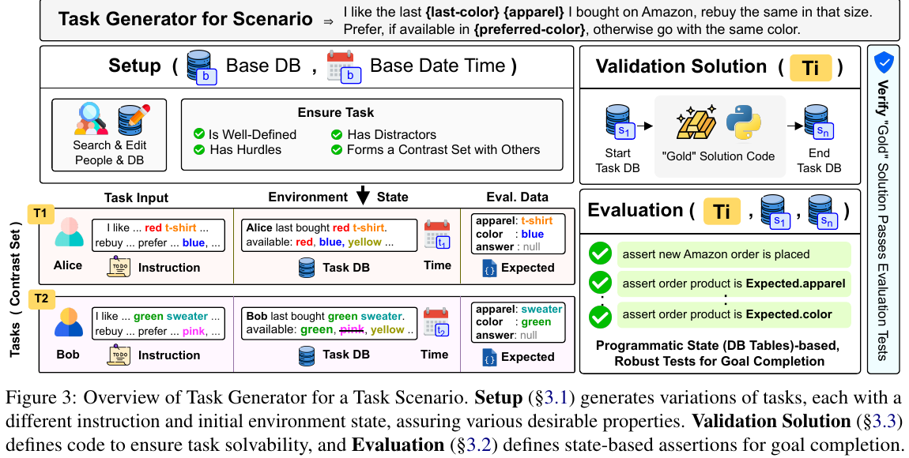
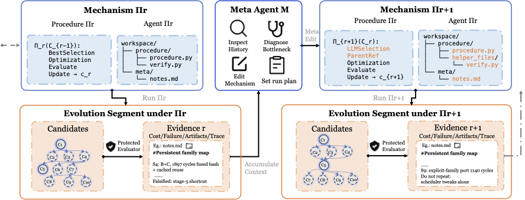
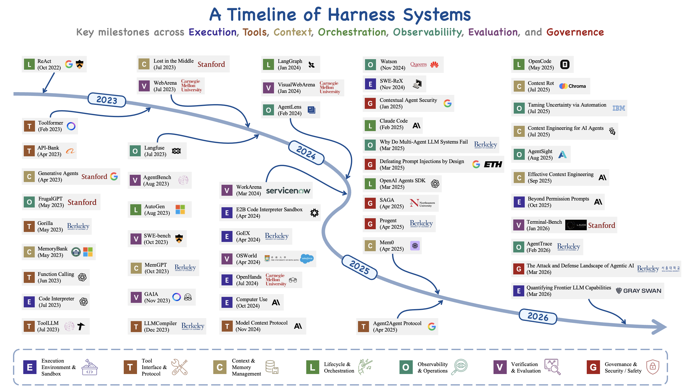
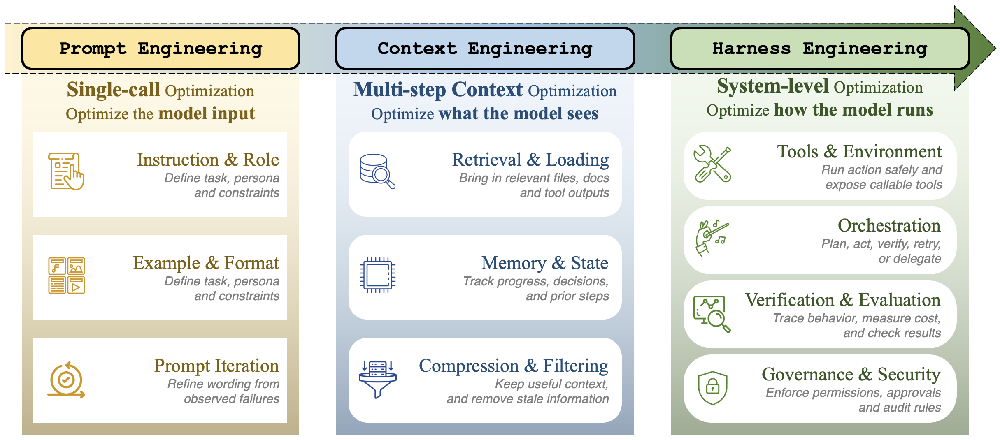
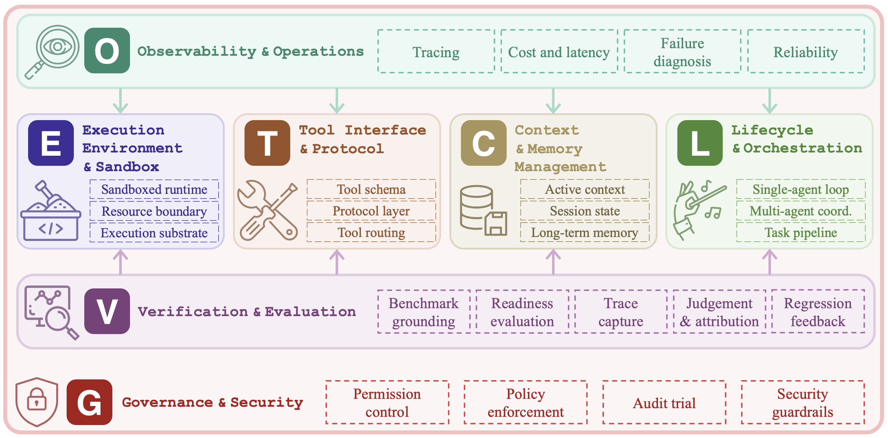
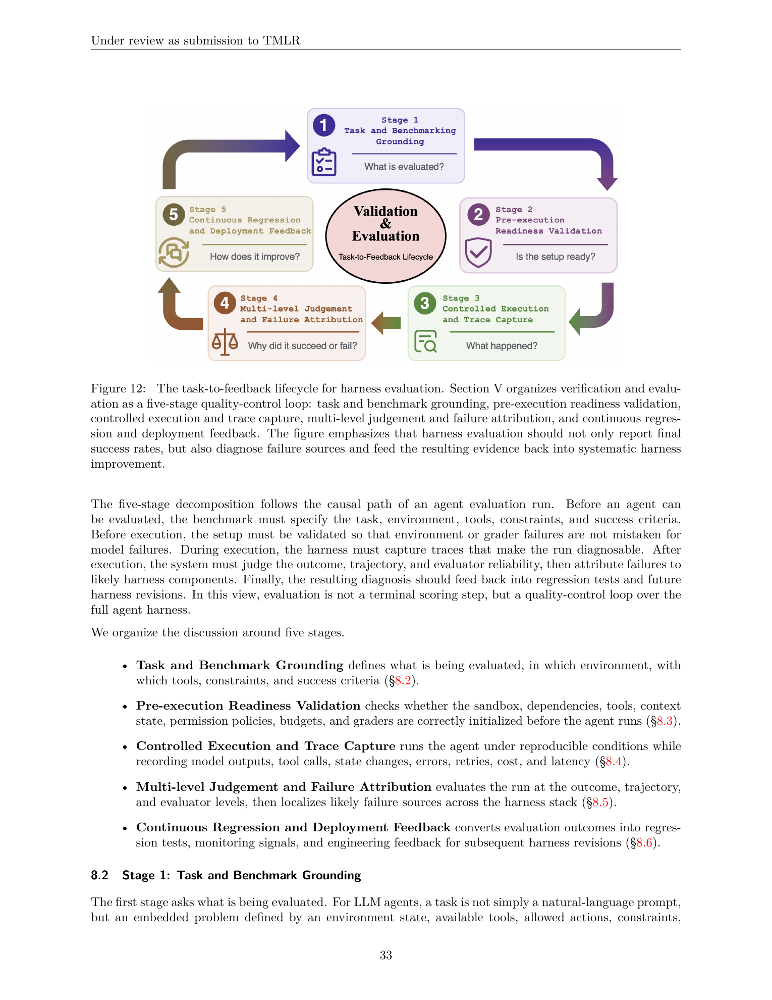
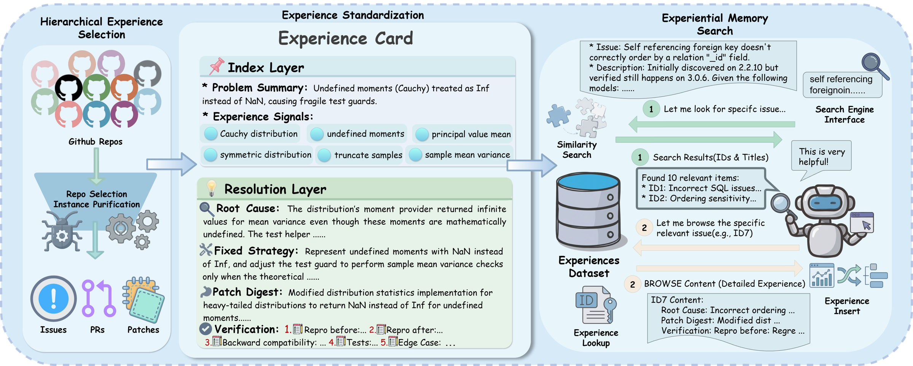
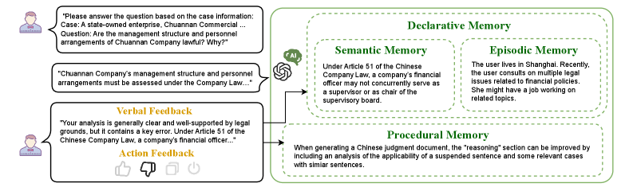
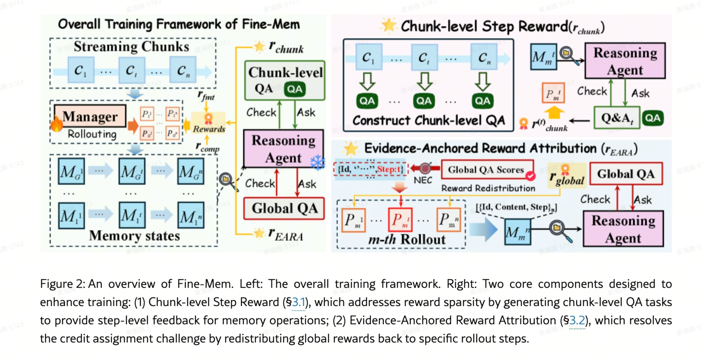

# AI-Applied-Algorithms

[toc]


## 文件结构导航

这份笔记目前按“检索基础 -> Agent 机制 -> Context / Memory / Runtime -> 持续学习 -> 搜索业务 -> 多模态与垂类”的顺序组织。后续新增内容优先落到现有模块，不再把单篇 paper 直接堆成新的顶层章节。

| 模块 | 覆盖内容 | 适合查什么 |
| --- | --- | --- |
| RAG 与知识检索 | RAG 基础链路、Embedding / Retrieval / Rerank、GraphRAG / KGQA、Agentic RAG、检索增强 LM | 检索 / 上下文召回的基本算法和典型路线 |
| Agent 基础与经典范式 | CoT、ReAct、ToT、Plan-and-Execute、Function Calling | Agent 基础概念和经典 reasoning / action 框架 |
| Agent 框架、评估与工作流 | GAIA、MLE-bench、Deep Research、CUA、Workflow agent、trace-first eval | Agent benchmark、工具使用、工作流、安全评估和观测基建 |
| Agent Harness / Agent Infra：总框架 | ETCLOVG、rollout、trace-native eval、governance、session boot、clean-state handoff、harness search | 把 Agent Memory / Workflow / Eval / Runtime 放到同一系统框架中 |
| Context Engineering 与 Agent Runtime | Context / Responses API、runtime resource、session / prefix cache、agent context substrate | Agent runtime 的上下文底座和 API substrate |
| Agent Memory：领域理论框架 | memory 形态、trajectory-derived experience、memory routing / ranking、personalization、benchmark、feedback / credit assignment | 当前 Agent Harness / OpenViking 主线和 memory 理论框架 |
| Online Learning、持续学习与反馈优化 | Online learning、in-context vs in-weights、算力挑战 | 从反馈信号走向持续改进 / 个性化 agent |
| 多模态 Search / Agent | 多模态检索、视觉 backbone、image rerank、M3-Agent | 多模态搜索和多模态 agent |
| AI Search：搜索、Query 理解与生成式排序 | 召回融合、AI Search 推理链路、Query 理解、Query Rewrite、NL2SQL | 搜索业务与 LLM ranking / generation 的结合 |
| CRS：对话式搜推 | Conversational Recommender System、RecLLM、InteRecAgent | 对话式推荐 / 搜推系统 |
| 自动驾驶：感知、规划与评估 | BEV、端到端、自动驾驶评估 | 垂类 agent / embodied decision-making 类比 |

## RAG 与知识检索

### RAG 基础链路

#### Intro

##### 为什么需要


##### Context Engineering的概念

> Chroma访谈 「RAG真是一个糟糕的概念」 https://mp.weixin.qq.com/s/D5MXQKMffdGS_gTMHE4LIQ

* Context Engineering 这个概念，算是 AI 工程学的一部分。Context Engineering 的任务，就是在每一步生成时，决定上下文窗口里应该放什么。
  * 一个是内循环，决定这一次上下文里该放哪些内容；
  * 另一个是外循环，随着时间积累，逐渐学会如何越来越好地选择信息，只放最相关的。
  * 背后的观察是，context越长，LLM的能力下降
* **索引的目标就是用写入时的性能去换查询时的性能**
* Rerank
  * 专门的 re-rank 模型未来会慢慢边缘化。它们不会消失，但只会在极端规模、极端成本场景下才需要。就像硬件一样，大部分时候 CPU 或 GPU 就够了，只有极少数情况才会考虑 ASIC 或 FPGA。
* 代码检索的场景
  * **Claude Code  的同学提到过，他们不会对代码库做 Embedding 或索引，而是直接提供工具，用工具来做代码搜索**

##### RAG的未来

* 未来的检索系统可能会有几个特点：
  * 第一，它们会一直停留在潜在空间里，而不是再回到自然语言。
  * 第二，边生成边检索
    * RAGAR
* Cartridge，soft-prompt外挂kv-cachehttps://hazyresearch.stanford.edu/blog/2025-06-08-cartridges

#### 业务场景

* 场景一：合作伙伴评估
  - “哪些企业最适合成为我们的战略合作伙伴？”
  - 对话式搜推 --> 追问用户企业
  - 知识图谱 --> 业务领域、技术优势、市场定位、信用评级、知识产权情况、诉讼记录
  - 寻求业务、技术能力的互补性 (工程施工 + 设计规划)
* 场景二：市场趋势洞察
  - “未来哪些行业领域可能出现爆发式增长，我们企业该如何提前布局？”
  - 对话式搜推 --> 追问用户行业
  - 知识图谱 --> 注册数量、资本投入、新增专利数量
  - 寻找不同行业之间的关联节点
* 场景三：潜在项目预测
  - “未来哪些项目最有可能适合我们企业参与投标？”
  - 对话式搜推 --> 追问用户技术优势
  - 知识图谱 --> 领域招投标项目数量增长趋势、政策法规、行业动态
  - 为用户提供潜在项目清单

### Embedding / Retrieval / Rerank：基础检索链路

#### 检索


##### 基础流程

* RAG（Retrieval Augmented Generation）顾名思义，通过***\*检索\****的方法来增强***\*生成模型\****的能力。


* 搭建过程：
  * 文档加载，并按一定条件**切割**成片段
  * 将切割的文本片段灌入**检索引擎**
  * 封装**检索接口**
  * 构建**调用流程**：Query -> 检索 -> Prompt -> LLM -> 回复
* 离线步骤：
  1. 文档加载
  2. 文档切分
  3. 向量化
  4. 灌入向量数据库

- 在线步骤：
  1. 获得用户问题
  2. 用户问题向量化
  3. 检索向量数据库
  4. 将检索结果和用户问题填入 Prompt 模版
  5. 用最终获得的 Prompt 调用 LLM
  6. 由 LLM 生成回复

###### Retrieval-in-context LM: 验证了相比LLM内在知识有正向价值

* Paper
  * In-context RAG
  * REPLUG


##### 关键字检索

* Elastic Search
  * Elasticsearch（简称ES）是一个广泛应用的开源搜索引擎: https://www.elastic.co/
  * 关于ES的安装、部署等知识，网上可以找到大量资料，例如: https://juejin.cn/post/7104875268166123528
  * 关于经典信息检索技术的更多细节，可以参考: https://nlp.stanford.edu/IR-book/information-retrieval-book.html
* **关键字检索的局限性**
  * 同一个语义，用词不同，可能导致检索不到有效的结果

##### 向量库和向量检索

* Text Embeddings

  * **语义相似度**：向量之间距离
    * 欧氏距离
    * 余弦距离

* 向量数据库

  * 与传统的关系型数据库是互补的

* 主流向量数据库性能对比：

  * FAISS: Meta 开源的向量检索引擎 https://github.com/facebookresearch/faiss

  - Pinecone: 商用向量数据库，只有云服务 https://www.pinecone.io/

  * **Milvus**: 开源向量数据库，同时有云服务 https://milvus.io/
    * 性能优化较多
  * Weaviate: 开源向量数据库，同时有云服务 https://weaviate.io/
    * **Multi-vector Support (ColBERT/ColPali)**: 
        * Weaviate v1.29+ 正式支持生产级多向量检索。
        * **量化方案**: 提供 Binary/Scalar Quantization，大幅降低多向量的存储开销（e.g. 25KB -> 生产可用）。
        * **MUVERA Encoding**:
            * Multi-Vector Retrieval via Fixed Dimensional Encodings.
            * 将多向量编码为单个固定维度的向量，比单纯量化更激进的压缩策略，用于平衡精度与资源。
            * [Docs: MUVERA Encoding](https://docs.weaviate.io/weaviate/configuration/compression/multi-vectors#muvera-encoding)
  * Qdrant: 开源向量数据库，同时有云服务 https://qdrant.tech/
  * PGVector: Postgres 的开源向量检索引擎 https://github.com/pgvector/pgvector
  * RediSearch: Redis 的开源向量检索引擎 https://github.com/RediSearch/RediSearch
  * ElasticSearch 也支持向量检索 https://www.elastic.co/enterprise-search/vector-search


###### 产品 Intro


* pgvector
  * PostgreSQL里面的一个vector search的插件
  * 缺点：
    * 向量维度最大只支持2000维，而现在很多新的模型生成的向量远远超过2000维，可能达到4096维以上（和采用了PostgreSQL底层存储有关）
    * 处理复杂应用场景时能力非常弱。这里的复杂场景指的是传统的关系型数据库中的操作，如filter、join和where等。例如，如果需要将两张表进行join然后再进行向量搜索，pgvector处理这种关系型操作的能力很差。
* PGVector.rs
  * 主要论点：vector是一种新的data type，而不是新的indexing构建方式
  * 基于关系型数据库来支持向量搜索，而不是开发一个新的specialized vector DB
  * 复杂场景：关系型数据库中的表与表之间的复杂查询操作。
    * 例如，支付宝的业务可能涉及几十张表，需要很多join和where语句来实现。这种复杂的关系型数据库查询需求是独立的vector DB无法满足的，因为它们通常只做向量搜索，没有大量的表与表之间的操作。
  * 对于那些专注向量搜索的应用，独立的vector DB确实可能是更好的选择。它们有更好的扩展能力，能更好地满足这类需求。因此，这两种场景并不冲突，具体选择取决于业务需求。如果业务需要处理复杂的关系型数据库查询，我们的pgvecto.rs会更适合，而如果业务重心在向量搜索，独立的vector DB可能更有优势。
* turbopuffer
  * 专门做多租户场景，这一单点差异化让它的商业化进程非常顺利。它针对有多租户需求的客户（比如Notion这样的应用）提供数据库服务。
* chroma https://mp.weixin.qq.com/s/D5MXQKMffdGS_gTMHE4LIQ
  * 原生支持正则搜索，因为它对代码搜索特别好用。我们还专门做了索引优化，让正则搜索在大数据量下也能跑得很快。
  * “forking”功能，可以在一百毫秒内复制一个已有索引

##### 高级检索机制：ColBERT 与 PLAID

*   **ColBERT (Contextualized Late Interaction over BERT)**
    *   **Late Interaction (晚期交互)**: 传统的双塔模型 (Dual Encoder) 将 Query 和 Document 分别压缩为单个向量，丢失了细粒度信息；Cross Encoder 保留了全部交互但计算昂贵。ColBERT 采用 Late Interaction，将 Query 和 Document 编码为**多向量 (Bag of Vectors)**，即每个 Token 一个向量。
    *   **MaxSim 操作**: 相似度计算是通过 Query 中的每个 Token 向量去寻找 Document 中与其最相似的 Token 向量 (Max)，然后将这些最大相似度求和 (Sum)。
    *   **优势**: 兼顾了双塔的预计算特性（Document 向量可离线计算）和 Cross Encoder 的细粒度交互能力。
    *   **挑战**: 存储和检索成本高。每个文档存 $N$ 个向量，检索时需要进行大量的向量相似度计算。

*   **PLAID (Performance-optimized Late Interaction Driver)**
    *   PLAID 是 ColBERT 团队推出的工程优化方案，旨在解决 Late Interaction 在大规模检索时的延迟问题。它通过**质心剪枝 (Centroid Pruning)** 极大地加速了候选生成过程。

*   **PLAID 的核心机制：Centroid Pruning**
    1.  **聚类与索引 (Clustering & Indexing)**:
        *   使用 K-means 将所有文档的 Token 向量聚类成 $K$ 个簇 (Centroids)。
        *   构建倒排索引 (IVF)，将 Centroid ID 映射到对应的 Document Token 列表。
        *   文档 Token 存储为 `(Centroid_ID, Residual)` 的形式，其中 Residual 是量化后的残差向量。
    2.  **质心交互 (Centroid Interaction)**:
        *   在检索时，首先计算 Query Token 向量与所有 Centroids 的相似度。这一步计算量相对较小（因为 Centroids 数量有限，且 Query Token 少）。
    3.  **动态剪枝 (Dynamic Pruning)**:
        *   这是 PLAID 的关键创新。对于每个 Query Token，不需要扫描所有包含相关 Token 的倒排链。
        *   PLAID 根据 Query Token 与 Centroids 的相似度分数，动态选择**少量高分 Centroids**。
        *   **剪枝策略**: 通常选择分数最高的 top-k 个 Centroids，或者选择分数总和占一定比例（如 90% 质量）的 Centroids 集合。
        *   这大大减少了后续需要解压和计算真实距离的 Token 数量。
    4.  **多阶段检索 (Multistage Pipeline)**:
        *   **Stage 1: 质心过滤**: 利用上述剪枝机制，快速筛选出候选文档列表 (Candidate Generation)。
        *   **Stage 2: 粗略评分**: 使用解压后的近似向量计算 MaxSim，进一步过滤。
        *   **Stage 3: 精细重排**: 对极少数顶层候选文档，加载原始高精度向量进行最终打分。

*   **LightRetriever (ICLR 2026)**:
    *   **核心思想**: doc侧用完整LLM，query侧做了精简，实现轻量级的双塔检索。
    *   **Dense检索 (Dense Retrieval)**:
        1.  **Query侧**: query的每个token分别和prompt的tokens拼一起，得到n个token序列，各自过LLM，再avg pooling得到query向量去检索。
        2.  **Serving优化**: serving的时候可以把prompt x 词表过完LLM的emb缓存起来，直接查表。
    *   **Sparse检索 (Sparse Retrieval)**:
        1.  **Query侧**: 没有prompt了，将query的每个token直接映射成词频。
        2.  **Doc侧**: doc过完llm后的emb也映射到词表大小，然后去做对比学习。
        3.  **Serving优化**: serving时建的是倒排索引，即key是词，value是一个doc的list，按词频之类的倒排，query也直接用词频向量表示，query每个词去查倒排对应的doc list，再merge起来。
    *   **来源**: [LightRetriever: A LLM-based Text Retrieval Architecture with Extremely Faster Query Inference](https://arxiv.org/abs/2505.12260)

#### 难点

##### 企业内部数据混乱

* 过去两年，我们有很多To B智能体项目的实践经验，比如用RAG模式搭建客服系统，过程中往往发现很多企业内部数据混乱，需要企业先投入做数据治理。在企业场景下，数据治理是比较耗时的工作。 （腾讯CSIG经验）
  * 如果内部文档有矛盾，就必须梳理清楚，定义好不同信息来源的权威性；
  * 如果文档有新、老版本，召回逻辑必须考虑时效性

##### 向量化召回的算法缺陷 [DeepMind]

>  [[EP-23\] Deepmind: 单向量召回的根本缺陷_哔哩哔哩_bilibili](https://b23.tv/FZKVfnd)


### GraphRAG / KGQA：综述与知识图谱路线

#### Literature Review

##### RAG的几个关键问题


> LightRAG 5.2

##### LLM + Graphs

* GNNs as Prefix：
  * (GNNs) are utilized as the initial processing layer for graph data, generating structure-aware tokens that LLMs can use during inference
  * GraphGPT、LLaGA
* LLMs as Prefix
  * GALM、OFA
* LLMs-Graphs Integration
  * focuses on achieving a seamless interaction between LLMs and graph data, employing techniques such as fusion training and GNN alignment
  * developing LLM-based agents capable of engaging with graph information directly

> HybridRAG

##### KG

* knowledge extraction
  * The main tasks in this step are entity recognition, relationship extraction, and co-reference resolution. 
* knowledge improvement
  *  KG completion technique infers missing entities and relationships within the graph using methods such as link prediction and entity resolution. 
  *  Link prediction predicts the existence and type of a relation between two entities
     based on the graph structure and features
  *  entity resolution matches and merges different representations of the same entity
     from different sources
* knowledge adaptation

> Retrieval-Augmented Generation with Knowledge Graphs for Customer Service Question Answering: Related Work

##### KGQA: Question answering (QA) with knowledge graphs (KGs)

* retrieval-based
  * utilize relation extraction [19] or distributed representations [5] to derive answers from KGs, but they face difficulties with questions involving multi- ple entities.
* template-based
  * depend on manually-created templates for encoding complex queries, yet are limited by the scope of available templates [16].
* semantic parsing-based methods
  * map text to logical forms containing predicates from KGs [4] [14] [21]
* Evaluation
  * Mean Reciprocal Rank (MRR)
    * MRR gauges the average inverse rank of the initial correct response
  * recall@K
    * recall@K determines the likelihood of a relevant item’s appearance within the top K selections
  * NDCG@K
    * NDCG@K appraises the rank quality by considering both position and pertinence of items.
  * For question-answering performance, we juxtaposed the "golden" solutions against the generated responses, utilizing metrics such as BLEU [11], ROUGE [9], and METEOR [3] scores.

##### LLM4KGQA

* [7] provide a comprehensive review of this integration, categorizing the roles of LLMs as Predictors, Encoders, and Aligners
* For graph-based reasoning, Think-on-Graph [15] and Reasoning-on-Graph [10] enhance LLMs’ reasoning abilities by integrating KGs. 
* Yang et al. [20] propose augmenting LLMs’ factual reasoning across various training phases using KGs. 
* For LLM-based question answering, Wen et al.’s Mindmap [18] and Qi et al. [13] employ KGs to boost LLM inference capabilities in specialized domains such as medicine and food. These contributions underscore the increasing efficacy of LLM and KG combinations in enhancing information retrieval and reasoning tasks.

> MindMap

##### LLM + KG

> MindMap

* 融入训练：KGs emerged as a promising complement to the drawbacks of LLMs
  (Pan et al., 2023). 
  * For instance, KG triples were
    added to the training of LLMs (Zhang et al., 2019b)、Sun et al., 2021
  * KG encoders were entangled with LLM layers
    for joint inference and optimization on graph and
    text data (Zhang et al., 2022). 
  * applying KG prediction tasks, e.g., link prediction, as additional supervision (Ya-
    sunaga et al., 2022)
* synergistic inference of KGs and fixed LLMs
  * 22年左右，很多工作挖掘GNN、Graph Encoder、added interactions between text tokens and KG
    entities in the intermediate layers of LLMs (Zhang et al., 2022; Yao et al., 2023b)，后来才转向**prompting fixed pre-trained LLMs with graphical inputs**
  * Retrieval-Augmented LLM Inference
    * 《Knowledge-augmented language model prompting
      for zero-shot knowledge graph question answering.》 忽略了图结构信息
  * Graph Mining with LLMs
    * 实体/关系识别、图summary
      * prompting LLMs for KG entity linking prediction (Choudhary and Reddy, 2023; Sun et al., 2023), graph mining (Guo et al., 2023), and KG question answering (Baek et al., 2023)
      * 《GPT4Graph: Can large language models understand graph structured data? an empirical evaluation and benchmarking》
      * 《Exploring the potential of large language models (llms) in learning on
        graphs.》
      * 《Complex logical reasoning over knowledge graphs
        using large language models》
      * 局限性： rely heavily on the factual correctness of the KG and ignore the situation where
        the KG does not match the question
    * complex reasoning across multiple evidence graphs grounded on KGs
      * MindMap

### Embedding / Retrieval / Rerank：模型与算法细节

#### Embedding 模型

##### 训练原理

* 向量模型怎么训练：
  * 构建相关（正例）与不相关（负例）的句子对儿样本
  * 训练双塔式模型，让正例间的距离小，负例间的距离大
  * https://www.sbert.net/

##### 典型模型

* **OpenAI Embeddings**
  * text-embedding-3-large、text-embedding-3-small
  * 特点：**越大越准、越小越快**
    * 支持自定义的缩短向量维度，从而在几乎不影响最终效果的情况下降低向量检索与相似度计算的复杂度
    * 计算时用前N维
  * 可变长度的 Embedding 技术：
    * https://arxiv.org/abs/2205.13147 Matryoshka Representation Learning
  * 

* **Doubao Embeddings**
  * **豆包向量模型 (Doubao-Embedding)**
    * 在 CMTEB 中文文本向量评测榜单上，以 75.62 高分刷新榜单 SOTA。
    * 在多模态评测榜单 MMEB_v2 中，图片、视频向量化任务双双登顶 SOTA。
      * MMEB_v2 Image 榜单：77.78 分，领先第二名 5.6 分。
      * MMEB_v2 Video 榜单：大幅领先第二名 20.1 分。
  * **豆包重排模型 (Doubao-Rerank)**
    * 纯文本任务：在 CMTEB 中文文本向量评测榜单上，以 79.00 高分超过其他 Rerank 模型。
    * 多模态任务：在 ViDoRe V1/V2、MMEB V1 中均取得榜单第 1 名。

* **Jina Embeddings (v3 & ColBERT)**
    * **Jina Embeddings v3**:
        * **LoRA Adapters**: 针对不同任务（Retrieval, Clustering, Classification 等）动态切换 Adapter，实现 Task-specific 优化。
        * **8192 Context**: 支持超长上下文（ALiBi），适合长文档检索。
        * **Matryoshka Representation**: 支持弹性输出维度（如 1024->128），灵活平衡存储与精度。
    * **Jina ColBERT**:
        * **Late Interaction**: 采用 Multi-vector (MaxSim) 机制，保留细粒度交互信息。
        * **Integration**: 常作为 Reranker 或 High-precision Retrieval 阶段使用。

* **Qwen-3 Embedding**
    * [arXiv:2506.05176](https://arxiv.org/pdf/2506.05176)
    * **核心特性**:
        * **Multi-stage Training**: 基于合成数据（Synthetic Data）的多阶段训练策略。
        * **InfoNCE Loss**: 采用对比损失最大化正样本相似度，挖掘 Hard Negatives。
        * **Model Merging**: 引入模型合并技术提升泛化能力。
    * **架构**: 在输入序列末尾添加 `[EOS]`，取其 hidden state 作为 embedding。
    * 

##### 多模态 Embedding (Multimodal Embeddings)

* **Visualized BGE (Bootstrapped Grid Embedding)**
    * **原理**:
        * **Grid-Based**: 不像 CLIP 处理整图，BGE-Visualized-M3 将图像切分为 Grid 分别 Embedding，捕捉局部细节。
        * **Bootstrapping**: 迭代优化对图像内容的理解。
        * **Stable Diffusion Augmentation**: 利用 SD 生成编辑后的图像作为增强数据。
    * **BGE-Visualized-M3**: 支持 Dense Retrieval, Multi-Vector Retrieval, Sparse Retrieval。
    * **优势**: 细粒度细节识别，复杂图像理解优于 CLIP。

* **VISTA (Visualized Text Embedding)**
    * **核心**: Deep fusion of text and image data.
    * **架构**:
        * ViT 作为图像 Tokenizer。
        * 将 Visual Tokens 与 Text Tokens 拼接，输入 Frozen Text Encoder。
        * **Unified Embedding Space**: 统一的图文空间。
    * **训练**: 两阶段（Cross-modal training -> Fine-tuning on composed image-text data）。
    * 

* **MagicLens (Google)**
    * **核心**: 支持 **Open-ended Instructions** 的图像检索（不仅仅是视觉相似度）。
    * **训练**: 36.7M image triplets (Query Image, Instruction, Target Image)。
    * **架构**: Dual-encoder。
    * **优势**: 能理解 "inside view of", "different angle" 等语义指令，支持自然语言表达的复杂搜索意图。
    * 

##### 进阶技术

###### **Instruction-Tuned & Task-Aware Retrieval**

* 传统 Embedding 模型通常只能处理语义相似度，缺乏对用户意图的显式建模。
* **TART (Task-aware Retrieval with Instructions)**:
    * 提出了一种新的范式：Retrieval with instructions。显式建模用户的 Intent。
    * **BERRI 数据集**: 收集了 ~40 个不同领域的检索数据集，并由专家标注了 diverse instructions。
    * 
    * **模型架构**: Dual-encoder，将 Instruction 和 Query 拼接后输入。通过 Cross-encoder 挖掘 Hard Negatives。
    * **Hard Negatives**:
        * 
    * 
    * [Ref: TART GitHub](https://github.com/facebookresearch/tart)

##### 开源工具

* 开源库：
  * https://github.com/FlagOpen/FlagEmbedding

* Note：
  * 可能支持跨语言

#### 算法细节

##### document分割

*  文本分割的粒度
   * 缺陷
     * 粒度太大可能导致检索不精准，粒度太小可能导致信息不全面
       * 比如切分自然段，粒度太大
     * 问题的答案可能跨越两个片段
   * 改进: 按一定粒度，部分重叠式的切割文本，使上下文更完整

##### Rerank

*  检索后排序
   * 问题: 有时，最合适的答案不一定排在检索的最前面
   * 方案:
     * 检索时过招回一部分文本
     * 通过一个排序模型对 query 和 document 重新打分排序
   * 一些 Rerank 的 API 服务
     * [Cohere Rerank](https://cohere.com/rerank)：支持多语言
     * [Jina Rerank](https://jina.ai/reranker/)：目前只支持英文


##### RAG Fusion


##### query相关：长度等

*  [query rewriting and query expansion](https://www.google.com/search/howsearchworks/how-search-works/ranking-results/#meaning)
*  query长度
   *  

##### PDF中的表格如何处理

* TableTransformer模型 + GPT-4V
  * TableTransformer找到表格
  * 用 GPT-4 Vision 生成表格（图像）描述，并向量化用于检索
* 一些面向 RAG 的文档解析辅助工具

  - [PyMuPDF](https://pymupdf.readthedocs.io/en/latest/): PDF 文件处理基础库，带有基于规则的表格与图像抽取（不准）
  - [RAGFlow](https://github.com/infiniflow/ragflow): 一款基于深度文档理解构建的开源 RAG 引擎，支持多种文档格式
  - [Unstructured.io](https://unstructured.io/): 一个开源+SaaS形式的文档解析库，支持多种文档格式
  - [LlamaParse](https://docs.llamaindex.ai/en/stable/llama_cloud/llama_parse/)：付费 API 服务，由 LlamaIndex 官方提供，解析不保证100%准确，实测偶有文字丢失或错位发生
  - [Mathpix](https://mathpix.com/)：付费 API 服务，效果较好，可解析段落结构、表格、公式等，贵！


#### Rank

##### Literature Review

* rank
  * encoders of T5-based instruction-following pretrained mod-
    els, namely T0-3B (Sanh et al., 2022) and FLAN-
    T5 (Chung et al., 2022), empirically leads to supe-
    rior performance as found in prior work (Sachan
    et al., 2022). We follow the EncT5 approach (Liu
    et al., 2021) and prepended each sequence with a
    start-of-sequence token. The token representation
    is then fed to a newly initialized feed-forward net-
    work. Unlike MonoT5 (Nogueira et al., 2020), we
    use their encoders only to reduce parameters and
    improve inference-time efficiency [Task-aware Retrieval with Instructions]

### GraphRAG / KGQA：典型系统与论文

#### GraphRAG

> [Graph Retrieval-Augmented Generation: A Survey 论文解读](https://mp.weixin.qq.com/s/Dx8pYhmbrhtRMXNez_GOmw)

* Intro
  * 利用了实体之间的结构信息，实现了更精确、全面的检索，捕捉了关系知识，促进了更准确、上下文感知的响应
  * Graph-Based Indexing, Graph-Guided Retrieval, and Graph-Enhanced Generation
* 难点：
  * **忽视关系：**传统RAG方法主要基于文本的语义相似性，而忽视了文本之间的结构关系。例如，在引用网络中，传统RAG方法可能无法捕捉到论文之间的引用关系。
  * **冗余信息：**RAG通常以文本片段的形式提供信息，当这些片段拼接在一起作为提示时，可能会导致上下文过长，出现“lost in the middle”的问题。
  * **缺乏全局信息：**RAG只能检索到文档的子集，而无法全面理解全局信息，这在查询聚焦摘要（QFS）等任务中可能存在问题。


* GraphRAG的思路：
  * GraphRAG的核心思想是将知识图谱中的结构化信息（如节点、三元组、路径或子图）与LLMs的输出相结合，以提供更准确和丰富的生成结果。
  * 使用结构化知识图谱来更有效地处理冗余信息和全局信息的问题，更方便地进行信息的检索和聚合


* Preliminaries

  * Text-Attributed Graphs (TAGs)
    * 
  * GNN
    * 

* Graph-Based Indexing

  * 数据
    * 开放知识图谱：公开可用的知识图谱，一般主要包括三类：百科知识图谱（如WikiData）、常识知识图谱（ConceptNet）以及领域知识图谱。
    * 自构建图数据：这些是研究人员根据特定任务需求构建的自定义图数据。例如，可能从文档、表格或其他数据库中提取实体和关系，并将它们组织成图结构。
  * 索引
    * 图索引：图索引保留了图的完整结构，使节点和边的访问变得容易。在后续的GraphRAG过程中，可以使用经典的图搜索算法（如BFS和最短路径算法）来快速检索信息。
    * 文本索引：这种方法将图数据转换为文本描述，以便使用各种文本检索技术（如稀疏检索和密集检索）进行优化。
    * 向量检索：这种方法将图数据转换为向量表示，以利用高效的向量搜索算法（如局部敏感哈希）进行快速检索。

* Graph-Guided Retrieval

  * 

  * **检索器的选择：**在图检索中，选择适当的检索器是至关重要的。研究人员可以根据任务需求和数据类型选择以下类型的检索器。
    * 非参数化检索器：基于传统的图搜索算法（如BFS和DFS），不依赖于深度学习模型，适用于高效的大规模数据检索。
    * 语言模型检索器：基于语言模型（如BERT、GPT等），利用其强大的自然语言理解能力，适用于处理复杂的用户查询。
    * 图神经网络检索器：基于图神经网络（如GCN、GAT等），利用其对图结构数据的表示能力，适用于处理复杂的图结构数据。
  * Retrieval Paradigm
    * Once Retrieval
    * **Iterative Retrieval**
      * **Non-Adaptive Retrieval**
      * **Adaptive Retrieval.**
    * **Multi-Stage Retrieval.**

* Graph-Enhanced Generation
  * 


* 训练
  * Retriever训练
    * Training-Free
    * Training-Based
  * Generator训练
    * Training-Free
    * SFT
    * GNN

* 应用
  * 下游任务：问答（知识库问答、常识问答）、信息抽取（实体链接、关系抽取）、事实验证、链接预测、对话系统、推荐系统等。
  * 应用领域：GraphRAG的应用领域主要包括：电商、生物医疗、学术、文献学、法律
    * 电商：
      * RETE: Retrieval-Enhanced Temporal Event Forecasting on **Unified Query Product Evolutionary Graph.**
        * auto-regressive
      * Retrieval-Augmented Generation with Knowledge Graphs for Customer Service Question Answering

* 开源代码
  * 微软GraphRAG：[GitHub - microsoft/graphrag: A modular graph-based Retrieval-Augmented Generation (RAG) system](https://github.com/microsoft/graphrag)
  * 蚂蚁GraphRAG：https://github.com/eosphoros-ai/DB-GPTNeo4j 
  * NallM：https://github.com/neo4j/NaLLMNeo4j 
  * LLM Graph Builder：https://github.com/neo4j-labs/llm-graph-builderNebulaGraph 
  * GraphRAG：https://www.nebula-graph.io/posts/graph-RAG


#### LightRAG

> https://github.com/HKUDS/LightRAG
>
> [从原理、本地Qwen2.5-3B模型部署到源码解读，全流程解析LightRAG](https://www.bilibili.com/video/BV1CwCRYGE6J)
>
> * 思路：
>
>   - 数据增强：LLM
>
>   - 剪枝：
>     - LLM realtime update Graph：图节点/边去重
>     - high-level concept / low-level entity

* Intro
  * **incorporates graph structures into text indexing** and retrieval processes
  * a **dual-level retrieval** system that enhances comprehensive information retrieval from both low-level and high-level knowledge discovery
  * an incremental update algorithm that ensures the timely integration of new data


* RAG的设计
  * Comprehensive Information Retrieval: The indexing function φ(·) must be adept at extracting global information, as this is crucial for enhancing the model’s ability to answer queries effectively.
  * Efficient and Low-Cost Retrieval: The indexed data structure Dˆ must enable rapid and cost- efficient retrieval to effectively handle a high volume of queries.
  * Fast Adaptation to Data Changes: The ability to swiftly and efficiently adjust the data structure to incorporate new information from the external knowledge base, is crucial for ensuring that the system remains current and relevant in an ever-changing information landscape.


* Framework
  * we leverage LLMs to identify and extract various entities (e.g., names, dates, locations, and events) along with the relationships between them.
  * Graph-Based Text Indexing
  * DUAL-LEVEL RETRIEVAL PARADIGM
* Graph-Based Text Indexing
  * Extracting Entities and Relationships. R(·)
  * LLM Profiling for Key-Value Pair Generation. P(·)
    * Entities use their names as the sole index key,
    * whereas relations may have multiple index keys derived from LLM enhancements that include global themes from connected entities.
  * Deduplication to Optimize Graph Operations. D(·)
* 两路召回 DUAL-LEVEL RETRIEVAL PARADIGM
  - Specific Queries -> Low-Level Retrieval
    - “Who wrote ’Pride and Prejudice’?”
    - -> 召回title
  - Abstract Queries -> High-Level Retrieval
    - “How does artificial intelligence influence modern education?”
    - -> 召回关系
  - Integrating Graph and Vectors for Efficient Retrieval.
    - Query Keyword Extraction: 
      - local query keywords k(l) and global query keywords k(g).
    - Keyword Matching：
      - match local query keywords with candidate entities and global query keywords with relations linked to global keys
    - Incorporating High-Order Relatedness.
      - 基于前面已召回的节点和边，再多一跳

* Evaluation

  * 基线：
    * Naive RAG
    * RQ-RAG：These sub-queries are designed to enhance search accuracy by utilizing explicit techniques such as rewriting, decomposition, and disambiguation
    * GraphRAG:
      * It generates corresponding descriptions for these elements, aggregates nodes into communities, and produces a community report to capture global information
  * **LightRAG做单一领域的任务比GraphRAG强**
    * 

  * 结论：
    * The Superiority of Graph-enhanced RAG Systems in Large-Scale Corpora
    * Enhancing Response Diversity with LightRAG
    * LightRAG’s Superiority over GraphRAG
      * **Enhanced Response Variety**: By integrating low-level retrieval of specific entities with high-level retrieval of broader topics, LightRAG boosts response diversity. This dual-level mechanism effectively addresses both detailed and abstract queries, ensuring a thorough grasp of information.
      * **Complex Query Handling**: This approach is especially valuable in scenarios requiring diverse perspectives. By accessing both specific details and overarching themes, LightRAG adeptly responds to complex queries involving interconnected topics, providing contextually relevant answers.
    * 对high/low level retrieval的分析：
      * 去掉High：it struggles to gather information for complex queries that demand comprehensive insights
    * Semantic Graph Excels in RAG.
      * We eliminated the use of original text in our retrieval process. Surprisingly, the resulting variant, -Origin, does not exhibit significant performance declines across all four datasets. In some cases, this variant even shows improvements (e.g. in Agriculture and Mix). We attribute this phenomenon to the effective extraction of key information during the graph-based indexing process, which provides sufficient context for answering queries. Additionally, the original text often contains irrelevant information that can introduce noise in the response.
      * 启发：信息并不是越多越好 -> 对rerank的启发

* Prompts
  * Prompts for Graph Generation：7.3.1 
  * Prompts for Query Generation：7.3.2
  * Prompts for Keyword Extraction：7.3.3
  * Prompts for RAG Evaluation

### Agentic RAG


### GraphRAG / KGQA：LLM4KGQA 典型系统

> KGQA: Knowledge Graph Question Answering

#### FinDKG

* 抽取KG的prompt


* 动态图
  * GNN，时序信息建模

#### HybridRAG: Integrating Knowledge Graphs and Vector Retrieval Augmented Generation for Efficient Information Extraction

* Intro
  * KG：将文档视为两个实体和关系的triplet
  * 当前 RAG 技术包括基于向量数据库的 VectorRAG 和基于知识图谱（KG）的 GraphRAG，各有局限，如 VectorRAG 对金融文档的段落分块假设不合理，GraphRAG 在抽象问答任务或问题未提及明确实体时表现不佳。
* KG构建
  * each triplet is represented as **a nested list [’h’, ’type’, ’r’, ’o’, ’type’, ’metadata’]**,
    * ’h’ and ’o’ denote the head and object entities respectively,
    * ’type’ specifies the entity category,
    * ’r’ represents the relationship,
    * ’metadata’ encapsulates additional contextual information.
    * This format allows for a rich, multidimensional representation of information, facilitating
      more nuanced downstream analysis.
  * 少于4 word
  * 实体消重
  * 实现：NetworkxEntityGraph
* 评估
  * faithfulness, answer relevance, and context relevance      （HybridRAG）
    * 使用 RAGAS 框架


#### Retrieval-Augmented Generation with Knowledge Graphs for Customer Service Question Answering [SIGIR 2024]

* Intro
  * intra-issue structure and inter-issue relations
  * 过往工作的 Limitations
    * Limitation 1 - Compromised Retrieval Accuracy from Ignoring Structures
    * Limitation 2 - Reduced Answer Quality from Segmentation
* 意图识别
  * 3.2.1 intent识别，。识别陈述句和疑问句区别不大 核心是识别对象，因此用一个template识别k到v的映射
* 知识图谱构建
  * 显式和隐式建立ticket之间关系
    * 显式：已有数据
    * 隐式：title embedding，余弦相似度，阈值

* Embedding-based Retrieval of Sub-graphs. (3.2.2)
  * EBR-based ticket identification step
    * 计算ticket的相关性：涉及多个entity，每个entity算相关性然后分数相加召回
    * 引申：图的二跳问题
  * LLM-driven subgraph extraction step
    * 从工单中查找想要的属性

#### MindMap: Knowledge Graph Prompting Sparks Graph of Thoughts in Large Language Models

> https://github.com/wyl-willing/MindMap
>
> 思路很清晰：既利用KG加强召回率和精准度，又融入GoT挖掘LLM的内在知识


* Evidence graph mining
  * 实体识别：
    * **Prompt：Table 9 of Appendix D.**
    * BERT similarity to match entities and keywords
  * Evidence Sub-graphs Exploration
    * 基于提取的实体从源 KG 构建证据子图，包括基于路径的探索和基于邻居的探索两种方法，并对生成的子图进行修剪
    * 算法见Appendix E
    * Path-based
    * Neighbor-based
      * 一跳必加
      * 二跳根据和query的相关性加
* Evidence graph aggregation
  * 从前面步骤中提取至少 k 个基于路径和 k 个基于邻居的证据子图，将每个子图格式化为实体链并转换为自然语言描述，定义为推理图。
  * 顺带能解决实体重复的问题
* LLM reasoning on the mind map
  * 相比来说，以前的LLM4KG： they do not think
    on multiple evidence KG sub-graphs with multi-
    thought in LLM, and without backtracking evi-
    dence sources

* Evaluation
  * hallucination quantification：引入指标定义
  * train a keyword extraction model(NER-MT5) based on mT5-large
  * "combine with the knowledge you already have“ 能提升效果


* Prompt

实体抽取

```
template = """
There are some samples:
\n\n
### Instruction:\n’Learn to extract entities from the following
medical questions.’\n\n### Input:\n
<CLS>Doctor, I have been having discomfort and dryness in my vagina
for a while now. I also experience pain during sex. What could be
the problem and what tests do I need?<SEP>The extracted entities
are\n\n ### Output:
<CLS>Doctor, I have been having discomfort and dryness in my vagina
for a while now. I also experience pain during sex. What could be
the problem and what tests do I need?<SEP>The extracted entities
are Vaginal pain, Vaginal dryness, Pain during intercourse<EOS>
\n\n
Instruction:\n’Learn to extract entities from the following medical
answers.’\n\n### Input:\n
<CLS>Okay, based on your symptoms, we need to perform some diagnostic
procedures to confirm the diagnosis. We may need to do a CAT scan
of your head and an Influenzavirus antibody assay to rule out any
other conditions. Additionally, we may need to evaluate you
further and consider other respiratory therapy or physical therapy
exercises to help you feel better.<SEP>The extracted entities are
\n\n ### Output:
<CLS>Okay, based on your symptoms, we need to perform some diagnostic
procedures to confirm the diagnosis. We may need to do a CAT scan
of your head and an Influenzavirus antibody assay to rule out any
other conditions. Additionally, we may need to evaluate you
further and consider other respiratory therapy or physical therapy
exercises to help you feel better.<SEP>The extracted entities are
CAT scan of head (Head ct), Influenzavirus antibody assay,
Physical therapy exercises; manipulation; and other procedures,
Other respiratory therapy<EOS>
\n\n
Try to output:
### Instruction:\n’Learn to extract entities from the following
medical questions.’\n\n### Input:\n
<CLS>{input}<SEP>The extracted entities are\n\n ### Output:
"""
```

生成答案、GoT

```Python
SystemMessage(content= """You are an excellent AI doctor, and you can diagnose diseases and recommend medications based on the symptoms in the conversation."""),
HumanMessage(content"""Patient input:"""+ Question),
AIMessage(content=f """Combine the knowledge you already have, you have some extra medical knowledge information in the following:\n\n ### """+ path_reasoning_graph + """\n\n###""" + neighbor_reasoning_path),
HumanMessage(content="""What disease does the patient have? What tests should patient take to confirm the diagnosis? What recommened medications can cure the disease? Think step by step.\n\n\n
Output1: The answer includes disease and tests and recommened medications.\n\n
Output2: Show me inference process as a string about extract what knowledge from which Path-based Evidence or Neighor-based Evidence, and in the end infer what result. \n Transport the inference process into the
following format:\n Path-based Evidence number('entity name'->'relation name'->...)->Path-based Evidence number('entity name'->'relation name'->...)->Neighbor-based Evidence number('entity name'->'relation name'->...)-
>Neighbor-based Evidence number('entity name'->'relation name'->...)->result number('entity name')->Path-based Evidence number('entity name'->'relation name'->...)->Neighbor-based Evidence number('entity name'->'relation
name'->...). \n\n
Output3: Draw a decision tree. The entity or relation in single quotes in the inference process is added as a node with the source of evidence, which is followed by the entity in parentheses.\n\n
There is a sample:\n ... """)
```

传统RAG

```
template = """
You are an excellent AI doctor, and you can diagnose diseases and Patient input:\n conversation.\n\n recommend medications based on the symptoms in the
{question}
\n\n
You have some medical knowledge information in the following:
{instruction}
What disease does the patient have? What tests should patient \n\n
take to confirm the diagnosis? What recommened medications can
cure the disease?
"""
```

LLM Evaluation

* “If they are the same, output "2". Try to output "1" or "0"”

```
def prompt_comparation(reference,output1,output2): template = """
Reference: {reference} \n\n
output1: {output1}
\n\n
output2: {output2}
\n\n
According to the facts of disease diagnosis and drug and tests recommendation in reference output, which output is better match. If the output1 is better match, output ’1’. If the
output2 is better match, output ’0’. If they are same match,
output ’2’.
"""
prompt = template.format(reference=reference, output1=output1,
output2=output2)
response = openai.ChatCompletion.create( messages=[ model="gpt-4", {"role": "user", "content": prompt} {"role": "system", "content": """You are an excellent AI doctor."""},
]
response_of_comparation = response.choices[0].message.content return response_of_comparation
```

### 检索增强 LM 与软上下文机制

#### REALM: 检索增强的新预训练方法


#### RETRO：检索信息注入LLM中间层


* 关键设计：CCA


* CCA的实现：
  * 错位，目的是保留最后一个token，保证最后一个token能整合信息
  * 


#### KNN-LM: 从LLM生成机制入手，加权两个概率分布

* 相比普通LLM，会考虑外部信息中的全部tokens


* 加权两个概率分布
  * 

* 结论：
  * 


#### Soft Prompt

##### Cartridge: soft-prompt外挂kv-cache

[LLM无限上下文了，RAG（Retrieval Augmented Generation）还有意义吗？ - Crim的回答 - 知乎](https://www.zhihu.com/question/653424464/answer/1925241113582768305)

https://hazyresearch.stanford.edu/blog/2025-06-08-cartridges

##### [Meta] REFRAG: Rethinking RAG based Decoding

> 本质上是对RAG做性能优化
>
> insight是利用块间注意力小的特点，分块做encoder处理，损失小

* Intro
  * 大型语言模型（LLMs）在检索增强生成（RAG）等长上下文任务中面临**高延迟**（尤其是首 token 生成时间 TTFT 呈二次增长）和**内存消耗大**（KV 缓存随上下文长度线性增加）的问题，而 RAG 上下文因检索段落语义相似度低，存在块对角注意力结构，导致大量计算冗余。为此，研究提出**REFRAG**（RAG 专用高效解码框架），通过 “压缩 - 感知 - 扩展” 机制：利用轻量编码器（如 RoBERTa）预计算检索段落的**块嵌入**、通过投影层匹配解码器（如 LLaMA）嵌入空间，并结合**强化学习（RL）选择性扩展关键块**，实现任意位置压缩且保持自回归性。
  * 实验表明，REFRAG 在不修改 LLM 架构、无困惑度损失的前提下，实现**30.85× TTFT 加速**（较此前 SOTA 模型 CEPE 提升 3.75×），并将 LLM 上下文长度扩展**16×**，在 RAG（强 / 弱检索器场景均优）、多轮对话、长文档摘要等任务中，均优于 LLaMA、REPLUG 等基线模型，甚至在弱检索器场景提升精度 1.93%。
* 流程
  * 
  * **上下文分块**：将 RAG 中的`s`个上下文 token 划分为`L = s/k`个`k`长度块（如`k=16`，`s=2048`则`L=128`）；
  * **块嵌入预计算**：轻量编码器（如 RoBERTa-Large）处理每个块`C_i`，生成块嵌入`c_i = M_enc(C_i)`，并通过投影层`ϕ`映射为与解码器 token 嵌入维度一致的`e_i^cnk`；
  * **解码器输入构造**：将 “问题 token 嵌入（`e_1~e_q`）+ 块嵌入（`e_1^cnk~e_L^cnk`）” 输入解码器（如 LLaMA-2-7B），生成答案；
  * **RL 选择性扩展**：轻量 RL 策略以 “next-paragraph 预测困惑度” 为负奖励，选择关键块（如高相关性段落）扩展为原 token，非关键块保留压缩嵌入，实现 “精度 - 效率” 平衡。

* 痛点：现有长上下文优化方法（如 CEPE、StreamingLLM）针对通用 LLM 任务，未考虑 RAG 特性：

  - **信息稀疏**：RAG 上下文由多段检索文本组成，仅少数段落与查询直接相关，全 token 计算存在大量冗余；
  - **预编码信息浪费**：检索阶段已通过向量编码、重排序获得段落与查询的相关性信息，解码时被完全丢弃；
  - **块对角注意力**：检索段落因多样性 / 去重，语义相似度低，形成 “块内高注意力、块间低注意力” 的块对角结构，跨块计算无效。

* REFRAG 的训练分为 “持续预训练（CPT）” 与 “下游微调” 两阶段，核心策略为**重构任务**与**课程学习**。

  * ##### 3.1 持续预训练（CPT）

    1. **重构任务**
       - 目标：**对齐编码器与解码器嵌入空间**，减少压缩信息损失；
       - 操作：冻结解码器，仅训练编码器 + 投影层，让解码器从块嵌入中恢复原`k`个 token；
       - 作用：强制模型依赖上下文记忆（块嵌入）而非参数记忆，为后续长上下文处理奠定基础。
    2. **课程学习**
       - 问题：`k`增大时，token 组合数呈`V^k`增长（`V`为词汇量），直接多块重构难度极高；
       - 方案：从 “单块重构（易）” 逐步过渡到 “多块重构（难）”，数据混合从 “易任务主导” 逐步转向 “难任务主导”（表 8）；
       - 效果：避免训练崩溃，使模型逐步掌握 “压缩 - 恢复” 能力（表 11 显示，无课程学习时 REFRAG 重构`2048`token 的困惑度为 1.599，有课程学习时仅 0.135）。

  * 3.2 下游微调

    - **监督微调（SFT）**：使用 RAG（110 万数据点，含 OpenAssistant、SQuADv2 等）、多轮对话（TopiOCQA 等）数据集，微调模型适配下游任务；
    - **RL 策略微调**：优化块扩展选择，进一步提升 “压缩效率” 与 “答案精度” 的平衡。

### 竞品


## Agent 基础与经典范式

> 【InfiniTensor】清华大学系列训练营-大模型与人工智能系统训练营 大模型前沿技术（五）自主智能体 https://www.bilibili.com/video/BV14sPkehEGg
>
> [llm agent 的快速入门方式](https://www.xiaohongshu.com/explore/68e3bec5000000000700ed01)
>
> Todo: a survey of self-evolving agents

### Intro

* 和Workflow的对比，见workflow章节中的甲骨文文章
* Intro
  * understanding complex inputs, engaging in reasoning and planning, using tools reliably, and recovering from errors.
  * it's crucial for the agents to gain “ground truth” from the environment at each step (such as tool call results or code execution) to assess its progress
  * **When to use agents:** Agents can be used for open-ended problems where it’s difficult or impossible to predict the required number of steps, and where you can’t hardcode a fixed path. The LLM will potentially operate for many turns, and you must have some level of trust in its decision-making. Agents' autonomy makes them ideal for scaling tasks in trusted environments.


* [Google 白皮书分析](https://ppc.land/ai-agents-google-unveils-framework-for-next-gen-systems/)
  * 白皮书：https://ppc.land/content/files/2025/01/Newwhitepaper_Agents2.pdf
  * 
  * model layer
  * orchestration layer
    * ReAct, Chain-of-Thought, and Tree-of-Thoughts
    * "agent chaining"

  * Tools layer
    * Extensions
      * provide standardized API interactions

    * Functions
      * enable client-side execution control

    * Data Stores
      * facilitate access to various types of information

  * 

* 吴恩达：系统可以具有不同程度的Agentic特性
  * **Reflection（反思）**：类似于AI的自我纠错和迭代。例如，AI系统会检查自己编写的代码，并提出修改建议。
  * **Tool Use（工具使用）**：大语言模型调用插件，扩展了其能力。例如，使用Copilot进行联网搜索或调用代码插件解决数理逻辑问题。
  * **Planning（规划）**：AI根据用户输入的任务，拆解流程、选择工具、调用、执行并输出结果。例如，根据一张图片中的姿态生成一张新图片，并进行描述。
  * **Multi-agent（多智能体协作）**：多个Agent协作完成任务，每个Agent可能扮演不同的角色，如CEO、产品经理或程序员。这种模式模拟了现实生活中的工作场景，能够处理复杂系统处理复杂系统
* OpenAI开源多智能体agent框架swarm https://mp.weixin.qq.com/s/ysUzxUYV-lsQ6aiYPU0KdA
  * https://github.com/openai/swarm
  * 自动将函数转成适配格式的json描述
  * 上下文的管理有多种模式可以轻松传递
  * 10行代码构建出多智能体系统

* **Internet of Agents (IoA)** ([arxiv](https://arxiv.org/abs/2407.07061), ICLR 2025)：清华 NLP & 面壁智能。提出 agent integration protocol + 即时通信架构 + 动态组队与会话流控制。多 Agent 协作不能只靠"多开几个 agent"，真正关键的是协议、路由、编组与会话控制。

* **Agent Data Protocol (ADP)** ([arxiv](https://arxiv.org/abs/2510.24702), ICLR 2026 Oral)：CMU / OSU。提出轻量 interlingua，用 Pydantic schema 统一动作（API / Code / Message）与观察（Text / Web），将 13 个已有数据集转换到 ADP，兼容 OpenHands、SWE-Agent、AgentLab。Protocol 标准化本身是 agent 工程的重要基础设施。

* **mini-SWE-agent** ([GitHub](https://github.com/SWE-agent/mini-SWE-agent))：SWE-bench/SWE-agent 团队。核心 ~310 行 Python，SWE-bench verified 74%+。极简架构：唯一工具=bash、无状态执行（`subprocess.run`）、线性消息历史、Protocol 替代继承、策略编码在 prompt 而非代码。核心洞察——当 LLM 足够强时，agent 框架应做减法而非加法，复杂度与性能甚至可能负相关。详见 [AI-Agent-Product&PE.md - 极简 Agent 架构](./AI-Agent-Product&PE.md)


- [LangGraph](https://langchain-ai.github.io/langgraph/) from LangChain;
- Amazon Bedrock's [AI Agent framework](https://aws.amazon.com/bedrock/agents/);
- [Rivet](https://rivet.ironcladapp.com/), a drag and drop GUI LLM workflow builder; and
- [Vellum](https://www.vellum.ai/), another GUI tool for building and testing complex workflows.

#### 未来展望


### 演进路线：认知框架

> todo https://www.zhihu.com/question/1927140506573435010/answer/1928873138189476851 作者：远洋之帆
>
> 后面还有更多技术介绍

* 认知框架已形成四代技术脉络：

1. **第一代**：线性推理（CoT/ReAct）  
2. **第二代**：结构化探索（ToT/GoT）  
3. **第三代**：程序增强（PAL/CR）  
4. **第四代**：系统化协作（多Agent/von Neumann）

* 演进路线

  | 演进维度   | 代表框架                  | 核心突破                 |
  | ---------- | ------------------------- | ------------------------ |
  | 线性推理   | CoT, Self-Consistency     | 分步解决复杂问题         |
  | 结构化探索 | ToT, GoT, SoT             | 多路径搜索与回溯机制     |
  | 程序增强   | PAL, PoT                  | 代码执行确保计算精确性   |
  | 动态优化   | BoT, RoT, VoT             | 迭代修正与验证机制       |
  | 知识融合   | RAT, Analogical Prompting | 外部知识实时检索与整合   |
  | 系统协作   | von Neumann Multi-Agent   | 仿计算机架构的分布式推理 |

* **1. 基础推理框架**

  | 框架                                                         | 核心技术                               | 突破性应用                |
  | ------------------------------------------------------------ | -------------------------------------- | ------------------------- |
  | CoT                                                          | 分步提示（"Let's think step by step"） | MATH数据集准确率提升300%  |
  | [ReAct](https://zhida.zhihu.com/search?content_id=737342368&content_type=Answer&match_order=1&q=ReAct&zhida_source=entity) | 推理-行动循环（Think→Act→Observe）     | HotpotQA问答幻觉率降低58% |
  | Self-Consistency                                             | 多路径投票机制                         | GSM8K数学题稳定性提升40%  |

* **2. 结构化框架**

| 框架 | 数据结构          | 创新点                             |
| ---- | ----------------- | ---------------------------------- |
| ToT  | 树状搜索          | DFS/BFS策略实现Game-of-24成功率74% |
| GoT  | 有向无环图        | 思维聚合能力使排序任务成本降31%    |
| SoT  | 骨架-细节二级结构 | 文本生成延迟降低2.4倍              |

* **3. 程序辅助框架**

```python
# PAL典型工作流（数学问题求解）
def pal_execute(question):
    # 自然语言转代码
    code_prompt = f"将问题转换为Python代码: {question}"
    generated_code = llm.generate(code_prompt)

    # 安全沙盒执行
    with Sandbox() as env:
        result = env.execute(generated_code)

    # 结果验证
    if validate(result):
        return result
    else:
        return self_correction()  # 触发自我修正
```

> **优势**：在MATH数据集上准确率达85.3%（比纯CoT高22%） 

* **4. 迭代优化框架**

**Buffer of Thoughts (BoT) 核心机制**：


* **三、框架性能对比**

| 评估维度       | CoT  | ToT  | PAL  | BoT  | RAT  |
| -------------- | ---- | ---- | ---- | ---- | ---- |
| 复杂推理准确率 | 57%  | 74%  | 85%  | 82%  | 79%  |
| 响应延迟(ms)   | 1200 | 3500 | 2500 | 4200 | 2900 |
| 外部知识依赖   | 无   | 无   | 低   | 无   | 高   |
| 错误传播风险   | 高   | 中   | 低   | 低   | 中   |

#### 框架选择决策树


### 经典推理框架对比

| 框架类别   | 代表框架                 | 核心特点   | 计算复杂度 | 适用场景     |
| ---------- | ------------------------ | ---------- | ---------- | ------------ |
| 基础推理   | CoT, Self-Consistency    | 线性推理   | 低         | 简单推理任务 |
| 结构化推理 | ToT, GoT, SoT            | 树/图结构  | 中-高      | 复杂决策问题 |
| 程序辅助   | PAL, PoT                 | 代码执行   | 中         | 数学计算密集 |
| 迭代优化   | BoT, RoT, VoT            | 多轮优化   | 高         | 需要精确答案 |
| 知识增强   | RAT, Analogical          | 外部知识   | 中         | 知识密集任务 |
| 元认知     | Meta-Prompting, CCI      | 自我调节   | 中-高      | 自适应任务   |
| 协作框架   | Multi-Agent, von Neumann | 多主体协作 | 最高       | 复杂系统问题 |


### Function Calling

https://www.anthropic.com/news/tool-use-ga

*  Anthropic's suggestions for deciding on tool formats are the following:

   - Give the model enough tokens to "think" before it writes itself into a corner.

   - Keep the format close to what the model has seen naturally occurring in text on the internet.

   - Make sure there's no formatting "overhead" such as having to keep an accurate count of thousands of lines of code, or string-escaping any code it writes.

*  *agent*-computer interfaces (ACI)

   * Put yourself in the model's shoes
   * writing a great docstring for a junior developer on your team
   * https://console.anthropic.com/workbench
   * [Poka-yoke](https://en.wikipedia.org/wiki/Poka-yoke) your tools
   * e.g. SWE Bench，文件tool仅输入绝对路径

### ReAct

> todo ReAct paper

* thought 节点
* action 节点
* iteration and branch 节点


```
Answer the following questions as best you can. You have access to the following tools:

{tools}

Use the following format:

Question: the input question you must answer
Thought: you should always think about what to do
Action: the action to take, should be one of [{tool_names}]
Action Input: the input to the action
Observation: the result of the action
... (this Thought/Action/Action Input/Observation can repeat N times)
Thought: I now know the final answer
Final Answer: the final answer to the original input question

Begin!

Question: {input}
Thought:{agent_scratchpad}
```

### tree of thought (ToT)

> todo paper

* 把search的思想引入到agent的设计里面，为后续mcts和agent结合的大量工作奠定了基础。

### **SelfAskWithSearch**

* 适合知识图谱这样的层层推理场景


### Plan-And-Execute

> https://blog.langchain.dev/planning-agents/

* 好处
  * Generating the full reasoning steps is a tried-and-true prompting technique to improve outcomes.
  * 性能、成本
* Naive版本
  * https://github.com/langchain-ai/langgraph/blob/main/docs/docs/tutorials/plan-and-execute/plan-and-execute.ipynb


* ReWOO：Reasoning WithOut Observations
  * the planner can reference previous outputs using syntax like `#E2` 
  * more effective than a naive plan-and-execute agent since each task can have only the required context (its input and variable values).

* LLMCompiler
  * https://github.com/langchain-ai/langgraph/blob/main/docs/docs/tutorials/llm-compiler/LLMCompiler.ipynb
  * **Planner**: streams a DAG of tasks. Each task contains a tool, arguments, and list of dependencies.
  * **Task Fetching Unit** schedules and executes the tasks. This accepts a stream of tasks. This unit schedules tasks once their dependencies are met. Since many tools involve other calls to search engines or LLMs, the extra parallelism can grant a significant speed boost (the paper claims 3.6x).
  * **Joiner**: dynamically replan or finish based on the entire graph history (including task execution results) is an LLM step that decides whether to respond with the final answer or whether to pass the progress back to the (re-)planning agent to continue work.
  * 好处：
    * **Planner** outputs are ***streamed;\*** the output parser eagerly yields task parameters and their dependencies.
    * The **task fetching unit** receives the parsed task stream and schedules tasks once all their dependencies are satisfied.
    * Task arguments can be *variables,* which are the outputs of previous tasks in the DAG. For instance, the model can call `search("${1}")` to search for queries generated by the output of task 1. This lets the agent work even faster than the "embarrassingly parallel" tool calling in OpenAI.

### Agent Examples

#### Intro

* 模版


#### Agentic RAG 示例

* 

#### Coding Agent 示例

- A coding Agent to resolve [SWE-bench tasks](https://www.anthropic.com/research/swe-bench-sonnet), which involve edits to many files based on a task description;
  - 
- Our [“computer use” reference implementation](https://github.com/anthropics/anthropic-quickstarts/tree/main/computer-use-demo), where Claude uses a computer to accomplish tasks.

#### Customer support

- 特点
  - Support interactions naturally follow a conversation flow while requiring access to external information and actions;
  - Tools can be integrated to pull customer data, order history, and knowledge base articles;
  - Actions such as issuing refunds or updating tickets can be handled programmatically; and
  - Success can be clearly measured through user-defined resolutions.
- 一口气学会如何思考AI Agent系统设计 https://www.bilibili.com/video/BV1WoeozgEyn/
  - 参考「Agent应用技术架构」


## Agent 框架、评估与工作流

### 算法理论

* Agent难点
  * 基座模型的复杂推理能力不够强

    * 通过基座模型Plan把一个复杂任务分解为10个步骤，哪怕单个步骤的正确率高达95%，要想最后把任务做对，10个环节的准确率连乘下来，最终的正确率只有59%
* [专访Pokee CEO朱哲清](https://www.xiaohongshu.com/explore/688cba190000000023038da5)，谈agentic experience
  * multi-step reasoning和multi-step execution的重要性
    * creative&design类agent的一个瓶颈是，一步做完，用户没法改了，比如无法导入AE并保留图层，或者导入Figma
  * RL的重要性
    * agent中，pretraining的主要意义是理解
    * 从人类工作流中提取pretraining数据集的效率低
    * 复杂系统中，多轮迭代产生的数据，价值高，不能完全依赖offline RL
  * agent如何超越function calling
    * 目标导向的规划很重要
    * 解决evalutaion的瓶颈
    * 个性化memory理解

### 业务场景

* 基座推理模型的训练数据场景
  * 编程
  * 推理
  * 数学
  * --> 增加浏览能力

* 在线研究：因为很多职业都需要做大量的资料搜集、信息整合，最后写成报告
  * “我希望模型能帮我找到几款产品，并根据 Reddit 上的评价给排个序”
  * “我希望它能帮我针对某个主题写一篇文献综述”
  * 找出 Liam Felis 和 Barrett Zoff 合著的所有论文
  * 找出我们一个同事的中间名
  * 做旅行计划
* 软件工程
* 电商
  * “我喜欢这几个牌子，请帮我找找还有哪些新牌子能买到类似这款的特定外套”
  * “我想要一件人造皮草的外套，要这个长度，是这一季的新款”
  * 找一个有非常具体要求的 Airbnb 房源

### RFT (Reinforcement Fine-tuning)

* **针对某个特定任务去训练模型，那它在这个任务上的表现肯定会更好**
  * 在一个类型的任务上训练，模型的能力也能迁移到其他领域
  * 如果你手头有个非常具体的任务，而且你觉得这个任务和你已知的模型训练数据差别很大，你自己试了很多次，换了各种提示语，效果就是不理想——比如说，**某个特别专业的基因测序任务，或者其他对模型来说完全是“圈外”（out of distribution）的知识，模型压根不知道从何下手——那我觉得，这时候就值得考虑试试强化学习微调。**
  * 如果某个任务对你的核心业务流程来说至关重要，性能提升个 10%、15% 就能决定生死存亡，那或许也应该尝试 RFT。

### Agent 评估与安全

这个分区先看 **Agent Evaluation：把 agent eval 做成自动化测试系统**，再看 GAIA、MLE-bench、GDPval、AppWorld、BFCL-v3 等具体 benchmark。前者回答“agent eval 应该如何建模、分层和持续维护”，后者回答“不同任务世界如何构造 case、环境和 grader”。

#### GAIA: A Benchmark for General AI Assistants ([arxiv](https://arxiv.org/abs/2311.12983), NeurIPS 2023)

Meta / HuggingFace / AutoGPT 等。466 个真实世界问题，要求推理、多模态处理、网页浏览和工具使用。问题对人类简单（92% 准确率），但对 AI 极难（GPT-4 + plugins 仅 15%）。按难度分 3 级：Level 1（基本工具）、Level 2（多步推理 + 工具链）、Level 3（复杂长程任务，需要自主规划与多工具协同）。

**Level 3 SOTA 演进**（2025-2026）：

| 排名 | 方法 | Level 3 | 综合 | 架构特点 |
|------|------|---------|------|---------|
| 1 | **Lemon Agent**（联想） | 87.76% | 91.36% | AgentCortex 框架（Planner-Executor-Memory），层级自适应调度，orchestrator-workers 架构 ([arxiv](https://arxiv.org/abs/2602.07092)) |
| 2 | **Spine Swarm** | 61.5% | - | 三层多 Agent 架构（orchestrator → persona agents → tool agents），依赖感知并行调度 |
| 3 | **Writer Action Agent** | 61% | - | 企业级 Agent，基于 writer-palmyra 模型 |
| - | Manus | 57.7% | 73.9% | 通用 Agent，多工具协同 |
| - | OpenAI Deep Research | 47.6% | 74.3% | 强化微调 + 浏览工具 |

关键洞察：GAIA Level 3 是当前 Agent 综合能力的试金石。从 GPT-4 的 15% 到 Lemon 的 87.76%，核心突破不在单模型能力，而在多 Agent 编排、自适应调度和 memory 管理。

#### MLE-bench: Evaluating Machine Learning Agents on Machine Learning Engineering ([arxiv](https://arxiv.org/abs/2410.07095), ICLR 2025)

OpenAI。基于 75 个 Kaggle 竞赛构建 benchmark，覆盖数据准备、训练、实验、调参与提交等真实 ML 工程环节，提供 human baseline（Kaggle 公开排行榜）。最佳配置（o1-preview + AIDE scaffold）仅获得约 8.7% 的 Kaggle 奖牌率。Agent 评测应贴近真实工程闭环，benchmark 不应只看单轮答案而应看长期任务完成度。

#### RedTeamCUA: Realistic Adversarial Testing of Computer-Use Agents ([arxiv](https://arxiv.org/abs/2505.21936), ICLR 2026)

OSU NLP Group。构建 hybrid sandbox（OSWorld VM + Docker 化 WebArena/TheAgentCompany），提出 Decoupled Eval：将 agent 直接放到注入点附近，避免导航能力不足掩盖真实风险。RTC-Bench 含 864 个测试用例。结果：Claude 3.7 Sonnet CUA 的 ASR 达 42.9%，最安全的 Operator 仍有 7.6% ASR。

关键洞察：不能因为 agent 没走到注入点就误判其"更安全"，能力与安全必须分离评估。benchmark 应显式拆分导航失败、工具失败、推理失败、安全失败。

#### Agent Evaluation：把 agent eval 做成自动化测试系统

> 来源：[Anthropic: Demystifying evals for AI agents](https://www.anthropic.com/engineering/demystifying-evals-for-ai-agents)。用户 2026-05-27 读完。

这篇更适合作为 **agent 评估方法论基石**，而不是只作为单篇文章记录。核心判断是：让 agent 有用的能力（多轮行动、工具调用、状态修改、灵活规划）也让 agent 难评估；有效 eval 不能只套 single-turn LLM eval，而要把 task、environment、trajectory、outcome、grader、suite 和 harness 组合起来。

**图1：Single-turn eval vs Agent eval**


一句话：single-turn eval 主要评“答案”；agent eval 必须评“行动后世界是否变成正确状态”。所以 coding agent 修 MCP server 时，不能只看它说“我完成了”，而要跑测试确认 server 真能工作。

**图2：Agent eval 的对象模型**


这组定义很重要：task 定义输入和成功标准；trial 是一次执行；trajectory / transcript 是完整过程记录；outcome 是最终环境状态；grader 对 trajectory 和 outcome 打分；evaluation harness 负责运行、记录、评分和聚合；agent harness / scaffold 是被评估对象的一部分。当我们说“评估 agent”，实际评的是 **model + agent harness**，而不是裸模型。prompt、tool schema、memory、sandbox、orchestration loop、permission policy 都会改变结果。

**两类 eval suite**

| 类型 | 问什么 | 好 suite 的形态 | 何时使用 |
| --- | --- | --- | --- |
| Capability eval / quality eval | agent 能不能做更难的新事情 | 初始通过率不必高，要给系统 hill-climb 空间 | 新能力探索、模型升级、scaffold 改造 |
| Regression eval | 以前会做的事情有没有退化 | 稳定、便宜、持续跑，通过率应接近 100% | CI gate、版本发布、线上风险控制 |

一个 suite 如果已经饱和，应从 capability eval 毕业成 regression eval；然后再构造更难的 capability suite。否则所有任务混在一个总分里，会看不出系统是在探索能力上限，还是在守住已知能力。

**三种 grader**

| Grader | 适合检查 | 优点 | 风险 |
| --- | --- | --- | --- |
| Code-based grader | string / regex、unit tests、static analysis、state check、tool call check、token / turn metrics | 快、便宜、客观、可复现、易 debug | 对合法变体脆弱，难评主观质量 |
| Model-based grader | rubric scoring、natural-language assertion、pairwise comparison、reference-based eval、multi-judge consensus | 灵活、可扩展、能评开放输出和细腻质量 | 非确定、成本更高，需要人类校准，可能有 judge bias |
| Human grader | SME review、众包、spot check、A/B、inter-annotator agreement | 最贴近真实专家 / 用户判断，可校准 LLM judge | 慢、贵、难规模化，专业领域需要专家 |

实际系统通常是 layered grader：先用 deterministic / state check 过滤客观正确性，再用 model rubric 评语义和质量，最后用 human audit 校准高风险或歧义 case。不要把 LLM judge 当 oracle；grader 本身也需要被评估。

**pass@k vs pass^k**

- `pass@k`：k 次尝试里至少一次成功。适合 coding agent、多候选 patch、搜索式任务、允许挑最好结果的场景。
- `pass^k`：k 次尝试全部成功。适合用户面 agent、客服 agent、生产执行 agent，因为用户期待每次都可靠。

所以 `pass@10` 很高不等于系统可托付，它只说明“多试几次可能能成”。如果 `pass@10` 高但 `pass^3` 低，这个 agent 更像研究 demo，而不是生产系统。

**不同 agent 类型的 eval 重心**

| Agent 类型 | 更适合的 grader | 重点 |
| --- | --- | --- |
| Coding agent | tests、static analysis、patch correctness、repo state、tool-call audit | outcome 比 path 更重要；同一修复可能有多条合法路径 |
| Conversational agent | state check + rubric + simulated user + human calibration | 目标完成、轮数、语气、合规、是否 grounded in tools |
| Research agent | groundedness、coverage、source quality、claim verification、human / expert calibration | reference answer 不唯一，不能只看最终答案，要看 evidence quality |
| Computer-use agent | UI / filesystem / browser / app state check + transcript audit | 最终状态正确也可能误打误撞；失败要区分视觉 grounding、权限、环境 reset、工具和规划问题 |

**两个产品化例子**

- Claude Code：早期靠 Anthropic 员工和外部用户反馈快速迭代；后来先加 concision、file edits 等窄 eval，再加 over-engineering 等复杂行为 eval。eval 帮助定位问题、指导改进，并让 research / product collaboration 更聚焦。它还需要 production monitoring、A/B test、user research 一起补全信号。
- Descript video editing agent：围绕视频编辑工作流定义三条成功标准：don’t break things、do what I asked、do it well。后来形成两套常跑 suite：quality benchmarking 和 regression testing。这个例子说明：好的 agent eval 往往来自产品工作流本身，而不是抽象能力榜单。

**从 0 到 1 建 agent eval**

1. 不等上百个 case，先用 20-50 个真实失败 / 高频手测任务起步。
2. 从 bug tracker、support queue、手动 QA、用户反馈里抽 task。
3. 每个 task 要无歧义，两个专家应该能独立判定 pass/fail。
4. 同时放正例和反例，比如应该 search 的 case 与不该 search 的 case。
5. eval environment 要稳定隔离，每个 trial 从 clean state 开始。
6. grader 分层：deterministic first，LLM judge 处理语义，human 做校准。
7. 一定要读 transcript；否则不知道是 agent 失败、grader 失败，还是 harness 约束不合理。
8. eval suite 要有人维护，像 unit tests 一样长期演化；capability suite 饱和后转 regression suite。

一个可复用 task schema 可以长这样：

```yaml
task:
  id: "fix-auth-bypass_1"
  desc: "Fix authentication bypass when password field is empty and ..."
  graders:
    - type: deterministic_tests
      required: [test_empty_pw_rejected.py, test_null_pw_rejected.py]
    - type: llm_rubric
      rubric: prompts/code_quality.md
    - type: static_analysis
      commands: [ruff, mypy, bandit]
    - type: state_check
      expect:
        security_logs: {event_type: "auth_blocked"}
    - type: tool_calls
      required:
        - {tool: read_file, params: {path: "src/auth/*"}}
        - {tool: edit_file}
        - {tool: run_tests}
  tracked_metrics:
    - type: transcript
      metrics:
        - n_turns
        - n_toolcalls
        - n_total_tokens
    - type: latency
      metrics:
        - time_to_first_token
        - output_tokens_per_sec
        - time_to_last_token
```

对 Agent Harness / Vaka 的直接启发：不要把 eval 做成“一个强 judge 看最终答案”。更稳的是 `L0 deterministic outcome/state gate -> L1 cheap model rubric -> L2 strong judge on uncertain slices -> L3 trajectory audit sample -> L4 human-calibrated gold set`。每层都记录 cost、latency、confidence、false-pass / false-fail，并把真实失败转成 regression case。

**Cursor 的生产反馈信号。** Cursor 的 agent harness 复盘补了一条很重要的产品化 eval 线：offline eval / public benchmark / CursorBench 之外，还要跑 online A/B 和真实使用信号。延迟、token efficiency、tool call count、cache hit rate 是方向性指标；更接近质量的是两类反馈：

| 信号 | 定义 | 解释 |
| --- | --- | --- |
| Keep Rate | agent 生成的代码在固定时间后仍保留在用户代码库中的比例 | 如果用户很快手改、回滚或要求 agent 继续修，说明初次输出质量不足。 |
| User-response judge | 用模型读取用户对 agent 初次输出后的反馈，判断用户是否满意 | 用户继续做下一个 feature 是强正信号；粘贴 stack trace 或报错是强负信号。 |

这说明 agent eval 不能只看 benchmark 分数。真实产品里的改动应同时看 `offline controlled eval -> online experiment -> usage-derived regression signal`，并把失败样本回流成 regression suite。

#### GDPval / ClawWork：真实工作交付物与经济压力型 agent benchmark

> 来源：[OpenAI GDPval](https://openai.com/index/gdpval/)、[ClawWork GitHub](https://github.com/HKUDS/ClawWork)。

GDPval 的定位是把 agent / model benchmark 从“答题”推进到“真实知识工作交付物”。OpenAI 从美国 GDP 贡献较高的 9 个行业中选取 44 个知识工作职业，构造 1,320 个专业任务，其中 gold open-source set 为 220 个任务。每个任务都来自有经验专业人士设计和审核，平均专业经验超过 14 年；交付物不是一句答案，而可能是法律 brief、工程设计说明、护理计划、Excel、PPT、PDF、图表或多媒体材料。

GDPval 的评测方式也更接近工作场景：模型和人类专家都产出 deliverable，再由同职业专家盲评比较，判断模型产物相对专家产物是更好、相当还是更差。它的价值在于衡量“能否交付可用工作产品”，而不是只看工具调用是否正确。

但 GDPval 当前仍有明确边界：它主要是 one-shot evaluation，不评估多轮澄清、客户反馈、长期上下文积累、反复修改和真实工作流集成。因此它更像“高真实性的 deliverable benchmark”，还不是完整 agent workflow benchmark。

ClawWork 可以看成 GDPval 的经济压力包装层。它复用 GDPval 220 个真实职业任务，把 agent 放进一个“AI coworker 经济系统”里：agent 初始只有少量余额，每次 token / tool use 都消耗成本，只有提交质量足够高的工作才获得收入。它额外引入的指标包括：

| 维度 | GDPval | ClawWork |
| --- | --- | --- |
| 任务来源 | 专业人士构造的真实工作任务 | GDPval gold set |
| 核心产物 | 文档、表格、PPT、PDF、设计 / 分析报告等 deliverable | 同样的专业 deliverable |
| 评分 | 专家盲评 / 自动 grader 近似专家偏好 | LLM evaluator + 行业 rubric + payment |
| 主要问题 | 模型产物是否接近专业人士 | agent 能否在成本约束下持续赚钱 |
| 关键指标 | win / tie / lose vs human expert | survival days、final balance、income、profit margin、quality、token efficiency、work / learn mix |

ClawWork 的有趣点不在于“赚了多少钱”的宣传数字，而在于把 benchmark 目标从单题质量扩展到 **质量、成本、策略与长期生存**：agent 不只要做对，还要决定什么时候工作、什么时候学习、是否值得搜索、是否值得多花 token 打磨。这比普通 benchmark 更贴近生产 agent 的真实约束。

对 Agent Harness 的启发：

- GDPval 提醒我们：高质量 agent benchmark 不应只问 final answer，还应要求结构化 deliverable，并让 evaluator 评估可用性、完整性和专业性。
- ClawWork 提醒我们：agent runtime 的指标不能只有 success rate；还要有 token cost、tool cost、time cost、quality-adjusted reward、survival / budget pressure。
- 这类 benchmark 适合支撑“AI coworker / professional agent”叙事，但不能直接替代 TAU2 / AppWorld / BFCL 这类可执行环境 benchmark，因为它对 tool trajectory、状态变更和 action attribution 的约束较弱。
- 如果迁移到 Agent Harness，可以抽象为 `task_value × quality_score - runtime_cost` 的 outcome，并把 deliverable quality、trace evidence、cost 和 regression 一起纳入评估。

#### AppWorld / BFCL-v3：从可执行 App 世界到 function calling 专项评测

> 来源：[AppWorld paper](https://arxiv.org/abs/2407.18901)、[AppWorld GitHub](https://github.com/StonyBrookNLP/appworld)、[AppWorld terminal agents guide](https://github.com/StonyBrookNLP/appworld/blob/main/guides/evaluating_terminal_agents.md)、[BFCL leaderboard](https://gorilla.cs.berkeley.edu/leaderboard)、[BFCL GitHub](https://github.com/ShishirPatil/gorilla/tree/main/berkeley-function-call-leaderboard)、[BFCL-v3 blog](https://gorilla.cs.berkeley.edu/blogs/13_bfcl_v3_multi_turn.html)。用户 2026-05-22 读完。

AppWorld 和 BFCL-v3 都是 tool-use / agent benchmark，但层次不同：AppWorld 更像“给 agent 一个可执行 App 世界，让它真的办事”；BFCL-v3 更像“把 function calling 拆成专项考试”。

| 维度 | AppWorld | BFCL-v3 |
| --- | --- | --- |
| 核心对象 | 可执行 app world / sandbox | function calling benchmark |
| 任务形态 | 多 app、多 API、交互式写代码 | 单轮 / 多轮 function call |
| 状态 | 真实 DB state，可 reset / save / diff | 部分类别有 state-based eval |
| 评估 | DB-state unit tests，检查目标完成与 collateral damage | AST matching、execution response、state / response-based checks |
| 对 Agent Harness 价值 | 更适合产出 replay / trace / ranker row | 更适合补 tool-call taxonomy / error categories |

AppWorld 的设计是：9 个日常 app、457 个 API、100+ DB tables、约 100 个虚拟用户，构成一个可控世界。Benchmark 有 750 个任务，来自 250 个 scenarios，每个 scenario 3 个 variants。任务不是“调用某个 API”，而是“帮用户完成一个跨 app 的真实流程”，例如查消息、读邮件、下单、更新 playlist。

它最有价值的地方是 state-based evaluation：每个任务有初始 DB state，agent 执行后产生最终 DB state。评估不是比对固定 action sequence，而是用 unit tests 检查：

```text
expected state changes must happen
unexpected collateral changes must not happen
answer must match when task is QA-style
```

这天然能产出 `task_id / instruction / initial_state / api_docs / trajectory / api_calls / environment_io / db_diff / assertion_trace / task_success / scenario_success`。其中 Figure 3 的任务构造流程也很值得借鉴：先从 scenario template 生成 task variants，再用 base DB / base date time 构造初始状态，要求任务 well-defined、有 hurdles、有 distractors，并形成 contrast set；最后用 validation solution 验证可解，再用 state assertions 做评估。



三个直观 case：

- SimpleNote + Spotify：从笔记里读取今天 workout 时长，再选择能覆盖该时长的 playlist / songs 并播放。它测跨 app 找信息、循环累加和中间结果决策。
- Venmo：批准本月来自室友的付款请求。它测关系推理、状态过滤和写操作边界，关键是该批准的都批准、不该动的不能动。
- Amazon：复购上次买过的衣服，尺码相同，优先换成偏好颜色；如果偏好颜色没货，再买原颜色。它测历史状态读取、条件判断、库存检查和订单写入。

BFCL-v3 的核心目标是评估模型“能不能正确调用函数”。它的分类覆盖 simple / multiple / parallel / irrelevance / live categories，以及 `multi_turn_base`、`multi_turn_miss_func`、`multi_turn_miss_param`、`multi_turn_long_context` 等多轮类别。评估方法也分层：

```text
AST matching:
  解析函数名和参数，适合大规模离线评估。

execution response matching:
  执行函数并比对返回结果。

state-based evaluation:
  检查多轮执行后的系统状态。

response-based evaluation:
  检查必要调用路径，尤其适合 read-only 场景。
```

三个直观 case：

- 单轮查询：例如查 Berkeley 今天的天气。模型要把自然语言映射到正确函数和参数，BFCL 可用 AST / execution matching 检查函数名与参数。
- 多步订票：订机票前需要先调用 `get_flight_cost` 获取票价，再把结果传给 `book_flight`，不能胡填中间参数。它测 tool chaining。
- 多轮 stateful 文件系统：初始目录已经是 `alex`，用户说“我是 Alex，进入以我名字命名的目录并列出内容”。正确模型应理解当前状态，避免重复 `cd("alex")` 进入 `alex/alex`。它测模型是否会先利用环境状态，而不是机械套用字面指令。

对 Agent Harness 的迁移应克制。最小可先只保留：

```text
benchmark
task_id
task_type
split
instruction
available_tools
trajectory_ref
outcome
failure_bucket
cost
```

只有在便宜且可稳定导出时，再补 `state_diff_ref / assertion_trace_ref / tool_call_trace_ref`。AppWorld 的 terminal-agent 评估方式可以作为仿真环境选项，但不宜一上来用高成本 Codex 批量跑；更合理的路线是先用便宜模型跑 batch，Codex 只做 canary / case debugging。数据切分也应按 `task_type / scenario` 做 stratified train-test split：train 负责抽经验，test 才用于 held-out claim，避免同类任务全进训练集后高估 memory utility。

#### Agent Observability：OpenTelemetry GenAI / OpenInference / agentevals

> 来源：[OpenTelemetry GenAI Semantic Conventions](https://opentelemetry.io/docs/specs/semconv/gen-ai/)、[GenAI spans](https://opentelemetry.io/docs/specs/semconv/gen-ai/gen-ai-spans/)、[OpenInference Semantic Conventions](https://arize-ai.github.io/openinference/spec/semantic_conventions.html)、[agentevals](https://github.com/agentevals-dev/agentevals)。用户 2026-05-22 读完。

传统服务 observability 主要记录 request、latency、error、DB query、RPC call。Agent 系统更复杂：一次任务里可能有 LLM call、retrieval、rerank、prompt render、tool call、tool observation、guardrail、evaluator，而且每次运行成本高、结果不稳定。因此 agent 运行需要被拆成 trace：

```text
trace = 一次完整任务
span  = 任务中的一个步骤，例如 LLM call / retrieval / tool call / eval
event = span 内的输入输出、streaming chunk、异常等
attributes = span 上的结构化字段，例如 model、token、tool name、document score
```

这组三件套对应三层：

```text
OpenTelemetry GenAI:
  通用观测标准，定义 GenAI / Agent 相关 span、metric、event 字段

OpenInference:
  LLM 应用级语义约定，定义 LLM / Retriever / Reranker / Tool / Evaluator 等 span kind

agentevals:
  trace 消费端，基于已有 OTel trace 做 agent eval
```

**OpenTelemetry GenAI** 解决“怎么用行业通用方式记录 GenAI / Agent 操作”。它覆盖输入输出事件、异常、metrics、model spans、agent spans、provider-specific conventions。Model span 里比较有用的字段包括：

```text
gen_ai.operation.name
gen_ai.provider.name
gen_ai.conversation.id
gen_ai.request.model
gen_ai.response.model
gen_ai.request.stream
gen_ai.response.time_to_first_chunk
gen_ai.usage.input_tokens
gen_ai.usage.output_tokens
gen_ai.usage.cache_read.input_tokens
gen_ai.usage.cache_creation.input_tokens
gen_ai.usage.reasoning.output_tokens
error.type
```

**OpenInference** 更像 LLM 应用内部步骤分类层。它要求 OpenInference span 带 `openinference.span.kind`，常见类型包括：

```text
LLM
EMBEDDING
CHAIN
RETRIEVER
RERANKER
TOOL
AGENT
GUARDRAIL
EVALUATOR
PROMPT
```

这比只记录模型调用更贴近 agent 系统：retrieval、rerank、prompt render、tool call、evaluator 都应该是独立 span，否则 trace 只能看到“大模型慢/贵/错”，看不到 agent 链路哪里错。

**agentevals** 解决“trace 已经有了，怎么离线评估”。它的核心思路是：agent 行为已经被 trace 记录下来后，不应每次为了 eval 重新跑一遍 agent。流程是：

```text
existing OTel trace
-> eval set
-> evaluator
-> score / pass-fail
-> CI gate / regression report
```

典型 evaluator 包括：

```text
tool_trajectory_avg_score  # 工具调用轨迹是否匹配
response_match_score       # 最终回答是否匹配
```

关键判断：OpenTelemetry / OpenInference 是 **record layer**，agentevals 是 **consume layer**。Agent Harness / OpenViking 这类系统不应只存最终 success/fail，而应把每次运行记录成可复用 trace：同一条 trace 后续可以被成本分析、tool correctness、memory attribution、regression gate、LLM judge 多次消费。

需要注意边界：这些标准能记录 GenAI / LLM app 链路，但没有原生表达完整的 memory learning loop。Agent memory 还需要额外字段：

```text
memory_candidate_id
retrieved
reranked
injected
cited_or_followed
caused_action
outcome_delta
lifecycle_update
```

因此更合理的系统分层是：标准字段用 `gen_ai.*` / `openinference.*` 对齐行业生态，自定义 memory / eval / replay 字段用业务命名空间扩展。

### Coding Agent

#### codeact: Executable Code Actions Elicit Better LLM Agents

这篇论文提出了一些哲学概念，就是当前的代码具有图灵完备性，任何任务都可以用代码完成。这个观念很重要，成为当前市面上大多数agent工作的基石性的概念。


### 通用Agent框架

#### Deep Research

##### Intro

>  DeepResearch 框架overview https://www.zhihu.com/question/1915818280955897431/answer/1916251134655443682
>
>  https://mp.weixin.qq.com/s/hTRDTu7y6_PuNOZwoxRJIg

* Deep Research产生于OpenAI研究员的副业中，设计之初就定位为专注**海量信息整合类的“只读”任务，避免高风险操作，比如其他agent喜欢演示的**简单交易场景。

  * 第一，现实中大量的知识型工作，核心内容其实就是信息整合，所以这对从事这类工作的人会非常有价值。

    第二，OpenAI 的长远目标是创造能够做出新科学发现的通用人工智能（AGI）。我们觉得，能够高效整合信息是实现这个目标的基础。你想想，如果连文献综述都写不好，又怎么可能写出开创性的科学论文呢？所以，这个方向和公司的大目标是高度一致的。

* Deep Research采用**强化微调（RL Fine-Tuning）**，结合人类专家数据与合成数据集。

* Deep Research数据选取上采取的“广撒网”的策略，广泛收集了各种专业领域的信息收集场景数据，并未深入某个特别领域。因为强化学习能够**在训练中自己摸索出从问题到答案的路径**。

  * 通往通用智能体的清晰路径，由高质量数据整理、完备工具集成、可衡量任务设计，以及预训练与强化学习的循环互促共同构成。

* 当你有一个非常具体、定义明确的问题时，这个问题需要引导模型去检索特定的信息源，或者聚焦在某些方面Deep Research 通常表现更好，而不是O3。

  * 当然基础模型也很重要，在一个类型的任务上训练，模型的能力也能迁移到其他领域。比方说，你主要用数学、编程和其他推理类问题训练出来的O3模型，它写东西的能力也会不错。

* **Deep Research 会一直专注于那些需要最长处理时间的复杂任务。而像 o3 或者 O-next（下一代模型）可能会在“快”和“深入”之间找到更好的平衡点。**

* 未来Deep Research的产品路线，下一步是让它能**访问私人数据**，再往后是执行写入操作或者调用 API 了。

  * 从只读到可写的发展趋势

* DeepResearch v.s. O3
  * **这个问题需要引导模型去检索特定的信息源，或者聚焦在某些方面，那么用 Deep Research 会更有效？**

* 未来期望：
  * 通用智能体，做更多类型的事情 --> 人希望和更少的同事协作

##### Data + Algo

* 针对浏览任务进行训练应该是可行的

* 合成数据+真人专家数据
  * 在 OpenAI 这样的地方工作，可能就有条件做一些通常不建议初创公司做的事，就是同时面向非常广泛的用户群体，去请教各个不同领域的专家，看看能不能让模型一下子在所有方面都做得不错

##### Tools

* 浏览工具，是个基于文本的浏览器，但它能看到网页里嵌入的图片，也能打开 PDF 文件
* 调用 Python 工具，用来做数据分析、计算、画图表

##### 挑战

* 延时

  * PE：“在接下来五分钟内，尽你所能做到最好就行。”

  * 模型要学会判断“思考多久才够”。但是，**我估计 Deep Research 会一直专注于那些需要最长处理时间的复杂任务。而像 o3 或者 O-next（下一代模型）可能会在“快”和“深入”之间找到更好的平衡点。**

* 安全性

* 上下文管理

* 幻觉
  * **大多数情况是因为它错误地解读了某个信息来源。**这也是我们为什么坚持要**加上引用**的原因之一——**让用户能方便地核对信息来源**


#### OpenAI AutoGPT

#### Alita: 动态生成MCP

* **Alita 通用智能体**，以 “**最小预定义**” 和 “**最大自演化**” 为核心设计原则，仅依赖单个核心组件（网络代理）和少量通用模块，通过动态生成**模型上下文协议（MCP）** 自主构建、优化和复用外部能力，突破传统智能体对人工预定义工具 / 工作流的依赖

* #####  核心组件细节

  1. 管理器代理（核心协调者）
     - 功能：任务分解、组件调度、结果聚合；
     - 工具集：MCP Brainstorming（能力缺口识别）、ScriptGeneratingTool（脚本生成）、CodeRunningTool（隔离执行）。
  2. 网络代理（外部信息检索）
     - 功能：补充内部知识缺口，检索领域代码 / 文档；
     - 工具集：SimpleTextBrowser（网页界面）、GoogleSearchTool（全网搜索）、GithubSearchTool（开源工具检索）、页面导航工具（VisitTool/PageUpTool/PageDownTool）。
  3. MCP 创建组件（自演化核心）
     - **MCP Brainstorming**：评估当前能力，识别缺口并提供工具生成参考；
     - **ScriptGeneratingTool**：生成任务脚本、环境配置脚本（如 Conda 创建指令）、清理脚本；
     - **CodeRunningTool**：在隔离环境中执行脚本，验证后封装为 MCP；
     - **环境管理**：创建独立 Conda 环境，支持依赖安装、故障恢复（如版本约束调整）、并行初始化。

#### XAgent：大模型驱动的自主智能体框架

* 效果大于AutoGPT
  * 


https://github.com/OpenBMB/XAgent


* 双循环机制
  * planning agent
    * 每次执行完子任务，反思planning


* ToolServer


* 请求用户干预，寻求实时反馈
  * 

#### Lemon Agent: GAIA SOTA #1 ([arxiv](https://arxiv.org/abs/2602.07092), [GitHub](https://github.com/Open-Lemon/LemonAgent))

联想。GAIA 综合得分 91.36%，Level 3 得分 87.76%（当前 SOTA）。提出 AgentCortex 框架，形式化 Planner-Executor-Memory 范式，核心创新：

- **层级自适应调度**：orchestrator 层评估任务复杂度，简单任务路由到单个 worker（减少开销），复杂任务 fan-out 到多个专家 worker 并行执行；worker 层内部也有自适应调度
- **统一上下文与 memory 视图**：多 worker 共享统一 memory，避免信息孤岛
- **高并发 DAG 执行引擎**：配置驱动，支持不同规模和拓扑的 agent swarm 快速组装
- **兼容多种多 Agent 设计模式**：cooperative、hierarchical、tool-hub-centric

补充工程化判断（2026-04-29，来源：arXiv:2602.07092v1 + 仓库现实检查）：

- **仓库现状**：当前公开仓库基本只有 README，代码仍在 internal review，现阶段只能做 structural reproduction
- **真实系统形态**：不是"多 agent 自由聊天"，而是明确的 orchestrator-worker 两层结构。宏观调度（orchestrator 判断单 worker vs 多 expert workers）+ 微观调度（worker 内部决定顺序/并行工具调用）
- **三层 progressive compression**：tool 结果截断 + metadata logging → round-level summarization → cross-round retroactive compression
- **SES-Memory**：从 execution traces 中提炼可复用 skill snippets，即使任务失败也可抽取有价值 memory；有 recall threshold、dedup / skip writeback 等质量控制
- **工程边界**：Lemon 的 memory 更适合视为**行为参考层**（回答"memory 如何参与协作与调度"），而非最终 storage substrate

#### Spine Swarm: GAIA SOTA #2

三层多 Agent 架构：orchestrator → persona agents → tool agents。依赖感知并行调度，persona agents 按任务角色动态组队，tool agents 负责具体工具调用。GAIA Level 3 得分 61.5%。

#### UltraRAG


#### Computer Use Agent

##### OSCAR: Operating System Control via State-Aware Reasoning and Re-Planning ([arxiv](https://arxiv.org/abs/2410.18963), ICLR 2025)

将 agent 操作建模为状态机，基于 screen observation 做 state-aware reasoning，在执行过程中根据环境变化进行 task-driven re-planning。GAIA benchmark Level 3 成功率 13.5%（接近此前 SOTA 的两倍），OSWorld 和 AndroidWorld 上同样超越其他方法。

关键洞察：长程执行的关键不只是 tool calling，而是持续状态判断。checkpoint / watchdog / recover 应按状态驱动设计而非按步骤计数。

##### ScaleCUA: Scaling Open-Source Computer Use Agents with Cross-Platform Data ([arxiv](https://arxiv.org/abs/2508.09123), ICLR 2026)

上海 AI Lab。构建覆盖 Windows、macOS、Linux、Android、iOS、Web 的跨平台数据，grounding data 结合自动 pipeline + 模型标注 + 人工校验，trajectory data 由人工操作采集并补注释。发布不同参数规模模型。

关键洞察：跨平台真实数据是 CUA 的关键基础设施，但 screenshot-based scaling 仍暴露 temporal continuity 与 continuous control 的上限。

### Agent + Workflow

#### AEvo / Harnessing Agentic Evolution：把进化从 candidate search 提升到 mechanism search ([arxiv](https://arxiv.org/abs/2605.13821))



AEvo 不是 RL training。它借用了 `state / action / evaluator / reward` 这套语言，但核心是 training-free meta-optimization：用强 coding agent 在外层观察历史候选、失败、成本、trace 和评测记录，然后编辑“未来如何搜索”的机制。

传统 evolution 多数是在搜候选答案：

```text
agent -> candidate -> evaluator -> feedback -> next candidate
```

AEvo 把层次抬高到机制搜索：

```text
meta-agent -> edit mechanism / workspace / procedure
           -> evolution segment produces many candidates
           -> protected evaluator scores
           -> evidence accumulates
           -> next meta-edit
```

这里最重要的不是跑分，而是一套 harness 语言：`candidates / logs / traces / eval records / cost / provenance / meta notes` 被稳定记录，evaluator 被隔离，agent 只能提交 candidate，不能看隐藏评估、不能直接写官方分数、不能绕过 gateway。`protected evaluator` 是 AEvo claim 的核心，否则系统会退化成 reward hacking。

Procedure-based AEvo 搜的是“生成候选解的 procedure”。meta-edit 可以改 selection、sampling、local verifier、feedback injection、retry horizon、diversity control、stale feedback cleanup。ARC case 里真正起作用的是 `Pass@K + local scoring + failure feedback refinement + fresh exploration`：缓存训练样例，多采样候选，用本地 verifier 评分，失败时喂失败样例继续 refine，卡住时切 fresh exploration。

Agent-based AEvo 搜的是“长期 workspace 中的 agent operating context”。meta-edit 可以改 skill、session goal、notes、eval accounting、candidate family map、validator workflow，让内层 coding agent 更稳定地产出和筛选代码 candidate。Kernel case 里最终被评分的是代码，但提升来自 workspace 级搜索纪律：记录实现家族、控制 eval budget、沉淀 validators / tools / notes，让低层优化能跨 session 累积。

Meta-agent skill 的最小可迁移形态可以压成：

```text
Core loop:
Read -> Attribute -> Choose Action -> Run Inner-Agent -> Record

Choose exactly one action:
A. goal change:
   edit sessions/_next_goal.md
B. harness change:
   edit skill/evolve_skill.md, shared/validators/, shared/tools/, shared/notes/

Allowed:
   write next goal, edit evolve skill, launch inner-agent through gateway
Forbidden:
   edit candidates/, call evaluator directly, bypass gateway, write official score
```

对 Agent Harness 的启发：AEvo 更适合作为外围 harnessing 能力建设，而不是直接照搬成复杂 RL 系统。先把 evaluator 隔离、candidate / eval / trace 版本化、meta-edit 只能改 skill / strategy / validator / notes 这几条边界做清楚，再考虑是否让它自动为某类任务自迭代出更好的 skill。

#### AFlow: Automating Agentic Workflow Generation ([arxiv](https://arxiv.org/abs/2410.10762), ICLR 2025)

MetaGPT 团队（港科大广州 + DeepWisdom）。核心贡献：将 workflow 优化重构为搜索问题——workflow 表达为代码化工作流图（LLM 调用节点 + 边），用 MCTS 在此空间中搜索最优 workflow。引入 Operator 概念（Review、Vote、Generate 等预定义节点组合）简化搜索空间。6 个 benchmark 上平均提升 5.7%，小模型以 4.55% 的 GPT-4o 推理成本在特定任务上超越 GPT-4o。

关键洞察：workflow 不只是 prompt engineering，workflow 可以被搜索、比较与自动优化。第一版就应把 workflow 显式化而非埋进 prompt。

#### AgentFlow: In-the-Flow Agentic System Optimization ([arxiv](https://arxiv.org/abs/2510.05592), ICLR 2026)

Stanford / TAMU / UCSD。将系统拆为 planner、executor、verifier、generator 四模块，通过 evolving memory 协调多轮交互。仅训练 planner（Qwen2.5-7B-Instruct），提出 Flow-GRPO：把最终 outcome reward 广播到每一步 planner 决策，将多轮优化转化为一系列单轮策略更新。10 个 benchmark 上验证系统级 in-the-flow RL 明显优于只替换更强 planner。

关键洞察：瓶颈不只是"planner 强不强"，而是 planner 是否在系统回路里被训练。优化对象应是整个 system 而非单模型。

#### ICE：智能体赋能工作流优化


### 其他 Agent 工作流材料


### 子领域的Agent框架应用

#### Gemini 2.5 Pro Capable of Winning Gold at IMO 2025


#### RepoAgent：大模型驱动的项目级代码文档生成框架


#### MatPlotAgent：数据可视化智能体


### 用户 Agent，模拟用户行为

#### AppEvalPilot

* 用户智能体AppEvalPilot，用于页面测试 http://xhslink.com/o/6779KN43YSi


#### AutoGLM & Security Risks
> https://mp.weixin.qq.com/s/O_tysMMxYv9nkmcFCHC72g
* **AutoGLM 技术原理**：
    * 智谱开源的 AutoGLM 是一个能够模拟用户在手机上操作的 Agent。
    * 它通过 ADB (Android Debug Bridge) 权限控制手机，并依赖第三方输入法 `AdbKeyBoard` 来实现文本输入（因为通过 ADB 直接输入中文存在限制）。
* **AdbKeyBoard 安全风险**：
    * **原理**：AdbKeyBoard 作为一个 Android 输入法，通过接收广播（Broadcast）来获取需要输入的文本。
    * **广播机制的脆弱性**：
        1. **无权限验证**：广播机制不需要特殊权限，任何 App 都可以发送和接收。
        2. **任意输入**：恶意 App 可以发送广播，指示 AdbKeyBoard 输入任意内容。
        3. **输入嗅探**：恶意 App 可以注册相同的 BroadcastReceiver，从而窃取所有通过 AdbKeyBoard 输入的内容（包括隐私信息）。
        4. **输入拦截 (DoS)**：恶意 App 可以通过 `abortBroadcast()` 中断广播，导致 AutoGLM 无法输入。
        5. **中间人攻击 (MITM)**：恶意 App 可以拦截广播，篡改内容后再发送给 AdbKeyBoard，导致 Agent 输入错误或恶意指令。
* **结论**：
    * 将依赖 AdbKeyBoard 的方案直接开放给普通用户使用是极不负责任的。
    * 任何安装了此类 Agent（及 AdbKeyBoard）的手机，其输入内容都暴露在被所有 App 监听和篡改的风险下。
    * AutoGLM 请求 ADB 权限本身也带来了巨大的攻击面（自动获得大量敏感权限）。

## Agent Harness / Agent Infra：总框架

> 来源：[Agent Harness Engineering: A Survey](https://openreview.net/pdf?id=eONq7FdiHa)、[project page](https://picrew.github.io/LLM-Harness/)、[implementation-first catalog](https://github.com/Picrew/awesome-agent-harness)。用户 2026-05-25 读完。

### 体系位置：不是 memory 子领域，而是 agent infra 总框架

Agent Harness Engineering 适合放在 `Agent Memory：领域理论框架` 的上层或相邻处，而不是塞进 memory 小节。一个稳妥的分工是：

| 层次 | 解决的问题 | 本笔记中的位置 |
| --- | --- | --- |
| Agent 基础与经典范式 | 单次 reasoning / action pattern 怎么组织，例如 ReAct、Function Calling、Plan-and-Execute。 | `Agent 基础与经典范式` |
| Agent 框架、评估与工作流 | 具体 benchmark、workflow、coding agent、computer-use agent 怎么做。 | `Agent 框架、评估与工作流` |
| Agent Harness / Agent Infra | 模型如何在受控环境中持续行动、被观测、被评估、被治理。 | 本节 |
| Context / Memory | agent 看见什么、记住什么、如何召回和注入。 | `Context Engineering、Agent Memory 与个性化`，属于 Harness 的 C 层深水区 |
| Online Learning / RL | eval、reward、feedback 如何成为训练和持续优化信号。 | `Online Learning、持续学习与反馈优化` |

因此，TIMG / SkillX / MemGovern 仍归在 `Agent Memory`，但它们在总框架中对应 C/V：从 trajectory 生成、治理和服务 experience。OpenTelemetry / OpenInference / agentevals 对应 O/V：记录 trace 并消费 trace。AEvo 对应 L/V/G：用 protected evaluator 和 meta-edit 改进 harness 机制。AppWorld、BFCL、TAU2、OpenViking 属于 V，但只有连接 E/T/C/L 才能解释结果。

一句话：**Prompt engineering 解决“怎么说”，Context engineering 解决“给模型看什么”，Harness engineering 解决“模型如何在受控环境里持续行动、被观测、被评估、被治理”。**





### ETCLOVG：Agent Harness 的七层主表

论文把 agent harness 定义为一个更窄的工程 wrapper：它不是“LLM 周围所有软件”，而是把模型调用变成有边界、有状态、可调用工具、可执行任务的系统层。这个 wrapper 通过 execution substrate、tool interface、context control、orchestration、observability、evaluation feedback 和 governance constraints 共同工作。它的核心目标可以压缩为：提升真实任务执行可靠性（real-world task execution reliability）。

| 层 | 核心问题 | 主要对象 | 对已有材料的归位 |
| --- | --- | --- | --- |
| E - Execution Environment & Sandbox | agent 在哪里运行 | sandbox、browser、terminal、VM、container、local/cloud/hybrid | AppWorld、OSWorld、Terminal-Bench、OpenShell、SWE-ReX |
| T - Tool Interface & Protocol | agent 怎么发现、描述、调用工具 | MCP、function calling、tool registry、tool schema、tool result | BFCL、Toolformer、Gorilla、ContextForge |
| C - Context & Memory Management | agent 看见什么、记住什么 | 短上下文、session state、长期 memory、compaction、retrieval | Agent Memory 框架、SkillX、TIMG、MemGovern、A-MEM、Mem0 |
| L - Lifecycle & Orchestration | agent 怎么跑完整流程 | single loop、多 agent、workflow、retry、handoff、issue/task control plane | AEvo、AFlow、AgentFlow、Symphony、Anthropic long-running harness |
| O - Observability & Operations | 怎么看懂运行过程 | trace、span、token、cost、latency、exception、failure signal | OpenTelemetry GenAI、OpenInference、agentevals、Langfuse、AgentTrace |
| V - Verification & Evaluation | 怎么判断做得对不对 | benchmark、replay、trace-native eval、grader、failure attribution | AppWorld、BFCL、Claw-Eval、GDPval、R2E-Gym、verifiers |
| G - Governance & Security | 怎么限制权力 | permission、identity、policy、audit、human approval、security boundary | CaMeL、Contextual Agent Security、Agent Governance Toolkit、protected evaluator |



Figure 4 可以压缩成一张工程主表：C 不是单独的 memory 论文集合，O/V/G 也不是“附属功能”。一旦 agent 能调用工具、写文件、访问浏览器、提交 PR 或长期运行，observability、verification 和 governance 就必须和 E/T/C/L 同时设计。

### 三个 cross-layer 结论

**Cost-Quality-Speed Trilemma**：更强 sandbox、更丰富 memory、更深 eval 都能提升质量，但会增加 latency、token 和 infra 成本。Agent harness 不应只追 success rate，而要看 `success-cost-latency frontier`。

**Capability-Control Tradeoff**：工具越多、权限越大、memory 越持久，agent 越有能力，也越难控制。治理不是安全附录，而是和 tool schema、context policy、runtime permission、identity、audit log、human approval 绑在一起的设计轴。

**Harness Coupling Problem**：prompt、tool、memory、sandbox、verifier、monitor 任一局部变化都会改变整体行为。因此 agent 评测应该评估 `model-harness pair`，而不是假装只测 model。

Cursor 的 agent harness 复盘可以作为一个生产案例来看：agent quality 不是模型单变量，而是多层系统函数。

$$
\mathrm{agent\ quality}
= f(\mathrm{model},\mathrm{harness},\mathrm{context\ policy},\mathrm{tool\ interface},\mathrm{eval\ signal},\mathrm{online\ usage})
$$

> 生产案例来源：[Cursor: Continually improving our agent harness](https://cursor.com/blog/continually-improving-agent-harness)。用户 2026-05-31 读完。

| 机制 | 对应层 | 关键判断 |
| --- | --- | --- |
| 静态 context 减少，动态 context 增加 | C / T | 强模型时代，harness 的价值不是预先塞满上下文，而是提供可靠的 context 获取接口和状态边界。 |
| offline eval + online A/B | V / O | public benchmark / CursorBench 只能近似真实使用；还需要 Keep Rate、用户后续反馈、延迟、token、tool count、cache hit 等线上信号。 |
| tool error 分类与告警 | T / O | tool error 会留在上下文里，浪费 token 并造成 context rot；unknown error 应按 harness bug 处理，expected error 也要按 tool / model 建 baseline。 |
| model-specific harness | T / L | 抽象可以 model-agnostic，但 prompt、tool shape、edit format、tool-error baseline 和 provider cache 策略应按模型定制。 |
| mid-chat model switching | C / L | 切模型不是简单换 backend，而是一次状态迁移：旧模型生成的历史上下文、旧 tool 形状和 provider cache 都会影响新模型接手。 |

一个具体例子是代码编辑格式。**Patch-based edit** 让模型输出结构化 diff / patch，由 harness 按文件、上下文 hunk 和变更块应用；优点是事务性、可审计、适合较大范围修改，但要求模型稳定遵守 patch grammar。**String replacement** 让模型给出精确旧字符串和新字符串，由 harness 做局部替换；优点是简单直观、适合局部编辑，但对旧文本精确匹配和重复片段更敏感。Cursor 复盘里的启发是：不同模型对同一种工具形状的熟悉程度不同，OpenAI 系模型可能更适应 patch-style edits，Anthropic 系模型可能更适应 string replacement；harness 不应假设“一个编辑工具格式适配所有模型”。

### Rollout、Trace 与 Eval Loop

Rollout 是 agent evaluation 的基本单位。一个 controlled rollout 至少应包含：task、model config、harness config、action sequence、intermediate observations、final state、grading result。为了减少偶然波动，还要固定 environment state、tool availability、timeout、budget、permission policy 和 evaluator version。

对 harness engineering 来说，trace 不是辅助 debug artifact，而是 primary evaluation data。最终 pass/fail 不够，因为失败可能来自 model reasoning、tool schema、context manager、execution environment、orchestration loop、benchmark spec 或 evaluator 本身。

Agent eval 的通用对象模型、grader 分层、capability / regression suite 与 `pass@k` / `pass^k` 区分，见上文 **Agent Evaluation：把 agent eval 做成自动化测试系统**。本节只保留 harness-level 视角：rollout 如何被受控执行、trace 如何被捕获、judgement 如何回流成 failure attribution 和 regression feedback。



Figure 12 的五阶段可以直接变成 harness eval checklist：

| 阶段 | 问题 | 对应产物 |
| --- | --- | --- |
| Task and Benchmark Grounding | 到底评什么 | task spec、environment spec、allowed tools、success criteria |
| Pre-execution Readiness Validation | setup 是否可跑 | sandbox / dependency / tool / permission / grader readiness check |
| Controlled Execution and Trace Capture | 实际发生了什么 | trace、tool call、state change、error、retry、cost、latency |
| Multi-level Judgement and Failure Attribution | 为什么成功或失败 | outcome score、trajectory quality、policy compliance、evaluator reliability、failure bucket |
| Continuous Regression and Deployment Feedback | 怎么持续改进 | regression suite、monitoring signal、prompt/tool/context/harness revision |

Multi-level judgement 至少有三层：最终结果是否正确、trajectory 是否高效且符合 policy、evaluator 是否可靠。Evaluator-level evaluation 不是可选项：如果 grader flaky、test nondeterministic 或 LLM judge 有 bias，噪声就会被误归因到 agent / model。更稳的做法是 layered grader：客观状态变更优先 deterministic check，语义 / 轨迹级判断用 LLM judge，高风险或歧义 case 加 human audit。

LLM-as-Judge 不能被当成天然 oracle。G-Eval 证明 LLM evaluator 可更贴近人类 NLG 判断，但也暴露对 LLM 生成文本的偏好；MT-Bench / Chatbot Arena 系统讨论了 position bias、verbosity bias、self-enhancement bias 和有限推理能力。放到 agent harness 里，这意味着 evaluator 本身也要被测试：需要 bias mitigation、consistency check、meta-evaluation 和必要的人审抽样。

### Eval 从指标变成训练和搜索信号

传统 eval 是 post-hoc measurement；新的方向是把 evaluator / verifier / environment feedback 作为 reward、validation signal 或 scaffold-selection signal。R2E-Gym、verifiers 这类 RL-style agent gym 把环境反馈接到训练和策略改进；Meta-Harness 进一步把 harness design 本身当成自动搜索对象，搜索 prompting strategy、tool interface、control loop 或 scaffold 结构。

这对 Agent Harness / OpenViking 的含义是：evaluation 不应停在报告层，而要变成 `trace -> judgement -> attribution -> regression case / reward / memory update / scaffold choice` 的反馈回路。也就是：eval 不是 pipeline 终点，而是 harness 继续变好的信号源。

### Anthropic long-running harness：跨 session 的控制面

> 来源：[Anthropic: Effective harnesses for long-running agents](https://www.anthropic.com/engineering/effective-harnesses-for-long-running-agents)。配套实现：[autonomous-coding README](https://github.com/anthropics/claude-quickstarts/tree/f37f1685e256d61b2982b8ae69c857b51efe11bf/autonomous-coding)、[initializer_prompt.md](https://github.com/anthropics/claude-quickstarts/blob/f37f1685e256d61b2982b8ae69c857b51efe11bf/autonomous-coding/prompts/initializer_prompt.md)、[coding_prompt.md](https://github.com/anthropics/claude-quickstarts/blob/f37f1685e256d61b2982b8ae69c857b51efe11bf/autonomous-coding/prompts/coding_prompt.md)、[agent.py](https://github.com/anthropics/claude-quickstarts/blob/f37f1685e256d61b2982b8ae69c857b51efe11bf/autonomous-coding/agent.py)、[client.py](https://github.com/anthropics/claude-quickstarts/blob/f37f1685e256d61b2982b8ae69c857b51efe11bf/autonomous-coding/client.py)、[security.py](https://github.com/anthropics/claude-quickstarts/blob/f37f1685e256d61b2982b8ae69c857b51efe11bf/autonomous-coding/security.py)。用户 2026-06-04 读完。

这篇文章的表述需要加一层边界：长程 agent 不一定天然是“每个新 session 都完全无记忆”。例如 Codex 更倾向在长 session 内持续工作，并通过 context compaction 延长同一工作流。但在复杂项目里，真正难的问题更大：多 feature 并行、不同 agent / thread / context window 接力、旧 session 中断、用户临时切换主线、项目状态散落在 git / TODO / logs / chat / runtime 中。此时，问题不是“模型有没有记忆”，而是 **work state 是否有外部 durable control plane**。

Anthropic 的解法可以压缩成两类 agent prompt，而不是两个本质不同的系统 agent：

| 角色 | 负责的状态 | 对 Goal Harness 的映射 |
| --- | --- | --- |
| Initializer agent | 首轮搭环境：`init.sh`、`claude-progress.txt`、初始 git commit、完整 feature list。 | 项目接入时生成 registry、active state、run/validation 入口、priority feature surface。 |
| Coding agent | 后续每轮只做增量进展，验证后更新结构化状态。 | heartbeat / thread 每轮做一个 bounded segment，并写回 artifact、validation、next action。 |

配套开源 quickstart `anthropics/claude-quickstarts/autonomous-coding` 把这个分工落成了一个很朴素的状态机：项目目录里没有 `feature_list.json` 就走 initializer prompt；一旦存在，就永远走 coding prompt。runner 每轮创建 fresh Claude SDK client，工作目录固定到项目目录，自动继续下一轮；实际进度只从 `feature_list.json` 里统计 passing / total，而不是信任 agent 自述。

initializer prompt 的关键不是“让 agent 先计划一下”，而是强制生成外部 feature surface：从 `app_spec.txt` 写出 200 个端到端测试，功能 / 样式都覆盖，全部 `passes=false`，并要求未来 session 只能把 `passes` 改成 `true`，不能删 feature、改描述、改步骤或重排。它还要求创建 `init.sh`、初始化 git、提交初始结构、最后写 `claude-progress.txt`。这套设计把需求、启动方式、恢复点和进度账本一次性外置。

coding prompt 则是一个严格的 per-session operating procedure：先 `pwd / ls / read app_spec / read feature_list head / read progress / git log / count remaining`，再跑 `init.sh`；新开发前必须验证 1-2 个已经 passing 的核心 feature。如果旧 passing feature 失效，要立刻把它标回 false 并先修 baseline。真正实现时只选最高优先级的一个 failing feature，必须用浏览器自动化按真人路径验证，截图、查 console error、看视觉表现；只有验证后才能改 `passes`，然后 commit、更新 progress、确保无未提交变更。

它的 security layer 也值得抄思想而不是抄实现：文件权限限定到项目目录，Bash 经过 allowlist 和 pre-tool hook，Puppeteer 是显式工具，`pkill` / `chmod` / `init.sh` 这类危险边缘命令还有二次校验。对 Goal Harness 来说，这意味着新项目接入协议不应只写“读 registry 和 active state”，还要声明工具权限、workspace 边界、可执行脚本、禁止修改的 feature surface、以及 session 结束时的 clean-state 条件。

两类 failure pattern 要分开治：

1. **One-shot failure**：agent 试图一次做完整应用，context 中途耗尽，留下半实现、无文档、不可恢复的断点；下一轮只能猜发生了什么，还要先修 basic app。
2. **Premature done failure**：项目已有一些进展后，后续 agent 看见“好像差不多了”，直接宣布完成，而没有对照完整 feature surface 和端到端验收。

对应的 harness contract 是：

| 机制 | 解决的问题 | 设计要点 |
| --- | --- | --- |
| `feature_list.json` | 防止 one-shot 和 premature done | feature 初始全为 failing；coding agent 只能把 `passes` 改成 true/false，不能删改测试描述。 |
| `claude-progress.txt` + git history | 防止跨 session 猜状态 | 每轮结束写明做了什么、验证了什么、下一轮入口；git commit / diff summary 是恢复点。 |
| `init.sh` | 防止每轮重新摸索启动方式 | 新 session 先按固定脚本启动环境，而不是从 README / shell history 里猜。 |
| basic E2E smoke | 防止在坏 baseline 上继续开发 | 开工前先像用户一样跑核心流程；若 baseline 已坏，先修复旧问题。 |
| clean-state exit | 防止把烂摊子留给下一轮 | 退出时应接近可合入 main：无重大 bug、代码有序、进度写回、验证可追溯。 |

典型 session boot protocol 可以作为 Goal Harness / Agent Harness 的通用上手顺序：

```text
pwd
read progress / active state
read feature or goal list
git log --oneline -20
run init / preflight
run basic E2E or targeted smoke
if baseline broken: repair first
else choose highest-priority unfinished feature
```

这和 Goal Harness 的启发不是“每轮必须更小”，而是每轮必须有 **可恢复状态 + 可验证增量 + 干净退出**。如果连续小步只是在写 downstream surface，而没有推进 primary outcome，就会落入另一种退化：看起来每轮都 clean，实际目标没有前进。因此 Goal Harness 还需要 outcome floor / batch scale / handoff contract 来约束“增量”的粒度。

这篇也给 multi-agent vs single long-session 一个更准确的讨论框架：单长 session 适合保持工作记忆，减少重新上手成本；多 session / multi-agent 适合隔离 feature、测试、QA、cleanup、review 等专业化子任务，但必须把 progress、feature state、validation 和权限边界外置，否则多 agent 只会放大状态漂移。未来和 RL 的连接点也在这里：不是训练模型“更会聊天”，而是把 `feature attempt -> trace -> E2E result -> progress update -> clean/dirty exit` 变成可学习的 trajectory 与 reward。

### LangGraph Persistence / Interrupts：human gate 的 checkpointed decision

> 来源：[LangGraph Persistence](https://docs.langchain.com/oss/python/langgraph/persistence)、[LangGraph Interrupts](https://docs.langchain.com/oss/python/langgraph/interrupts)、[Use time-travel](https://docs.langchain.com/oss/python/langgraph/use-time-travel)、[Fault tolerance](https://docs.langchain.com/oss/python/langgraph/fault-tolerance)。用户 2026-06-04 读完。

LangGraph 这里最值得 Goal Harness 借的不是框架本身，而是一套 human gate 语义：人类介入不应只是聊天里的一句“你确认吗”，而应是一个有状态快照、gate id、可恢复输入和审计记录的暂停点。

普通聊天式 gate 的问题在于，下一轮 agent 可能只看到一段对话摘要，不知道当时的 repo 状态、quota、下一步、验证条件、哪些副作用已经发生。checkpointed interrupt 的做法是先保存执行状态，再发出结构化暂停点：

```yaml
gate_id: start_eval_17
goal_id: example_eval_goal
run_id: 2026-06-04-xxx
created_state:
  quota_remaining: 2
  dirty_files: 0
  next_action: launch_eval
interrupt_payload:
  question: 是否启动这轮 eval？
  choices: [approve, reject, edit_params]
```

人的确认因此不是一段散文，而是对 `gate_id` 的输入。LangGraph 的 `interrupt(payload)` 会暂停 graph execution，把 JSON-serializable payload 暴露给外部，保存状态并等待；恢复时用同一个 `thread_id` 传入 `Command(resume=...)`，让人的输入成为 `interrupt()` 的返回值。Persistence 文档里的 `StateSnapshot` 还把当前 values、next nodes、config、metadata、parent checkpoint 和 pending tasks / interrupts 显式化，说明系统保存的不是“上次说到哪”，而是“执行到哪个状态、下一步是什么、这一步从哪里来”。

但 Goal Harness 不能照搬“恢复旧 checkpoint 原样执行”。Goal Harness 自身的规则、quota、项目优先级、repo dirty state 和 registry 都在持续演进；旧 checkpoint 对它更适合作为 **审计锚点**，而不是回滚点。更稳的语义是：

```yaml
resume_intent:
  gate_id: start_eval_17
  decision: approve
apply_mode: rebase_on_latest_state
```

也就是说，恢复不是继续聊，也不是回到旧 checkpoint 直接执行，而是把人的决定绑定到一个可审计的 gate event，再读取最新 registry、ACTIVE_GOAL_STATE、quota、repo state、policy/schema 和 run status，重新校验 precondition。如果 gate 仍新鲜、前置条件仍成立、最新规则仍允许，才把 `approve` 重放成下一步动作；如果不兼容，就把 gate 标成 stale，重新生成 gate 或降级为 read-only monitor。

这个区别可以沉淀成 Goal Harness 的 `operator_gate_resume_contract_v0`：

```yaml
goal_id:
run_id:
gate_id:
created_state_ref:
created_policy_version:
interrupt_payload:
allowed_decisions:
operator_decision:
latest_state_ref:
freshness_check:
precondition_check:
migration_or_rebase_result:
resulting_action:
validation_after_resume:
```

LangGraph 还提醒了一个很工程化的副作用边界：resume 时包含 `interrupt()` 的 node 会从头重跑，因此 interrupt 前的副作用必须幂等，或者放到 interrupt 后。映射到 Goal Harness，`spend quota`、启动 eval / 实验、写生产状态、发送外部消息这类副作用都应放在人类 gate resume 之后；gate 前只写可重复、可覆盖、可审计的 pending state。

这能同时解释 `operator gate`、`human reward` 和 `dashboard review`：

| Goal Harness 对象 | LangGraph 语义映射 | 关键约束 |
| --- | --- | --- |
| `operator gate` | checkpointed interrupt | gate 有 id、payload、created state；resume 时 rebase 到最新状态。 |
| `human reward` | run-bound resume signal | 人的反馈不是普通聊天评论，而是绑定 run / gate / outcome 的状态输入。 |
| `dashboard review` | interrupt payload rendering | UI 显示为一个问题，但 durable truth 是 gate event 与后续 resume result。 |
| `external_evidence wait` | suspended checkpoint observation | `should_run=false` 时允许 bounded read-only poll；新证据出现才写回并 spend。 |

短期不需要引入 LangGraph 作为依赖。Goal Harness 应借的是 checkpointed decision、thread-level audit、resume intent 和 latest-state rebase，而不是把本地 durable control plane 改造成 graph runtime。

### Temporal Durable Execution：event history as source of truth

> 来源：[Temporal docs](https://docs.temporal.io/)、[What is Temporal?](https://docs.temporal.io/temporal)、[Temporal Workflow](https://docs.temporal.io/workflows)、[Event History](https://docs.temporal.io/encyclopedia/event-history)、[Activities](https://docs.temporal.io/activities)、[Workers](https://docs.temporal.io/workers)、[Task Queues](https://docs.temporal.io/task-queue)。用户 2026-06-05 读完。

Temporal 的核心主张是 Durable Execution：业务逻辑可以执行几秒、几天甚至几年，中间 worker 崩溃、网络断、机器重启，都不应该丢失进度。它靠的不是保存一大坨进程内存快照，而是 **Workflow code + Event History**。Event History 才是每个 Workflow Execution 的 source of truth。

Event History 是完整、持久、按序的事件日志。Workflow 走到“调 Activity / 启 Timer / 收 Signal”等位置时，不应直接依赖进程内记忆继续，而是把 command 交给 Temporal Service；Temporal Service 生成 event 并持久化。恢复时 worker 可以从头重跑 workflow code，用 Event History 把状态重建到崩溃前；已经完成的 Activity 结果直接复用，不重新执行。

这个模型对长期 agent 更通用的启发是：**执行进程、对话上下文、任务真相** 必须分层。agent 可以在一个很长的 session 里工作，也可以跨很多短 session 继续；但一旦任务进入多 feature、多实验、多 agent、多审批并行，聊天历史就不应该是唯一 source of truth。

| Temporal 语义 | 长期 agent / harness 抽象 | 关键边界 |
| --- | --- | --- |
| `Workflow Execution` | 一个长期任务实例 | 不是一次对话，而是一条可持续推进、可审计的执行线。 |
| `Event History` | append-only task ledger | 选择、动作、产物、验证、等待、审批、失败、外部证据都应成为事件。 |
| `Worker Process` | ephemeral executor | 具体 agent / thread / runner 可以替换；任务状态不应只存在于 worker 记忆里。 |
| `Activity` | side-effect boundary | 文件写入、测试、实验启动、外部 API、通知、状态查询都要能识别是否已执行。 |
| `Task Queue` | dispatch / scheduling surface | 调度入口可以换，但下一步任务应来自 durable state，而不是 prompt 里越堆越长的说明。 |

因此，通用原则不是“给 agent 更长上下文”，而是把聊天 thread 降级为 **execution context**，把长期任务的事实沉淀到 durable control plane。最小 schema 可以是：

```yaml
durable_agent_event_history_v0:
  event_id:
  task_id:
  run_id:
  event_type: state_observed | action_selected | activity_started | activity_completed | artifact_written | validation | gate | evidence | blocker
  actor: agent | subagent | tool | user | monitor
  policy_version:
  executor_version:
  precondition:
  payload:
  result:
  timestamp:
  idempotency_key:
```

和它配套的 `agent_activity_idempotency_contract_v0` 是：

```yaml
activity:
  kind: file_edit | validation | experiment_launch | status_poll | external_message | payment_or_budget_charge
  idempotency_key:
  before_state_ref:
  command_or_intent:
  side_effect_boundary:
  retry_policy:
  result_event_id:
  replay_behavior: reuse_result | poll_again | regenerate_gate | fail_closed
```

这套语义能推广到很多长程 agent failure：

1. **“我做过了”不能只靠聊天自述**：任何会影响外部世界、预算、实验、代码或用户通知的动作，都应有 precondition、artifact / validation ref、idempotency key 和 result event。
2. **等待外部证据不是空转**：CI、eval、部署、审批、数据落盘这类状态可以被 bounded read-only poll；无新证据不推进，有新证据才写 evidence event 并更新 canonical state。
3. **human gate 接 A318 的 checkpointed decision**：gate 前只写 pending / interrupt event；人的 `approve / reject / edit_params` 是 resume event；执行前仍要在最新状态上重新校验。
4. **系统规则本身会演进**：长期 agent 的 prompt、policy、tool schema、runner 版本都可能升级。事件里应带 `policy_version / executor_version`，让新 worker 能区分“旧规则下的事实”和“新规则下的下一步”。

Temporal 的 replay 是 deterministic code replay；长期 agent harness 不一定能、也不一定应该按旧 prompt 原样从头重放。更通用的迁移是 **event-history driven re-evaluation**：旧 event history 提供事实与审计锚点，新一轮 executor 读取最新 policy、工具、项目状态和外部证据后，选择下一条合法 transition。也就是说，长期任务的 source of truth 不是 growing transcript，而是一条能被新 worker 读懂、校验和继续写入的事件历史。

映射到具体系统时，Goal Harness 只是其中一个实例：它的 registry、ACTIVE_GOAL_STATE、run history、quota ledger、gate event 和 evidence ledger 可以作为这个 durable control plane 的本地实现；但这套语言本身适用于 coding agent、research agent、实验调度 agent、CI / deploy monitor、workflow automation 和 multi-agent project manager。

### Long-running agent 的 open problems

**Execution environment**：runtime substrate 正在变成安全、扩展性和可移植性的交汇点。SandboxEscapeBench 这类工作说明 frontier model 可能利用 sandbox 弱点；SWE-World 这类方向则尝试用 Docker-free surrogate environment 降低大规模并行轨迹的 reset / replay 成本。未来 harness 需要能比较 container、microVM、OS permission boundary、desktop VM、browser environment、learned surrogate 等执行底座的安全性、成本和可复现性，而不是把 sandbox 当产品偏好。

**Reliable state**：长期 agent 的 context 问题不是“多塞 token”，而是如何保持 agent 的 working state 与真实 task state 对齐。Anthropic context management、prompt-cache-aware ordering、tool-result clearing、compaction、retrieval、externalization 都是实用机制，但 Context Rot 和 memory benchmark 都提醒：更长上下文和更大 memory store 不自动等于更好的 task-state tracking。因此 context management 应被看作 state estimation：要估计每次压缩、检索、遗忘造成了多少任务信息损失，并给 remembered facts 加 provenance、staleness、contradiction handling 和 recovery procedure。Temporal Durable Execution 进一步补上一层：durable truth 应是 append-only event history，而不是聊天 thread 或某次压缩摘要。

**Trace-native diagnosis**：未来 eval 应从 trace 直接计算 outcome score、trajectory quality、failure attribution 和 regression tests。诊断对象不只是 model，还包括 tool interface、context manager、execution environment、orchestration loop、benchmark spec 和 evaluator。Observability 记录“发生了什么”，verification 判断“对不对”，二者不能断开。

**Standard handoff**：planner、executor、subagent、tool、sandbox、evaluator、human 之间不能只传一句文本 summary。更标准的 handoff 应包含 intent、constraints、permission、artifact、provenance、budget state、risk level、trace history 和 unresolved decisions。人类审批也是 handoff 的一种，至少应保留 `created_state_ref / latest_state_ref / gate_id / resume_intent / precondition_check`。OpenAI Symphony、Anthropic long-running harness、LangGraph interrupts 和 Temporal Durable Execution 共同指向同一件事：issue / repo / durable progress artifact / gate event / run event history 才是 agent work 的 control plane。

因此，中心问题会从“怎么 build 一个 agent”转向“怎么 operate 一组长期 agent，使它们的行动能被持续检查、追溯和回滚”。


## Context Engineering 与 Agent Runtime

### Agent Runtime：上下文状态与 API substrate

#### 火山方舟 Context API：把 context 变成 runtime resource

[火山方舟 Context API](https://www.volcengine.com/docs/82379/1396491) 将上下文缓存拆成 `Session 缓存` 与 `前缀缓存`：前者复用多轮会话状态，后者复用稳定 prompt / 长前缀。关键启发是：context 不只是 prompt 文本，而是可创建、可调用、可过期、可滚动裁剪的 runtime resource；agent runtime 需要把它和 memory injection、tool pause、prefix stability、KV cache cost 一起调度。

#### 火山方舟 Responses API：比 Chat API 更适合 agent runtime

[迁移至 Responses API](https://www.volcengine.com/docs/82379/1585128?lang=zh) 的重点不是换 endpoint，而是把一次模型调用从无状态 `message` 升级为带 `response_id` 的可存储交互对象，更适合 agent runtime。

| 维度 | Chat API | Responses API 的优势 |
| --- | --- | --- |
| 输入输出 | 依赖 `messages` 数组，返回 `message` | 输入可为字符串 / 数组，输出是带 ID 的 `response` 对象 |
| 多轮上下文 | 调用方手动拼全量历史 | 通过 `previous_response_id` 接续，降低上下文管理复杂度 |
| 缓存 | 需要额外 Context API 编排 | 缓存可按 ID 粒度使用和变更 |
| 工具能力 | 不支持方舟内置工具 / 云部署 MCP | 统一接入联网搜索、图像处理、私域知识库、云部署 MCP 等工具 |

边界：TPM 保障包、精调后模型在线推理、智能模型路由、在线推理模型版本切换暂不支持。

## Agent Memory：领域理论框架

这几篇 paper 正在共同把 `agent memory` 从普通 RAG、聊天历史摘要和长上下文技巧中拆出来。一个更合适的定义是：**agent memory 是从 trajectory 中构建、在任务状态下被选择性曝光、并通过后续 outcome 反馈迭代的外部状态系统**。

当前 V0 框架可以按十二个问题组织：

| 问题 | 关键判断 | 代表材料 |
| --- | --- | --- |
| `What is memory?` | Memory 不是 dialogue transcript，而是从 agent-environment trajectory 中构建出的外部状态。 | AMA-Bench、MemAgent |
| `What should memory preserve?` | 需要保留结构化机器表示、因果状态、客观证据和适用边界，而不只是自然语言相似片段。 | AMA-Bench |
| `Where does experience come from?` | 没有反馈的 benchmark task / trajectory 可以通过 oracle、evaluator 或 user simulator 转成 feedback experience log。 | MemoryBench |
| `What forms should memory take?` | Raw trajectory、trajectory-derived procedure view、coarse plan experience 和 atomic experience 是不同系统职责，不应混成一种 memory。 | SkillX、TIMG、OpenViking 验证线 |
| `What should future architecture optimize?` | 未来不是单一 memory bank，而是海量 evidence memory 与少量 / 中量高凝练 memory 的双层系统：前者靠 routing / context engineering 服务，后者靠受控更新、版本化和回归验证演进。 | Useful Memories Become Faulty When Continuously Updated by LLMs、MemGovern、Cursor harness |
| `When should memory be consolidated?` | 每轮任务结束后自动 summary / merge 不是 harmless；consolidation 是一次有损 state mutation，应默认保留 raw episode，并通过 skip / promote / regression gate 控制。 | Useful Memories Become Faulty When Continuously Updated by LLMs |
| `When should memory be used?` | Retrieval 不应只是固定 RAG 步骤，而应成为 policy action：何时检索、用什么 query、选哪类 memory。 | ProactAgent |
| `How should memory be called?` | Memory 调用主要有两种范式：系统侧直接注入上下文，或把 memory 做成 agent 可主动搜索 / 浏览的工具。二者不是替代关系，而是适用于不同粒度、置信度和成本约束。 | MemGovern、TIMG、SkillX、ProactAgent |
| `How should memory be served?` | 高质量经验不应一次性全塞上下文；更稳的 serving 形态是先用 index 做广召回，再按需 browse resolution / evidence。 | MemGovern |
| `How to learn routing signals?` | Agent trajectory 本身可以提供消费、拒绝和使用后推理信号；typed tip、subtask scope 和 metadata 也可以成为 retrieval / ranking 特征。 | LRAT、TIMG |
| `How to score memory utility?` | 不能只看 recall / similarity；要分层看过程消费信号和最终 outcome delta，并扣除 token cost 和 regression。 | LRAT、experience-following、ProactAgent |
| `How to manage lifecycle?` | Add / rewrite / bury / delete 应基于 source quality、applicability 和 post-exposure feedback。 | ReMe、experience-following、A-MEM 方向 |

因此 agent memory 系统至少包含六层：

1. **Trajectory layer**：记录 task instruction、action、observation、tool state、environment state、reward / evaluator delta。
2. **Memory construction layer**：从轨迹中抽取 factual / episodic / procedural / failure / comparative memory，保留证据引用和状态依赖。
3. **Routing layer**：判断当前状态是否需要 memory、生成 query、选择 memory type 和具体 item。
4. **Exposure layer**：把 memory 注入上下文，记录它是否改变 plan、tool call、argument grounding 或 user interaction。
5. **Trajectory feedback layer**：记录 memory 被曝光后是否被消费、忽略、引用、触发后续 reasoning 或改变 action。
6. **Outcome / lifecycle layer**：用 paired replay、DB/action correctness、token cost、regression signal 更新 memory 的优先级、适用边界和生命周期。

这个框架的关键立场是：**memory 的价值不在“存得多”，而在“何时、为何、以什么形式影响未来行动，并且这种影响能被过程信号和最终 outcome 共同校准”。** 所以 Agent Harness / OpenViking 的主线不应只是做一个更好的向量库，而是要构建 `trajectory -> memory item -> exposure -> consumption/rejection -> outcome delta -> lifecycle update` 的闭环。

### Trace substrate：memory learning loop 需要可复用观测层

OpenTelemetry GenAI / OpenInference / agentevals 不属于 memory 方法本身，更适合放在上层 `Agent Observability`。但 agent memory 要复用这层基建：retrieval、rerank、prompt render、tool call、evaluator 都应被记录成 trace span / event，memory 系统只在其上增加自己的 lifecycle 字段。

一个较稳的分层是：OTel / OpenInference 负责通用 trace 语言，例如 `LLM / RETRIEVER / RERANKER / TOOL / EVALUATOR` span、model、token、cache、error、conversation id；Agent Harness 再扩展 `memory_candidate_id`、`retrieved`、`reranked`、`injected`、`cited_or_followed`、`caused_action`、`outcome_delta`、`lifecycle_update`。这样 memory learning loop 既能接入行业 observability，又不会把内部 memory 语义硬塞进 `gen_ai.*`。

### Agent memory 调用的两种范式

agent memory 不只有“检索 top-k 然后塞进 prompt”这一种调用方式。更通用的拆法是两种范式：

| 范式 | 典型流程 | 适合什么 | 主要风险 |
| --- | --- | --- | --- |
| **直接注入式 memory** | 系统或 reranker 在某个 decision node 前选出 memory，并写入 system prompt、developer prompt、guidelines 或 action 前上下文。 | 短、小、高置信、边界清楚的经验；例如 procedure card、typed tip、atomic pre-write guard、tool schema hint。 | 容易污染上下文、增加 token cost、诱导 agent 过度服从旧经验；必须配 `applicability_boundary`、`do_not_inject` 和 exposure trace。 |
| **工具化访问式 memory** | agent 先 `search` 得到候选 preview，再按需 `browse / read` 某条 memory 的 resolution / evidence；必要时继续 query rewrite、decomposition、follow-up search。 | 大规模 memory corpus、长 resolution、低置信或需要证据迁移的经验；例如 GitHub repair card、复杂 procedure、跨任务 failure pattern。 | 多 tool round 会增加时延和成本；agent 可能不知道何时搜索，或搜索后不消费；必须记录 query、preview、browse、引用 / 遵循和 outcome。 |

这两种范式的本质区别不是“是否用向量检索”，而是 **memory 的选择权在系统侧还是 agent 侧**。

直接注入式 memory 更像推荐系统里的 pre-ranking / slate serving：系统根据当前任务、阶段、工具状态和历史反馈，提前把少量高置信经验放进上下文。它的优势是低时延、稳定、容易接入现有 prompt；缺点是只要召回错了，agent 往往会把无关经验当成先验，尤其在 `first-user` 或早期 planning 阶段更容易产生负迁移。TIMG 的实验也提示了这一点：subtask-level / atomic experience 命中时收益高，但更依赖 LLM-guided retrieval 或强 rerank；否则不同 scenario variants 会拿到不同局部 tip 组合，行为方差反而变大。

工具化访问式 memory 更像把 memory 做成 agent 的外部资料库和 evidence browser。MemGovern 的 `Search + Browse` 是代表：`Search` 只看 Index Layer，返回 problem summary / signals / preview；`Browse` 才读取 root cause、fix strategy、patch digest 和 verification。这让 agent 可以先用当前 issue、stack trace、失败测试、模块名做宽召回，再选择少数候选深入读取。它的收益不是“多了一次 RAG”，而是把候选发现和证据消费拆开，并让模型在中间多做一层 filter / rerank。

Cursor 的 context window 演进是一个很好的工程例子。早期 coding agent 会预塞大量静态上下文，例如目录结构、语义匹配代码片段、用户附加文件压缩版，并加上很多 guardrail，例如 edit 后自动暴露 lint / type error、重写过窄的 file read、限制单轮 tool call 数量。Cursor 复盘里说这些大多已经撤掉：现在只保留操作系统、git status、当前和最近浏览文件这类基础静态信号，更多上下文交给 agent 在工作中动态拉取。

这对 memory 调用范式的含义是：强模型时代，不要默认把 memory / context 全部前置注入。更稳的设计是 **少量稳定环境状态 + 可发现、可审计、可按需读取的 context / memory tool**。基础静态信号可以用于路径、shell、仓库状态等 compatibility；复杂经验、长证据、失败模式和外部资料则更适合 Search + Browse，并记录 query、preview、browse、引用 / 忽略和 outcome。

这两种方式应该组合，而不是二选一：

```text
task intake / initial plan:
  注入少量高置信 strategy / procedure memory

tool planning / uncertain branch:
  允许 agent search memory，读取候选 preview

pre-write / validator:
  注入 atomic constraint、parameter provenance、negative boundary

failure recovery:
  用 Search + Browse 查 recovery tip、failure pattern 和 verified fix

post-run:
  用 outcome、引用、忽略、修正信号更新 memory lifecycle
```

前沿文献大致正在把这条链路往三个方向推：

- **从固定召回到 policy action**：ProactAgent 把 retrieval timing、query 和 memory type 变成 agent action space 的一部分。也就是说，`should_retrieve` 本身就是一个要学习的策略，而不是工程师固定写死的步骤。
- **从相似度到消费信号**：LRAT 表明 agent trajectory 里的 `exposed but ignored`、`browsed and used`、`post-browse reasoning` 可以转成 retriever / ranker 的训练信号。这比只用 query-document 相似度更贴 agent 需求。
- **从 append-only 到 lifecycle**：ReMe、experience-following、A-MEM 方向都在说明 memory pool 不能只加不删。一次 memory 调用后的 adoption、harm、staleness、regression 和 token cost，都应该回写到 promote / rewrite / bury / delete。

MEMENTO 这类工作则更像另一层 substrate：它教模型把长 reasoning trace 切成 block、压缩成 memento，并减少 KV cache / context 成本。它能降低长程状态携带成本，但不能替代 memory routing。换句话说，MEMENTO 回答的是“模型如何更便宜地携带自身中间状态”，而上述两种调用范式回答的是“外部经验库里的哪条经验，应在什么时候、以什么方式影响下一步行动”。

一个稳妥的工程判断是：**高置信、短粒度、强边界的 memory 适合直接注入；低置信、长 resolution、需要证据迁移的 memory 适合 Search + Browse；两者都必须进入 trace 和 lifecycle。** 如果没有 trace，系统只能知道 memory 被召回过；有了 trace，才可能判断它是否被读、是否被信、是否改变 action、是否改善 outcome。

### 未来形态：大规模证据库与小规模凝练层

agent memory 的未来不太像“一个越写越大的长期记忆文件”，而更像两类 memory 的组合。

第一类是**海量、有一定质量的 evidence memory**：raw episode、trace、tool call、DB diff、failure recovery、issue / patch / benchmark case、用户反馈片段都应该先进入这一层。它的瓶颈不是“能不能存下”，而是 serving：如何在当前 task state 下召回、预览、browse、rerank、引用、丢弃，并记录它是否真的改变 action / outcome。因此这一层主要靠 context engineering、memory routing、Search + Browse、trace feedback 和 lifecycle ranking 解决。

第二类是**少量 / 中量、高度凝练的 schema / procedure memory**：例如跨任务稳定成立的 procedure card、pre-write guard、tool argument rule、failure recovery policy、user preference policy。它的瓶颈不是召回量，而是 correctness：是否保留了适用条件，是否覆盖了反例，是否会污染邻近任务，是否比 raw episode baseline 更稳。`Useful Memories Become Faulty When Continuously Updated by LLMs` 提醒这里不能默认每轮自动总结更新；凝练层应是 promotion 后的慢变量，而不是 heartbeat 后的自动 rewrite。

这里的 `LLM + update state` 可以理解为：LLM 不只是写一段 summary，而是在受控 schema 上做一次 memory transaction。它要读取 source episodes 和旧 memory，输出 `retain / merge / rewrite / bury / delete` 这类操作，附带 read set、write set、provenance、applicability、negative scope 和 rollback handle；随后由 evaluator / replay / human audit 决定是否 promote。未来更强的 LLM 能力应该体现在更可靠的 **state editor / memory curator** 上，而不是把 consolidation prompt 写得更长。

Zep / Graphiti 的 [temporal context graph](https://arxiv.org/abs/2501.13956) 和 [provenance blog](https://blog.getzep.com/context-you-can-trace-filter-and-trust/) 给这个分层一个生产化参照：底层 `episode` 是非有损证据流，中层 entity / fact 是可服务的派生语义层，上层 community subgraph 更像对经验图生成的 wiki view。关键不是做完整 GraphRAG，而是让 derived fact / experience 通过双向索引反连 source episode，并让 episode metadata 投影到派生对象上；这样 retrieval 可以先按 `source / domain / verified / sensitivity / outcome` 过滤，再进入 rerank 和 constructor。

这条 serving pipeline 可以拆成 `search -> rerank -> constructor`：search 混合 semantic similarity、BM25 full-text 和 graph traversal；rerank 再用 relevance、RRF / MMR、episode mention frequency、graph distance 或 cross-encoder 做排序；constructor 最后把 fact date range、entity summary、source metadata 和边界组装成 agent 可读 context。Graphiti 还区分 event time 与 ingest time：前者表示事实何时在世界中成立，后者表示系统何时知道它。对 agent memory 来说，temporal invalidation 不像 user memory 那样总是刚需，因为很多 procedural memory 更贴近操作真理或 policy boundary；但在工具版本、业务规则、domain state 或 evidence 被更强来源 supersede 时，`event_valid_from / event_valid_to / ingest_time / supersedes` 仍比直接覆盖旧经验更可审计。论文的 DMR / LongMemEval benchmark 只作低权重参考，真正该吸收的是 provenance-aware retrieval 和 constructor 机制，而不是分数本身。

所以更稳的系统形态是：

```text
large evidence memory:
  raw episodes / traces / patches / feedback
  -> search / browse / rerank / outcome attribution

distilled memory layer:
  promoted procedure / guard / preference / policy
  -> versioned update / regression gate / rollback

runtime context:
  stable environment state + selected memory + active task state
  -> agent action
```

这也解释了两条技术路线的分工：大规模 memory 侧更接近推荐 / 搜索 / context engineering，目标是把候选证据在正确时刻送到 agent 面前；凝练 memory 侧更接近配置变更 / policy patch / knowledge curation，目标是让少量高价值记忆长期稳定地影响行为，同时能被验证和回滚。

### 概念框架：memory 形态与系统边界

#### Existing approaches 的局限：为什么需要 trajectory-derived experience

> 来源：[Trajectory-Informed Memory Generation for Self-Improving Agent Systems](https://arxiv.org/html/2603.10600)。

TIMG 对现有路线的批评可以作为 agent memory 的上层综述：只保存 raw trajectory 或做普通 RAG，容易把经验变成冗长、噪声高、缺少 action boundary 的上下文；只做 summary / reflection，又容易丢失 tool call、参数来源、失败恢复和状态约束；直接依赖 RL 虽然可以从 reward 中学习策略，但对 agent memory 这个问题也有几个现实短板。

RL 的问题不是“不重要”，而是当前阶段不够经济、可解释性也不足：它需要大量训练数据，而 agent failure 往往低频但高后果；训练和更新成本高，不适合持续演化的 agent 系统；学到的 policy 对“为什么这条经验改善了结果”解释弱；同时 RL 通常优化整体 reward，不天然区分 `strategy pattern`、`recovery sequence` 和 `optimization opportunity`。因此，在可回放、可审计、需要快速迭代的 Agent Harness 语境里，更实际的路线往往是先把 trajectory 转成 typed experience，再用 retrieval / rerank / feedback event 做可解释的局部策略学习。

#### Agent memory 的四类系统形态

在 OpenViking / TAU-2 的验证语境里，`memory` 至少应拆成四种形态。它们都来自 trajectory / experience，但系统职责不同：

| 形态 | 粒度 | 主要用途 | 是否适合直接注入 |
| --- | --- | --- | --- |
| `raw trajectory` | 完整对话、tool call、tool observation、成功 / 失败结果 | provenance、replay、audit、派生 view 的来源 | 通常不直接注入，只在 debug / replay / evidence tracing 中使用 |
| `trajectory-derived procedure view` | 任务模式级：trigger、evidence、precondition、procedure、anti-pattern、applicability boundary | 当前最可验证的 procedure memory；用于检索、category rerank、pre-write 注入 | 适合注入，但必须带适用边界和反例 |
| `coarse plan experience` | plan / workflow 级，一条经验覆盖多个相似流程 | memory native baseline，可作为 first-user 粗注入或高层提示 | 可注入但风险较高，容易粒度粗、注入早、applicability 不足 |
| `atomic experience` | action / constraint / parameter provenance 级 | 未来更细的执行约束：某个 write action 前必须从当前 tool observation / catalog / state scope 取参数 | 适合在 action 前或 validator 中注入，尤其适合 pre-write guard |

这个拆分的关键是区分 **source evidence** 和 **serving artifact**：raw trajectory 是证据层，`traj_view` 是从证据层派生出的可服务视图，atomic experience 则更像 action 前的局部约束或参数 provenance guard。它也解释了为什么当前验证先做 `traj_view`：它比 raw trajectory 干净，比 coarse plan experience 更有边界，又比 atomic experience 更容易从成功轨迹中稳定抽取。

### Trajectory-derived experience：从轨迹到可检索经验

#### SkillX：从 trajectory 自动构建 Skill KB

> 来源：[SkillX arXiv](https://arxiv.org/abs/2604.04804)、[GitHub](https://github.com/zjunlp/SkillX)。用户 2026-05-13 读完。

SkillX 的核心价值是把 `trajectory -> reusable skill` 做成自动 pipeline。它不是简单保存 raw trajectory，也不是让 agent 每次重新 reflection，而是把成功轨迹蒸馏成三层 skill knowledge base：

| Skill 类型 | 粒度 | 内容 | 对 Agent Harness 的映射 |
| --- | --- | --- | --- |
| Planning Skill | 任务级 | 针对特定任务类型的分步骤执行计划 | procedure / workflow card；也可作为检索 Functional / Atomic Skill 的中间 query |
| Functional Skill | 子程序级 | 包含多工具调用的可复用子程序，带输入、输出、使用说明和实现片段 | multi-tool subroutine / trajectory-derived procedure view |
| Atomic Skill | 单工具级 | 单个 API / tool 的参数说明、调用示例、约束和注意事项 | tool usage hint、argument grounding、precondition / anti-pattern |

其中 `Planning Skill` 不一定要直接注入执行上下文；更稳的用法是把它当成一种 **pseudo-plan query**：先生成任务级伪计划，再用这个中间表示检索更细粒度的 `Functional / Atomic Skill`，从而把“我要做什么”转成“该取哪些工具级经验”。

它的构建流程可以概括为：

```text
Rollout
-> Plan Extraction
-> Skill Extraction
-> Clustering
-> Merge
-> Two-Stage Filter
-> Library Update
-> Exploratory Expansion
-> next iteration
```

具体机制上，SkillX 先让 agent 在训练任务上多次 rollout，并从成功轨迹中选择更短、更干净的执行路径进入提取流程。失败轨迹不会直接产出 skill，但并非完全浪费：它可以在 Atomic Skill 提取时作为成功 / 失败 API 使用差异的对照，也可以在 expansion 阶段帮助识别失败或未覆盖 API。

不同 benchmark 使用不同提取路由：AppWorld / BFCL-v3 这类复杂多工具场景更适合 Functional Skill，`tau2-Bench` 这类工具 API 边界更强的场景更适合 Atomic Skill。这一点对 TAU-2 / OpenViking 很重要：如果目标是修正写操作前的参数、状态、scope 和 tool precondition，atomic experience / atomic skill 可能比粗 plan experience 更直接。

Two-Stage Filter 是一个务实的 memory 质量门：先用通用质量过滤判断 correctness、completeness、reusability、clarity、consistency，再用 tool schema filter 检查参数名、参数类型、调用依赖和注释-功能一致性。抽象到 Agent Harness，就是 memory / skill 生成后不能 add-all，至少要经过一次“反思 + schema 校验 + 可复用性判断”，否则很容易把 hallucinated procedure 或过度特化经验写入库。

Exploratory Expansion 则把 skill acquisition 从“只消费已有成功轨迹”推进到“主动补 coverage”。它先分析历史轨迹，把 API 分成成功调用过、导致失败、从未调用三类；再让 explorer agent 优先探索失败 / 未覆盖 API，并从探索轨迹中合成新训练任务。这个机制和反馈信号学习互补：反馈学习更像利用已有曝光和 outcome 做排序 / 生命周期治理，exploration expansion 更像推荐系统冷启动，用 coverage gap 主动造可学习经验。

对 Agent Harness / OpenViking 的启发：

- `raw trajectory` 和 `derived skill/procedure` 应分层建模：前者保留 evidence，后者服务 retrieval / injection。
- 成功轨迹可以先走 `shortest_successful_path -> procedure / atomic skill extraction`；失败轨迹不应丢弃，可总结为 bad-action taxonomy、negative boundary 和 failure-prone tool coverage。
- TAU-2 里不一定只追求更完整 procedure card；一些 case 更需要 atomic experience：工具参数从哪里取、当前 order / reservation / catalog / profile scope 是否匹配、write tool 前必须验证什么。
- Skill extraction 后应有独立质量门：LLM reflection + tool schema validator + applicability boundary check。
- AppWorld、BFCL-v3 可作为候选相邻 benchmark，用来验证 Functional Skill / multi-tool subroutine；TAU-2 更适合作为 Atomic Skill / action-boundary 诊断。

#### TIMG：把 trajectory 转成 atomic experience / typed tips

> 来源：[Trajectory-Informed Memory Generation for Self-Improving Agent Systems](https://arxiv.org/html/2603.10600)。用户 2026-05-15 读完。

TIMG 是一篇典型的 `atomic experience` 论文：它不把整条 trajectory 原样塞进 memory，也不只做任务级 summary，而是从 agent 执行轨迹中抽取带来源、类别、适用范围和检索 metadata 的 actionable tips。

核心流程是 `Trajectory Analysis and Tips Extraction`：

```text
raw trajectory
-> reasoning / behavior pattern analysis
-> decision attribution
-> task-level or subtask-level tip generation
-> storage / clustering / consolidation
-> runtime retrieval and injection
```

它先分析 trajectory 中的 reasoning / action pattern，再做 decision attribution：把失败、恢复、低效成功、干净成功追溯到具体 reasoning / action。最后生成三类 tips：

| Tip 类型 | 来源片段 | 含义 |
| --- | --- | --- |
| `strategy` | 干净成功片段 | 这个任务里值得复用的稳定做法 |
| `recovery` | 失败后恢复片段 | 发现走错后如何诊断、回滚或换路径 |
| `optimization` | 成功但低效片段 | 虽然最终成功，但哪些步骤可以更快、更少 tool call / token |

这三类不是展示标签，而是后续 memory curation / retrieval 的结构化特征。论文的 storage 表示中，每条 memory 同时有 embedding 和 structured metadata，包括 `tip category`、`priority`、`application context`、`task category`、`source trajectory IDs`、`timestamp`。在 clustering / consolidation 阶段，系统会先做 subtask description generalization，再聚类、合并、去重和冲突解决；冲突时会参考 tip category、priority、source trajectory 是成功还是失败，以及 recovery tip 是否来自已验证修正路径。一个重要实践是：成功轨迹来源的 tips 优先于失败轨迹来源的 tips，proven recovery tips 优先于 speculative prevention strategies。

TIMG 的 subtask-level tip 可以理解为 `operation-family level atomicity`，而不是“一条 tip = 一个 API call”。它的约束来自：先把轨迹切到单一 logical phase，再对每个 subtask 单独抽 2-4 条 tips；随后把 subtask description 做 entity abstraction、action normalization、context removal，用泛化后的 subtask key 聚类，但 tip 内容仍保留具体 API pattern 和可执行步骤。这样做的效果是：index key 泛化，execution advice 保真。

一个反直觉但很重要的实验结论是：**subtask-level / atomic experience 比 task-level tips 更依赖排序和路由**。在 AppWorld held-out 配置里，`subtask-level + cosine` 的 TGC 高，说明局部经验命中时能提高单题成功率；但它的 SGC 低于 `task-level + cosine`，说明跨 scenario variants 的行为一致性更差。`subtask-level + LLM-guided retrieval` 才拿到最佳 SGC，因为 LLM reranker 能根据 app context、task category、tip category 和 metadata 选出更一致的 tips。

因此：

```text
task-level tips ~= procedure / workflow card
subtask-level tips ~= atomic experience / local action guidance
```

task-level 更像完整路线图，容易保持同一类任务的执行风格稳定；subtask-level 更像一组局部补丁，单条更精准，但候选数量和组合空间更大，误召回成本也更高。经验越 atomic，系统成功率越从“有没有经验”转向“能否在正确时机选择正确经验”。

对 Agent Harness / OpenViking 的启发：

- `tip_type = strategy | recovery | optimization` 可以作为 category feature，后续甚至可以做 id embedding / categorical feature 学习；`boundary` 更适合放在 applicability / negative-boundary 侧，不并入 TIMG 的 typed tip category。
- `source trajectory IDs`、`source_step_range`、`attribution_reason`、`trigger_condition`、`application_context`、`task_category` 适合补进 OV 的 experience metadata。
- retrieval 不应只有 cosine；LLM-guided retrieval 本质上是 LLM-as-reranker，可作为高成本 oracle 或 teacher，之后再蒸馏成轻量 ranker。
- atomic experience 不应盲目注入，必须配套 `applicability_boundary`、`do_not_inject / low_confidence_skip` 和 exposure utility label。

一个可执行的路由抽象：

```python
if stage == "initial_plan":
    prefer("strategy")

if anomaly_detected or retrying:
    prefer("recovery")

if success_likely and cost_budget_tight:
    prefer("optimization")
```

#### MemGovern：把 GitHub Issue / PR / Patch 治理成可搜索经验卡

> 来源：[MemGovern: Enhancing Code Agents through Learning from Governed Human Experiences](https://arxiv.org/abs/2601.06789)、[GitHub](https://github.com/QuantaAlpha/MemGovern)。用户 2026-05-18 读完。

MemGovern 的关键不是“又做了一个代码 RAG”，而是选了 GitHub Issue / PR / Patch 这个高价值窄域，把人类修 bug 经验治理成 agent-friendly experience cards，再通过 `Search + Browse` 工具让 SWE-Agent 使用。它对 Agent Harness 的启发是：**source unit 不能直接等于 memory item；必须先治理成可检索、可浏览、可验证的 serving artifact。**



MemGovern 的 pipeline 可以拆成三段：

```text
Hierarchical Experience Selection
-> Experience Standardization
-> Experiential Memory Search
```

第一段是经验来源选择。它从 GitHub repos、issues、PRs、patches 中筛选闭环修复记录，并用 `technical-content ratio` 过滤低信号讨论。`technical-content ratio` 可以理解为一段 issue / PR 讨论里真正有技术信息的占比：错误现象、stack trace、复现步骤、root cause、patch 解释、测试方式属于技术内容；寒暄、bot 通知、review 流水账和无关流程信息属于噪声。论文中低于 `τ = 0.2` 的讨论会被丢弃，直觉是：技术含量少于约 20% 的协作流水账不适合作为经验库来源。

第二段是 experience standardization，核心是 **index 和 context 分离**，也就是把“检索语义”和“修复逻辑”拆开：

| Layer | 字段 | 作用 |
| --- | --- | --- |
| Index Layer | `Problem Summary`、`Signals` | 用 symptom / signal 找相似问题，只承担召回语义 |
| Resolution Layer | `Root Cause`、`Fix Strategy`、`Patch Digest`、`Verification` | 给 agent 做迁移：为什么错、怎么修、如何验证 |

这个拆分非常实用：如果把完整 fix strategy / patch digest 也混进检索文本，召回会被仓库特定实现细节污染；如果只检索 problem / signal，再按需读取 resolution，agent 更容易先找到相似症状，再迁移 root cause / fix strategy / verification。

第三段是 `Agentic Experience Search`。执行器不再是一次性 RAG 注入，而是多轮 agentic search：

```text
Searching(query, top_k)
-> returns id, score, content_preview, bug_description

Browsing(id)
-> returns bug_description, fix_experience, repo, issue_id
```

`Searching` 只查 Index Layer，返回候选 preview；`Browsing` 对选中的 card 读取 Resolution Layer。Agent 可以基于当前 issue、stack trace、失败测试、模块名做 query decomposition、query rewrite、follow-up search，而不是把 top-k 经验一次性塞进上下文。这个机制本质上有两层收益：

- **LLM-as-reranker / filter**：Search 之后由 agent 自己再筛一道，决定哪些候选值得 browse。
- **breadth / depth 解耦**：Search 可以看更宽的候选池，Browse 只消费少数高价值 resolution，降低 context overload。

Table 2 的结论支持这个判断：同样使用 experience，`Agentic Search` 优于静态 RAG 和 Agentic RAG。比如 DeepSeek-V3.1T 上 `RAG 64.4 -> Agentic Search 65.8`，Qwen3-Coder 上 `46.8 -> 51.4`，GPT-4o 上 `31.2 -> 32.6`。这里不要过度解读为“agentic search 魔法更强”，更稳的解释是：**多了一层 agent-controlled rerank / filter，并且把候选发现和证据消费拆开了。**

MemGovern 的 claim map 可以压缩成四条：

| Claim | 证据 / 机制 | 边界 |
| --- | --- | --- |
| GitHub human repair records 可转成 agent memory | 150K Issue-PR-Patch triplets -> 135K governed cards | 依赖 source quality；存在 SWE-bench 近邻泄漏风险，需要按 issue/repo/time 去重 |
| Governed card 优于 raw PR+Patch | 去掉社交噪声、冗余 diff 和无关讨论，只保留 root cause / strategy / verification | checklist-based QC 仍是 LLM 自检，不能完全防 hallucination |
| Search + Browse 优于一次性 RAG | Table 2 中 Agentic Search 在多个 backbone 上优于 RAG / Agentic RAG | 收益可能部分来自更多 token / tool rounds，需要 attribution log 校准 |
| Index / Resolution 分离提升迁移性 | Index 用 symptom / signal 召回，Resolution 放 repair logic | 对非代码任务要重新定义 source unit 和 resolution field |

工程上有两个“刷分但务实”的技巧：

1. `Search + Browse` 优于一次性 RAG 注入，本质是让 agent 做了一层 rerank / filter，避免弱相关经验直接污染上下文。
2. checklist-based quality control 做 refine loop，最多 3 轮：生成 card 后用 LLM 按 checklist 打分，不合格就只重写有问题的字段。这不是完美质量保证，但比 add-all 强很多。

对 Agent Harness / OpenViking 的价值：

- `index/context` 分离值得尝试，但要看 OV 是否容易实现。对于 TAU-2 / OV，Index 可先放 `task symptom / domain / tool / state key / failure signal / category`，Resolution 才放 `precondition / action constraint / argument provenance / verification / negative boundary`。
- `raw trajectory -> governed traj_view / atomic experience` 的路线比直接存 raw trajectory 更合理。raw trajectory 保留为 provenance / replay；serving artifact 应是治理后的 card。
- 非代码任务里的 `Issue / PR / Patch` 可映射为：`task instruction / trajectory slice / tool observation or state diff / outcome oracle / corrected action or argument`。
- 后续如果做 `experience_search_tools_v0`，可以直接参考 `/search` 与 `/get_experience` 两级接口：前者返回 compact preview，后者返回 full resolution，并在 trace 中记录 `retrieved -> browsed -> injected/followed -> action/outcome delta`。

#### ReMe：procedure memory 的生命周期治理

> 来源：[ReMe: Remember Me, Refine Me](https://arxiv.org/abs/2512.10696)、[GitHub](https://github.com/agentscope-ai/ReMe)。用户 2026-06-03 读完。

ReMe 的核心价值不是再做一个 memory toolkit，而是把 high-quality procedure memory 从“存储问题”改写成 **生命周期治理问题**：抽关键点、按适用场景检索、注入前改写、成功后晋升、低效后删除。

```text
past trajectories
-> experience acquisition
-> structured experience pool
-> retrieval / rerank / rewrite
-> experience-guided execution
-> selective add / failure-aware reflection / utility-based deletion
```

agent memory 里最容易犯的错是把历史轨迹、总结、偏好、失败日志都塞进一个向量库，然后只按相似度召回。这样看似有记忆，但轨迹太粗，agent 不知道真正要复用哪个 decision point；迁移太硬，旧经验被原样贴到新任务会误导；池子也会变脏，append-only memory 会累积过时、重复、低效甚至有害的经验。

ReMe 把一条 experience 定义为：

```text
E = <omega, e, kappa, c, tau>
```

其中 `omega` 是 usage scenario / when to use，表示什么时候该用这条经验；`e` 是 experience content；`kappa` 是 keywords；`c` 是 confidence；`tau` 是 tools used。这个定义的重点是：procedure memory 的检索 key 应该是 applicability condition，而不是用户 query 原文。

Experience Acquisition 阶段对同一训练任务采样多条轨迹，论文主设置是 `N=8`，再从三类信号抽 keypoint-level experience：从成功轨迹抽 success pattern，从失败轨迹抽 failure trigger / prevention lesson，从高低分轨迹对比中抽 comparative insight。抽完后过 LLM-as-judge validation，检查 experience 是否 actionable、accurate、relevant、clear、unique，再做 similarity-based dedup。这不是普通 trajectory summary，而是先把轨迹压成 keypoint-level procedure item 再入库。

Experience Reuse 阶段先基于 usage scenario 检索 top-K，主实验里 `K=5`，再做 rerank 和 rewrite：rerank 判断哪些经验真正贴当前任务约束，rewrite 把多条经验重写成一段 task-specific guidance，而不是机械拼贴 tips。这个设计对应 Agent Harness 里的 constructor / adapter 层：`memory retrieved` 和 `memory actually usable in prompt` 之间必须有筛选、整合和场景化改写。

Experience Refinement 是 ReMe 最值得吸收的部分。它比较 `full addition` 和 `selective addition`，实验显示只把成功轨迹抽成长期经验更强，因为单次失败轨迹信息不足，直接总结失败经验容易写出误导 rule。失败不是不用，而是走 `failed attempt -> failure-aware reflection -> retry`：如果反思后重试成功，lesson 才晋升为 memory；如果还是失败，就丢弃，最多反思 3 次。

删除机制是：

$$
\phi_{\text{remove}}(E) =
\begin{cases}
1\left[\frac{u(E)}{f(E)} \le \beta\right], & f(E) \ge \alpha \\
0, & \text{otherwise}
\end{cases}
$$

其中 `f(E)` 是经验被召回次数，`u(E)` 是召回后任务成功次数。论文设置 `alpha=5, beta=0.5`。这个公式的亮点是把淘汰变成 post-exposure utility，而不是只看 memory 文本质量；但它仍然偏粗。更细的做法应该用相似题目 / 相似轨迹的平均成功率作对比基线：如果某条 memory 的 `u/f` 低于相似任务无该 memory 或同类任务 baseline success rate，才更能说明它真的低效，而不是任务本身更难。在 OpenViking / Agent Harness 里，这一步也许可以先把题目理解成 trajectory，用相似 trajectory 检索后统计成功 / 失败比例，作为 `beta` 的动态参照。

几组实验结论可以直接变成设计规则：

- `dynamic > fixed`：动态更新 / 淘汰 memory pool 比固定 memory pool 更强。
- deletion 把 BFCL-V3 ablation 的 `Pass@4` 从 `64.66` 拉到 `68.00`，说明淘汰低效经验能提升多次尝试下摸到成功路径的概率。
- selective addition 是主要增益来源，不能 add-all。
- keypoint-level experience 强于 trajectory-level experience。
- usage scenario 是更稳的 retrieval key：它表达“这条经验适用于什么情境”，比原始 query 更接近 procedure memory 的适用边界。

对 Agent Harness / OpenViking 的直接启发：

- 对比成功和失败轨迹，抽 `comparative_insight`：到底哪一步决策导致高低分差异。
- 经验淘汰应做成相对 utility，而不是固定 `u/f <= beta`：用相似题目 / 相似轨迹成功率作基线会更准。
- 召回经验后要结合当前场景做筛选和整合，即 `search -> rerank -> constructor/rewrite -> inject`，这是比单纯向量召回更通用的 serving 思路。

### Memory routing / ranking：从召回到决策

#### Memory Routing：把记忆曝光建模成状态条件决策

Agent memory 不只是 RAG，也不只是“把历史经验塞进上下文”。一旦 memory 会被检索、注入、遵循、带来收益或回归，它就应该被系统化地建模成一个状态条件下的路由 / 曝光决策问题。

核心抽象：

| 推荐系统概念 | Agent memory 概念 |
| --- | --- |
| user / context | worker、task、domain、runtime state |
| item | experience、procedure memory、trajectory fragment |
| exposure | memory 被检索并注入上下文 |
| click / convert | agent 遵循 memory，改变工具调用、计划或行动 |
| reward | task outcome delta |
| negative feedback | regression、wrong tool、DB diff worsened |
| delete / bury | history-based deletion、utility-based pruning、rewrite |

对应的效用函数可以写成：

```text
reward(memory, task)
= outcome_with_memory
- outcome_without_memory
- token_cost_penalty
- regression_penalty
```

这个领域的关键问题不是“memory 越多越差”，而是 **候选池越大，越需要质量估计、适用性判断、曝光反馈和生命周期治理**。Memory size 提供 coverage；memory noise、misalignment 和 token cost 造成负效用。真正要做的是：

- `source_quality_gate`：源轨迹是否足够可靠，决定 add / reject / rewrite。
- `applicability_gate`：当前 task、domain、runtime state、权限、precondition 是否匹配。
- `routing / ranking`：在候选 memory 中选哪些、是否触发检索、何时注入、以什么查询注入。
- `post_exposure_utility`：memory 被曝光后是否真正提升 outcome。
- `lifecycle`：长期低效 memory 应该 bury、delete、merge 或 rewrite。

Fine-Mem、ProactAgent 和 LRAT 可以放在这个框架的三个相邻位置：Fine-Mem 更像在解决 **source-to-corpus lifecycle**，即一个 source chunk / trajectory fragment 进入 memory corpus 时应该 `upsert / skip / retire`，以及这次操作如何归因；ProactAgent 更像在解决 **corpus-to-context exposure decision**，即已有 memory 是否应该 retrieve / inject；LRAT 则补上 **trajectory-to-ranking supervision**，即从 agent 的消费、拒绝和 post-use reasoning 中学习 retrieval / ranking 信号。

| 子问题 | 推荐系统类比 | Agent memory 版本 | 代表启发 |
| --- | --- | --- | --- |
| source admission | item candidate generation / quality gate | 哪些经验片段值得进入 memory corpus | Fine-Mem 的 CSR 用 chunk-level QA 给局部保真弱监督 |
| experience construction | item log generation / interaction synthesis | 如何把 no-feedback task / trajectory 变成可学习 experience log | MemoryBench 的 user simulator 把 benchmark supervision 转成 explicit / implicit feedback |
| memory operation attribution | item update attribution | 哪次 INSERT / UPDATE / DELETE / SKIP 影响了最终表现 | Fine-Mem 的 EARA 把 global reward 回分到证据相关步骤 |
| exposure routing | item ranking / slate selection | 哪些 memory 在当前 state 下应该被检索和注入 | ProactAgent 的 paired-branch retrieval reward |
| trajectory-derived supervision | click / dwell / skip logs | memory 被曝光后是否被消费、忽略、引用、推动 reasoning/action | LRAT 的 browse、unbrowsed、post-browse reasoning、utility weight |
| lifecycle governance | item lifecycle / demotion | memory 何时合并、降权、退休或删除 | post-exposure utility、regression signal、history-based deletion |

这给 Agent Harness / OpenViking 的长期切口是：从 trace / replay 中构建 `memory_routing_dataset`，同时估计两类信号：

- `source_quality_reward`：这条经验是否忠实、可复用、能保留 source 中对后续任务有用的关键状态 / 因果 / procedure。
- `trajectory_consumption_reward`：这条 memory 被曝光后是否被 agent 消费、忽略、引用、推动 reasoning 或改变 action。
- `post_exposure_utility_reward`：这条 memory 被检索并注入后，是否真的带来 task success、DB/action correctness、token cost 或 regression 的净收益。

推荐系统经验可以迁移到这里：candidate generation、ranking、calibration、negative feedback、delayed feedback、exploration、cold start、item lifecycle、contextual bandit / RL。

关键边界：**推荐模型是 memory update / retrieve 的内层策略，不是整个 agent 的目标函数。** 更精确地说，memory routing 不会被 RL 替代；它会先以 ranker / contextual bandit 的形态解决局部曝光决策，长期则成为 agent policy 里的一个 `memory-action head` 或 `option policy`。RL 的位置是外层优化框架：在完整 trajectory 上把 delayed outcome credit 回分给“是否检索、检索什么、如何注入、是否更新/退休 memory”等 routing / lifecycle 决策。

Agent Harness 的长期问题更像一个外层 RL 链路：

```text
agent state
-> choose whether/how to update or retrieve memory
-> assemble context
-> choose tool / response action
-> environment or DB state changes
-> task outcome / regression / token cost
-> credit assignment back to memory exposure and lifecycle decision
```

在这条链路里，推荐系统模型适合先解决内层的候选选择和排序：

- `update` 侧：哪些 trajectory fragment 值得写入、改写、跳过或退休。
- `retrieve` 侧：哪些 memory 在当前 domain / phase / tool state 下值得召回和注入。
- `rank` 侧：在 token budget 下如何平衡 utility、coverage、risk 和 cost。

但它不能替代 RL 问题本身。因为 memory 被注入后，真正重要的不是它相似不相似、有没有被召回，而是它是否改变了后续 action，并最终改善了 task outcome。这个反馈经常是 delayed、sparse、counterfactual 的：第 3 步注入的 procedure memory 可能在第 8 步避免一次错误工具调用，也可能在另一个 domain 造成 negative transfer。

因此 V0 不应急着端到端训 RL。更稳的顺序是：

1. 先把 memory 当 recommendation item，补齐 `source_step_id / experience_key / memory_id / memory_version / lifecycle_action / exposure log`。
2. 用规则、GBDT、two-tower 或轻量 ranker 做 `update / retrieve / inject` 的 offline policy。
3. 用 LRAT-like trajectory consumption signal 训练 retrieval / rerank / memory utility 的弱监督模型。
4. 用 CSR-like source QA、EARA-like evidence attribution 和 paired replay 同时估计 `source_quality_reward` 与 `with_memory - without_memory` outcome delta。
5. 等 attribution 稳定后，再把高价值决策点升级成 contextual bandit / RL policy。

一句话：**推荐系统给 Agent Harness 提供 memory item 的召回、排序和生命周期治理方法；LRAT 补上 trajectory-derived consumption / rejection 反馈；Fine-Mem 补上 memory update 的局部 reward / evidence attribution；RL 给它提供长链路 action credit assignment 和最终优化目标。** 它们不是替代关系，而是从 item admission、exposure routing、trajectory feedback 到 end-to-end policy 的递进关系。

未来可继续填充的方向：

- **数据 schema**：memory item 的 id、来源轨迹、`source_step_id`、`experience_key`、`memory_version`、`lifecycle_action`、precondition、domain、tool state、反例、`retrieval_query`、`query_intent`、`trigger_state`、曝光日志、`exposed_to_agent`、`ignored_after_exposure`、`followed_or_cited`、`post_use_reasoning_span_id`、`source_quality_reward`、`post_exposure_reward_delta`、utility 统计。
- **模型形态**：rule / logistic / GBDT / two-tower / sequence model / query generator / contextual bandit / RL policy。
- **反馈信号**：LRAT-like consumption/rejection/post-use reasoning signal、CSR-like source-quality weak label、EARA-like evidence attribution、paired no-memory replay、strict selective addition、history-based deletion、ProactAgent paired-branch retrieval reward。
- **评估指标**：task success delta、DB diff、wrong-tool rate、token cost、regression rate、coverage、memory churn。
- **工程风险**：label leakage、simulator variance、misaligned replay、context overload、stale memory、过度个性化。

### Feedback-driven personalization：PAHF 与显式偏好更新

> 来源：[PAHF: Personalized Agents from Human Feedback](https://arxiv.org/abs/2602.16173)、小红书解读“Meta最新研究：让AI真正读懂你的心”（http://xhslink.com/o/6la6P9x5WsL）。

PAHF 更适合放在 `Agent Memory / 个性化`，而不是泛 Online Learning。它关心的不是连续训练模型参数，而是 agent 在和用户交互时，如何通过 **pre-action clarification** 和 **post-action feedback** 更新显式用户偏好。

核心问题有两个：

- 新用户冷启动：没有历史偏好时，agent 不应假装知道，而应在关键行动前询问。
- 偏好漂移：用户偏好变化后，agent 需要用纠正反馈覆盖旧记忆，而不是长期复用 stale preference。

PAHF 的循环可以压成：

```text
pre-action clarification
-> action with current explicit memory
-> post-action human feedback
-> update / override user preference memory
```

它的价值不在“让 agent 更会聊天”，而在于把用户反馈变成可更新的 memory state：什么时候该问、什么时候该执行、什么时候该覆盖旧偏好。对 Agent Harness / OpenViking 更可迁移的是这组字段：

```text
preference_key
old_value
new_value
feedback_source
update_reason
confidence
supersedes_memory_id
last_confirmed_at
```

边界也要说清楚：PAHF 偏 user preference memory，不等价于 procedure memory。它能启发 `conflict / override / confirmation` 的 lifecycle 设计，但不能直接证明经验 memory 会改善工具调用、DB/action outcome 或 workflow policy。

### User memory / benchmark：哪些 benchmark 测的是用户记忆

一个容易被低估的评估风险是：agent memory 对 benchmark 的影响不只来自“记住经验后把任务做对”。它也可能学到 **user preference / evaluator preference**，从而间接提高分数。

这不一定是作弊。严谨实验会拆 train / eval，避免同一题、同一轨迹或同一答案泄漏。但只要 train 和 eval 来自同一类用户、同一种任务描述风格、同一个 LLM judge / rubric 或同一批人类标注习惯，memory 仍可能学到“这个用户/裁判喜欢什么样的回答、解释、格式、风险偏好”。这类收益应和真正的 task execution improvement 分开看。

一个更精确的拆法是：

| 增益来源 | 表现 | 评估风险 |
| --- | --- | --- |
| Task-execution memory | 少走弯路、选对工具、参数更准、最终环境状态更正确 | 这是希望 benchmark 捕捉的核心能力 |
| User-preference memory | 更符合用户偏好、语气、格式、澄清/执行边界 | 可能提升用户满意度，但不等价于任务能力变强 |
| Evaluator-preference memory | 更贴合 rubric、LLM judge 或人类裁判的偏好 | 可能形成 evaluator overfitting，导致分数高估泛化能力 |

所以 memory benchmark 最好同时报告：held-out task success、held-out user / domain 泛化、judge / rubric 变体、trajectory-level correctness 和 final outcome correctness。否则“memory 有用”可能混合了三件事：真的会做任务、会讨好用户、会讨好裁判。

#### User-memory benchmark：MemoryAgentBench 的能力拆解

> 来源：[MemoryAgentBench arXiv](https://arxiv.org/abs/2507.05257)、[GitHub](https://github.com/HUST-AI-HYZ/MemoryAgentBench)、[Hugging Face dataset](https://huggingface.co/datasets/ai-hyz/MemoryAgentBench)。用户 2026-05-09 读完。

MemoryAgentBench 更偏 **user / conversation memory**，和 LoCoMo 同属长期交互记忆大类。它关心的是信息在多轮交互中如何被记住、更新、抽象和应用，而不是 memory 是否改善工具调用、DB/action outcome 或 workflow policy。更准确地说，它是把长上下文、QA、分类、推荐、摘要和冲突更新包装成 simulated user-assistant dialogue，用来测 memory agent 的通用信息记忆能力。

核心 benchmark 定义是：

```text
context chunks: c1, c2, ..., cn
questions: q1, q2, ..., qm
answers: a1, a2, ..., am

memory construction:
  sequentially inject c1..cn as simulated User-Assistant dialogue

query execution:
  ask qj
  answer based on constructed memory
  evaluate against aj
```

这里最值得记住的工程细节是：**wrap all input chunks within a simulated User-Assistant dialogue to explicitly trigger the agent's memory mechanism**。它不是把原始长文一次性塞进上下文，而是把每个 chunk 包装成“请记住这段内容，后面会问你”的多轮交互，逼 memory agent 走自己的 memory construction / update 机制。许多样本还采用 `inject once, query multiple times`：一次长 context 注入后，对同一 memory state 发多个 query，提高评测效率。

四类任务可以整理成：

| 能力 | 问题定义 | 典型数据集 / 任务 | 对 Agent Harness 的可迁移部分 | 边界 |
| --- | --- | --- | --- | --- |
| Accurate Retrieval (AR) | 从长历史中定位关键事实，支持单跳 / 多跳 retrieval。 | Document QA、LongMemEval、EventQA。 | `source_unit -> query -> answer evidence` 的 retrieval diagnostic。 | 主要测找信息，不测信息是否改善未来行动。 |
| Test-Time Learning (TTL) | 在交互中学会新任务或偏好，并在后续 query 中应用。 | Multi-class classification、movie recommendation。 | “历史样例 / 用户偏好 -> 后续任务表现”的 learning signal；可启发 experience-to-policy 的弱形式。 | 推荐任务的 answer 是 ReDial movie/entity id，如 `7008`，不是 procedure action。 |
| Long-Range Understanding (LRU) | 对长文本 / 长对话形成整体理解，而非局部事实召回。 | Novel summarization、DetectiveQA。 | 区分 local retrieval 和 global understanding。 | 对当前 tool-use / DB outcome 主线迁移较弱。 |
| Selective Forgetting / Conflict Resolution (SF/CR) | 新事实覆盖旧事实，按最终 memory state 回答。 | FactConsolidation，基于 MQUAKE counterfactual edit pairs。 | `retire / override / supersede / conflict_resolution` 这类 memory lifecycle policy。 | 它处理事实冲突，不等价于 procedure memory 的适用边界和负迁移。 |

TTL 里的 recommendation 子任务尤其容易误读。Hugging Face 的 `Test_Time_Learning` split 中，`answers` 里出现的 `7008`、`4611`、`23561` 等数字是 ReDial 电影推荐数据集里的 movie / entity id，不是分数也不是类别 label。MemoryAgentBench 把推荐包装成 test-time learning：context 是大量历史推荐对话，questions 是新的推荐对话 prompt，answers 是 ground-truth relevant movie ids，用 Recall@5 等推荐指标评估命中。

因此 MemoryAgentBench 对 Agent Harness 的用法应保持克制：

- 可以借 **ability taxonomy**：AR / TTL / LRU / SF。
- 可以借 **dataset shape**：`context + questions + answers + metadata`，尤其 `qa_pair_ids / question_types / source`。
- 可以借 **lifecycle 语言**：SF 对应 retire / supersede / conflict resolution。
- 不能把它当作 procedure-memory 的充分背书，因为它不能证明 memory 会让 agent 少错工具、少走弯路或提升 task success。

#### AMA-Bench：Agent memory 不是 dialogue memory

> 来源：[AMA-Bench arXiv](https://arxiv.org/abs/2602.22769)、[GitHub](https://github.com/AMA-Bench/AMA-Bench)、[Hugging Face dataset](https://huggingface.co/datasets/AMA-bench/AMA-bench)、[Leaderboard](https://huggingface.co/spaces/AMA-bench/AMA-bench-Leaderboard)。用户 2026-05-05 读完。

AMA-Bench 的关键价值不是又多了一个问答集，而是把 **long-horizon agent memory** 从 dialogue memory 里拆出来：agent 轨迹主要由工具调用、HTML / JSON / SQL / code / ASCII table、环境状态转移和客观机器信息构成，不是闲聊里的冗余自然语言。它的标题 `Agent Memory with Any length` 也在强调同一件事：memory benchmark 应该面向任意长度的 agent-environment interaction，而不是只测短上下文 recall。

形式上，agent-environment interaction 可以看作一个 POMDP-like 过程：

$$
\mathcal{M} = (\mathcal{S}, \mathcal{A}, \mathcal{O}, P, r)
$$

每个时刻有隐藏状态 $$s_t$$、动作 $$a_t$$ 和观察 $$o_t$$；给定任务指令 $$x$$，可见轨迹历史是：

$$
h_t = (x, a_1, o_1, \ldots, a_t, o_t)
$$

Memory system 则拆成两阶段：

$$
\mathrm{Build}: \mathcal{H} \rightarrow \mathcal{M}_{mem}, \quad
m_t = \mathrm{Build}(h_t)
$$

$$
\mathrm{Retrieve}(m_t, q_t) \rightarrow c_t, \quad
a_t \sim \pi(\cdot \mid q_t, c_t)
$$

这个抽象比“把历史切 chunk 做向量召回”更适合作为 Agent Memory 的高层定义：memory construction 负责把轨迹转成外部记忆状态，memory retrieval 负责在 query 下取回可用上下文，最终影响 agent 的后续行动。

AMA-Bench 把能力维度分成三类机制、四类能力：

| 机制 | 能力 | 对 Agent Harness 的解释 |
| --- | --- | --- |
| Memory Retrieval | Recall | 找到时间、顺序、具体 step / turn 的信息 |
| Memory Retrieval | Causal Inference | 判断 action 前提、状态依赖和因果约束 |
| Memory Evolution | State Updating | 跟踪显式观察与隐藏状态的更新 |
| Memory Condensation | State Abstraction | 从高密度轨迹里过滤冗余，抽取关键状态 |

论文最有价值的批评是：现有 memory 系统弱，不只是因为 context 不够长，而是因为它们容易丢三类信息：

- **representation type**：agent 轨迹里有大量机器生成表示，不只是自然语言段落。
- **causality**：每个 action 会改变 latent environment state，后续 observation 受前置状态约束。
- **sparse objective information**：轨迹信息密度高、闲聊少，压缩和相似度召回一旦丢错 token，就会直接丢 evidence。

Empirical motivation 也支持这个判断：很多 memory method 在 AMA-Bench 上落后 long-context baseline；一些方法 construction 后已经丢信息，端到端 retrieval 又进一步掉分。这说明 memory 设计瓶颈不只在 LLM 推理能力，还在 `memory object` 是否保留因果状态、客观证据和可追溯 turn。

官方实现的 benchmark interface 很干净：

```python
memory_construction(traj_text: str, task: str = "") -> Any
memory_retrieve(memory: Any, question: str) -> str
```

方法实现上：

- `longcontext`：memory 就是完整轨迹文本；超窗时保留头部约 70% 和尾部约 30%。
- `bm25`：按 step / turn 切文档，BM25 top-k。
- `embedding`：按 turn 切文档，embedding + FAISS / cosine top-k。
- `ama_agent`：construction 阶段压缩 `state_mem`，可选建 causality graph 和 turn embeddings；retrieve 阶段先相似召回，再由 LLM 判断 `SUFFICIENT / NEED_GRAPH / NEED_CODE`，必要时通过图邻域、turn range 或 Python 脚本在原始 trajectory JSON 上查证据。

对 Agent Harness / OpenViking 的判断要更克制：AMA-Bench 的 **trajectory 数据很有价值**，适合作为 memory construction、evidence retrieval、state tracking 的诊断语料；但它的 QA pair 多数仍是“读轨迹回答问题”，不等价于“memory 是否改善未来 action / task outcome”。因此它不应替代 tau2 / OpenViking replay 这类 outcome benchmark，更适合做三件事：

1. **Adapter smoke**：读取 `dataset/test/open_end_qa_set.jsonl`，跑通 trajectory schema、memory construction、memory retrieval、evidence trace 和 judge 输出。
2. **Memory backend 体检**：用真实 agent trajectories 检查 memory 是否保留 structured representation、causal state 和 objective evidence。
3. **Benchmark scouting seed**：沿 AMA-Bench 的 domain（web、software、Text2SQL、embodied AI、game、open-world tool QA）继续找能评估 future action / outcome delta 的 benchmark。

这条线和 `Memory Routing` 的关系是：AMA-Bench 可以提供 high-fidelity trajectory item 和 state/evidence QA diagnostic；真正的 `reward(memory, task)` 仍要回到 paired replay、DB/action correctness、token cost 与 regression。

#### MemoryBench：把 no-feedback benchmark 转成 experience log

> 来源：[MemoryBench arXiv](https://arxiv.org/abs/2510.17281)、[GitHub](https://github.com/LittleDinoC/MemoryBench/)、[Hugging Face dataset](https://huggingface.co/datasets/THUIR/MemoryBench)、[OpenReview](https://openreview.net/forum?id=wU4Tjlzg3h)。用户 2026-05-08 读完。

MemoryBench 的核心问题不是“模型能不能从长上下文里找答案”，而是：一个 LLM 系统在服务用户过程中，能不能把历史用户反馈变成 **procedural memory**，并在未来任务上持续改进。它把 memory benchmark 从 context recall 推向 `feedback utilization / continual learning`。

它的 memory taxonomy 很关键：

- **Declarative memory**：事实性信息，包括 semantic memory 和 episodic memory。
- **Procedural memory**：非事实性、任务执行相关经验，例如 workflow、过去答案好坏、什么策略有效。
- **关键立场**：用户反馈日志不是普通文本知识，而是 procedural memory 的原料。

Feedback taxonomy 则把用户反馈分成两类：

- **Explicit feedback**：用户明确评价，包括 verbal critique、like / dislike。
- **Implicit feedback**：用户行为信号，例如 copy、关闭会话、重新提问。



Benchmark architecture 可以看成三段：

| 组件 | 职责 | 对 memory benchmark 的意义 |
| --- | --- | --- |
| Task Provider | 提供 query、context / corpus、evaluation metadata、train / test split | 把原始 benchmark 组织成可生成反馈的任务源 |
| User Simulator | 在 train split 上模拟用户反馈，既可基于 objective metric，也可用 LLM-as-user 模拟开放任务反馈 | 把静态监督信号转成 feedback experience log |
| Performance Monitor | 只在 test split 上评估系统是否因历史反馈而变好 | 避免最直接的 label leakage，测 future task improvement |

系统链路可以写成：

```text
training query + evaluation metadata / ground truth
        ↓
LLM 先答一版
        ↓
User Simulator 根据标准/答案批评或打分
        ↓
形成 feedback log：原问题、模型回答、用户反馈、可能的后续对话/动作
        ↓
memory/RAG 系统把这些 feedback logs 存起来
        ↓
test query 到来时，检索相似 feedback logs
        ↓
LLM 看到“过去类似任务哪里错、该怎么改、用户偏好什么”
        ↓
未来任务表现提升
```

因此 MemoryBench 需要 user simulator 的最核心原因，是**规模化造经验**：把原本 `query / context / reference answer / evaluation metadata` 这种静态 benchmark supervision，转成可被 memory 系统存储、检索、更新、复用的 `response-feedback session`。它模拟的不是“真实用户闲聊”，而是把 answer key / evaluator / preference 标准转译成用户反馈形态。

这可以总结成：

```text
no-feedback task / trajectory
+ evaluator / oracle / user simulator
= experience log
```

更细地说，simulator 提供三类信号：

1. **错误定位信号**：哪里没满足任务要求、哪里不准确、哪里偏题。
2. **评价准则信号**：这个任务到底奖励什么，例如准确性、覆盖度、可读性、法律 reasoning、创造性。
3. **修正方向信号**：下次类似任务应该怎么答，哪些错法要避免。

MemoryBench 的数据覆盖 11 个公开数据源、三类 domain（Open-Domain、Legal、Academic&Knowledge）和四类输入输出形态（Long-Short、Long-Long、Short-Long、Short-Short）。Hugging Face 数据中能看到 `dialog_*`、`implicit_feedback_*` 等列，说明它不是只保存最终答案，而是把不同 baseline 和用户反馈模拟结果都组织成 memory system 可消费的历史记录。

反馈模拟路径也有两类：

- **客观任务**：用 F1、accuracy 等 metric 评估回答，再映射成 verbal / action feedback。
- **开放式主观任务**：用 LLM-as-user 根据 persona、domain expertise、evaluation criteria 生成 critique、后续对话、满意度或 action。

论文中 `Usefulness of simulated user feedback` 的真实收益来源，主要不是“模拟用户像不像人”，而是它把评价标准、ground truth 和失败原因转译成了可被 LLM 利用的过程监督信号。收益可能来自两层：

- **同一问题的 iterative refinement**：with feedback 的多轮交互会像老师当场批改一样提升回答质量，这能证明 feedback 非纯噪声，但不完全等价于长期 memory 学习。
- **跨任务的 procedural memory / demonstration retrieval**：off-policy 设置中，系统把 train feedback sessions 存成 memory；test 时检索相似 feedback logs，让模型看到过去类似任务的错误、偏好和修正方向。这更接近 Agent Harness 关心的 experience reuse。

关键实验结论要克制理解：

- simulated feedback 多数情况下能提升同一问题上的回答质量，说明 feedback 有有效信号。
- 现有 memory system 不能稳定超过朴素 RAG，跨 domain / task format 泛化不强。
- A-Mem / Mem0 / MemoryOS 等系统容易把 feedback logs 当 declarative text 处理，没有真正建模 procedural memory，因此面对“历史反馈如何改善未来任务”时效果和效率都不够稳定。
- On-policy / off-policy setting 本身比较 trivial；真正有价值的是 benchmark construction 方式，而不是这些 baseline 的绝对数值。

对 Agent Harness 的启发是：如果未来要做 `memory_feedback_event_v0`，不一定全靠人工标注。可以先用 replay outcome、DB diff、tool/action correctness、argument grounding、regression delta 生成 objective feedback，再让 LLM 负责解释、归纳和转写成 procedural memory 候选。

但边界也要明确：MemoryBench 的 experience 是由 ground truth / evaluator 蒸馏出来的模拟经验，不是自然线上用户反馈。因此它验证的是 **memory 系统能否利用结构化 feedback experience**，而不是验证真实用户反馈采集链路本身。对 Agent Harness 来说，更该吸收的是：

```text
feedback_event
-> experience item
-> memory update / retrieve / injection
-> future outcome delta
```

而不是照搬 user simulator。真正重要的是 feedback event 如何被归因、选择、检索、注入，以及注入后是否带来 outcome delta。

### Feedback / credit assignment：如何从反馈中学 memory

#### Fine-Mem：memory update 的 step-level credit assignment

> 来源：[Fine-Mem: Fine-Grained Feedback Alignment for Long-Horizon Memory Management](https://arxiv.org/abs/2601.08435)，用户 2026-05-07 读完。

Fine-Mem 关注的不是“何时检索 memory”，而是 **memory manager 如何更新 memory，以及如何把最终任务结果归因回每一步 memory operation**。它把 memory management 建成流式顺序决策：输入按 chunk 到来，Memory Manager 在每个 step 根据当前 chunk 和旧 memory state 输出 memory operation，最后 Reasoning Agent 用最终 memory state 回答全局 QA。

论文里的 action space 很朴素：

```text
INSERT
UPDATE
DELETE
SKIP
```

这恰好说明 V0 不必先追复杂 memory graph 或多层 hierarchy。更重要的是先保证每条 memory 有稳定来源、版本和后续曝光反馈。迁移到 Agent Harness / OpenViking 的 schema 时，不一定照搬四个动作，但至少要覆盖：

```text
source-to-corpus lifecycle:
  upsert | skip | retire

corpus-to-context exposure funnel:
  retrieved -> injected -> followed_or_cited -> outcome_delta
```

Fine-Mem 的核心训练设计有两块。



**Chunk-level Step Reward (CSR)** 解决 reward sparsity。做法是先对每个 chunk 用强模型生成 factoid QA，再让 verifier 只看当前 chunk 回答，过滤掉不能由 chunk 支撑的问题，训练时用当前 memory state 回答该 chunk 的 QA，得到 step-level reward。它的价值是：如果某一步把 chunk 里的关键事实丢了，不必等最终任务失败才知道。

CSR 的边界也很明显：它容易奖励“保留更多局部事实”。论文 ablation 也显示，只加 CSR 会提升性能但 memory length 变长。对 agent memory 系统来说，CSR 更像 `source_quality_gate` 的弱监督，而不是最终价值函数：它判断 memory 是否忠实保留了 source trace 的关键事实，但不能证明这条 memory 会改善未来行动。

**Evidence-Anchored Reward Attribution (EARA)** 解决 credit assignment。它维护 memory item 到 source step 的反向映射；当全局 QA 得分产生后，只把 reward 分配给被检索为 evidence 的 memory item 所对应的 update step，同时保留一部分 uniform participation credit。形式上可以理解为：

$$
r^{(t)}_{\mathrm{EARA}}
=
(1-\beta)\frac{r_{\mathrm{global}}}{T}
+ \beta N_t
$$

其中 $$N_t$$ 是第 $$t$$ 个 update step 通过被检索 memory 对全局 QA 得分产生的 normalized evidence contribution。这个机制最值得迁移的不是公式，而是三个约束：

1. memory item 必须能追溯到 `source_step_id`。
2. reward 不能只记 task-level pass/fail，要落到被检索、被注入、被引用的 memory item 上。
3. 归因不能过强；一次正向 evidence 不应立刻变成 durable lifecycle 决策。

这和 ProactAgent 互补：ProactAgent 把 retrieval 变成 policy action，回答“该不该检索、何时检索、用什么 query”；Fine-Mem 则回答“信息进入 memory 后，哪一步 update 对后续 QA / reasoning 有贡献”。前者更偏 retrieval policy，后者更偏 memory construction / lifecycle policy。

对 Agent Harness 的更重要判断是：**agent memory 本质上更接近世界知识 / procedure knowledge 的外部状态，当前难点往往不是大模型不会生成 memory，而是哪些 experience 应该进入 memory、何时曝光、曝光后是否带来 outcome delta。** 大模型吸收和改写知识的能力已经足够强，选取、排序、归因和生命周期治理反而更重要。因此 Fine-Mem 对我们的价值主要是 schema / attribution 方法线索，不是 Agent Harness procedure-memory 的充分 benchmark 背书。

Memalpha 和 MemoryAgentBench 也要放在这个边界下理解。MemoryAgentBench 更偏 user / conversation memory：它评估 Accurate Retrieval、Test-Time Learning、Long-Range Understanding、Selective Forgetting / Conflict Resolution，很多样本被包装成显式“请记住用户信息”的多轮交互。Memalpha 稍复杂，数据来自 QA、分类、摘要等任务，被包装成 conversation chunks，并有 core / episodic / semantic memory，但 core memory 仍偏用户事实、偏好、角色和目标。它们能证明 Fine-Mem 的 memory update 训练有用，但不能直接证明 Agent Harness 的 procedure memory 会改善工具调用和 DB/action outcome。

因此 Agent Harness 的最小闭环应拆得更细：

```text
source_step_id
experience_key
memory_id
memory_version
lifecycle_action = upsert | skip | retire
retrieved
injected
followed_or_cited
outcome_delta
```

演进路线可以是：

```text
V0:
  same-prefix paired replay
  suppressed retrieval branch
  event-level outcome delta
  attribution fields

V1:
  rule / logistic / GBDT ranker
  source_quality + exposure_utility feature ablation

V2:
  contextual bandit / OPE
  retrieval action and lifecycle action

V3:
  RL runner bridge / GRPO-style training
```

这个顺序比一上来训练 memory manager 更稳：先把 `source-to-corpus lifecycle` 和 `corpus-to-context exposure funnel` 的事件链打通，再考虑学习 policy。

#### Continuous consolidation：有用经验如何被写坏

> 来源：[arXiv](https://arxiv.org/abs/2605.12978)、[Project page](https://dylanzsz.github.io/faulty-memory/)。用户 2026-05-31 读完。

`Useful Memories Become Faulty When Continuously Updated by LLMs` 不是反对 agent memory，而是在打一个常见默认假设：`episode -> summary -> overwrite memory` 不是无害整理，而是一次有损重写。Raw trajectory 是证据，LLM consolidation 是从证据到派生状态的压缩；如果系统每轮任务后都自动更新长期 memory，长期跑下去可能不是自我进化，而是把原本有用的经验写坏。

最重要的对照是 `Static-Group > Static-All > Stream`。`Static-Group` 先按 task family 分组再抽象，给 consolidator 最干净的结构边界；`Static-All` 把异构经验一次性混在一起，已经会把 unrelated procedures 合成泛化但不准确的 lesson；`Stream` 则进一步把早期抽象当成后续 rewrite 的输入，小错误会被当成事实继续压缩，形成 drift。论文在 ARC-AGI Stream 上的 sanity check 很锋利：一组此前无 memory 可 100% 解出的 19 个题，在 streaming consolidation 后降到约 54% / 52.6%。问题不在 trajectory 无用，而在 consolidation loop 把可靠证据改写成了误导性状态。

三类 failure mode 可以压成：

| failure mode | 机制 | 对 agent memory 的含义 |
| --- | --- | --- |
| `misgrouping` | consolidation 前把不共享底层结构的 episodes 放进同一组。 | 写入系统不能只靠语义近邻合并；需要 task family、tool/action type、state predicate、negative scope 等 grouping guard。 |
| `interference / overgeneralization` | 抽象时剥掉 applicability condition，把局部 workflow 写成泛化 lesson。 | Memory item 必须保存适用边界、反例和 do-not-inject 条件；否则会污染邻近任务。 |
| `overfit` | 窄分布 stream 被反复 rewrite，lesson 变成 seen instance 的表面描述。 | 同一类经验越多，不一定越该增量改写；可能更该保留 raw links 并触发离线 re-extract。 |

工程上这篇给出的约束比“换个更强 prompt 做总结”更硬：

1. Raw trajectory / raw episode 必须是一等证据，不能在 summary 成功后被覆盖或丢弃。
2. Consolidated memory 应是慢变量：先写入候选 summary，再经过 promotion criteria、utility regression、rollback handle 才进入 serving 层。
3. Update 操作除了 `create / update / merge / delete`，还要有 `skip`：WebShop W8 case 说明看似正确的 workflow 也可能伤害效果，低价值或负迁移的经验应允许不写。
4. 如果同一条 experience 新增 linked trajectories 超过阈值，不应继续沿当前 summary 增量 rewrite；更稳的是回到 raw trajectory 集合重新 extract，并比较 old summary / new summary / raw-episode baseline 的 utility。
5. Stream 如果不可避免，batch 必须尽量 homogeneous；heterogeneous batch 会把 incompatible lessons 在同一次 update 内合并，加速 erosion。

对 Agent Harness / OpenViking 的直接产物应是 `memory_consolidation_gate_v0`：

```text
raw_episode_refs
candidate_summary
summary_diff
grouping_basis
applicability_boundary
negative_scope
promotion_criteria
skip_reason
utility_regression
rollback_artifact
reextract_trigger
```

一句话：**memory 写入是 state mutation，不是笔记美化。** 真正稳的 agent memory 系统应把 raw evidence、abstract store、serving layer 和 eval / regression layer 分开，并默认把 consolidation 视为需要验证的 promote 行为，而不是每次任务结束后的自动清理动作。

#### MemAgent: Reshaping Long-Context LLM with Multi-Conv RL-based Memory Agent ([arxiv](https://arxiv.org/abs/2507.02259), ICLR 2026)

字节 Seed + 清华 AIR。核心洞察：长上下文的本质不是更大窗口，而是"读、记、忘"的 memory policy——session memory 不能只是 append-only transcript，应支持压缩、重写、保留与遗忘。

**Workflow**：将长文档切为 K 个 chunk（每段 ≤C tokens），模型每步只看 `(当前 chunk + 固定长度 memory)`，处理完后 overwrite memory，全部 chunk 读完后基于最终 memory 生成答案。Memory 长度固定为 M，因此每步计算量 $$O(C+M)$$，总复杂度 $$O(N)$$。8K 上下文训练的模型在 3.5M token QA 上性能损失 <5%，512K RULER 准确率 95%+。

**建模：自回归分解 + 隐变量 memory**。标准 AR 模型 $$p(\mathbf{x}_{1:N}) = \prod p(x_n | \mathbf{x}_{1:n-1})$$ 假设全部历史在 context 中，导致 $$O(n^2)$$。MemAgent 引入固定长度 latent memory $$\mathbf{m}^{1:K-1}$$，将联合似然分解为 read path + write path：

$$p(\mathbf{x}_{1:N}) = \sum_{\mathbf{m}^{1:K-1}} \prod_{k=1}^{K} \underbrace{p(\mathbf{c}^k \mid \mathbf{m}^{k-1})}_{\text{read}} \cdot \underbrace{p(\mathbf{m}^k \mid \mathbf{c}^k, \mathbf{m}^{k-1})}_{\text{write}}$$

本质是把 Transformer 变成状态大小用户可控的 RNN。Memory 在 token space（离散、人类可读），而非 feature space（连续、隐式），因此 overwrite 是离散生成行为，梯度无法回传——**RL 不可替代**。RL 通过最终答案正确性作为 reward，直接奖励"好 memory"，bridge 了 explicit supervision（答案）和 implicit structure（好 memory）的 gap。消融实验证实：无 RL 的 memory 机制随长度仍退化，RL 后近乎无损外推。

**训练：Multi-Conv DAPO**。一次推理产生多个 context-independent 对话（每个 chunk 一轮），标准 GRPO/DAPO 只处理单对话。核心设计：(1) 每个对话作为独立优化目标，不能简单 attention mask 拼接；(2) Reward 只来自最终对话（含答案），但 advantage 均匀传播到所有对话：$$\hat{A}_{i,j,t} = r_i - \text{mean}(\{R_i\}_{i=1}^G)$$；(3) Loss 维度从 (group, token) 扩展为 (group, conversation, token)，用 DAPO 非对称 clip。Reward 为 rule-based verifier（RLVR recipe），QA 用等价性检查，多值任务用召回率

#### ProactAgent：把 retrieval 从 passive RAG 升级成 policy action

> 来源：[Ask Only When Needed / ProactAgent](https://arxiv.org/abs/2604.20572)，用户 2026-05-04 精读。


ProactAgent 的关键判断是：lifelong agent 的 memory retrieval 不应只是固定时机的 passive RAG，而应变成 agent 动作空间的一部分。形式上，它把交互任务写成 goal-conditioned POMDP；在每个 step，agent 基于 history `h_t` 选择动作，动作空间从环境动作扩展为：

$$
\mathcal{A} = \mathcal{A}_{env} \cup \mathcal{A}_{ret}, \quad
a_t \in \mathcal{A}_{env}
\ \text{or}\
a_t = \mathrm{RETRIEVE}(q_t)
$$

其中 `q_t` 是自然语言检索 query；如果触发检索，返回的经验 `D_t` 会进入后续决策上下文。于是 trajectory 不再只是 `state/action/reward`，而是应显式记录：

$$
\tau = ((h_t, a_t, D_t, r^{env}_t))_{t=1}^{T}
$$

这对 Agent Harness 很直接：日志里不能只存 `retrieved_memory_ids`。如果只记录最后注入了哪些 memory，以后最多训练 memory ranker；要训练 retrieval policy，必须记录 **为什么此刻要检索、用什么 query 检索、在什么状态下触发**：

```text
retrieval_query
query_intent
trigger_state
retrieval_action_taken
candidate_memory_ids
selected_memory_ids
injected_memory_types
```

ProactAgent 的经验库也不是单一 memory pool，而是拆成五类 typed stores：

| 类型 | 作用 | 来源 |
| --- | --- | --- |
| Factual memory `M^f` | 环境事实、工具输出、持久状态 | 单条轨迹 |
| Episodic memory `M^e` | 局部计划、约束、交互模式 | 单条轨迹 |
| Success skill `S+` | 成功轨迹抽象出的可复用策略 | 成功轨迹 |
| Failure skill `S-` | 失败轨迹抽象出的错误模式和纠正规则 | 失败轨迹 |
| Comparative skill `SΔ` | 为什么一个 continuation 优于另一个 | paired A/B branches |

检索时使用 type-balanced top-k，避免单一类型占满上下文；每类内部的排序公式是：

$$
score(q_t, r) = sim(e(q_t), e(r)) + \lambda_p p(r)
$$

这里的 `p(r)` 是 priority。论文实现很简单：只有被实际 retrieve 且最终轨迹成功的 entry，priority 才 `+1`。这个机制粗糙但方向对：memory 的排序不能只看语义相似度，还要看曝光后的历史效用。

ProactRL 的核心是用 paired branch 给检索动作构造 step-level reward：当某一步触发 retrieval 时，从同一个 prefix 出发 replay 一个 suppress retrieval 的 no-retrieval continuation，比较两条分支的 outcome 和效率：

$$
\Delta_i = (R^{env}_i - R^{env}_{j(i)})
        + \lambda_T \frac{T_{j(i)} - T_i}{\max(T_{j(i)}, 1)}
$$

如果 retrieval branch 更好，则给正 process reward；更差则给负 process reward；此外还惩罚重复 query，并奖励更短的成功轨迹。最终再用 GRPO 做 trajectory-level 优化。它的价值不是“我们现在就要训 GRPO”，而是给了一个清晰的 credit assignment 目标：**retrieval 是否真的改善了当前 step 之后的执行，而不是任务最后刚好成功。**

对 Agent Harness 的落地顺序应更克制。这里的 step-level replay 不应理解成“每个 step 都 replay / 每个阶段一套策略”，而是 **只针对 memory-trigger event 做局部反事实评估**：凡是某个 step 发生 memory injection，就从同一 prefix 构造一个 suppress retrieval branch，判断这次 memory exposure 是否真的带来增益。

1. **V0：paired replay evaluator**。只回答“这次 memory 注入有没有帮助”，比较 task success、tool correctness、DB state、interaction efficiency、token cost 和 regression。它先是 evaluator，不是 policy trainer。
2. **V1：给三个子问题打 weak label**。Step 级别最先优化的不是“每一步复杂策略”，而是：`should_retrieve` 当前 step 是否需要 recall memory；`retrieval_query_generator` 如果需要 recall，query 应该怎么生成；`memory_selector / reranker` 哪类 memory / 哪条 memory 应该注入。
3. **V2：再考虑 policy / contextual bandit**。任务阶段差异不要做成多套策略，而是作为同一个 policy / ranker 的 context feature，例如 `planning`、`before_tool_call`、`after_tool_error`、`recovery`、`final_check`。
4. ProactAgent 的五类 schema 可作为 experience base 的候选结构，但 Agent Harness V0 不必一次做满；可以先把 tau2 轨迹分成 factual / episodic / success / failure，再等 paired replay 稳定后生成 comparative skill。

ProactAgent 和 experience-following 这篇正好互补：后者说明 memory 会成为强 behavior prior，因此要治理错误传播和错配回放；前者说明 retrieval 本身是可学习 action，因此要记录 trigger/query/state，并用 paired replay 给 retrieval decision 分配 credit。

#### LRAT：从 agent trajectory 中学习 retrieval / memory ranking

> 来源：[LRAT: Learning to Retrieve from Agent Trajectories](https://arxiv.org/abs/2604.04949)，用户 2026-05-07 读完。Codex 已读取 arXiv abs、PDF 正文、[project page](https://yuqi-zhou.github.io/LRAT-homepage/)、[GitHub](https://github.com/Yuqi-Zhou/LRAT) 与 [Hugging Face paper page](https://huggingface.co/papers/2604.04949)。

LRAT 的核心观点是：retriever 应该从 agent trajectories 学，而不是继续套 human search logs。传统 IR / LTR 依赖 click、dwell time、人工 relevance label；但 agentic search 中的 query 是长程任务里的中间行动，retrieval 的消费者是 agent policy，而不是人。因此 retrieval 的训练目标也应来自 agent 后续是否消费、如何消费、是否推进任务。

论文把 deep research agent 的轨迹写成：

```text
Think -> Search(query) -> top-k documents/snippets
-> Browse(document) -> post-browse reasoning
-> next Search / Browse / Answer
```

然后从这个轨迹里挖四类监督信号：

| 轨迹信号 | LRAT 中的含义 | Agent memory 迁移 |
| --- | --- | --- |
| `Browse` | 被 agent 打开的 document 是 naive positive | 被 agent 选择消费的 memory 才接近正反馈 |
| `Unbrowsed` | 同批候选中未被打开的 document 是 negative | 只有 exposed-but-ignored memory 才能当负例 |
| `Post-browse reasoning` | 打开后 reasoning 是否真的使用该 document | memory 被注入后是否影响 reasoning/action chain |
| `Reasoning length` | 作为 relevance intensity / utility weight | 可做 utility proxy，但不能单独当 reward |

模型设计上，LRAT 本质不是新 agent 架构，而是一个 **从 agent trajectory 自动挖监督信号来训练 dense retriever / memory ranker** 的框架。它不训练 agent policy，而是把 deep research agent 的 `Search -> Browse -> post-browse reasoning` 轨迹转成 query-doc 正负样本和 utility weight，最后训练 bi-encoder retriever。

更具体地说，它分四步：

1. **Naive relevance mining**：agent 对 query `q_t` 发起 `Search` 后，会拿到候选文档集合 `D_t`。如果下一步 agent `Browse(d)`，这个被打开的文档先当 naive positive；同一批 top-k 里没被打开的文档当 negative。这里的关键边界是：negative 是“已经暴露给 agent 但没被用”的候选，不是没召回的全库文档。
2. **Reasoning-aware positive filtering**：`Browse` 也可能是误点，所以 LRAT 继续看打开文档后的 post-browse reasoning，用 LLM judge 判断后续推理是否真的使用了这个文档。`browsed-but-useless` 会被过滤掉，减少 false positive。
3. **Intensity / utility weighting**：如果一个文档打开后触发了更长、更实质的 reasoning，LRAT 认为它对任务推进更有用。它用 post-browse reasoning length 估计 relevance intensity，并经过饱和函数映射成权重 `w`。直觉类似搜索里的 dwell time：不是所有 positive 都一样重要。
4. **Weighted contrastive learning**：最后训练标准 bi-encoder dense retriever：`e_q = Encoder(q)`，`e_d = Encoder(d)`，`score = sim(e_q, e_d)`。loss 是加权 InfoNCE：positive 是过滤后的 useful browsed doc，negatives 是同批 unbrowsed docs + in-batch negatives，weight 是 reasoning-length-derived utility weight。

整体流程可以压缩成：

```text
Deep research agent trajectories
-> Search(query) 得到 top-k docs
-> Browse(doc)
-> Post-browse reasoning
-> 挖出 query-doc 正负样本和 utility weight
-> 训练 bi-encoder dense retriever
```

也就是让 query embedding 更接近真正被 agent 消费并用于推理的 document，远离同批被忽略的 candidate，同时让高 utility 样本的梯度更大。

对 Agent Harness 更重要的是 reward 分层。长程任务里的 reward 至少有两类：

```text
process signals:
  exposed / injected / browsed / followed_or_cited
  post_use_reasoning_span
  caused_tool_action
  intermediate error recovery

final signals:
  task_success
  DB/action correctness
  final answer quality
  regression on old tasks
  token/step/cost efficiency
```

process signals 密集、便宜、可用于训练 retrieval / rerank / memory utility model；final signals 稀疏、昂贵、但决定方向是否正确。两者不能互相替代：只用过程信号容易学到“看起来被消费”的 memory；只用最终 reward 又太稀疏，难以给具体 memory item 分配 credit。

一个更合理的两层建模是：

```text
Layer 1: exposure utility model
  input: state, query, candidate_memory, rank, source features
  label: injected / followed / cited / post-use reasoning / caused action
  model: rule -> logistic/GBDT -> reranker/two-tower

Layer 2: outcome calibration model
  input: memory exposure event + trajectory outcome
  label: outcome_delta / regression_delta / cost_delta
  method: paired replay, OPE, contextual bandit, eventually RL
```

这样可以同时容纳两条路线：

1. **LLM / reranker 路线**：基于 memory 内容、task state、reasoning span，让 LLM 或 cross-encoder 判断候选是否应注入。优点是启动快、语义强；缺点是贵、难服务化、容易把 judge 偏好当真 reward。
2. **RecSys / RL 路线**：把 memory 抽象成 experience item，用 exposure log、utility weight、outcome delta 学 ranker / bandit。优点是可迭代、可校准、可做负反馈和 lifecycle；缺点是需要稳定 schema 和足够 trace 数据。

V0 应先做第二条路线的日志与弱监督数据，不急着端到端 RL。最小字段应包括：

```text
query_or_state_id
candidate_memory_id
rank_position
retrieved
exposed_to_agent
injected
ignored_after_exposure
followed_or_cited
post_use_reasoning_span_id
post_use_reasoning_len
caused_tool_action
utility_weight
trajectory_success
outcome_delta
regression_delta
policy_version
```

其中 `unbrowsed` 的迁移边界尤其重要：没有进入 agent 视野的 memory 不能当负例。只有 candidate 已经被展示 / 可选择，但 agent 未使用，才是 `ignored_after_exposure`。如果让 LLM 对每条素材打 `1/0`，它更像 judge label，而不是 agent behavior label；可以作为冷启动弱监督，但最终仍要被 trajectory feedback 校准。

把 LRAT 迁移到 Agent Harness / memory ranker 时，可以直接对应成：

```text
retrieved memory != positive
exposed but ignored memory = useful negative
injected / cited / caused action = stronger positive
post-use reasoning span = utility signal
final outcome delta = calibration signal
```

一句话：**LRAT 给 Agent Harness 的启发不是“照搬 weighted contrastive learning”，而是把 trace 中的消费行为、拒绝行为、使用后 reasoning 和最终 outcome 组织成 memory ranker 的训练数据。** 这会把 memory system 从静态 RAG 检索器推进到 agent-feedback-driven recommendation system。

#### Agent Memory 管理：experience-following、错误传播与错配回放

> 来源：[How Memory Management Impacts LLM Agents: An Empirical Study of Experience-Following Behavior](https://arxiv.org/abs/2505.16067)，用户 2026-05-03 精读。

Agent memory 先分层：短期记忆是任务内 working memory；长期记忆可分为三类：semantic memory 保存世界知识和环境理解，procedural memory 保存规则、流程和操作策略，episodic memory 保存具体任务经历。这篇关注的是 episodic memory：把过去的 query-execution pair 存下来，后续相似任务检索出来当 demonstration。

论文最关键的现象是 **experience-following**：当前任务输入与被召回 memory 的输入越相似，agent 输出越倾向于复刻历史输出。这个性质本身是双刃剑：正确经验被复用时会自我增强；错误经验被复用时会形成 error propagation；源任务看似正确但和目标任务前提不一致时，会形成 misaligned experience replay。

这给 memory 系统一个很强的约束：相似度不是充分条件。Memory item 需要同时具备来源质量、适用边界和后续效用信号，否则 memory bank 越大，越容易把“看起来相似但前提不同”的经验注入上下文。

```text
memory utility
= coverage gain
- noise propagation
- token cost
- regression risk
```

因此 memory_size 本身不是坏事，它提供 coverage；真正的问题是 memory_noise 和 misalignment。更像推荐系统：候选池变大后，系统不应简单限制 item 数，而是要做质量估计、曝光反馈、降权、删除和重写。

**Strict selective addition 的边界**：

- 论文中的 strict addition 本质是用强 evaluator 判断源轨迹是否可写入；部分实验用 human/oracle 近似，AgentDriver 等设置会比较生成结果与 ground truth。
- 这适合作为 upper bound 和设计启发，但不能直接当作线上策略，否则会把 label / gold execution 泄漏到 memory admission。
- 工程可落地的版本应拆成三层：`source_quality_gate` 判断源轨迹能否写入，`applicability_gate` 判断当前任务能否使用，`post_exposure_utility` 判断注入后是否真的提升结果。

**Deletion 也不应只按时间或频次**。论文提出 history-based deletion：一条 memory 被多次召回后，如果平均 future utility 低，就删除。这比 LRU 更接近“曝光后反馈”：不是看 memory 本身像不像，而是看它被曝光以后有没有提升 outcome。

这件事可以抽象成 agent memory 的 routing / exposure 问题；上面的 `Memory Routing` 是后续持续填充这个领域的 canonical section。这篇提供的是第一个关键 empirical foundation：为什么相似度召回会产生 behavior prior，以及为什么 memory lifecycle 必须基于 outcome feedback。

| RecSys 概念 | Agent memory 概念 |
| --- | --- |
| user / context | worker、task、domain、runtime state |
| item | experience、procedure memory、trajectory fragment |
| exposure | memory 被检索并注入上下文 |
| click / convert | agent 遵循 memory，改变工具调用或行动 |
| reward | paired outcome delta |
| negative feedback | regression、wrong tool、DB diff worsened |
| delete / bury | history-based deletion、utility-based pruning |

```text
reward(memory, task)
= outcome_with_memory
- outcome_without_memory
- token_cost_penalty
- regression_penalty
```

对 Agent Harness / OpenViking 的直接启发：memory 不是“向量召回的文本块”，而是带稳定 id、来源轨迹、前提条件、适用范围、反例、曝光反馈和 lifecycle 的 experience item。评估也不能只看 recall 命中率，而要看 paired replay 后 task outcome、DB/action correctness、token cost 和 regression。

## Online Learning、持续学习与反馈优化

> [深度讨论 Online Learning ：99 条思考读懂 LLM 下一个核心范式｜Best Ideas](https://mp.weixin.qq.com/s/K4eROyUU97QZY4uTacMtRw)

### Intro


#### Online learning 是通往 L4+ 智能的关键路径

**如果模型只在现有人类知识内循环，就无法迈向 ASI**

**1.** Online learning 长期的预期是让模型在很长程的任务上出现新的 scaling law。模型表现出现极大程度的提升，是 AGI 的关键因素。

**2.** Online learning 和模型自主探索（exploration）的能力十分相关。从 AGI 到 ASI 的本质是模型要突破人类知识上限，而 exploration 过程中模型如果要获得超越人类知识的小突破，就意味着需要具备自我探索（self-exploration）和自我奖励（self-rewarding）的能力。

**3.** 如果模型只在现有人类知识内循环，就无法迈向 ASI。真正突破点在于 explore 和 exploit 的平衡，以及模型能否实现自主生成新知识。

**4.** Online Learning 是通往对于更高层次的智能（如 L4 级别智能或 AGI）的关键途径。例如，在撰写研究论文的过程中，研究者需要不断学习和调整；在证明一个复杂定理时，需要将问题拆解为多个引理，并通过探索逐步推进。这些过程都充分体现了系统级 Online Learning 的必要性。

**5.** 在此基础上，更强形式的 Online Learning 可能是这样一种模式：人们可以给模型一天时间，不指定任何任务，让它自主生成任务、规划学习路径，并在结束时接受测试。


**Cursor 的实践到底是不是 online learning？**

**6.** Cursor 最近自己在博客中分享的代码补全模型训练过程可能就是 online learning 的一个现实实践：根据 Cursor 的技术 blog，团队每隔两个小时就会对模型进行一次迭代更新，迭代过程直接使用了真实用户的反馈（在 cursor 中这里具体指用户对补全结果的选择）作为环境，而不是像传统那样专门训练一个 reward model 代替（模拟）人类真实反馈。


**7.** Cursor 实践的启发在于：人和 AI、模型交互中的数据能不能用来提升智能？什么数据是有用的？

**•** 短程交互（如代码补全）：反馈直接、清晰、海量，适合替代 reward model。

**•** 长程任务（如应用开发、PPT 生成）：反馈稀疏、周期长、噪声大，难以高质量积累，不适合作为 Online Learning 信号。

**8.** 虽然 Cursor 的例子很有启发，但它可能不是真正的 online learning。

**9.** Cursor 收集了 ～2h 的数据，在训练实践中理论上这些数据不会作为一个 batch，而是会拆分从好几个步骤去实现，这个过程更像是 off-policy。

* Off-policy: 当数据由当前模型采样产生，并能立即与环境交互并更新，则属于 on-policy；如果数据来自历史记录，或者反馈经过延迟、整理后才进入训练环节，更接近于传统的 off-policy。

**10.** 所以 Cursor 的做法可能不是真正的 online learning，而是更接近 Lifelong Learning 或“自动数据收集+定期训练”。在这种模式下，任务目标（e.g 代码补齐 或 next token prediction）的分布是稳定的，并不涉及长期演化

**11.** 真正的 Online Learning 系统应能够随着数据的不断收集持续提升性能，而不是在短期内很快收敛。

>  推荐系统通过**稀疏emb**做到了这一点（即使是batch training），LLM的setting下，反而难以做到。


### Online Learning & Meta Learning 理论

#### Intro

**12.** 今天关于 online learning 是什么还没有具体的概念，但可以确定的是在当下讨论中 online learning 并非一个单一概念，需要拆开两类分别讨论：

**•** Lifelong Learning：特点是目标与手段都相对明确：需要通过 online RL 来做，其中的关键是怎么做 reward 和数据收集。比如 Cursor 通过用户反馈优化补齐模型，做法明确，数据也很丰富。

**•** Meta Online Learning：与 Lifelong Learning 相比，目标明确但手段不清晰，需要新的算法与架构进行探索。它的核心目标是优化 test-time scaling 曲线的斜率，让模型在短期内快速适应新任务（fast adaptation）。

**13.** Online Learning 目前来看有两条技术路径，这两条路径并不完全重合：

1）直接路径：直接通过 RL 和环境交互来实现 Lifelong Learning；

2）先做好 Meta Learning，然后能更好实现 Lifelong Learning。

从实现路径上，做好 meta learning 之后再做 lifelong learning 会更轻松。

> 存疑吧，lifelong learning的路径更清晰


**14.** 第二条路径表明，Meta Learning 很可能是 Lifelong Learning 的前置条件，可以嵌入到 Lifelong Learning 之中。Meta Learning 为 Lifelong Learning 提供了更高上限。具体来说，Meta Learning 能让模型快速适应新任务并积累知识，在这一过程中，模型还可以利用自身的适应能力不断收集更有价值的数据，这些数据再被迭代更新，从而推动 Lifelong Learning 的实现，通过这种结合，模型可以逐步实现 ASI。

**15.** 也有观点认为，Online Learning 更像是从 Meta Learning 发展起来的概念。Meta Learning 强调  fast adaptation 的能力，看重在真实的在线场景下进行持续学习与适应。LLM 时代 Meta Learning 更进一步演变成了 in-context learning  或者说 in-context RL，今天我们说的 context engineering 也是 in-context learning 的一部分，本质上是通过调整 context 来优化模型表现。

**16.** Online learning 可以看作是面向一个 agent system、在 online 情况下实现快速学习、不断适应新的环境，这个学习过程既包括了模型部分，也有非模型部分（e.g memory 就是非模型部分）。

**17.** 可能到未来 meta learning 是一条很好的路，但它能够让模型在新任务中更快地适应与改进。但今天很多系统依然主要集中在实时数据驱动的渐进改进，而非全面实现自适应的高阶学习能力。

##### **Online Learning 不是 Online RL**

**18.** 很多讨论中会出现把 online RL 和 Online Learning 两个概念被混用的情况，类似于“Agent”时代在商业化过程中被过度含糊化，这种模糊性可能反而会妨碍领域的发展。Online learning 的定义今天比较多关注 online 的部分：

1）在 test-time 要求模型（AI 系统）有 learning 或 training 的能力；

2）实现方法并不一定通过 training 来做。

所以这里会有两个问题需要思考、解决：

1）online learning 和 in-context learning 之间的关系是什么样的？

2）learning 和 training 是不是同时必须？

**19.** Online Learning 更多强调模型随着时间一直不断、不停止地跟随系统自身的运行在学习，在 LLM 和 Agent 系统中，凡是能让系统在交互中改变未来行为的机制（如 memory 更新、test-time adaptation），都可以被广义地称为 Online Learning。

**20.** Online RL 的范畴很大，比如 GRPO、传统 RL 等都是 online 的，只不过训完之后不会实时 update 模型。

**21.** Online RL 的关注点在于模型更新，即可以在 online 的情况下提升模型水平，但模型能力提升本身是否 online 并不重要，因为利用收集的历史数据同样可以提升模型能力。

**22.** Online learning 最终的目标是让模型本身有很强的 in-context learning 能力，即 learning 的更新过程由模型自己完成，这件事短期可以通过 online RL 系统在短期内来提升，但上限达不到 ASI。

**23.** Online RL 的上限在于它达不到 in-context learning 的能力，因为系统的更新是 RL 系统更新带来的，但 RL 更新的频率不可能太高。这件事本质上是因为今天 Model 的数据利用效率问题，虽然数据吞吐量已经很大，但效率和效果还没提升，只要数据分布发生变化带来的模型表现差异就会很大。

> 强调了llm的弱点，数据利用效率低，从而online rl无法达成in-context learning的能力

**24.** Online RL 系统要依赖某种形式从环境中提取 reward 信号，很大程度上依赖于人工设计。

##### **Online learning 代表了一种新的交互和推理形式**

**25.** Online Learning 是面向整个 agent 系统，因此 online learning 的最终目标并不仅限于优化模型参数，而是动态优化整个 agent 系统。这包括模型与非模型组件（如 memory）的协同更新，使系统能够快速适应新环境，并且通过不断的交互持续提升表现。

**26.** Online learning 代表了一种新的交互和推理形式：

**•** Chat 时代通过 reward model 提升和人类用户的对话体验；

**•** Long reasoning 时代可以基于 RL 让模型（AI 系统）思考更加深入，做专家级任务；

**•** Agent 时代我们需要 agent 在生产或训练环境通过自主探索（exploration）的能力来自主收集 reward 信号、完成某些任务，这种新的交互形式可能就是 online learning 的体现。

**27.** 如果未来模型能够在没有预设任务的环境（task-free setting）下学得比现有基于任务驱动的 RL 效果更好，才算是实现了真正强大的 Online Learning。在这种情况下，环境依然存在，但任务或查询（task/query）不再由人类设定，而是由模型自己探索。这种能力的实现可能需要借助 Meta Learning 的路径。

**28.** 但因为 online learning 的目标到今天还没有达成共识，现实中更为可行的目标是让系统能够依靠实时收集到的数据不断变好，而不一定要求其立即具备完整的 meta learning 能力。

**29.** 还可以从 online learning 的两个实现阶段来理解它和 meta learning 的关系，这两个阶段其实也是 online learning 的两个不同目标：

**•** 通过一个系统赋予模型学习能力，但模型本身并没有学习能力：典型例子是 AlphaGo，整个 rule-based 系统具备 test-time scaling，但模型没有，本身并不具备独立学习的能力，online RL 并不解决 in-context learning 能力

**•** 让模型有内生的 learning 能力：这个目标更高阶。例如 Reasoning model 时代是模型具有 learning 能力而系统就不需要有了。

**30.** Meta learning 的思路是把模型的 in-context learning 能力提高，并把 in-context learning 作为一个工具去系统性地处理系统的 learning 问题。Online RL 并不预期能提高 in-context learning 的能力

**31.** Online Learning 与其说是当前模型必须达成的目标，不如说是未来模型必备的能力。

**32.** Coding 等高反馈、任务明确的领域，可能率先展现 online learning 的雏形。因为 coding 的反馈更加明确、信息密度也更高、数据获取成本低、环境高度可控，而且 Coding 也是梯度最大、效果最直接的场景；而在推荐系统中，噪声较多，且单一样本所包含的信息量有限。

**33.** **数据分布差异越大，Online Learning 价值越突出：**

> Online Learning对AI应用的价值

**•** 如果想要提升的模型能力是一个通用能力（e.g Coding，数学），即模型收集的数据分布没有随着时间发生很大的变化，交互的环境相对比较稳定，这种稳定环境下的优化通过渐进式学习就可以实现；

**•** 如果是需要模型实现对动态环境适应、更 personalized 学习，例如探索每个个体的偏好（涉及人类偏好、实时新闻或个性化需求的任务中），这种时候模型面对的数据分布差异很大，因为模型要和每个个体交互，而每个个体给出的反馈数据差异极大，这种场景/需求下 online learning 更能够效益最大化。

### 如何做 Online Learning

#### **怎么才能做好 Online Learning？**

**5 类 AI 系统对比**

**34.** Online Learning 实践中遇到的第一个问题是反馈信号过于稀疏与单一，可以通过对比其他领域，把 AI 系统反馈信号过于单一这个问题看得更清楚。在 LLM 与 Agent 的场景中，因为目标本身比较模糊，而现有的数据反馈又过于简单。这类信号很难支撑模型能力的实质性提升。


**35.** Coding 可能是相对容易的一个环境：完全虚拟、reward 数据相对好拿。

**36.** 但今天像 Claude Code 这些工具还存在对用户个性化习惯的理解不足、记忆机制缺乏，导致用户必须反复提示，如果能够解决记忆问题，性能的提升将会立竿见影。

**37.** 个性化是低点的目标，最终的目标仍旧是模型能力。今天做 online learning 如果不应该只考虑“点赞、点踩”这些偏好数据，心态上可以把用户看成“环境”，agent（系统）和用户交互就是在学习信号，就和 coding 中建议是否获得采纳类似，所以模型个性化和模型能力变强是同一个问题。

**38.** Chatbot 时代，用户的点赞和输入本身提供了丰富的 in-context 奖励，但这些信号并没有显著提升模型的整体能力。而到了 Long reasoning 时代，RL 使得模型的深度推理能力得到了激发，从而出现了阶段性的能力跃迁。这表明，问题的本质不在于交互形式是否丰富，而在于能否找到适配模型能力的新训练或推理范式。

**39.** 反馈信号过于单一引发了一系列待解决的问题：是否需要收集更复杂、更多样化的反馈数据，才能让 Online Learning 真正发挥作用？用户交互数据的形态和质量究竟如何设计，才能真正用于提升模型智能？这种基于真实交互信号的迭代方式，未来是否可能成为主流路径？

**40.** 现阶段数据质量和环境是绑定在一起的：首先有一个环境，有了环境之后就需要构建任务、reward，任务质量的高低就是数据质量的一部分，同时又需要环境做得足够好来确保不会被 hacking。


#### **核心瓶颈：Reward 信号的获取**

**41.** 今天要做好 online learning 有两大核心瓶颈：

**•** Online Learning 对 Reward 高度依赖，但 online 环境中怎么获取 reward？

**•** 模型 in-context learning 能力不足。

**42.** 在一些简单场景中，Reward 相对明确且高密度，因此更适合用 online learning：

**•** 简单场景越容易实现 online learning：在 Cursor 的代码补全中，用户对补全结果的接受或拒绝能直接转化为清晰、快速的反馈信号，在客服场景中，用户的满意或不满意也能直接反映系统表现；

**•** chatbot 中用户给反馈的在推荐系统中，点击或不点击同样能够作为有效的反馈；

**43.** 在更复杂的场景中，Reward 信号的获取变得更加困难。

**•** 在通用 Chatbot 中，用户通常缺乏强烈的反馈意愿，而即使给出反馈，往往也比较模糊或稀疏；

**•** 在多步 Agent 任务中，因为缺乏用户 context ，很难完整复现用户交互、要做一次 online trial 常常行不通，因此很难像单步任务一样获得清晰的 Reward。

> 所以 Online learning 在相当大程度上会以 RL 的方式来实现，但和 online RL 和 Online Learning 存在一定的 gap， 主要表现在 reward 和 environment 上。

**44.** Reward  Model 的问题在于存在 reward 定义与最终目标之间的差距，这种不一致容易导致学习过程偏离预期方向，从而影响效果。

**45.** 从过去推荐系统模型的实践来看系统的反馈速度是实现有效 Online Learning 的关键。离线模型的话很容易取得效果提升，但我们希望模型能够持续在线学习，因此模型收集数据的频率和更新参数的频率可能是需要提升的，但今天模型参数都很大，如何做到快速更新、收集到的数据是否足够让模型向前一个 step 都属于没有研究清楚的问题。

**46.** 除了上述两个因素之外，RL 环境的变化程度也会极大地影响 Online Learning 的有效性与稳定性，如果环境高度动态，模型就难以捕捉到稳定的学习信号。

**47.** 在 reward 上，Online Learning 非常依赖从环境或用户交互中提取的 reward，但现实中许多任务缺乏清晰的 reward 信号，往往需要人工设计，这限制了模型的适用性与通用性。

**48.** 围绕 Reward 的设计，目前的做法通常依赖于封闭环境（如 coding），因为这类环境的 reward 定义明确且容易获取。但未来的发展方向应是让模型具备自我生成 reward 的能力，从而减少对外部显式 reward 的依赖，而这可能正是实现真正高水平智能的关键路径。

**49.** 也有观点认为，虽然 Online Learning 具体实现形式尚不清晰，但研究方向已经较为明确，也就是**通过交互、探索（exploration）和奖励的自我收集（reward self-collection），让模型能够不断改进自身能力**。

#### **案例：推荐系统中的延迟反馈与生存分析**

**问题背景：延迟反馈 (Delayed Feedback)**
在推荐系统（尤其是广告 CVR 预估）中，用户点击广告后，可能不会立即发生转化（Conversion），而是经过一段时间（几分钟到几天）才转化。
*   **Online Learning 的困境**：如果模型只使用“已完成”的样本训练，会丢失最新的实时数据；如果将“点击但尚未转化”的样本直接标为负样本，会产生 **False Negative**。
*   **Censored Data (删失数据)**：对于那些在观测时刻 $t$ 已经点击但尚未转化的样本，我们只知道它在 $[0, t]$ 期间未转化，但不知道未来是否会转化。这类样本被称为**右删失 (Right Censored)** 样本。

**核心概念：生存分析 (Survival Analysis)**
生存分析是统计学中用于分析“事件发生时间”的方法，完美契合延迟反馈问题。
*   **$T$**: 从点击到转化的时间随机变量。
*   **生存函数 (Survival Function) $S(t)$**:
    $$ S(t) = P(T > t) $$
    表示经过时间 $t$ 后仍未发生转化的概率。
*   **风险函数 (Hazard Function) $h(t)$**:
    $$ h(t) = \lim_{\Delta t \to 0} \frac{P(t \le T < t + \Delta t | T \ge t)}{\Delta t} = \frac{f(t)}{S(t)} $$
    表示在时间 $t$ 瞬间发生转化的条件概率密度。

**解决方案**
利用生存分析改进 CVR 模型损失函数，同时利用“已转化”和“未转化（删失）”样本。
假设样本 $i$ 的点击时间为 $c_i$，观测时间为 $o_i$，如果发生了转化，转化时间为 $t_i$。
*   **已转化样本 (Uncensored)**: 发生了转化，持续时间 $y_i = t_i - c_i$。
    *   Likelihood Contribution: $f(y_i) = h(y_i) S(y_i)$
*   **未转化样本 (Censored)**: 截止观测时刻 $o_i$ 仍未转化，持续时间 $e_i = o_i - c_i$。
    *   Likelihood Contribution: $P(T > e_i) = S(e_i)$

**损失函数 (Negative Log-Likelihood)**:
$$ L = - \sum_{i \in \text{observed}} \log(h(y_i) S(y_i)) - \sum_{j \in \text{censored}} \log(S(e_j)) $$

通过优化该 Loss，模型可以同时学习 CVR（是否转化）和 CTCVR（何时转化），从而无偏地利用实时流数据。


#### **Memory 是重要组成部分**

**66.** 从实用主义角度出发，优化 memory 是比全参数角度更好的路径。

**67.** 如果把 Agent 系统当成一个学习目标，那么 online learning 的实现并不一定是模型更新，也可以是更新 memory 或者其他外部组件来实现能力提升。

**68.** Memory 是 Online Learning 的重要组成部分。即使模型参数保持不变，随着记忆的不断积累，模型的策略（policy）也会发生变化。这种能力与人类的记忆系统相似，能够帮助模型识别和存取重要信息。

**69.** 今天 memory 系统大多还是外部的固定组件，但未来希望模型能够拥有自主的 context engineering 和记忆管理能力。类似于人类有自己的一套记忆系统，自己决定哪些重要、不重要，甚至自己回忆，理想状态下 AI（agent）系统也需要这样的能力。

**70.** 可以通过 Memory 更新来推动 online learning 的发展，这与自动化的 context engineering 不同，这个方法强调通过 memory 来为每个用户存储独立的 memory slot（外部参数），并在每次交互后直接改写 memory，而不是单纯累积 context 再由系统进行筛选。

**71.** 但 memory 的路径做 online learning 会遇到模型学习效率的问题。如果系统只是依赖 memory 而不更新模型参数，虽然形式上也可以说是 online learning，但有一个技术问题需要解决：如何保证模型在与环境多次交互时前后计算的连贯性。

**•** 理想状态下，模型在回答完一个问题后，会根据结果对 memory 进行更新，再依赖更新后的 memory 去回答下一个问题。这样一来，不同交互之间的计算就能够建立起联系，整个系统的学习效率也会显著提高。

**•** 反面情况是：如果模型在回答多个问题时，没有对 memory 进行及时更新，那么每一次计算实际上彼此之间没有任何关系，本质上就等于只是把已经收集到的问题和答案重新堆叠，然后再统一计算一次。

**72.** 但 online learning 不应该被狭义地理解为模型参数的更新。类比人类大脑，我们并不会随时重构神经网络，而是依靠记忆、存储以及对外部信息的利用来提升认知与能力。因此，Online Learning 更合理的定义是：整个 agent 系统的动态优化，而不仅仅局限在模型本身。比如，参加一场讨论会可能会改变一个人的策略或认知方式，但并不会直接修改那个人的神经网络结构。系统层面的 Online Learning 正是通过外部知识的存储与利用来实现能力提升。

> “外部知识的存储与利用”，可类比于推荐系统中的实时特征，均是通过提升[系统的记忆特征的完备性](https://zhuanlan.zhihu.com/p/1930155262179807978)，来提升能力


**05.** **Online learning 下的评估范式变化**

**89.** 可以优先选择一些冷启动场景进行检验，比如在新功能上线后，可以观察能否通过少量的用户交互快速提升整体满意度是最直接的检验方式。

**90.** 还可以找一个“新游戏”（AI 没见过的新游戏），让 AI 系统不断地玩，希望社区有人做这件事：

**•** 比如 DeepMind Atari 街机、下围棋等都是类似的思路；在这种设定下，模型一开始的表现可能很弱，但经过几十到上百局的交互，能力会逐步提升。

**•** 在这个过程中，关键的观测指标不是最终分数，而是性能提升的斜率，这个数字能直观反映模型在短期内的学习速度。

**91.** 这个过程和迁移学习不同，不是从已有任务迁移到新任务，而是检验模型在全新环境中的即时学习过程。

**92.** 进一步来看，上述框架可以类比为一种 Meta Learning 测试方式。具体做法是：给模型一个从未见过的新任务，允许模型在一定时间内进行 online adaptation，然后再对模型的表现进行评估。例如，在游戏场景中，可以让模型适应一种全新的棋类环境，并观察它在数小时内的进步幅度；

**93.** 评价 meta online learning 的标准是 text-time scaling 曲线的斜率：主要观察模型 CoT 或者 inference compute 过程中，随着时间增加，生成 token 的质量和智能水平是否显著提升。

**94.** 机器人领域也可以沿用这个思路，也急需拥有的能力：可以测试模型进入陌生房间后，是否能在短时间内学会在环境中移动并完成任务。这里的核心指标是模型在适应前后性能的差距（gap），它能够量化模型真正的 online learning 能力。

**95.** 在传统模型学习中，通常使用固定的训练集（training-set）和固定的测试集（testing-set），目标是衡量模型在静态任务上的性能。在 online learning 场景下，testing 本身就包含了 training 的过程。

**96.** 在 meta learning 的视角下，online learning 的测试流程可以是这样一个流程：

**•** AI 系统和 100 个用户做交互。其中，如果用户 A 与系统进行了很多轮互动，这个过程本身就可以被视作 Online Learning 的过程。

**•** 互动结束后可以再测试系统对用户 A 的理解程度，形成 reward。

这个流程和目标本身就和 meta learning 的逻辑高度一致，也就是系统需要通过少量交互快速适应用户的需求和偏好。但这一点今天还没形成共识。

**97.** 测试流程必须包含交互与适应环节，才能真实反映系统的学习能力。

**98.** 虽然 RL 环境仍然是底层的重要框架，但最终依旧需要设计合理的 final reward 来衡量整体表现。

**99.** Memory 与 agent 的使用方式也必须被重新纳入测试与优化的环节。

### 几种路线

* meta-learning：能力上的变革，核心是【快速】影响模型表现。
  * 模型实现（Parametric Learning）
    * in-weights learning
      * 模型结构中可学习的参数（比如MoE-CL的路线）
    * soft prompt
    * 特例：推荐系统sparse embedding实现
  * 系统实现（Non-parametric Learning）
    * in-context learning：文本prompt
    * 假如模型有 in-context RL 能力，能够理解 reward 代表的意思，就不需要 weights 更新。但如果模型不懂，就需要把 reward 更新到模型中。
* Lifelong learning：先做work，再在此基础上探索meta-learning更强的能力
  * 思路1：更充分的语义化，才能在稠密的模型中共享信息增益
  * 思路2：通过系统赋予模型学习能力，如AlphaGo

#### **2 种机制选择： in-context learning 还是 in-weights learning？**

**50.** Online Learning 的目标场景可以分成两类：

1）任务分布随时间演化的场景，例如金融（市场信号会随时间变化，但这类场景在实际应用中相对有限）；

2）大规模个性化：即每个用户的需求不同，agent 需要持续适应个体化偏好，

**51.** 从实用主义角度出发，weights 级别的个性化学习（即每个用户的需求不同，agent 需要持续适应个体化偏好）其实并不实际，因为：

1）Weights 级别的个性化学习成本很高，相当于要为每个用户单独运行一次模型，但每个用户都有一个自己的模型从部署上很不现实；

2）Weights 这种黑盒级别的个性化会在可解释性角度没有 in context learning 好，会在商业落地上遇到挑战。

**52.** 从 learning 手段来看 online learning 的话，online learning 可以和 in-context learning 对应，更进一步就是 in-weights learning，它和 slow weight 是两类重要但不同的学习机制：

**•** Fast weight： 代表短期的快速变化，例如 KV cache 或线性 attention state 等机制。需要注意的是，Fast weight 并不一定是纯 forward，在一些新结构中，fast weight 的更新也包含了 backward；

**•** Slow weight：通常对应传统的参数更新方式，例如通过梯度下降来调整模型参数。这类更新频率较低，更偏向长期的稳定改进。

**53.** Fast weight 与 slow weight 并不冲突。前者能够支持模型在短时间内快速适应新的输入或环境，而后者则为模型提供持久的记忆和稳定性。因此，Online Learning 可以结合 Fast weight 与 slow weight，并不必局限于某一种机制。

**54.** 传统的 in-weights learning 是通过更新模型参数来实现学习，而 in-context Learning 则依赖于上下文信息（fast weight）来实现快速适应，并不一定需要参数的更新。

**55.** 换一个角度来看，也可以将 Learning 分成两种方式：

**•** 参数化学习（Parametric Learning）：通常就是指狭义的 training，即通过更新模型参数将知识编码到参数里，比如 RL 中的参数更新。

**•** 非参数化学习（Non-parametric Learning）：不依赖显式的参数更新，而是在推理过程中，通过改变梯度流、内部状态或输出分布来适应任务。典型代表就是 in-context learning。

**56.** Richard S. Sutton 说的“Learning from experience” 讲的也是 online learning：当模型在某个任务上第一次出错时，如果能立即在第二次执行时纠正错误，这就是 online learning 能力的直接体现，但这件事今天模型还做不到第一遍做错之后能够从中获得教训、立刻改正，缺乏类似人类的快速复盘与即时改进能力。

**57.** 在不更新模型参数的情况下要会实现 online learning 有个前提是 in-context learning（或 fast-weights）需要保证系统前序和环境交互产生的实时数据能够影响后续模型的输出。但不确定今天的模型架构或数据处理机制是否可以做到这一点？以现在的架构 fast weight 做不到永久性的，存在一个时间上限，但这个上限可以很长。

**58.** 从技术实践上需要解决 2 个问题：

**•** 架构：需要设计一种能够持续收集新数据并影响输出的体系。这可能包括维护 memory、context 或参数更新等手段，简单来说是确保策略（policy）能够随着新数据不断更新和优化。

**•** 数据筛选：今天的模型普遍缺乏辨别哪些数据的能力，但人类学习效率高的原因之一就在于能够自动筛选并聚焦关键数据，这一点可能对于模型实现 online learning 很关键。

**59.** 现阶段的 in-context learning 中 context 的内容完全由外部输入决定，模型只能被动利用已有信息来完成任务。而在下一阶段（e.g in-context agent learning），可能会出现agent 自己决定 context、自己做 context engineering 的能力。这种演进会让 learning 的形态发生根本性的变化。

**60.** Online Learning 的关键其实不在于是否更新权重，而在于如何将 reward 注入模型，如果模型能够理解 reward 的含义，例如区分正负反馈在此基础上调整策略（policy），那么它并不一定需要依赖参数更新即可完成适应；但如果模型无法直接理解 reward，那么就必须通过参数更新（如 RL）将这些信息写入模型内部。

**61.** 是否做 in-weights learning 可能并不重要，更重要的是引入环境、获取 reward，以及模型怎么用好 reward。假如模型有 in-context RL 能力，能够理解 reward 代表的意思，就不需要 weights 更新。但如果模型不懂，就需要把 reward 更新到模型中。

**62.** 选择怎么更新 reward 随着架构层面演技改变的：以现在的技术更新 reward 的方式仍旧是 RL 的方式，假如未来有一天架构能够支持在 fast weight 层直接注入 reward，就可以绕过传统的参数更新。

**63.** 对于非架构研究者而言，可以重点关注两个方向：

**•** 如何更好地抽取 reward 信号，从而能从复杂环境和长任务链条中提炼有效反馈；

**•** 如何设计能够体现持续改进需求的长任务。

**64.** 在理解 Online Learning 时，需要区分 Learning 与 Training 的概念：training 在狭义上是指通过反向传播（如 SGD 等方法）来改变模型权重；Learning 并不一定依赖参数更新，例如 in-context learning。

**65.** 从硬件角度来看，Training 意味着存在反向传递的计算，而 in-context learning 是 依赖前向推理过程，虽然没有涉及权重更新，但同样能够实现部分 Online Learning 的功能。目前对于 in-context learning 的极限究竟在哪里，还没有明确答案。

#### MoE-CL：大模型持续学习，Task Experts/Classifier

> todo：复习GAN


* 共享+专有lora专家
* 基于GAN的task-aware discriminator

### 架构和算力问题

#### **来自推荐系统的启发**

**73.** Online Learning 的价值并不在于追逐最新的数据分布，而在于真正理解用户的长期行为，也就是实现个性化。在推荐系统的实践中，Online Learning 不仅仅是为了适应动态变化的分布，更重要的是捕捉并建模用户的个性化偏好，比如通过引入端到端的架构，尤其是更接近 decode 的结构来提升模型的容量，从而更好地对用户的长期特征进行建模。

**74.** 好的 online learning 是 reward environment 给的奖励只和模型决策有关，这一点很重要。

**75.** 推荐系统模型很早就进入到 online learning，并且更新频率在 1 分钟以内，但过去之所以做得不好是因为没有做到端到端， in-model 的结果没有立即拿到 reward。

**76.** 目前推荐系统已经能够实现分钟级的更新，而现有的大模型往往需要以小时甚至天为单位进行迭代，这也印证了前文提到的 Online Learning 的一个必要条件：端到端的反馈必须足够短。也就是说，模型产生结果后需要能够迅速获得与该决策直接相关的 reward，如果 reward 需要经过复杂的处理后才能传递给模型，它的价值就会被大大稀释。

**77.** 推荐系统实操中，相比 offline 系统，online 系统的表现差异并没有拉大的趋势，最终效果往往仍然趋于一个恒定的 gap。

**78.** 为什么推荐场景还没有构建出完善的 online learning ？

**•** 一定程度上和推荐系统的学术研究投入不够相关，工业界以业务 KPI 为核心，相关的基础研究相对较少；

**•** 最本质原因是推荐系统在过去都还不是一个端到端的结构。从结构上看，过去的推荐系统大多采用多模块拼接的方式，e.g 召回、粗排、精排等。非端到端的系统 learning 很低效，因为无法确定某个模块的迭代是否会对整个系统表现带来升级。

**•** 随着硬件性能提升和模型结构的发展，行业在最近几年才开始有机会做端到端的生成式推荐系统，在这种架构下，online learning 和数据筛选等问题才有可能真正发挥作用。

举例：在非端到端推荐系统里，可以拿到的用户行为反馈在于最后“行为曝光”环节，但这个数据只能用于最后一个模块（通常为精排）。这个模块处理的数据也不是端到端的，它处理的问题是：输入 M 个候选集里，最终曝光了 N 个内容。因此模型训练只能围绕 N 个曝光内容得到的用户反馈进行迭代，且这个反馈只能用于提升最后一个模块的能力，但当系统的性能迭代到一定程度后，如果希望进一步提升用户体验或提高线上点击率，仅靠优化最终排序往往是不够的。在这种情况下，就要考虑前序模块的能力提升，例如提供 M 个候选集的模块质量，但它的优化是没有办法通过 N 个曝光的数据反馈来提升的。

**79.** 用户的最终反馈只能直接影响最后的精排模块，而前端模块（如召回）难以直接优化，因为它们的 action 与最终 reward 之间缺乏端到端的关联，这导致系统容易快速收敛到局部最优，难以持续探索和改进。

**80.** 推荐系统和 coding 不一样：Coding 给出的结果用户是否接受很明确，即用户反馈足够清晰，而推荐系统交互时间短：用户做决策、信息量、一条样本可提供的有效信息很少。

**81.** 即便推荐的优势在于数据量足够大，但在实践情况中，可以学习的有效数据并不多。目前在推荐领域的端到端实践还比较失望，和 offline 相比还没出现预期中的“模型越来越好”的情况。

#### **Agent 系统需要端到端吗？**

**82.** Cursor 今天拿出来的结果其实不是特别震撼，因为如果真的实现 online learning 的效果，Cursor 应该给出一个随着收集的 data 越来越高，模型能力持续提升的趋势，而不是快速收敛，后者通过 off-line learning 就可以做到的。

**83.** 端到端系统有机会实现更高天花板的迭代，LLM 的成功受益于端到端的架构，受益于 scaling law，一旦系统被拆解成很多个模块，那么系统定义、模块迭代

**84.** 从实操角度，Agent 系统在中短期有一定概率会模块化：

**•** 商业角度上，在今天技术还没研究基础的情况下，为了满足用户任务需求，有可能在短期内通过拆解成多个模块，但要实现 online learning ，可能会存在 1）把实现关键结果的模块做到端到端，2）一些模块不更新，以“固定策略”的形式呈现。

**•** 本质上会回归 RL 的归因问题（credit assignment）。类似于 Language Chain of Thought（LCOT）中，我们无法确定某一段话或某个 token 应该被赋予怎样的价值。在多模块的 agent 系统中，也很难判断 memory 或其他中间模块对最终结果的贡献度。因此，在实际应用中，系统通常只能依赖最终的 outcome reward 来决定是否对模块做了正确的更新。

#### **Online Learning 的算力挑战**

**85.** 假设我们把模型个性化问题定义为 context 问题，则存在两种范式：

**•** 模型直接利用更长的 context，例如，有时模型在对话中会尝试纠正用户，那么我们可以把这些历史纠正的记录都放入 context 中。通过分析更长的 context，模型能够更好地理解语境，从而从中获得更多信息，用于学习和改进。

**•** 由于现有模型并不擅长直接处理 context 数据，因此需要在训练过程中，将 context 中的关键信息注入到模型的参数（weights）中，通过 learning 来改变分布。

> context类似RNN的状态，该范式像“RNN包住transformer”

**86.** 相对于前者而言，后者的可实施性更强，因为在算力上更高效。因为如果只依赖模型自己处理更长的 context 来实现模型能力提升，就意味着在此前的所有交互中（无论是用户与系统、还是模型与环境之间的交互），计算都是相互独立的，彼此之间没有共享或复用，也没有得到更好的效果。

在长 context 路径上，由于大量计算仅仅用于简单的信息累积，而没有真正转化为学习，这在算力层面可能会造成明显的资源浪费。假设总 context 长度为 100 万个 token，而每次交互需要处理 1 万个 token，那么系统必须重复进行 100 次推理，累计处理 100 万个 token。但这些推理计算彼此之间是独立的，并不会对下一次推理产生增益。结果就是，大量计算仅仅被用于简单的累积，而没有转化为真正的学习。

**87.** 从这个角度来想， in-weight learning 具有更明显的优势。通过 in-weight learning 或 memory 更新，让每一次交互的计算结果都能被留存，从而对后续模型表现产生影响。


## 多模态 Search / Agent

### Intro

### Literature Review

* DML is to learn image embeddings to reflect the seman-
  tics among samples. [BtCT]
  * loss functions [6, 14, 20, 25]
  * sampling strategies [23, 32, 36]. 
  * interpret the decision made by the models. Inspired by DIML [35], [BtCT] leverage the spatial structure for improved and interpretable metric learning.

* Image Search [BtCT]
  * In [10], image descriptors generated by vision transformers are used for the image retrieval task. Although improvements over CNNs are reported, it is not clear why vision transformers perform better. 
    * uses transformers’ class token only, 
  * [BtCT] : **consider both CLS token and patch tokens for image retrieval** to improve interpretability and accuracy.

* Optimal Transport for Feature Matching [BtCT]
  * Similar to image retrieval, inputs to feature matching are image pairs. The goal of feature matching is to establish pointwise correspondence using local features.
  * Recently, methods combining the attention mechanism with CNNs features are the state of the art. 
    * Given keypoint descriptors, SuperGlue [24] uses
      a graph neural network and attention layers to solve an assignment problem.
    * In [17], an Optimal Transport (OT) layer is adopted to obtain the semantic correspondence.
    * Matching quality is improved by suppressing one-to-many matchings. LoFTR [27] proposes a two-stage method using coarse and fine level features with optimal transport.
    * Given the feature maps of two images, COTR [13] concatenate and feed feature maps to a transformer with query point as input. The output is further fed into a decoder to infer the correspondence.
  * Among these approaches, we find two common differences with image retrieval. * 
    * First, all methods require CNNs backbone for feature extraction.
    * Second, feature matching heavily depends on datasets with dense feature correspondence for training. Examples are ScanNet[8] and MegaDepth [16].
    * In our work, unlike feature matching, optimal transport is exploited within a metric learning framework, in which only image level labels are available.

* Interpretable Deep Vision Models [BtCT]
  * For vision transformers, a common class-agnostic method to understand its predictions is to consider the attentions as relevancy scores.
  * Instead of taking a single attention layer, attention rollout [1] proposed to combine all attention maps in a linear way and to reassign all attention scores.
  * 《Towards interpretable deep metric learning with structural matching》

* Transformers for high-resolution images [PEaLF]
  * [50] designed a pyramidal architecture and addresses
    complexity by gradually reducing the spatial resolution of keys and values.
  * lowering spatial resolution at each layer for efficient computations
    * [17] utilized pooling to reduce the resolution
      across the spatial and temporal dimensions,
    * [27] used local attention with
      shifted windows and patch merging.
    * XCiT [1] proposed to replace the
      quadratic self-attention operation with a “transposed” attention operation be-
      tween channels which they call “cross-covariance attention” (XCA).
      * 特点是深层网络也保留局部特征


### 预处理

* 物体检测
* 类目预测
* Query Expansion
  * random crop

### 视觉特征

#### Intro

* Global feature和local feature
  * global feature
    * compact representation
    * can be learned so that it is in-
      variant to viewpoint and illumination
    * the risk of losing information about
      the spatial arrangement of visual elements


#### 各类backbone

[SIFT Meets CNN: A Decade Survey of Instance Retrieval](https://arxiv.org/pdf/1608.01807.pdf)


* [Image Similarity for Brand Detection: A Comparison Between BEiT, SWIN and ViT-MAE](https://bolster.ai/blog/image-similarity-beit-swin-vit-mae)
  * 场景：brand识别，识别phishing attack.
  * 算法方案讨论：
    * CNN分类：label质量要求高、数据分布均匀性要求高
  * 历史方案：
    * CV Hashing: Secure Hashing Algorithm or SHA-> a 64 bit hexadecimal encoding，只能召回原图。。。
  * Embedding Model
    * BERT Pre-training of image transformers (BEiT)
    * SWIN
    * ViT-MAE
    * 结论：SWIN最强

* [国旗识别 - Build an AI Image Similarity Search with Transformers — ViT, CLIP, DINO-v2, and BLIP-2](https://medium.com/@tapanbabbar/build-an-image-similarity-search-with-transformers-vit-clip-efficientnet-dino-v2-and-blip-2-5040d1848c00)
  * **CLIP** (Contrastive Language-Image Pre-training): Built by OpenAI, it learns to match images with text. Not a bad choice for our similarity search.
  * **ViT** (Vision Transformer): ViT revolutionizes image processing by treating images as sequences, similar to how Transformers handle text.
  * **BLIP**: A vision-language model with a focus on aligning visual and textual content.
  * **EfficientNet**: Known for its efficiency, this model is great for image recognition tasks.
  * **DINO**: A self-supervised transformer model that excels at learning features from images.
  * **VGG16**: A classic convolutional neural network (CNN) that’s been around for years and still holds its own in image recognition tasks.
  * Caution: Contextual Bias in Similarity Models

* https://github.com/huggingface/notebooks/blob/main/examples/image_similarity.ipynb
  * 完整的torch demo

#### 提取 Embedding

- CNNs such as ResNet
  - 对最后一层卷积层的feature maps，做global average pooling and fully connected layer 
- Vision Transformers such as ViT
  - Hidden State的第一个Embedding，对应于 CLS Token 的 Embedding
- SwinV2
  - 所有Hidden State的 avg pooling 结果

#### Beyond the CLS Token: Image Reranking using Pretrained Vision Transformers

> * 技术关键点和结论：
>   - vit/swin/dinov2的patch embedding作为图像局部特征
>     - swin最强
>   - 引入DIML技术，用optimal transport做排序
>   - 技术适用场景：
>     - 在CvT（vit + convolution）上，这个技术效果好
>     - Visual Place Recognition评测，这个技术效果很好

* Intro
  * exploit a pretrained model for optimal spatial weights
    assigned to local patch tokens.
  * local patch similarity equipped with
    an optimal transport solver could improve image retrieval accuracy compared to the one using global similarity only
  * Apart from the added interpretability, leveraging local feature maps does not require extra learning at all. 
    * In CNNs, patch level features are available before the aggregation of global
      average pooling and projection of fully connected layers.
    * For ViT, local patch tokens are trained together with a special CLS token. All tokens interact each other with self-attentions. To adapt a permutation-invariant transformer to work on images, position embeddings are added to the patch embedding.

* Related Work
  * Deep metric learning (DML)  
  * ResNet
    * Hierarchical design
    * translation invariance
    * local receptive field
  * **Towards interpretable deep metric learning with structural matching**

* DML
  * For CNNs such as ResNet, f is obtained by global average pooling and fully connected layer on the feature maps of the final convolutional layer.

* DIML
  * 

* ViT with Convolutions
  * 动机：For structural similarity learning, good properties of the representation should be locally smooth and semantically discriminative. Comparing to ResNet and vanilla ViT, we hypothesize that the introduction of convolution to ViT satisfies the two requirements.
  * 结论：Comparing to ResNet and vanilla ViT, we
    hypothesize that the introduction of convolution to ViT satisfies the two requirements.
    * semantic intra-class features are correlated
    * inter-class semantics are distinguished.

* Structural Metric Learning using Transformers

  * 

  * Relevancy Score as Marginal Distribution
    * Cross-correlation is proposed in [35]
    * Aggregated attention is obtained by multiplying attention maps from all attention layers.
      * It was originally used for the purpose of interpreting transformers classification [1].
      * In our method, the relevancy map is used to guide the optimal transport optimization for structural similarity.
      * The relevancy map can be obtained by a forward pass of transformers
      * it is theoretically applicable to almost all the transformers architectures [1] that use global attentions such as DeiT and CvT.
    * 

  * OT的改进：“partial”，缓解视角/Scale差异的影响
    * 

* 结论：
  * Swin最强
  * 在CvT上，这个技术效果好
  * 
  * Visual Place Recognition评测，这个技术效果很好

#### Patch Embedding as Local Features: Unifying Deep Local and Global Features Via Vision Transformer for Image Retrieval

> https://github.com/PXThanhLam/ViTGaL
>
> - 技术关键点和结论：
>   - vit的patch embedding可作为图像局部特征
>   - 先通过图像全局特征做召回，再基于图像局部特征做Rank，效果较好
>   - multi-astrous，patch embedding通过空洞卷积，有效果提升
>   - 用 a small autoencoder (AE) 做特征降维

* ViTGaL
  * Vision Transformer based Global and Local features (ViT-
    GaL). 
  * add a multi-atrous convolution to the output of the
    transformer encoder layer of ViTs to simulate the image pyramid used in
    standard image retrieval algorithms.
  * use class attention to aggregate the token embeddings output from the multi-atrous layer to get both global and local features.

* Intro

  * **ViT的深层patch embedding，具备局部特征**
    * a recent study [39] found that spatial information from the input is
      preserved in ViT even as the final layer.
    * using patch embeddings from the final layer of ViT yields the best result
    * Vit embedding的可视化
      * Peeling Back the Layers: Interpreting the Storytelling of ViT https://mp.weixin.qq.com/s/gzTRfu3SU1_6ZJsH2ngduA
        * 注意力向量的L2范数（长度视为信息量的度量）在网络的不同层呈现出一种抛物线型的变化趋势：先上升，达到峰值后又下降。
        * 这似乎暗示着视觉理解在中层达到了一个饱和状态，之后部分非核心信息被舍弃，最终提炼出高度凝练的语义表征
  * ViT的问题
    * 景色识别，高精度图片很重要，模型难训练
      * 方案1：The dominant approach is reducing the
        spatial dimension of input resolutions at every block of layers, similar to CNN
        [27,26,50]
      * 方案2：XCiT [1] replaced a self-attention between tokens with a
        “transposed” attention between channels which they call “cross-covariance attention” (XCA).

  * image pyramid
    * we proposed to simulate an image pyramid with multi-atrous convolutions [10]


* 模型
  * merge all the attention scores in different attention
    heads in the class attention layer and extract associated patch embeddings with
    the top scores.
    * class attention layer. This layer is identical to the
      transformer encoder block used in ViT, except the self-attention operation is
      only calculated between the cls token embedding (treated as a query) and the
      token embeddings of image patches (treated as keys and values).

* Local feature降维
  * [23] shows that
    whitening down weights co-occurrences of local features, which is generally ben-
    eficial for retrieval applications.
  * using a small autoencoder (AE) module [21] following
    the state-of-the-art dimensionality reduction method used in [9]
    * use the attention scores from the autoencoder network as key point detection scores to extract top local descriptors
    * For local features matching, we use RANSAC [18] with an affine model

* 结论：
  * multi-atrous效果好，不需要multi-scale
  * rerank效果好


### 竞品

* Aliyun
  * https://help.aliyun.com/zh/image-search/developer-reference/api-searchbypic?spm=a2c4g.11186623.help-menu-66413.d_4_3_1_3.7538364fjOQka0&scm=20140722.H_202282._.OR_help-V_1

* Google：https://cloud.google.com/blog/products/ai-machine-learning/multimodal-generative-ai-search
  * https://ai-demos.dev/demos/matching-engine
  * https://atlas.nomic.ai/map/vertexAI-mercari 可视化
  * 


### Cases

* 电商

  * *"cups with dancing people"*

  * *"handmade accessories with black and white beads"*

  * *"Cups in the Google logo colors"*

  * *"Shirts that says my birthday"*

* 自动驾驶
  * "a crossing road with red lights on and pedestrians are standing,"
  * "a crushed car stopping in the middle of the freeway ahead" 
* 安防
  * a person trying to open the doors,
  * water is flooding in the factory
  * the machines are on fire.

### [Seed] M3-Agent

> https://github.com/ByteDance-Seed/m3-agent
>
> https://www.arxiv.org/abs/2508.09736


## AI Search：搜索、Query 理解与生成式排序

### Intro

### 搜索算法：召回、融合与排序

#### Hybrid Search (多路召回与融合检索)

*   **核心定义**
    *   **Hybrid Search**：一种结合全文检索（Keyword-based）和向量检索（Vector-based）的融合策略。它在一个搜索索引中同时利用**可搜索的纯文本内容**和**生成的 Embeddings**。
    *   **多路召回 (Multi-channel Recall)**：利用多种检索方法（视角）从庞大数据集中检索信息，确保召回的全面性（Recall）。除了关键字和向量，还可以扩展到知识图谱索引、树状摘要索引等。

*   **背景与动机**
    *   **互补优势**：传统的关键字检索（稀疏表示）与向量检索（稠密表示）各有优劣。
        *   **关键字 (BM25)**：擅长精确匹配，特别是包含专有名词、产品型号或精确短语的查询。
            *   *e.g. 在医学中“小细胞肺癌”和“非小细胞肺癌”是两种不同的癌症，向量检索容易混淆，而关键字检索能精确区分。*
        *   **向量 (HNSW/Embedding)**：擅长语义理解，处理模糊查询、同义词或跨语言检索。
    *   **融合必要性**：单一索引难以应对复杂查询。融合检索结合多种方法，利用排序算法重排，弥补单一索引不足。

*   **技术实现与融合策略**
    *   **并行检索**：单次查询请求同时包含 `search` (文本) 和 `vectors` (向量) 参数，并行执行。
    *   **融合算法 (Fusion Algorithms)**：
        *   **RRF (Reciprocal Rank Fusion)**：一种无需归一化分数的简单高效算法，通过倒数排名融合结果。
            *   公式：$rrf(d)=\sum_{a\in A}\frac{1}{k+rank_a(d)}$
        *   **加权融合 (Intelligent Weighting)**：根据业务目标或查询类型，动态调整不同路（如关键字 vs 向量）的权重。
    *   **高级融合策略**：
        *   **Query Rewrite & Expansion**：将输入问题扩展为多种表达形式分别检索（LLM实现或 `QueryTransform`），再对结果重排。
        *   **递归分层检索 (Recursive Retrieval)**：类似找书过程（出版社->简介->目录->章节），在不同层次构建节点和检索器，建立层级链接，自动向下递归探索。相比扁平检索，能更精准定位细节。
        *   **复合方案**：同时结合问题扩展和多种索引扩展（向量、关键词、KG等）。

*   **实践案例：电商搜索 (VantageDiscovery)**
    *   **场景**：用户搜索 *"cozy blue sweater for a winter wedding"*。
    *   **Compound AI System 处理流程**：
        1.  **意图分析 (Intent)**：识别风格、颜色、单品、场合。
        2.  **上下文扩展 (Context)**：关联概念如 *"formal knitwear"* 或 *"elegant cold-weather attire"*。
        3.  **多路并行**：执行语义搜索 (Advanced Embeddings) + 传统关键词搜索。
        4.  **结果融合**：混合结果，优先排序适合婚礼的商品。
    *   **高级能力**：
        *   **Flexible Matching Criteria**：部分匹配也能召回相关结果。
        *   **Category-Specific Models**：不同品类使用不同的 AI 模型。
    *   https://docs.vantagediscovery.com/docs/search-more-like-these-tm#example-soft-chair--item-27--two-pinterest-images
        *   

*   **工具支持**
    *   很多向量数据库都支持混合检索，比如 [Weaviate](https://weaviate.io/blog/hybrid-search-explained)、[Pinecone](https://www.pinecone.io/learn/hybrid-search-intro/) 等。
    *   框架支持：LlamaIndex (`QueryFusionRetriever`), LangChain 等。

#### 实验分析：Trade-offs in Hybrid Search

*   **论文**: [Balancing the Blend: An Experimental Analysis of Trade-offs in Hybrid Search (arXiv:2508.01405)](https://arxiv.org/abs/2508.01405)
*   **核心背景**: 混合检索（Lexical + Semantic）已成主流，但系统设计面临“准确率-效率-成本”的复杂权衡。该研究首次系统性评估了四种检索范式及其组合在 11 个数据集上的表现。
*   **四大检索范式**:
    *   **FTS (Full-Text Search)**: 传统全文检索（BM25），擅长精确匹配。
    *   **SVS (Sparse Vector Search)**: 学习型稀疏检索（如 SPLADE），弥补词汇不匹配。
    *   **DVS (Dense Vector Search)**: 稠密向量检索（Bi-encoder），擅长语义泛化。
    *   **TenS (Tensor Search)**: 多向量 Late Interaction（如 ColBERT），精度最高但开销最大。
*   **关键发现 (Key Findings)**:
    1.  **"Weakest Link" 现象**: 在融合（Fusion）时，引入一个**弱路径**可能会显著拖累整体准确率。
        *   *Implication*: 融合前必须进行 Path-wise Quality Assessment，宁缺毋滥。
        *   *Example*: 如果 **DVS** (90分) 已经找到了正确文档，但强行融合一个低质量的 **FTS** (40分)，FTS 带来的大量噪声文档可能会在 RRF 排序中挤占正确文档的位置，导致最终效果 (e.g. 80分) 反而不如单路 DVS。
    2.  **无万能解 (No One-Size-Fits-All)**: 最优配置高度依赖数据特征和资源限制。
        *   *Data-driven Trade-offs*: 需要根据 Resource Constraints 动态选择方案。
    3.  **TRF (Tensor-based Re-ranking Fusion) 的优越性**:
        *   **定义**: 使用 Tensor Search (ColBERT) 仅作为**重排序器 (Reranker)**，而非全库检索。
        *   **效果**: 被识别为**High-efficacy Alternative**。它提供了接近 Tensor Search 的高语义精度，但计算和内存成本仅为其一小部分（Fraction of cost）。
        *   *Recommendation*: 相比于复杂的 Multi-way Fusion，"Simple Recall + Tensor Reranking" 往往是性价比最高的选择。

#### 多目标 LLM Ranking、插件系统

##### [腾讯元宝搜索实践：大模型时代，AI 如何让搜索焕发新生](https://mp.weixin.qq.com/s/A7PhY4b6rV3DF7ygiqzO9w)


* 插件系统
  * 插件召排，基于用户输入改写后的 query，以向量方式召回 k 个插件，再基于 rank 模型简化召回插件列表，输出 top n，保证召回率 100%；
  * 外部知识引入，为 Function Calling 模型提供节假日等外部知识，提升槽位抽取精度，降低模型幻觉；
  * Function Calling，基于输入候选插件及外部知识，对用户改写 query 抽取出需要调用的 API 及槽位；
  * API 调用，将插件结果按照规则映射到 API 请求，获取 api 结果；
  * 质量控制，部分插件偏向于检索，增加相关度过滤提升精度。
* LLM Ranking
  * Continued Pre-training（搜索持续预训练）：采用多种任务形式的搜索语料持续训练，优化大模型的领域适配效果；
  * 大规模监督生成式学习：采用纯生成式方案进行大规模下游任务训练，并采用细粒度的打分 GenFR 对生成式模型进行约束；
  * 生成式模型蒸馏：对生成式 teacher ( 13B/30B/70B) 进行蒸馏，将能力迁移到尺寸相对较小的 LLM student (0.5B) 上以满足推理性能；
  * 多目标能力拟合：多目标排序时采用 4 个目标连续生成的方案，先后生成相关性、权威性、时效性、需求满足，最后多个目标加权得到最终得分。
  * 这些环节对应了 AI 搜索从基础能力建设到线上落地的全流程。


* RL
  * 

### AI Search 推理链路：Planner / Ranker / Writer

> [搜索新范式！AI Search Paradigm重新定义复杂信息需求的智能搜索范式](https://zhuanlan.zhihu.com/p/1931375587781501201)
>
> https://arxiv.org/abs/2506.17188
>
> 

#### 多 Agent 架构与工作流

* 从词法搜索到机器学习时代搜索，再到RAG，搜索技术一步步突破。尽管当前主流的RAG系统尽管能够直接提供自然语言形式的答案，但在面对需要多阶段推理、复杂任务分解或跨工具协同的Query时，仍捉襟见肘。其本质问题在于传统 RAG 系统以线性“检索-生成”为基础，缺乏认知规划、动态工具调用和反思式调整的机制，无法有效应对现实中复杂多样的信息需求。例如RAG可以回答“汉武帝的年龄? ”，但是很难回答“汉武帝和凯撒大帝谁的年龄更大，大几岁？”这种需要复杂推理流程的Query。

* 核心原因在于：**大多数 RAG 系统本质上仍是“单轮检索 + 单轮生成”的线性流程，缺乏任务拆解规划、调度工具、验证信息、出错后的反思与重试以及综合回答等一系列机制**。针对上述问题，百度搜索团队提出AI搜索新范式，旨在模拟人类获取信息的方式，犹如将专家团队装入搜索引擎：它能自动分解任务、调用多种工具、Multi-Agent协同作业来解决复杂任务。


1. **核心架构**：四个专业化 LLM-Agent，职责明确且动态协同，避免单 Agent 任务过载，提升灵活性与可扩展性。

2. 各 Agent 详细职责

   | Agent 角色 | 核心职责                                                     | 关键差异（vs 传统系统）                       |
   | ---------- | ------------------------------------------------------------ | --------------------------------------------- |
   | Master     | 1. 分析查询复杂度与意图；2. 动态组建 Agent 团队；3. 监控下属 Agent 性能，失败时引导重规划 | 传统 RAG 为固定流水线，Master 为 “动态协调者” |
   | Planner    | 1. 仅处理复杂查询，从 MCP 平台选工具；2. 分解查询为 DAG 结构子任务（节点 = 子任务，边 = 依赖）；3. 接收 Master 指令重配置 DAG | 传统 RAG 无显式 DAG 规划，仅简单分解          |
   | Executor   | 1. 执行简单查询或 DAG 子任务；2. 调用 MCP 工具，评估结果；3. 工具失效时切换备份工具 | 传统 RAG 工具调用单一，无结果评估与备份机制   |
   | Writer     | 1. 合成所有子任务结果；2. 生成连贯 / 多视角回答，过滤冗余与消歧；3. 补充背景信息提升完整性 | 传统 RAG 从扁平文档列表生成，合成能力弱       |

3. 三种团队配置

   - **Writer-Only**：处理简单查询（如 “汉武大帝的名字”），仅 Writer 依赖内置知识生成答案。
   - **Executor-Inclusive**：处理中度复杂查询（如 “北京今日天气”），Executor 调用工具（天气查询），Writer 合成结果。
   - **Planner-Enhanced**：处理复杂查询（如 “汉武大帝与凯撒谁年长，差几岁”），Planner 分解为 3 个子任务（查汉武生日、查凯撒生日、计算差值），Executor 执行，Writer 合成。

#### Task Planner

* **MCP中的工具聚类：**基于 API 功能相似度，自动聚类形成“工具包”，借助功能冗余提升整体系统韧性。
* **面向查询的工具检索（COLT）：**文章提出 COLT 检索机制，支持基于语义表示选择相关工具、建图建模工具协同使用关系以及最终用多标签列表排序方式，确保工具组合“完整+合理”。
* **基于DAG的任务规划：**Planner将复杂问题拆解为多个子任务并构建JSON格式的DAG，采用思维链→结构化模式，即LLM先在内部推理，再一键生成结构化DAG。
* **Master指导下的DeepResearch机制：**每步执行由 Executor 完成并验证；若结果缺失、失败，Master 会启动反思机制；局部回滚 DAG 片段，Planner 重新规划，避免全局重算。
* **基于强化学习（RL）的优化Planner策略：**提出了基于强化学习的 Planner 优化方法，通过定义明确的奖励机制（涵盖结果准确性、用户反馈、格式规范性与中间任务执行质量），实现 Planner 在复杂任务规划中的性能提升。
  * Planner很关键，所以SFT和RL都有价值
* 动态能力边界


#### 召回排序层：用模型的方式减少策略的发散

##### 方法一：RL 增强多维度 ranking / generation

- 动机是多路召回，有不同的侧重点
- RL增强排序和生成，根据reward，学习对不同路召回Score的倾向性


* For example, given a query “What is the current price of gold?”, the AI search system retrieves
  relevant documents along with their metadata. The ranker may then select a policy, such as P1 :
  {𝑟𝑒𝑐𝑒𝑛𝑐 𝑦 ≻ 𝑞𝑢𝑎𝑙𝑖𝑡 𝑦 ≻ 𝑟𝑒𝑙𝑒𝑣𝑎𝑛𝑐𝑒 ≻ 𝑎𝑢𝑡ℎ𝑜𝑟𝑖𝑡 𝑦}, or P2 : {𝑞𝑢𝑎𝑙𝑖𝑡 𝑦 ≻ 𝑟𝑒𝑙𝑒𝑣𝑎𝑛𝑐𝑒 ≻ 𝑟𝑒𝑐𝑒𝑛𝑐 𝑦 ≻ 𝑎𝑢𝑡ℎ𝑜𝑟𝑖𝑡 𝑦},
  to sort these documents accordingly. The sorted results are forwarded to the generator, and
  feedback from the generator is subsequently used to reward the ranker. This process facilitates
  document ranking that effectively integrates metadata, thereby optimizing overall retrieval
  performance.

##### 方法二：Distillation of LLM Ranking

- Step 1: 将业务规则、偏好，抽象为 LLM Prompt
- Step 2: 使用 LLM Ranker 进行排序
- Step 3: 用一个 Student 模型，蒸馏 LLM Ranker 的排序分数
  - 难点：Student 模型的结构设计
- 

#### Writer

* **LLM生成的“3H标准”，即有用（Helpfulness）、无害（Harmlessness）和真实（Honesty）**
* **鲁棒RAG系统（ATM）**，即通过对抗训练与多智能体迭代训练相结合，显著增强了Writer的鲁棒性
  * 
* **RAG任务对齐系统（PA-RAG）**，即先通过指令微调获得基础 RAG 能力，再进行多视角偏好优化，确保模型输出信息性强、鲁棒性佳且引用准确
  * 
* **基于用户反馈进行优化（RLHB）**，即通过显式与隐式用户反馈，利用RL直接对齐LLM，克服了传统对齐成本高且脱离真实在线行为的局限。

#### 多智能体联合优化 MMOA-RAG、MAPPO

**多智能体联合优化（MMOA-RAG）：**将 Planner、Executor和Writer 三个智能体视为协作团体，组成一个Multi-Agent系统，整体优化目标采用多智能体 PPO（MAPPO），使得所有Agent共同朝着同一个全局奖励方向前进，同时通过惩罚项约束各自的低效行为。


### LLM4电商搜索：离线语义增强

#### Picnic: LLM 增强电商搜索

> https://blog.picnic.nl/enhancing-search-retrieval-with-large-language-models-llms-7c3748b26d72

* 思路：大量的LLM离线预处理+在线缓存
  * 离线：
    * LLM: 商品 -> Query + 描述
    * LLM: Query + List[描述] -> 描述
  * 在线：
    * 描述型 Query -> 相似Query描述 -> 召回需求商品
    * 真 Query -> 缓存 -> 命中Query描述 -> 召回相似商品
* prompt-based product description generation
  * transforming search terms into detailed, actionable queries


### Query 理解：实体、意图、预处理与纠错

> [电商搜索全链路（PART II）Query理解](https://mp.weixin.qq.com/s/GrMItUHW8Szghmveejn9XA)


#### 实体识别


* 领域知识积累
  * e.g.
    * 口条=猪舌
    * 角瓜=茭瓜=西葫芦
    * Redmi
  * 词库挖掘
    * 同义词挖掘
      * 基于word2vec共现关系（噪声大）
      * 百科爬取
      * 运营提供
      * 现有词库
    * 上位词挖掘
      * 类目作为上位词
      * 爬取类目体系
  * 商品知识图谱构建
    * 知识图谱其实是做了一个非个性化全局的知识构建，通过商品库去分析静态概率，最后根据用户点击行为会做一些动态调整，调整完的知识图谱再用在后面的排序上。
    * 
  * LLM都能搞定

#### 意图识别


* FastText分类器 https://fasttext.cc/

#### 分词与预处理


* Query预处理
  * 运营审核干预
  * 归一化：包括大小写转换、繁简体转换、全半角转换、符号表情移除等
  * 长度截断：对超长的query进行截断
* Query分词
  * 目前业界中大部分搜索系统中的分词模块都会有专门的基础中台部门来迭代优化，亦或直接使用开源的分词工具（譬如JieBa、HanLP、PyLTP、LAC等）
  * Review of Chinese Word Segmentation Studies: *https://manu44.magtech.com.cn/Jwk_infotech_wk3/CN/Y2020/V4/I2/3/1*
  * NLP分词算法深度综述: *https://zhuanlan.zhihu.com/p/50444885*

```python
# 提取名词
values = [token.word for token in jieba.posseg.cut(query)
            if token.flag in {'n', 'nr', 'ns', 'nt', 'nz'}]
```


> Query改写

#### Query纠错

- 技术方案主要可以分为pipeline和end2end两种类型
- Pipeline错误检测：识别输入句子中错误词的位置。主要方法有以下几种：
  - 基于词典：对query切分后，检查各个词是否在维护的自定义词表或挖掘积累的常见纠错pair中；
  - 基于语言模型：统计大规模语料的n-gram信息，频率小于一定阈值的即认为是错误词；
  - 基于序列标注：通过模型（bi-LSTM-CRF、BERT-CRF等）来学习错误词的开始和结束位置，'0' 表示无错误，'1' 表示错误；
- Pipeline错误纠正：定位到错词后，进行错词的纠正。首先采用多种策略（编辑距离、HMM模型、训练深度模型挖掘等）进行纠错候选召回，然后对该候选集合进行排序得到最终的正确query。
- End2End：

  - 字节AI Lab的Soft-Mask BERT
  - 蚂蚁金服SpellGCN
  - 腾讯 PLOME
- 业界案例：在实际应用场景中，会存在很多论文未涉及的问题

  - [百度：中文纠错技术](https://mp.weixin.qq.com/s?__biz=MzU1NTMyOTI4Mw==&mid=2247488610&idx=1&sn=c8793392f789ba5c39a9e8a4d7c6beac&scene=21#wechat_redirect)
  - [哈工大讯飞文本纠错系统](http://cogskl.iflytek.com/archives/1306)
  - [平安寿险AI：文本纠错技术](https://zhuanlan.zhihu.com/p/159101860)
  - [阿里：语音对话中的纠错系统](https://mp.weixin.qq.com/s?__biz=MzA3MTQ0NTUyMw==&mid=2247484572&idx=1&sn=de6d707458e05bec4d53c4e4427da0e2&scene=21#wechat_redirect)
  - [小爱：基于BERT的ASR纠错](https://mp.weixin.qq.com/s?__biz=MzU1NTMyOTI4Mw==&mid=2247503412&idx=1&sn=75ef312902713d3766a43a6c71e1024e&scene=21#wechat_redirect)
  - [滴滴：语音交互自然语言理解探索与实践](https://mp.weixin.qq.com/s?__biz=MzU1NTMyOTI4Mw==&mid=2247529750&idx=2&sn=dbf897c5cb112fb87b6a1d9a37804548&scene=21#wechat_redirect)
  - [流利说：自动语法纠错](https://mp.weixin.qq.com/s?__biz=MzI0NjIzNDkwOA==&mid=2247484827&idx=1&sn=137c9b927a9d77af73825eb24abb5c8f&scene=21#wechat_redirect)


#### 其它

- Query归一：目标是将长尾冷门的query/词语归一到热门标准query
  - 涉及的主要技术是同义词挖掘及语义实体对齐。具体实现上有很多方式，譬如：
    - 从知识库或者结构化数据构造规则模板来挖掘；
    - 利用丰富的行为数据，结合无监督词向量，来挖掘语义相似词；
    - 通过深度匹配模型、文本生成模型seq2seq等先挖掘出语义表达相近的query-query、item-item或query-item短语对，然后再将语义相近的query/item短语对进行语义对齐；

### Query Rewrite：查询扩展与优化

#### Intro

Query扩展：根据粒度的不同分为Term粒度和Query粒度两种

- 美团方案：
  - 首先离线通过用户搜索日志、翻译（词对齐等）、图方法（协同过滤、graph embedding等）、词向量Embedding等方法挖掘得到千万级别的候选语料；
  - 但一般上述挖掘语料质量不够高，又设计了基于BERT的语义判别模型进一步提高改写pair对的准确率；
  - 在线的目标是进一步提高改写的效果，设计了高精度的词典改写、较高精度的模型改写（基于SMT统计翻译模型和XGBoost排序模型）、覆盖长尾Query的基于强化学习方法优化的NMT模型、针对商户搜索的向量化召回四种线上方案。
- 其它方案：
  - [丁香园：搜索中的Query扩展技术](https://zhuanlan.zhihu.com/p/138551957)
  - [丁香园：搜索中的Query扩展技术(二)](https://zhuanlan.zhihu.com/p/296504323)
  - [Query 理解和语义召回在知乎搜索中的应用](https://mp.weixin.qq.com/s?__biz=MzU1NTMyOTI4Mw==&mid=2247496409&idx=1&sn=7b2f5984d71454e1a2812321f6018cf8&scene=21#wechat_redirect)
  - [美团搜索中查询改写技术的探索与实践](https://tech.meituan.com/2022/02/17/exploration-and-practice-of-query-rewriting-in-meituan-search.htm)

#### Literature Review

* Pseudo-Relevance Feed- back (PRF)
* 数据集 Evaluation：https://github.com/amazon-science/esci-data

#### A Survey of Query Optimization in Large Language Models


* **查询扩展（Query Expansion）**：
  * 分为内部扩展和外部扩展。
  * 内部扩展利用 LLM 自身或原始查询中的信息，如 GENREAD 依初始查询生成上下文文档辅助回答；QUERY2DOC 用 LLM 生成伪文档扩展查询提升检索效果；REFEED 迭代改进输出；INTER 构建交互框架协同检索与 LLM；HYDE 结合假设文档与对比编码检索；FLARE 迭代预测检索；MILL 生成子查询与文档协同；GENQRENSEMBLE 集成关键词增强检索；ERRR 提取参数知识优化查询。外部扩展则从外部数据源（如网络、知识库）引入信息，如 LameR 用潜在答案扩充查询；GuideCQR 依检索文档优化查询；CSQE 提取关键句扩展；MUGI 生成伪参考增强检索。
* **问题分解（Question Decomposition）**：
  * 复杂查询需分解为简单子查询再检索信息整合答案。
  * 如 DSP 框架在 LLM 和检索模型间处理文本；LEAST - TO - MOST 等方法按顺序分解解决问题；SELF - ASK 指出组合性差距；EAR 等方法扩展或纠正查询；ICAT 转移推理能力；REACT 结合推理与行动；AUTOPRM 等控制分解粒度；LPKG 基于知识图生成查询；ALTER 等增强检索推理；REAPER 规划检索；HIRAG 分解多跳查询；MQA - KEAL 利用外部记忆；RICHRAG 和 CONTREGEN 改进检索过程；PLAN×RAG 构建推理图；RAG - STAR 集成信息推理。
* **查询消歧（Query Disambiguation）**：
  * 针对模糊查询
  * 方法包括 Ling 等的演绎推理、ECHOPROMPT 的重述查询、TOC 的构建歧义树、INFOCQR 的改写编辑框架、ADAQR 的偏好优化、MAFERW 的多方面反馈优化、CHIQ 的利用 NLP 能力等，以明确用户意图提高检索准确性。
* **查询抽象（Query Abstraction）**：
  * 对于复杂多跳查询，人类常抽象求解，相关方法如 STEP-BACK 引导 LLM 推理；Zhou 等的概念推理；COA 的抽象推理链；AOT 的抽象框架；Baek 等的增加抽象信息；MA - RIR 的定义查询方面；META - REASONING 的语义解构；RULERAG 的规则引导；SIMGRAG 的处理查询与知识图对齐。
* 挑战与未来方向
  - **查询中心过程奖励模型**：过程奖励模型（PRMs）虽有潜力，但 CoT 方法生成过程难预测，构建以查询子问题为中心的 PRMs 可能是优化方向。
  - **查询优化基准**：缺乏统一基准阻碍技术评估比较，开发全面评估框架和基准至关重要。
  - **提高查询优化效率和质量**：现有方法多枚举耗时耗资源，应设计高效算法识别最优路径，如优化查询分解方式。
  - **Enhancing Query Optimization via**
    **Post-Performance**：基于提示的方法中 LLM 对检索质量感知不足，需进一步研究整合排名结果。

#### Query Expansion by Prompting Large Language Models

* Intro
  * PRF-based approaches assume that the top retrieved documents are relevant to the query
  * we rely on the knowledge inherent in the LLM.
* 

* 结论：
  * PRF可以增强排序

#### Query2doc: Query Expansion with Large Language Models

* 检索sparse：重复5遍再相连
* 检索dense：用[SEP]相连

### NL2SQL：企业数据查询工作流

#### Spider 2.0: Evaluating Language Models on Real-World Enterprise Text-to-SQL Workflows ([arxiv](https://arxiv.org/abs/2411.07763), ICLR 2025 Oral)

632 个真实企业 text-to-SQL workflow 任务，数据库来自 BigQuery、Snowflake 等真实系统，涉及超大 schema（3000+ 列）、多 SQL 方言、metadata 搜索和项目级上下文。不只是写 SQL，还要求理解 metadata、文档和项目上下文。企业真实任务天然是 workflow 任务而非单轮问答。

#### Literature Review

* extracting the question-to-SQL patterns and generalizing them by training an
  encoder-decoder model with Text-to-SQL corpus

#### Evaluation

* https://bird-bench.github.io/
* https://yale-lily.github.io/spider


#### [DAIL-SQL] Text-to-SQL Empowered by Large Language Models: A Benchmark Evaluation

* Intro

  * prompt engineering methods, including question representation, example selection and example organization
  * DAIL- SQL encodes structure knowledge as SQL statements, selects examples based on their skeleton similarities and removes cross- domain knowledge from examples for token efficiency. Before

* Prompt Engineering

  * question representations in zero-shot scenario
  * example selection and organization strategies in few-shot scenario
    * the option of displaying full information, solely SQL queries or question-SQL pair.
  * verify the hypothesis that LLMs learn from the mappings between question and SQL skeleton

* Zero-shot -- Question Representation

  * database schema
  * prompt
    * basic（BS）
    * Text representation（TR）
    * **OpenAI Demostration Prompt (OD)**
      * “Complete sqlite SQL query only and with no explanation”
      * 综合效果最好最通用
    * Code Representation Prompt
      * 完整建表语句
    * AS
      * 需要SFT模型才行

  


* 增益
  * INS
  * **RI**
    * with no explanation 效果好
    * Let's think step by step 效果不稳定
  * FK


* Few-shot
  * 背景setting：cross-domain Text- to-SQL （例子可能来自于别的数据库）
  * example selection
    * Random
    * Question Similarity Selection (QTS )
    * **Masked Question Similarity Selection （MQS）**
      * 先mask实体再检索 -> CBR-ApSQL
    * **Query Similarity Selection (QRS)**
      * 先生成（拟合）query再检索
    * 总结：taking both question and SQL queries into con- sideration may benefit Text-to-SQL task
  * example organization
    * Full-Information Organization (FI)
    * SQL-Only Organization (SO).
    * 总结：quality和quantity的权衡
      * GPT 3.5 Turbo 上下文短，example加多了反而不好


* supervised fine-tuning (SFT)

  * **Alignment**的范式, which aligns LLMs’ behavior to avoid generating offensive, biased responses and hallucinations
  * 数据对 -> (prompt, ground_truth)

  * 细节：
    * Following the setting of supervised fine-tuning [34, 47], we block the gradients from prompt and only update weights with those from response (SQL queries).
    * 9000条样本

  * 结论：
    * SFT：
      * Figure 6：LLAMA2-chat-7B 经过指令微调，EA达到70%
      * **Alpaca SFT Prompt**
      * 微调后，不同Question Representation的效果gap变小
      * **fine-tuned LLMs fail to learn from examples.**
    * Zero-shot Scenario with Open-source LLM
      * code-llama-34B 厉害，只有用TR的时候效果差


* DAIL-SQL
  * 融合了上面的技术
  * Question Representation: CR-P
    * 外键->JOIN语句
    * pre-trained on extensive coding corpora, LLMs could better understand the prompt in CR ?? without too much additional effort.
  * Example Organization: DAIL Organization
  * Example Selection: MQS + masked QRS
    * 按MQS排序，再按masked QRS优先级重排

* evaluation
  * exact-set-match accuracy (EM)
  * **execution accuracy (EX)**


#### [CBR-ApSQL] Prompting GPT-3.5 for Text-to-SQL with De-semanticization and Skeleton Retrieval

* Masked Question Similarity Selection (MQS)


## CRS：对话式搜推


### Literature Review

* CRS：参考「Recommender AI Agent」的文献综述

  * attribute-based question-answering CRS
    * aims to recom- mend suitable items to users within as few rounds as possible. The interaction between the system and users primarily revolves around question-answering concerning desired item attributes, iteratively refining user interests
    * Key research challenges in this area include developing strategies for selecting queried attributes(Mirzadeh, Ricci, and Bansal 2005; Zhang et al. 2018)
    * addressing the exploration- exploitation trade-off(Christakopoulou, Radlinski, and Hof- mann 2016; Xie et al. 2021).


  * open-ended conversation CRS
    * leveraging pre- trained language models for conversation understanding and response generation
      * incorporated external knowledge

### 工程

* semantic cache优化：https://www.couchbase.com/blog/faster-llm-apps-semantic-cache-langchain-couchbase/

### 算法工程

#### [CRS] [Google] [RecLLM] Leveraging Large Language Models in Conversational Recommender Systems

* Intro

  * 难点：a large, evolving item corpus and a lack of conversational data for training.
    * making it challenging for an LLM to memorize the corpus within its parameters.
    * Evaluation of CRSs is difficult in part due to the generative and open-ended nature of the mixed-initiative dialogue [39]
  * we propose new implementations for user preference understanding, flexible dialogue management and explainable recommendations as part of an integrated architecture powered by LLMs. 
    * For improved personalization, we describe how an LLM can consume interpretable natural language user profiles and use them to modulate session-level context.
    * To overcome conversa- tional data limitations in the absence of an existing production CRS, we propose techniques for building a controllable LLM-based user simulator to generate synthetic conversations.
  * 实验设置：In terms of the item corpus, RecLLM recommends from the cor-
    pus of all public YouTube videos
    * there are no logs of users interacting with this system to jumpstart training of the model(s)
  * 对话能力：
    * retaining context
    * handling topic shifts
    * referencing slate items.

* Dialogue Management

  * extra challenges:
    * control
      * preference elicitation—in which the system must figure out when and how to best query the user in order to extract maximal information about their preferences—is an entire subfield of CRS dialogue management [11, 74, 83, 112].
    * ambiguity
      * Short-term satisfaction and long-term coverage: Understanding how users tolerate algorithmic exploration.
    * Grounding
  * **Unified LLM Impl**: one of the distinguishing features of this architecture is that there no longer exists a hardcoded policy graph with fixed dialogue states
    * on a given system turn the LLM generates a sequence of natural language outputs that encapsulate all context tracking, intermediate reasoning, natural language generation, and API calls to the rest of the system
    * System calls Hardcode: "Response: <message>";   "Request: <query>"
    * Other outputs of the LLM can function as chain-of-reasoning steps, instructions to itself to follow, or dialogue state tracking inferences
    * 利用in-context few-shot learning or tuning让LLM掌握新状态的处理，而不是开发新组件增加状态
      * In Section 4.2 we discuss ideas for overcoming this limita- tion by tuning our dialogue manager and recommendation modules with larger amounts of synthetically generated data.
  * 

* Recommendations and Refinement - Retrieval

  * Two-stage: with the added twist that the **ranker also jointly generates natural language explanations** for why each item is being selected
  * 

  * Generalized Dual Encoder Model: 
    * using an LLM as a context encoder
      * embedding：generated by extracting and then projecting a suitable activation layer from the model.
    * 缺点：require large amounts of training data to constrain the context tower embeddings to occupy the same subspace as the item tower embedding
      * 为了用上user feature和context feature
  * Direct LLM Search
    * 缺点：记不住全量corpus
  * Concept Based Search
    * In this method the LLM outputs a list of concepts, which are then embedded and aggregated by the recom- mendation engine into a single context embedding
      * Concept Activation Vectors [43]
    * 优势：
      * 让LLM提取concept很简单
      * 无需tuning item embs（可以直接用pretrained emb）
    * 缺点：one limitation is that lists of concepts are often a coarse representation of a conversation and similar to continuous bag-of-words methods [60] are lossy with respect to word order and other nuances of language, which can negatively affect retrieval quality.
      * 思考：按信息价值排序
  * Search API Lookup
    * 优势同concept based search
    * 依赖search api的能力

* Rerank
  * within RecLLM we use the simple approach of bucketing the range of possible scores and having the LLM output a semantically meaningful phrase (e.g. "excellent fit") corresponding to a bucket id
  * scores the item using chain-of-thought reasoning[95]


* User Profile
  * 用自然语言表示
    * 《On Natural Language User Profiles for Transparent and Scrutable Recommendation》
  * In RecLLM we build user profiles **based on a user’s repeated interaction** with the system over multiple sessions, although it would be possible to incorporate other data sources as well.
    * Memory Extraction: 用LLM
    * Triggering：用RAG方法，判断上一句和user profile的余弦相似度
    * system integration：
      * For instance, the sys- tem may know that the user is allergic to seafood, but if the user explicitly says they want to see some videos about fish recipes to pass along to a friend it’s important that the system overrides this preference from the user profile and gives the user what they are asking for
      * 交给LLM！


* SIMULATION AND LARGE-SCALE TUNING

  * user simulation:
    * input是之前所有对话
  * 评估realism的方法：众包、模型、ensemble分类的分布
    * diversity：defining a notion of entropy of Q with respect to the classifier ensemble

  * Controlled Simulation：we condition the user simulator on additional latent (to the CRS) variables that allow us to guide its behavior in a certain direction
    * Session-level control：user profile
    * Turn-level control：user intent
  * Generating Synthetic Training Data.
    * 

  * Tuning System Modules

    * Retrieval - tune a Generalized Dual Encoder Model
      * Regardless of whether we choose to tune only the adapter layers of the two tower model or the LLM params as well, the loss is fully differentiable and normal supervised learning with gradient descent suffices
    * Retrieval - tune Search API
      * we can reframe the setup as a contextual bandit problem [5], where the LLM is a policy, the labels are rewards signals, and the black box search algorithm is treated as the environment (see Figure 10b)
      * 

    * Dialog system
      * 方案一：给1000个例子
      * 方案二：RLHF
        * Generate a set of simulated sessions Q using a user simulator as outlined in Section 4.1
        * Have crowdsource workers evaluate our unified LLM by **rating per turn responses** within Q in terms of fluency, interestingness, groundedness etc, as well as giving session level ratings based on overall how effective the system was at helping the user explore the recommendations corpus
        * Train reward models on this rating data (likely also using LLMs with chain-of-thought reasoning).
        * Further tune the unified LLM on simulated sessions through reinforcement learning to optimize for proxy rewards generated by these reward models

* Related Work
  * In [33, 63, 100] a pretrained language model is tuned to process
    documents as part of a dual encoder retrieval model, and in [32] this is extended to full conversations as in the Generalized Dual Encoder proposal from Section 4.2. When the ground truth labels do not enable a fully differentiable loss function (such as in Search API Lookup), [65, 82] show it is still effective to tune LLMs for language generation tasks using techniques derived from reinforce- ment learning. Other works [14, 81] also use reinforcement learning to tune LLMs for open ended or task based dialogue using reward signals inferred from the conversations (e.g. through sentiment analysis or a notion of task completion).

#### [InteRecAgent] [CRS] Recommender AI Agent: Integrating Large Language Models for Interactive Recommendations

> https://aka.ms/recagent
>
> figure 5: plan-first 和 reflection 最有用
>
> 问题：
>
> * candidate bus怎么做的？

* Intro
  * LLMs lack the knowledge of domain-specific item catalogs and be- havioral patterns, particularly in areas that diverge from gen- eral world knowledge, such as online e-commerce
    * fail to capture fine-grained, domain-specific behavior patterns, especially in domains with massive training data
  * InteRecAgent的介绍
    * employs LLMs as the brain and recommender models as tools
    * a minimal set of essential tools required to transform LLMs into InteRecAgent
    * an efficient workflow within InteRecAgent for task execution, in- corporating key components such as memory components, dynamic demonstration-augmented task planning, and reflec- tion
  * InteRecAgent的设计思路：Interactive Recommender Agent
    * “shared candidate bus”
    * “long-term and short-term user profile”
    * “plan-first execution”(plan-then-tool) strategy
      * InteRecAgent generates all the steps of tool- calling at once and strictly follows the execution plan to ac- complish the task.
      * a reflection strategy
    * 基于GPT-4生成dataset，再finetune LLAMA2


* Methodology

  * hard conditions and soft conditions.
    * Hard conditions refer to explicit demands on items, such as “I want some popular sports games” or “Recommend me some RPG games under $100”.
    * Soft conditions pertain to demands that cannot be explicitly expressed with discrete attributes and require the use of semantic matching models, like “I want some games similar to Call of Duty and Fortnite”.
  * 潜在的Hard conditions：SQL Query Tool → SQL Retrieval Tool → Ranker Tool
    * 想要比xxx贵的
  * 解决ReAct的缺陷
    * To tackle these chal- lenges, we enhance the three critical components of a typical LLM-based agent, namely memory (Section 3.2), task planning (Section 3.3 and 3.4), and tool learning abilities (Section 3.5).

* Framework细节

  * The Candidate Bus, accessible by all tools, comprises two parts: a data bus for storing can- didate items, and a tracker for recording each tool’s output.
  * Which ofthese movies do you think is most suitable for me: [Movie List]?” In this case, the LLM will call a special tool—**the memory initialization tool**—to set the user-specified items as the initial candidate items.
  * User Profile
    * 基于对话历史分析User Profile，有“like”、“dislike”、“expect”三种
      - 为了避免储存太长的对话历史，设定了“long-term"、“short-term”，当超过对话框，就用short-term interest更新long-term interest

* Plan-first Execution with Dynamic Demonstrations

  * 相比step-by-step的优点
    * step-by-step不方便对各种dynamic tool调用做in-context learning
    * 而这个方法可以写很多 ⟨query, plan⟩ pairs
  * 

  * To address the challenge, we introduce a dynamic demonstration strategy, where only a few demonstrations that are most simi- lar to current user intent are incorporated into the prompt.
    * **example sampler**
  * LLM生成examples：
    * plan -> intent -> plan
    * The inconsistency indicates that the quality of the generated intent is not high enough, and we only retain those consistent demonstrations. 

* Reflection

  * actor-critic reflection mechanism

* 微调7B小模型

  * [instructions, tool execution plans] pairs

* Evaluation

  * 对话式：Hit@k and AT@k, representing the success of recommending the target item within k turns and the average turns (AT) re- quired for a successful recommendation
  * 比Chat-Rec效果好，可能的优势点有很多
    * SASRec做rerank
    * 更合理的plan
    * reflection

* Cases：Figure 6

* 结论：

  * figure 5: plan-first 和 reflection 最有用

* Prompts

  * User simulator

    * ```
      You are a user chatting with a recommender for {item} rec- ommendation in turn. Your history is {history}. Your tar- get items: {target}. Here is the information about target you could use: {target item info}. You must follow the rules below during chat. If the recommender recommends {target}, you should ac- cept. If the recommender recommends other items, you should refuse them and provide the information about {target}. If the recommender asks for your preference, you should provide the information about {target}. You could provide your history. Your output is only allowed to be the words from the user you act. If you think the con- versation comes to an ending, output a ⟨END⟩. You should never directly tell the target item. Only use the provided in- formation about the target. Never give many details about the target items at one time. Less than 3 conditions is better. Now lets start, you first, act as a user. Here are the previous conversation you have completed: {chat history}.
      ```

  * Task Descriptions： Figure C1

  * Tool Descriptions：Figure C2-C5

  * Reflection：C6

  * Demonstration Generation：

    * generating plan：C7
    * 两种生成intent：C8、C11

  * 大模型做推荐：C9、C10

## 自动驾驶：感知、规划与评估

> 期望对 LLM + 搜广推应用有所借鉴价值

### Intro

#### 理想 —— 郎咸朋

> 张小珺商业访谈录 —— 第96期

* 理想两个nvidia drive orin-x芯片 500tflops

* tesla 144tflops，表现性能更强
* 自动驾驶的因素太多，人/路面/天气，难以定义最佳实践，long-tail问题严重
  * e.g. 路上有个大坑
* 系统1系统2
  * 思考快与慢
  * 系统1行为智能
  * 系统2 VLM
* 端到端的产品只有两家：特斯拉和理想
* 八卦：
  * 当时百度地图负责人顾维灏（现毫末智行ceo）安排主讲人搞高精地图
  * tesla也找百度要地图数据，可能是尝试轻图
* 「通用知识融入到正文」

#### 小马智行 —— 楼天城

> 张小珺商业访谈录 —— 第71期

* 真正的**无人驾驶**是里程碑、大新闻
* MPI视角的解读
* 迭代思路：从教系统到帮助系统
* 目前到万小时，相当于20万公里
* 想走全无人，所以不走纯视觉，有激光雷达
* 当前在发展上：单车智能帮助车路系统
* 预计最终存活一只手
* L4之后，车可能成为一种新的killer app，产品形态有革新的空间

#### 小鹏

* 我们先是基于高精地图实现了高速 NOA，并且更早转到城市，是第一家完成城市 NOA 落地的车企。到 2023 年一季度末，我就意识到原来基于高精地图和规则做城市 NOA（Navigate on Autopilot） 这条路走不通，觉得应该转。
* 23年上半年开始想转端到端，走了弯路
  * 我们先花了很大力气做了一个部署在车端的小模型，做了半年多，发现它处理不了大量实时数据。因为推理的算力已经用完了，你再用，它不够有效率。
  * 后来我们很快摒弃了之前的思路，采用了 Foundation Model （基座模型）以及云端加车端的两套处理方案，包括蒸馏、剪枝和强化学习，这意味着不再单纯依赖车辆本地的计算能力，而是将一部分计算任务放到云端，利用云端强大的算力进行运算，在车端做一些必要的处理，两者相互配合来实现自动驾驶。云端训练要花大量时间，因为 infra（基础设施）与本地不同，云端是训练完再部署到车端，这也导致我们慢了一些。

### 自动驾驶分级

* L5：无人驾驶

* L4：有限场景自动驾驶，划定一块区域。定义看体验
  * 端到端 L4 用在辅助驾驶 L2，是降维打击

* L3：有监督自动驾驶，系统开始承担部分责任
  * L3是L4的先导，不是L2的延伸
  * 监管率 MPI (miles per intervention)，200km监管一次可达到L3标准
* L2
  * L2和L4的目标差异很大：fsd越发展，可能距离L4越远

### 历史发展

* 激光雷达 + 高精地图路线：
  * 纯规则算法，思路是在世界的地面上铺设虚拟轨道
    * 14年百度ADU成立
  * 问题1: 高精地图铺不够，更新问题
    * 30w公里高速，970万公里普通道路

* 有图/轻图/无图
* 18年，tesla BEV transformer

#### MPI视角

> 楼天城

* 定义：多长时间接管一次
  * 1h ~ 20km
* 1h：
  * 基础的识别做好，该有的都得有
  * 今天的辅助驾驶不一定能做好
  * 车辆改装、传感器，integration

* 1到10：靠DL模型

* 10到100
  * 端到端模型、车队收集数据
  * 原生数据

* 100到1000:
  * 指标体系
  * 减小评价的噪声：雨水、修路、运气
  * 一定水平之后，开车好坏难以定义，甚至是千人千面的
  * **人类司机大概是千的水平**

* 1000到10000
  * 减小数据的噪声很重要
  * 风险可能来自外部和内部的联动，比如自己开的慢，很安全，让其他司机confused，反而增大风险
  * 关键是如何降低其它车的风险
    * 别犹豫，表现像一个老司机

### Tesla - BEV transformer

> 深度解析tesla方案：https://www.51cto.com/article/747018.html
>
> 启发：特征抽取和融合的全局视角

* 纯视觉方案，探索实时的感知决策规划
* 为什么出现：15年以前，受限于camera像素和实时处理能力

#### 激光雷达 v.s. 视觉方案

* 视角信息多
  * radar一维信息，信息量低
  * 之前radar只能看前方，侧后方只能靠毫米波雷达，输出点信息（速度位置等）
  * tesla相信图像信息最丰富（隐藏了空间信息）
  * 激光雷达在成本、信息量都比图像差，好处在于有点就有确定的距离
* 视角成本低
  * 激光雷达成本高
    * at128激光雷达（单价1.2万美元）
    * 当时64线激光雷达，RMB 50-60w
    * 百度一辆车500万的传感器……
    * 小的横着的16线激光雷达：看天上信号灯的杆
  * nvidia orin-x 每个3000美金
  * tesla甚至自己造芯片，成本低
    * tesla一台车传感器+芯片1000美金
    * tesla造asic专用芯片便宜

* 激光雷达的“作弊”特点
  * 不需要学习
  * 发展起来最快

#### BEV transformer

* bird eye view transformer
  * bev算法的有效算力高：并非先提取后融合（对每个图像都提取特征再输入模型融合），而是先融合后提取，一开始就提取图像上的所有特征，基于全部图像信息，统一一次计算提前所有特征
  * 先拼一张全景图，融合后提取特征，再反投到多张原图

### 端到端方案

* 原先：感知 - 决策规划 - 生成路径，三者分离
* 端到端方案
  * 从分场景做软件产品的思路，到模型e2e自我迭代的思路
  * 高质量垂类数据很重要
* 优势：
  * case：纵向刹车控制的好，兼顾安全和舒适

### 评估

#### 评估标准

* 安全、舒适、速度，**前三标准**
  * 舒适由模型判断

#### 评估建设

* eval命题构造

  * 理想：重建（3DGS）+生成（Diffusion），用世界模型生成考题

  * 楼天城：“Contest based metric system”
    * “基于竞赛的度量系统”，旨在根据不同的场景分别评估系统的能力。
