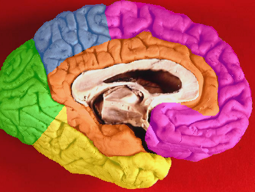
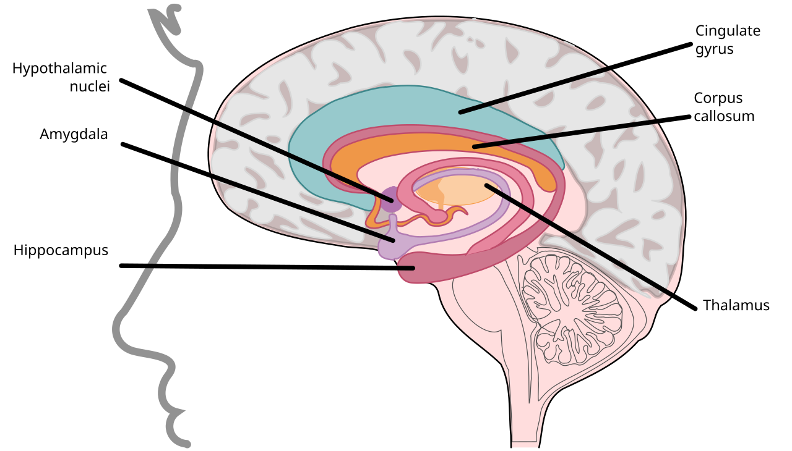

# Anatomy-大脑与神经科学

> 大脑区域划分与「情绪 vs 理性」的生物学基础。图片来源：[Wikimedia Commons：Brain lobes - medial surface with limbic lobe](https://commons.wikimedia.org/wiki/File:Brain_lobes_-_medial_surface_with_limbic_lobe.png)、[Wikimedia Commons：The Limbic Lobe](https://commons.wikimedia.org/wiki/File:1511_The_Limbic_Lobe.svg)。

## 大脑区域划分

* 四个大脑叶（cerebral lobes）：
  * 额叶（frontal）：运动、语言、执行功能；其前部是**前额叶**（prefrontal cortex）。
  * 顶叶（parietal）：感觉、空间。
  * 颞叶（temporal）：听觉、语言、记忆。
  * 枕叶（occipital）：视觉。
  * 内侧还有**边缘叶**（limbic lobe），与边缘系统密切相关。

## 两个关键系统：边缘系统 vs 前额叶

* **边缘系统（limbic system）**：海马（记忆）、杏仁核（情绪，尤其恐惧与愤怒）、下丘脑（内稳态）等。特点是快、自动、强烈——「情绪与油门」。
* **前额叶（prefrontal cortex）**：决策、规划、短期（工作）记忆、冲动抑制、社交判断。特点是慢、费力、可塑——「理性与刹车」。
* 日常决策是两者的协作与竞争：情绪信号先到，理性判断后到；情绪劫持（emotional hijack）时，前额叶暂时被压制。

## 神经多样性

* 孤独症谱系障碍（ASD）、ADHD、读写障碍等是神经发育差异，不是缺陷。
* 文化与生活经历同样塑造每个人的行为、沟通偏好和冲突反应。
* 含义：协作与冲突处理不能假设所有人都遵循同一套默认沟通规则。

## 与团队冲突处理的关联

* 冲突中对方先激活的是边缘系统（防御、情绪），不是前额叶（讲道理）——先让情绪落地，再进入理性讨论。
* 决策需要「慢系统」参与：给时间、给结构化流程（讨论 → 投票 → deadline）。
* 在开源社区里的应用见 [Software-开源项目成功之道.md](./Software-开源项目成功之道.md) 第 8 章。
