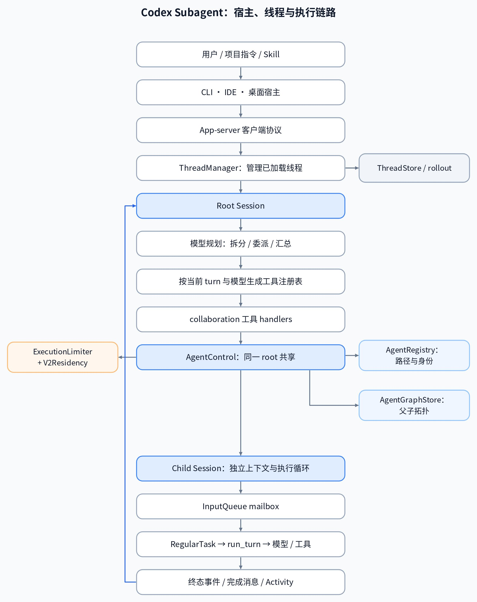
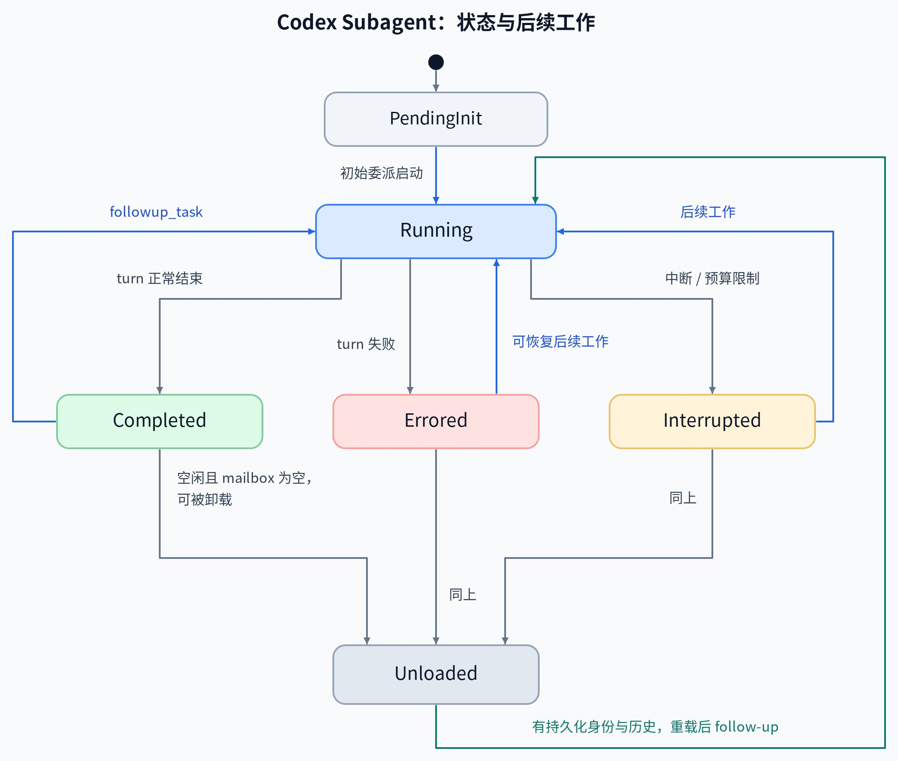
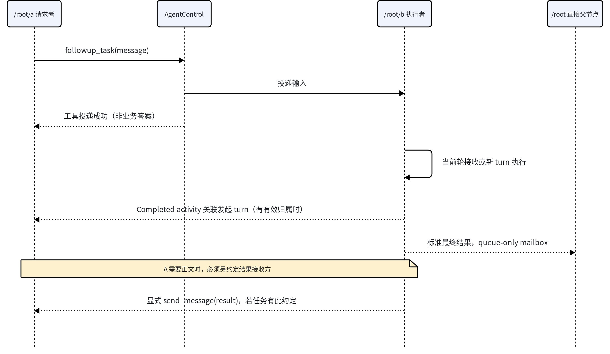
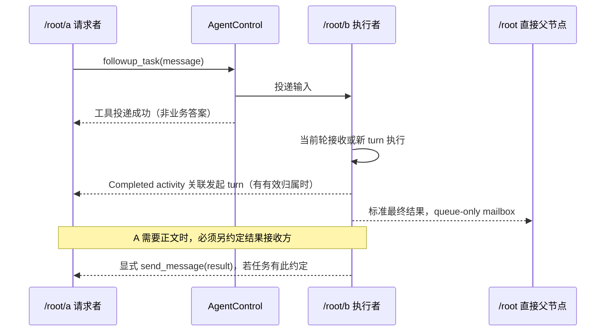

# Codex Sub-agent：架构、执行、通信与恢复

> 基于公开/开源材料分析，整理于 2026-09-19。主体固定到 `openai/codex@7498521d288b9b3b96ffba4eedf089d8d6e06a84`；§11 的跨任务补充固定到 `78245b47af2a7aafcabe025828ceecca69db4df1`，稳定版对照 `rust-v0.155.0`。研究对象是 MultiAgent V2 的有效注册与调用链，保留版本条件，不把历史兼容接口作为现行用法推荐。

本文从协作模型、对象与能力生效开始，下钻到创建、上下文继承、InputQueue、执行循环、结果路由、容量和恢复，再区分树内协作与独立任务通信。完整保留关键 prompt、源码片段、图和实现边界。

上层框架：[Agent 工程](./AI-Agent-Engineering.md#codex-sub-agent控制域消息与恢复)；[SubAgent / MultiAgent 的共享模型](./AI-Applied-Algorithms.md#subagent--agent-as-tool--multiagent从多开模型到上下文与证据控制)。

阅读导航：

- [1. 先建立整体判断](#1-先建立整体判断)
- [2. 自顶向下的架构](#2-自顶向下的架构)
- [3. 对象模型：一棵树，多个身份与生命周期](#3-对象模型一棵树多个身份与生命周期)
- [4. 从“源码存在”到“模型能调用”的生效链](#4-从源码存在到模型能调用的生效链)
- [5. 六个工具的完整契约](#5-六个工具的完整契约)
- [6. 创建子 agent：上下文、配置和环境怎样形成](#6-创建子-agent上下文配置和环境怎样形成)
- [7. 通讯与执行：消息如何真正进入模型](#7-通讯与执行消息如何真正进入模型)
- [8. 完成、中断与可观察性：谁真的收到什么](#8-完成中断与可观察性谁真的收到什么)
- [9. 容量管理：执行数、驻留数和身份数](#9-容量管理执行数驻留数和身份数)
- [10. 持久化与恢复：恢复哪一层，缺什么会失败](#10-持久化与恢复恢复哪一层缺什么会失败)
- [11. 跨任务与外部 Agent：作为边界理解，不混进核心协议](#11-跨任务与外部-agent作为边界理解不混进核心协议)
- [12. 能力矩阵、常见误解与版本边界](#12-能力矩阵常见误解与版本边界)
- [13. 对 Multi Agent 原语设计的可转化结论](#13-对-multi-agent-原语设计的可转化结论)
- [14. 源码阅读顺序与复核入口](#14-源码阅读顺序与复核入口)

## 1. 先建立整体判断

Codex sub-agent 是一种**在同一 root 控制域内，复用完整 Codex 执行循环、以独立会话处理委派工作的机制**。它同时维护三件事：谁属于哪棵 agent 树，谁正在执行一轮工作，以及谁当前被加载在内存中。模型负责拆任务、选择对象和解释结果；Rust runtime 负责工具注册、会话创建、消息投递、容量检查、执行与恢复。

这一设计适合把探索、实现、测试、审查等工作拆到独立上下文。它没有自动把这些工作变成带依赖、验收、事务和重试保证的任务图。要理解它，不能只看 `spawn_agent` 的入参，也不能把父子树直接当成工作流 DAG。

核心结论：

1. **生效面由配置、模型目录、会话版本、provider 与工具暴露共同决定。**`features.multi_agent_v2=false` 不能独自证明走 V1。模型目录仍可能选择 V2。
2. **创建树、通信图、执行轮次与结果归属是不同的结构。**兄弟可以直接发消息；兄弟发起 follow-up 后，完成活动可归发起者，标准最终答案仍回执行者的直接父节点。
3. **`send_message` 和 `followup_task` 共用 mailbox，区别主要是是否请求启动空闲目标。**返回成功不等于模型已经消费；多条 follow-up 可以并入同一轮，不是“一次调用对应一个独立任务”。
4. **fork 是历史投影，不是复制运行中的进程。**源码过滤工具轨迹、推理与部分运行状态；子 agent 复用环境，但拥有独立模型上下文与 turn。
5. **身份、驻留、执行必须分开。**V2 可卸载已空闲的 runtime 后按需恢复；`list_agents` 主要列已加载对象，不能充当完整持久化清单。
6. **源码、稳定版、官方说明与具体客户端不能直接等同。**本文逐项说明核验范围；尤其是全历史 fork 的配置覆盖、自定义角色权限和并发参数口径。

来源：[官方 Subagents](https://learn.chatgpt.com/docs/agent-configuration/subagents)、[core/src/agent/control.rs:132](https://github.com/openai/codex/blob/7498521d288b9b3b96ffba4eedf089d8d6e06a84/codex-rs/core/src/agent/control.rs#L132)、[core/src/tools/spec_plan.rs:1242](https://github.com/openai/codex/blob/7498521d288b9b3b96ffba4eedf089d8d6e06a84/codex-rs/core/src/tools/spec_plan.rs#L1242)、[core/src/agent/control/spawn.rs:67](https://github.com/openai/codex/blob/7498521d288b9b3b96ffba4eedf089d8d6e06a84/codex-rs/core/src/agent/control/spawn.rs#L67)、[core/src/session/mod.rs:2426](https://github.com/openai/codex/blob/7498521d288b9b3b96ffba4eedf089d8d6e06a84/codex-rs/core/src/session/mod.rs#L2426)。

### 1.1 版本与证据范围

| 证据层 | 固定范围 | 能证明的范围 |
|---|---|---|
| 主体源码 | `openai/codex@7498521d288b9b3b96ffba4eedf089d8d6e06a84`，2026-09-18 查询时的 main | 该提交中的实现、注册条件与调用链；不等于所有客户端已部署 |
| 稳定版对照 | `rust-v0.155.0@f0a1b8f0849d90960bc406b848f32e5a129b0457`，发布于 2026-09-17 23:14:43 UTC | 对照了具体 release 源码，不仅是 release 标题 |
| 跨任务通信补充 | §11.1–§11.7 使用 `78245b47af2a7aafcabe025828ceecca69db4df1`，2026-09-19 查询时的 main | TUI → App-server → Core 的公开链路；不把后续提交覆盖到全文 |
| 官方文档 | Subagents、App-server，读取于 2026-09-18–19 | 产品接口说明；与源码有差异时明确列出，不以文档推导任意配置都已生效 |
| 上游测试 | 阅读相关单元、集成回归测试源码 | 上游写下的行为约束；未运行这些测试，也未做真实消息、容量驱逐或崩溃恢复实验 |

本文基于公开/开源材料分析。“已核验”指源码与测试阅读证据，不代表端到端实测；客户端实际暴露的工具、有效配置和宿主指令仍需分别检查。正文中的“当前”均受上述提交范围约束，不是对未来版本的承诺。

独立任务通信属于宿主任务管理层，树内协作属于 AgentControl 层；两者在目标 Session 的执行流汇合，但入口缓冲、寻址与结果返回合同不同，详见第 11 节。源码文件、符号、行号和摘要见文末公开索引。

## 2. 自顶向下的架构



图：根据下列公开源码整理的职责关系图。

这张图表达职责关系，箭头不全是网络调用。典型本地 core 中，`ThreadManagerState.threads` 是 `RwLock<HashMap<ThreadId, Arc<CodexThread>>>`；子 agent 通过 Tokio task 运行，不是每 spawn 一次就新建一个操作系统进程。工具执行仍可能启动 shell 进程、连接 MCP 或使用远程环境，它们是下一级资源。

`AgentControl` 由同一 root 树共享，持有 registry、residency、执行计数器、root service tier 等；它通过 `Weak<ThreadManagerState>` 找到线程管理器，避免 `manager → thread → session → services → manager` 的强引用环。一个 ThreadManager 可以承载多个 root；共享 manager 不等于共享 agent 通信域。

来源：[core/src/thread_manager.rs:395](https://github.com/openai/codex/blob/7498521d288b9b3b96ffba4eedf089d8d6e06a84/codex-rs/core/src/thread_manager.rs#L395)、[core/src/agent/control.rs:132](https://github.com/openai/codex/blob/7498521d288b9b3b96ffba4eedf089d8d6e06a84/codex-rs/core/src/agent/control.rs#L132)、[core/src/tasks/mod.rs:331](https://github.com/openai/codex/blob/7498521d288b9b3b96ffba4eedf089d8d6e06a84/codex-rs/core/src/tasks/mod.rs#L331)。

### 2.1 三个外观相似、语义不同的入口

| 入口 | 谁发起 | 核心作用 | 不应混淆的点 |
|---|---|---|---|
| `collaboration.*` | 当前模型 | 在当前 root 的 agent 控制域中创建、通讯、等待、中断 | 本文主体，模型工具，不是通用外部 RPC |
| App-server `thread/*`、`turn/*` | CLI、IDE、桌面、SDK 等客户端 | 创建/读取线程、提交输入、订阅事件与处理审批 | API 版本号 V2 与 MultiAgent V2 是两条独立版本轴 |
| TUI 跨任务工具 / SDK `ExternalMessage` | 宿主工具或外部程序 | 给独立任务注入工具级上下文 | 不自动建立当前 agent 树的父子归属，也不授予用户权限 |

具体会话的工具由宿主提供。本文用开源实现解释可比较的机制；只有契约和证据一致的部分才做对应，不推断桌面实现与 main 逐行相同。

## 3. 对象模型：一棵树，多个身份与生命周期

| 对象 / 字段 | 代表什么 | 不能替代什么 |
|---|---|---|
| `ThreadId` | 持久化会话的实际标识 | 不是一次工具调用或一次任务尝试的 ID |
| `AgentPath` | 当前 root 控制域内的逻辑地址，如 `/root/review/api` | 不是全局唯一地址，不是文件路径 |
| `parent_thread_id` | 创建、管理与恢复归属 | 不一定是后续工作实际请求者 |
| `SessionId` | AgentControl 的 session 标识，等于 root thread ID | 不等于每个 child 的 ThreadId |
| `CodexThread / Session` | 已加载会话实例，持有上下文、输入、服务与运行状态 | 不等于操作系统线程；持久化身份可先于/晚于 runtime 存在 |
| `TurnContext.sub_id` / turn ID | 某轮执行与事件关联 | 不等于可持久重试的业务 work ID |
| `parent_turn_id / root_turn_id` | 工作发起轮次与根轮次追踪 | 不保证每条消息单独对应一个 turn |
| `initiating_agent_path` | 本轮触发工作的 agent，用于完成活动路由等 | 不会重写执行者的父节点 |
| `call_id` | 一次模型工具调用及其输出关联 | 不是 agent 地址，也不是执行结果验收 ID |
| `InterAgentCommunication.id` | 消息进入模型历史时使用的响应项标识之一 | 不应与 transport submission、业务幂等键混为一谈 |
| `SubAgentActivityItem.id` | UI / 事件中的活动项 ID | “活动完成”不是业务产物验收通过 |

`task_name` 特别容易误读：它命名新 agent 在树中的路径段。后续 `followup_task` 并不为每次工作生成新的 `task_name` 对象或显式 work ledger。

来源：[core/src/agent/control.rs:132](https://github.com/openai/codex/blob/7498521d288b9b3b96ffba4eedf089d8d6e06a84/codex-rs/core/src/agent/control.rs#L132)、[core/src/agent/registry.rs:25](https://github.com/openai/codex/blob/7498521d288b9b3b96ffba4eedf089d8d6e06a84/codex-rs/core/src/agent/registry.rs#L25)、[core/src/tools/handlers/multi_agents_v2/spawn.rs:105](https://github.com/openai/codex/blob/7498521d288b9b3b96ffba4eedf089d8d6e06a84/codex-rs/core/src/tools/handlers/multi_agents_v2/spawn.rs#L105)、[protocol/src/protocol.rs:807](https://github.com/openai/codex/blob/7498521d288b9b3b96ffba4eedf089d8d6e06a84/codex-rs/protocol/src/protocol.rs#L807)、[core/src/session/mod.rs:2426](https://github.com/openai/codex/blob/7498521d288b9b3b96ffba4eedf089d8d6e06a84/codex-rs/core/src/session/mod.rs#L2426)。

### 3.1 状态是多个维度，不宜压成一个 enum

`AgentStatus` 包含 `PendingInit / Running / Interrupted / Completed(Option<String>) / Errored(String) / Shutdown / NotFound`。其中 `Completed` 指当前 turn 完成，agent 仍可接收 follow-up；`NotFound` 可以只是当前 runtime 未加载，不能直接推导持久化记录已删除。



图：根据下列公开源码整理；恢复路径有前提。

`Unloaded` 是本文为解释驻留状态使用的概念，不是新增 `AgentStatus` 枚举。重载箭头有条件，不表示所有已卸载对象都保证恢复。

源码中的 `is_final()`**排除 `Interrupted`**。因此中断虽然结束当前执行，并不沿成功/失败完成结果那条路径自动向父节点发送最终答案；相关回归测试明确验证这一点。用户需要区分 `interrupt_agent` 返回的 `previous_status`、子 turn 的 `TurnAborted` 事件和父 mailbox 的最终结果。

来源：[protocol/src/protocol.rs:1823](https://github.com/openai/codex/blob/7498521d288b9b3b96ffba4eedf089d8d6e06a84/codex-rs/protocol/src/protocol.rs#L1823)、[core/src/agent/status.rs:6](https://github.com/openai/codex/blob/7498521d288b9b3b96ffba4eedf089d8d6e06a84/codex-rs/core/src/agent/status.rs#L6)、[core/src/tools/handlers/multi_agents_tests.rs:2000](https://github.com/openai/codex/blob/7498521d288b9b3b96ffba4eedf089d8d6e06a84/codex-rs/core/src/tools/handlers/multi_agents_tests.rs#L2000)、[core/src/agent/control/residency.rs:233](https://github.com/openai/codex/blob/7498521d288b9b3b96ffba4eedf089d8d6e06a84/codex-rs/core/src/agent/control/residency.rs#L233)。

## 4. 从“源码存在”到“模型能调用”的生效链

### 4.1 V2 选择与工具注册

当前配置选择逻辑可压缩成下面的伪代码；顺序不能交换：

```text
if Feature::MultiAgentV2 enabled:
    V2
else if agents.enabled == false:
    Disabled
else:
    configured_or_restored_session_version
    or model_catalog.multi_agent_version
    or (Feature::Collab ? V1 : Disabled)
```

关键判断在源码中直接体现为以下优先级（原码节选）：

```rust
    pub(crate) fn multi_agent_version_override(&self) -> Option<MultiAgentVersion> {
        if self.features.enabled(Feature::MultiAgentV2) {
            Some(MultiAgentVersion::V2)
        } else if !self.agents_enabled {
            Some(MultiAgentVersion::Disabled)
        } else {
            None
        }
    }
```

`features.multi_agent_v2` 在源码中为 stable、默认 false；`multi_agent` 为 stable、默认 true。新会话可通过模型目录选 V2，已选版本可锁定在 Session 并写进历史；恢复、fork 再继承它。显式 V2 feature 的判断甚至先于 `agents.enabled`，因此不要把两个互相冲突的设置当成可靠关闭方式。

V2 工具随后还经过这些条件：

- root 与 child 的规则不同：当前 V2 子 agent 要有 `model_info.multi_agent_version == V2` 才注册协作工具；选用不提供 V2 协作的模型，不能推断 child 还能继续派发。
- provider 是否支持 namespace tools 决定工具是否挂在 `collaboration` 命名空间；默认 namespace 可配置。
- `wait_agent_enabled` 可关闭 wait；`expose_spawn_agent_model_overrides` 控制模型参数可见性；配置的 agent roles 影响 `agent_type` 是否暴露。
- 默认 `non_code_mode_only=true` 将这些工具注册为 `DirectModelOnly`，不作为 code-mode 嵌套工具暴露。是否允许嵌套调用应据此检查实际注册结果。
- 模型目录可以提供工具描述和 multi-agent 提示，宿主还可增加更严格指令。工具 schema、代码校验、授权指令需要同时满足。

来源：[core/src/config/mod.rs:1543](https://github.com/openai/codex/blob/7498521d288b9b3b96ffba4eedf089d8d6e06a84/codex-rs/core/src/config/mod.rs#L1543)、[features/src/lib.rs:1302](https://github.com/openai/codex/blob/7498521d288b9b3b96ffba4eedf089d8d6e06a84/codex-rs/features/src/lib.rs#L1302)、[core/src/thread_manager.rs:1683](https://github.com/openai/codex/blob/7498521d288b9b3b96ffba4eedf089d8d6e06a84/codex-rs/core/src/thread_manager.rs#L1683)、[core/src/tools/spec_plan.rs:642](https://github.com/openai/codex/blob/7498521d288b9b3b96ffba4eedf089d8d6e06a84/codex-rs/core/src/tools/spec_plan.rs#L642)、[core/src/tools/spec_plan.rs:1242](https://github.com/openai/codex/blob/7498521d288b9b3b96ffba4eedf089d8d6e06a84/codex-rs/core/src/tools/spec_plan.rs#L1242)、[core/src/config/mod.rs:1292](https://github.com/openai/codex/blob/7498521d288b9b3b96ffba4eedf089d8d6e06a84/codex-rs/core/src/config/mod.rs#L1292)。

### 4.2 可用不等于允许主动派发

读取时的官方本地 Codex 说明要求：用户明确请求，或适用 AGENTS.md / skill 明确要求委派。工具可用并不独自构成主动派发的条件。

源码仍有基于 reasoning effort 等信息选择 multi-agent 提示的回退逻辑；模型目录与配置可以覆盖提示。它解释的是提示生成，不替代会话实际适用的授权与指令。部署文档应把“工具可用”和“何时应调用”写成两张表。

来源：[官方触发方式](https://learn.chatgpt.com/docs/agent-configuration/subagents)、[core/src/session/multi_agents.rs:82](https://github.com/openai/codex/blob/7498521d288b9b3b96ffba4eedf089d8d6e06a84/codex-rs/core/src/session/multi_agents.rs#L82)。

**具体 prompt 与选择条件**

以下原文来自本文固定的 `7498521d288b9b3b96ffba4eedf089d8d6e06a84` 提交，已逐字核对上游文件。它们是源码内置的回退模板；不代表任意宿主、模型目录或当前会话都会原样采用。

**选择顺序：**`effective_multi_agent_mode(step_context)` 先检查当前会话为 V2；随后按下面的优先级解析。这里的 effort 是当前 step 的 `settings.effective_reasoning_effort()`：优先使用所选 effort，未设置时取模型默认值。

| 优先级 | 条件 | 结果 |
|---|---|---|
| 1 | config.multi_agent_v2.multi_agent_mode_hint_text 为 Some(text) | 直接采用 Custom(text)，不再检查 effort；空字符串也算显式覆盖。 |
| 2 | 上述配置缺省，且 model_info.model_messages.multi_agent.mode.hint_text 存在 | 直接采用模型目录的 Custom(text)，同样跳过 effort 分支。 |
| 3 | 没有统一 hint，且有效 effort == Ultra | 选择 mode.proactive；目录有值则用目录文本，否则使用下面的内置 Proactive prompt。 |
| 4 | 没有统一 hint，且有效 effort != Ultra（包括仍为 None） | 选择 mode.explicit；目录有值则用目录文本，否则使用下面的内置 ExplicitRequestOnly prompt。 |

因此，代码不是“effort 越高就越主动”的连续规则，也不是 `high / xhigh / max` 都开启主动委派；这个分支只精确匹配 `ReasoningEffort::Ultra`。

**A. ExplicitRequestOnly：仅在显式请求时委派**

常量 `EXPLICIT_REQUEST_ONLY_MULTI_AGENT_MODE_TEXT` 的完整正文如下；外层标签由 renderer 添加，作为 `developer` 消息注入。

```text
<multi_agent_mode>
Any earlier instruction enabling proactive multi-agent delegation no longer applies. Do not spawn sub-agents unless the user or applicable AGENTS.md/skill instructions explicitly ask for sub-agents, delegation, or parallel agent work.
</multi_agent_mode>
```

含义：撤销先前主动委派提示，只有用户或适用的 AGENTS.md / skill 明确要求 sub-agent、委派或并行 agent 工作时才派发。

**B. Proactive：允许并鼓励有价值的主动委派**

常量 `PROACTIVE_MULTI_AGENT_MODE_TEXT` 的完整正文如下：

```text
<multi_agent_mode>
Proactive multi-agent delegation is active. Any earlier developer instruction requiring an explicit user request before spawning sub-agents no longer applies. This mode remains active until a later multi-agent mode developer message changes it. User requests override this hint.

If at any point you can parallelize work by delegating tasks to another agent (no matter if you are root or subagent), you should do so using collaboration tools if it could save time or improve quality.
</multi_agent_mode>
```

含义：该提示声明主动委派模式持续到后续 mode developer 消息修改为止；root 和 sub-agent 都可在节省时间或提高质量时主动并行。提示本身也明确写着 `User requests override this hint.`

**注入与覆盖边界：**

- `MultiAgentModeInstructions` 使用 `role = developer`、`content_kind = multi_agent.mode_instructions` 和 `<multi_agent_mode>` 标签。它回答“什么时候派发”；root/subagent 的 `role` 提示回答“你是谁、工具怎么用”，两者分别解析。初始组装特意把 mode 放在 usage hint 之后，避免泛化的“可以 spawn”覆盖当前委派政策。
- 配置或目录中的空字符串会抑制这一 mode 消息，不会触发内置 fallback；这不等于关闭协作工具，也不能推导其他上下文指令被撤销。非空 `Custom` 文本在 world-state 层按 `Tokens(400)` 策略截断。
- world-state 按差异注入：mode 和 usage-hint hash 都没变时不重复发送；usage hint 更新时可重新发送同一 mode。不要把“源码包含 Proactive 常量”当成“当前会话已启用主动委派”的证据；仍应核对有效配置、模型目录和实际宿主指令。

源码：[选择逻辑](https://github.com/openai/codex/blob/7498521d288b9b3b96ffba4eedf089d8d6e06a84/codex-rs/core/src/session/multi_agents.rs#L82)；[有效 effort](https://github.com/openai/codex/blob/7498521d288b9b3b96ffba4eedf089d8d6e06a84/codex-rs/core/src/session/step_settings.rs#L87)；[两段内置 prompt 与目录覆盖](https://github.com/openai/codex/blob/7498521d288b9b3b96ffba4eedf089d8d6e06a84/codex-rs/prompts/src/model_messages/multi_agent.rs#L46)；[空文本抑制、developer 角色与标签](https://github.com/openai/codex/blob/7498521d288b9b3b96ffba4eedf089d8d6e06a84/codex-rs/core/src/context/multi_agent_mode_instructions.rs#L14)；[400-token 策略与差异注入](https://github.com/openai/codex/blob/7498521d288b9b3b96ffba4eedf089d8d6e06a84/codex-rs/core/src/context/world_state/multi_agent_mode.rs#L13)；[mode 位于 usage hint 之后](https://github.com/openai/codex/blob/7498521d288b9b3b96ffba4eedf089d8d6e06a84/codex-rs/core/src/session/mod.rs#L4335)。

## 5. 六个工具的完整契约

以下为本次 main 的默认 V2 接口，不把 V1 入参混入。宿主可改变展示文案或隐藏参数。

| 工具 | 输入 | 成功结果 / 作用 | 关键边界 |
|---|---|---|---|
| `spawn_agent` | `task_name, message`；可选 `fork_turns, model, reasoning_effort, agent_type` | 默认返回 `{task_name: "/root/x"}`，可配置额外 nickname；创建并提交初始工作 | 返回不等待子工作完成；模型与 role 参数受注册条件约束 |
| `send_message` | `target, message` | 投递 queue-only 消息；当前 handler 返回空文本的成功输出 | 不启动普通空闲会话的新 turn；没有模型消费回执 |
| `followup_task` | `target, message` | 投递 trigger-turn 消息；当前 handler 同样返回空成功输出 | 运行中可并入当前执行，空闲可启动新 turn；禁止 target root |
| `wait_agent` | 可选 `timeout_ms` | `{message, timed_out}` | 等调用者 mailbox / steer 活动；没有 target、结果列表或 all-join |
| `interrupt_agent` | `target` | `{previous_status}` | 禁止 root、自身；请求停止当前执行，保留后续使用能力；不是回滚 |
| `list_agents` | 可选 `path_prefix` | `{agents: [{agent_name, agent_status}]}` | 按逻辑路径前缀筛选已加载 agent，可含 root；不是全部历史身份 |

来源：[core/src/tools/handlers/multi_agents_v2/spawn.rs:272](https://github.com/openai/codex/blob/7498521d288b9b3b96ffba4eedf089d8d6e06a84/codex-rs/core/src/tools/handlers/multi_agents_v2/spawn.rs#L272)、[core/src/tools/handlers/multi_agents_v2/message_tool.rs:38](https://github.com/openai/codex/blob/7498521d288b9b3b96ffba4eedf089d8d6e06a84/codex-rs/core/src/tools/handlers/multi_agents_v2/message_tool.rs#L38)、[core/src/tools/handlers/multi_agents_v2/wait.rs:133](https://github.com/openai/codex/blob/7498521d288b9b3b96ffba4eedf089d8d6e06a84/codex-rs/core/src/tools/handlers/multi_agents_v2/wait.rs#L133)、[core/src/agent/control/interrupt.rs:27](https://github.com/openai/codex/blob/7498521d288b9b3b96ffba4eedf089d8d6e06a84/codex-rs/core/src/agent/control/interrupt.rs#L27)、[core/src/agent/control.rs:558](https://github.com/openai/codex/blob/7498521d288b9b3b96ffba4eedf089d8d6e06a84/codex-rs/core/src/agent/control.rs#L558)。

### 5.1 寻址不是逐跳转发

当前 agent 为 `/root/implement` 时：

| target | 解析 |
|---|---|
| `test` | `/root/implement/test` |
| `test/unit` | `/root/implement/test/unit` |
| `/root/research` | 同一 root 中的兄弟分支 |
| `/root` | 根，可收 `send_message`，不可收 `followup_task` |
| Thread UUID | 直接解析成 ThreadId，后续仍须通过“已知 agent”校验 |
| `../research` | 非法，`.` / `..` 不作为导航段支持 |

单个 `task_name` 只允许小写字母、数字、下划线；`root` 保留、斜杠禁止、重复路径被拒绝。兄弟消息由共享 AgentControl 直接定位目标 ThreadId，不经父模型转发。`AgentPath` 类型接受的特殊内部地址也不意味着一般工具用户拥有额外 agent 入口。

来源：[core/src/agent/agent_resolver.rs:9](https://github.com/openai/codex/blob/7498521d288b9b3b96ffba4eedf089d8d6e06a84/codex-rs/core/src/agent/agent_resolver.rs#L9)、[protocol/src/agent_path.rs:59](https://github.com/openai/codex/blob/7498521d288b9b3b96ffba4eedf089d8d6e06a84/codex-rs/protocol/src/agent_path.rs#L59)、[core/src/agent/registry.rs:25](https://github.com/openai/codex/blob/7498521d288b9b3b96ffba4eedf089d8d6e06a84/codex-rs/core/src/agent/registry.rs#L25)、[core/src/agent/control/delivery.rs:77](https://github.com/openai/codex/blob/7498521d288b9b3b96ffba4eedf089d8d6e06a84/codex-rs/core/src/agent/control/delivery.rs#L77)。

### 5.2 `wait_agent` 不是 join，也不是收信函数

默认 30 秒、最小 10 秒、最大 1 小时。小于最小值抬高，大于最大值报错。实现先订阅 activity，再检查是否已有 pending steer/mail，避免只等未来通知而漏掉已入队输入；已有 steer 优先报告“被新输入打断”。

返回消息仅为 `Wait completed.`、`Wait interrupted by new input.` 或 `Wait timed out.` 等状态。正文经正常模型上下文输入路径呈现。watch 可合并活动通知，但 mailbox 的 `VecDeque` 保存消息；两者不能互换。

父 agent 想等 A、B、C 全部完成，要自己维护期待集合、消费消息并核对结果，再决定继续等。官方“汇总所有结果”的产品描述不能理解为 `wait_agent` 自带 all-join、依赖检查或答案验收。

来源：[core/src/tools/handlers/multi_agents_v2/wait.rs:40](https://github.com/openai/codex/blob/7498521d288b9b3b96ffba4eedf089d8d6e06a84/codex-rs/core/src/tools/handlers/multi_agents_v2/wait.rs#L40)、[core/src/session/input_queue.rs:81](https://github.com/openai/codex/blob/7498521d288b9b3b96ffba4eedf089d8d6e06a84/codex-rs/core/src/session/input_queue.rs#L81)。

## 6. 创建子 agent：上下文、配置和环境怎样形成

### 6.1 完整调用链

```text
模型调用 spawn_agent
  → handler：解析入参、fork 模式、任务名、角色
  → prepare_agent_spawn_config：从当前 step/turn 得到有效配置
  → 生成 SubAgentSource::ThreadSpawn + AgentPath
  → initial InterAgentCommunication(trigger_turn=true)
  → AgentControl.spawn_agent_internal
      → 执行容量预检查
      → 预留驻留槽；必要时卸载空闲 runtime
      → 预留身份与路径
      → 创建全新 Session 或构造历史 fork
      → 提交 registry / residency，通知 thread created
      → 写父子 graph edge
      → 投递初始消息
  → 返回 task_name；child 异步执行
```

这是分阶段过程，不是覆盖所有步骤的数据库事务。reservation 的 RAII Drop 会释放未提交槽位/路径，但不能据此声称整个 spawn 天然有业务层 exactly-once 或自动重试。调用失败后重试前，需要观察是否已有目标身份与运行实例。

来源：[core/src/tools/handlers/multi_agents_v2/spawn.rs:105](https://github.com/openai/codex/blob/7498521d288b9b3b96ffba4eedf089d8d6e06a84/codex-rs/core/src/tools/handlers/multi_agents_v2/spawn.rs#L105)、[core/src/agent/child_config.rs:51](https://github.com/openai/codex/blob/7498521d288b9b3b96ffba4eedf089d8d6e06a84/codex-rs/core/src/agent/child_config.rs#L51)、[core/src/agent/control/spawn.rs:622](https://github.com/openai/codex/blob/7498521d288b9b3b96ffba4eedf089d8d6e06a84/codex-rs/core/src/agent/control/spawn.rs#L622)、[core/src/agent/registry.rs:25](https://github.com/openai/codex/blob/7498521d288b9b3b96ffba4eedf089d8d6e06a84/codex-rs/core/src/agent/registry.rs#L25)。

### 6.2 配置优先级：逐字段解析，最后收紧执行策略

1. 以父会话有效配置为底；main 使用**调用工具时捕获的 StepContext settings** 补齐模型和推理强度，避免复制陈旧配置。
2. 单字段优先取显式 spawn 参数，其次 `[agents].default_subagent_*`，否则继承父值。若显式或默认值选择了模型、却没有指定 effort，则采用所选模型的默认 effort。
3. 再应用选中 role 的可覆盖字段；因此 role 中明确指定的 model/effort 可以覆盖前一步。role 只指定 model 时，会保留前一步已解析的 effort，再做支持性检查。
4. service tier 遵循 root 偏好并检查 child 模型支持情况，不让 role 任意改掉 root 路由选择。
5. 最后重新应用 live turn 的审批、permission profile、cwd 等运行策略。

显式模型选择会检查模型目录与支持的 reasoning levels。模型可被创建为 child，并不自动保证它具备向下继续委派的工具；这是前一节的独立注册条件。

来源：[core/src/agent/child_config.rs:51](https://github.com/openai/codex/blob/7498521d288b9b3b96ffba4eedf089d8d6e06a84/codex-rs/core/src/agent/child_config.rs#L51)、[core/src/agent/child_config.rs:196](https://github.com/openai/codex/blob/7498521d288b9b3b96ffba4eedf089d8d6e06a84/codex-rs/core/src/agent/child_config.rs#L196)、[core/src/agent/child_config.rs:171](https://github.com/openai/codex/blob/7498521d288b9b3b96ffba4eedf089d8d6e06a84/codex-rs/core/src/agent/child_config.rs#L171)。

### 6.3 全历史 fork：历史范围与配置覆盖解耦

不能把“`fork_turns=all` 永远继承父模型和推理强度、不接受覆盖”当作统一规则。本文核验的 main 与 0.155.0 V2 均先解析模型覆盖，全历史 fork 在提供 role 时也应用 role；回归测试明确覆盖 `fork_turns=all + agent_type`。

历史继承范围与配置覆盖在该开源 V2 中已解耦。具体宿主仍可能收紧工具 schema 或执行指令，因此调用前要检查实际暴露的参数及限制；不能用 main 的实现直接推断任意安装版本的行为。

来源：[core/src/agent/child_config.rs:51](https://github.com/openai/codex/blob/7498521d288b9b3b96ffba4eedf089d8d6e06a84/codex-rs/core/src/agent/child_config.rs#L51)、[core/src/tools/handlers/multi_agents_tests.rs:381](https://github.com/openai/codex/blob/7498521d288b9b3b96ffba4eedf089d8d6e06a84/codex-rs/core/src/tools/handlers/multi_agents_tests.rs#L381)；稳定版对应 [V2 spawn](https://github.com/openai/codex/blob/f0a1b8f0849d90960bc406b848f32e5a129b0457/codex-rs/core/src/tools/handlers/multi_agents_v2/spawn.rs#L123)。

### 6.4 `all / N / none` 具体继承什么

| 模式 | 实际含义 | 使用代价 |
|---|---|---|
| `all`，默认 | 从父已保存模型历史构造完整可用前缀，再做清洗与 child 指令替换 | 能保留广泛背景，但带入更多无关上下文；不保证保留已压缩前的原始全文 |
| 正整数字符串，如 `3` | 保留最近 N 个可证明的 fork turn，再重建 child 初始上下文 | 降低污染，但可能缺早期约束；压缩后无法保证恢复不可证明的 N 轮原文 |
| `none` | 不复制父对话历史，新建 child 会话 | `message` 必须自足；仍继承适用配置、环境和指令快照，不是完全空白的裸模型 |

fork 前调用 `ensure_rollout_materialized()` 与 `flush_rollout()`，然后读取 parent model context。`keep_forked_rollout_item` 保留 system/developer/user、assistant final answer、无 call_id 的函数输出与配置更新等；排除普通关联工具调用/输出、reasoning、搜索轨迹、原 inter-agent 通讯等。压缩 checkpoint 的 replacement history 也要清洗。

这意味着“all”是**经过筛选的全部可用历史范围**，不是将每条原始工具日志和运行栈原样复制给 child。父累计 token 使用不会作为 child 累计使用继承。main 还会清除/重建父角色提示、multi-agent mode 提示等，避免 child 同时被告知自己是 root。

来源：[core/src/agent/control/spawn.rs:829](https://github.com/openai/codex/blob/7498521d288b9b3b96ffba4eedf089d8d6e06a84/codex-rs/core/src/agent/control/spawn.rs#L829)、[core/src/agent/control/spawn.rs:67](https://github.com/openai/codex/blob/7498521d288b9b3b96ffba4eedf089d8d6e06a84/codex-rs/core/src/agent/control/spawn.rs#L67)；测试入口见 `agent/control_tests.rs` 中 `spawn_agent_can_fork_parent_thread_history_with_sanitized_items`、`spawn_agent_numeric_fork_from_compacted_paginated_parent_clamps_to_provable_turns`。

### 6.5 自定义角色：可解析不等于可生效

官方文档介绍 `~/.codex/agents/*.toml` 和项目 `.codex/agents/*.toml`，每个独立文件提供 `name / description / developer_instructions`；名字以 `name` 字段为准。内建角色是 default、worker、explorer，自定义同名角色优先。

**实现边界要以 `AgentRoleOverrides` 为准。**本次 main 与 0.155.0 均采取有限字段投影：

| 角色文件内容 | 当前实现如何处理 |
|---|---|
| developer instructions、model、reasoning effort/summary、verbosity、personality 等 | 投影到 child 配置；仍受后续校验或 root 策略影响 |
| 部分 feature 的 `false` | 只允许禁用白名单能力，如 shell、apps、plugins、memory、request permissions；不能任意启用能力 |
| skills 配置 | 主要保留禁用项等限制；不是任意扩充上下文预算 |
| sandbox、approval policy、model provider、MCP server、新 endpoint、notify | 不经 role 投影成新的执行权限或宿主配置 |

实现不是把整个 `role_config` 合并回父配置，而是显式构造投影对象（原码节选）：

```rust
    let mut overrides = AgentRoleOverrides {
        developer_instructions: role_config.developer_instructions,
        model: role_config.model,
        model_reasoning_effort: role_config.model_reasoning_effort,
        model_reasoning_summary: role_config.model_reasoning_summary,
        model_verbosity: role_config.model_verbosity,
        personality: role_config.personality,
        service_tier: role_config.service_tier,
        ..Default::default()
    };

```

因此，**不能按当前官方页面的宽泛描述，推导 role 文件里的任意 `config.toml` 字段都会生效**；也不能单靠 role 中的 `sandbox_mode="read-only"` 就宣称建立了强制只读隔离。需要由真正的父会话/环境权限机制设置并验证。这是文档与实现冲突，本文明确采用实现证据。

建议给角色设计做两层检查：语义指令是否足够聚焦；实际工具与权限是否真的被收紧。仅写“你是只读 reviewer”属于行为约束，不能当权限边界。

来源：[agent-roles/src/loader.rs:23](https://github.com/openai/codex/blob/7498521d288b9b3b96ffba4eedf089d8d6e06a84/codex-rs/agent-roles/src/loader.rs#L23)、[core/src/agent/role.rs:37](https://github.com/openai/codex/blob/7498521d288b9b3b96ffba4eedf089d8d6e06a84/codex-rs/core/src/agent/role.rs#L37)、[core/src/agent/role_tests.rs:433](https://github.com/openai/codex/blob/7498521d288b9b3b96ffba4eedf089d8d6e06a84/codex-rs/core/src/agent/role_tests.rs#L433)；稳定版 [role.rs](https://github.com/openai/codex/blob/f0a1b8f0849d90960bc406b848f32e5a129b0457/codex-rs/core/src/agent/role.rs#L37)。

### 6.6 环境共享与授权继承

child 继承调用时的环境选择、cwd、适用执行策略与父指令快照。普通本地 spawn 不自动创建 worktree、容器或独立 DB；共享文件系统意味着兄弟可立即看到彼此写入，也可能互相覆盖。资源隔离必须单独设计。

历史文本继承与授权继承也不是一回事。main 在相应 Guardian context mode 下给继承 user message 标注 `inherited_user_message`，清理父局部授权证据，避免恢复时把旧上下文重新认作 child 获得的新用户授权。消息中的“请执行”不自动拥有与用户指令同等的权限。

来源：[core/src/agent/child_config.rs:171](https://github.com/openai/codex/blob/7498521d288b9b3b96ffba4eedf089d8d6e06a84/codex-rs/core/src/agent/child_config.rs#L171)、[core/src/agent/control/spawn.rs:829](https://github.com/openai/codex/blob/7498521d288b9b3b96ffba4eedf089d8d6e06a84/codex-rs/core/src/agent/control/spawn.rs#L829)、[core/src/agent/control/spawn.rs:622](https://github.com/openai/codex/blob/7498521d288b9b3b96ffba4eedf089d8d6e06a84/codex-rs/core/src/agent/control/spawn.rs#L622)。

## 7. 通讯与执行：消息如何真正进入模型

### 7.1 消息封装与投递边界

下面是理解路由所需的字段投影，并非要求调用者自行构造的完整公开 API：

```text
InterAgentCommunication {
  id?: ResponseItemId,
  author: AgentPath,
  recipient: AgentPath,
  other_recipients: AgentPath[],
  content: string,
  encrypted_content?: string,
  trigger_turn: bool
}

TurnStartOptions {
  parent_turn_id?, root_turn_id?, turn_trigger?, ...
}

AgentCommunicationContext {
  kind: Spawn | Message | Followup | Result,
  sender_thread_id
}
```

三者分工不同：communication 是模型侧消息，start options 是执行启动元数据，context 用于发送方及通讯类型的追踪。`other_recipients` 字段存在，但当前六工具并未提供广播入参；不要据此宣称支持用户可调用的群发原语。

代码区分 `Plaintext` 与 `Encrypted`：普通模型工具来源走 encrypted content，明确的 direct plaintext 来源包装成 `InterAgentMessage`。这说明模型/宿主内容表示不同，**不构成“Codex 提供了一个端到端加密 A2A 网络协议”的证据**。

完整路径：

```text
send_message / followup_task
  → resolve_agent_target
  → ensure_agent_known
  → ensure_v2_agent_loaded（目标未驻留时）
  → AgentMessage.into_communication
  → send_inter_agent_communication
  → ThreadManagerState.send_op(Op::InterAgentCommunication)
  → Session submission handler
  → InputQueue.enqueue_mailbox_communication
  → watch 通知 + 条件性启动 / 继续现有 turn
  → drain / record_inter_agent_communication
  → 模型下一次可接收输入的边界
```

handler 最终返回的是空成功输出。transport 有 submission 标识和 send/receive tracing，但当前模型接口没有 `accepted / consumed / applied / done` 分级回执，也没有用户可传的消息幂等键。发送成功最多说明本次提交链成功；它不代表业务执行成功，更不是一次同步 RPC。

来源：[protocol/src/protocol.rs:807](https://github.com/openai/codex/blob/7498521d288b9b3b96ffba4eedf089d8d6e06a84/codex-rs/protocol/src/protocol.rs#L807)、[core/src/tools/handlers/multi_agents_v2/message_tool.rs:38](https://github.com/openai/codex/blob/7498521d288b9b3b96ffba4eedf089d8d6e06a84/codex-rs/core/src/tools/handlers/multi_agents_v2/message_tool.rs#L38)、[core/src/agent/control/delivery.rs:77](https://github.com/openai/codex/blob/7498521d288b9b3b96ffba4eedf089d8d6e06a84/codex-rs/core/src/agent/control/delivery.rs#L77)、[core/src/session/handlers.rs:78](https://github.com/openai/codex/blob/7498521d288b9b3b96ffba4eedf089d8d6e06a84/codex-rs/core/src/session/handlers.rs#L78)、[core/src/session/mod.rs:3915](https://github.com/openai/codex/blob/7498521d288b9b3b96ffba4eedf089d8d6e06a84/codex-rs/core/src/session/mod.rs#L3915)。

### 7.2 不同状态下，两种发信的效果

| 目标状态 | `send_message` | `followup_task` |
|---|---|---|
| 正常运行 / 采样边界 | 排入 mailbox，当前 turn 在允许边界读取 | 同一 mailbox，通常可被当前 turn 接收 |
| 某工具仍在执行 | 通知可已到达，但不能把消息直接塞进已提交的模型请求或任意抢占外部工具 | 同左；这不是 `interrupt_agent` |
| 普通空闲 / 已完成 | 只排队，不启动新 turn | 启动新的 regular turn，受容量等检查 |
| 正在 final 收尾 | queue-only 消息可推迟到下一轮 | 显式触发工作可以保留为后续执行 |
| 挂有 outstanding durable sleep | 存在唤醒处理路径 | 存在唤醒处理路径 |
| 未加载但已知且可恢复 | 先重载 runtime，再按 queue-only 语义投递 | 先重载，再请求执行 |
| 不属于当前控制域 / 不可恢复 | 报错 | 报错 |

`InputQueue` 用 Tokio Mutex + `VecDeque` 存待处理邮件，用 watch 通知 Mailbox/Steer 活动。活动通知不是工作完成通知；它只是“现在有东西值得检查”。

`trigger_turn=false` 不等于绝对不发生任何唤醒：若会话挂有 durable sleep，公共调度器允许 mailbox 唤醒它。但这是另一个 extension 已建立睡眠状态后的组合行为，不能把 `send_message` 宣传为任意空闲 agent 的自动启动器。

来源：[core/src/session/input_queue.rs:81](https://github.com/openai/codex/blob/7498521d288b9b3b96ffba4eedf089d8d6e06a84/codex-rs/core/src/session/input_queue.rs#L81)、[core/src/session/handlers.rs:78](https://github.com/openai/codex/blob/7498521d288b9b3b96ffba4eedf089d8d6e06a84/codex-rs/core/src/session/handlers.rs#L78)、[core/src/tasks/mod.rs:440](https://github.com/openai/codex/blob/7498521d288b9b3b96ffba4eedf089d8d6e06a84/codex-rs/core/src/tasks/mod.rs#L440)。

#### 7.2.1 InputQueue：队列归属、收发身份与消费顺序

**结论：以收件人的 Session 划分 mailbox，每个已加载的 root / child Session 各有一个 InputQueue；同一收件人的不同发信人共用这个 mailbox。**当前 turn 还维护一份独立的 pending-input 缓冲。因此既不是全局只有一个队列，也不是每个发信人或每对 Agent 单独建队列。

**① 到底有几层队列？**

| 层次 | 归属与实现 | 保存什么 / 作用 |
|---|---|---|
| 操作提交通道 | 每个 Session 的 SessionIo；async_channel::bounded(512) | Submission { id, op, ... }。InterAgentCommunication 和其他控制操作先经该通道，submission_loop 再分派；不是 mailbox 本体。 |
| Session mailbox | 每个 Session 持有 InputQueue；Tokio Mutex<VecDeque<PendingMailboxCommunication>> | 所有发给该 Session 的 Agent 消息混排；跨当前 turn 暂存，mailbox 自身没有显式容量上限。 |
| Turn pending input | ActiveTurn.turn_state 内的 TurnState.pending_input；TurnInputQueue { items: Vec<TurnInput> } | 当前 turn 的待注入输入，可含用户 steer、函数输出、ResponseItem，以及调度过程中暂存的 InterAgentCommunication。不是按发信人拆分。 |
| 活动通知 | 同一 InputQueue 的 watch::Sender<InputQueueActivity> | 只通知 Mailbox / Steer 活动；不装消息正文，不是一封邮件对应一个必达事件的队列。 |

Session 同时持有 `input_queue: InputQueue` 与 `active_turn: Mutex<Option<ActiveTurn>>`；初始化时调用 `InputQueue::new()`，同一 Session 最多一个运行任务。AgentControl 共享的是控制域和身份管理，不是把整棵树的收信都放进一个 InputQueue。

```rust
pub(crate) struct TurnInputQueue {
    items: Vec<TurnInput>,
}

pub(crate) struct InputQueue {
    activity_tx: watch::Sender<InputQueueActivity>,
    mailbox_pending_mails: Mutex<VecDeque<PendingMailboxCommunication>>,
}

struct PendingMailboxCommunication {
    communication: InterAgentCommunication,
    start_options: TurnStartOptions,
    _diagnostics_guard: GaugeGuard,
}
```

源码：[Session 的字段与所有权](https://github.com/openai/codex/blob/7498521d288b9b3b96ffba4eedf089d8d6e06a84/codex-rs/core/src/session/session.rs#L58)；[每个 Session 新建 InputQueue](https://github.com/openai/codex/blob/7498521d288b9b3b96ffba4eedf089d8d6e06a84/codex-rs/core/src/session/session.rs#L1746)；[三个队列相关结构](https://github.com/openai/codex/blob/7498521d288b9b3b96ffba4eedf089d8d6e06a84/codex-rs/core/src/session/input_queue.rs#L73)；[TurnState.pending_input](https://github.com/openai/codex/blob/7498521d288b9b3b96ffba4eedf089d8d6e06a84/codex-rs/core/src/state/turn.rs#L89)；[提交通道容量 512](https://github.com/openai/codex/blob/7498521d288b9b3b96ffba4eedf089d8d6e06a84/codex-rs/core/src/session/mod.rs#L508)；[通道创建](https://github.com/openai/codex/blob/7498521d288b9b3b96ffba4eedf089d8d6e06a84/codex-rs/core/src/session/mod.rs#L590)。

**② 收件人负责路由，发信人随消息保留**

```text
A /root/a ──┐
D /root/d ──┼─ target="/root/b" → ThreadId(B) → B 的 submission channel
R /root   ──┘                                  ↓ submission_loop
                                             B.input_queue.mailbox
                                             [A 的信, D 的信, R 的信]

发给 /root/c → ThreadId(C) → C 的 submission channel → C.input_queue.mailbox

B 当前 turn 的 pending_input ──┐
B 的 mailbox ─────────────────┴─ get_pending_input() → B 的模型输入
```

| 信息 | 来自哪里 | 用在哪里 |
|---|---|---|
| target → receiver ThreadId | 模型工具只传 target / message；resolve_agent_target 解析目标。deliver_message 再确认目标在当前 AgentControl 中已知，必要时重载。 | ThreadManagerState.send_op(thread_id, ...) 找到目标 CodexThread，向其 SessionIo 提交操作。这一步已经选定收件人的队列。 |
| author: AgentPath | deliver_message 从当前调用 turn 的 session_source.get_agent_path() 取得；root 使用 /root。 | 保留在 InterAgentCommunication 中，供模型识别来源。普通 send_message / followup_task 工具参数不允许自行指定 author。 |
| recipient: AgentPath | 从已经解析的 receiver_agent.agent_path 取得。 | 同样保留在通信结构和模型输入中；不是 InputQueue 出队时的筛选键。 |
| sender_thread_id / receiver_thread_id | 调用者 Session.thread_id 与解析后的目标 ThreadId。 | 用于实际对象标识和通讯 trace；AgentCommunicationContext 携带 sender_thread_id，独立于显示给模型的逻辑路径。 |

`InputQueue` 自身没有“本队列收件人 ID”字段，也没有按 `author` / `recipient` 分桶或过滤的逻辑；入队前已经完成对象路由。消息正文里写一个 `Sender:` 不会改变 runtime 填入的 author。`AgentPath` 属于当前 root 控制域，`/root/b` 不能当作跨所有会话的全局地址。

源码：[target 解析](https://github.com/openai/codex/blob/7498521d288b9b3b96ffba4eedf089d8d6e06a84/codex-rs/core/src/agent/agent_resolver.rs#L9)；[目标校验与 author/recipient 构造](https://github.com/openai/codex/blob/7498521d288b9b3b96ffba4eedf089d8d6e06a84/codex-rs/core/src/agent/control/delivery.rs#L77)；[提交 InterAgentCommunication](https://github.com/openai/codex/blob/7498521d288b9b3b96ffba4eedf089d8d6e06a84/codex-rs/core/src/agent/control.rs#L321)；[按 ThreadId 选择 Session](https://github.com/openai/codex/blob/7498521d288b9b3b96ffba4eedf089d8d6e06a84/codex-rs/core/src/thread_manager.rs#L1658)；[通信结构](https://github.com/openai/codex/blob/7498521d288b9b3b96ffba4eedf089d8d6e06a84/codex-rs/protocol/src/protocol.rs#L807)；[独立的 trace 上下文](https://github.com/openai/codex/blob/7498521d288b9b3b96ffba4eedf089d8d6e06a84/codex-rs/core/src/agent_communication.rs#L26)。

**③ 入队、唤醒、消费是三个步骤**

```text
send_message / followup_task
  → deliver_message(target ThreadId, author / recipient)
  → SessionIo.tx_sub.send(Submission { op: InterAgentCommunication, ... })
  → 目标 Session 的 submission_loop
  → enqueue_mailbox_communication(): lock → push_back → unlock
  → activity_tx.send_replace(Mailbox)
  → 需要触发时尝试启动空闲 turn；运行中的 turn 留到允许的输入边界
  → get_pending_input(): turn pending-input 在前，mailbox 批量 drain 在后
  → record_inter_agent_communication()
  → ResponseItem::AgentMessage → 会话历史 / 下一次模型请求
```

`send_message` 与 `followup_task` 进入**同一个 mailbox**，只在 `trigger_turn` 及相关启动元数据上有区别，不会分别维护“消息队列”和“任务队列”。普通空闲 Session 只有 trigger-turn mail 才尝试启动新轮；已经存在 durable sleep 时另有 mailbox 唤醒路径。运行中的工具或已发出的模型请求不会因此任意被抢占。

`get_pending_input()` 先在 active-turn / turn-state 锁下检查 `MailboxDeliveryPhase`。允许当前轮接收时，取出 turn-local items，再用 `drain(..)` 取走 mailbox 当前所有邮件，按 `[turn items..., mailbox mails...]` 合并；当前轮已转为 `NextTurn` 时不继续排空 mailbox。新一轮启动也可能先把 drain 的邮件放入 TurnState.pending_input，随后再由 regular turn 消费，因此这两层不是永远按消息类型互斥。

每个 mailbox 内按实际入队顺序 FIFO；两个缓冲区之间没有统一时间戳归并，不能推导出“整个系统全局 FIFO”。多个 Agent 并发发信给 B 时，以 B 实际接受并入队的顺序为准；一次 drain 可把多条 follow-up 放进同一轮，具体启动元数据合并见 7.3。

`watch` 相当于门铃：多个通知可以合并为一次“状态已变化”，正文仍在 VecDeque / turn pending-input 中。`subscribe_activity()` 先订阅，再检查已有 pending input，避免把订阅前已经到达的输入当成不存在；`wait_agent` 观察的是这种活动，不是替目标 Agent 消费邮件。

源码：[入 mailbox 与条件启动](https://github.com/openai/codex/blob/7498521d288b9b3b96ffba4eedf089d8d6e06a84/codex-rs/core/src/session/handlers.rs#L78)；[订阅与待处理检查](https://github.com/openai/codex/blob/7498521d288b9b3b96ffba4eedf089d8d6e06a84/codex-rs/core/src/session/input_queue.rs#L101)；[push_back 与 watch 通知](https://github.com/openai/codex/blob/7498521d288b9b3b96ffba4eedf089d8d6e06a84/codex-rs/core/src/session/input_queue.rs#L124)；[批量 drain](https://github.com/openai/codex/blob/7498521d288b9b3b96ffba4eedf089d8d6e06a84/codex-rs/core/src/session/input_queue.rs#L152)；[两层输入合并](https://github.com/openai/codex/blob/7498521d288b9b3b96ffba4eedf089d8d6e06a84/codex-rs/core/src/session/input_queue.rs#L291)；[空闲 turn 调度](https://github.com/openai/codex/blob/7498521d288b9b3b96ffba4eedf089d8d6e06a84/codex-rs/core/src/tasks/mod.rs#L440)；[在模型请求边界消费](https://github.com/openai/codex/blob/7498521d288b9b3b96ffba4eedf089d8d6e06a84/codex-rs/core/src/session/turn.rs#L415)。

**④ 模型如何知道“谁发给谁”？**

通信转换为 `ResponseItem::AgentMessage` 时，仍携带结构化的 `author` / `recipient`。明文消息在构造时加入下面的可读头；encrypted-content 路径在转模型输入时也加入头部，并单独携带 encrypted payload：

```text
Message Type: MESSAGE
Task name: /root/b
Sender: /root/a
Payload:
请核对接口边界。
```

follow-up 的头部类型为 `NEW_TASK`。这里 `Task name` 是收件 Agent 的逻辑路径，不是独立 work_id；模型看到发信人，不意味着 runtime 为每个发信人建立了独立任务或独立回复队列。B 要回复 A，仍是一次发往 A 的消息投递。

源码：[明文与 encrypted 消息封装](https://github.com/openai/codex/blob/7498521d288b9b3b96ffba4eedf089d8d6e06a84/codex-rs/core/src/agent/control/delivery.rs#L30)；[明文可读头](https://github.com/openai/codex/blob/7498521d288b9b3b96ffba4eedf089d8d6e06a84/codex-rs/core/src/context/inter_agent_message.rs#L62)；[to_model_input_item 保留身份](https://github.com/openai/codex/blob/7498521d288b9b3b96ffba4eedf089d8d6e06a84/codex-rs/protocol/src/protocol.rs#L884)。

**⑤ 这套实现提供什么保证？**

它提供进程内互斥入队、收件 Session 内的 FIFO 暂存、活动通知和 turn 边界消费。`tx_sub.send(...).await` 成功首先表示进入操作通道，不是模型已消费或业务已完成的回执。上游操作通道容量 512 不等于 mailbox 也只有 512 封；submission loop 可继续将操作搬进没有显式容量限制的 VecDeque。

`enqueue_mailbox_communication()` 本身不写磁盘；通信被记录进会话时另走 `record_inter_agent_communication()` 持久化历史。不能把它当作带 ack / 重投 / exactly-once 的持久消息中间件。有 pending mailbox 的 Session 也不满足普通 residency 卸载条件；未加载身份本身并不拥有常驻内存队列。

上游测试 `input_queue_drains_mailbox_in_delivery_order`、`input_queue_notifies_mailbox_subscribers` 和 `input_queue_uses_unambiguous_trigger_parent_and_first_root` 分别覆盖队列顺序、活动通知和多邮件合流元数据。本次读取测试源码核对行为，未运行上游测试。

源码：[提交成功的边界](https://github.com/openai/codex/blob/7498521d288b9b3b96ffba4eedf089d8d6e06a84/codex-rs/core/src/session/mod.rs#L982)；[通信另行写入历史](https://github.com/openai/codex/blob/7498521d288b9b3b96ffba4eedf089d8d6e06a84/codex-rs/core/src/session/mod.rs#L3915)；[pending mailbox 阻止普通卸载](https://github.com/openai/codex/blob/7498521d288b9b3b96ffba4eedf089d8d6e06a84/codex-rs/core/src/agent/control/residency.rs#L233)；[FIFO 与多消息合流测试](https://github.com/openai/codex/blob/7498521d288b9b3b96ffba4eedf089d8d6e06a84/codex-rs/core/src/session/input_queue.rs#L534)。

### 7.3 多条 follow-up 不一定对应多轮独立任务

`drain_mailbox_input_items()` 会按队列顺序取走所有待处理邮件，并为这批输入生成一份 `TurnStartOptions`：

- 以最后一条 trigger-turn mail 的 start options 为基础。
- 只有所有 trigger mail 的 `parent_turn_id` 一致且有效时，才保留无歧义的 parent turn。
- root turn 的选择有自己的规则，不能把最后一条消息全部元数据直接覆盖当作统一语义。
- 普通 queue-only mail 不决定新工作的启动配置。

所以 A、B 同时给 C 发 follow-up 时，C 可能在一轮里接收两条任务；这不是两个独立 future，也没有框架自动建立 A-work/B-work 各自的完成回执。需要严格逐任务结算时，上层应维护 work ID 和结果协议，而不是拿 turn ID 代替。

来源：[core/src/session/input_queue.rs:152](https://github.com/openai/codex/blob/7498521d288b9b3b96ffba4eedf089d8d6e06a84/codex-rs/core/src/session/input_queue.rs#L152)；同文件测试 `input_queue_uses_unambiguous_trigger_parent_and_first_root`。

### 7.4 Turn 内仍是完整 Agent loop

调度器在 `active_turn` 锁下确认空闲并预留 turn，创建 `TurnContext`，再以 `RegularTask` 启动执行。`tasks/mod.rs` 使用 `tokio::spawn`、CancellationToken、RunningTask 和完成通知；RegularTask 调 `run_turn`，有可接收 pending input 时继续循环，没有则完成。

模型输出工具调用后，runtime 分派工具并记录输出，下一步构造模型上下文；因此 parent 和 child 都是完整 agent loop，child 不是一个只跑一次补全的“函数”。但单个 Session 的 active turn 是受协调的，并不是每收到一条消息就同时运行另一个 turn。

收尾有重要处理：当模型已经发出 final 类响应时，queue-only mail 可被标为 `NextTurn`，避免迟到子结果把已经结束的主答复无限拖回推理。新的明确输入和工具活动可以重新允许 mailbox 在当前轮被消费。

来源：[core/src/tasks/mod.rs:440](https://github.com/openai/codex/blob/7498521d288b9b3b96ffba4eedf089d8d6e06a84/codex-rs/core/src/tasks/mod.rs#L440)、[core/src/tasks/mod.rs:331](https://github.com/openai/codex/blob/7498521d288b9b3b96ffba4eedf089d8d6e06a84/codex-rs/core/src/tasks/mod.rs#L331)、[core/src/tasks/regular.rs:29](https://github.com/openai/codex/blob/7498521d288b9b3b96ffba4eedf089d8d6e06a84/codex-rs/core/src/tasks/regular.rs#L29)、[core/src/stream_events_utils.rs:107](https://github.com/openai/codex/blob/7498521d288b9b3b96ffba4eedf089d8d6e06a84/codex-rs/core/src/stream_events_utils.rs#L107)。

## 8. 完成、中断与可观察性：谁真的收到什么

### 8.1 最终答案和完成活动分两条路



<details>
<summary>查看时序图 Mermaid 源码</summary>



</details>

成功完成时，`forward_child_completion_to_parent` 根据 initiating agent + parent turn 生成 `SubAgentActivityKind::Completed`；与此同时，标准完成消息仍用 child 的直接父路径，且 `trigger_turn=false`。

后果：

- B 的创建父节点是 R，A 发 follow-up 不会变成 B 的新 parent。
- A 获得“工作已完成”的活动，不等于其 mailbox 自动获得 B 的答案。
- R 如果已经普通空闲，queue-only 最终结果本身不会开启新 turn；“子完成以后主控必然自动再跑”不是默认保证。
- 完成活动可以附着在已经结束的发起 turn。UI 的历史项更新与模型重新执行不是同一事件。
- 每次符合条件的 child turn 完成都可以通知 parent，不只第一次 spawn 完成。

图中的 R 恰好是 root，因为 B 是 root 的直接子节点。若 B 位于更深层，标准最终答案回到它的直接父节点，并不自动直达全局 root。创建归属决定默认结果路由；requester 若不是 parent，就需要另定 `reply_to` 或显式回信协议。这让 runtime 的默认路由保持简单，也把业务结果归属留给上层明确建模。

来源：[core/src/session/mod.rs:2426](https://github.com/openai/codex/blob/7498521d288b9b3b96ffba4eedf089d8d6e06a84/codex-rs/core/src/session/mod.rs#L2426)、[core/src/session/mod.rs:2377](https://github.com/openai/codex/blob/7498521d288b9b3b96ffba4eedf089d8d6e06a84/codex-rs/core/src/session/mod.rs#L2377)、[core/src/tools/handlers/multi_agents_tests.rs:1791](https://github.com/openai/codex/blob/7498521d288b9b3b96ffba4eedf089d8d6e06a84/codex-rs/core/src/tools/handlers/multi_agents_tests.rs#L1791)。

### 8.2 中断不是关闭、回滚或结果返回

V2 的 `interrupt_agent` 先校验目标在当前 registry 中，禁止 root 和自身；随后读取旧状态并向目标提交 `Op::Interrupt`。已卸载或已经死掉的 runtime 可以视为成功 no-op，不为中断专门重载它。

它返回 `previous_status`，不是“外部命令全部停止”的审计证明，也不会撤回已经写入的文件、已提交的网络请求或已发生副作用。单目标 interruption 与 runtime 的整个 agent-tree shutdown 是不同路径，不应假定该工具自动递归取消所有后代。

源码把 `Interrupted` 排除在最终结果通知的 final 判断之外。不要让主控只等 FINAL_ANSWER 而永远不知道一个 child 已被中断；应结合直接工具返回、状态列举与客户端事件。

另一个细节：App-server 并非禁止所有 child 操作。它拒绝对 V2 child 的直接输入/steer、某些设置修改、compact、shell 等，**`turn/interrupt` 仍有独立入口**。把 parent ownership 写成“客户端对子 agent 完全不可操作”是不准确的。

来源：[core/src/agent/control/interrupt.rs:27](https://github.com/openai/codex/blob/7498521d288b9b3b96ffba4eedf089d8d6e06a84/codex-rs/core/src/agent/control/interrupt.rs#L27)、[core/src/tools/handlers/multi_agents_tests.rs:2000](https://github.com/openai/codex/blob/7498521d288b9b3b96ffba4eedf089d8d6e06a84/codex-rs/core/src/tools/handlers/multi_agents_tests.rs#L2000)、[app-server/src/request_processors/thread_input.rs:12](https://github.com/openai/codex/blob/7498521d288b9b3b96ffba4eedf089d8d6e06a84/codex-rs/app-server/src/request_processors/thread_input.rs#L12)、[app-server/src/request_processors/turn_processor.rs:1593](https://github.com/openai/codex/blob/7498521d288b9b3b96ffba4eedf089d8d6e06a84/codex-rs/app-server/src/request_processors/turn_processor.rs#L1593)。

### 8.3 建议分开观察四类信号

| 信号 | 例子 | 可回答的问题 |
|---|---|---|
| 工具调用结果 | spawn 返回路径；message 返回成功；interrupt 返回旧状态 | 控制动作提交是否成功 |
| 会话/turn 状态 | Running、TurnComplete、TurnAborted、Errored | 执行当前处在哪个阶段 |
| 协作活动 | Started、Interacted、Completed、Interrupted | UI 怎样归属一次协作活动 |
| 模型侧消息与产物 | mailbox 最终答复、文件、测试报告 | 请求是否真的被理解和完成 |

`Completed(文本)` 也只是运行完成信号。runtime 不会自动判断测试报告可信、代码已合入、结果满足用户需求。业务验收应建立在最后一类证据之上。

## 9. 容量管理：执行数、驻留数和身份数

### 9.1 两个容量机制

`AgentExecutionLimiter` 记录活跃 V2 子 agent turn。root 不计入这个 active 计数；guard 随 RunningTask 生命周期释放。目标已经有 active turn 时，向它追加工作不按创建另一活跃 turn 的方式重复占槽。

`V2Residency` 记录已加载的子 agent runtime 和 pending reservations。驻留容量不够时，它扫描 LRU 候选，只有满足以下条件才卸载：

```text
status ∈ {Completed, Errored, Interrupted}
AND active_turn == None
AND pending_mailbox == empty
```

可卸载条件没有依赖提示词，而是在 runtime 中检查（原码节选）：

```rust
async fn is_unloadable(thread: &CodexThread) -> bool {
    matches!(
        thread.agent_status().await,
        AgentStatus::Completed(_) | AgentStatus::Errored(_) | AgentStatus::Interrupted
    ) && thread.session.active_turn.lock().await.is_none()
        && !thread.session.input_queue.has_pending_mailbox_items().await
}

```

卸载前 materialize rollout、shutdown runtime、保存环境选择，然后从 ThreadManager 的 live map 移除。逻辑 registry / 持久化身份与 runtime 驻留不是同一层。V2 普通 spawn 的 registry reservation 不再用“已注册总数”作为驻留上限。

这里没有“超限后自动排队直到有槽”的 spawn 承诺；没有可卸载对象时会返回 `AgentLimitReached`。源码执行计数的 check 与 guard 分开实现，也不能只凭 AtomicUsize 就把它描述成跨进程、严格线性化的分布式 semaphore。

来源：[core/src/agent/control/execution.rs:14](https://github.com/openai/codex/blob/7498521d288b9b3b96ffba4eedf089d8d6e06a84/codex-rs/core/src/agent/control/execution.rs#L14)、[core/src/agent/control/residency.rs:18](https://github.com/openai/codex/blob/7498521d288b9b3b96ffba4eedf089d8d6e06a84/codex-rs/core/src/agent/control/residency.rs#L18)、[core/src/agent/control/residency.rs:233](https://github.com/openai/codex/blob/7498521d288b9b3b96ffba4eedf089d8d6e06a84/codex-rs/core/src/agent/control/residency.rs#L233)、[core/src/agent/control/spawn.rs:622](https://github.com/openai/codex/blob/7498521d288b9b3b96ffba4eedf089d8d6e06a84/codex-rs/core/src/agent/control/spawn.rs#L622)。

### 9.2 两个名字相近的配置，口径不同

| 配置 | 口径 | 例子 |
|---|---|---|
| `[agents].max_concurrent_threads_per_session = N` | 用户配置的子线程额度，不含 primary；解析 V2 时加 1 | `N=6` → 内部总额度 7 → 子 runtime 额度 6 |
| `[features.multi_agent_v2].max_concurrent_threads_per_session = K` | 内部 V2 总额度口径，优先于前者；计算 child 额度时减 1 | `K=4` → 子 runtime 额度 3 |
| 都未配置 | 当前源码内部默认 K=4 | root 加最多 3 个 child 的默认额度 |

本文使用“额度”而不是“最多能创建几个永久 agent”：驻留对象可以轮换，持久身份可以多于驻留额度。默认额度包含 root，但不能据此推断所有部署固定为 4。

V2 注册/创建不沿用 V1 的 `agents.max_depth` 限制；上游有 `multi_agent_v2_spawn_agent_ignores_configured_max_depth` 测试。V2 递归能力主要受模型协作能力、容量、指令和实际可用工具约束，不能从旧配置名推断递归已经受限。

来源：[core/src/config/mod.rs:2704](https://github.com/openai/codex/blob/7498521d288b9b3b96ffba4eedf089d8d6e06a84/codex-rs/core/src/config/mod.rs#L2704)、[core/src/config/mod.rs:1572](https://github.com/openai/codex/blob/7498521d288b9b3b96ffba4eedf089d8d6e06a84/codex-rs/core/src/config/mod.rs#L1572)、[core/src/tools/handlers/multi_agents_tests.rs:2376](https://github.com/openai/codex/blob/7498521d288b9b3b96ffba4eedf089d8d6e06a84/codex-rs/core/src/tools/handlers/multi_agents_tests.rs#L2376)。

### 9.3 为什么 list 结果与 context 名单会不同

`list_agents` 遍历 registry 后，还要从 ThreadManager 取得已加载 thread 才纳入结果；所以已卸载对象会缺席。环境上下文中的 direct-child 名单则可以保留 registry 中尚未加载的直接子节点，并优先显示已加载者。

该 context 名单有最多 8 项、1,024 bytes 的渲染限制。这是 prompt 展示预算，不是创建上限、并发上限或持久身份数。运维应分别保存 registered / loaded / running 三个计数。

来源：[core/src/agent/control.rs:558](https://github.com/openai/codex/blob/7498521d288b9b3b96ffba4eedf089d8d6e06a84/codex-rs/core/src/agent/control.rs#L558)、[core/src/agent/control.rs:489](https://github.com/openai/codex/blob/7498521d288b9b3b96ffba4eedf089d8d6e06a84/codex-rs/core/src/agent/control.rs#L489)。

## 10. 持久化与恢复：恢复哪一层，缺什么会失败

### 10.1 存储职责

| 存储/状态 | 保存什么 | 不提供什么 |
|---|---|---|
| ThreadStore / rollout / model context | 会话历史、上下文快照、版本与可恢复信息 | 不自动重建外部工具进程、网络会话和业务副作用 |
| AgentGraphStore | parent → child 的创建边与 open/closed 等状态 | 不是通信图、工作依赖图或任务账本 |
| AgentRegistry | 当前控制域的路径映射和元信息 | 不等于全部对象都已在内存运行 |
| InputQueue | 当前 Session 内 pending mail | 不是具备 durable enqueue ACK、重试、去重的消息中间件 |

邮件被记录到模型历史时，`record_inter_agent_communication` 持久化通信 metadata 与 response item；但入队操作本身是内存 `push_back`。因此“已发送成功”到“已记录/已消费”之间不能宣称具备崩溃不丢、exactly-once 保证。已有持久记录也不意味着存在每条工作独立的消费/完成偏移。

来源：[agent-graph-store/src/store.rs:17](https://github.com/openai/codex/blob/7498521d288b9b3b96ffba4eedf089d8d6e06a84/codex-rs/agent-graph-store/src/store.rs#L17)、[core/src/session/input_queue.rs:81](https://github.com/openai/codex/blob/7498521d288b9b3b96ffba4eedf089d8d6e06a84/codex-rs/core/src/session/input_queue.rs#L81)、[core/src/session/mod.rs:3915](https://github.com/openai/codex/blob/7498521d288b9b3b96ffba4eedf089d8d6e06a84/codex-rs/core/src/session/mod.rs#L3915)、[core/src/agent/control/spawn.rs:177](https://github.com/openai/codex/blob/7498521d288b9b3b96ffba4eedf089d8d6e06a84/codex-rs/core/src/agent/control/spawn.rs#L177)。

### 10.2 三种恢复场景

**A. 同进程内目标还在。**直接使用现有 runtime，更新驻留顺序，不重造上下文。

**B. 同一树内 send / follow-up 找到已注册但未加载目标。**`deliver_message` 调 `ensure_v2_agent_loaded(..., parent=None)`，从存储读原模型、provider、reasoning、source、历史与版本，再重建 runtime。这里保留 sender-driven reload 路径，不要求每条兄弟通信都经父 agent 转发。已缓存环境与加载条件不满足时会失败。

**C. 外部客户端要冷加载 V2 child。**`ThreadManager.ensure_multi_agent_v2_child_loaded` 找到已记录的直接父节点，要求它已经加载，再通过 parent-owned reload：校验父对象身份、是否仍运行、V2 版本、同一 AgentControl、存储父子信息一致性；重放角色限制和父当前执行策略。环境身份/工作目录/roots、配置和权限还要检查，不能用过期缓存悄悄获得更宽权限。

恢复根会话时，`restore_v2_agent_metadata` 可沿持久 graph 的 open 边还原后代身份，**不等于同时把所有后代 runtime 打开**。V2 版本也会随历史恢复，防止重启后退回另一套工具。

来源：[core/src/agent/control/delivery.rs:77](https://github.com/openai/codex/blob/7498521d288b9b3b96ffba4eedf089d8d6e06a84/codex-rs/core/src/agent/control/delivery.rs#L77)、[core/src/agent/control/spawn.rs:318](https://github.com/openai/codex/blob/7498521d288b9b3b96ffba4eedf089d8d6e06a84/codex-rs/core/src/agent/control/spawn.rs#L318)、[core/src/thread_manager.rs:1195](https://github.com/openai/codex/blob/7498521d288b9b3b96ffba4eedf089d8d6e06a84/codex-rs/core/src/thread_manager.rs#L1195)、[core/src/agent/control/spawn.rs:177](https://github.com/openai/codex/blob/7498521d288b9b3b96ffba4eedf089d8d6e06a84/codex-rs/core/src/agent/control/spawn.rs#L177)、[core/src/thread_manager.rs:1683](https://github.com/openai/codex/blob/7498521d288b9b3b96ffba4eedf089d8d6e06a84/codex-rs/core/src/thread_manager.rs#L1683)。

### 10.3 恢复能力的实际边界

恢复依赖“已知身份 + 可读存储 + 可证明版本/父子关系 + 有效环境 + 容量”。`interrupt_agent` 说保留对象供后续使用，不能扩写成“任意异常后永久可恢复”。

上游甚至保留 `interrupted_v2_agent_is_lost_after_residency_eviction` 回归测试：其特定测试构造的 interrupted runtime 被驱逐后，重载返回 ThreadNotFound。这个测试不证明所有中断 agent 都会丢失；它证明恢复有前提，不能只凭状态枚举保证恢复成功。

同样，最终结果发送给死掉/不可用的直接父 runtime 时会记录调试错误，源码没有在这里建立 durable result outbox 并无限重试。可靠长程系统如需“主控重启后一定收齐结果”，应单独做产物/结果持久化与重放。

来源：[core/src/agent/control/residency_tests.rs:71](https://github.com/openai/codex/blob/7498521d288b9b3b96ffba4eedf089d8d6e06a84/codex-rs/core/src/agent/control/residency_tests.rs#L71)、[core/src/session/mod.rs:2426](https://github.com/openai/codex/blob/7498521d288b9b3b96ffba4eedf089d8d6e06a84/codex-rs/core/src/session/mod.rs#L2426)。

## 11. 跨任务与外部 Agent：作为边界理解，不混进核心协议

“跨 Session”描述隔离单元之间的通信，没有说明所有权、寻址与唤醒协议。树内协作和独立任务通信应分层理解。

| 通路 | 实际输入性质 | 与 V2 树内协作的差别 |
|---|---|---|
| 客户端托管的任务管理工具，如 `send_message_to_thread`；当前公开 TUI 的发信走 MCP transport（见 11.2） | 通过 App-server `turn/start.toolOutput` 提交委派上下文 | 独立线程可有各自 root；不自动产生当前 AgentControl 的 registry 身份 |
| Python `ExternalMessage(tool_name, content, namespace?)` | 明确是工具级、不可信外部上下文，可用于开始或加入普通 turn | 不等于用户输入，不建立用户授权；并不自动构造 parent-child 树 |
| 用户消息持久队列 | 客户端/queue 子系统的一条独立输入通路 | 不能把其 FIFO/持久化语义挪给内存 mailbox |
| Hosted Responses multi-agent | 服务端产品/协议的独立实现与配置 | 名称相似可用于概念比较，不能把其默认值当本地源码事实 |

本文深入核验前两条的代码入口；用户持久队列只作边界定位，不把其持久性、轮询策略与配置混入 sub-agent mailbox。SDK 支持外部消息也不意味着客户端能越过 V2 child 的直接输入限制。

来源：[tui/src/dynamic_tools.rs:1292](https://github.com/openai/codex/blob/7498521d288b9b3b96ffba4eedf089d8d6e06a84/codex-rs/tui/src/dynamic_tools.rs#L1292)、[sdk/python/src/openai_codex/\_inputs.py:48](https://github.com/openai/codex/blob/7498521d288b9b3b96ffba4eedf089d8d6e06a84/sdk/python/src/openai_codex/_inputs.py#L48)、[app-server/src/request_processors/thread_input.rs:12](https://github.com/openai/codex/blob/7498521d288b9b3b96ffba4eedf089d8d6e06a84/codex-rs/app-server/src/request_processors/thread_input.rs#L12)。

### 11.1 “跨 Session”包含两层：树内 Agent 通信与独立任务通信

结论：sub-agent 已经是独立 Session，所以第 7 节讲的本来就是跨 Session 通信。侧边栏多个独立任务之间的通信，则通常属于客户端托管的任务管理层。两层可以叠加：任务 A 与任务 B 各自有 root 和子 Agent，A、B 通过任务工具交换消息，各树内部继续通过 AgentControl 协作。

本次增补于 2026-09-19 重新查询上游 HEAD，固定到 `78245b47af2a7aafcabe025828ceecca69db4df1`（提交时间 2026-09-19 03:03:41 UTC），并读取官方 App-server 文档。以下新增小节采用该提交；正文其他章节仍保留原 `7498521d288b…` 基线。公开源码能完整追踪 TUI → App-server → Core；桌面端以公开的格式兼容测试为交叉证据，不据此声称已验证其全部宿主逻辑或用户安装版本。

| 维度 | 同一棵 V2 sub-agent 树 | 独立任务之间 |
|---|---|---|
| 入口 | `spawn_agent / send_message / followup_task / wait_agent` | `create_thread / send_message_to_thread / read_thread / wait_threads` 等宿主工具 |
| 拓扑 | AgentControl 管理的 root / child / sibling；树内路径命名 | 多个独立任务之间的协作关系；发消息不创建 parent-child 关系 |
| 寻址 | 相对/绝对 AgentPath 或 ThreadId；仍须命中该控制器已知的 Agent | 目标任务 `threadId`；公开 TUI 通过连接中的 App-server 寻址 |
| 接收对象 | 目标 Session 的 `InterAgentCommunication` mailbox | 目标任务接收 `turn/start.toolOutput`，成为独立 `FunctionCallOutput` |
| 上下文 | spawn 可配置 fork；普通消息只携带消息内容 | 发信不复制完整对话、cwd、模型配置或子树；fork 是另一个操作 |
| 结果返回 | child final 与父级活动通知有专门通路，见第 8 节 | send 先返回提交结果；调用方再 wait/read，或对方另发回信 |
| 所有权 | 受父子树的生命周期、容量与协作协议管理 | 独立任务有自己的生命周期；发送者完成不等于接收者完成或关闭 |

```text
任务 A / Session A0（root）                 任务 B / Session B0（root）
     │        └──── 任务管理工具 / App-server ────→ │
     ├─ Session A1（child）                       ├─ Session B1（child）
     └─ Session A2（child）                       └─ Session B2（child）
       A 树内：AgentControl + mailbox              B 树内：AgentControl + mailbox
```

Thread 是任务/会话身份与历史，Session 是加载后的运行对象，turn 是其中一次执行轮次。多个任务不必对应多个 OS 进程。任务 B 及其子树也不会因为 A 知道 B 的 UUID 就自动加入 A 的 AgentControl registry。[agent_resolver.rs:9](https://github.com/openai/codex/blob/78245b47af2a7aafcabe025828ceecca69db4df1/codex-rs/core/src/agent/agent_resolver.rs#L9) 会接受 UUID 格式，但 [delivery.rs:67–102](https://github.com/openai/codex/blob/78245b47af2a7aafcabe025828ceecca69db4df1/codex-rs/core/src/agent/control/delivery.rs#L67-L102) 随后仍调用 `ensure_agent_known`。

### 11.2 从工具存在到真正可用：宿主 transport 是额外一层

不要只看到文件名 `dynamic_tools.rs`，就认为当前所有发信都走 dynamic-tools RPC。当前公开 TUI 的任务管理逻辑被 dynamic 和 MCP 两种 transport 复用，实际注册取决于运行方式。

| 公开 TUI 路径 | 实际注册/行为 |
|---|---|
| 本地 daemon，且没有 remote workspace/environment | 启动 `DynamicToolMcpServer`，通过本地 MCP 暴露完整任务工具集 |
| Dynamic 回退 | 只注册 `non_delegation_tool_specs()`，明确排除 create_thread、send_message_to_thread、fork_thread |
| 嵌入式 App-server | `ThreadToolTransport::Disabled`；这条 TUI 注册路径不提供任务工具 |
| MCP 启动/配置不允许 | 不能由“源码里有 send”推导为可调用；启动路径记录 delegation unavailable |

```rust
impl ThreadToolTransport {
    pub(crate) fn configure(&self, params: &mut ThreadStartParams) {
        match self {
            Self::Disabled => params.dynamic_tools = None,
            Self::Dynamic => {
                params.dynamic_tools = Some(dynamic_tools::non_delegation_tool_specs());
            }
            Self::Mcp(_) => {
                params.dynamic_tools = None;
                self.configure_mcp(&mut params.config);
            }
        }
```

源码：[dynamic_tools_mcp.rs:60–71](https://github.com/openai/codex/blob/78245b47af2a7aafcabe025828ceecca69db4df1/codex-rs/tui/src/dynamic_tools_mcp.rs#L60-L71)。

本地 MCP bridge 监听 loopback 随机端口并校验 Bearer；配置将 create/send/fork 的 `approval_mode` 设为 `prompt`。这描述源码的审批入口，不等于每个 App/账号都采用同一交互。源码：[dynamic_tools_mcp.rs:107–125](https://github.com/openai/codex/blob/78245b47af2a7aafcabe025828ceecca69db4df1/codex-rs/tui/src/dynamic_tools_mcp.rs#L107-L125)、[startup.rs:311–328](https://github.com/openai/codex/blob/78245b47af2a7aafcabe025828ceecca69db4df1/codex-rs/tui/src/app/startup.rs#L311-L328)、[app_server_session.rs:500–507](https://github.com/openai/codex/blob/78245b47af2a7aafcabe025828ceecca69db4df1/codex-rs/tui/src/app_server_session.rs#L500-L507)。这是当前任务工具的 transport，不应与已移除的旧 Codex MCP-server 产品入口混为一谈。

MCP handler 调用同一个 `dynamic_tools::execute()`。因此可能看到 MCP 工具调用外观，而接收任务里仍是 `codex_tui.send_message_to_thread` 对应的委派内容。桌面端 `codex_app` 的工具名、hostId、多主机路由及 handoff 等能力必须按该宿主实际 schema 验证，不能照搬公开 TUI 的参数上限、审批配置或默认注册条件。

### 11.3 一条消息的完整路线：地址、发信人和工具调用 ID 分别是什么

```text
A 的模型调用 send_message_to_thread({threadId: B, prompt: ...})
  → 宿主 transport（公开 TUI 的发信入口为 MCP）
  → dynamic_tools::execute：从调用元数据取得 A 的 ThreadId
  → delegated_prompt(A, prompt)
  → thread/read(B) → thread/resume(B) → 注册后台任务事件
  → turn/start {threadId: B, input: [], toolOutput: ...}
  → App-server turn_start_inner：验证 B 是否允许直接输入
  → ResponseItem::FunctionCallOutput {call_id: None, ...}
  → B.start_or_steer_turn(...)
  → B 普通 Agent loop 在可消费输入的位置读到消息
```

发送入口见 [dynamic_tools.rs:745–785](https://github.com/openai/codex/blob/78245b47af2a7aafcabe025828ceecca69db4df1/codex-rs/tui/src/dynamic_tools.rs#L745-L785)。MCP 从请求 metadata 的 `threadId`，或 `x-codex-turn-metadata.thread_id` 取得发信人；工具业务参数中的 `threadId` 则是收件人。这两个字段处于不同层，不能混用。缺少发信任务 metadata 会报 `missing task metadata`。详见 [dynamic_tools_mcp.rs:246–302](https://github.com/openai/codex/blob/78245b47af2a7aafcabe025828ceecca69db4df1/codex-rs/tui/src/dynamic_tools_mcp.rs#L246-L302)。

```xml
<codex_delegation>
  <source_thread_id>THREAD_A</source_thread_id>
  <input>请核查模块 X，并把结论发回原任务。</input>
</codex_delegation>
```

宿主生成 envelope，并转义正文中的 XML 特殊字符。收件地址 B 不依赖正文解析，而在外层 RPC 的 `threadId` 中。`source_thread_id` 提供来源与可用于回信的定位线索；它不是全局消息总线中的已认证 principal，也不表示自动建立回信订阅。[dynamic_tools.rs:1164–1200](https://github.com/openai/codex/blob/78245b47af2a7aafcabe025828ceecca69db4df1/codex-rs/tui/src/dynamic_tools.rs#L1164-L1200)。

```rust
    request(handle, |request_id| ClientRequest::TurnStart {
        request_id,
        params: TurnStartParams {
            thread_id: thread_id.to_string(),
            input: Vec::new(),
            // Older app-server/TUI versions are intentionally unsupported:
            // preserving tool authority takes precedence over legacy fallback.
            tool_output: Some(Box::new(TurnToolOutput {
                name: tool.to_string(),
                namespace: Some(NAMESPACE.to_string()),
                output: FunctionCallOutputBody::Text(prompt),
            })),
            model,
            sandbox_policy,
            ..TurnStartParams::default()
        },
```

源码：[dynamic_tools.rs:1285–1300](https://github.com/openai/codex/blob/78245b47af2a7aafcabe025828ceecca69db4df1/codex-rs/tui/src/dynamic_tools.rs#L1285-L1300)。

| 标识 | 作用 | 不应混同 |
|---|---|---|
| 外层 threadId = B | 选择接收任务 | 不是 A 的 sender ID，也不是工具 call_id |
| metadata.threadId = A / source_thread_id = A | 定位发起调用的任务并标注来源 | 不是 /root/worker 这样的树内路径 |
| 发送端 call_id / MCP callId / JSON-RPC request id | 各自对应发送工具调用或 RPC 的请求响应 | 不是跨任务全局 work_id，也不要求接收端沿用 |
| 接收端 FunctionCallOutput.call_id = None | 一个独立注入的工具输出，不匹配 B 之前的 tool call | 不能把它理解为 B 已调用过同名工具并等待结果 |
| 接收 turnId | 消息加入当前轮，或新建轮次后返回该轮 ID | 一次 send 不保证产生新 turnId |

App-server 构造 `FunctionCallOutput` 并调用 `start_or_steer_turn` 的实现见 [turn_processor.rs:596–674](https://github.com/openai/codex/blob/78245b47af2a7aafcabe025828ceecca69db4df1/codex-rs/app-server/src/request_processors/turn_processor.rs#L596-L674)；协议 `TurnToolOutput` 本身只有 name、namespace、output，见 [turn.rs:153–181](https://github.com/openai/codex/blob/78245b47af2a7aafcabe025828ceecca69db4df1/codex-rs/app-server-protocol/src/protocol/v2/turn.rs#L153-L181)。

### 11.4 与 InputQueue 的关系：不同入口，在目标 Agent loop 汇合

两条通路不是一个全局 queue，也不是完全无关：它们最终都进入目标 Session 的普通执行流，但首先进入的输入缓冲不同。第 7.2.1 节的“每个 Session 一个 mailbox”结论继续成立，不能扩写为“所有跨任务消息都入 mailbox”。

| 目标状态/通路 | 实际处理 |
|---|---|
| 树内 send_message / followup_task | InterAgentCommunication → 目标 Session.mailbox_pending_mails；是否启动由 trigger_turn 等规则决定 |
| 跨任务消息，B 有普通活动轮 | standalone FunctionCallOutput → B 当前 TurnState.pending_input；返回 Steered，活动通知为 Steer |
| 跨任务消息，B 空闲 | 新建 RegularTask，并把该工具输出放进初始 task_input；返回 Started |
| B 正执行专用 Review / Compact 任务 | steer_input 返回 ActiveTurnNotSteerable；本通路不保证替用户排队到该任务结束 |
| B 是 V2 ThreadSpawn 子 Agent | App-server 在处理 toolOutput 前拒绝 direct input；应回到树内协作入口 |

Core 先尝试 steer，只有 NoActiveTurn 才启动 RegularTask：[turn_input.rs:276–369](https://github.com/openai/codex/blob/78245b47af2a7aafcabe025828ceecca69db4df1/codex-rs/core/src/session/turn_input.rs#L276-L369)。standalone output 被转换为内部 `TurnInput::FunctionCallOutput`：[turn_input.rs:725–763](https://github.com/openai/codex/blob/78245b47af2a7aafcabe025828ceecca69db4df1/codex-rs/core/src/session/turn_input.rs#L725-L763)；活动轮通过 `extend_pending_input_and_accept_mailbox_delivery_for_turn_state` 加入 turn 缓冲：[turn_input.rs:624–706](https://github.com/openai/codex/blob/78245b47af2a7aafcabe025828ceecca69db4df1/codex-rs/core/src/session/turn_input.rs#L624-L706)。

后续 `get_pending_input()` 在允许当前轮消费时先取 turn-local items，再排空 mailbox。因此两层消息可以同轮出现，但没有跨两个缓冲的全局到达时间排序。工具输出保留工具级语义并进入会话历史；内存入队本身不等于 durable MQ 的 ack / retry / exactly-once。源码：[input_queue.rs:291–322](https://github.com/openai/codex/blob/78245b47af2a7aafcabe025828ceecca69db4df1/codex-rs/core/src/session/input_queue.rs#L291-L322)。

“送达”也不是改写已经在生成的 token：输入要等执行流消费缓冲、形成后续模型请求才会影响模型。正在调用外部工具、只读进度信息、正式向目标提交消息，是三种不同事件。App-server 官方说明同样明确：普通 turn 已活动时，toolOutput 会加入该轮。见 [官方 App-server 文档](https://learn.chatgpt.com/docs/app-server#start-a-turn)（toolOutput 段）。

### 11.5 异步执行、结果观察和回信是三份契约

发送者的工具调用会等待宿主提交完成，但不会等接收 Agent 把工作做完。公开 send handler 最后只返回 `{threadId: B}`。A、B 随后可以各自继续执行；想拿 B 的结果，需要 A 调 wait/read，或 B 主动向 A 发另一条消息。跨任务 send 本身没有 sub-agent child-final 那种自动交给父 Agent 的返回合同。

| 动作 | 语义 |
|---|---|
| send_message_to_thread | 提交消息，可能启动/引导目标执行；成功不代表工作已完成 |
| read_thread | 读取目标已有消息和状态；不是向目标发信或启动任务 |
| wait_threads | 观察目标状态/最新内容；达到唤醒条件或 timeout 后返回快照 |
| B → A 回信 | 另一笔发送；需要显式选择 A 的 ThreadId，不由原 send 自动承诺 |
| fork_thread | 复制可 fork 的历史形成新任务；不是迁移正在执行的 future，也不是发送消息 |

公开 TUI 的 wait 实现最多接收 8 个目标，timeout 上限 120 秒；`timeoutMs: 0` 表示立即快照意图，读取 RPC 本身仍可能耗时。cursor 由 updatedAt、status、turnId、turnStatus、latestItemId 组合；与 afterCursor 相同会抑制重复内容，完成或待审批/待用户等可操作状态可唤醒。它结合状态 broadcast 触发与 1 秒超时重查，不消费 Agent mailbox，也不是分布式 barrier / join。详见 [dynamic_tools.rs:833–860](https://github.com/openai/codex/blob/78245b47af2a7aafcabe025828ceecca69db4df1/codex-rs/tui/src/dynamic_tools.rs#L833-L860)、[dynamic_tools.rs:968–1010](https://github.com/openai/codex/blob/78245b47af2a7aafcabe025828ceecca69db4df1/codex-rs/tui/src/dynamic_tools.rs#L968-L1010)、[dynamic_tools.rs:1083–1143](https://github.com/openai/codex/blob/78245b47af2a7aafcabe025828ceecca69db4df1/codex-rs/tui/src/dynamic_tools.rs#L1083-L1143)。这些数值仅描述该提交的 TUI。

公开 TUI 发信 prompt 还有限制：原始 UTF-8 1000 bytes、封装后 1256 bytes，因此大量需要 XML 转义的字符也可能触发第二次校验；不要把该上限写成桌面 App 的通用消息上限。大报告适合给摘要和可访问的产物引用，但共享路径是否可见仍取决于两任务环境。[dynamic_tools.rs:68–78](https://github.com/openai/codex/blob/78245b47af2a7aafcabe025828ceecca69db4df1/codex-rs/tui/src/dynamic_tools.rs#L68-L78)、[dynamic_tools.rs:745–752](https://github.com/openai/codex/blob/78245b47af2a7aafcabe025828ceecca69db4df1/codex-rs/tui/src/dynamic_tools.rs#L745-L752)。

### 11.6 权限与来源：工具级消息，另有受限的真实用户证据

跨任务消息不会因为文本写着“用户要求”就获得用户角色。`input: [] + toolOutput` 是关键边界；旧服务端不支持时，发送代码有意不回退为 UserInput。当前 `turn/start` 也禁止非空 input 与 toolOutput 混用。目标仍受自身运行策略与直接输入校验约束。

尤其不能把这条路当成控制任意子 Agent 的后门：[thread_input.rs:9–36](https://github.com/openai/codex/blob/78245b47af2a7aafcabe025828ceecca69db4df1/codex-rs/app-server/src/request_processors/thread_input.rs#L9-L36) 拒绝 `MultiAgentVersion::V2 + SubAgentSource::ThreadSpawn` 的直接输入；[turn_processor.rs:528–547](https://github.com/openai/codex/blob/78245b47af2a7aafcabe025828ceecca69db4df1/codex-rs/app-server/src/request_processors/turn_processor.rs#L528-L547) 在读取消息正文前就执行该校验。

但“工具级消息”也不意味着系统完全不知道原始用户意图。当前源码在 `GuardianContextMode::ThreadOwned` 下，对识别出的宿主 send_message_to_thread 做受限的发送者上下文快照：要求 standalone FunctionCallOutput、codex_app/codex_tui namespace、精确工具名和可解析的 source ThreadId；只在本 host 查找发送任务，从 retained context 取最近 3 条本地用户消息条目，完整性不足的内容不伪装成完整原文，并绑定接收 turn/message ID。源任务不可用时仍保留空来源快照；不会跨 host 自动拉取。

这是供审查使用的来源证据元数据，既不是复制发送者完整会话，也不是提升委派文本的角色或继承发送者所有授权。入口只在 turn-input admission；普通工具结果或正文里引用同一 XML 不走这条来源捕获路径。源码：[turn_input.rs:736–758](https://github.com/openai/codex/blob/78245b47af2a7aafcabe025828ceecca69db4df1/codex-rs/core/src/session/turn_input.rs#L736-L758)、[sender_context.rs:1–81](https://github.com/openai/codex/blob/78245b47af2a7aafcabe025828ceecca69db4df1/codex-rs/core/src/agent/control/sender_context.rs#L1-L81)。

### 11.7 如何识别实际观察到的通路，以及本次证据边界

| 观察线索 | 更可能对应什么 |
|---|---|
| /root/reviewer、Message Type / Sender / Task name，send_message 或 followup_task | 第 5–8 节的 V2 树内协作；每个 Agent 虽然有 Session，仍属于同一控制树 |
| send_message_to_thread、create_thread、read_thread、wait_threads，参数是任务 UUID | 本节的宿主任务管理层；仍需检查具体 namespace/transport |
| codex_app/codex_tui + codex_delegation.source_thread_id + functionCallOutput | 公开实现可识别的跨任务委派格式 |
| hostId、handoff_thread 或更丰富 App 字段 | 宿主扩展证据；需要对应 App schema/trace，不从 TUI 推断内部实现 |
| 只是读到另一任务内容或两任务共同修改文件 | 可能是 read/watch 或共享文件，不足以证明发生了消息投递 |

最强的公开交叉证据是 [dynamic_tools_tests.rs:262–284](https://github.com/openai/codex/blob/78245b47af2a7aafcabe025828ceecca69db4df1/codex-rs/tui/src/dynamic_tools_tests.rs#L262-L284)：测试名 `delegated_prompts_match_desktop_xml_contract`，显式覆盖 codex_tui 与 codex_app 两个 namespace。它证明源码维护了桌面委派格式兼容合同，不证明每个安装包的具体执行路径完全相同。

另外阅读了 [dynamic_tools_tests.rs:623–691](https://github.com/openai/codex/blob/78245b47af2a7aafcabe025828ceecca69db4df1/codex-rs/tui/src/dynamic_tools_tests.rs#L623-L691) 的后台任务创建/续发断言、[turn_input_tests.rs:901–946](https://github.com/openai/codex/blob/78245b47af2a7aafcabe025828ceecca69db4df1/codex-rs/core/src/session/turn_input_tests.rs#L901-L946) 的 standalone output steer 断言，以及 wait cursor 去重测试。本轮未运行这些上游测试，也未向其他真实任务发送测试消息；公开格式兼容测试不能替代实际客户端的 runtime trace。

阅读建议：优先看 11.1 的分层、11.3 的身份与路由、11.4 的缓冲汇合；实现时再看 11.2 的生效条件与 11.6 的来源边界。

## 12. 能力矩阵、常见误解与版本边界

### 12.1 可以依赖什么

| 能力 | main / 0.155.0 源码对照 | 可依赖的边界 |
|---|---|---|
| V2 六工具 | main 全链核验；release 核心路径存在 | 按六项契约理解；运行时仍要确认版本与工具注册 |
| 树内相对路径与兄弟通信 | 两者有实现 | 保留控制域限制；不是跨 root 的全局寻址 |
| 空闲 follow-up、queue-only message | 两者存在 mailbox 分流 | 支持不同启动策略，不承诺业务完成回执 |
| 全历史 fork 的显式配置覆盖 | main 与 release 均有有效 V2 路径 | 源码支持与宿主限制分开检查 |
| role 任意覆盖 sandbox/MCP/provider | 两者的 typed projection 均不支持该推论 | 不作为现行能力推荐 |
| 子会话 LRU 卸载与按需重载 | residency / execution 两文件在 main 与 release 完全相同 | 有条件支持，不宣传无限常驻或永久恢复 |
| wait 某个 target / 等全部完成 | V2 wait 不提供这些参数 | 由上层收集结果实现 |
| interrupt 后自动回滚、副作用撤销 | 无此工具保证 | 不能依赖 |
| child 默认独立 worktree | spawn 路径无自动 worktree 创建 | 不能依赖；资源隔离需单独设置 |
| durable mailbox / 自动幂等重试 | 入队实现不提供这些保证 | 不能作为已实现能力 |

该表是实现与测试阅读对照，没有把未运行的行为实验写成实测结论。

release 与 main 并非简单相同快照，查询时的 compare 显示分支存在分歧；上表“release 支持”来自具体文件/代码对照。main 的 `agent/child_config.rs`、`agent/control/delivery.rs` 是拆分后的入口，release 对应逻辑仍分布在 handlers/common/control 等文件。不能拿 main 新路径要求用户在 0.155.0 目录中一定找到同名文件。

### 12.2 常见误解与阅读方法

| 容易误读的地方 | 更准确的判断 | 复核位置 |
|---|---|---|
| 从近期 changelog 推断整体架构 | 先确定系统边界、对象与执行链，再解释变化 | §1–§4 |
| 只数创建、通讯、等待和中断 | V2 有六个工具，list 是独立的发现/观察入口 | §5 |
| 全历史 fork 一律禁止模型/effort 覆盖 | 开源实现与具体宿主条件分开核验 | §6.3 |
| fork all 提供全部原始上下文 | 历史经过清洗，并受压缩后可用性约束；父 token usage 不继承 | §6.4 |
| child 自动拥有相同工具并能继续 spawn | 还需模型 catalog、role、provider 与工具暴露条件成立 | §4、§6 |
| 一个 AgentStatus 足以描述对象状态 | registered / resident / active turn 是三个维度 | §3、§9、§10 |
| send 成功就意味着任务已执行 | 入队、唤醒、消费与完成分开；多条 follow-up 可能合并 | §7 |
| Completed activity 就是答案返回 | 活动与正文走不同路；标准答案回直接父节点，未必回 requester 或全局 root | §8.1 |
| 父节点 ownership 意味着客户端完全不能操作 child | 逐 API 核对；direct interrupt 与消息驱动 reload 有自己的边界 | §8.2、§10 |
| 持久化了版本和名单就能完整恢复 | 还要校验存储、环境、父权、容量及失败条件 | §10 |
| 跨任务、SDK、持久队列与树内协议是同一机制 | 分别核验寻址、权限、缓冲、启动和持久性 | §11 |
| 文末列目录就足以追溯源码 | 关键论断就近绑定 commit、文件、符号与行号 | §14 与源码索引 |

### 12.3 过时与兼容内容的处理原则

正文不推荐已经 Removed 的 `multi_agent_mode`、`enable_fanout`、`send_async_message` 等 feature，也不引入历史 awaiter 角色。`send_input / resume_agent / close_agent / fork_context` 不属于本文 V2 模型工具契约，不能混进六工具表。

但“不是 V2 工具”不等于“整个 Codex 已删除”：V1 仍有受控兼容实现与注册分支。本稿仅用这一事实解释版本边界，不把兼容路径作为当前方案主线。被标 Removed 的开关也不总意味着其同名基础行为消失，例如底层 steering 可继续存在；应检查实际调用链而非只读 feature 名。

来源：[features/src/lib.rs:1302](https://github.com/openai/codex/blob/7498521d288b9b3b96ffba4eedf089d8d6e06a84/codex-rs/features/src/lib.rs#L1302)、[core/src/tools/spec_plan.rs:1242](https://github.com/openai/codex/blob/7498521d288b9b3b96ffba4eedf089d8d6e06a84/codex-rs/core/src/tools/spec_plan.rs#L1242)、[core/src/tools/handlers/multi_agents_v2/spawn.rs:272](https://github.com/openai/codex/blob/7498521d288b9b3b96ffba4eedf089d8d6e06a84/codex-rs/core/src/tools/handlers/multi_agents_v2/spawn.rs#L272)。

## 13. 对 Multi Agent 原语设计的可转化结论

下面是从 Codex 机制导出的**设计建议**，不是声称 Codex 已具备这些字段/保证。

### 13.1 将三份合同分开

**Agent 合同负责身份与执行归属；Work 合同负责一次委派及其验收；Message 合同**负责信息投递与唤醒。Codex 的 agent/thread/path 已有较清晰建模，但 work 主要借 turn 与 prompt 表达，所以多条 follow-up 合并和结果回父节点时会出现上层语义缺口。

```text
Agent {
  agent_id, root_id, parent_agent_id, logical_path,
  model_profile, effective_capabilities,
  registered_state, residency_state, execution_state
}

Work {
  work_id, requester_agent_id, executor_agent_id,
  parent_work_id?, origin_turn_id?, root_turn_id?,
  objective, output_contract, acceptance_criteria,
  reply_to, artifact_refs, state, attempt
}

Message {
  message_id, work_id?, sender, recipient,
  authority_level, trigger_policy,
  delivery_state, content_ref, idempotency_key?
}
```

这不是建议一次性做完整分布式平台。最先该补的是 `work_id + requester + executor + reply_to + artifact_refs`：它直接解决兄弟 follow-up 的结果去向，以及多条工作同轮执行后的独立结算。

### 13.2 四个设计选择应写进协议，而不是留给 prompt 猜

1. **消息与唤醒正交。**保留类似 queue-only / trigger-turn 的区别，但说明运行中、空闲、收尾、sleep、未加载各状态的处理。对消息返回定义明确的 accepted/consumed 级别。
2. **自动驱动只有一个责任方。**子结果到达是否启动主控，是 runtime 的调度政策，不能仅靠“父模型应该再看看”。若要可靠自动回收，明确哪层持有 pending work、触发权与重启后恢复权。
3. **结果正文与活动事件分离但可关联。**UI 可以回写老 turn；工作 requester 应有可恢复结果引用。Completed activity 不要替代 result artifact，也不要成为验收依据。
4. **配置与权限从有效快照继承。**记录实际 model/effort/capabilities/environment/policy，而不是只存 role 名字。role 描述为“只读”与运行权限真的只读，必须有独立证据。

### 13.3 建议的最小验证集

| Case | 操作 | 期望验证 |
|---|---|---|
| 空闲消息 | B 完成后 A send，再 follow-up | send 不启动普通新轮；follow-up 启动；消息无误丢 |
| 工具执行中消息 | B 长工具执行期间 A 发消息 | 何时接受、何时消费可观察，不声称即时抢占工具 |
| 兄弟委派 | A follow-up B，B 的 parent 是 R | 完成活动、标准答案、显式 reply_to 三者归属明确 |
| 多请求合流 | A、D 同时给 B 派不同 work | turn 可合并，但 work 仍分别归属和验收 |
| Final 竞态 | R 已发 final 时 B 返回 | 不无限续写；结果保留，是否启动下一轮由政策决定 |
| 容量与驱逐 | 少量槽位连续创建多个 worker | registered/loaded/running 区分；活跃和有 pending mail 的对象不被当空闲候选 |
| 恢复 | 父可用/不可用、环境变更、版本变更 | 无权限扩大；恢复失败有具体原因；不可恢复不冒充成功 |
| 角色配置 | role 指定 model、MCP、sandbox 与禁用能力 | 对比解析值和 effective 值，识别无效/被限制字段 |
| 中断 | 停止 child 后继续派工作 | 已完成副作用不回滚；中断状态不冒充最终答案 |
| 进程异常 | 入队后、消费前终止 runtime | 明确 durability 缺口；如要求可靠则通过 outbox/work ledger 补齐 |

这些是建议的验收用例，本轮没有执行。它们优先于扩大功能清单，因为能直接暴露协议含糊处。

## 14. 源码阅读顺序与复核入口

本文用于建立第一遍源码阅读的全景。最值得亲自核对前三组路径，其余可在设计时按需下钻。

| 优先级 | 亲读入口 | 重点问题 |
|---|---|---|
| P0 | [core/src/agent/control.rs:132](https://github.com/openai/codex/blob/7498521d288b9b3b96ffba4eedf089d8d6e06a84/codex-rs/core/src/agent/control.rs#L132) → [core/src/tools/spec_plan.rs:1242](https://github.com/openai/codex/blob/7498521d288b9b3b96ffba4eedf089d8d6e06a84/codex-rs/core/src/tools/spec_plan.rs#L1242) | root 控制域与 ThreadManager 怎样分开；实际注册了什么 |
| P0 | [core/src/agent/control/delivery.rs:77](https://github.com/openai/codex/blob/7498521d288b9b3b96ffba4eedf089d8d6e06a84/codex-rs/core/src/agent/control/delivery.rs#L77) → [core/src/session/input_queue.rs:152](https://github.com/openai/codex/blob/7498521d288b9b3b96ffba4eedf089d8d6e06a84/codex-rs/core/src/session/input_queue.rs#L152) → [core/src/session/mod.rs:2426](https://github.com/openai/codex/blob/7498521d288b9b3b96ffba4eedf089d8d6e06a84/codex-rs/core/src/session/mod.rs#L2426) | 投递、启动、工作归属与回复为何不是一件事 |
| P0 | [core/src/agent/child_config.rs:51](https://github.com/openai/codex/blob/7498521d288b9b3b96ffba4eedf089d8d6e06a84/codex-rs/core/src/agent/child_config.rs#L51) → [core/src/agent/role.rs:37](https://github.com/openai/codex/blob/7498521d288b9b3b96ffba4eedf089d8d6e06a84/codex-rs/core/src/agent/role.rs#L37) | 为什么“配置可解析”不等于“能力已生效”；历史与配置为何要拆开 |
| P1 | [core/src/agent/control/spawn.rs:67](https://github.com/openai/codex/blob/7498521d288b9b3b96ffba4eedf089d8d6e06a84/codex-rs/core/src/agent/control/spawn.rs#L67) → [core/src/agent/control/spawn.rs:829](https://github.com/openai/codex/blob/7498521d288b9b3b96ffba4eedf089d8d6e06a84/codex-rs/core/src/agent/control/spawn.rs#L829) | 上下文的取舍、compaction、授权证据与运行状态如何清洗 |
| P1 | [core/src/agent/control/execution.rs:14](https://github.com/openai/codex/blob/7498521d288b9b3b96ffba4eedf089d8d6e06a84/codex-rs/core/src/agent/control/execution.rs#L14) → [core/src/agent/control/residency.rs:18](https://github.com/openai/codex/blob/7498521d288b9b3b96ffba4eedf089d8d6e06a84/codex-rs/core/src/agent/control/residency.rs#L18) → [core/src/agent/control/spawn.rs:318](https://github.com/openai/codex/blob/7498521d288b9b3b96ffba4eedf089d8d6e06a84/codex-rs/core/src/agent/control/spawn.rs#L318) | 活跃/驻留/身份三维及重载约束 |
| 按需 | [app-server/src/request_processors/thread_input.rs:12](https://github.com/openai/codex/blob/7498521d288b9b3b96ffba4eedf089d8d6e06a84/codex-rs/app-server/src/request_processors/thread_input.rs#L12)、[app-server/src/request_processors/turn_processor.rs:1593](https://github.com/openai/codex/blob/7498521d288b9b3b96ffba4eedf089d8d6e06a84/codex-rs/app-server/src/request_processors/turn_processor.rs#L1593)、[tui/src/dynamic_tools.rs:1292](https://github.com/openai/codex/blob/7498521d288b9b3b96ffba4eedf089d8d6e06a84/codex-rs/tui/src/dynamic_tools.rs#L1292)、[sdk/python/src/openai_codex/\_inputs.py:48](https://github.com/openai/codex/blob/7498521d288b9b3b96ffba4eedf089d8d6e06a84/sdk/python/src/openai_codex/_inputs.py#L48) | 客户端集成和树外工具的边界 |

源码阅读覆盖：上述实现、角色/工具 spec、session/turn 与 task lifecycle 的相关路径，注册和版本恢复路径，release 对应实现，以及下列测试。没有通读所有 provider、sandbox、数据库和 UI 实现，也没有把无关 experimental extension 算成 sub-agent 已启用能力。

关键测试定位：

- [core/src/tools/handlers/multi_agents_tests.rs:381](https://github.com/openai/codex/blob/7498521d288b9b3b96ffba4eedf089d8d6e06a84/codex-rs/core/src/tools/handlers/multi_agents_tests.rs#L381)：全历史 V2 role override。
- [core/src/agent/role_tests.rs:433](https://github.com/openai/codex/blob/7498521d288b9b3b96ffba4eedf089d8d6e06a84/codex-rs/core/src/agent/role_tests.rs#L433)：role 不能扩展父权限/provider/MCP 等。
- [core/src/tools/handlers/multi_agents_tests.rs:2376](https://github.com/openai/codex/blob/7498521d288b9b3b96ffba4eedf089d8d6e06a84/codex-rs/core/src/tools/handlers/multi_agents_tests.rs#L2376)：V2 不使用旧深度限制。
- [core/src/tools/handlers/multi_agents_tests.rs:1791](https://github.com/openai/codex/blob/7498521d288b9b3b96ffba4eedf089d8d6e06a84/codex-rs/core/src/tools/handlers/multi_agents_tests.rs#L1791)：每个 follow-up turn 完成都通知父节点。
- [core/src/tools/handlers/multi_agents_tests.rs:2000](https://github.com/openai/codex/blob/7498521d288b9b3b96ffba4eedf089d8d6e06a84/codex-rs/core/src/tools/handlers/multi_agents_tests.rs#L2000)：Interrupted 不走最终结果通知。
- [core/src/agent/control/residency_tests.rs:71](https://github.com/openai/codex/blob/7498521d288b9b3b96ffba4eedf089d8d6e06a84/codex-rs/core/src/agent/control/residency_tests.rs#L71)：特定条件下驱逐后重载失败，恢复不是无条件保证。
- `agent/control_tests.rs`：历史清洗、最近 N 轮、压缩后可证明轮次、fork 前 flush、父失效时完成发送等。
- `session/input_queue.rs`：已有活动、投递顺序、合流时 parent/root 元数据选择。

建议带着四个问题读：一次 follow-up 的结果合同在哪里？谁拥有触发下轮执行的权力？agent 消失是驱逐还是删除？实际权限以哪一层快照为准？能回答这四个问题，比记住六个 API 名字更接近掌握 Codex 的协作机制。

## 附录：公开源码索引

[SOURCE_MAP.json](./Codex-Subagent/SOURCE_MAP.json) 保留核心符号、源码路径、行号、commit-pinned URL 与原文件 SHA-256，并列出全文引用。索引只描述公开来源；版本和未执行的验证范围见 §1.1。

三张图均为依据所引公开实现绘制的机制示意图，不是官方产品架构承诺；最终结果时序图另提供 [Mermaid 源文件](./Codex-Subagent/results-sequence.mmd)。

后续更新应先检查工具注册与调用链，再同步本文的版本边界、能力矩阵和源码引用。仅有 feature 名、schema 字段或旧文档描述，不足以认定能力已经生效。
