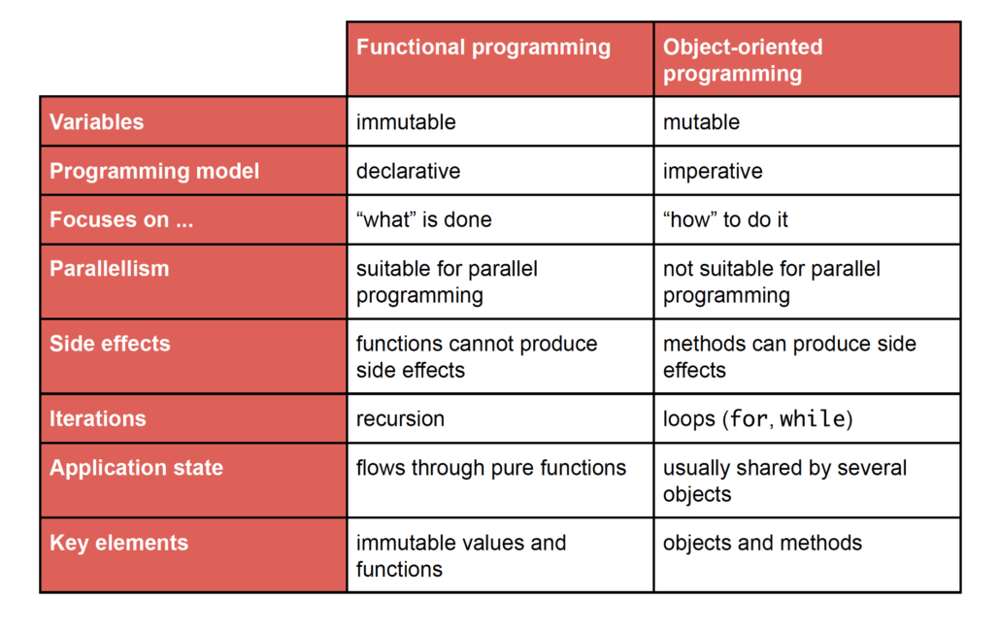

# Functional Programming

[toc]

## 纯函数、Functional Effect 与 ZIO

来源：Scalac，[Introduction to Programming with ZIO Functional Effects](https://scalac.io/blog/introduction-to-programming-with-zio-functional-effects/)（2021-02 首发，已随 ZIO 2.0 更新）。


整体：程序是纯函数的组合；但真实应用必须读写控制台、调 API、查数据库。文章用 Hangman 演示矛盾怎么解：领域模型全部写成纯函数，交互写成 functional effect（对外部世界的“描述”），最后在 `run` 这个“世界尽头”由 ZIO Runtime 真正执行。

### 纯函数三性质

- **Total（全函数）**：每个输入都有定义好的输出。`def divide(a: Int, b: Int): Int` 在 `b = 0` 时抛异常，签名等于撒谎；改成 `Option[Int]` 后失败显式化，编译器强制调用方处理 `None`。
- **Deterministic（确定性）**：同一输入必然同一输出。`generateRandomInt(): Int` 隐藏了对 `scala.util.Random` 的依赖，两次调用结果不同；改成 `RNG(seed) => (Int, RNG)` 后随机状态显式传入并返回新状态，同一 seed 永远得到同一结果。
- **无副作用**：不改内存、不打控制台、不调 API / DB；只能基于不可变值、只返回输出。

收益：局部推理（local reasoning）、更少 bug、易测试、行为可预测、并发安全（没有共享可变状态就没有 race condition）。



### 描述世界交互，而非直接执行

> instead of writing functions that interact with the outside world, we write **functions that describe interactions with the outside world**, which are executed only at a specific point in our application, (usually called the **end of the world**) for example the main function.

副作用描述本身是不可变值，可以像普通数据一样做纯函数的输入输出，因此不违反“无副作用”原则。“end of the world”就是程序边界（`main` / `ZIOAppDefault.run`）：功能世界在这里结束，描述被真正执行，越晚越好。这些描述就是 **functional effect**。

### ZIO：`R => Either[E, A]`

`ZIO[-R, +E, +A]` 是不可变的 functional effect，心智模型：

```text
R => Either[E, A]
```

- `R`：运行所需 context（DB 连接、REST client、config），逆变；
- `E`：可能失败的错误类型，协变；
- `A`：成功时返回的值，协变。

只看签名就能知道：依赖什么环境、会不会失败、失败类型是什么、成功返回什么。常用别名：

| Alias | 展开 | 含义 |
|---|---|---|
| `Task[A]` | `ZIO[Any, Throwable, A]` | 无需环境，可失败 |
| `UIO[A]` | `ZIO[Any, Nothing, A]` | 无需环境，不可失败 |
| `RIO[R, A]` | `ZIO[R, Throwable, A]` | 需要环境，可失败 |
| `IO[E, A]` | `ZIO[Any, E, A]` | 无需环境，可失败 |
| `URIO[R, A]` | `ZIO[R, Nothing, A]` | 需要环境，不可失败 |

Hangman 里用到的组合方式：

- `flatMap` / for-comprehension：顺序组合，后一步依赖前一步结果，前一步失败则短路；
- `<*>`（zip）/ `*>`（zipRight）：组合两个 effect，ZIO 2 的 Compositional Zips 会自动丢弃 `Unit`，所以 `Console.printLine(msg) <*> Console.readLine` 直接得到 `String`；
- `<>`（orElse）：第一个 effect 失败时才执行第二个（输入校验失败后重试）；
- `ZIO.succeed / ZIO.from / ZIO.attempt`：把纯值、`Option`、可能抛异常的表达式提升为 effect；
- `orDie / orDieWith`：把“逻辑上不可能失败”的失败视为 defect，直接崩溃，不进入业务错误路径。

`ZIOAppDefault.run` 只返回一个 effect；ZIO Runtime 负责把它真正翻译成副作用。失败则记日志并返回非零退出码，这就是应用的 end of the world：

```scala
val run: IO[IOException, Unit] =
  for {
    name <- Console.printLine("Welcome to ZIO Hangman!") <*> getName
    word <- chooseWord
    _    <- gameLoop(State.initial(name, word))
  } yield ()
```

### Smart constructor：让非法状态不可构造

领域对象想保证不变量（Name 非空、Guess 恰好一个字母），但 case class 自动生成的 `apply` / `copy` 会绕过校验，递进方案：

1. `final case class Name(name: String)` + companion 的 `make` 做校验 → `apply` / `copy` 仍可造出非法值；
2. `final case class private Name(...)` → 原生构造器私有，但 `apply` / `copy` 还在；
3. `sealed abstract case class Name private (...)` → 不生成 `apply` / `copy`，唯一构造入口是 `make`。

```scala
sealed abstract case class Guess private (char: Char)
object Guess {
  def make(str: String): Option[Guess] =
    Some(str.toList).collect {
      case c :: Nil if c.isLetter => new Guess(c.toLower) {}
    }
}
```

`make` 本身是纯函数：total（用 `Option` 表达失败）、deterministic（只依赖 `str`）、无副作用。`c :: Nil` 要求恰好一个字符，`isLetter` 排除数字和符号，`toLower` 统一小写——业务代码拿到 `Guess` 后无需再校验。`Word.make`、`State.addGuess` 同理；`GuessResult` 用 sealed trait 表达枚举，pattern match 漏分支时编译器会警告。

与 [Algebraic Effects 与 Effect Handlers](#algebraic-effects-与-effect-handlers分离做什么和如何执行) 对照：ZIO 是 functional effect 的工程化实现，把“描述 effect”与“执行 effect”分离成类型和 Runtime；同一套思想在 Agent runtime 里对应 intent 与 handler。

## Algebraic Effects 与 Effect Handlers：分离“做什么”和“如何执行”

函数式编程并不等于“完全没有副作用”。更实用的目标是把纯计算与外部作用分开描述：程序声明自己需要读取文件、发送消息或查询状态，但不在业务逻辑里固定这些操作如何到达真实世界。`algebraic effects` 用抽象 operation 表达“做什么”，`effect handler` 决定“如何解释”。

### Effect 不是普通日志事件

一个 algebraic effect 首先是一组带类型的抽象操作，例如：

```text
ReadFile   : Path -> String
SendMessage: Message -> Unit
GetState   : Unit -> State
PutState   : State -> Unit
```

程序通过 `perform` 发出操作，而不是直接调用固定实现：

```text
program():
  text = perform ReadFile("report.md")
  perform SendMessage(summarize(text))
```

运行到 `perform ReadFile(...)` 时，当前计算在该点暂停；最近的 handler 获得 operation、参数，以及“拿到结果后如何继续”的 continuation。Handler 可以返回真实结果并恢复 continuation，也可以拒绝、改写、重试，甚至让 continuation 执行多次。因此，把 effect 说成“reified typed event”适合作为工程直觉，但严格来说它不仅是被记录的数据，还包含一次可被 handler 解释的控制转移。

### 同一程序可以更换解释器

程序源码只依赖 effect interface，不依赖具体 handler：

| Handler | `ReadFile` 的解释 | `SendMessage` 的解释 |
|---|---|---|
| Production | 读取真实文件 | 调用真实消息 API |
| Audit | 读取后追加 typed record | 记录发送意图并继续 |
| Dry-run | 返回 fixture / snapshot | 只产生 preview，不外发 |
| Permission | 检查 capability 后执行 | 未授权时拒绝 |
| Replay | 返回历史记录中的 outcome | 压制不可重复的外部副作用 |
| Test | 返回 mock value | 收集断言对象 |

核心价值是：

> 业务程序描述 effect；运行环境提供 effect 的语义。替换执行、审计、测试或权限策略时，不必改写业务程序本身。

### Handler 与 continuation

Handler 的能力来自它同时拿到 effect 和 continuation `k`：

```text
handle ReadFile(path, k):
  value = filesystem.read(path)
  audit.append({operation: "ReadFile", path, value_hash: hash(value)})
  return k(value)
```

它可以采用不同控制策略：

- `k(value)`：正常恢复一次；
- 不调用 `k`：中止、拒绝或短路；
- 修改 `value` 后恢复：mock、fallback、fault injection；
- 多次调用 `k`：从同一中间点探索多个 continuation；
- 保存 `k` 稍后恢复：暂停、审批、resume。

这使异常、状态、异步、回溯搜索、权限 gate 等机制可以在同一抽象下讨论。工程实现不一定真的把语言 continuation 暴露出来，也可以用状态机、生成器、协程或持久 execution trace 模拟相同结构。

### 和 callback、middleware、Monad 的区别

| 机制 | 谁控制“如何执行” | 主要特点 |
|---|---|---|
| Callback | 业务代码显式接收并调用 callback | 简单直接，但 callback 会渗入函数签名和控制流 |
| Middleware | 预先固定的一条调用管线 | 适合请求级横切逻辑，通常围绕既定入口工作 |
| Monad | 用类型与组合操作显式编码 effectful computation | 强调顺序组合；具体 effect 集合和解释方式往往绑定得更紧 |
| Algebraic effect + handler | 程序 perform operation，局部 handler 解释 | operation 与 interpretation 分离，handler 可嵌套、替换并控制 continuation |

不能简单说 algebraic effects “优于” Monad；两者都在管理 effect，只是模块化边界不同。Algebraic effects 更适合表达“同一操作需要多种局部解释”，例如 production、sandbox、audit、replay 和 deny。

### Non-perturbing observation 的条件

只读 observer handler 可以把 effect 追加到不可变 stream，再以相同返回值和相同恢复顺序继续执行。这样，是否安装 observer 不需要改变业务程序的输入、输出或 source code，这是“观察而不干扰”的理论基础。

但 non-perturbing 不是自动获得的现实保证：记录仍可能增加延迟、改变并发时序、触发 backpressure，handler 也可能错误修改返回值或恢复次数。严谨的 runtime 还需要不可变记录、只读订阅接口、顺序和 identity 约束，以及对 timing-sensitive behavior 的单独验证。

### 映射到 Agent Runtime

[Shepherd §3.2](https://arxiv.org/html/2605.10913v3#S3.SS2) 把这套语言设计迁移到 Agent execution：

| Functional Programming | Agent Runtime |
|---|---|
| Typed function | task / agent definition |
| Algebraic effect | model call、tool call、file operation、message intent |
| Effect handler | provider、sandbox、permission gate、recorder、simulator |
| Region-scoped handler | Agent scope / isolated execution region |
| Continuation | pause、resume、fork 后的后续执行 |
| Persistent effect record | execution trace / effect stream |

Worker 只表达 `ToolCall`、`FileWrite`、`SendMessage` 等 intent；runtime handler 决定真实执行、记录、拒绝或模拟。Supervisor 从外部读取 immutable effect stream，便不必要求 worker 把每一步塞回自身 context；换一个 handler，还可以对同一段执行做 dry-run、审计或 counterfactual replay。

更偏工程化的入门路径，从朴素 `while true` agent loop 一步步推到 `A => F[B]` 和 middleware 判断尺，见 [AI-Applied-Algorithms：Agent Loop 是 effectful program](./AI-Applied-Algorithms.md)。

这个映射解释了 Shepherd 为什么强调“Agent execution 是 first-class object”：只有 model call、tool call、环境变化和 continuation 都能被 runtime 持有，meta-agent 才能观察、拦截、暂停、分叉或恢复另一个 Agent。

但 algebraic effects 只给出 operation / handler / continuation 的语言结构，不自动产生“Agent execution 的版本控制”。Shepherd 还需要把 Agent continuation 与环境 snapshot 耦合进 content-addressed trace，并实现 scope fork、merge、discard、checkpoint、restore 和 materialization。完整 runtime、CRO 与 Tree-RL 分析见 [AI-Applied-Algorithms：Shepherd](./AI-Applied-Algorithms.md#shepherdagent-execution-的版本控制与事务层)。

### 工程边界

Algebraic effects 只提供 effect 与 interpretation 分离的程序结构，并不自动解决真实世界状态：

- 文件系统能否回滚，还需要 snapshot / copy-on-write substrate；
- 外部消息、支付和邮件已经发出后不可逆，只能在 materialization 前 gate 或事后补偿；
- replay 需要记录 outcome、顺序、identity 和环境版本，不能只重放 operation 名称；
- 跨 session resume 还需要 durable continuation 或显式状态机；
- handler 的权限必须由 sandbox / OS 强制，不能只依赖类型和 prompt。

因此，Agent runtime 中完整的可逆执行通常是：

```text
algebraic effect interface
  + scoped handler
  + persistent trace
  + environment snapshot / COW
  + materialization and compensation boundary
```

参考：Plotkin & Power, [Algebraic Operations and Generic Effects](https://doi.org/10.1023/A:1023064908962)；Plotkin & Pretnar, [Handlers of Algebraic Effects](https://doi.org/10.1007/978-3-642-00590-9_7)。
