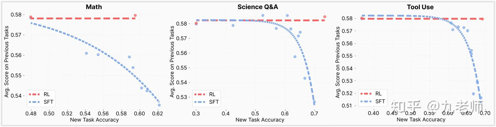
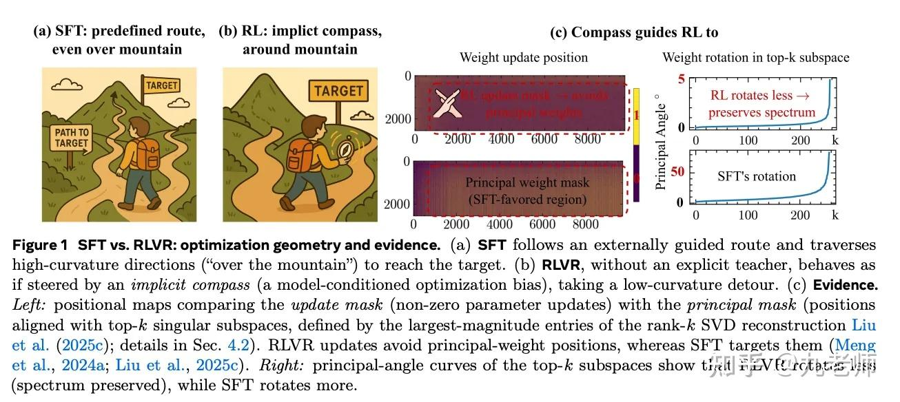
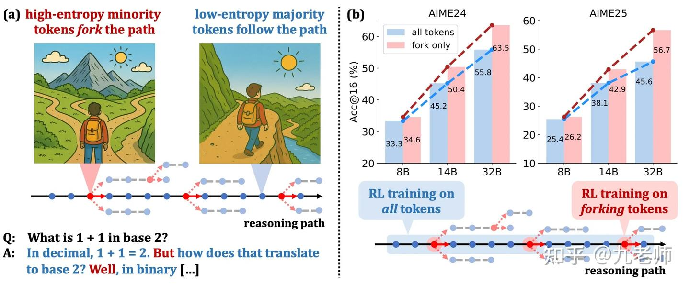

# Reinforcement-Learning

[toc]

## 基本问题

todo [深度强化学习（一）强化学习概述 - iker peng的文章 - 知乎](https://zhuanlan.zhihu.com/p/22542101)

todo [深度强化学习系列（二）强化学习基础 - iker peng的文章 - 知乎](https://zhuanlan.zhihu.com/p/23436744)

强化学习（Reinforcement Learning, RL）的本质是：**在行动会改变未来状态和未来数据分布的环境里，学习一个最大化长期回报的决策策略。**

最小闭环是：

```text
state -> action -> environment transition -> reward -> next state
```

和普通监督学习不同，RL 不是只学习 `x -> y` 的预测函数，而是学习一个 policy：

```text
π(a | s)
```

目标也不是单步预测准确率，而是最大化长期累计回报：

$$
G_t = \sum_{k=0}^{\infty}\gamma^k r_{t+k}
$$

其中 $$\gamma$$ 是 discount factor，用来平衡即时收益和长期收益。

### RL 与监督学习 / 推荐系统的区别

监督学习通常假设训练样本已经给定，模型要拟合：

```text
input -> label
```

推荐系统虽然有反馈，但多数工业排序模型的核心仍是预测即时或中短期反馈：

```text
P(click / watch / buy | user, item, context)
```

这更接近 supervised learning、learning-to-rank 或 contextual bandit。它当然有反馈闭环，但通常先把问题工程化成“曝光后的局部反馈预测”。

RL 的关键差异不在“有没有反馈”，而在：

1. **Action 会改变未来状态**：当前选择会影响之后能看到什么、能做什么、拿到什么反馈。
2. **目标是长期回报**：短期看起来收益高的 action，可能损害长期 outcome。
3. **反馈归因更长**：第 3 步 action 可能影响第 12 步是否成功。
4. **策略会改变数据分布**：新 policy 产生新轨迹，训练数据不再是静态样本。
5. **需要探索**：不能只利用历史上看起来最好的 action，还要试探未知但可能更优的 action。

所以可以粗略区分：

```text
DL + feedback 推荐：主要学反馈预测和排序。
RL：主要学长期决策策略。
```

推荐系统也可以逐步 RL 化，例如从 supervised ranker 到 bandit，再到 slate RL / session-level RL。但完整 RL 在工业推荐里很难直接落地，因为线上探索有业务风险、reward 容易被 hack、off-policy evaluation 难、长期指标归因复杂。

### 什么时候 RL 是必要的

当问题具有以下特征时，RL 思维会变得重要：

- action 会改变 environment / DB / user state / agent context。
- reward delayed 或 sparse，不能直接给每一步标注。
- 最终成败需要归因到中间多个 action。
- policy 本身会影响之后的数据分布。
- 需要在 exploitation 和 exploration 之间权衡。

对应到 LLM / Agent，典型 action 不只是“输出 token”，还可能是：

```text
调用工具
检索或注入 memory
询问用户
执行交易
写入 / 删除外部状态
停止或继续任务
```

这类系统如果只看单步预测，很容易学到“看起来合理”的动作，却无法保证长期任务成功。

### 为什么大模型通常不是从零 RL

长期以来，出于工程和算法原因，人们认为用强化学习训练 LM 是不可能的。而目前多个组织找到的可行方案是：

* 使用策略梯度强化学习 (Policy Gradient RL) 算法。
* 使用近端策略优化 (Proximal Policy Optimization，PPO) 或其变体微调。
* 微调 LM 的部分参数。
  * 因为微调整个 10B～100B+ 参数的成本过高（相关工作参考低秩适应 LoRA 和 DeepMind 的 Sparrow LM）。

RL 有个众所周知的问题：当 action space 变得极大、历史信息过长，且问题本身趋于复杂时，它很难从零解决。比如，如果 LLM 完全跳过 pre-training，只靠一个 reward function 从零开始训练模型，即使函数设计得再好，模型也几乎不可能达到当前 LLM 的能力水平。原因在于探索空间过大，模型在找到有效策略前就可能迷失或崩溃。

这也是现在有 pre-training -> post-training -> reinforcement fine-tuning 多步训练的核心原因：先通过大规模 pre-training 得到一个已经有语言、知识和基本推理能力的初始 policy，缓解 exploration 问题，再用 RL 对特定目标做优化。

但这套体系也存在核心问题：模型的 plasticity（可塑性）有限。训练时间一旦过长、模型结构达到饱和，就会出现 catastrophic forgetting（灾难性遗忘），也就是模型无法再学习新知识，甚至丢失旧知识。这意味着模型的训练能力不可能无限提升。外部 memory、工具、检索和 agent runtime，本质上也是在补“参数内学习”之外的状态更新能力。

## 核心难点与理论抓手

### MDP / POMDP

RL 最常用的基础模型是 MDP（Markov Decision Process，马尔可夫决策过程）：

$$
\mathcal{M} = (\mathcal{S}, \mathcal{A}, P, R, \gamma)
$$

其中：

| 符号 | 含义 |
| --- | --- |
| $$\mathcal{S}$$ | state space，状态空间 |
| $$\mathcal{A}$$ | action space，动作空间 |
| $$P(s' \mid s, a)$$ | transition probability，当前状态和动作决定下一状态分布 |
| $$R(s, a, s')$$ | reward function，对一次转移的奖励 |
| $$\gamma$$ | discount factor，未来回报折扣 |

MDP 的关键假设是 Markov 性：

$$
P(s_{t+1} \mid s_{\le t}, a_{\le t}) = P(s_{t+1} \mid s_t, a_t)
$$

也就是说，当前 $$s_t$$ 已经是决策所需历史的充分统计量。只要知道当前 state 和当前 action，就不需要再回看完整历史。

现实中很多任务不满足完全可观测，因此更接近 POMDP（Partially Observable MDP）：

$$
\mathcal{P} = (\mathcal{S}, \mathcal{A}, \mathcal{O}, P, O, R, \gamma)
$$

POMDP 比 MDP 多了 observation space 和 observation model：

$$
o_t \sim O(o \mid s_t)
$$

agent 看到的是 $$o_t$$，不是真实完整状态 $$s_t$$。因此它通常要用历史交互形成 belief state：

$$
b_t(s) = P(s_t = s \mid o_{\le t}, a_{<t}, r_{<t})
$$

belief 可以理解成“在当前已知信息下，真实 state 可能是什么”的后验分布。POMDP 中 policy 更自然地写成：

$$
a_t \sim \pi(a \mid b_t)
$$

粗略对比：

| 模型 | agent 看到什么 | policy 输入 | 适用直觉 |
| --- | --- | --- | --- |
| MDP | 完整 state | $$s_t$$ | 棋盘、仿真器、明确定义的环境状态 |
| POMDP | 局部 observation | history / belief $$b_t$$ | 对话、推荐、机器人、long-horizon agent |

### State / Observation / Belief / Reward

一个常见误解是把长程任务写成：

```text
reward_t = f(reward_{t-1}, env_t, event_t)
```

这个式子太简化。RL 里 reward 是评价信号，不是 agent 的主状态容器。更基础的拆法是：

```text
history h_t = (o_0, a_0, r_0, ..., o_t)
belief/state estimate b_t = update(b_{t-1}, a_{t-1}, o_t, r_{t-1})
action a_t ~ pi(a | b_t)
reward r_t = R(s_t, a_t, s_{t+1})  或  R(h_t, a_t, o_{t+1})
```

在 MDP 里，如果 $$s_t$$ 已经包含决策所需的全部信息，就可以直接写：

$$
a_t \sim \pi(a \mid s_t), \quad r_t = R(s_t, a_t, s_{t+1})
$$

但很多真实任务更接近 POMDP：agent 看到的是 observation，而不是真实完整 state。此时需要维护 belief state：

$$
b_t(s) = P(s_t = s \mid o_{\le t}, a_{<t}, r_{<t})
$$

也就是说，历史事件、环境反馈、系统 prompt、长期记忆、人的约束、最近上下文，都更像是用来构造 $$b_t$$ 的证据；reward 则用于评价 action / transition / trajectory 是否好。

对应关系可以记成：

| 概念 | 作用 |
| --- | --- |
| `observation` | 当前能看到的局部信息 |
| `event history` | 过去发生过什么，可用于重建 history / projection |
| `state` | 若满足 Markov 性，是决策充分统计量 |
| `belief state` | 在部分可观测场景下，对真实 state 的后验估计 |
| `policy` | 基于 state / belief 选择 action |
| `reward` | 对转移或轨迹的评价信号 |
| `value` | 从当前 state / belief 出发的期望未来回报 |

所以 replay event 的价值不是“直接重算 reward 然后决策”，而是帮助构造当前可行动的 state / belief。旧约束也不是永远作数；它应该带 scope、timestamp、validity condition 和 uncertainty，进入 belief 更新，再由 policy 决定是否继续遵守、忽略或重新询问人。

这个区分对 long-horizon agent 很重要：如果 state construction 漏掉了关键上下文，policy 会在错误状态上做正确优化；后面再怎么调 reward，也很难补回丢失的决策信息。

### Credit assignment

Credit assignment 是 RL 最核心的问题之一：最终成功或失败，到底该归因给前面哪些 action？

在监督学习里，label 通常直接对应当前样本；在推荐系统里，曝光 item 后的 click / no-click 也相对局部。但在 RL 里：

```text
action_3 -> state_4 -> action_4 -> ... -> final reward
```

最终 reward 可能要回传给很早之前的 action。LLM reasoning、multi-step tool use、机器人控制和游戏都存在这个问题。过程奖励（process reward）、value function、advantage estimation、paired replay、counterfactual branch，本质上都在解决不同形态的 credit assignment。

### Counterfactual branch

Counterfactual branch 是为了回答一个问题：**如果刚才不做这个 action，结果会不会更好？**

做法是在同一个历史前缀下，分出两个或多个分支：

```text
same prefix
  -> branch A: take action x
  -> branch B: suppress / replace action x
  -> compare outcome(A) - outcome(B)
```

这个差值就是 action 的反事实贡献。它比只看最终成功率更可靠，因为它尽量控制了 task、history、model、environment 等变量，只改变一个关键决策。

在 agent memory 场景里，最常见的形式是 paired replay：

```text
same prefix
  -> with_memory: inject memory M
  -> no_memory: suppress memory M
  -> compare task success / DB diff / tool correctness / token cost / regression
```

如果 `with_memory` 更好，说明这次 memory exposure 有正贡献；如果更差，就是 negative transfer；如果无差异，就是无效曝光。它适合先做 evaluator 和 label generator，不必一开始就变成 RL trainer。

注意：counterfactual branch 不是绝对真相。LLM 采样、环境随机性、工具状态和 simulator drift 都会污染差分，所以最好要求 same seed、same backend、same corpus，并多次重复取稳定信号。

### Exploration vs Exploitation

RL 不能只利用当前看起来最优的 action，也需要探索未知 action。探索不足会导致策略卡在局部最优；探索过强又会带来成本和风险。

大模型 RL 里，pre-training / SFT 可以理解成先提供一个较好的初始策略，降低探索难度；rollout 采样、temperature、tree search、self-play、tool-use exploration 则决定 RL 能不能看到足够有价值的新轨迹。

### On-policy / Off-policy

On-policy：训练数据来自当前 policy。优点是分布匹配，缺点是贵。

Off-policy：用旧 policy 或其他 policy 产生的数据训练。优点是能复用历史数据，缺点是 distribution shift 和 evaluation bias 更严重。

推荐系统和 agent replay 通常都高度依赖历史日志，所以很多问题不是“有没有 reward”，而是历史数据能不能支持新 policy 的可靠评估。

### Behavior cloning / SFT

Behavior cloning 是把已有行为数据当成监督标签，直接学习：

```text
state -> expert / logged action
```

SFT 可以看成语言模型上的 behavior cloning：给定 prompt 和参考答案，最大化参考答案 token 的概率。它的优点是样本效率高、训练稳定、信号密集；缺点是它不关心这个 action 原本在当前 policy 下是否自然，也不关心长期 reward，只是无条件拟合外部数据分布。

对比一下：

```text
SFT / behavior cloning:
  fit logged action

RL:
  sample action from current policy
  score by reward
  increase actions that improve return
```

因此 SFT 更像“把模型拉向数据分布”，RL 更像“在当前策略附近找能提高 reward 的方向”。这不是说 RL 一定更好，而是两者优化对象不同：SFT 优化 imitation likelihood，RL 优化 expected return。

这也解释了为什么 SFT 更容易在 post-training 中带来 interference：它把参考答案的每个 token 都当成 dense label 来纠正，哪怕这些 token 只是风格、模板或外部标注者的表达偏好。对于语言模型来说，这等于在大量共享 dense 参数上施加外部分布牵引；如果参考分布和 base policy 差距很大，就可能覆盖原本的语言、知识或推理模式。

RL / RLVR 的训练信号更稀疏：模型先按当前 policy 生成，再由 reward 判断整体结果好坏。很多和 reward 无关的 token 不会被强行改写，更新更容易集中在真正影响结果的决策点。这个性质不是显式正则项，却会产生一种 implicit regularization：只改变为了提高 reward 必须改变的部分。

### Policy support / KL shift

Policy support 指当前策略本来会给出较高概率的 action 区域。一个 action 如果在原 policy 下概率极低，却在 SFT 数据里频繁出现，训练就必须把大量概率质量搬过去。

这个搬运可以用 KL shift 直观理解：

```text
old policy distribution
-> fine-tuned policy distribution
-> how far did the distribution move?
```

KL 越大，说明新旧策略分布差异越大。分布移动本身不一定坏；如果新任务确实需要新行为，就必须移动。但移动越大，越容易破坏旧任务上依赖的行为模式。

Forward KL 和 reverse KL 的直觉：

| KL 方向 | 倾向 | 直觉 |
| --- | --- | --- |
| Forward KL | mode-covering | 尽量覆盖目标分布里出现过的行为 |
| Reverse KL | mode-seeking | 更偏向选择当前高概率且高 reward 的模式 |

这个差别能帮助理解为什么 behavior cloning 容易覆盖分布，而 on-policy RL 更像在当前 policy support 内做小步调整。

更具体地说，SFT / behavior cloning 的最大似然训练常被直观理解为最小化目标数据分布到模型分布的 forward KL：

$$
D_{\mathrm{KL}}(p_{\mathrm{data}} || \pi_\theta)
$$

它最怕“目标数据中出现的模式被模型漏掉”，所以倾向于把多个模式都覆盖住。多模态分布下，这可能让模型在模式之间平均、迁移到自己原本很少会走的区域。

而 on-policy policy-gradient 更新常被直观理解为更接近 reverse KL / KL-minimal improvement：

$$
D_{\mathrm{KL}}(\pi_\theta || \pi_{\mathrm{target}})
$$

它更怕“模型当前会生成的东西落到低 reward 区域”，所以倾向于在当前 policy support 内追高 reward 模式。这个区别不是说 RL 的目标函数字面上永远等于 reverse KL，而是说在 on-policy 采样和 reward-weighted update 下，RL 更像 model-seeking：优先改模型自己本来会走、且 reward 更高的路径。

### Rollout / trajectory / episode

Rollout 是指让当前 policy 在环境中实际跑一段，生成训练或评估用的交互数据。

```text
policy + environment
-> s0, a0, r0, s1, a1, r1, ...
-> trajectory
```

几个相关概念：

| 概念 | 含义 |
| --- | --- |
| step | 一次 `state -> action -> reward -> next_state` 转移 |
| trajectory | 一串连续 step，也叫一条轨迹 |
| episode | 从初始状态到终止状态的一条完整 trajectory |
| rollout | 用某个 policy 在环境里采样出 trajectory 的过程 |
| rollout policy | 产生 trajectory 的 policy |
| target policy | 当前希望优化或评估的 policy |
| replay | 复用历史 trajectory 做评估、训练或反事实分支 |

在 on-policy RL 里，rollout 数据来自当前 policy；在 off-policy RL 里，训练可能复用旧 policy、专家、人类或日志系统产生的 trajectory。差异在于：rollout policy 和 target policy 越不一致，训练和评估的 bias 越大，越需要 importance sampling、policy version、staleness window 或严格的 offline policy evaluation。

LLM / Agent 里的 rollout 不只是 token 序列，也可能包含工具调用、环境观察、DB 状态变化、reward/evaluator 输出和 stop reason：

```text
prompt / state
-> model response or tool action
-> observation / tool result
-> next state
-> final reward or evaluator score
```

因此 agent rollout 的关键不是只保存最终答案，而是保存完整 trajectory：policy version、prompt/context、action、observation、tool result、reward、cost、latency、failure reason。没有这些字段，后续很难做 replay、credit assignment、counterfactual branch 或 regression analysis。

Partial rollout 是一种工程优化：不一定每次都从头跑完整 episode，而是从某个 prefix / checkpoint 继续生成后半段，用来节省生成成本或做局部反事实比较。它适合 paired replay、memory injection 对比和 long-horizon task 的局部 credit assignment。

### Counterfactual evaluation / Off-policy evaluation

> 来源：[Counterfactual Reasoning and Learning Systems](https://jmlr.csail.mit.edu/beta/papers/v14/bottou13a.html) / [arXiv](https://arxiv.org/abs/1209.2355)。

这篇文章是理解 **logged policy -> counterfactual evaluation -> off-policy learning** 的基础。它讲的不是一个广告系统 trick，而是一个更一般的问题：

```text
历史日志来自旧策略 P / pi0
现在想评估新策略 P* / pi
问题：如果当时换成新策略，会发生什么？
```

普通 replay 不够，因为日志里只记录了旧策略实际选择过的 action 及其 outcome。推荐系统里没曝光的 item、agent 里没注入的 memory、工具链里没执行的 action path，都没有真实 outcome。直接把新策略在旧日志上“重跑一遍”，只能复用已发生路径，不能凭空知道未发生 action 的结果。

注意这里的 `replay` 和系统设计里的 Event Sourcing replay 不是一回事。Event Sourcing 解决“能否从事件日志重建当时状态 / projection”，见 `Software-Engineering.md` 的 `Event Sourcing：用事件日志重建系统状态`；counterfactual evaluation 解决“在当时状态下，如果选择另一个 policy / action，期望结果如何”。前者给 OPE 提供可复现历史状态，后者仍需要 logged policy、propensity、overlap 和 outcome model。

几个基本角色：

| 概念 | 含义 |
| --- | --- |
| logged / behavior policy | 产生历史日志的旧策略，常记为 `P` 或 `pi0` |
| target policy | 想离线评估或学习的新策略，常记为 `P*` 或 `pi` |
| propensity | 旧策略在当时 context 下选择某个 action 的概率 |
| overlap / support | target policy 想评估的 action，logged policy 至少探索过 |
| counterfactual evaluation | 用旧策略日志估计“如果换成新策略”的期望结果 |

最一般的 importance sampling 形式是：

$$
\hat{Y}^*
=
\frac{1}{n}
\sum_{i=1}^{n}
\ell(\omega_i)
\frac{P^*(\omega_i)}{P(\omega_i)}
$$

其中：

- `omega_i` 是第 `i` 条历史日志里的完整事件 / trajectory / world state。
- `ell(omega_i)` 是这条日志对应的 loss、negative reward 或业务指标。
- `P(omega_i)` 是旧系统产生这条日志的概率。
- `P*(omega_i)` 是新系统产生同一类日志的概率。
- 比值 `P*(omega_i) / P(omega_i)` 叫 importance weight。

直觉：如果某类样本在新策略世界里更常出现，就放大它；如果在新策略世界里更少出现，就缩小它。

推荐 / 广告里的例子：

```text
pi0(long-tail item | user) = 0.01
pi(long-tail item | user)  = 0.10
```

旧策略很少曝光长尾 item，新策略更愿意探索长尾。历史日志里长尾 item 的点击 / 不点击样本很少，如果直接算普通 eval AUC，长尾区域几乎没权重。IPS 会把这些样本放大：

$$
\frac{0.10}{0.01}=10
$$

这不是说这条样本本身更“真实”，而是说：在新策略的世界里，这类样本会更常出现，因此它对评估的贡献应该更大。

#### Markov factor replacement

论文把系统拆成一串 Markov / causal factor：

```text
P(omega)
= P(context)
  * P(candidate)
  * P(score | context, candidate)
  * P(action | score, ...)
  * P(outcome | action, context)
```

如果只想问“换一个 scoring model 会怎样”，不需要重建整个世界，而是只替换变化的因子：

```text
P(score | context, candidate)
替换为
P*(score | context, candidate)
```

新系统的期望指标是：

$$
Y^*
=
\mathbb{E}_{\omega \sim P^*}
[\ell(\omega)]
$$

但历史日志来自旧分布 `P`，所以改写成：

$$
Y^*
=
\mathbb{E}_{\omega \sim P}
\left[
\ell(\omega)
\frac{P^*(\omega)}{P(\omega)}
\right]
$$

估计量就是：

$$
\hat{Y}_{IS}
=
\frac{1}{n}
\sum_{i=1}^{n}
\ell(\omega_i)w_i,
\quad
w_i=
\frac{P^*(\omega_i)}{P(\omega_i)}
$$

好处是：如果系统里只有局部机制变了，比如 scoring function、reserve price、reranker、memory ranker，很多共同因子会在 `P* / P` 里抵消，只需要知道变化那部分的概率比。

#### overlap、clipping 与置信区间

counterfactual evaluation 的硬条件是：

```text
target policy 想评估的行为，logged policy 至少探索过。
```

如果旧策略从未曝光某个 item，或者从未在某类 task state 下注入某类 memory，那么分母为 0，IPS 无法估计这个区域。也就是说：

```text
没有 overlap，就没有可信 OPE。
```

即使不是完全没见过，只要分布差异很大，也会出问题。若 `P(omega_i)` 很小、`P*(omega_i)` 很大，importance weight 会爆炸，少数样本主导估计，方差极高。

clipping 的做法是只信任权重不太大的样本：

$$
w_i^{clip}
=
\min(w_i, R)
$$

这样会引入 bias，但能控制 variance。直觉是：**我只在旧日志覆盖得还不错的区域估计新策略效果**；新策略想去但旧日志没覆盖好的区域，不应该被少数极端样本支配。

论文里可以把不确定性理解成两层：

| 不确定性 | 含义 | 该怎么补 |
| --- | --- | --- |
| outer uncertainty | 当前覆盖区域里样本太少 | 沿同样 logging policy 继续收数据 |
| inner / coverage uncertainty | 新策略落到旧日志没覆盖的区域 | 改 logging policy，增加 exploration / randomization |

所以离线评估置信区间很宽时，要先判断是“样本量不够”，还是“target policy 和 logged policy overlap 太差”。前者多收同分布日志，后者必须改变探索策略。

#### Doubly Robust：用 predictor 降方差

论文还讲了用 predictor 降低 variance，形式上接近 doubly robust。contextual bandit 里常见写法是：

$$
\hat{V}_{DR}(\pi)
=
\frac{1}{n}
\sum_i
\left[
\sum_a \pi(a|x_i)\hat{q}(x_i,a)
+
\frac{\pi(a_i|x_i)}{\pi_0(a_i|x_i)}
\left(
r_i-\hat{q}(x_i,a_i)
\right)
\right]
$$

含义分两步：

1. 先用模型 `q_hat(x, a)` 预测新策略下每个 action 的期望收益。
2. 再用 logged data 的 importance weighted residual 修正它。

也就是：

```text
model-based estimate
+ propensity-weighted residual correction
```

如果 predictor 很准，残差很小，variance 会低很多；如果 predictor 有偏，只要 logged policy 和 target policy overlap 够好，IPS residual 仍然可以校正一部分偏差。

#### 从 evaluation 到 learning

从 counterfactual evaluation 走向 learning 时，不能直接最大化 raw IPS estimate。原因是 optimizer 很容易利用高权重、低覆盖区域，让离线估计看起来很好，但真实上线可能翻车。

更稳的学习原则是优化 clipped estimate 或 lower confidence bound：

$$
\theta^*
=
\arg\max_\theta
\hat{Y}_{\theta,\mathrm{clipped/lower\text{-}bound}}
$$

直觉：

```text
不要选离线估计最高的策略；
选在已有日志覆盖下，保守下界最好的策略。
```

如果一个策略 upper bound 很高但 lower bound 很低，说明它“可能很好，但证据不够”。正确动作不是直接上线，而是设计下一轮 exploration 去覆盖它。

迁移到 agent memory / ranking 时，关键不是只存最终 outcome，而是补齐：

```text
behavior_policy_version
target_policy_version
candidate set
exposed / injected item
propensity under logged policy
outcome / reward / cost
predictor score
clipping threshold
confidence interval
```

否则只能做普通 supervised relevance / AUC，不能做可信的 counterfactual policy evaluation。

### Reward hacking

Reward 是训练信号，也会成为被优化和被钻空子的对象。如果 reward function 只覆盖表面格式或局部指标，policy 可能学会刷分，而不是真正解决任务。

LLM RL 里常见的缓解方式包括 rule-based reward、KL penalty、格式约束、人工偏好校验、process reward、holdout evaluation 和 regression benchmark。

### Continual learning / interference

Continual learning 关注模型持续学习新数据或新任务时，如何避免旧能力退化。核心问题是 interference：新数据的梯度更新会不会破坏旧任务需要的参数和表示。

几种常见现象：

- **Catastrophic forgetting**：学新任务后，旧任务能力明显下降。
- **Negative transfer**：多任务或多场景一起训练后，某些任务反而比单独训练更差。
- **Representation drift**：共享表示持续漂移，导致旧分布上的决策边界变差。
- **Selection bias feedback loop**：策略决定看到什么数据，数据又训练下一版策略，形成自我强化。

推荐系统里很多问题也可以用这组语言描述：历史曝光日志是旧策略产生的 off-policy 数据；高频场景和短期反馈会主导共享 dense 参数；低频用户、长尾 item、旧兴趣模式如果缺少新样本，就会逐步被弱化。

因此，读 RL 和推荐系统的交叉问题时，真正重要的不是背某个算法名字，而是盯住四件事：

```text
数据是谁采样的？
新旧 policy 分布差了多远？
reward / label 是否真的对应长期目标？
共享参数更新是否伤害了旧模式？
```

### 专题：从 RL 不易遗忘到推荐系统缺陷

这个专题的核心问题是：为什么同样做 post-training，SFT 更容易造成 catastrophic forgetting，而 on-policy RL / RLVR 往往更稳？进一步反过来看，推荐系统长期依赖 logged feedback + supervised online learning，会不会也存在类似的分布偏移、反馈循环和共享参数覆盖问题？

#### On-policy 为什么可能缓解遗忘

近期 LLM continual post-training / RLVR 工作给出的共同现象是：同样学习新任务，SFT 往往更容易让旧任务平均表现下降，RFT / RLVR 的遗忘更小。一个核心解释是 on-policy 数据本身带来的分布约束。



SFT 使用外部答案作为标签，优化会把模型推向标注分布；如果这个分布和预训练模型原有分布差得远，就会迫使共享参数沿着新标签方向移动。RL 则先让当前 policy 自己生成，再只根据 reward 放大成功路径、压低失败路径，因此更新天然发生在模型当前分布附近。换句话说，RL 往往不是“想去哪就去哪”，而是在“模型自己本来可能走到的区域”里找更优策略。

这类结论可理解成三层：

- **分布层**：on-policy rollout 降低 rollout policy 和 target policy 的 mismatch。
- **目标层**：reward 只要求结果更好，不要求逐 token 模仿某个外部答案。
- **参数层**：更新更集中在能改变 reward 的局部决策，不必重写完整输出分布。

因此，“RL 不容易遗忘”更准确的说法是：在 reward 可靠、采样接近 on-policy、更新步长受控时，RL 更容易找到 KL 更小的能力增量路径。它不是无条件免疫遗忘；PPO epoch 太多、旧 rollout 复用过度、reward 设计有漏洞或 KL 失控时，仍然会退化。

#### Low-curvature / off-principal 更新

一些 RLVR 分析把差异进一步落到参数几何上：SFT 更容易更新主权重方向，导致谱结构和 top-k 子空间旋转；RLVR 更像沿低曲率、off-principal 的方向移动，保留原模型的主结构。



直觉是：SFT 有一条外部指定路线，要求模型逐 token 贴近答案；如果答案路径跨过高曲率方向，参数也会被拉过去。RLVR 没有显式教师路径，只要 reward 变好即可，所以更可能绕开会破坏主结构的方向，在平坦区域中调整少量关键参数。

这里要保留一点谨慎：off-principal 解释更像对现象的深入刻画，而不是所有 RL 泛化/不遗忘的完整因果机制。KL 约束、数值精度、低曲率优化偏置、reward 稀疏性和 on-policy 采样可能共同作用。

#### High-entropy / forking tokens

另一个互补视角是 token-level credit assignment。RLVR 中并不是所有 token 都同等重要：低熵 token 通常是模型很确定的语法、格式、常识延续；高熵 token 是模型犹豫的位置，多个候选 token 可能把推理带到完全不同的路径。



这些高熵位置可以叫 forking tokens：它们是推理路径的分叉点。RL 的有效更新主要发生在这些位置，因为 reward 差异更可能由“选择了哪条推理分支”决定，而不是由所有低熵 token 决定。这解释了为什么 RL 能用较少参数/较少 token 更新带来能力提升，也解释了为什么逐 token SFT 更容易过度干预主干语言分布。

参考线索：[青稞社区转载全文](https://qingkeai.online/archives/D9j6JtwN)、[知乎原文](https://zhuanlan.zhihu.com/p/1976336943878005134)、[Reinforcement Fine-Tuning Naturally Mitigates Forgetting in Continual Post-Training](https://arxiv.org/abs/2507.04218)、[SFT Memorizes, RL Generalizes](https://arxiv.org/abs/2501.17161)、[The Path Not Taken](https://arxiv.org/abs/2510.19222)、[Beyond the 80/20 Rule](https://arxiv.org/abs/2510.23840)、[Retaining by Doing](https://arxiv.org/abs/2509.19065)、[RL's Razor](https://arxiv.org/abs/2509.04259)。

### Bias, Variance, Bootstrapping

在强化学习（特别是 Value-based 方法）中，估计价值函数（Value Function）的方式决定了算法的性质。

* **Bootstrapping (自举)**
  * **定义**：利用后续状态的**估计值**来更新当前状态的估计值。
  * **例子**：TD(0) 更新 $$V(S_t) \leftarrow V(S_t) + \alpha [R_{t+1} + \gamma V(S_{t+1}) - V(S_t)]$$。这里 $$V(S_{t+1})$$ 本身就是个猜测（估计），用它来更新 $$V(S_t)$$ 就是 Bootstrapping。
  * **对比**：Monte Carlo (MC) 方法不使用 Bootstrapping，它等到 Episode 结束，用真实的累积回报 $$G_t$$ 来更新。

* **Bias (偏差) vs Variance (方差)**
  * **Monte Carlo (MC)**：
    * **无偏差 (Unbiased)**：目标是真实回报 $$G_t$$，期望等于真实价值。
    * **高方差 (High Variance)**：$$G_t$$ 依赖于整个轨迹上的所有随机动作和状态转移，随机性累积导致方差大。
  * **Temporal Difference (TD)**：
    * **有偏差 (Biased)**：目标包含估计值 $$V(S_{t+1})$$，初始时估计不准，导致更新有偏差。随着训练进行，偏差会减小。
    * **低方差 (Low Variance)**：只依赖一步的随机性（一步转移和奖励），比 MC 方差小得多。
  * **权衡**：$$TD(\lambda)$$ 或 n-step TD 可以在二者之间权衡。

### TD Error Accumulation (TD 误差累积)

* **现象**：由于 Bootstrapping 的存在，如果 $$V(S_{t+1})$$ 估计偏高，这个误差会回传给 $$V(S_t)$$，导致 $$V(S_t)$$ 也偏高。误差会在状态之间传播和累积。
* **致命三要素 (The Deadly Triad)**：当以下三个条件同时满足时，强化学习训练极其容易不稳定甚至发散：
  1. **Function Approximation (函数近似)**：如使用深度神经网络（Deep RL）。
  2. **Bootstrapping (自举)**：如 TD learning, Q-learning。
  3. **Off-policy Training (异策略)**：训练数据的分布与当前策略分布不一致（如 Replay Buffer）。
* **后果**：值函数可能无法收敛，误差无限放大。
* **解决方案**：Target Network（固定目标网络）、Double Q-learning（解耦选择和评估）、Clipped Double Q-learning (TD3) 等技术旨在缓解这些问题。


## 算法谱系

> TODO Reinforcement Learning An Overview

强化学习算法可以按“如何估计和优化长期回报”粗略分成几类：

| 类型 | 核心思想 | 典型方法 |
| --- | --- | --- |
| Value-based | 学习 state/action 的价值，再选价值最高的 action | Q-learning、DQN |
| Policy Gradient | 直接优化 policy，使高回报轨迹概率上升 | REINFORCE、PPO |
| Actor-Critic | policy 负责行动，critic 估计价值或 advantage | A2C、A3C、PPO |
| Model-based RL | 学习或利用环境模型，提前规划 | MCTS、world model |
| Offline RL | 从历史数据中学习新 policy | CQL、IQL 等 |
| RLHF / RFT | 用人类偏好、规则或任务验证器构造 reward 来微调模型 | PPO、GRPO、DPO/RL-ish variants |

当前 LLM 训练里最常见的是 policy-gradient / actor-critic 这一支，以及为大模型训练成本改造出来的 GRPO 等方法。

### PPO

* 核心思路是clipping
  * 限制了每次参数更新的幅度，确保新的策略（更新后的模型）与旧的策略（更新前的模型）不会相差太远


PPO 的 clipped surrogate objective 常写成：

$$
L^{\mathrm{CLIP}}(\theta)
=
\mathbb{E}_t
\left[
\min
\left(
r_t(\theta)\hat{A}_t,
\mathrm{clip}(r_t(\theta), 1-\epsilon, 1+\epsilon)\hat{A}_t
\right)
\right]
$$

其中：

$$
r_t(\theta)
=
\frac{\pi_\theta(a_t|s_t)}
{\pi_{\theta_{\mathrm{old}}}(a_t|s_t)}
$$

公式可以这样读：

| 符号 | 含义 | 直觉 |
| --- | --- | --- |
| $$\pi_{\theta_{\mathrm{old}}}$$ | 采样 rollout 时的旧策略 | 数据是它生成的 |
| $$\pi_\theta$$ | 正在更新的新策略 | 想让它更偏向好 action |
| $$r_t(\theta)$$ | 新旧策略对同一 action 的概率比 | 新策略比旧策略更想做这个 action 多少 |
| $$\hat{A}_t$$ | advantage | 这个 action 比当前平均水平好还是差 |
| $$\epsilon$$ | clipping 阈值 | 限制每次 policy update 的步子 |

如果 $$\hat{A}_t > 0$$，说明这个 action 比预期好，训练希望提高它的概率；如果 $$\hat{A}_t < 0$$，说明这个 action 比预期差，训练希望降低它的概率。

不加 clipping 时，目标近似是：

$$
r_t(\theta)\hat{A}_t
$$

也就是“好 action 概率提高，坏 action 概率降低”。问题是如果一次更新让 $$r_t$$ 变化太大，policy 会突然偏离 rollout policy，训练变得不稳定，也容易 reward hacking。

PPO 的 `clip` 做的是保守更新：

```text
r_t 太大  -> 不再继续奖励更激进的概率提升
r_t 太小  -> 不再继续奖励更激进的概率压低
```

所以 PPO 的本质不是“找到最优更新”，而是 **在用 rollout 数据改进 policy 时，限制新策略不要离旧策略太远**。这也是它叫 Proximal Policy Optimization 的原因：只在旧策略附近做可靠的小步优化。

在 LLM RL 里，可以把每个 token / action 看成：

```text
state = prompt + previous tokens
action = next token / tool action / reasoning step
advantage = 这段输出相对同组或 value baseline 的好坏
```

PPO 更新的直觉就是：提高高 reward 输出中关键 token 的概率，降低低 reward 输出中相关 token 的概率，但每次变化不能太猛，通常还会加 KL penalty 约束模型不要偏离 reference model 太远。

#### PPO epoch：为什么 PPO 是 near-on-policy

严格 on-policy 的定义很苛刻：

```text
用当前 policy 采样 trajectory
-> 只用这批 trajectory 更新一次
-> 更新后立刻丢掉旧数据
-> 用新 policy 重新采样
```

REINFORCE 更接近这个形态。PPO 为了提高 sample efficiency，会对同一批 rollout trajectories 做多轮 mini-batch 更新。很多实现里的 `ppo_epochs` / `num_epochs` 就是在控制同一批数据被重复训练几遍。

这带来一个微妙变化：

```text
epoch 1:
  数据来自 π_old，当前 π_θ 还接近 π_old，近似 on-policy

epoch 2..K:
  π_θ 已经被更新过，但数据仍来自最初的 π_old
  数据逐渐变成“旧策略数据”，严格说开始 off-policy
```

所以 PPO 常被叫 on-policy，是因为它不用长期 replay buffer，数据通常只来自刚采样的最近一批 rollout；但它不是“100% 严格 on-policy”，而是 **near-on-policy**：为了复用样本，在很短的 staleness window 内重复使用 rollout 数据。

PPO 的 clip / trust-region 机制正是为了解决这个折中：

```text
想多用几次同一批 rollout，提高样本效率
-> 但重复更新会让当前 policy 偏离 rollout policy
-> 用 ratio clipping / KL / trust region 限制偏离
-> 让 near-on-policy 数据仍然近似可用
```

这也是 PPO 相比 REINFORCE with baseline 的工程价值：不是单次梯度一定更“聪明”，而是 **在不让 policy 走太远的前提下，对同一批 rollout 做更多有效更新**。

和 GRPO 对比时要注意：

| 算法 | 数据复用 | on-policy 程度 | 稳定性来源 |
| --- | --- | --- | --- |
| REINFORCE | 通常单次用完 | 最接近严格 on-policy | 无偏但高方差，常加 baseline |
| PPO | 同一批 rollout 多 epoch | near-on-policy | ratio clip / KL / trust region |
| GRPO | 通常同 prompt group 内相对比较 | 更接近严格 on-policy，取决于实现是否多 epoch 复用 | group baseline + clip / KL |

因此，“RL 不容易遗忘”这类说法更适用于严格或近似 on-policy、且有 KL / clip 约束的更新。如果 PPO epoch 太多、learning rate 太大、KL 约束太弱，同一批 rollout 被过度复用，也会逐渐变成不可靠的 off-policy 更新，照样可能 reward hacking 或遗忘。

### DeepSeek-R1

> 收敛到简单的思路，复杂的奖励模型不work
>
> rule-based reward即可，比如数学题和coding，不需要模型判断结论是否正确
>
> rediscover OpenAI-o1 的工作

* R1-Zero 相比 R1: 没有SFT
* Reward Modeling
  * The reward is the source of the training signal, which decides the optimization direction of RL.
    To train DeepSeek-R1-Zero, we adopt a rule-based reward system that mainly consists of two
    types of rewards:
    * Accuracy rewards: The accuracy reward model evaluates whether the response is correct.
      For example, in the case of math problems with deterministic results, the model is required
      to provide the final answer in a specified format (e.g., within a box), enabling reliable
      rule-based verification of correctness. Similarly, for LeetCode problems, a compiler can be
      used to generate feedback based on predefined test cases.
    * Format rewards: In addition to the accuracy reward model, we employ a format reward
      model that enforces the model to put its thinking process between ‘<think>’ and ‘</think>’
      tags.
  * We do not apply the outcome or process neural reward model in developing DeepSeek-R1-Zero,
    because we find that the neural reward model may suffer from reward hacking in the large-scale
    reinforcement learning process, and retraining the reward model needs additional training
    resources and it complicates the whole training pipeline.


* 2.3.4. Reinforcement Learning for all Scenarios
  * 仍然用奖励模型
* DeepSeek-R1: Reinforcement Learning **with Cold Start**
  * 用CoT做SFT

### GRPO (Group Relative Policy Optimization) —— DeepSeekMath

> **DeepSeekMath Chpt 4，很好的材料**


* 核心特点：放弃 Critic 模型，省内存
  * 不是不需要 advantage，而是不训练额外的 critic / value model 来估计 advantage。

  * 在很多 RL 算法（如 Actor-Critic）中，除了策略模型（Actor，决定做什么动作/生成什么输出），还有一个 Critic 模型 ，用于评估当前状态或动作的好坏（预测未来的累积奖励，即价值 Value）。Critic 模型通常和策略模型差不多大。

  * GRPO 的一个关键点是 它不需要 Critic 模型 。这对于大模型来说是个显著优势，因为训练和维护一个同样大的 Critic 模型会消耗大量计算资源（内存、计算量）。

  * 替代方案 : 它不预测绝对的价值，而是通过比较 一组 (group) 输出的好坏来估计一个 相对的基线 (baseline) 。


* 目标函数：
  * 重要性采样 (importance sampling) 的比率。它衡量了当前策略 πθ 生成输出 oᵢ 的概率相对于旧策略 πθ_old 的变化。如果比率大于 1，表示当前策略更倾向于生成 oᵢ 。
  * Ai是策略梯度项
  * Min限制更新幅度
  * KL 散度正则化项 ：这个项会惩罚 πθ 偏离 π_ref 太远。 β 是控制惩罚力度的超参数。这有助于防止模型在 RL 优化过程中忘记 SFT 阶段学到的知识（比如语言流畅性、基本事实等），保持模型的稳定性

GRPO 的公式和 PPO 很像，仍然是 ratio + clipping，只是 advantage 的来源不同。PPO 通常需要 critic 估计 value，再得到 advantage；GRPO 不训练 critic，而是在同一个 prompt 下采样一组 responses，用组内 reward 的相对高低构造 advantage。

常见写法可以简化理解为：

$$
J_{\mathrm{GRPO}}(\theta)
=
\mathbb{E}
\left[
\frac{1}{G}
\sum_{i=1}^{G}
\frac{1}{|o_i|}
\sum_{t=1}^{|o_i|}
\min
\left(
r_{i,t}(\theta)\hat{A}_i,
\mathrm{clip}(r_{i,t}(\theta), 1-\epsilon, 1+\epsilon)\hat{A}_i
\right)
-
\beta D_{\mathrm{KL}}(\pi_\theta || \pi_{\mathrm{ref}})
\right]
$$

其中：

$$
r_{i,t}(\theta)
=
\frac{\pi_\theta(o_{i,t}|q,o_{i,<t})}
{\pi_{\theta_{\mathrm{old}}}(o_{i,t}|q,o_{i,<t})}
$$

组内 advantage 通常来自 reward 标准化：

$$
\hat{A}_i
=
\frac{r_i - \mathrm{mean}(\{r_1,\dots,r_G\})}
{\mathrm{std}(\{r_1,\dots,r_G\})}
$$

公式可以这样读：

| 符号 | 含义 | 直觉 |
| --- | --- | --- |
| $$q$$ | 同一个 prompt / question | 一组回答共享同一个问题 |
| $$o_i$$ | 第 $$i$$ 个 sampled response | 同题多采样 |
| $$r_i$$ | 第 $$i$$ 个 response 的 reward | 由规则、验证器或 reward model 打分 |
| $$\hat{A}_i$$ | 组内相对 advantage | 这个回答比同组平均好还是差 |
| $$r_{i,t}(\theta)$$ | 新旧策略在 token $$t$$ 上的概率比 | 新策略对这个 token 更想生成多少 |
| $$\epsilon$$ | clip 阈值 | 限制更新幅度 |
| $$\beta D_{\mathrm{KL}}$$ | KL 约束 | 防止偏离 reference model 太远 |

所以 GRPO 的核心直觉是：

```text
同一个 prompt 采样 G 个答案
-> 给每个答案打 reward
-> 高于组内平均的答案：提高概率
-> 低于组内平均的答案：降低概率
-> 用 clip 和 KL 控制更新不要太猛
```

它和 PPO 的关键区别：

| 维度 | PPO | GRPO |
| --- | --- | --- |
| baseline / advantage | 通常依赖 critic / value model | 用同组 responses 的 reward 均值和方差 |
| 额外模型 | 需要 actor + critic | 只需要 policy，省掉 critic |
| 适合场景 | 通用 actor-critic RL | LLM reasoning / math / code 这类可同题多采样并打分的任务 |
| 风险 | critic 训练贵且不稳 | group reward 方差、采样质量、reward 可靠性会影响 advantage |

一句话：**GRPO 是把 PPO 中“critic 给 baseline”的部分，换成“同题多采样的组内相对比较”。** 它不是推翻 PPO，而是为了大模型 RL 省掉 critic，同时保留 ratio、clip、KL 这些稳定训练的护栏。

* 
  * 开源社区很长时间在做offline RFT，或者迭代式的，没有用online RFT
    * online RFT比较贵、不稳定
  * PS过程监督，OS结果监督
  * 没有对比基于规则的RM

* 
  * counterintuitive的结论：K=1时RL高，后面RL反而差，似乎探索能力下降了，这是一个negative的信号

#### Why RL work?

* 5.2.2. Why RL Works?
  * In this paper, we conduct reinforcement learning based on a subset of instruction tuning
    data, and it achieves significant performance enhancement upon the instruction tuning model.
    To further explain why reinforcement learning works. We evaluate the Pass@K and Maj@K
    accuracy of the Instruct and RL models on two benchmarks. **As shown in Figure 7, RL enhances**
    **Maj@K’s performance but not Pass@K. These findings indicate that RL enhances the model’s**
    **overall performance by rendering the output distribution more robust, in other words, it seems**
    **that the improvement is attributed to boosting the correct response from TopK rather than**
    **the enhancement of fundamental capabilities**. Similarly, (Wang et al., 2023a) identified a
    misalignment problem in reasoning tasks within the SFT model, showing that the reasoning
    performance of SFT models can be improved through a series of preference alignment strategies
    (Song et al., 2023; Wang et al., 2023a; Yuan et al., 2023b).
  * RL可能仅仅是提升对齐，没提升模型的核心能力
* 5.2.3. How to Achieve More Effective RL?
  * We demonstrate RL works pretty well in mathematical reasoning tasks. We also provide a unified
    paradigm to understand different representative training methods. Within this paradigm, all
    methods are conceptualized as either direct or simplified RL techniques. As summarized in
    Equation 5, there exist **three key components: Data Source, Algorithm, and Reward Function.**
    We provide some potential future directions about the three components.
  * **Data source** is the raw material of all training methods. In the context of RL, we
    specifically refer to the data source as the unlabeled questions with the outputs sampled from
    the policy model. In this paper, we only use the questions from the instruction tuning stage and
    a naive nucleus sampling to sample outputs. We think this is a potential reason that our RL
    pipeline only improves the Maj@K performance. In the future, we will explore our RL pipeline
    on out-of-distribution question prompts, in conjunction with advanced sampling (decoding)
    strategies, like those based on tree-search methods (Yao et al., 2023). Also, the efficient inference
    techniques (Kwon et al., 2023; Leviathan et al., 2023; Xia et al., 2023, 2024), which determines the exploration efficiency of policy models, also play an exceedingly important role.
  * **Algorithms** process the data and reward signal to the gradient coefficient to update
    the model parameter. Based on Equation 5, to some extent, all methods now fully TRUST the
    signal of the reward function to increase or decrease the conditional probability of a certain
    token. However, it is impossible to ensure the reward signal is always reliable, especially in
    extremely complex tasks. For example, even the PRM800K datasets (Lightman et al., 2023),
    which have been carefully annotated by well-trained annotators, still contain approximately 20%
    of incorrectly annotations7. To this end, we will explore the reinforcement learning algorithm
    that is robust against noisy reward signals. We believe such WEAK-TO-STRONG (Burns et al., alignment methods will bring a fundamental change to the learning algorithms.
  * **Reward function** is the source of the training signal. In RL, the reward
    function is usually the neural reward model. We think there exist three important directions for
    reward models: 1) **How to enhance the generalization ability of the reward model.** **The reward**
    **model must be effectively generalized to handle out-of-distribution questions and advanced**
    **decoding outputs; otherwise, reinforcement learning may merely stabilize the distribution of**
    **LLMs rather than improve their fundamental capabilities;** 2) How to reflect the uncertainty
    of reward model. The uncertainty could potentially act as a linking bridge between the weak
    reward model and the weak-to-strong learning algorithms; 3) How to efficiently build high-
    quality process reward models that can provide fine-grained training signals for the reasoning
    process (Lightman et al., 2023; Wang et al., 2023b).
    * 基于规则的泛化性，比基于模型的更强

## LLM Post-training：RLHF / RFT / Reasoning RL

这一节关注 RL 在大模型 post-training 中的应用。它和传统游戏 / 机器人 RL 的差异在于：

- policy 通常已经经过 pre-training / SFT，不是从零探索。
- action 可以看作 token、CoT step、tool call 或完整 response。
- reward 可以来自人类偏好、规则验证器、代码测试、数学答案、格式约束或 reward model。
- 工程瓶颈不只是算法，还包括 rollout、生成吞吐、训推切换、样本复用和 reward 可靠性。

### RLHF —— 基于人类反馈的强化学习

#### Intro

* 核心贡献：解决了“奖励信号模糊”的难题

  * RLHF 其实从某种意义上想像成一个 Offline RL 步骤，因为 reward model 的能力限制了 RL 算法完全 off-policy 的能力。当然，它所带来的 reasoning 能力已经是超过了超越传统监督学习的 Pre-training，但提升幅度仍然非常有限。所以 experience /exploration 的 online 运行是无法避开的重要步骤。
  * 

  * 


#### 历史发展

* 


#### RLHF 步骤

* Reinforcement Learning from Human Feedback (RLHF), using the same methods as [InstructGPT](https://openai.com/blog/instruction-following/), but with slight differences in the data collection setup
  * RLHF的blog介绍：https://huggingface.co/blog/rlhf
    * supervised fine-tuning: human AI trainers provided conversations in which they played both sides—the user and an AI assistant
  * 步骤：
    * 预训练一个语言模型 (LM) ；
    * 聚合问答数据并训练一个奖励模型 (Reward Model，RM) ；
    * 用强化学习 (RL) 方式微调语言模型（LM）。
  * reward model: 人工打分
    * 人工写答案 -> 人工选答案 -> 机器选答案
    * prompt dataset
    * fine-tune the model using [Proximal Policy Optimization](https://openai.com/blog/openai-baselines-ppo/)
    * 一些巧妙的打分方式：
      * 客服点按钮，选取ai答案，也是finetune过程
      * reddit帖子中的最高分


#### InstructGPT —— 介绍RLHF的数据工程

* RLHF的数据量要求大于SFT


##### UltraFeedback

* --> UltraRM+


## 推理模型与 RL：OpenAI o1 / CoT

> o1本质上是在探索大模型在AGI路上能走多远、天花板在哪里的问题
>
> [如何理解OpenAI o1](https://mp.weixin.qq.com/s/QdVSq8q7wLWtPakdZdqidA)

* 提升LLM模型认知能力的核心在于复杂逻辑推理能力。

  * LLM的逻辑推理能力越强，则能解锁更多复杂应用，大模型应用的天花板就越高
  * o1模型能力越强，则可以反哺基座模型
* o1的做法本质上是CoT的自动化or内化。
  * 具体怎么做：数据标注，对CoT的过程打分
  * rl搜索COT的决策空间
  * 问题越复杂，隐藏的COT token消耗越大

  * 大部分逻辑推理数据的形式是<问题，正确答案>，缺了中间的详细推理步骤，而o1本质上是让大模型学会自动寻找从问题到正确答案的中间步骤，以此来增强复杂问题的解决能力。
* RL的scaling law本质上是COT决策树搜索的scaling law
* Note
  * OpenAI想做的方向太多，资源分散导致分到具体一个方向的资源不够用，所以越往后发展“期货状态”的方向越多，也让人觉得尽显疲态。

### CoT

[OpenAI研究员、思维树作者姚顺雨专访：人生是一场无限流游戏丨独家](https://mp.weixin.qq.com/s/MdPI-X1HvRxFuX_Z0Ju_ug)

* 许多计算本质上就是去计算下一个token，next token prediction开始成为一个新的计算。那么针对计算复杂性，传统的语言如何在新框架下适用，还有很多问题需要去解决
* Open-endedness
  * 语言游戏之所以和其他游戏区别很大，就是因为语言的开放性，即open-endedness。既然这样，那么它本质上应该有一个generative solution，而不是一个discriminative solution。所以从我第一个工作开始，我就一直在做autoregressive language model (GPT-2)
  * 从哲学的角度来看，人生就是一个无限流游戏，某种程度上来说，更像一个文字游戏，而不是电子游戏。每天你都有很多选择，从程度上说是非常high level、 open ended的。
* ReAct
  * 这篇论文的本质是Agent不仅仅有environment action，也有thinking action。
  * 主要的思路是，在玩文字游戏的时候，为什么机器很笨，而人很聪明，是因为人类有思考的能力。当时我在做ReAct的时候，最初的想法是，如果我能够让机器模仿人，不仅仅是模仿人的活动，也模仿人怎么思考，是不是就可以泛化得更好。具体比如人看到了一个城堡，人的选择是走向第三个门，如果你只去模仿这样的Mapping，很多时候是很难去泛化的。但是如果能够让它同时去模仿人的思考过程，那可能就是一个非常自然的、可以泛化的一个理由。比如人可能会想，现在周围很黑暗而且有奇怪的叫声，可能有危险需要灯。灯在第一个房间，但是第一个房间的钥匙在第三个房间，所以我得先去第三个房间。
* CoT的扩展
  * 从某种程度上来说，ReAct和Tree of Thoughts其实相当于是CoT的两个方向的扩展。一个方向是要和外部世界发生联系，另一个方向是内部的思考，如何从一个线性过程变成一个非线性，也就是更加通往 system 2的一个过程。
* 身边太多聪明的人，但你发现自己并不比他们差。做研究非常重要的因素就是信心，如果你不相信能做出非常好的研究，那你是不可能做出来好的研究的。

## RL 工程与系统

> TODO: 大模型RL训练框架的进化之路 http://xhslink.com/o/2MvDgQlctwI  非常好的文章

### 挑战：训推一体

* RL的训练的workload包含既包含LLM训练的workload（计算bound），也包含推理的workload（访存bound），这导致RL训练的效率较低，依赖训推一体的高效训练
*  

### Partial Rollout

#### Intro


#### Mooncake + RL


### veRL

> https://arxiv.org/abs/2409.19256

#### Intro

* veRL(HybridFlow)是一个灵活、高效、工业级的RL(HF)训练框架,专为大型语言模型(LLM)而设计。veRL应用hybrid-
  controller编程模型,兼具single-controller的编程灵活性与multi-controller的计算高效性。
* 在提供灵活性的同时,veRL利用3D-HybridEngine能力,减少训练和生成阶段之间转换期间的通信开销,提供极致吞吐性能。
* 支持Auto - Mapping算法来搜索每个node最佳Parallelism和Placement方式。将模型放置到不同的GPU组上,以实现高效的
  资源利用和跨不同集群规模的可扩展性。


## 应用形态

### Search-r1

> reasoning模型和工具调用结合起来强化学习训练

### ZeroSearch

> https://alibaba-nlp.github.io/ZeroSearch/
>
> https://github.com/Alibaba-nlp/ZeroSearch

### Agent memory / context routing

Agent memory 是一个适合用 RL 思维分析、但不适合一开始端到端 RL 化的场景。

更稳的建模方式是：

```text
agent state
-> memory update / retrieve / rank decision
-> context assembly
-> agent tool / response action
-> environment or DB state change
-> task outcome / regression / token cost
-> credit assignment
```

这里推荐系统模型适合先解决内层问题：

- 哪些 trajectory fragment 值得写入 memory。
- 当前 state 下哪些 memory 值得召回和注入。
- 在 token budget 下如何 rank / filter / dedupe。
- 哪些 memory 长期低效，需要 rewrite / retire。

但外层仍是 RL-style feedback loop：真正重要的不是 memory 相似不相似、有没有被 retrieve，而是它是否改变了后续 action，并改善最终 outcome。这个 feedback 常常是 delayed、sparse、counterfactual 的。

因此更合理的落地顺序是：

1. 先把 memory 当 recommendation item，补齐稳定 ID、source trace、版本和 exposure log。
2. 用 rule / GBDT / two-tower / sequence ranker 做 offline policy。
3. 用 paired replay 估计 `with_memory - without_memory` 的 outcome delta。
4. attribution 稳定后，再把高价值决策点升级为 contextual bandit / RL policy。

这说明推荐系统和 RL 不是替代关系，而是内外两层：推荐系统负责 memory item 的召回、排序和生命周期治理；RL 负责长链路 action credit assignment 和最终优化目标。


## 其它应用领域

### 游戏

* [AI挑战黑神话！死亡1000次，我训练的AI终于击败了首个BOSS【图灵计划10】](https://www.bilibili.com/video/BV1qE421c7mU)
* [【DQN只狼实战教程】手把手带你实现用强化学习DQN打只狼里的boss（第一期）](https://www.bilibili.com/video/BV1by4y1n7pe)

### 机器人

【一群不懂ActorCritic强化学习和PPO的人强行读Humanoid-Gym代码四小时-哔哩哔哩】 [一群不懂ActorCritic强化学习和PPO的人强行读Humanoid-Gym代码四小时_哔哩哔哩_bilibili](https://b23.tv/25KisIK)
