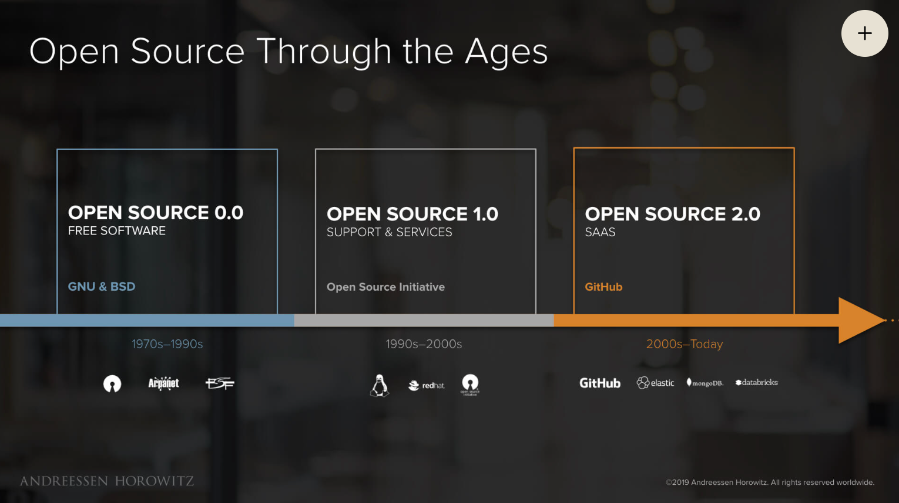
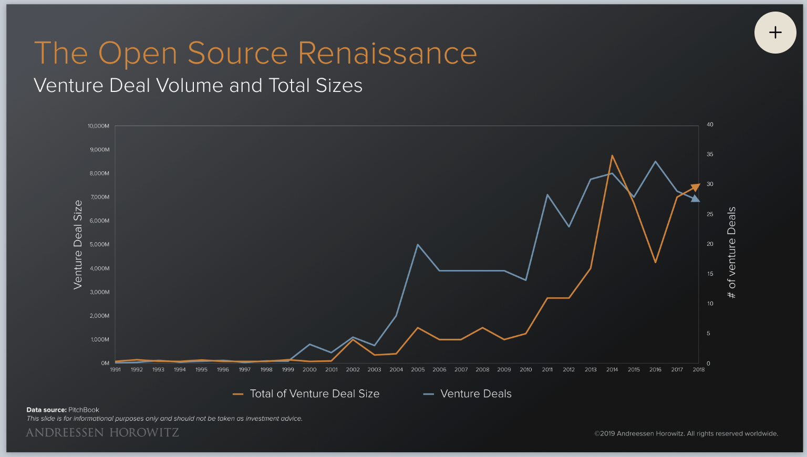
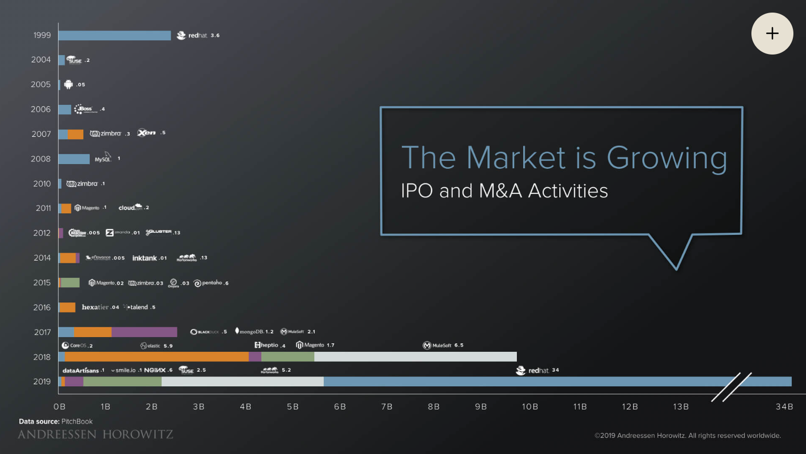
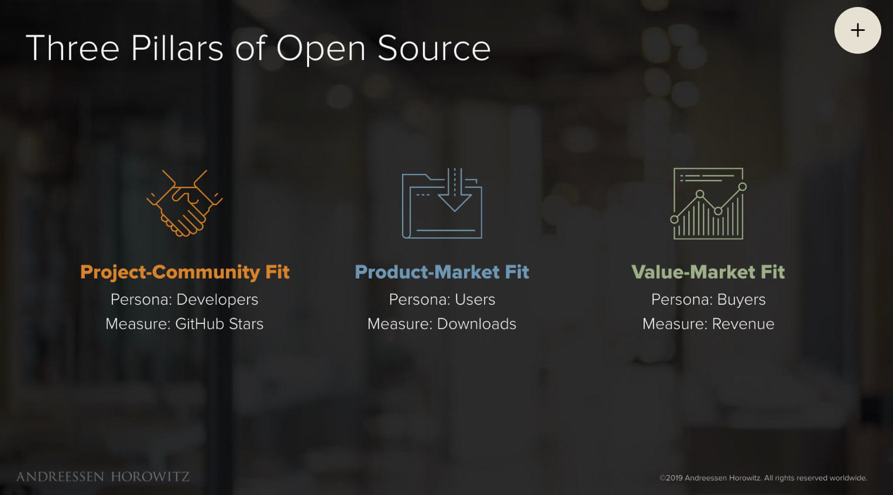
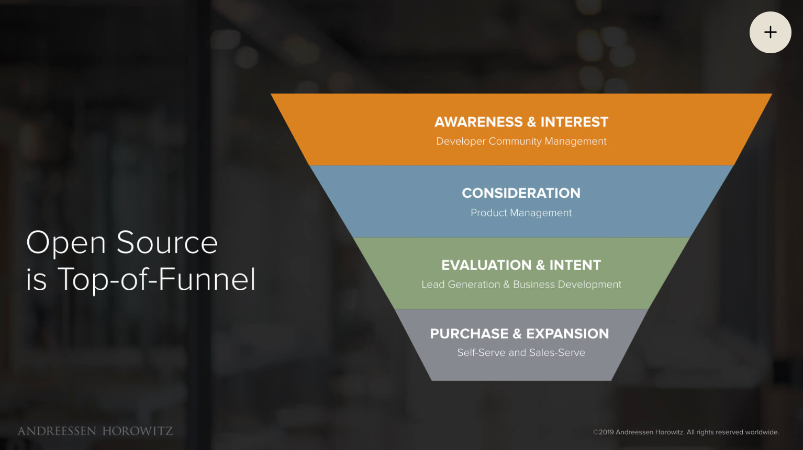
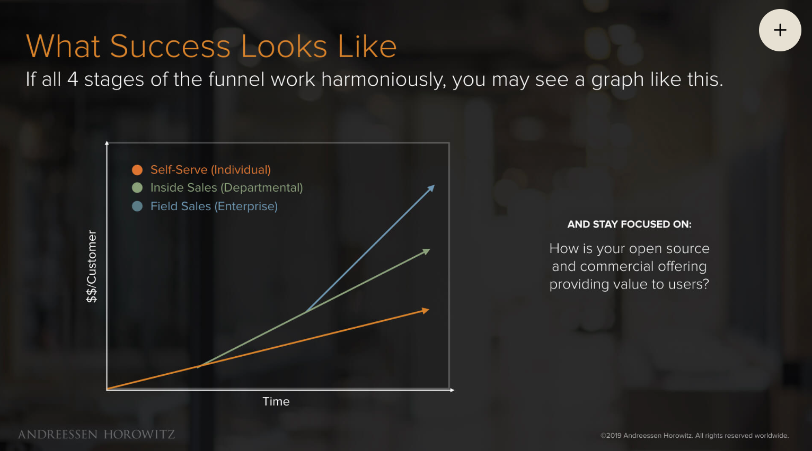

[toc]

# 开源项目成功之道

**开源商业合作要同时回答三件事：谁愿意一起建设，谁持续使用，谁为什么付费。**代码开放能降低协作与采用成本；可持续的企业还要把这些价值连接到明确的产品、采购者和交付能力，并把资源持续投入项目。

本文以社区、产品与商业合作为主线，主要依据以下来源：

| 参考 | 用途与边界 |
| --- | --- |
| **John Mertic，《Open Source Projects — Beyond Code》**（Packt，2023；中译《开源项目成功之道》） | 项目治理、维护者培养、增长、继任和可持续经营；第 1–14 章保留原书脉络。 |
| **a16z，Peter Levine / Jennifer Li，[Open Source: From Community to Commercialization](https://a16z.com/open-source-from-community-to-commercialization/)**（2019-10-04） | 三种匹配、商业模式、双路线图和市场拓展漏斗。属于创业者与投资人的经验框架；历史融资、估值和案例判断不自动代表今天。 |
| **OpenForum Europe，[EU Open Source Policy Summit 2023 圆桌](https://www.youtube.com/watch?v=3cw75N8AzQ8)** | 从授权、专利、标准和互惠理解开源如何降低协作成本；嘉宾立场与法律条文分别判断。 |
| **Open Source Initiative，[Open Source Definition](https://opensource.org/osd)** | 判断许可证是否属于开源；源码可读、允许商用、开放治理是不同维度。 |
| **CHAOSS，[社区健康指标](https://github.com/chaoss/metrics#readme)** | 衡量贡献、响应和协作可持续性；与产品采用、商业收入指标配合使用。 |
| **Apache Logging Services，[安全公告](https://logging.apache.org/security.html)与 [STF 资助公告](https://logging.apache.org/blog/20231214-announcing-support-from-the-stf.html)** | 用 Log4j 的漏洞修复与维护者资助，具体讨论安全责任、供应链和维护投入。 |

**合作前先对齐的判断**：开发者社区、使用者与采购者可能是三群人；Stars、下载和收入不能互相替代。付费产品应解决客户的业务或运维问题，免费与收费边界需要稳定、可解释。社区信任、维护能力、产品交付和中立性可以构成竞争优势，但都需要投入与证据。

| 阅读目的 | 建议路径 |
| --- | --- |
| 建立共同判断 | [历史与商业飞轮](#14-从自由软件到云服务技术与商业的循环) → [三种匹配](#46-衡量成功) → [商业模式与竞争](#10-开源商业化) |
| 讨论产品和收入 | [付费价值](#101-从用户价值到付费价值) → [双路线图](#103-双路线图与免费付费边界) → [市场拓展与销售](#121-四阶段漏斗与责任分工) |
| 讨论开放边界和治理 | [许可证](#3-开源许可证和知识产权管理) → [治理](#5-治理和托管模式) → [贡献者与维护者](#7-将贡献者发展为维护者) |
| 形成合作方案 | [合作讨论清单](#合作讨论清单)；案例按需回查，第 15 章与 Zowe 附录提供工程和生态对照 |

相关笔记：[软件著作权与任职期间归属](./非技术知识.md#软件著作权保护范围与任职期间归属)、[软件工程](./Software-Engineering.md)。文中原图为 a16z 2019 年演示稿截图，来源与读图边界随图说明；案例数字均按标注的历史时间理解。

## 1 什么是开源，为什么要开源

### 1.1 开源不是“免费代码”，而是一种生产与协作模式

* 核心判断：开源的法律基础是可行使的使用、修改与再分发权；开放开发过程进一步让用户、公司和社区参与项目演进。许可证开放与治理开放需要分别检查，具体决策权取决于项目规则。
* 制度视角（[EU Open Source Policy Summit 2023 圆桌](https://www.youtube.com/watch?v=3cw75N8AzQ8)）：开源把可复用的授权、协作工具、互操作标准与互惠规范组合起来，降低谈判、重复研发和接入成本。源码开放只是起点；法律上的开放以 [Open Source Definition](https://opensource.org/osd) 为准，项目治理是否开放还需另看。机制见 [3.7](#37-免逐一协商的授权与专利边界圆桌拓展) 与[社区互惠](#互惠的三层含义与协作信任圆桌拓展)。
* 历史时间线：
  * George Baldwin Selden：专利律师，1879 年申请“公路发动机”专利、1895 年获授权，主张覆盖所有汽油车并靠授权费收租；Henry Ford 被诉，1909 年初审败诉、1911 年上诉胜诉——法院把专利解释窄到 Brayton 两冲程发动机，Ford 的 Otto 四冲程不侵权。寓意：专利战能拖延产业，但挡不住技术事实与市场竞争。
  * 1955 SHARE：IBM 701 用户自发组织的用户团体，共享经验与代码，是早期“开放社区”雏形。
  * 1969：美国政府起诉 IBM 垄断；IBM 同年宣布软件与硬件分离计价，推动独立软件产业发展；该案于 1982 年被撤回，并非以同意令和解（[历史回顾](https://en.wikipedia.org/wiki/History_of_IBM#1969%E2%80%931982_U.S._v._IBM)）。
  * 1983：Stallman 启动 GNU 项目，目标是构建自由的 Unix 类操作系统；1985 年成立 FSF，1989 年发布 GPL。
  * 1991：Linus Torvalds 发布 Linux；[0.01 发布说明](https://www.kernel.org/pub/linux/kernel/Historic/old-versions/RELNOTES-0.01)明确未采用 MINIX 代码，初期借助 MINIX 环境开发和引导；[0.12 发布说明](https://www.kernel.org/pub/linux/kernel/Historic/old-versions/RELNOTES-0.12)记录 1992 年转向 GNU copyleft 的许可变更，不能把首次发布与采用 GPL 混为一谈。
  * 1997：Raymond《大教堂与集市》——集中式规划的大教堂 vs 众包演进的集市。
  * 1998：OSI 成立，“Open Source Definition”确立（脱胎于 Debian 自由软件准则）；同年 Netscape 开源 Mozilla。
  * 1999：Apache 软件基金会成立，确立“委员会制 + 精英治理”的托管模式。

### 1.2 UNIX 理念：基础化、模块化

* 小工具只做一件事、通过文本流组合：grep / sed / cat。
* 现代延续：Android（Linux 内核 + 分层开源组件）、Ruby on Rails（gem 生态聚合）、Pandoc（转换器 + filter 组合）、Memcached（只做分布式缓存一件事）。
* 对项目治理的启发：统一架构与方向，同时开放 RFC、贡献和反馈流程；技术决策集中与协作入口开放可以共存。

### 1.3 为什么要开源：四个案例

* PHP：Rasmus Lerdorf 1994 年做“Personal Home Page Tools”，后改名 PHP: Hypertext Preprocessor；个人工具开源后成为整个 Web 生态的底座。动机：低门槛动态建站，个人需求变成公共基础设施。
* Blender：NaN 公司破产后，2002 年社区发起“Free Blender”募资，7 周筹到 €100,000，从公司买回版权，由 Blender Foundation 以 GPL 发布；此后靠 Development Fund 等可持续资助养活全职团队。开源把“将死产品”变成公共资产。
* Zowe：大型机（z/OS）与现代应用集成的开源框架，2018 年由 IBM 等发起，托管在 Linux Foundation 旗下的 Open Mainframe Project。动机：大型机现代化必须靠 ISV 生态，闭源集成层只会碎片化；开源降低第三方接入门槛，把竞争对手变成生态伙伴。详见 3.5、4.5 与文末《附：Zowe 案例详解》。
* PiSCSI：让树莓派模拟老式电脑 SCSI 磁盘/光驱的开源项目（RaSCSI 的 fork）。软硬件一体开源：PCB 设计、固件、工具、文档全部公开。说明开源不止代码，还包括硬件、规格与协作流程。

### 1.4 从自由软件到云服务：技术与商业的循环

[a16z 的历史框架](https://a16z.com/open-source-from-community-to-commercialization/)强调：技术创新与商业创新相互强化。开放反馈、共同修复、生态支持和人才聚集，可以提高软件迭代与采用效率；付费支持、开放核心和托管服务，则为持续维护提供资源。原文称开源是“创造软件的最佳方式”，这是作者的立场；效果仍取决于项目治理、评审质量与长期投入。

| a16z 分期 | 技术与协作变化 | 主要资源或收入来源 |
| --- | --- | --- |
| 0.0，自由软件 | 学术与爱好者共享代码，网络降低协作成本 | 大学、企业研究经费与志愿投入；free 首先指自由，不能只理解为零价格 |
| 1.0，支持与服务 | Linux 等基础软件进入企业 | 免费软件上叠加支持、培训和服务，代表案例为 Red Hat 等 |
| 2.0，SaaS 与 Open Core | 云端交付和产品分层使企业可以购买完整结果 | 托管服务订阅、企业增值能力；两种模式可结合 |
| 3.0，开放生态成为软件公司的常态 | 公司既使用开源，也资助或发起项目 | 作者在 2019 年展望广告资助、数据收入、区块链代币等路径；是趋势假设，不是成熟模式清单 |

图中阶段是商业演进的简化视角，各种模式可以共存。开源 3.0 扩大的是分析范围：Facebook、Airbnb、Google 等公司也参与开放生态；依赖开源不等于其全部产品都开源，更不改变 OSI 的定义。

原文以 Airbnb 三十多个、Google 两千多个开源项目说明参与范围扩大，均为 2019 年举例口径，不作当前项目数使用。

云服务把采购对象从“代码副本”扩展为“可靠运行的结果”：用户不必自己部署和维护，开源公司因而能按服务价值收费。Levine 据此解释部分开源公司与专有软件公司的估值差距缩小；这不保证估值相等，也不意味着企业不再关心许可证、数据迁移和供应商风险。

商业创新与收入 → 更多持续维护和社区投入 → 更快技术反馈与更强产品 → 更多采用和付费价值 → 再投入。**这是需要经营的飞轮，不是开源后自动发生的增长规律**；若收入不反哺维护，或付费边界伤害信任，循环会断。

图据 PitchBook，覆盖 1991–2018 年：橙线看左轴交易金额，蓝线看右轴融资笔数，不能直接比较两条线的高低。原文汇总约 200 家公司、融资超过 100 亿美元，约四分之三公司及 80% 资金出现在 2005 年后；这是当时样本的资本活动，不是全行业收入，也不能单凭时间趋势证明云计算导致增长。

图据 PitchBook，单位为十亿美元，横轴存在断轴；IPO 与并购的估值／交易金额混列，不能当作营业收入或逐年等口径市场规模。原文以 MySQL 2008 年约 10 亿美元出售、Red Hat 2019 年约 340 亿美元交易说明资本市场对开源企业价值的认识变化；个案不能推出任一项目都会获得相近回报。以上三图均来自 [a16z 原文](https://a16z.com/open-source-from-community-to-commercialization/)，按 2019 年资料阅读。

## 2 什么造就好的开源项目

### 2.1 Linux 的三个关键动作

* 站在前人肩膀上：借助 UNIX / MINIX 的概念和开发环境，但 Linux 初版内核未使用 MINIX 代码，见 [0.01 发布说明](https://www.kernel.org/pub/linux/kernel/Historic/old-versions/RELNOTES-0.01)。
* 尽早发布，接受不完美：0.01 自称 pre-alpha，主要供阅读和实验；早期开放不等于已达到 beta 或生产质量。
* 鼓励他人反馈和参与：把用户变成共同开发者。
* 类比“汽车的开放演进”：用户本身就是开发过程的一部分，项目按真实使用反馈迭代，而不是按假想需求设计。

### 2.2 开源的多种方式（光谱）

* 智能代码转储（smart code dump）：只把代码扔出来，没有社区流程与响应，协作开放程度有限；是否采用开源许可证仍需单独判断。
* 开放核心（open core）：核心开源 + 商业增值部分闭源；需要明确边界，避免社区付出被单方面收割。
* 治理模型：仁慈独裁（BDFL，如早期 Linux / Python）vs 委员会（如 Apache）；后者牺牲决策速度，换稳定性与品牌中立。
* 判断项目开放程度，要分开看**许可证、源码与历史可见性、贡献接口、治理参与**。不接收 PR 不直接决定许可证是否开源；公开源码也不自动意味着开放开发过程。Agent 时代的贡献接口还要保留验证证据，见[意图、实现与验证](#agent-时代的贡献接口意图实现与验证我的拓展)。

### 2.3 fork、upstream 与冲突

* fork 是开源赋予的自由，但社区分裂对双方都是损失；优先合并回 upstream，除非方向确实不可调和。
* 避免/解决冲突的实操建议：
  * 过度沟通（over-communicate）；
  * 针对已知问题制定规则，不要为假设情况立法；
  * 把一切写下来（决策、流程、FAQ 都要文档化）；
  * 拥抱社群，而不是把贡献者当资源。
  * 警惕 bikeshed：琐碎议题的讨论会不成比例地膨胀（见非技术知识.md「思维模型」）。

## 3 开源许可证和知识产权管理

先分清著作权归属，再判断如何授权使用。软件还可能涉及商业秘密和专利；给仓库添加开源许可证，本身不能解决权属争议，也不自动解除其他义务。任职期间软件归属的具体条件见[软件著作权：保护范围与任职期间归属](./非技术知识.md#软件著作权保护范围与任职期间归属)。

### 3.1 许可证（License）

* 宽松（permissive）：MIT / BSD / Apache 2.0 通常允许纳入闭源产品再分发，仍须履行各自声明等义务。
  * [MIT](https://opensource.org/license/mit)：广泛授权，并要求保留版权与许可声明，附免责条款；不是消除所有法律责任。
  * [Apache 2.0](https://www.apache.org/licenses/LICENSE-2.0)：另有明确的贡献者专利许可、终止及 NOTICE 等规则；不是简单的“MIT 加一句专利授权”，也不保证免受所有专利主张。
* copyleft：MPL 通常以文件为边界，GPL 针对受其覆盖的作品；AGPLv3 第 13 条还规定修改版向远程交互用户提供对应源码的义务，不能简化为“一切网络使用都须公开所有代码”。
  * 自由软件的四种自由：为任何目的运行，研究和修改，分发副本，分发修改版；不是必须发布自己做出的每次修改。
  * [GPLv2](https://github.com/torvalds/linux/blob/master/LICENSES/preferred/GPL-2.0)：分发受其覆盖的衍生作品时须按相应许可提供权利与源码；仅运行程序或把独立程序放在一起，不会自动要求整个公司代码开源。GPL 允许收费和商业活动，不能等同于“不可商用”。

2001 年 Ballmer 称 Linux 是在知识产权意义上附着到其他软件的“癌症”（[同期报道](https://www.theregister.com/2001/06/02/ballmer_linux_is_a_cancer/)），背景是微软专有授权模式与 GPL 的冲突。他把“衍生作品的分发义务”扩大为“使用任何开源就必须开放其余软件”，并不准确。[Linux 的系统调用说明](https://github.com/torvalds/linux/blob/master/LICENSES/exceptions/Linux-syscall-note)明确，正常调用内核服务的用户程序不因此成为内核衍生作品。微软后来在云业务中受益于 Linux，并于 [2016 年加入 Linux 基金会](https://www.linuxfoundation.org/press/press-release/microsoft-fortifies-commitment-to-open-source-becomes-linux-foundation-platinum-member)：竞争关系会随收费层次改变。

* Source-available 与开源许可证要区分：Raft 使用的 **FSL-1.1-ALv2** 限制竞争性用途，每个版本在发布两年后另获 Apache 2.0 授权。当前源码可读、可在许可范围内使用，不等于当前已按 Apache 2.0 开源。参考：[Raft LICENSE](https://github.com/botiverse/raft-source/blob/05f7d8fd77d2535f993d5d90b85118438bc18216/LICENSE#L30)、[Future License](https://github.com/botiverse/raft-source/blob/05f7d8fd77d2535f993d5d90b85118438bc18216/LICENSE#L87)。

采用依赖时，应按具体版本记录许可证、修改与分发方式、声明及源码义务。MPL 的文件级边界意味着，分发受覆盖文件的修改版时须履行相应许可要求，不能只用“保留作者名字”概括。延伸线索：[《别不信，开源真的有毒》](https://mp.weixin.qq.com/s/eGdlu1G5jcMu8-_NAAzZJw)介绍依赖管理工具 NaiveSystems Depend，属于产品推广材料；工具可辅助清点依赖，不能代替许可证原文、权属判断和具体使用方式的审查。

### 3.2 TiVo 化 → GPLv3

* TiVo 化：厂商用了开源代码、也公开源码，但硬件只认自家数字签名，用户拿到源码也刷不进设备——“源码自由，设备锁死”。
* 出处：TiVo 公司的机顶盒内置 Linux（GPLv2），提供源码但固件只认自己的数字签名；这一争论指出了“获得源码”与“在设备运行修改版”的区别，不能据此笼统断言整个产品不存在法律问题。
* 漏洞在 GPLv2：它要求“给源码”，不要求“改过的代码能在设备上跑”。
* GPLv3 的 [第 6 条](https://www.gnu.org/licenses/gpl-3.0.html#section6)对特定 User Product 的目标码交付规定 Installation Information（安装信息）义务及例外；应按产品、交付方式与适用条款判断，不能泛化为“任何使用都要交出所有签名密钥”。
* Linux 内核整体保留 GPLv2，不受 GPLv3 安装信息条款直接约束；手机、路由器、电视的合法性仍取决于各组件许可及其他适用规则。
* 一句话：TiVo 化 = 用硬件锁抵消开源许可证，让“自由”只停留在纸面上。

### 3.3 copyleft 的价值判断（何时值得选）

* 鼓励下游围绕维护、培训和服务创造持续价值；GPL 允许出售副本，但接收者仍有再分发权，因此不能依靠剥夺复制自由维持独占收费。
* 进入竞争激烈、已有商业解决方案的领域时，防止“开源成果变成别人闭源护城河的垫脚石”——这是选择 copyleft 的核心理由。

### 3.4 版权与贡献签署：CLA vs DCO

* CLA（贡献者许可协议）：法律文件，明确可授予的权利与范围；分 ICLA（个人）和 CCLA（公司），Apache 基金会等采用。是否允许未来再许可取决于具体条款，签 CLA 不自动意味着放弃版权。MongoDB 改为 SSPL、Redis 模块采用 Commons Clause、后有 RSAL/SSPL 等历史调整，说明许可会成为商业边界工具；具体版本须重新核对。
* DCO（开发者原创声明）：更轻量，通过 Signed-off-by 确认符合贡献来源和授权声明；它不替代底层许可证，也不能保证权属争议不存在。
* 品牌：商标可以由公司或基金会持有；基金会托管是保持中立的一种选择，不是开源的自动结果。配套一致性计划（conformance program）让品牌承诺可验证。

### 3.5 品牌一致性机会

* Kubernetes：每个自称 Certified Kubernetes 的供应商发行版都必须通过 CNCF 一致性测试，保证支持的 API 语义一致。
* Zowe Conformance Program（拓展）：
  * 由 Open Mainframe Project 管理：厂商按公开评价准则自测，提交结果由 OMP 官方审查，通过后获得 “Zowe Conformant” 徽章。
  * 按核心组件分类：API Mediation Layer / App Framework / CLI / Explorer for VS Code（新增 Explorer for IntelliJ、Client SDK），另有 Support Provider 认证。
  * 与 Zowe 大版本绑定：V1 / V2 / V3，每个大版本需重新认证，避免“名义兼容、实际分叉”。
  * 准则公开在 OMP GitHub（conformance test evaluation guide），任何人都可 PR 修改，形成社区共治的契约。
  * 收益：用户获得“通用功能、互操作性、体验一致”的预期；ISV 获得可信度；项目避免被“蹭名字”的产品稀释品牌。
  * 来源：[Zowe Docs v3.4: Zowe Conformance Program](https://docs.zowe.org/v3.4.x/extend/zowe-conformance-program/)、[zowe/community #2172](https://github.com/zowe/community/issues/2172)。
  * 完整案例（背景、治理、数据）见文末《附：Zowe 案例详解》。
* 参考资料：FOSSMarks、Linux 基金会、Software Freedom Law Center 相关文章。

公司品牌与项目品牌也应分别设计。[a16z](https://a16z.com/open-source-from-community-to-commercialization/)以 Databricks / Spark 说明分开命名的路径：有利于区分社区资产与商业产品；同名则更容易承接认知，但也可能让商业决策直接消耗社区信任。命名不会自动带来改许可证的权利；应明确商标所有者、授权规则、共同品牌和社区对外表达的边界。

### 3.6 Kimi K3 License：开放权重的定制商业许可（我的拓展）

* 事实：2026-07-27 月之暗面发布 Kimi K3（2.8T 参数开放权重模型），完整权重放 Hugging Face / ModelScope，代码仓库与权重统一使用自研 [Kimi K3 License](https://raw.githubusercontent.com/moonshotai/kimi-k3/main/LICENSE)（[GitHub 仓库](https://github.com/MoonshotAI/Kimi-K3)）。Hugging Face 把它登记为 `license: other` / `license_name: kimi-k3`（[模型卡](https://huggingface.co/moonshotai/Kimi-K3)），不是 OSI 标准许可证；官方口径说 "open-weight"（开放权重），不说 "open source"。
* 结构 = 宽松授权 + 两道商业触发条款 + 两类豁免：
  * 基础授权与 MIT 类似：免费使用、复制、修改、合并、发布、分发、再许可、出售，可运行、部署、微调、做衍生作品；义务是保留版权与许可声明、遵守适用法律。范围不仅含权重，也含配置、推理/训练代码和文档。
  * 触发 1（MaaS 收入门槛）：若被许可方或其关联方经营 "Model as a Service"（对外提供模型推理或微调，如 API，且第三方能对输入、参数或训练数据施加实质性控制），且集团连续 12 个月合计收入超 2000 万美元，则在商业使用前必须与 Moonshot 另行签署商业协议。MaaS 定义刻意收窄：终端产品内嵌能力、纯转发他人托管模型都不算。
  * 触发 2（品牌展示）：产品/服务月活超 1 亿，或月收入超 2000 万美元，须在界面显著位置展示 "Kimi K3"。
  * 豁免：纯内部使用（不向第三方提供模型、输出或能力）不受触发条款约束；通过 Moonshot 官方产品或认证推理合作伙伴访问也不触发。
* 与 K2 的演进：K2 是 [Modified MIT License](https://raw.githubusercontent.com/MoonshotAI/Kimi-K2/main/LICENSE)——只加了一条 100M MAU / $20M 月收入的品牌展示条款；K3 弃用 "modified MIT" 标签，新增 MaaS 收入分成门槛，把"大玩家要回来谈"从署名升级成合同义务。
* 设计逻辑：免费增值（freemium）式授权——研究、内部使用、中小团队无感；真正被瞄准的是云厂商、模型聚合平台、头部 Agent 公司这类"把开源权重变成规模化收入"的大鱼。关联方合并计算防分拆规避；认证伙伴豁免为生态合作留口子；微调出的衍生模型同样继承原许可约束。
* 行业趋势（2026-08 报道）：[钛媒体](https://www.tmtpost.com/8107377.html)称 Qwen3.8-Max 也改用类似定制 License（MaaS 或 AI Work Assistant 业务、集团连续 12 个月收入超 5000 万美元须另签；同样有品牌展示条款），DigitalOcean 等已与月之暗面签商业协议（分成比例未公开，报道称最高可达 30%，未经证实）；同期 DeepSeek V4、GLM-5.2 仍是标准 MIT。报道称中国大模型授权正从宽松 Apache/MIT 向定制商业许可迁移，变现从第一方 API 直销扩展到与云厂商分成。
* 对选型与实践的判断：
  * 对普通开发者、内部使用和 API 转发，K3 License 实际约束很小；但许可是版本依赖——K2 是 modified MIT、K3 是自定义、别的模型又可能是 MIT/Apache，产品栈应维护"模型许可证清单"。
  * 与标准许可对比：没有 Apache 2.0 式专利授权，也没有 copyleft；它是"宽松 + 商业阈值"的第三类，介于 MIT 与商业授权之间。把 K3 权重微调后对外做规模化 MaaS 会进入谈判区；仅做终端产品嵌入或转发官方/认证伙伴 API 则落在豁免区。
  * 对开源策略的启发：许可证本身也是产品分层工具——"免费 + 阈值"能同时获得生态分发与商业变现，代价是放弃 OSI 开源标签、标准依赖扫描与部分生态信任。
* 来源：[Kimi K3 License 原文](https://raw.githubusercontent.com/moonshotai/kimi-k3/main/LICENSE)、[Kimi K3 GitHub](https://github.com/MoonshotAI/Kimi-K3)、[Hugging Face 模型卡](https://huggingface.co/moonshotai/Kimi-K3)、[Kimi K3 官方技术博客](https://www.kimi.com/blog/kimi-k3)、[Simon Willison 解读](https://simonwillison.net/2026/jul/27/kimi-k3/)、[钛媒体：当开源大模型开始谈分成](https://www.tmtpost.com/8107377.html)。

### 3.7 免逐一协商的授权与专利边界（圆桌拓展）

> 来源：[Revisiting the Legal and Economic Foundation of Open Source's Engine of Unrivalled Innovation](https://www.youtube.com/watch?v=3cw75N8AzQ8)（OpenForum Europe，2023-02-10 发布，约 34:31）；[中文全文译稿](https://opensourceway.blog/posts/open-source-economic/legal-and-economic-foundation-of-open-source-innovation/)（「开源之道」，2025-09-11）。2026-09-30 读取全片英文字幕并对照译稿；以下是主题化整理，不属于原书。字幕有识别误差，未观看视频画面。

* **Permissionless 是无需逐一协商授权，不是没有知识产权或不必守约**（[07:43](https://www.youtube.com/watch?v=3cw75N8AzQ8&t=463s)、[16:32](https://www.youtube.com/watch?v=3cw75N8AzQ8&t=992s)）。熟悉、稳定、无暗藏差别待遇的许可证，让陌生个人和企业无需每次重新谈判便可参与；仍须履行署名、源码提供等适用义务。OSI 定义第 7 条也要求下游权利不依赖另签许可证。
* **版权许可与专利风险要分开看**（[22:45](https://www.youtube.com/watch?v=3cw75N8AzQ8&t=1365s)）。Carlo Piana 强调，不能一边开放代码、一边用其他受控权利抽走参与者的自由。Keith Bergelt 以 OIN 的专利互惠安排说明如何保护协作空间；这是特定协议与覆盖范围下的机制，不能推成“所有开源软件均免于专利诉讼”，也不代表放弃全部专利。企业可以在不同边界内同时采用开放与专有模式。
* **可读标准、免费许可与免谈判实施不是同一件事**（[17:50](https://www.youtube.com/watch?v=3cw75N8AzQ8&t=1070s)）。开放标准降低组件组合与替换的摩擦；仍需检查实现所需的专利许可、适用范围和取得流程。Andrew Katz 指出，royalty-free 不一定消除逐项协商成本；不能仅凭“标准公开”推断实现可自由分发。
* **合规流程也可以标准化**：OpenChain ISO/IEC 5230 规定开源许可证合规流程、职责与持续运行要求，减少供应链双方反复尽调的成本；它是组织合规流程标准，不是组件接口标准。视频约 20:54 及中文译稿称其于 2021 年底成为 ISO 标准，[官方历史](https://openchainproject.org/license-compliance)记载为 **2020 年 12 月**。
* 来源纠偏：中文译稿称 OSI 批准的许可证“大体上都是 copyleft”，不应沿用；[OSI 收录的 MIT](https://opensource.org/license/mit)就是宽松许可证。视频中的经济影响、促竞争与监管认可属于嘉宾的研究介绍或立场，具体结论仍须回到相应研究、协议与决定，不把圆桌概括当成普遍法律结论。

## 4 向公司展现开源项目的商业价值

### 4.1 开明的自我利益（enlightened self-interest）

* 公司参与开源可以是一项投资：开放共性底座以扩大协作和市场，将资源投入差异化价值。是否属于“非核心代码”取决于商业模式；核心技术本身也可以开源，再通过服务、运营或互补产品捕获价值。

### 4.2 公司开源的动机与价值

开源给公司带来的四种核心价值：

* **降低研发成本**：复用成熟开源组件（Mac OS X 基于 FreeBSD 与 Mach 构建，不必从零造操作系统）；社区贡献者分担开发与维护，公司不必独自供养整条技术栈。
* **更快进入市场**：组件即插即用 + 标准接口减少集成时间；开放生态降低客户接入成本，缩短从启动到上线的周期（更快推向市场）。
* **吸引更多客户**：开源即获客入口——客户可以先自己跑起来、再决策采购，降低试用与评估摩擦；社区就是潜在客户池。现代形态是「开源内核负责获客与试用，云托管 / 企业版负责收费」（呼应第 10 章商业化）。
* **增加新产品功能**：客户和社区反馈直接驱动功能（更快支持客户想要的新功能）；生态伙伴与贡献者围绕开放扩展点补功能，公司聚焦核心（集中投资核心内容）。

* 例子：
  * Meta/Facebook：开源 PHP 运行时 HHVM、React、PyTorch 等共性设施，生态共建，自己聚焦产品与差异化（降低研发成本 + 增加功能）。
  * Mac OS X：基于 FreeBSD 与 Mach 构建（抢占式多任务、受保护内存、访问控制、多用户），不必从零造操作系统（降低研发成本）。
  * Cloud Foundry → Pivotal Software：把 Cloud Foundry 打造成适用于任何云的多云 PaaS 标准，围绕标准建公司（更快进入市场 + 吸引生态客户）。

圆桌补充（[Karen 06:17](https://www.youtube.com/watch?v=3cw75N8AzQ8&t=377s)、[Mirko 12:20](https://www.youtube.com/watch?v=3cw75N8AzQ8&t=740s)）：

* 共同依赖与维护风险也是合作动机：基础设施不只要有人造，更要长期维护；共享稀缺开发者的投入，可以减少多家公司平行开发同一底座的浪费。
* 评估收益不能只问“卖开源软件赚多少”。降本、减少重复劳动、缩短上市时间和扩大可进入市场，都能创造价值；公共底座尤其能降低中小企业从零入场的成本。专利数量也不能单独代表创新产出。
* 上述是机制与行业层面的判断，不保证每个项目或出资者都获正收益；仍需核算维护、治理和合规成本，并区分价值创造与价值捕获，参见 [Mozilla × Rust](#47-mozilla--rust价值创造--价值捕获我的拓展)。圆桌提及欧洲经济影响研究的保守下界，但未在口述中给出完整数字与估计方法，不据此补写规模或因果结论。

### 4.3 什么代码值得开源（决策因素）

* 非核心代码：外部参与可能获利；
* 有挑战的问题：希望获得广泛专业知识；
* 与公司正在使用的开源项目相关：可派生/回馈。

### 4.4 推动公司开源的操作路径

* 问题陈述 → 解决方案概述与商业案例 → 法律/工程/市场审查、预算、外部合作伙伴。
* 找盟友：预算盟友、技术盟友、执行主管/OSPO。
* 设预期：法律审查要留足时间；影响力需要长期投入，不是发布会开完就结束。
* 法律审查清单：第三方授权代码；软件专利；对贡献者的要求；公司是否需遵守许可证义务。
* 案例：COBOL 缺人维护 → 开源课程/培训吸引维护者；某公司数据库接口层不满足需求 → 物色现有开源项目贡献，而不是自研。
* OSPO 的示范效应（[Andrew 30:09](https://www.youtube.com/watch?v=3cw75N8AzQ8&t=1809s)）：政府、企业、大学的开源项目办公室及实践案例，让内部倡议从“异想天开”变成可参考的组织选项。自上而下的支持与自下而上的尝试可以并行；这里的组织认可不同于法律授权，也不意味着跳过本公司的权属和发布审查。

### 4.5 帮助竞争对手 vs 播种技术抢得先机

* 经典取舍：开源可能让竞争对手更快推出产品；但不开源，整个市场都长不大。
* Zowe 案例：IBM 选择后者——把大型机集成层开源、建立生态和一致性品牌，赌“市场扩大 + 心智领先”比“闭源独占”更值；ISV 成为伙伴而非对抗者。结果：一致性计划 2019 年启动后，截至 2024-10 有 77 个产品获 Zowe Conformant 徽章；Arcati 2024 年鉴显示 85% 的大型机组织已/将在 2024 年内采用 Zowe；Zowe Explorer 下载超 100 万。Broadcom 等原竞争对手反而成为共同贡献者与支持方。

### 4.6 衡量成功

* 用渐进式目标：贡献者数量、GitHub 社区指标、Bitergia、LFX Insights 等；先看趋势，不看单点爆发。

[a16z 的三支柱](https://a16z.com/open-source-from-community-to-commercialization/)初期可表现为先后阶段，成熟后则须同时维持。图把开发者、用户、采购者分开；Stars、下载、收入是原文的简化指标，不是充分证据。

| 匹配 | 必须回答 | 原文指标 | 合作时补充核验 |
| --- | --- | --- | --- |
| Project–Community Fit，项目—社区匹配 | 谁愿意参与，项目是否有持续贡献和明确方向？ | GitHub Stars、commits、PR、贡献者增长 | 活跃与留存贡献者、维护者响应、组织多样性、贡献质量；关注不等于贡献 |
| Product–Market Fit，产品—市场匹配 | 为谁解决什么问题，替代方案是什么，是否持续采用？ | 下载与使用 | 首次成功、真实场景、持续使用与部署；下载不等于采用 |
| Value–Market Fit，价值—市场匹配 | 谁控制预算，愿为什么结果付费？ | 收入 | 付费转化、续费／扩展、交付成本；收入不等于可持续利润 |

产品采用是扩大销售投入的重要前提，但付费假设应在早期就验证。开源用户理想上可以成为增值产品的漏斗入口；必须找到用户通向采购者的路径，不能用社区规模替代这一步。项目负责人要兼顾清晰方向与贡献认可；a16z 偏好投资项目领导者，是其投资判断，不是“技术负责人必须当 CEO”的通则。

### 4.7 Mozilla × Rust：价值创造 ≠ 价值捕获（我的拓展）

* 时间线：2006 年 Graydon Hoare 开始 Rust 个人项目 → 2009 年 Mozilla 开始资助，后来支持 Servo / Firefox 的内存安全与并发探索 → 2015 年 Rust 1.0 → 2017 年 Firefox Quantum 使用 Rust 构建 Stylo CSS 引擎 → 2020 年 Mozilla 裁员、Servo 转 Linux Foundation → 2021 年 Rust 基金会成立（Mozilla / AWS / Google / 华为 / 微软为创始成员）。基金会承接商标等资产，项目技术治理与基金会法人职责需要区分。
* 正向收益：
  * 技术自用：Firefox 性能与内存安全提升，安全漏洞减少；
  * 品牌 / 人才：系统编程领域的技术声誉和招聘招牌；
  * 使命：符合 Mozilla“健康开放的互联网”叙事。
* 价值外溢与收入边界：
  * 直接收入：MIT / Apache 双许可不要求向 Mozilla 支付使用许可费；这不足以排除其他间接商业收益；
  * 生态控制权：Rust 成为多方参与的基础设施后，Mozilla 不能把全部生态价值作为自身独占资产，具体权力还取决于项目与基金会治理；
  * 经济价值外溢：AWS / 微软 / Cloudflare / Google 用 Rust 降本、卖服务，还接走了 Mozilla 培养的核心团队；
  * Firefox 商业模式未被拯救，公司仍依赖 Google 搜索合作分成。
* 判断：这是区分行业收益与发起者价值捕获的案例。仅凭没有独立授权收入或公司裁员，无法证明 Mozilla 投资 Rust 的财务 ROI 为负；还需要技术收益、机会成本及替代方案数据。与 Zowe 对照时，应比较价值回流机制，不能预设一方财务失败、一方财务成功。
* 可复用结论：技术自用、人才和品牌本身可以有价值；若目标是独立商业收入，还应明确云、服务、咨询等互补收入及成本结构。生态话语权是潜在优势，也需要转化路径，不能自动记为收入。

## 5 治理和托管模式

* 引言（丘吉尔）：「如果你有 1 万条法规，就会破坏人们对法律的所有尊重」——治理规则宁少勿滥，规则要少而准。

* 治理模式（光谱）：
  * 行动至上模式（action-first）：先做事、后立规，围绕实际动作组织社区，适合早期项目；
  * BDFL（终身仁慈独裁者，Benevolent Dictator for Life）：一个人拥有最终决定权，决策快但依赖个人，Linux 早期是典型；
  * 技术委员会（TSC）：把决策权交给一组人，分散单点依赖；
  * 选举模式：有任期的选举，适合个人与公司利益冲突的场景；Apache Way 的做法是公开讨论 + 共识，投 `-1` 票必须说明理由；
  * 单一供应商模式：一个公司主导，常见于实用型项目、开放核心模式，或「开源换反馈与兴趣」的获客策略；
  * 供应商中立的基金会：把项目托管给中立组织，防止单家公司控制。

* 角色：用户、贡献者、维护者、领导者
  * 维护者：了解代码、帮助完善代码、判断代码、关注可维护性与安全问题；
  * 领导者：确立方向、解决冲突、平衡优先事项、为社群服务——服务型领导者（servant leadership）。

* 治理结构示例：
  * Rust RFC：流程公开、可发现性好，兼顾简单性与灵活性；
  * Zowe：领导者从 PM 转向研发——技术治理更容易获得贡献者信任（详见文末附录）。

* 财务支持：
  * 小费式捐赠；
  * 众筹：Blender 是经典案例——需要合法组织（基金会）接收捐赠；
  * 单一组织资助：e.g. Mozilla 裁撤 Rust 员工——单点资助意味着组织裁员会直接打击项目；
  * 基金会：e.g. Python Software Foundation（管理 PyCon、处理 Python 项目法律事务、为开发提供资助）与 LFE；PSF 是 501(c)(3)、LFE 是 501(c)(6)，对前者捐赠可抵税；配套技术咨询委员会（TAC）。

### 互惠的三层含义与协作信任（圆桌拓展）

[Mirko Boehm 26:55–29:13](https://www.youtube.com/watch?v=3cw75N8AzQ8&t=1615s) 强调：互惠首先是一种社会交换，不能只从许可证强制义务理解；他观察到，大规模宽松许可项目也可以有强烈的互惠规范。

| 层面 | 互惠如何发生 | 边界 |
| --- | --- | --- |
| 版权许可 | copyleft 在适用触发条件下要求保留相应源码自由 | 不是所有开源许可证都要求 copyleft，也不等于必须向上游提交 PR |
| 专利安排 | 以互相授权、不侵权主张等具体约定维护协作空间 | 参与方、技术范围、条件与终止条款依协议确定 |
| 社区规范 | 持续贡献、共同维护、遵守治理规则，形成重复合作的信任 | 可存在于 MIT / Apache 等宽松许可项目；社区期待不能冒充许可证额外义务 |

嘉宾的关键判断：破坏规范者的成本不止是少贡献一次，还可能降低其他参与者未来的合作意愿。治理因此需要保护稳定预期与公平参与。我的延伸：评价开放程度时，同时看可行使的权利、贡献与决策入口、维护负担分配；不能仅按许可证宽松程度推断社区互惠强弱。

### 开发历史：代码变化与决策依据（我的拓展）

[Raft 作者提出](https://x.com/istdrc/status/2103168507878011088)：Agent 参与开发后，有用的历史还包括 **intent history、decision history、conversation history**——为何修改、考虑过什么替代方案、Agent 发现了什么、哪些尝试失败、什么证据改变了判断。

Git history 仍用于定位版本、bisect、审计和追踪演化；决策与对话记录补充这些修改的原因。工程上可把决策摘要、相关实验与失败尝试关联到具体变更，公开时按需脱敏。完整聊天记录不天然等于高质量知识，发布快照也无法替代细粒度开发历史的全部用途。

## 6 让你的项目备受欢迎

社区关系的首要交付是可信的技术帮助。[a16z](https://a16z.com/open-source-from-community-to-commercialization/)建议：早期创始人承担技术布道，增长后由兼具技术与沟通能力的 DevRel 团队接手，通过会议、社交媒体、文档和答疑促进采用。销售与社区沟通应一致，但不要让社区负责人把每次互动都变成推销。代码使用者可能永远不付费，仍可能贡献反馈、修复、文档与口碑。

* 「欢迎马车」（welcome wagon）：把欢迎新贡献者做成仪式/流程，e.g. Hyper 项目主动引导新人上手。
* 有效支持最终用户：
  * 用 stale issue 这类 GitHub Action 自动标记过期 issue，保持 issue 可追踪；
  * 理解用户需求、积极主动帮忙、融入社区、有同理心；
  * e.g. OpenStack 与 Apache CloudStack 可用于比较社群和开发者管理；项目采用还受产品、伙伴、市场时机影响，不能只归因于社区运营。
* 商业支持：Red Hat、SUSE 等发行版；Kubernetes 生态的 KCSP（认证服务商）。
* 参与到对话中：主动发现讨论、分享讨论，把社区对话当成产品的耳朵。

## 7 将贡献者发展为维护者

* 导师制：暑期导师项目（Google Summer of Code、Outreachy、Season of Docs 等）是把新人“扶上马”的成熟路径：结构化任务 + 专人辅导 + 社区资源。
* 维护者的能力不只有技术：
  * 技术知识：能评审、能定方向；
  * 公共演讲/布道：能代表项目对外沟通；
  * 社群管理：能处理冲突、授权、带人。
* 成长路径本质：从“做贡献”到“做判断、带人、定规则”；项目要主动把责任和信任移交，而不是等贡献者自己抢。

### Log4j / Log4Shell：维护成本与安全责任

来源：[CVE-2021-44228（NVD）](https://nvd.nist.gov/vuln/detail/CVE-2021-44228)、[Apache 安全公告](https://logging.apache.org/security.html)、[STF 资助公告](https://logging.apache.org/blog/20231214-announcing-support-from-the-stf.html)；维护者处境与下载长尾分别参考[开源中国报道](https://www.oschina.net/news/173781/open-source-authors-and-companies)、[CSO Online 2024 年报道](https://www.csoonline.com/article/3560646/malicious-open-source-software-packages-have-exploded-in-2024.html)。原笔记整理于 2026-08-16，整合时复核 Apache 的安全与资助公告。

**广泛采用不会自动支付维护成本。**2021 年 12 月公开的 Log4Shell 是 Log4j 2 中与 JNDI lookup 有关的远程代码执行漏洞，NVD 给出 CVSS 3.x 10.0。日志库嵌入大量 Java 应用，漏洞很快被利用，各公司必须识别间接依赖、核对配置并升级；应用知名度不等于每个版本都受影响。

- **少数维护者承受全球需求**：媒体报道 Ralph Goers 当时只有 3 个 GitHub 赞助者，志愿维护者在连续修补之外还面对重复报告与指责。Apache 后来的公告也确认，项目长期主要依靠无偿志愿者。这里的“白嫖、无限责任”描述资源与期待的不对称，不能理解为维护者依法承担无限责任，也不能断言从未有任何资助。
- **补丁也是高压迭代**：Java 8 及以上版本线先有 2.15.0；Apache 随后确认其修复在部分非默认配置下不完整。2.16.0 处理 CVE-2021-45046，2.17.0 处理 CVE-2021-45105 的递归拒绝服务问题，2.17.1 再处理 CVE-2021-44832。每次都应看漏洞、配置和版本范围，不能把这组历史版本当作今天的升级建议。
- **漏洞有长期尾部**：CSO Online 在 2024 年转述，约 13% 的 Log4j 下载仍涉及易受攻击版本。这是当时的下载口径，不是受影响企业比例；新闻热度下降，并不意味着下游升级已完成。

2023 年 12 月，STF 开始支持 Christian Grobmeier、Piotr Karwasz、Volkan Yazıcı 三名维护者，与项目管理委员会协作推进安全、质量和功能改进。公告列出的已完成工作包括 CI 发布流水线、代码与依赖现代化，以及为发布产物提供 **SBOM（软件物料清单）与 VDR（漏洞披露报告）**；文档、测试和稳定性是继续投入的方向。三人获得资助是公告事实，不能由此自行推断各人的全职或离职安排。

合作上的启发是把关键依赖当作需要长期维护的基础设施：除了扫描漏洞，还要落实依赖清单、版本与升级通道、维护人力、资金来源和事故响应职责。SBOM 帮助回答“用了什么”，VDR 帮助传递漏洞状态，二者都不能替代实际升级和验证。资助也不自动等于有 SLA 的商业支持合同；应与[服务模式和交付责任](#102-商业模式与交付责任)分开约定。

### Agent 时代的贡献接口：意图、实现与验证（我的拓展）

> 讨论：[Raft 原文](https://x.com/istdrc/status/2103168507878011088)；我的评论：[PR 与 verification](https://x.com/huangruiteng/status/2103197599604056078)、[使用反馈的稀疏信号](https://x.com/huangruiteng/status/2103325371001376990)、[贡献者的压缩成本](https://x.com/huangruiteng/status/2103324456529895525)；[作者后续回应](https://x.com/istdrc/status/2103312115645964790)。以下是观点比较与工程判断，不是已验证的成本实验。

**原文主张**：生成 patch 变便宜，维护者的注意力仍稀缺，代码不再能像过去那样充当贡献筛选器。瓶颈向“该不该做”移动，因此探索从 pull request 转向 **prompt request**：传达问题、背景、价值、约束与取舍。Prompt 同样容易批量生成，仍需讨论、信誉、明确的需求范围和持续参与来筛选。

Raft 当前的实际政策是发布快照镜像、不公开内部开发历史、不接受外部 PR，GitHub Issues 也未启用，反馈走产品内或支持渠道。**Prompt request 是探索方向，尚不能写成已经落地的新贡献流程。** 见固定版本的 [README](https://github.com/botiverse/raft-source/blob/05f7d8fd77d2535f993d5d90b85118438bc18216/README.md#contributions-and-history)、[CONTRIBUTING](https://github.com/botiverse/raft-source/blob/05f7d8fd77d2535f993d5d90b85118438bc18216/CONTRIBUTING.md)。

| 问题 | 原文与作者补充 | 我的评论 |
|---|---|---|
| PR 的价值 | 已知意图后，内部 Agent 可能更容易实现；外部代码增加 review 负担 | PR 还承载 **verification**：一次生成与经过真实使用、周级打磨、benchmark 驱动的实现，价值不同；细节和 idea 也会在验证中演化 |
| 什么算验证 | 作者认为多数 PR 缺少严肃验证；corner case 也可写进自然语言 | 修改后真实使用、感受到体验或能力改善，就是基础验证信号；单个信号可能稀疏，多人的使用反馈仍可能有价值 |
| 谁负责降噪 | 维护者先审简短描述，再由内部 Agent 实现，作者认为更可控 | 可用自动化 review 从 PR 与实验记录提炼意图和证据，再占用人的注意力；不能只按输入长短判断总成本 |
| 谁承担表达成本 | 倾向贡献者先把意图和约束整理清楚 | 把已有 PR 与实验记录再次压成完整自然语言，是额外劳动，可能降低贡献意愿；若是通用流程，适合由维护者提供可复用的自动化能力 |

作者也承认：复杂改动的完整自然语言描述可能比代码更长，此时可以接受代码或辅以流程图、架构图。这使分歧更接近**怎样选择贡献载体、保留证据并分配整理成本**。

我的综合判断：贡献接口宜保留简洁的问题说明、相关 diff、复现步骤、实验记录与已知局限；维护者可用 Agent 去重、提炼带原文回链的摘要，再决定沿用实现还是重写。需要比较贡献者整理、自动化处理、人工 review、重实现与重新验证的总成本。

边界也要保留：自动化 review 会漏报、误报或丢失细节，不能把“信息更多”直接等同于“有利无弊”；多人反馈要区分版本、场景、独立性与选择偏差，不能把重复反馈当独立证据。**拒绝合入外部代码，不必等于拒绝外部验证信号；改由内部 Agent 实现，也仍需重新验证。**

## 8 处理冲突

* 理解人及其动机——大脑是「情绪系统 + 理性系统」的组合：
  * 边缘系统（limbic system）：冲动、反应和纯粹的情感，先触发；
  * 前额叶（prefrontal cortex）：决策、规划、短期记忆，后参与；
  * 神经多样性：孤独症谱系障碍（ASD）等是神经发育差异，不是缺陷；文化和生活经历塑造每个人的行为。
  * 大脑分区图与生物学背景见 [Anatomy-大脑与神经科学.md](./Anatomy-大脑与神经科学.md)。
* 解法是包容性决策：
  * 开放的沟通和协作；
  * 明确的决策方法论——「牧猫群」（herding cats）要变成有序、包容的过程；
  * 讨论 → 投票 → deadline 的组合；注意决策讨论期间的信噪比。
* 具体策略：
  * 细化问题、持合作态度、分析和解决问题；
  * 关注「有投票权但没参与投票的人」（沉默的多数）；
  * 会纠偏、知道什么时候停；
  * 纠正有害行为：e.g. 安静倾听 10 分钟，先听再回应；
  * 倾听、警惕无意识偏见、有意识地处理有害行为。
* 其它：
  * 冲突也可能激发创新——哪怕是竞争对手供应商之间；
  * Contributor Covenant（贡献者公约）：开源界事实标准的 code of conduct 模板，Coraline Ada Ehmke 2014 年发布，现 v2.1，GitHub 把它作为社区健康默认模板，几百万仓库在用。结构：承诺（Pledge，无骚扰、包容的环境）、标准（Standards，鼓励行为 vs 不可接受行为）、适用范围（Scope，所有社区空间 + 代表项目对外发言）、执行（Enforcement，举报渠道、处理流程、分档后果、举报者隐私）。

## 9 应对增长

增长看板应接上[三种匹配](#46-衡量成功)：社区健康、真实采用与付费价值分别记录，再追踪它们如何转化。[a16z](https://a16z.com/open-source-from-community-to-commercialization/)中的 XenSource 曾把“已开始、未完成”的下载也计入下载量；首先修正定义、完成状态和去重，再谈增长率。下载中的 CI、镜像与重复安装也可能使其偏离真实用户数。

产品分析应公开说明采集目的、范围与选择机制，区分个人、组织、实例和事件，不把匿名开源用户自动当作销售线索。采用可通过自愿遥测、用户访谈、公开案例等交叉判断；详见[转化口径](#103-双路线图与免费付费边界)。

* 四个维度：认知度、采用度、贡献多样性、领导力扩展；加上避免倦怠。纠正「stars、PR 数量和真实采用是一回事」的错觉。
* 社群会议的目的：更新发布 / 开发进度 / 特别兴趣小组（SIG）动态；展示相关项目与工作；表扬对社群有显著影响的成员。
* 衡量增长（Peter Drucker：「不能衡量就无法管理」）：
  * 认知度：用 CHAOSS 分析社区健康度；
  * 采用度：商业项目遥测不受欢迎；早期看 issue 与新增贡献者，成熟期看 blog、自媒体、公开项目推荐和组织公开采用声明；
  * 「让某人认同自己是用户并公开倡导别人使用，是很高的门槛」；
  * 多样性：组织、维护者、代表性不足群体的参与。
* 增强和扩展领导力：
  * 从项目通才到项目专家，关注长期机遇；
  * 低成本领导力入口：CLA assistant、写文档、外联资源、做演示文稿；
  * 时间与预期管理：把人力投入进度落后的软件项目只会延迟工期（工作流程不流畅、目标不明确）；想清楚要更多资源还是专门资源；
  * 避免倦怠。

## 10 开源商业化

开源可以通过组织投资、内部使用、嵌入商业产品或直接收入验证价值。Raymond 所说的 “scratching a developer's personal itch” 解释了项目起点；成为生意还需要证明客户为什么付费。以下结合 [a16z 商业化框架](https://a16z.com/open-source-from-community-to-commercialization/)与原书：项目 → 产品 → 收入与利润 → 持续维护，连接起技术、市场和社区。

### 10.1 从用户价值到付费价值

**关注客户在意什么、愿意为什么付费，而不是先找哪些功能可以锁起来收费。**先验证三件事：是否解决核心业务问题或带来明确运维收益；替代方案与自行实现成本如何；规模化使用是否产生新的组织需求。

| 价值方向 | 客户可能购买的结果 | 合作时需要的证据 |
| --- | --- | --- |
| RAS：可靠性、可用性、安全性 | 稳定运行、故障处理、组织级安全管理 | 服务承诺、恢复演练、权限边界与责任；这里 RAS 按 a16z 原文定义 |
| 工具与附加组件 | 接入现有系统、减少迁移与管理工作 | 集成范围、部署时间、可替代方案 |
| 性能 | 在明确负载下减少成本或满足时延／吞吐要求 | 可复核 benchmark、总成本及适用条件 |
| 审计 | 提供追踪、合规和组织治理证据 | 审计记录、保留／导出能力、采购要求 |
| 服务 | 有人对支持、升级、培训和运维结果负责 | 响应时限、交付范围、人力成本及续约意愿 |

免费产品功能完善而没有自然付费延伸，是商业模型需要重新验证的信号，不是故意削弱开源版本的理由。可以调整买方、交付方式或选择资助／生态模式；不能把客户没有的痛点设计成收费障碍。

### 10.2 商业模式与交付责任

| 模式 | 适合的付费价值 | 必须承担的工作与取舍 |
| --- | --- | --- |
| 支持与服务 | 客户自行部署，但需要维护、培训、咨询或保障 | 专业团队、响应与持续交付；核算人力利用率和服务毛利，不能把“开源”当零成本支持 |
| Open Core，开放核心 | 开源核心已有独立价值，企业愿为额外能力付费，常适合自部署场景 | 划清免费／付费边界，维护兼容性与社区信任；边界失衡可能导致贡献流失、fork 或新项目 |
| SaaS／完整托管服务 | 客户愿意为省去部署运维、持续升级与可靠运行付费 | 运营能力本身是产品：容量、成本、安全、升级与服务承诺；公有云也可能托管同一代码竞争 |
| 生态组件与合作服务 | 软件作为更大产品的一部分，或通过兼容性、认证和伙伴支持创造价值 | 明确谁付钱、凭什么收费、品牌与审核成本；FOSSology 这类依赖组件不必自身产生独立订阅收入，Zowe 一致性计划提供生态对照 |

模式可以混合，选择依据是客户所买的价值以及团队擅长的交付方式。a16z 以 Red Hat 说明支持服务能做大，但“不会再有另一家 Red Hat”是作者对当时市场的判断，不是商业定律。认可供应商和一致性计划也可能吸引伙伴与市场预算，须接上[品牌与兼容契约](#35-品牌一致性机会)。

公司商用开源而不回馈，可能符合许可证却伤害合作预期，见[互惠三层](#互惠的三层含义与协作信任圆桌拓展)。服务、开放核心都要经营这种关系；[TiVo 化](#32-tivo-化--gplv3)则是源码权利与实际可修改能力脱节的警示，不能把锁定本身视为持久客户价值。

### 10.3 双路线图与免费付费边界

开源与商业产品需要放在同一页讨论：分别解决谁的问题，哪些能力共享，社区反馈如何进入路线图，谁负责维护。两条路线图不一定是两套互不兼容的代码分支。

| 同页路线图应写清 | 合作双方要作出的决定 |
| --- | --- |
| 开源版本的独立使用价值 | 用户不付费也能完成哪些完整任务，兼容性和迁移承诺是什么 |
| 商业版本／服务的新增价值 | 哪个采购者为哪些组织能力或运营结果买单 |
| 功能边界与原则 | 用功能对照表说明免费／付费、自部署／托管差异；避免临时改口 |
| 贡献与决策机制 | 谁维护共享代码、谁批准路线图变化、如何回应社区反馈 |
| 数据与验证 | 采集什么、如何告知用户、怎样判断采用与付费，参见[增长指标](#9-应对增长) |

a16z 在 2019 年举 PlanetScale 的“不把会造成供应商锁定的部分闭源”承诺，说明原则可以帮助解释边界；这应作为当时的案例，不是对其今天产品政策的确认。文中称 Databricks 对 Spark 的贡献是其他任一公司的十倍，也只保留为当时作者的观察，未提供统一统计窗口，不能当当前份额。可复用的机制是：商业团队持续贡献、研发过程透明、社区反馈能影响路线图。

产品包装与边界需要实验。若同一口径、同一观察窗口的每 100 位用户中稳定有 5 位付费，可暂用 5% 建模；这是原文假设示例，不是开源行业基准。个人用户、活跃组织和付费账户不能混作同一个分母；近期注册者尚未走完采购周期，也不能与成熟群组直接比较。

若按每个组织至多一个新增付费账户建模，一个可复核的收入假设为：

$$
\text{某群组预期新增付费账户数}
=\text{该群组符合条件的活跃组织数}\times\text{同窗口组织付费转化率}
$$

之后再结合各套餐价格、续费／流失、扩展和交付成本估算收入与利润。合作初期先记录定义与真实样本，再讨论投入和预测；不要把全部下载量直接乘上套餐价。

### 10.4 云竞争：社区如何成为优势

代码可被复制时，竞争优势更依赖社区信任、项目演进能力和交付质量。[a16z](https://a16z.com/open-source-from-community-to-commercialization/)提出三点：企业不愿被锁定，希望向原作者购买，大公司未必拥有项目团队的深度知识。合作时应把这些论点转成可以验证的能力：

| 潜在优势 | 需要兑现成什么 |
| --- | --- |
| 中立性与可迁移 | 自部署／跨云选择、开放格式、导出与迁移路径；不能一边宣称反锁定，一边制造无法退出的依赖 |
| 原作者与社区信任 | 可靠维护、透明决策、贡献者认可与持续响应；作者身份不能代替服务质量 |
| 专业知识与运营能力 | 更快定位故障、持续优化性能、交付升级并保障兼容；大公司也可能招到维护者，知识优势需要不断积累 |

作者称当时尚未见开源公司被公有云“完全取代”，这是 **2019 年的个人观察**，不能推出云竞争无害。采购入口、捆绑销售、价格、运维规模与迁移成本都应纳入竞争比较。

许可证应早有明确选择，权属、依赖与贡献授权不能拖延；但反复争论许可证也不能替代需求验证。改变未来版本的许可不一定能收回旧版权利，CLA、第三方贡献、商标和依赖还会限制选择。许可提供规则，社区与产品经营决定这些规则能否转成竞争优势。

## 11 开源与人才生态

主线：开源是「个人作品集信号 + 公司人才战略」的双向市场——个人用它积累可验证的能力证明，公司用它筛选、培养和留住人才。

**个人侧：开源作为作品集**

* 员工看重公司文化和工作的趣味性；支持开源能留住人才，参与开源符合开发者的价值主张。
* 专业化分工下，开源作品集可以补充简历，展示可检视的实现、协作和维护记录；不能只凭仓库数量或 Stars 判断能力，也不以某一年作为全栈与专业化的统一分界。
* 作者例子（深度参与 PHP 社群）：用 wix 帮 PHP 在 Windows 上更方便安装 → 微软主动联系作者开发 feature——路径是「先成为推动者，再成为领导者」；心态：谦虚、善良、享受；持续展示工作、寻找别人忽视的机会。

**公司侧：在开源中寻找人才**

* 参与社群；赞助与项目相关的基础设施（GitHub / GitLab / Gitea / SonarCloud / 1Password / Confluence / JIRA / Netlify 等工具链见 [Software-Engineering.md](./Software-Engineering.md#开发协作工具链github--gitlab--gitea--sonarcloud--1password--confluence--jira--netlify)；专业硬件、网络会议工具、Swag（stuff we all get，周边纪念品））。
* 举办线下活动、赞助会议演讲、公司演讲、办公室用作聚会、hackathon、导师培训实习生的活动。
* 留住和认可来自开源社群的人才。
* **innersource（内部开源）**：把开源协作方式引入公司内部——跨部门共享代码、文档与 review 文化。
* **OSPO（开源项目管理办公室）**：统一对外开源策略、合规与衡量。

* 拓展判断：公司参与开源是低成本高回报的人才福利——开发者看重技术声誉、归属感、与顶级同行协作；「innersource 练内部 + OSPO 管对外」是把人才战略制度化，衡量方式呼应第 9 章的 CHAOSS 社区健康度。

## 12 为开源营销、宣传和外展

主线：营销 = 让产品在特定时间点与市场相关；开源营销的受众是开发者，「营销即帮开发者完成任务」，少广告、多可验证内容。

* e.g. OpenStack 与 Apache CloudStack 的市场传播可作对照（呼应第 6 章）；应同时检查实际采用和生态条件。
* 手段：开源、媒体、分析师、数字推广、活动。
* Mautic 案例（几部曲）：1）获取用户——国际化、针对小型企业；2）社群活动和论坛形成社群结构，输出季度社群报告。
* 营销目标：获客成本 CAC 和客户终身价值 CLV（详见 [非技术知识.md](./非技术知识.md#营销的核心目标cac获客成本与-clv客户终身价值)）。
* 原则：1）在项目的正确阶段传递正确的信息；2）与社群协作的市场营销；3）真实与包容。
* 营销跑道：网站和博客；讨论群（欢迎新社群成员）；社交媒体（包容、开放、热情、支持、建设性，避免攻击、贬低、有害行为）。
* 高级外展：活动、聚会和演讲（针对特定技能的跨行业活动、垂直行业活动、广泛聚焦技术的活动如拉斯维加斯消费电子展 CES）；PR/AR（媒体与分析师关系）；案例研究与用户故事。

* 拓展判断：阶段要和信息匹配——早期讲认知，成长期讲采用与贡献，成熟期讲案例与企业采用（呼应第 9 章）；开源下载是低 CAC 的获客入口，但转化率与云 / 企业版的 CLV 才是商业核心（呼应第 10 章）。

### 12.1 四阶段漏斗与责任分工

来源：[a16z，The Go-to-Market](https://a16z.com/open-source-from-community-to-commercialization/)。图的重点是职能接力：社区参与形成认知，产品证明价值，线索开发找到采购路径，销售与交付推动付费和扩展。它是商业观察视角；社区还有协作和公共品价值，不能把所有贡献者都当作待销售对象。

| 阶段 | 主要责任 | 关键工作 | 交接证据 |
| --- | --- | --- | --- |
| Awareness & Interest，认知与兴趣 | 创始人／DevRel、社区管理 | 技术内容、会议与口碑，解释项目价值；与销售信息一致，保持社区沟通可信 | 有效注册／完整下载、真实互动；质量要求见[第 9 章](#9-应对增长) |
| Consideration，考虑采用 | 产品管理 | 管理双路线图、功能分层、上手体验和反馈，帮助用户获得真实收益 | 成功采用、留存与场景；不能只交接一个下载量 |
| Evaluation & Intent，评估与意向 | 线索获取、业务拓展、SDR | 按用户岗位与部门寻找细分市场，了解需求和企业目标，找到买方 | SQL（Sales Qualified Lead，销售合格线索），有明确组织和价值假设 |
| Purchase & Expansion，购买与扩展 | 自助购买、内勤／外勤销售及交付 | 自下而上付费，或销售协助达成部门／企业采购，持续扩大价值 | 付费、启用、续费／扩展与交付成本 |

SDR（Sales Development Representative，销售开发代表）应像客户成功人员一样理解使用，而不是见到开发者就推销。a16z 给出两个资格问题：**这个用户代表哪个组织？这次下载或参与是否关联更大的企业目标？**在此基础上，再核实需求、采购角色和下一步，面向工程经理、DevOps、IT 等实际相关人群开展外联。

社区、产品与销售负责人可以在早期由同一人兼任，但职责与交接证据仍应明确。已有采用是扩大市场和销售投入的基础；早期与潜在采购者访谈可以并行，不必等到规模化后才问谁会付费。

### 12.2 销售路径、扩展与失效信号

来源：[a16z，What Success and Failure Look Like](https://a16z.com/open-source-from-community-to-commercialization/)。横轴是时间，纵轴为每客户收入；橙线表示个人自助付费，绿线为部门级内勤销售，蓝线为企业级销售。它是作者基于经验绘制的概念图，不是披露了样本和增长率的统计曲线，也不是必须凑齐三条收入线的要求。

自助路径通常从个人或小团队采用开始；销售协助路径处理部门采购、跨团队部署和企业合同。内勤销售通常远程推进，企业级销售处理更复杂账户；应按产品复杂度、买方和客单价配置，而不是机械按企业大小划线。每条路径都要有负责人，成交后仍需交付、启用与客户成功支撑扩展。

| a16z 提醒的失效模式 | 需要核验的问题 | 可采取的动作 |
| --- | --- | --- |
| 用户很多，却通不到采购者 | 可能已有产品—市场匹配，但没有价值—市场匹配；谁拥有预算，增值是否真实？ | 买方访谈，检验运维／组织需求和服务交付；不要靠削弱免费产品制造需求 |
| 企业销售增长，开源项目增长落后 | 可能销售掩盖了采用不足，或生意已偏离开源驱动；不能仅凭速度差断言没有 PMF | 对比活跃组织、留存、线索来源与商业产品使用，识别增长实际来自哪里 |
| 商业产品破坏开发者信任 | 免费／付费失衡、承诺变化，或社区参与感被削弱 | 回看边界原则、维护投入和沟通，观察贡献流失、fork 与上游反馈 |

持续追问：**谁是用户，谁是采购者，开源产品与商业产品分别为他们创造什么价值？**复盘时把社区健康、产品采用、SQL、付费、续费／扩展连起来，避免一边夸大漏斗顶部，一边用短期销售掩盖产品问题。

## 13 领导者的过渡

主线：项目从「个人权威」走向「制度治理」，继任是组织成熟度的测试。

* 服务型领导力（servant leadership，呼应第 5 章「领导者为社群服务」）。
* 案例：Python 从 BDFL 转向指导委员会（[PEP 13](https://peps.python.org/pep-0013/)）；Ruby、PHP 等项目也有各自的领导与法人支持安排，不能一概写成“都已转为供应商中立基金会治理”。
* 制定继任计划：
  * 记录项目运营：写好文档（curl 的文档被公认优秀）；
  * 类似上市公司的 CEO 继任计划。
* 从容退居幕后：成为项目后援，为新领导者背书、建立支持网络。

* 拓展判断：继任的本质是从「个人魅力」到「制度」——RFC、治理文档、决策记录、基金会托管，消除单点依赖（呼应第 5 章 Mozilla 裁员直接打击 Rust）；与公司 CEO 继任不同，开源是「共识 + 任命 + 选举」混合，继任者必须已被社区信任；退居幕后不是消失，而是转型为顾问与背书人，新领导失败时兜底。

## 14 开源项目的落幕

主线：用三个维度判断项目是否放缓，再用「体面落幕」让资产和用户延续。

**判断项目是否放缓（三个维度）**

* 项目维度：OpenOffice vs LibreOffice（详版见下）；Palm Pilot / BlackBerry——平台没落，生态随硬件消亡。
* 产品维度：Camino 转向 Mozilla Firefox 开发（并入主流产品）；MeeGo、Google Wave——产品被终止或方向转移。
* 利润维度：OpenSolaris（Oracle 停发，社区 fork 出 illumos / OpenIndiana）；CyanogenMod → LineageOS（公司停服后社区续命）。

**OpenOffice / LibreOffice：同一个代码基的两种结局（调研详版）**

* 起源：StarOffice（Star Division 公司）→ 1999 年 Sun Microsystems 收购 → 2000 年 7 月开源改名 OpenOffice.org → 2002 年 5 月 1.0 发布。
* 分叉：2010 年 1 月 Oracle 收购 Sun → 2010 年 9 月 28 日 Document Foundation（TDF）fork 出 LibreOffice，多数外部开发者出走 → 2011 年 1 月 25 日 LibreOffice 3.3 首发，Debian / Ubuntu / openSUSE 等主流发行版转投。
* 移交：2011 年 4 月 Oracle 停止 OpenOffice.org 开发并裁掉团队 → 2011 年 6 月把商标与源码捐赠给 Apache → 2012 年 5 月 Apache OpenOffice 3.4（Apache-2.0）→ 2012 年 10 月毕业为 Apache 顶级项目；IBM 2012 年捐赠 Lotus Symphony，2014 年前后退出。
* 现状：LibreOffice 活跃——TDF 基金会治理、MPL-2.0，约 2 亿活跃用户，约 73% 的 commit 来自 Collabora / Red Hat / CIB 等商业伙伴雇佣的开发者；Apache OpenOffice 自 2014 年 4.1 后基本停滞（只有维护版），安全响应长期滞后——2025 年 7 月 Apache 安全团队把风险标红，4.1.16 修的一个 CVE 早在 2023 年就被 LibreOffice 修过。
* 启示：同一个代码基两种结局，差在「治理 + 社区 + 商业支撑」；fork 不是项目失败，而是生态的权力转移；许可与商标也是战场（Apache-2.0 vs MPL、TDF vs ASF）。
* 来源：[Wikipedia LibreOffice](https://en.wikipedia.org/wiki/LibreOffice)、[Wikipedia Apache OpenOffice](https://en.wikipedia.org/wiki/Apache_OpenOffice)。

**结束项目（体面的落幕）**

* Ubuntu Unity → Unity8 → Lomiri：Canonical 放弃后由社区（UBports）接盘续命并改名 Lomiri。
* Firebug：主动引导用户迁移到 Firefox DevTools 内置工具。
* 为资产所有权找到归属：代码、文档和商标。
* 处理资产的目标：确保作品得以长期保留以供未来使用，并确保用户和贡献者了解项目状况及可能的替代方案。

* 拓展判断：「结束」有三种形态——终止（Google Wave）、接管（CyanogenMod → LineageOS、Unity → Lomiri）、并入（Camino → Firefox）；体面落幕 = 公开声明 + 归档代码 / 文档 / 商标 + 迁移指引 + 替代方案 + 交接给社区；落幕是「资产的转移」不是「价值的消失」——代码开源后即使项目停止，fork 也能续命，这正是开源的价值。

## 15 开源上的“再次发布”（我的拓展）

* 核心观察：开源产品的“发布”不是一次性事件。每当行业出现一个新概念（agent harness、platform、统一模型格式），同一产品都有机会借这个概念窗口再发布一次——重写定位、收口入口、补文档和案例，重新获得一轮新闻 / 搜索 / GitHub Trending 曝光。旧 star 与旧社区是现成流量池，重启叙事的成本远低于开新项目。

### 15.1 OpenAI Codex：从开源 CLI 到 “Codex as a platform”

* 时间线：2025-04-13 创建仓库并开源 Codex CLI（Apache-2.0，[github.com/openai/codex](https://github.com/openai/codex)，2026-08-21 约 109k stars）；2026-08-18/19 官方博客《[Codex as a platform: build on the open agent harness](https://developers.openai.com/blog/codex-as-a-platform)》（Nicolas Bonamy、Derrick Choi）宣布平台化。
* 这次“再次发布”的实质是平台化收口，源码本身此前已逐步开放：
  * 把可复用资产明确为 agent loop / harness：管理对话状态、流式执行、工具调用、sandbox 与 approval 边界、跨 turn 延续；并给出 harness 设计改变结果的证据——ARC-AGI-3 上 retained reasoning + context compaction 把 GPT-5.6 Sol 从 13.3% 提到 38.3%，输出 token 降为 1/6。
  * 收口成三个集成入口：
    * `codex exec`：CI / 脚本 / 一次性后台任务，跑有界 agent workflow、返回结构化输出；
    * Codex SDK（TypeScript / Python）：在应用代码里启动、恢复、流式消费任务；
    * Codex app-server：产品内嵌 agent runtime——本地 Codex 进程 + 持久会话 + 事件流 + 打断 + 暴露工具 + 审批处理（JSON-RPC 客户端协议）。
  * 开源组件清单化（CLI / app-server / SDK + [open-source components guide](https://developers.openai.com/codex/open-source)），并划清边界：开源层是 harness 与集成面，模型访问和托管服务保持独立。
  * 架构叙事 + 示例：应用拥有 UI、业务上下文、MCP 工具和审批，harness 只提供 agent loop 与 sandbox 执行（官方示例 Relay 操作台）。
  * 落地信号：[GitHub / JetBrains 把 Codex 作为 IDE 的 agent provider](https://github.blog/changelog/2026-07-07-codex-as-agent-provider-and-agentic-enhancements-in-jetbrains-ides/)、[Cisco App Builder 使用 Codex SDK](https://blogs.cisco.com/ai/from-an-idea-to-a-live-app-on-cisco-in-minutes)、[Thrive Holdings & Crete 的税务 agent pilot 处理 7000 份报税、时间降约 1/3](https://openai.com/index/building-self-improving-tax-agents-with-codex/)。
* star 表现：2026-04 约 75.6k → 5-10 约 81.9k（[zengineer 周报](https://zengineer.blog/blog/tech/ai-agentic-weekly-github-20260510/)）→ 7-14 约 97.7k（[dev.to](https://dev.to/theagentbeat/the-33000-token-tax-a-30-hour-star-race-and-where-agents-actually-fail-468p)）→ 7-22 约 100.4k（[whatstrending](https://whatstrending.ai/repos/openai/codex)）→ 8-21（平台化发布后数日）约 107.4k（[cnblogs](https://www.cnblogs.com/vibecodinghuanzhe/p/22608989)）→ 8-21 GitHub API 快照 109,384。曲线在发布前就已陡增，这次再发布的增量更多在定位、入口和生态叙事，而非 star 爆发。

### 15.2 DeerFlow 2.0：从 Deep Research 到 Super Agent Harness

* v1（2025-05 发布）：定位 Deep Research 框架，7 天 10k stars，累计约 15.8k 后热度回落。
* 2.0（2026-02-28）：README 明确 “a ground-up rewrite. It shares no code with v1”；叙事是社区把 v1 用成了 harness（数据 pipeline、slide deck、dashboard、内容自动化），所以从 “framework you wire together” 重造为 “super agent harness — batteries included, fully extensible”（基于 LangGraph / LangChain）。
* 这次再次发布的内容：
  * 定位重写：Deep Research → Super Agent Harness；
  * 能力重新打包：skills（Markdown 定义工作流、按需渐进加载）、sub-agents（独立上下文 / 并行 / 结构化回报）、sandbox（Docker 隔离 + 文件系统 + 审计）、context engineering、long-term memory、MCP、IM channels（Telegram / Slack / Feishu）、Gateway 模式、CLI-backed providers（Codex CLI / Claude Code / DeepSeek 等）、InfoQuest 搜索集成；
  * v1 保留在 1.x 分支继续维护，主动管理版本分裂。
* star 表现：发布当日登 [GitHub Trending #1](https://github.com/bytedance/deer-flow)；3-29 48k+（发布一个月内，[网易解读](https://www.163.com/dy/article/KP68FDIR05568W0A.html)）→ 4-03 57.9k+（[h3blog](https://www.h3blog.com/article/758/)）→ 5-27 约 70k（[cnblogs：三个月逼近 7 万](https://www.cnblogs.com/itech/p/20206290)）→ 6-28 73.8k（[腾讯云开发者](https://cloud.tencent.cn/developer/article/2699825)）→ 8-21 GitHub API 快照 80,442。与 v1 平台期形成鲜明对比，是“同一产品第二次陡增”的典型曲线。
* 来源：[DeerFlow README（From Deep Research to Super Agent Harness 一节）](https://github.com/bytedance/deer-flow/blob/main/README.md)、[v1 发布：7 天 10k star 回顾](https://zhuanlan.zhihu.com/p/2021122968340764270)。

### 15.3 更多例子（支持与对照）

* 口径说明：以下 star 数字均为对应日期的第三方报道或 GitHub API 快照（8-21），非精确历史曲线，用于看量级和趋势。
* vLLM V0 → V1（2025-01，随 v0.7.0 发布）：核心引擎 ground-up rewrite，用 “V1 engine” 概念再发布并成为默认引擎（[官方博客](https://vllm.ai/blog/2025-01-27-v1-alpha-release)，吞吐最高提升 1.7x）。star 增长：2024-12 约 31k（[PyTorch 博客](https://pytorch.org/blog/vllm-joins-pytorch/)）→ 2025-09 超 77k（[CSDN 转载报道](https://www.python88.com/topic/187158)）→ 2026-08-21 API 快照 89,596；Linux Foundation 口径下 2025-05 起一年内新增约 53.4k stars（[LFX Insights](https://insights.linuxfoundation.org/project/vllm/popularity?timeRange=past365days&start=2025-05-01&end=2026-05-01&widget=stars)）。V1 没有营销化包装，靠工程口碑和默认引擎切换，增长与推理/agent 需求大盘同步，难以把增量单独归因给某次发布。
* OpenDevin → OpenHands：2024-03 以 Devin 开源替代品启动；2024-09-05 更名 OpenHands 时 30k+（[TechCrunch](https://techcrunch.com/2024/09/05/all-hands-ai-raises-5m-to-build-open-source-agents-for-developers/)）→ 2025-03 一周年 50k+（[One Year of OpenHands](https://www.openhands.dev/blog/one-year-of-openhands-a-journey-of-open-source-ai-development)）→ 2025-12-21 65,846（[wal.sh 2025 Terminal AI Agents 调查](https://www.wal.sh/research/2025-terminal-ai-agents/)）。2025-12-16 v1.0 基于新的 software-agent-sdk 重写，替换原 pub/sub EventStream 架构，重新包装为“cloud coding agents 开放平台”（[1.0.0 release](https://newreleases.io/project/github/OpenHands/OpenHands/release/1.0.0)）；到 2026-08-21 API 快照 84,662，v1.0 前后约 8 个月增约 18.8k，增长叠加 A 轮融资与 SDK 重构叙事，工程里程碑本身不是唯一驱动。
* llama.cpp：GGML → GGMF → GGJT → GGUF 格式迭代（GGUF 于 2023-08-21 合并进主仓，[PR #2398](https://github.com/ggerganov/llama.cpp/pull/2398)），同一引擎随“统一模型格式”概念反复发布，成为本地推理事实标准。star 增长：2023-06 超 30k（[eeworld 报道](https://en.eeworld.com.cn/mp/QbitAI/a217505.jspx)）→ 2024-10 超 65k（[NVIDIA 博客](https://developer.nvidia.cn/blog/accelerating-llms-with-llama-cpp-on-nvidia-rtx-systems/)）→ 2026-08-21 API 快照 124,935。缺 GGUF 前后周级精确快照，单次格式发布难以单独归因；增长更依赖生态地位与本地推理需求。
* 对照 AutoGPT：2023-03 现象级首发；2024-05 约 156k（[OpenUK fireside](https://openuk.uk/thought-leadership/fireside-chat-toran-bruce-richards-2024-phase-one/)）→ 2024-12 约 169k+（[ITU：State of open (UK 2024)](https://aiforgood.itu.int/ai_digital_library/state-of-open-the-uk-in-2024-phase-four-ai-openness-end-of-year-update-2024/)）→ 2026-08-21 API 快照 186,694。2024-09 以 “AutoGPT Platform”（无代码 agent 平台）概念再发布，但发布前 4 个月到 2024 年底仅增约 13k，2024 年底到 2026-08 约 20 个月增约 17.7k，都远慢于首发期——说明再次发布 ≠ 自动获得第二曲线；概念窗口必须有真实交付物支撑。

### 15.4 为什么有效 / 风险

* 新概念 = 新心智入口：每个新词（harness、platform、V2、V1 engine、统一格式）都是一次新的搜索 / 新闻 / Trending 窗口；旧 star 与社区是现成分发基础。
* 再次发布通常做三件事之一：定位/概念重写（DeerFlow）、入口与文档收口（OpenAI Codex）、核心架构换代（vLLM V1、OpenHands 1.0）。
* 风险：概念空心化（有新词没新交付，AutoGPT 式）；社区疲劳；版本/社区分裂（DeerFlow 把 v1 放到 1.x 分支）；“platform”标签通胀。
* 可操作判断：当出现与自身能力匹配的新概念时，优先把已有资产重新收口发布（README、入口、文档、示例、客户案例），而不是开新仓库；验收标准是“新概念有真实交付物 + 明确集成入口 + 已有资产被复用”。
* 衡量口径：star 只是漏斗顶部信号，判断再发布是否有效还要配合下载量、贡献者、厂商/客户采用和生态集成（见 4.6），否则容易把“新闻窗口”误判成“价值窗口”。

## 附：Zowe 案例详解

### 背景与问题

* 大型机（z/OS）承载银行、保险、政府等核心业务，但开发工具和集成方式老旧：API 少、DevOps 工具链不兼容、新一代开发者不愿碰。
* 若 IBM 和各家 ISV 各自做集成层，市场会碎片化：客户被锁定、生态长不大，大型机在“云原生优先”时代被进一步边缘化。

### 为什么开源（决策）

* 2018-08-27，Open Mainframe Project（Linux Foundation 旗下）在 Open Source Summit 发布 Zowe——第一个基于 z/OS 的开源项目；IBM、CA Technologies（现 Broadcom）、Rocket Software 是主要发起贡献者。
* 取舍：开源会让竞争对手更快推出产品，但能统一接口标准、降低第三方接入门槛、把 ISV 从对抗者变成生态伙伴。IBM 赌“市场扩大 + 心智领先”胜过“闭源独占”。

### 产品形态

* Zowe = 面向 z/OS 的现代集成框架，核心组件：
  * API Mediation Layer：统一 REST API 网关/服务目录，让大型机能力像云平台 API 一样被调用；
  * Application Framework（Zowe Desktop）：浏览器里的桌面式管理界面；
  * Zowe CLI：命令行操作 z/OS；
  * Zowe Explorer：VS Code / IntelliJ 插件，让开发者在熟悉的 IDE 里工作；
  * 外加 Java / Kotlin / Node.js Client SDK。
* 治理：贡献者主导（contributor-led）——技术委员会（TSC）管技术，咨询委员会（ZAC）管方向与品牌；社区成员包括 IBM、Broadcom、Rocket Software、Phoenix Software、Vicom Infinity 等。
* 发布：V1 于 2019 年 GA → V2 → V3 LTS（2024-10-03）。V3 把 API Mediation Layer 从 Netflix Zuul 换成 Spring Cloud Gateway、刷新 Desktop 前端、推出安装向导与季度发布节奏，并结束 V1 支持。

### 一致性计划 = 生态契约

* 2019 年启动 Zowe Conformance Program：自测 + OMP 官方审查 + 版本化徽章，按组件分类认证（详见 3.5）。
* 结果：截至 2024-10，77 个产品获得 Zowe Conformant 徽章；另有 Support Provider 认证（Broadcom、IBM、Rocket、IBA Group 等）。Broadcom 甚至向客户免费提供 Zowe 企业级支持——竞争对手变成生态的共同投资者。

### 结果与数据（2024 快照）

* Arcati Mainframe Yearbook 2024：85% 的大型机组织已采用或将在 2024 年底前采用 Zowe。
* Zowe Explorer for VS Code：下载超 100 万、活跃用户 15 万+；Zowe CLI 2024 年下载超 10 万；IntelliJ 插件接近 1 万；Docs 年访客近 5 万。
* 2024 年 330 位独立贡献者（LFX Insights；2020 年为 367），属于成熟期正常收敛。
* 来源：[OMP：Zowe 发布公告](https://openmainframeproject.org/press/open-mainframe-project-announces-the-launch-of-zowe-an-open-source-framework-that-strengthens-integration-with-modern-enterprise-applications/)、[Linux Foundation：Zowe LTS V3 发布](https://www.linuxfoundation.org/press/open-mainframe-project-announces-zowes-lts-v3-release)、[OMP：2024 是 Zowe 生产化采用之年](https://openmainframeproject.org/blog/2024-the-year-of-production-adoption-for-zowe/)、[OMP：Zowe Conformant Support Provider Program](https://openmainframeproject.org/our-projects/zowe-conformant-support-provider-program/)。

### 可复用判断

* 老平台 + 新生态：如果平台市场本身在缩小，独占集成层只会加速边缘化；开放接口 + 一致性品牌能把“存量护城河”换成“增量生态权”。
* 光开源代码不够：品牌、徽章、兼容性测试决定了“Zowe 兼容”是否可信，一致性计划是抗碎片化的关键治理工具。
* 竞争对手可以变成共同投资者：Zowe 的主要贡献者正是原来互相竞争的商业厂商（IBM / Broadcom / Rocket）。

## 合作讨论清单

合作方案应写清目标、边界、责任和证据。以下用于共同讨论，不预设某一方已经承诺投入或某个商业模式已经成立。

| 决定什么 | 最小可核对产物 |
| --- | --- |
| 为谁解决什么问题 | 用户、采购者、场景与替代方案；区分使用意愿和付费意愿 |
| 社区是否能持续运作 | 项目负责人、维护投入、贡献入口、响应与决策机制；兼顾方向统一和开放 RFC |
| 开源与付费如何划分 | 同页双路线图、功能对照、许可证／贡献授权、数据迁移与兼容承诺 |
| 谁承担交付责任 | 支持、托管、升级、安全与故障处理的负责人和服务范围；按能力选择服务、Open Core、SaaS 或生态模式 |
| 收入如何覆盖投入 | 套餐与计费单位、获客／运维／支持成本、收入分配、续费与扩展假设；生态影响力另计，不冒充现金收入 |
| 谁负责市场拓展 | 社区、产品、SDR、销售与客户成功的责任及交接证据，先验证漏斗再扩张人员 |
| 品牌与兼容如何管理 | 商标、联合宣传、案例授权；必要时建立公开契约、自证、审查和版本化徽章，避免名义兼容 |
| 如何吸引并留住参与者 | 文档、benchmark、案例、导师和讨论机制；工作成果既是能力证明，也是帮助采用的内容 |
| 如何验证下一阶段 | 有效采用、活跃组织、付费／续费与真实交付；再发布应有新入口、新文档和真实案例，不能只换概念 |
| 出现分歧或退出怎么办 | 决策权、争议处理、维护交接、客户数据／部署迁移、品牌使用及停止合作后的义务 |

技术治理、公司经营与社区决策可以采用不同机制；是否引入委员会或基金会，取决于参与者结构与中立性需求，不必把组织变大视为必须迁移治理的理由。每轮合作复盘，同时看价值创造、价值捕获和维护负担如何分配。

> 资料与整理记录：原书为 John Mertic《Open Source Projects - Beyond Code: A Blueprint for Scalable and Sustainable Open Source Projects》（Packt，2023）；中译《开源项目成功之道》（人民邮电出版社，孙振华、林旅强译，ISBN 978-7-115-65575-2）。第 1–14 章于 2026-08-17 至 08-24 整理，含 Kimi 许可、再次发布及案例拓展；2026-09-30 增补开源圆桌；2026-10-02 通读 a16z 原文、结合所附六张截图，整合为合作阅读框架。原书笔记、外部观点与文中推导分别标注；案例的历史数字不视为本次全部重新核验。
