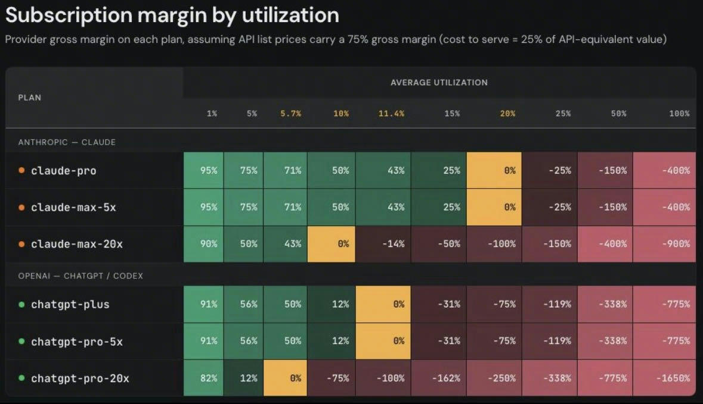
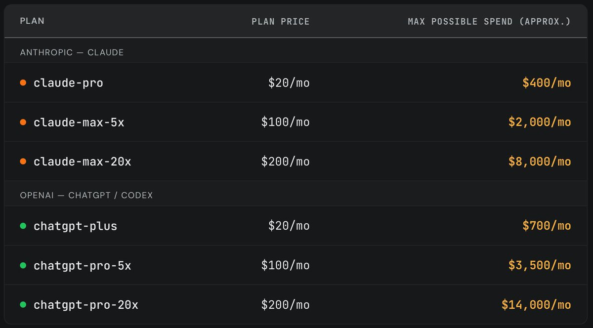

# 金融、投资与区块链

> 本文件是金融、交易、投资和区块链主题的长期入口：沉淀可复用概念、个人交易复盘、经济分析和判断框架。`非技术知识.md` 保留非金融主题及创业 / AI 的其他上下文；已迁移主题以本文件为准。

## 阅读地图

1. 先理解成交、成本和风险：Maker / Taker、价差与深度、永续合约、保证金、滑点、资金费；标的判断与工具可交易性分别评估。
2. 再看交易复盘：交易假设、退出计划、实际净收益和过程质量。
3. 最后看公司与投资：CAPEX / OPEX、DCF、创投退出结构、资本市场和量化交易。

## 交易基础：从成交到净收益

### Maker / Taker：交易手续费按成交行为收取

交易手续费通常按成交金额计算：

- **吃单（Taker）**：主动消耗订单簿已有流动性，例如立即成交的市价单。费率示例为 `0.045%`，成交 `10,000` 元的手续费为 `10,000 × 0.00045 = 4.5` 元。
- **挂单（Maker）**：订单先留在订单簿，等待其他订单来成交，为市场提供流动性。费率示例为 `0.015%`，成交 `10,000` 元的手续费为 `10,000 × 0.00015 = 1.5` 元。费率通常低于 Taker。

**限价单不必然是 Maker**：分类看是否立即撮合，而不是看下单接口。最低卖价为 `100` 元时，以 `100` 元限价买入并立即成交，仍是 Taker；以 `99` 元限价买入、订单留在簿上等待成交，通常才是 Maker。

还要区分两类成本：交易所收取**交易手续费**；链上转账、合约调用等操作还可能产生网络 **Gas 费**。买入和卖出通常分别计算一次交易手续费。具体费率以平台的费率等级、交易对和活动规则为准。

### 永续合约：有价格敞口，没有现货权益

- **做多**：价格上涨盈利，下跌亏损。
- **永续合约**：按价格变化结算盈亏，没有固定到期日；持仓本身不带来标的现货的治理、质押或分配权益。股票永续也不等于持股，不能默认获得股息。
- **USDC**：计价和保证金使用的稳定币，目标是与美元约 `1:1` 挂钩，但仍有发行方和脱锚风险。参考：[USDC 官方说明](https://www.circle.com/usdc)。
- **隔离保证金**：把该仓位抵押品与其他仓位分开，限制风险相互传染，但不等于保本；保证金不足仍可能被强平。

`1 倍`可以粗略理解为：约 `25 USDC` 保证金承担约 `25 USDC` 的价格敞口。价格每变动 `1%`，毛盈亏约为 `0.25 USDC`，但最终结果还会受到合约面值、手续费、资金费和滑点影响。参考：[Hyperliquid 保证金规则](https://hyperliquid.gitbook.io/hyperliquid-docs/trading/margining)。

### 成本、触发与成交不是一回事

- **止损 / 止盈价**是触发订单的条件，不是保证成交价；快速行情或买盘不足时会出现滑点。
- **资金费**是永续合约多空之间的定期转移：正费率多头付空头，负费率反向；Hyperliquid 按小时结算，金额取决于仓位数量、预言机价格和当期费率。收资金费仍承担价格风险。参考：[资金费说明](https://hyperliquid.gitbook.io/hyperliquid-docs/trading/funding)。
- **浮盈**只是当前价格下的账面结果，尚未平仓，也不是扣除所有费用后的最终利润。
- 保护单若设置为 **reduce-only**，作用是减少或关闭已有仓位，不会反向开新仓。参考：[止盈止损规则](https://hyperliquid.gitbook.io/hyperliquid-docs/trading/take-profit-and-stop-loss-orders-tp-sl)。

**公司值得研究，交易工具也要值得用：方向收益必须覆盖进出与持有成本。**

- **价差与滑点**：立即买入吃卖盘，立即卖出吃买盘；订单超过近价挂单深度，会逐档以更差价格成交。流动性看目标金额能否在合理价格附近进出，不能只看远端挂单总量；限价单控制价格，但不保证成交或低成本退出。
- **成本别混算**：按深度模拟的买卖差额已包含价差与吃深度损耗，不能再重复加滑点；交易手续费、资金费、Gas 另算。返佣只减约定范围内的手续费，不给总损耗打折。[费率说明](https://hyperliquid.gitbook.io/hyperliquid-docs/trading/fees)
- **标的与合约流动性分开**：Aqua 是入口，XYZ 是合约市场，Hyperliquid 提供交易与结算；`xyz:CVX` 跟踪雪佛龙股价，拥有独立盘口，美股深度不会自动迁移过来。[HIP-3](https://hyperliquid.gitbook.io/hyperliquid-docs/hyperliquid-improvement-proposals-hips/hip-3-builder-deployed-perpetuals)

**CVX 模拟案例**（用户提供的 9 月 19 日北京时间 22:41 盘口，未实际成交）：约 1,500 美元、7.03 单位，立即买卖的盘口损耗约 **46 美元 / 3.09%**；按给定 `0.009%/边` 基础费率，往返手续费仅约 `0.27` 美元，且未含入口全部收费。小时资金费 `0.01037%`、预言机价 `209.25` 美元若保持 30 天，多头约付 `110` 美元；这是固定参数情景，不是费用预测。周末对冲不便可能拉宽报价，需用正常美股时段盘口对照确认。

## 交易复盘：SKY 永续合约多单

> 这是一笔约 `25 USDC` 的小额看涨交易：预先安排认错退出和获利退出，用来验证判断与交易流程，不能证明已经具备稳定赚钱的能力。以下为本次交易记录，不构成对未来收益的保证。

### SKY：先分清协议、稳定币和治理代币

**SKY 是 Sky Protocol 的治理代币。** Sky 原名 MakerDAO，是一个提供稳定币和抵押借贷服务的链上金融协议。参考：[Sky Token 官方介绍](https://sky.money/blog/understanding-the-sky-token)。

| 名称 | 它是什么 | 不要把它误认为 |
|---|---|---|
| **Sky** | 整个链上金融协议 | 一枚代币 |
| **USDS / DAI** | Sky 生态中的美元稳定币，目标约为 `1` 美元 | 治理代币或无风险现金 |
| **SKY** | 参与协议治理、价格会波动的代币 | 稳定币或公司股票 |

研究 SKY，至少要同时看三件事：协议业务和收入能否增长；收入如何用于储备、回购等机制；相关利好是否已经反映在价格里。协议赚钱，不代表 SKY 必然上涨。参考：[Sky 经济机制说明](https://sky.money/blog/what-is-sky-money)。

本次持仓买的是 **SKY 永续合约多仓**，不是 SKY 现货：

- 相当于 `403` 枚 SKY 的价格敞口，成本约 `24.92 USDC`；
- 使用逐仓 `1` 倍杠杆。价格变动 `10%` 时，毛盈亏约为 `2.49 USDC`，方向相反时同理；
- 因此不会自动获得链上 SKY 的治理权、质押奖励或其他现货权益；合约还会产生交易手续费和资金费，参考：[Hyperliquid 资金费说明](https://hyperliquid.gitbook.io/hyperliquid-docs/trading/funding)。

### 本次交易假设

这笔交易的看涨假设是：Sky 协议的回购、销毁和相关参数调整，可能改善市场对 SKY 的需求与预期。

- 实际数量为 `403` 个 SKY 合约单位，平均价格约 `0.061832 USDC`；
- 名义交易金额为：

$$
403 \times 0.061832 \approx 24.92\ \text{USDC}
$$

`403` 是合约数量，不是投入了 `403` 美元。

官方提案确实包含销毁 SKY、缩短回购周期等内容，见[官方提案](https://vote.sky.money/executive/template-executive-vote-monthly-settlement-cycle-for-august-2026-treasury-management-function-parameter-updates-increase-mkr-sky-delayed-upgrade-penalty-adjust-allocator-vault-dc-iam-parameters-prime-agent-proxy-spells-september-10-2026)。

但“发生了好事”不等于“现在买就能赚钱”：利好可能已被价格提前反映，回购加快也不必然代表总支出增加，整体加密市场下跌还可能盖过项目利好。因此，这是一条有依据、仍可能错误的交易假设。

### 退出计划与盈亏比

忽略费用时：

$$
\text{毛盈亏}=403\times(\text{退出价格}-0.061832)
$$

| 计划 | 退出价格 | 相对买价变化 | 计划毛盈亏 |
|---|---:|---:|---:|
| 止损 | `0.0588` | `-4.90%` | 约 `-1.22 USDC` |
| 止盈 | `0.0681` | `+10.14%` | 约 `+2.53 USDC` |

计划盈利约为计划亏损的 `2.1` 倍，因此盈亏比约为 `2.1:1`。但盈亏比不等于胜率：如果判断经常错误，或实际亏损因滑点超过计划，仍然可能亏钱；单笔交易也无法提供可靠胜率统计。

### 实际净结果要扣除成本

需要从毛盈亏中继续扣除：

- 开仓交易手续费：本次已支付 `0.010764 USDC`；平仓还会产生费用；
- 资金费：随多空拥挤程度变化，方向和金额不固定；
- 滑点：实际成交价与预期价的差异。

下单时记录的约 `0.13 USDC` 浮盈只是当时的账面快照，保护单仍在，并不等于最终净利润。

### 怎样才算做得好

评价这笔交易不能只看最后赚没赚钱，还要检查：

1. 买入理由是否有可核查证据，且没有把项目利好直接等同于价格上涨；
2. 判断错误时是否按计划退出，而不是临时扩大止损；
3. 实际手续费、资金费、滑点和亏损是否符合预期；
4. 多次类似交易后，是否仍有稳定的净优势。

计划最长持有至 `9 月 18 日 19:51（北京时间）`。这是交易计划的期限，永续合约本身不会到时自动结束。

## 公司经济与估值

### CAPEX / OPEX：利润表不等于现金流

- **CAPEX**：购买长期产能，如厂房、数据中心、GPU 集群；现金先流出，再通过折旧 / 摊销进入利润表。
- **OPEX**：当期运营消耗，如电费、带宽、云服务、运维和人力。

$$
\text{Free Cash Flow}\approx\text{Operating Cash Flow}-\text{CAPEX}
$$

读公司时至少问三个问题：新产能利用率如何、投资多久回本、投入资本能否带来足够的 ROIC。对 AI 公司，训练集群更像研发能力，推理集群更像数字产线；模型效率、缓存、batching、路由、定价和利用率共同决定经济性。

详细材料：[CAPEX 详细展开](#capexcapital-expenditures资本开支)。

### DCF：把未来现金流折回今天

DCF 的核心是货币的时间价值：资产价值约等于未来现金流的现值之和。

$$
\text{EV}=\sum_{t=1}^{N}\frac{\text{FCF}_t}{(1+r)^t}+\frac{\text{TV}}{(1+r)^N}
$$

关键变量是未来现金流、折现率 `r` 和终值 `TV`。因此估值争议通常不在公式，而在增长率、利润率、资本开支、风险和终值假设。

详细材料：[DCF 详细展开](#折现现金流-discounted-cash-flow-dcf)。

### AI 产品：从软件经济转向算力容量经济

传统软件是“一次构建，多次售卖”，边际复制成本接近零；大模型产品每次调用都消耗 GPU、电力和网络，边际成本不再为零。看 AI 产品不能只看订阅收入或毛利率，还要看：

- GPU / 推理容量利用率与折旧周期；
- 模型路由、prompt cache、context 压缩和工具调用成本；
- 免费、订阅、API、企业和 credits 的价格分层；
- 用户付费是否对应可量化的结果，而不是单纯消耗 token。

详细材料：[大模型产品成本结构的详细展开](#大模型产品的成本结构从软件经济到制造业经济)。

### 大模型产品的成本结构：从软件经济到制造业经济

> 来源：晚点AI、Sand.ai 创始人曹越
> 整理时间：2026-02-16

**传统软件的规模效应**
- 模式：“一次构建，多次售卖”
- 特点：
  - 软件开发完成后，复制和分发的边际成本几乎为零
  - 售卖越多，利润率越高
  - 典型的“软件经济”，规模效应极强

**大模型产品的制造业属性**
- 模式：“每次调用都消耗算力”
- 特点：
  - **BOM（物料清单）成本**：每次用户调用大模型，都需要消耗真实的算力资源（GPU、电力、网络等）
  - 边际成本不为零：每增加一次调用，就增加一份成本
  - 更像制造业：生产一个产品，就消耗一份原材料（算力）
  - 成本结构更接近有实体物料的制造业，而非纯软件

**组织协作视角**
- OpenAI：实现了从产业到模型的深度垂直整合，“端到端”的组织，产品需求可以高效地梯度回传给模型
- 字节跳动：模型（Seed）与产品（Flow）团队协作频次极高，有共同为产品服务的意识
- 腾讯、阿里：模型与产品团队分属两个事业群

**字节的应对策略：数据飞轮**
- 依托字节在推荐、搜索和广告领域的 AB Test 经验
- 构建基于大规模用户反馈的闭环优化系统
- 通过数据飞轮来优化模型，提高每次调用的效率和价值

**AI 产品盈利和成本：订阅不是 SaaS，是容量保险**

> 来源：
> - [SemiAnalysis X thread](https://x.com/SemiAnalysis_/status/2064815044085318040)（社媒线索，结合用户截图；直接抓取只暴露片段）
> - [OpenAI Codex Pricing](https://developers.openai.com/codex/pricing)、[OpenAI API Pricing](https://openai.com/api/pricing/)、[Using Codex with your ChatGPT plan](https://help.openai.com/en/articles/11369540-using-codex-with-your-chatgpt-plan)
> - [Claude Pricing](https://claude.com/pricing)、[Claude Max plan](https://support.claude.com/en/articles/11049741-what-is-the-max-plan)、[Claude usage limits](https://support.claude.com/en/articles/11647753-how-do-usage-and-length-limits-work)
> - [Reuters: OpenAI compute spend around $600B by 2030](https://www.reuters.com/technology/openai-sees-compute-spend-around-600-billion-by-2030-cnbc-reports-2026-02-20/)（原文抓取受限，用 [CNBC 摘录镜像](https://static.newsfilter.io/7aa889d9084836febada995ecdc62a33.html) 与 [DCD 报道](https://www.datacenterdynamics.com/en/news/openai-cuts-projected-compute-spend-to-600bn-by-2030-report/) 交叉校验）

这组图不是在说 NVIDIA 这类 GPU 厂商毛利，而是在做一个**API 标价口径的推理服务毛利假设**：假设 API list price 有 75% gross margin，也就是 provider 的 cost-to-serve 约等于 API-equivalent value 的 25%。换句话说，公开 API 标价约是边际服务成本的 4 倍。

$$
\text{gross margin} \approx \frac{\text{plan price} - 0.25 \times \text{API-equivalent spend} \times \text{utilization}}{\text{plan price}}
$$

因此 break-even utilization 是：

$$
\text{break-even utilization} \approx \frac{4 \times \text{plan price}}{\text{max possible API-equivalent spend}}
$$

图里的含义：

- Claude Pro / Max 5x：$20 / $100 对应最高约 $400 / $2,000 API-equivalent spend，break-even 在 20% utilization。
- Claude Max 20x：$200 对应最高约 $8,000 API-equivalent spend，break-even 在 10% utilization。
- ChatGPT Plus / Pro 5x：$20 / $100 对应最高约 $700 / $3,500 API-equivalent spend，break-even 在 11.4% utilization。
- ChatGPT Pro 20x：$200 对应最高约 $14,000 API-equivalent spend，break-even 只有 5.7% utilization。

这个假设可作为 stress test，但不能当真实 P&L。API 标价里包含产品溢价、限流、SLA、销售、滥用风控和研发分摊；真实内部成本还取决于自有/租用算力、GPU 利用率、折旧、电力、网络、batching、speculative decoding、prompt cache、routing、输出 token 占比、tool/runtime/search/storage 等。订阅用户的实际分布也很关键：大多数低频用户是利润来源，少数长程 coding / deep research 用户可能是负毛利。

Codex 和 Claude Code 的经济差异：

- Codex 官方口径是包含在 ChatGPT Free / Go / Plus / Pro / Business / Edu / Enterprise 中，并通过不同 plan 给不同 usage limit；Claude Code 也纳入 Claude Pro / Max 等统一 usage limit。二者都不是独立按 token 计费的 SaaS，而是“订阅 + 限流 + 超额 credits / enterprise”的容量分层。
- 在 SemiAnalysis 这组测算里，OpenAI 给 ChatGPT / Codex 的 max possible API-equivalent spend 更激进：Plus / Pro 5x 约是月费 35 倍，Pro 20x 约是 70 倍；Claude Pro / Max 5x 约是 20 倍，Max 20x 约是 40 倍。
- 这意味着在重度用户上，Codex/ChatGPT Pro 的边际亏损风险更高；但 OpenAI 可能用更大的基础设施规模、模型路由、cache、更低内部成本和战略补贴换开发者入口。Anthropic 更像在 Claude Code 高粘性上扩 usage，但用 Max 档、五小时窗口、weekly cap、credits 和 compute capacity 扩张来控风险。
- 对用户来说，订阅制 coding agent 的“便宜”来自模型厂商的容量交叉补贴；对厂商来说，它的商业本质是赌平均 utilization、留存、企业转化和生态入口，而不是每个 power user 当月盈利。
- 这还催生了“订阅转 API”的灰色生态（CLIProxyAPI/CPA、Sub2API、codex2api 等）：把订阅额度包装成 API 接口，本质是套利“容量交叉补贴”与 API 标价差。它对厂商是风控与 ToS 问题，对用户是账号封禁与合规风险，不应作为企业生产依赖；但它同时验证了订阅定价与 API 定价之间的套利空间有多大。

Reuters/CNBC 报道的 OpenAI $600B compute spend through 2030，把这个问题放大到公司层：AI 产品利润不是传统 SaaS 的“代码写完后复制”，而是一个持续买算力、吃折旧、填容量、再用产品和模型效率把单位成本压下来的资本密集型业务。

用 CAPEX / OPEX 视角看，GPU、机房、网络、电力基础设施、自建推理集群更接近“先花大钱买产能，再靠利用率和单位经济性慢慢回收”的资本开支；电费、带宽、云服务、运维、人力和按量租用算力更接近运营开支。买卡自建会把压力前置到现金流和折旧，租云会把压力表现为更高的当期成本，但经济本质都是“算力产能必须被足够高价值的 token / workflow 填满”。因此 AI 公司不能只看毛利率，还要看 GPU 利用率、折旧周期、模型迭代导致的硬件过时、cloud commitment、CAPEX payback 和 free cash flow。

若 2030 年 revenue 目标约 $280B，而 cumulative compute spend 到 2030 约 $600B，那么核心问题不是“某个月订阅是否赚”，而是：

1. **容量利用率**：训练、推理、订阅、API、企业、batch、off-peak 是否能填满同一套基础设施。
2. **价格歧视**：Free / Plus / Pro / Team / Enterprise / API / credits 能否把低频用户、高频用户、企业用户分层定价。
3. **模型路由**：把 routine task 路由到 mini / cheaper model，把高价值任务留给 frontier model。
4. **cache 和 context discipline**：prompt cache、context 压缩、状态管理、工具结果复用，会直接决定 long-running agent 毛利。
5. **结果价值定价**：coding agent、deep research、enterprise workflow 的长期定价应更接近“节省的人力和交付结果”，而不是单纯 token。

一句话判断：AI 产品不是“软件毛利下降一点”，而是从软件经济切到**算力容量经济**。订阅制是获客和留存手段，真正的盈利要靠低频用户摊薄、重度用户限流、企业高 ARPU、模型效率提升和更高价值的 outcome pricing。

**豆包与 Seedance：同一套 AI 账本里的两种经济性**

> 来源：[晚点 LatePost：字节跳动的 AI 账本：豆包每天不足百万收入、Seedance 毛利 70%](https://mp.weixin.qq.com/s/Bp6k_ZzYA04ic87AhtsuYw)，2026-06-16

晚点披露的字节 AI 账本把“容量经济”具体化了：豆包 App 已有每天 2 亿多用户，但每天收入不足百万元，主要来自电商佣金；按火山公开 API 价格、豆包模型毛利率和用户使用习惯推算，豆包到 2026 年 5 月每天推理消耗达数千万元，且还未计入训练模型和智算中心的资本开支。结论不是 ToC 没价值，而是大规模免费使用在 AI 时代会把获客成本直接转成持续算力成本，规模越大，越需要更强的价格歧视、限流、模型路由和企业转化。

Seedance 的经济性相反：据晚点，Seedance 年化收入已达 20 亿美元、单月超 10 亿元，毛利率约 70%，绝大多数收入来自企业客户。它的高毛利来自几个组合因素：视频生成训练投入集中在少数模型上，后续收入更容易摊薄；DiT/MoE 视频模型推理对卡间通信依赖低于逐 token 生成的语言模型，更容易用国产推理卡承接；短剧、漫剧等专业生产场景按产能和结果付费，而不是按普通用户娱乐时间付费。

这说明 AI 商业化的关键分水岭不是 ToC / ToB 标签，而是“用户是否为可量化结果付费”。豆包式消费者助手面临国内免费心智、DeepSeek 开源免费供给、电商非目的性浏览等多重阻力；Seedance、Claude Code 这类生产力工具更容易把算力成本映射到企业预算、人力替代和内容产能。对模型厂商而言，免费 ToC 产品可以承担品牌、反馈和分发入口，但真正消化资本开支的主路径仍是 API、企业服务、生产力工作流和 outcome pricing。

**2026-08-19 更新：Seedance 产品化再加一层“专业创作者工作台”**

> 来源：[读佳独家：Seedance 迎独立平台，火山引擎内测 Seedance Studio](https://mp.weixin.qq.com/s/8zobEkIfcwKVfv9WVwpU8w)

火山引擎小范围邀测面向影视创作的独立工作台 Seedance Studio：项目制管理，覆盖需求理解、创作规划、项目组织、内容生成、迭代修改到成片推进，定位在 C 端轻工具（豆包 / 即梦）与方舟 API 之间。商业上它把模型能力封装成开箱即用成品工具，直接承接影视 / MCN / 独立创作团队“为完整工作流付费、但不会对接 API”的需求，是上面 outcome pricing 判断的最新落地样本。

### 宏观经济与国际金融
#### 实证：AI 在各经济任务中的真实使用分布（Anthropic Economic Index）

> 来源：[Which Economic Tasks are Performed with AI? Evidence from Millions of Claude Conversations](https://arxiv.org/abs/2503.04761)（Anthropic，arXiv:2503.04761，2025-02）
> 数据：[Anthropic/EconomicIndex](https://huggingface.co/datasets/Anthropic/EconomicIndex)｜官网持续更新：[Anthropic Economic Index](https://www.anthropic.com/economic-index)
> 整理时间：2026-08-18

**这是什么**：Anthropic 用隐私保护分析系统 Clio 处理 2024-12～2025-01 的 100 万条 Claude.ai Free/Pro 对话，把对话逐条映射到美国劳工部 O*NET 的约 2 万个任务描述上，得到“AI 现实中被用来做什么经济任务”的实证分布。区别于此前靠专家标注或模型预测“未来哪些任务会被自动化”的 exposure 研究，这是首个大规模真实使用量测量。

**方法要点**
- 隐私机制：Clio 只产出聚合统计；任务至少累计 5 个独立账号、15 次对话才进入结果，防止个体行为被还原。
- 分层分类：O*NET 任务约 2 万条放不进上下文，先构建三层任务树（12 个顶层 / 474 个中层 / 19,530 个底层任务），再用 Claude 从顶层逐层下钻分类；单任务映射与多任务映射结果定性一致。
- 样本边界：仅 Claude.ai Free/Pro，不含企业/API 客户；纯文本模态。结论应视为“Claude.ai 场景的快照”而非全市场事实。

**关键数字**
- 任务构成：软件相关职业（软件工程师、数据科学家、生物信息学）占全部查询 37.2%，居首；第二名是文娱媒体类（营销、写作、内容生成）10.3%；教育与商业类也较多；体力劳动类（运输、医护支持、农林牧渔）最少。
- 渗透深度：约 36% 职业有 ≥1/4 关联任务出现 AI 使用；约 11% 过半；仅约 4% 达到 ≥3/4。→ 现状是“任务级渗透”，不是“职业级替代”；AI 在大部分职业里只碰其中一部分任务。
- 技能分布：高使用为认知技能（批判性思维、阅读理解、编程、写作）；安装、设备维护、维修等体力技能和谈判等管理技能几乎不出现。
- 工资与门槛：使用峰值在上四分位（程序员、Web 开发者）；极低薪（服务员）和极高薪（麻醉医生等需要大量实操/深度训练的职业）都低。入门门槛上，峰值在 Job Zone 4（本科级别），博士级职业反而回落——人类的“入职门槛”和模型的“使用门槛”是两回事。
- 自动化 vs 增强：57% 对话是增强型（任务迭代、学习、验证），43% 是自动化型（directive 直接委派、feedback loop 反馈循环）。写作/内容生成多为 directive；代码调试多为 feedback loop；验证类占比最小、几乎集中在翻译。用户可能在聊天窗口外继续修改输出，真实增强比例可能更高。
- 模型分工：Sonnet 3.5（new）更多用于编码，Opus 更多用于创意写作、教育课程与学术研究。

**与预测研究的对比**
- Webb 2019 预测工资第 90 分位附近暴露最高；实证峰值在中高薪，最高薪反而低 → 技术可行性之外，实施成本、监管、组织准备在真实制约扩散。
- Eloundou 2023 预测 80% 美国工人至少 10% 任务会受 LLM 影响；实证目前约 57% 职业至少 10% 任务有使用，低于预测；且医疗实际使用低于预测、科学应用高于预期。

**局限**
- 非因果：只看使用，看不到输出是否真的被采纳、是否提升产出。
- 用户不一定是该职业从业者（问营养问题的不一定是营养师），会高估部分专业任务使用率。
- O*NET 静态且美国中心：无法覆盖 AI 新创造的任务/职业，也忽略非美区域。

**对 agent 产品 / benchmark 的启示**
- 任务池设计可用真实使用分布校准：软件 + 写作 + 分析类是高密度真实需求，做 agent 产品优先在这些任务上兑现价值。
- 增强型（迭代/学习/验证）与自动化型（directive/feedback-loop）是两种不同工作流：前者 eval 重点在协作质量与多轮改进，后者在单次执行正确性与环境反馈闭环；benchmark 应按两类分别设计，而不是只测“一次给出正确答案”。
- 职业渗透集中在“任务级”而非“职业级”，支持 agent 从单任务助手向多任务工作流渐进演进的路线。

* 金融客户：银行、互金、支付、卷商

#### AI + 经济

*   **市场规模预测 (2025-2034)**
    *   **全球 AI 市场**: 预计从 2025 年的 $3,910$ 亿美元增长至 2030 年的 $1.81$ 万亿美元 (CAGR $35.9\%$)。
    *   **AI 智能体 (Agent) 市场**: 预计从 2025 年的 $79.2$ 亿美元增长至 2034 年的 $2,360$ 亿美元 (CAGR $45.82\%$)。
    *   **向量数据库市场**: 预计从 2024 年的 $6.37$ 亿美元增长至 2030 年的 $19.15$ 亿美元 (CAGR $20.14\%$)。
    *   *注：向量库增速虽高，但低于 AI Agent 市场的爆发式增长。*
    *   Ref: [Global Trends](https://ff.co/ai-statistics-trends-global-market/?utm_source=chatgpt.com), [Vector DB Market](https://www.360iresearch.com/library/intelligence/vector-databases-for-generative-ai-applications)

* todo 十万亿美元的 AI 泡沫，是等待爆发的灾难，还是通向进步的必然？ https://mp.weixin.qq.com/s/QrFLT-w877qDyqzfBJ1csg

#### CAPEX（Capital Expenditures，资本开支）

CAPEX 是公司为了获得、建设或升级长期资产而发生的现金支出，例如厂房、设备、数据中心、GPU 集群、长期使用的软件系统。它和 OPEX（Operating Expenses，运营开支）的区别不在于“花钱大小”，而在于这笔钱买的是长期产能，还是当期运营消耗。

三张表里的位置：

- **现金流量表**：CAPEX 通常体现为投资活动现金流出，现金先流出去。
- **资产负债表**：形成固定资产、在建工程、无形资产等长期资产，后续通过累计折旧 / 摊销逐步减少账面价值。
- **利润表**：买入当期不一定一次性进费用，而是按使用年限分期折旧 / 摊销，影响 EBIT 和净利润。

因此 CAPEX 会制造一个常见错觉：利润表看起来没有立刻被打穿，但自由现金流已经先承压。对资本密集型公司，净利润可能比现金流“好看”；对高速扩张期公司，收入增长和毛利率也可能掩盖了持续买产能带来的现金消耗。

和 DCF / FCF 的关系：

$$
\text{Free Cash Flow} \approx \text{Operating Cash Flow} - \text{CAPEX}
$$

$$
\text{UFCF} = \text{EBIT}(1 - \text{税率}) + \text{折旧摊销} - \text{CAPEX} - \Delta \text{NWC}
$$

读公司时，CAPEX 要和三个问题一起看：

1. **产能利用率**：新买的资产能否被收入填满。闲置 GPU / 闲置产线都是现金沉没。
2. **投资回收期**：这笔 CAPEX 多久能通过毛利和现金流赚回来；技术迭代越快，折旧年限越保守。
3. **ROIC**：新增投入资本能否带来足够高的税后经营利润。资本开支本身不是坏事，坏的是每一轮扩张都降低资本回报率。

放到 AI 公司里，CAPEX 的核心不是“买了多少卡”，而是把未来算力产能提前买下来。训练集群更像研发能力和战略期权，推理集群更像数字工厂产线；真正决定经济性的，是模型效率、cache、batching、路由、企业 ARPU、定价权和利用率能不能覆盖折旧与持续扩容。

#### 折现现金流 (Discounted Cash Flow, DCF)

DCF 是一种核心的绝对估值方法，其基础是**货币的时间价值**。它认为一项资产的内在价值等于其未来所有预期现金流的现值之和。

*   **基本公式**: `DCF = Σ [ CFₙ / (1 + r)ⁿ ]`
    *   `CFₙ`: 第 n 年的自由现金流。
    *   `r`: 反映风险的折现率。

*   **完整估值模型**: 由于公司永续经营，估值分为两部分：
    `企业价值 (EV) = [ Σ_{n=1}^{N} CFn / (1+r)ⁿ ] + [ TV / (1+r)ᴺ ]`
    *   第一部分是未来 N 年（如5-10年）的现金流折现。
    *   第二部分是 N 年后的永续价值 (Terminal Value, TV) 折现。

*   **核心三要素**:
    1.  **预测未来现金流 (CF)**: 通常使用无杠杆自由现金流 (UFCF)，代表公司为所有资本提供者创造的现金。
        `UFCF = EBIT(1 - 税率) + 折旧摊销 - 资本性支出 - 净营运资本变动`
    2.  **确定折现率 (r)**: 最常用的是加权平均资本成本 (WACC)，综合了股权和债务的成本。
        `WACC = (E/V) * Re + (D/V) * Rd * (1 - Tc)`
    3.  **计算永续价值 (TV)**: 估算预测期结束后的价值。
        *   **永续增长模型**: `TV = (CF_N * (1+g)) / (r - g)`，假设未来以 `g` 速率永续增长。
        *   **退出倍数模型**: `TV = EBITDA_N * 退出倍数`，假设公司在期末被出售。

#### 国际金融 —— 奔跑的北极企鹅（vx公众号）

##### 中美贸易战

* [债券市场崩盘！10年期美债收益率飙升，标普500暴跌8%，背后真相是什么？](https://mp.weixin.qq.com/s?__biz=MzU2MzY2MzA4Mw==&mid=2247483726&idx=1&sn=e8d166006c227667fd150a20a8aeea2d&chksm=fc5798cacb2011dcf55f9ead9b271c9c180b2ae177e7063ad0aadafe9b42c9c4455467d6cc75&cur_album_id=3925872278893756426&scene=189#wechat_redirect)
  * 答案指向一个关键因素——**“基差交易”（Basis Trade）的崩盘。**
  * 基差交易（Basis Trade）是一种利用现金国债（Cash Treasuries）和国债期货（Treasury Futures）之间微小价差进行套利的策略。简单来说：
    1. **现金国债**：直接在现货市场购买的美国政府债券。
    2. **国债期货**：在未来某个日期买卖国债的合约。
  * 由于市场供需等因素，现金国债和国债期货的价格往往存在微小差异（即“基差”）。对冲基金通过高杠杆（最高可达100倍）放大这一价差，赚取无风险套利收益。在低波动性的市场环境中，这种策略非常有效。**然而，一旦市场波动性激增，基差交易的脆弱性就会暴露出来。**
  * 
  * 与2020年类似，当前的基差交易崩盘也伴随着金价的飙升。黄金作为避险资产，在市场不确定性高企时往往表现优异，而债券（例如$TLT）则大幅下跌。

* S&P 500暴跌
  * bull trap牛市陷阱 <-- 市场情绪脆弱
  * 中美开启双边贸易谈判
  * --> 关注VIX指数，50以上说明恐慌情绪顶峰，可能是低位布局的良机

* [4.2川普互惠关税生效：贸易战升级与市场动荡](https://mp.weixin.qq.com/s/YoO5M8utcJJTCdibmyhARQ)
* [美国经济衰退信号显现：市场动态与政策影响分析](https://mp.weixin.qq.com/s/O-ek3vSu7_uclNUSQ_Uilg)
  * **市场信号：债券收益率与通胀的矛盾走势**
  * 10年期国债收益率大幅下挫65个基点 —— 0.65%
* [中美贸易战升级！中国对美商品加征34%关税，全球市场巨震](https://mp.weixin.qq.com/s?__biz=MzU2MzY2MzA4Mw==&mid=2247483691&idx=1&sn=3044df8abb494d685abd54417e2a3c06&chksm=fc5798afcb2011b98caeffec66078be553b8635354db894eb15686c01f4b41848761e73368bf&cur_album_id=3925872277014708235&scene=189#wechat_redirect)
  * 标普500指数暴跌、油价崩盘、债券市场预警
  * 中美贸易规模受冲击
    * 根据2024年的数据，美国从中国进口商品总值达4390亿美元，而中国从美国进口1430亿美元，总计约5820亿美元的贸易额。仅中美双方在过去24小时内加征的34%关税，就将额外增加约1980亿美元的成本。这相当于对消费者和企业征收了一项巨额“税收”。

  * 美国经济面临双重压力
    * 如果这些关税长期持续，美国GDP可能萎缩3%-4%，而核心PCE通胀率可能在未来几个月升至4%左右。关税不仅推高了物价，还可能导致供应链混乱，进一步加剧通胀压力。

  * 全球供应链面临挑战
    * 中国对稀土金属的出口限制将直接影响美国的高科技和国防产业。稀土元素是电动车、风力涡轮机、军事通讯设备等产品的核心原料，而中国控制着全球99.9%的重稀土分离产能。美国的稀土供应链安全正面临前所未有的挑战。

* [全球股市风暴来袭：对冲基金抛售400亿美元，散户狂买后急撤，市场“投降”近在眼前？](https://mp.weixin.qq.com/s?__biz=MzU2MzY2MzA4Mw==&mid=2247483705&idx=1&sn=49832bb03608a966562d2149335da051&chksm=fc5798bdcb2011abca439d9101752e81ed58c0671d3d2622926846e92d6fc4d75f1189bac298&cur_album_id=3925872277014708235&scene=189#wechat_redirect)
  * Magnificent 7指数较历史高点下跌超过30%
  * **谁在乎股市？财富分配的真相**
    * 值得注意的是，特朗普似乎对股市的暴跌并不在意。原因或许在于，美国股市的财富分布极不均衡。根据彭博社数据，截至2024年，美国前1%的家庭持有超过50%的股票，而接下来的19%几乎持有剩余的所有股票。这意味着，约80%的美国人对股市波动并不敏感。

## 投资与资本市场

### 看投资标的的四个问题

1. **价值来源**：现金流、用户增长、网络效应、稀缺资源还是叙事预期？
2. **价格关系**：好消息是否已经被市场定价？当前价格隐含了多高的增长和成功概率？
3. **资金与退出**：谁在提供资金，下一轮资金从哪里来，退出路径是并购、IPO、回购还是清算？
4. **风险与验证**：什么证据会推翻判断，最大损失是否可承受，是否能通过多次样本检验而非单笔结果自我证明？

### 现有案例索引

  - [中国创投生态：明股实债、IPO 唯一出口与三池资金](#中国创投生态明股实债ipo-唯一出口与三池资金)：从退出结构、人民币 / 本地美元 / 外资三类资金池和关系网络理解中国创投。
  - [字节投资史：从买时间差到自研算力](#字节投资史从买时间差到自研算力2014-2026)：观察战略投资、财务投资、并购整合与自研之间的边界变化。
  - [大模型与资本市场：IPO 不是奖赏，而是续命安全网](#大模型与资本市场ipo-不是奖赏而是续命安全网)：理解 AI 公司融资、IPO 和持续算力投入之间的关系。
  - [量化交易原始笔记](#量化交易)：信号预测、仓位管理、交易执行和 PNL 反馈是四个不同环节，不能把模型准确率直接等同于交易收益。
  - [云九资本袁语：AI 投资是找「天庭下凡的人」](#云九资本袁语ai-投资是找天庭下凡的人)：投资人视角的价值分布（模型与交付两端低估、中间层被挤压）与选股三变量（判别器、代际武器、人才分层）。

### 投资与资本市场详细材料

#### 中国创投生态：明股实债、IPO 唯一出口与三池资金

> 来源：Bohan（@loubohan，Chemistry 合伙人）X 长文 [How China's Venture Ecosystem Works](https://x.com/loubohan/status/2082143914924851449)，2026-07-29，已读正文
> 核心判断：中国创投不是“更严格的硅谷”，而是由退出结构（无 M&A、被迫 IPO）、资金池（RMB/本地美元/外资）和关系图（无 cold outreach）共同塑造的平行宇宙；苛刻条款逼出更强的执行力，也让“政府产业意志”成为投资信仰

* 为什么美国怕中国
  * 开源 AI：美国政府收紧后，中国开源模型成了硅谷创业公司最主流的底座
  * 生物科技：中国多数临床试验是 novel therapy，美国 FDA 临床试验约一半是 license from China 的药物
  * 机器人：结构化优势在规模化数据生产，以及硬件“开发-反馈”的极快循环
  * 但中国从业者仍把硅谷当创新中心：顶级 VC 把 Benchmark、红杉的播客列为全公司必看；作者在 X/LinkedIn 的更新几小时内就被新智元、机器之心、量子位翻译。这种信息不对称反而成为中国的学习率优势
* 明股实债：不是“条件成熟所以上市”，而是“不上不行”
  * 大量机器人/AI 公司规模远小于宇树、月之暗面，却在为“明年 IPO”冲刺
  * 常见条款：投资者要求在 6-8 年内拿回本金且收益超过 hurdle rate，否则公司和创始人个人可能担责——中文叫“明股实债”（ostensibly equity, in reality debt）
  * 后果：逼出 all-in、敢全球扩张、最 lean 最 mean 的公司；也因压力和责任制造泡沫与欺诈
* 为什么没有 M&A
  * 中国基本不存在并购市场，退出只能靠 IPO 走完全程；公司便宜、劳动力便宜、复制快、横向整合（手机公司做汽车和 SaaS），导致大公司收购意愿低，也没有 acquihire
  * 上市门槛比 NASDAQ/NYSE 低的是“公众情绪”而非监管：亚洲市场散户占比更高，没有收入、没有客户、按美国标准 sub-scale 的公司也能成功 IPO；香港正处牛市，智谱作为少数纯 LLM 上市公司暴涨，但这些公司在美股上不了
  * 机构已在为部分 hype 行业回调做准备
* 三池资金决定激励结构
  * RMB 政府资金：省市引导基金，条款最苛刻（要求落地办公室/工厂、就业和人才、稳定本地地产），但 AI/半导体/机器人等敏感行业有时只允许它投（类似 CFIUS）；DeepSeek 只允许人民币资金
  * 本地美元基金：红杉中国（Hongshan）、高瓴、真格、经纬中国、IDG 等，更 founder-friendly，是出海公司的首选；红杉中国在 COVID 分拆前一直是红杉全球表现最好的部分
  * 外资基金：Coatue、Tiger 历史上赚过大钱，现在直接投资大幅减少；Benchmark 投 Manus B 轮是 anomaly、可能也是最后一次，最终验证为老股东回购退出（26-08 Manus 恢复独立）；对逆向投资人来说，中国可能是最后的 contrarian thesis（Founders Fund 内部讨论：crypto 和 defense 已饱和）
* FA 层：早期投资银行，不是财富管理
  * FA 负责打包、营销、撮合创业公司与 VC 的交易；VC 把 sourcing 和首层尽调外包给 FA，创始人靠 FA 跟精明 VC 谈判
  * 利益冲突天然存在：FA 不能老推烂项目，否则失去渠道；收费 2-5%，是这个世界的“税”
  * 顶级投资人解释：这就是系统，最好的 deal 也有 FA 做 quarterback——红杉中国做种子、高瓴做 A、B 轮两家分
* 隐藏的关系图
  * 中国的社交图非公开、不可读：关系社会，LinkedIn 从未普及，没有 cold email/cold message，只有 warm introduction 和大群（微信群 500 人 vs iMessage 32 人）
  * 这或许解释了为什么中国没有 B2B SaaS；FA 的存在本质上是在提供“关系流动性”
  * 反讽：政府面前没有隐私，普通人却极重隐私，网上匿名，微信头像多为动漫/风景，有人只用昵称或英文名
* 政府的手
  * 政府是大 LP、产业立法、税收/土地补贴的源头，过去十年塑造了半导体投资；圈内信仰“政府说必须存在的就会存在，如同神意”
  * 例：上海市委书记陈吉宁是英国 PhD/post-doc 的 technocrat，在北京当市长时定向投 BCI（StairMed、Neuracle 等），到上海后继续；上海政府风投部门的目标是建成战略产业而非 VC 回报，类似美国 In-Q-Tel
  * 中国人未必普遍“AGI 狂热”，但对科幻硬科技的信仰比美国人更强（《三体》的普及度）
* 对 AI/Agent 从业者的切点：DeepSeek 只能拿人民币、Manus 的 Benchmark B 轮被视为外资最后一例且最终以老股东回购收场、智谱是二级市场少数纯 LLM 标的——中国 AI 公司的融资与退出通道由“资金池 + 政府产业意志 + 二级市场情绪”三重决定，谈中国 AI 商业模式绕不开这套结构

#### 字节投资史：从买时间差到自研算力（2014-2026）

> 来源：[Z Finance：深度丨解散战投四年后，字节加强财务投资，前Coatue合伙人蒋恺入局](https://mp.weixin.qq.com/s/sxLV5EiokQlxtDfg3Q-4PQ)，2026-09-11
> 核心判断：字节的投资从来不是为了建独立的资本帝国，而是“组织与业务即算法”这一信条下的延伸工具——需要场景与团队时用支票买时间差（2014-2021）；AI 时代判断“少数股权买不来第一流技术奇点”，把同一笔钱全部押回自研算力与组织流水线（2022-2026）。2026-09 重启香港财务投资岗，说明它重新需要的是一台雷达，而不是当年的推土机
> 整理时间：2026-09-11

**事件：解散战投四年零八个月后，字节重新有了一张具名的脸**

* 2026-09-10，字节聘请蒋恺出任设在香港的财务投资部门负责人，向 CFO 高准汇报；定位全球、小股比、押注新兴科技与 AI。字节没有发通稿，也没有恢复战略投资部
* 蒋恺履历：2005 年考入北大经济 → 摩根士丹利投行分析师 → 2012 年普罗维登斯做 PE → 2015 年被 Philippe Laffont 招入 Coatue，长期执掌亚洲科技与消费版图，2020 年升合伙人；代表出手为作业帮 3.5 亿美元 D 轮、影刀 RPA 5000 万美元 B 轮
* 汇报对象高准：原世达国际律所资深合伙人，2016 年起参与字节多轮融资，2017 年协助字节以近 10 亿美元吞下 Musical.ly，2022-04 出任字节 CFO——当年替字节把筹码推上赌桌的律师，如今是这条线的终点
* Coatue 与字节的关系：2017 年首投（当时字节估值数百亿美元），此后加仓至持股数十亿美元，Laffont 一度进入董事会、2024 年秋退出；Coatue 与 Tiger、DST 被国内创投圈称为“美元三傻”（出价激进、条款极简、连董事席位都可放弃）
* 体外呼应：张一鸣个人 2024-12 在香港设立 Cool River Venture（冷河创投）并拿到香港证监会 9 号资管牌照，唯一董事——体内财投与体外家族办公室，在维港同一座金融中心落子

**第一阶段（2014-2021）：并购本身就是最高效的高管寻访渠道**

字节最坚固的护城河，往往不是“投”出来的，而是“买”回来的——控股并购连人带马整编制吸纳，再放进组织的重力场里重新锻造：

* 2014-12 首笔即截胡：图虫网（视觉中国已开出近落槌方案被拦下）；同期的图吧带来张楠，她后来从 0 到 1 做出抖音，2020 年坐上字节中国 CEO 的位置
* 出海铺垫：2015 年 News Republic（创始人 Gilles Raymond，字节全球化组织最早的探路钉子）、2017-02 Flipagram（Farhad Mohit，为北美内容团队冷启动铺轨）
* 2017 Musical.ly（近 10 亿美元，击败快手与 Facebook）：买下欧美数千万青少年用户 + 两位主帅——朱骏（TikTok 总裁 → 产品与战略 VP → 现挂帅 Flow 业务线）、阳陆育（大力教育智能硬件）
* 2018 脸萌/Faceu（约 3 亿美元现金加股票）→ 郭列 → 轻颜相机、醒图、剪映；2019 朝夕日历（程昊 → 飞书日历与协作底座）、幕布（王旭 → 飞书文档）、爱麦克斯
* 建制：2018 年年中投资部与战略部合并为“战略与投资部”，起步仅 4 位投资经理；后分化为双线——赵鹏远（战略投资，重金并购与大额扫货）+ 杨洁（财务投资，15-20 人，下设消费与 ToB 两条赛道）
* 2021 年峰值两笔：沐瞳科技 >40 亿美元（腾讯已向账上划入 1 亿美元诚意订金，仍被溢价 20-30 亿美元抢走；《Mobile Legends》海外月活超 9000 万）、PICO 近 100 亿元（业内普遍估值约 20 亿元，张一鸣亲自下场，操盘者是刚加入不久的李晓凯）
* 7 年共 189 笔对外投资：首战 2014-12-17，拉闸 2022-01-18

**第二阶段（2022-2025）：解体、收缩与狙击式出手**

* 出手节奏的暴涨与刹车：
  * 2019 年 32 起 → 2020 年 41 起 → 2021 年约 70 起（平均每 5 天就有一家公司股东名册写进字节的名字）
  * 2022 年字节 19 起（同年腾讯 85 起、阿里 30 起）；全年大厂投资并购 190 起，同比骤降 61.5%
  * 2023 年七家头部大厂合计仅 113 起，字节公开投资只剩 3 起，是踩刹车最狠的一家
* 一夜散场（2022-01-18）：赵鹏远带 5 名核心骨干转入总裁办，脱掉投资马甲做集团宏观战略推演；其余人员被切碎空投进各业务线；杨洁治下的财务投资团队几乎整建制裁撤
* 根因是组织定位：这个部门始终没有“关键先生”（既没有阿里的蔡崇信，也没有腾讯的刘炽平），负责人频繁换防——严授（→ 朝夕光年）、华巍客串托管 4 个月、朱骏（2020-07 起兼任，三年前他还是那个在收购协议上签字的创业者）。投资只是“组织与业务即算法”的延伸工具：谁离下一场核心战役更近，谁过来握几个月方向盘
* 离场的人没有退回原点：杨洁 2022-07 创立锦秋基金（名字取自张一鸣 2012 年创立字节的第一间民房办公室“锦秋家园”，字节仍是最大 LP），日后在宇树科技、具身智能与出海赛道频繁现身
* 收缩期的每一次出手都带具象的业务补缺或硬件闭环意图：2024-03 入股昕原半导体 9.5%（PICO 能效比）→ 约 3-5 亿元收购开放式音频品牌 Oladance（半年后兑现为搭载豆包的 Ola Friend）→ 懂车帝独立分拆（红杉中国领投 7-8 亿美元）→ 2025-01 影眸科技 A 轮（与美团龙珠联合领投）→ 2026-01 自变量机器人 10 亿元 A++ 轮（与红杉中国并列领投，被 36 氪称为“蛰伏四年”后的第一笔重注；张一鸣 2025 年已密集拜访极早期的具身智能公司与产业链工厂）
* 2022 年最后一笔标志性人才收编：鲸鲮科技（36 氪创始人刘成城二次创业）→ 刘成城入 Flow 挂帅 Ocean 硬件条线，负责豆包手机

**第三阶段（AI 时代）：腾讯/阿里“包下整张桌子” vs 字节“不投、全靠自研”**

* 阿里：用巨额资金换算力消耗，大模型跑得越猛，阿里云的底座飞轮转得越快；腾讯：退回防守型实用主义，用广泛的少数股权铺一张覆盖全行业的雷达网。月之暗面、MiniMax、智谱、百川、零一万物——名单上几乎绕不开阿里的算力或腾讯的生态
* 字节的判断相反：大模型是赢家通吃的底层能力革命，少数股权既买不来第一流的技术奇点、也换不来核心代码的所有权；外部团队再璀璨，也嵌不进抖音、TikTok、剪映的工作流。与其花数十亿美元在外部陪跑，不如把算力卡、顶尖人才与现金悉数封死在母体腹地
* 落地：朱骏挂帅的 Flow 业务线直扑全球 AI 原生应用，豆包用激进降价 + 场景矩阵复制移动时代“大力出奇迹”的工程打法
* 但判断又在变化（这轮重启的底层逻辑）：AI 时代变量不是太少而是太多——基座模型、专用芯片、具身智能、交互硬件全速涌现，再精密的组织也无法凭一己之力封死所有技术隘口。上一轮资本买的是确定性的业务拼图，这一轮是“在涌现的技术奇点前，提前买下一张绝不缺席的入场门票”，所以新团队是雷达，不是推土机

**两笔最重筹码的终局（给 2021 年的豪赌做结算）**

* 沐瞳：被海外主权基金接盘变现离场（业界普遍指向沙特 Savvy Games，2023 年底宣布、2024 年完成交割），换回真金白银
* PICO：2023 年末十分钟全员会决定大裁撤 → 2026-07 周宏伟因个人规划离职，接棒的却是五年前把 PICO 从歌尔谈进字节大门的人——李晓凯（浙大本科、耶鲁光电材料博士、苹果加州研发中心近 7 年）。杨震原 2025-11 透露，砍掉营销补贴后 XR 底层技术投入反而加码，自研芯片已回片量产，旗舰 Project Swan 锁定 2026 年内亮相
* 据彭博 2026-09 披露，张一鸣正亲自督导一个最高优先级项目：基于自研 Seedance 视频底座的“实时交互世界模型”，以约 50 毫秒延迟在云端按需生成可交互三维虚拟空间，首要落地硬件正是 PICO（近 4000 PPI Micro OLED）。PICO 由此从“等游戏开发者施舍内容的死寂外设”，变成世界模型在物理世界的前沿传感器与视网膜——当年靠战投砸下的硬件伤疤，被字节最庞大的 AI 算力群反向吞噬
* 经济性上的呼应：Seedance 正是本轮 AI 账本里少数高毛利资产（年化收入 20 亿美元、毛利约 70%），见 [大模型产品的成本结构](#大模型产品的成本结构从软件经济到制造业经济)

**我的判读（与其他笔记交叉）**

* 资本能力买不到组织消化能力：被买回来的团队能在组织重力场里被重新锻造（张楠、朱骏、郭列），而纯财务型的少数股权（微念、在线教育标的、GrowingIO）多数没有扎根。这恰好也是今天做“财务投资”而非“战略投资”的现实理由——财务投资不要求消化整合能力
* 与外资基金退潮的交叉：Coatue/Tiger 在华直接投资大幅减少的同时，其核心人才被吸收进产业公司的编制。蒋恺从 LP 侧走进被投公司的工服，是“美元基金退潮 + 巨头自研”两条曲线在人才市场的交点，参见 [中国创投生态](#中国创投生态明股实债ipo-唯一出口与三池资金)
* 与“内部创业为什么要死”的呼应：字节敢同时跑上百个项目，前提是航母级的高毛利、高人才密度与共享基建；战投部的解散与重启说明连航母也在动态调整“自研 vs 买”的边界——决定因素不是钱的多少，而是这项技术能否被自研封闭进母体

**待验证（单一来源 / 知情人士口径）**

* “实时交互世界模型”的 50 毫秒延迟、约 4000 PPI、Seedance 底座等细节来自彭博 2026-09 报道的转述，非官方发布
* 蒋恺团队的规模、出手额度、与字节各业务线已有投资的关系均无官方通稿；“建立更系统化的新兴科技初创投资机制”是知情人士口径

#### 大模型与资本市场：IPO 不是奖赏，而是续命安全网

> 来源：晚点AI
> 整理时间：2026-02-16

**中美大模型 IPO 时间差**
- **美国**：OpenAI 和 Anthropic 计划最早于 26 年底 IPO
- **中国**："大模型第一股"的竞争比美国早了整整一年（智谱 AI 与 MiniMax 26 年 1 月前后脚登陆二级市场）

**中国大模型公司 IPO 的现实原因**
- **一级市场资金不足**：中国一级市场的后续资金不及美国充沛
- **IPO 作为融资手段**：上市成了拓展定增、大规模融资的必要手段
- **机制补充**：中国 AI 公司上市常不是主动选择，而是“明股实债”条款下的被动退出；DeepSeek 只能拿人民币、Manus 的 Benchmark B 轮被外资圈视为最后一次。完整机制见 [中国创投生态](#中国创投生态明股实债ipo-唯一出口与三池资金)

**核心洞见**
- **IPO 不是奖赏，而是下一轮竞赛的鼓点**：大模型领域的 IPO 并不发生在大战告一段落之后，它不是对胜者的奖赏，而是下一轮竞赛的鼓点
- **IPO 是一张续命安全网**：更直接地说，IPO 是一张续命安全网
- **大厂资本分野**：阿里/腾讯用资本几乎包下中国头部大模型独角兽名单，字节选择“不投、全靠自研”，把同样的钱押回算力与组织流水线；2026-09 新设香港财务投资岗是这一判断的边际修正，见 [字节投资史](#字节投资史从买时间差到自研算力2014-2026)

#### 云九资本袁语：AI 投资是找「天庭下凡的人」

> 来源：[云九资本袁语：“投 AI，最重要是找到天庭下凡的人”](https://mp.weixin.qq.com/s/KLBditOVw1on6OJ-UDeRrw)（公众号「不解难题」，2026-07-02，约 5800 字，任鑫对谈云九资本袁语）
> 核心判断：一位早期投中 Kimi 的 VC 给出三条线——**价值分布**（模型与最终端交付两端低估、中间层应用被挤压）、**渗透顺序**（判别器决定 AI 先吃哪个行业）、**人才分层**（只有几百到一千人对 AI 的理解跟其余所有人不在一个 level）。一句话概括他的方法：技术可以 top down，需求分析不行；resilience 比 vision 更稀缺

* 作者自拟的十条摘要（原文开篇原文照录）
  * 一小撮人对 AI 的理解跟我们不在一个 level；模型的 impact 大概率仍然被低估
  * 中间层应用会被两头挤压吃掉；AI 时代的商业模式未必还是广告
  * 技术可以 top down，需求分析不行；resilience 比 vision 更稀缺
  * 最伟大公司的 CEO 只能从 top researcher 中产生；判别器决定 AI 先吃掉哪个行业
  * 今天觉得 AI 不好用，可能是你公司的问题；当人不是智能的中心，一切都要重新想
* 两头低估、中间高估
  * 模型端：基础模型已是强共识，但「模型能 scale 到什么样的状态，大家其实还是没有准备，还存在非常大的侥幸」→ 模型的 impact 仍被低估
  * 交付端：直接 deliver service 的公司被低估，因为大家嫌它不够 scale、毛利不够高；但今天的成本结构建立在「你需要一堆人来干这些活」上，当智能可以被并行计算（**用电换智能**）时，成本结构会发生巨大变化
  * 中间层：「听起来很 scalable 的 AI 应用」大概率被两头吃掉——「Claude Code 再升个级，很多中间层产品就在大模型升级的路上」；反之拿大炮去找细分、帮你做 research 再帮你定制的服务型公司，模型能力的提升是你的朋友而不是敌人，**模型越强，服务质量越好**
  * 可迁移判据：看一个 AI 应用的位置，先问它属于「被模型升级替代」还是「随模型升级增值」的那一类
* 判别器决定渗透顺序（本文最锋利的一条推理链）
  * coding 先被突破是因为有判别器——代码对了就是对了、错了就是错了，RL 能跑起来，模型可以快速 scale
  * 接下来 coding 能力会渗透到所有「还没有明确判别器、但有巨大商业 potential」的行业：金融、律师、医生、白领行业一个一个升级；极端推演是 Anthropic 变成「变态的白领计算大军」
  * 对照案例：ChatGPT 的 killer feature 是 search，本质是在 Google 的地盘上「建国」，结果 Anthropic 从 coding 方向杀出来份额更大、天天追着干；Kimi 一度拼投放（买量找字节买、变现走穿山甲，字节比你更清楚你这个月的毛利是多少）
  * 「做减法的能力决定了一切」：DeepSeek 不做 APP，被他解读为战略判断——「一般人的数据对模型没有什么 scale 的提升」
* 商业模式的变化：「建国谬误」与代际武器
  * 思想实验：在春秋战国做 VC，来人说「我要建个赵国」make sense；今天有人说「我要建国」就是荒唐——而这种荒唐感就是他对很多 AI 应用的感受
  * DAU 的价值之所以成立，是因为互联网时代有广告这个商业模式；如果 AI 时代不是广告，DAU 到底有多重要？「这个事情改变了一切」
  * 代际武器类比：拼多多和字节本质上是同一类公司——都在比较早的时候发现了**推荐系统**这件代际武器，一个用它原子化分发商品，一个用来分发搞笑图 / 新闻 / 视频；类比到今天，问题变成「谁最早、最深刻地理解大模型这件代际武器」
* 人才与组织：天庭的人和地面的人
  * 修仙比喻（任鑫）：我们从低魔世界进入了高魔世界，到处都是法器和符咒；我们是麻瓜，捡到法器用一下、炸一朵烟花，而那些真正修仙的人有一套法力系统，能造法器
  * Ilya 的两个圈：Perplexity CEO Aravind Srinivas 自述去 OpenAI 实习时，Ilya 看完他各种 work 说「这些东西都是 useless」，然后画了两个大圈——左手 Transformer、右手 Reinforcement Learning——nothing else；那大概是 ChatGPT 震撼世界的三年前
  * 事后合理化的解构（任鑫）：把 OpenAI 早期演讲整理成时间线（Dota 里发现 scaling law、LSTM 上长出情感神经元）看起来三颗龙珠拼得逻辑完美，但亲历者说「第一件事是真的，我们当时都很嗨；第二件事当时完全没有人知道，也完全不觉得重要，那是后来他们自己合理化编回去的」——很多先知叙事可能也是事后看的
  * 「天庭下凡的人」的公司形态：他最近见的一家表面做合成数据、实则 8 个 equal 合伙人且全部来自顶级模型公司 researcher 的公司；创始人一句「我们不是数据公司，我们也可能是个幻方」让他飞起来——做数据、做量化、做应用本质是一类事，关键变量是这帮人对技术的理解深度。**世界上可能只有几百到一千个人，他们今天对 AI 的理解跟剩下所有人都不一样**
  * 这类公司回答不了 VC 的经典问题（有没有资本价值、有没有网络效应），但它提供了一个不一样的变量；袁语说现在唯一要做的事，就是找到这些人、求他们讲讲
* 三段人物案例（PMF 与 resilience 的实证）
  * 今日水印相机：起点是结合陀螺仪的鬼畜视频 APP，天使轮投后创始人去伯克利推广挂了，经历八到十次转型后做「老年人水印相机」，做出来果然没人用，直到发现有一两个用户每天都在用——既不老年也不美颜，是拿去拍死猪的：农业险定损员需要一张带时间戳和地点的照片，恰好相中了水印功能；公司就此转成 to B 的「今日水印相机」（Mark Camera），现在几千万月活。两个教训：一是 **resilience**（创始人账上只剩 30 万人民币还跑到你门口说「帮我去抖音招个算法」）；二是「你认为对的东西最后可能都不对，但你得待到用户选择你的那一天，而且得听话」
  * HeyGen 徐卓：早年从 Snapchat 离职回国说要做生成式视频，天使轮在 Zoom 上聊完「看不明白」，PMF 想法很幼稚；做 HeyGen 那一次感受完全不同——融资非常困难、VC 普遍不投，他顶着巨大压力坚持做，需求来自在 Fiverr 上发现用户愿意为 spokesperson 视频付费，那是真实、经过验证的需求。袁语感受到的不是做 demo 的状态，而是非常 bottom up、非常扎实的判断（「凄惨但坚持，美强惨，我喜欢，感觉很得劲儿」）
  * 好特卖（HotMaxx）的 CEO 是同一类型：经历过太多失败、晚上从卡车里搬东西，但一次又一次站起来
* 智能的哥白尼时刻与工作方式
  * 哥白尼时刻：地球不是宇宙的中心改变了一切，「当人不是智能的中心的时候，到底意味着什么」。例子是有人让 Agent 的目标就是「获得最多的 karma」，然后让它去看别人怎么搞，那个 Agent 自己摸索出一条完全不是人类会想到的路径——「你一开始肯定想写一堆指令，但 AI 达到目标的路径不是你想象的那样」
  * 任鑫的自我反省：A16Z 出了 AI 产品榜单，他的第一反应是挑两个仔细看，随后意识到应该让 AI 同时研究 100 个、把共性整理成 wiki 方便随时点来点去；改成这种做法之后 Claude 额度瞬间用完，「但就应该这样」——我们还是不熟练，还是把 AI 往以前的老流程里塞
  * 「一人公司」不是终点：过去你 consolidate 一万个人是复杂的系统工程，今天你 consolidate 的是 compute、摩擦小得多，所以未来更可能出现的不是一个人做 100 人的工作，而是**比今天大 100 倍的巨型公司**——consolidation 的极限被大幅提高
  * 给所有人的建议：多读 paper、多动手、在一切可以用 AI 的地方用 AI、围绕 AI 为中心重新设计所有工作流；「当你觉得 AI 在你公司不好用的时候，可能是公司的问题」（AI 做 PPT 做得好好的，你非要套一个老板要求的模板，那是模板的问题）；然后 **surrender**——不是投降，是出于好奇交出控制权，看它到底会怎么做
* 可跟踪的线索与版图
  * Agent 钱包：Agent 要出去干活、要买东西，就需要一个跟主账号分离的钱包；这件事纵深够远、背后还有另一套金融体系，所以不是 Anthropic 或 OpenAI 会做的；他甚至认为 Crypto 的清算网络可能在这个 agent native 的社会里找到真正的主流使命，而不是今天那些非主流应用场景
  * 云九资本的 AI 版图（可当他在投什么的参照）：基础模型 Moonshot AI/Kimi、推理基础设施 LanceDB、应用层 Janitor AI、音乐基础模型 Riffusion（被 Google 收购后改名 ProducerAI）
  * 中美创业生态差异：美国钱多、capex 投入大、退出路径好，所以在基建类的宏伟命题上投入更多；给创业者的建议很朴素——「哪儿的钱都是钱，好好做最重要。你只要做出来，什么钱都能拿。做不出来，什么钱都没有用」
* 对当前主线的信号：这篇提供的是**选行业顺序与选标的维度**，不是技术机制。把「判别器（可验证的反馈闭环）」当作 AI 渗透速度的第一变量，正好解释了为什么 coding 与 agent harness / eval 先跑通；「两端低估」对应用侧的推论是——做中间层的工具与套壳会被模型升级抹平，往下游卖结果、或在具体场景里沉淀数据与经验，才是随模型升级增值的方向。这与 [AI-Agent-Product&PE.md - AI 应用不是好生意](./AI-Agent-Product&PE.md#ai-应用不是好生意有用户有收入却难成为独立公司) 是同一判断的两种讲法；人才侧的「几百到一千人」也与近期 VC 追逐 RSI 研究员的动向互相印证

## 量化交易

量化交易至少要拆成四层：数据与特征、信号预测、仓位 / 组合构建、实盘执行。信号预测的准确率不等于交易收益，低信噪比、风险控制、交易成本和执行可靠性都会决定最终 PNL。

### 原始笔记

> Zartbot: https://mp.weixin.qq.com/s/yz8axx6PcOICIUWH-H57yA

* Intro
  * 量化和搜广推：通过一系列行为预测而产生决策提供流动性撮合交易而带来的溢价.
  * 小团队全栈处理
  * 量化比起通用大模型的技术壁垒和全栈技术要求更高. 从算法到实现甚至到芯片层面需要全方位的去分析和优化

* Metabit Trading CTO 鲜染：《我为何放弃Facebook E6，选择量化交易行业》
  * Facebook的Tech Stack
  * 基于ML的量化交易
    * 特征工程：复杂的数据清洗
    * Signal Prediction: 基于ML，超低信噪比（R^2 ~1%）
    * Position: 稳健的风险控制，Portfolio construction
    * Trade: 容错率极低的实盘交易
  * 大公司病（ByteDance更像介于大公司和创业公司的一种形态，“在大公司创业”）
    * 难学到东西、未来可预测
    * 做事周期长、无捷径
    * 僧多粥少、赛马
    * 追求稳定的线性增长
    * 不再激动人心
  * 职业生涯相比科技公司
    * 无期权股票，有员工基金分红
    * 评价方式多了PNL (profit and loss)这一项
    * 反馈频率：日频、周频

## 区块链与加密资产
### 原始 Web3 素材

* [从社交机器人到全球智慧网络：智侣科技如何引领AI革命](https://mp.weixin.qq.com/s/wLSW5mQrTBxkUpx5XWP1uA)

#### Maker / Taker：交易手续费按成交行为收取

> 以下 `0.045%` / `0.015%` 为本次费率示例，实际费率以平台的费率等级、交易对和活动规则为准。

交易手续费通常按成交金额计算：

- **吃单（Taker）**：主动消耗订单簿中已有流动性的订单，例如立即成交的市价单；费率示例为 `0.045%`，成交 `10,000` 元手续费为 `10,000 × 0.00045 = 4.5` 元。
- **挂单（Maker）**：订单先留在订单簿中，之后等待其他订单来成交，为市场提供流动性；费率示例为 `0.015%`，成交 `10,000` 元手续费为 `10,000 × 0.00015 = 1.5` 元。费率通常低于 Taker。

**限价单不必然是 Maker**：分类看它是否立即撮合，而不是看下单接口。以最低卖价 `100` 元为例，以 `100` 元限价买入并立即成交，仍是 Taker；以 `99` 元限价买入、订单留在簿上等待成交，通常才是 Maker。

还要把费用分开看：交易所收取的是**交易手续费**，链上转账、合约调用等操作还可能产生网络 **Gas 费**；买入和卖出通常分别计算一次交易手续费。

### 先区分资产、结算工具和基础设施

- 稳定币如 USDC 更接近链上计价 / 结算工具，不等于无风险现金；要考虑发行方、储备和脱锚风险。
- 永续合约是价格敞口工具，不赋予标的现货治理、质押或分配权利。
- Gas 是链上网络执行成本，交易所撮合手续费是另一笔成本；两者不能混为一谈。
- 区块链能提供可编程结算和资产记录，但吞吐、延迟、费用、合规和密钥安全决定实际可用性。

### 与 AI Agent 的交叉

如果 AI Agent 未来代表用户自动采购、订阅或结算，链上支付会把“决策—授权—执行—结算—审计”连在一起；但交易规模、网络容量、费用和权限控制仍是工程约束。相关背景见 [AI-Agent-Product&PE - Stripe 与 Agents 之间交易](./AI-Agent-Product&PE.md#stripe-总裁约翰科里森今年会出现一定规模-agents-之间交易)。

## 一句话总结

交易记录证明的是一次假设如何被执行，不能单独证明长期能力；投资判断要把叙事、价格、退出和风险放在一起看；区块链资产还要额外区分价格敞口、结算成本和协议 / 发行方风险。
