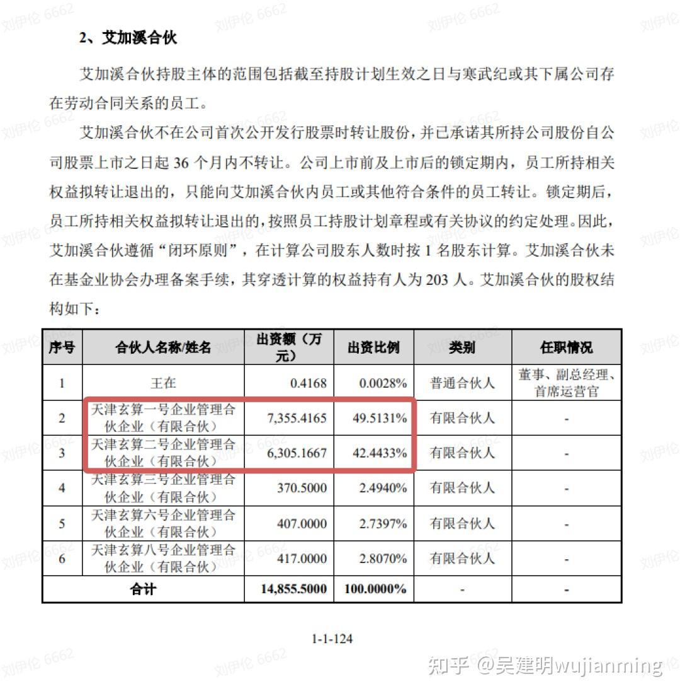
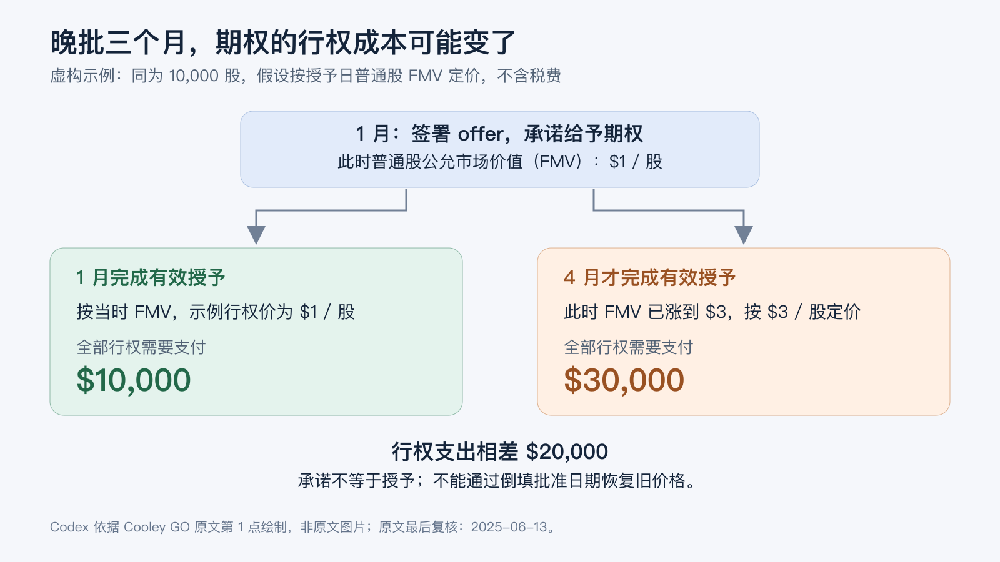
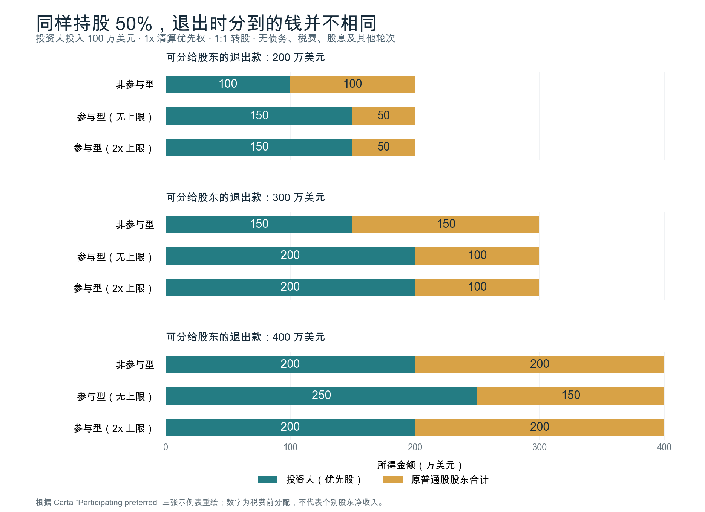
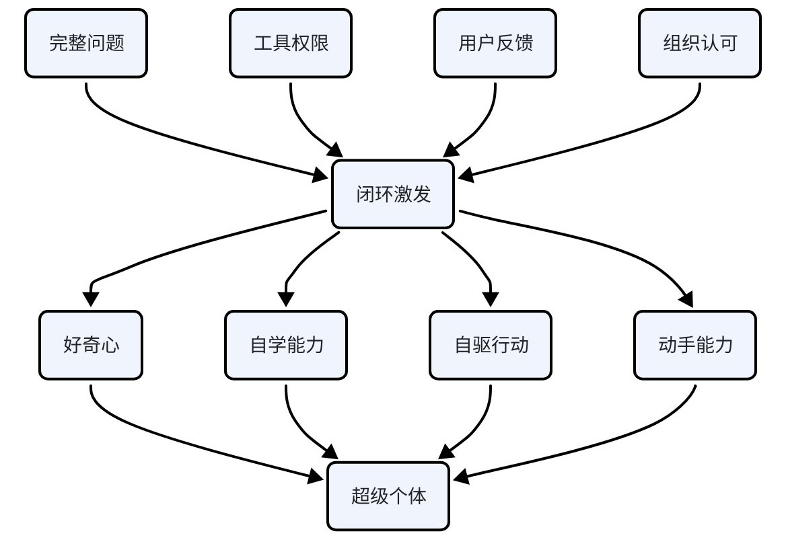

[toc]

## 非技术知识

* LT: Life Time 用户生命周期 

* LTV: Life Time Value 用户生命价值

* ARPU: Average Revenue Per User 用户日均收入（每个用户每个活跃日可以提供的平均收入）

* LT * ARPU = LTV

* **营销的核心目标：CAC（获客成本）与 CLV（客户终身价值）**
  * CAC（Customer Acquisition Cost）= 获取新客户的总成本（市场 + 销售 + 渠道 + 优惠）÷ 新增客户数；
  * CLV（Customer Lifetime Value）= 一个客户在整个生命周期内为公司贡献的**利润**；简化口径 LTV ≈ LT × ARPU × 毛利率，完整口径要含留存、复购与折现；
  * 核心指标是比值 **LTV / CAC**：一般 >3 视为健康，<1 说明获客即亏钱；
  * 营销目标不是单点「最小 CAC」或「最大 CLV」，而是「健康比值 + 可规模化」——CAC 过低可能只是渠道没放量，增长没跑起来；
  * 配套指标：回收期 Payback（CAC ÷ 月毛利）、流失 Churn、净收入留存 NRR；
  * 与增长模型关联：PLG 的 CAC 靠产品自传播 + 低销售成本，SLG 的 CAC 靠销售团队 + 高客单，两者 CAC 结构完全不同（对照见 [云原生-ToB.md](./云原生-ToB.md#plg-与-slg增长模型对照)）。

* DAU = MAU * (DAU/MAU) (用户活跃度)

* QoS: Quality of Service

* 市值 = GMV * take_rate

* 数据驱动 ～ 新产品

* 信仰判断 ～ 成熟产品，增长空间有限

### 持续关注

> 近期： Lilian Wang > 硬核课堂 > GPU-Mode Channel > Ez Encoder > 张小珺

#### MLSys

* **InfiniTensor 大咖课、论文分享** https://space.bilibili.com/3546813525134159/upload/video    【看到最新】

* **GPU-Mode Channel**
* **王焱**（小红书博主）
* PyTorch
  * Channel https://www.youtube.com/@PyTorch/videos
  * Dev Discuss https://dev-discuss.pytorch.org/
  * EzYang Blog https://blog.ezyang.com/
* **硬核课堂**：https://www.bilibili.com/video/BV11m421M7N4
* zartbot 公众号
* Nvidia GTC: https://www.nvidia.com/gtc/
* 学术：
  * Song Han：量化/推理，AWQ/SVDQuant/EfficientViT/QServe/DuoAttention/StreamingLLM，MIT AP
  * Beidi Chen：量化/推理，ShadowKV/MagicPig/H2O/Deja Vu/OSD，CMU AP
  * Tri Dao：算子/算法，Flash Attention-1, 2, 3 & Mamba，Princeton AP
  * Yinmin Zhong：DistTrain/DistServe/LoongServe/AlpaServe，PKU phd
* MLSys Intro：https://www.zhihu.com/question/537007032/answer/3234159319
* 大猿搬砖日记 公众号
* 休闲科普：
  * 月球大叔

#### ML 算法

* **Lilian Wang:** https://lilianweng.github.io/
* **ez-encoder**
  * Ilya Top-30 解读

* **青稞社区**：https://space.bilibili.com/3546619509213708
  
* 苏剑林：https://www.kexue.fm/
* FAI Seminar：https://www.fai-seminar.ac.cn/
* YannicKilcher: https://www.youtube.com/@YannicKilcher
* 李沐：https://github.com/mli/paper-reading

#### ToB、云原生

* **火山引擎 V-Moment**：https://www.volcengine.com/docs/6703/1158657
* gaocegege

#### 职场非技术

* **马可奥勒留**：https://juejin.cn/user/1955412097653256/posts
* 奔跑的北极企鹅（vx公众号）：前国际电商leader
* 中年管理者日常（xhs）

#### 商业、AI 产品

* **[张小珺Jùn｜商业访谈录](https://www.youtube.com/playlist?list=PLwAchVoh-4zNSI5UlKEkKCL5r_jJyrFeO)**
* 周喆吾（vx公众号）

#### AI 编程 & 效率工具

* 字节（知乎）：https://www.zhihu.com/people/dd44fd707897acda43e0a65ba07b3199 - AI coding 文章质量较高

##### Mac 防睡眠工具

* **Amphetamine**：Mac App Store 免费下载，防睡眠神器，完全免费无内购、无广告，基于系统原生API开发，支持无限期/固定时长/截止时间、智能触发规则、合盖不休眠
* **KeepingYouAwake**：GitHub 开源免费，基于系统原生 caffeinate 命令开发，极致轻量（<5MB），菜单栏一键操作，开源代码可审计
* **Lungo**：Mac App Store，极致贴合苹果原生设计风格，界面极简美观，支持快捷指令/Siri 语音控制
* **Caffeinated**：Mac App Store，在经典 Caffeine 基础上升级而来，支持高度自定义的智能规则，适配最新 macOS 系统
* **系统原生方案**：终端 `caffeinate` 命令（caffeinate 无限期、caffeinate -t 3600 1小时、caffeinate -i 仅防系统休眠、caffeinate -u -t 300 强制屏幕常亮5分钟）；系统设置-电池/节能-关闭显示器「永不」

#### 搜广推算法

* 九老师
* 稳扎稳打学AI (vx公众号)

* 石塔西：https://zhuanlan.zhihu.com/learningdeep
* 王喆：https://www.zhihu.com/people/wang-zhe-58/posts

#### 人生哲理、学习方法

* 李新野： https://sinyalee.com/blog/

* 阿卡迪萨：https://space.bilibili.com/308598581

#### 情感

* 知春路Chris（xhs）

#### 美食品鉴

* **赵胤胤（douyin）**
* 安妮大厨（bilibili）
* 名厨app

#### 时尚

* tigerhood https://www.thetigerhood.com/

#### 健康

* Luxenius：https://www.zhihu.com/people/luxenius/posts

#### 文史政经哲

* 学院派Academia（douyin）
* [Most influential books under 100 pages](https://www.goodreads.com/list/show/29560.Most_influential_books_under_100_pages)
* 冯唐讲xxx

#### dnd

* **dual双持（bilibili）**
* 元游pai（bilibili）
* 斯芬斯的启示（bilibili）

#### 杂类

* 科技团长
  * 科技修仙的理论体系

### Daily

* 时区查询：https://www.worldtimebuddy.com/

* Autman工作思路

  * https://mp.weixin.qq.com/s/WW2OZx5MpuPWiq8DLpo6xQ

  * 提升生产力，复合增长

  * a. “确保完成重要的事情”；

    b. “不要把时间浪费在愚蠢的事情上”；

    c. “列很多清单”。

  * 在您的日程表中留出足够的空间以允许偶遇和接触新的人和想法是至关重要的

    * **拥有一个开放的网络是有价值的。** 虽然我参加的随机会议中可能有 90% 是浪费时间，但另外 10% 确实弥补了它。

    * 大多数会议最好安排在 15-20 分钟或 2 小时内

  * 生活质量

    * 很棒的床垫
    * 睡眠追踪器
    * 锻炼
    * 每天约 200 毫克的咖啡因总量，醒后一大杯浓缩咖啡

### Efficiency

#### Agent

* Teamo https://teamoteam.com/index
  * 决策咨询、营销计划、产品研究 
* CLIProxyAPI（CPA）https://github.com/router-for-me/CLIProxyAPI
  * 本地代理，把 ChatGPT/Codex、Claude、Gemini、Grok 等 CLI 订阅账号通过 OAuth 包装成 OpenAI/Claude 兼容 API；支持多账号 round-robin 与自动故障转移，`codex-login` 登录后可把多个 Codex 订阅账号当一个池子轮询。
  * 注意：Codex 订阅 OAuth 与 Codex API Key 是两条不同认证/计费路径，不能混进同一轮转池；且“订阅转 API”类工具绕过官方 ToS，勿用于生产环境。
* AgentSwap https://github.com/bojieli/agentswap
  * 本地代理 + 凭据池：Claude Code / Codex 订阅、API Key、同协议第三方 provider 可放同一池（订阅优先）；短限流等同一账号、窗口耗尽换账号、全部耗尽 park 到 reset 后由 `agentswap run` 原生 resume。
  * 会话搬迁：`teleport / handoff` 把 Claude Code / Codex / OpenCode / Kimi 会话互译为原生格式，保留消息、工具调用、plan，而不是 summary prompt；不搬凭据与运行态，source 只读、validation fail closed。
  * 与 CPA 的区别：不做“订阅转 API”的协议翻译、不做并行乘数；因为持有 OAuth 凭据，默认 loopback + Host check + 零第三方依赖。ToS 与账号封禁风险仍要自行判断。

#### 画图画表

* Excalidraw： 系统设计
* keynote和figjam生成图表
* mural 手画图
  * https://app.mural.co/t/hrt5383/m/hrt5383/1747516489611/f78cd0fec24fa4b1920dcae7c812be227fd58423

* carbon-now-cli生成代码示例

#### ChatGPT

* **代码阅读技巧：LLM + Mermaid**
  * **核心思路**: 不直接读枯燥的代码，而是让 LLM (如 GPT-4, Claude 3.5 Sonnet) 阅读代码仓库，并要求其用 **Mermaid 语法** 生成时序图 (Sequence Diagram) 或类图 (Class Diagram)。
  * **优势**: 可视化调用链，快速理清模块交互，宏观微观兼备。
  * **Prompt 示例**: "分析这个项目仓库的整体结构... 请为我生成一份 Mermaid 格式的序列图（Sequence Diagram），展示核心业务流程。"

* 编程问题
  * this code is not working like i expect — how do i fix it?
  * just part of it — the error never surfaces. I think there is something wrong with the channel
* 通用问题
  * write a limerick about it
  * summarize the conversation so far
  * can you make it more formal?

* 衍生产品
  * 文献搜索arxiv Xplorer：https://arxivxplorer.com/
* tutorial
  * https://www.youtube.com/watch?v=sTeoEFzVNSc

#### Chrome

* 插件
  * SwitchyOmega：http代理

#### Knowledge Sources

* Feed Site
  * Reddit/Programming: https://www.reddit.com/r/programming/
  * Hacker News: https://news.ycombinator.com/
  * Two Minutes Papers: https://www.youtube.com/c/K%C3%A1rolyZsolnai/videos
  * The Morning Paper: https://blog.acolyer.org/
  * Best Paper Awards in Computer Science: https://jeffhuang.com/best_paper_awards/
  * [Google Research](https://research.google/pubs/) and [Arxiv](https://arxiv.org/list/cs/recent)
  * [Microsoft Research](https://www.microsoft.com/en-us/research/search/?from=http%3A%2F%2Fresearch.microsoft.com%2Fapps%2Fcatalog%2Fdefault.aspx%3Ft%3Dpublications) and [Facebook Research](https://research.fb.com/publications/)
  * MIT's Distributed Systems Reading Group: http://dsrg.pdos.csail.mit.edu/
  * Papers We Love: https://github.com/papers-we-love/papers-we-love

* Engineer Blogs

  * Facebook Engineering (Recommended): https://engineering.fb.com/category/core-data/
  * 左耳朵耗子 Blog: https://coolshell.cn/, [付费专栏](https://time.geekbang.org/column/intro/48)
  * Cloudflare Blog: https://blog.cloudflare.com/
  * Netflix Blog: https://netflixtechblog.com/
  * Uber Engineering: https://eng.uber.com/
  * AWS CTO - All Things Distributed: https://www.allthingsdistributed.com/
  * AWS Blog: https://aws.amazon.com/cn/blogs/aws/
  * Microsoft - Cloud Design Pattern: https://docs.microsoft.com/en-us/azure/architecture/patterns/
  * High Scalability: http://highscalability.com/
  * RedHat Blog: https://www.redhat.com/en/blog
  * Splunk Blog: https://www.splunk.com/en_us/blog
  * Data Bricks Blog: https://databricks.com/blog/category/engineering
  * Martin Fowler: https://martinfowler.com
  * Hacker Noon: https://hackernoon.com/
  * Brendan D. Gregg: http://www.brendangregg.com/
  * Instagram Engineering: https://engineering.fb.com/tag/instagram/

##### AI搜索 —— 学术向

* https://scimaster.bohrium.com/
* https://www.alphaxiv.org/

#### Others

* 日历ICS的概念
  * **定义**：ICS（iCalendar）是一种通用的日历数据交换格式，用于在不同的日历应用之间共享日历信息
  * **文件扩展名**：`.ics`
  * **核心特性**：
    - **跨平台兼容**：支持Google Calendar、Apple Calendar、Microsoft Outlook等主流日历应用
    - **事件信息**：包含事件标题、时间、地点、描述、提醒等完整信息
    - **重复规则**：支持重复事件（每天、每周、每月、每年等）
    - **时区支持**：自动处理时区转换
  * **常见用途**：
    - 共享会议邀请
    - 订阅公共日历（节假日、体育赛事等）
    - 导出/导入日历数据
    - AI助手自动创建日历事件

* 作图
  * https://chrome.google.com/webstore/detail/diagramsnet-desktop/pebppomjfocnoigkeepgbmcifnnlndla/related
  * https://www.processon.com/
  * Google drawing
  * https://www.websequencediagrams.com/

### Thinking，思维方法

#### Context, not control

管理 AI 的哲学理念。

* 核心思想：
  * 不要试图微观管理（micromanagement）AI 的每一步操作
  * 而是提供清晰的上下文、目标和约束条件
  * 让 AI 自主决定如何完成任务

* 实践要点：
  * 明确目标和验收标准
  * 提供必要的背景信息
  * 设定边界和限制条件
  * 信任 AI 的能力，给予足够自主权
  * 通过结果而非过程来评估

* 优势：
  * 发挥 AI 的创造力和问题解决能力
  * 提高工作效率
  * 减少沟通成本
  * 培养更好的合作关系

#### ROI
* 三个要素：
  * 计算主体（不是具象的客体，而是抽象的动作；问题颗粒度取决于想反馈的目标）
  * 计算媒介（关键变量）
  * 数学建模 
* 四个步骤：
  * 规划：业务洞察力，列举所有可能的成本和收益
  * 评估
  * 执行：变数->临时评估；评估要排除已经沉没的成本和收益
  * 复盘：反思结果和预判的差别；差别大 -> 调整主观预期、业务层面优化

* 持续策略收益评估：
  * 单次策略的重点是预评估，持续策略的重点是反馈机制
  * 考虑自主循环和时效性：动作饱和问题；切割收益和成本
  * 快速评估和优化机制设计
    * 媒介：投放->竞价, 红包策略->数值策略
    * 制定反馈机制
* 统计工具与模型
  * 数据调研和元假设：建模中内蕴的假设，来源于信念/历史经验。e.g. LSTM模型 => 数据集有时间结构或前后因果关系
  * 预估：
    * 数理统计：函数族拟合 => 模型容量不够；离散时间序列 (ARIMA、GARCH) => 参数矩阵奇异性、对outlier敏感
    * 统计学习：高维回归问题，GBDT->XGBT, HMM (自带时间结构、算力消耗大)
    * 深度学习：回归问题- MLP，时序性质- RNN。可解释性不强（核心思路是深度学习解决部分问题，再聚合结果）；启动成本问题
  * 增量计算：
    * A/B实验：开挂，不要过于依赖导致丧失自己的因果推断能力
      * A/B开不出来的场景：《囧妈》、疫情影响
    * 备选方案A/A：选取常态稳定的指标，比较粗糙
    * 伪A/B：挑选“相似人群”，难以评估，有一种方式是对行为向量序列降维，评估人群相似性
* 建模中的经典trick
  * “经验困境”：贝叶斯方法
  * 如何应对变化的外部环境：平滑化方法
    * 平滑工具：filter、pooling、正则项惩罚参数移动、贝叶斯化限制参数移动
    * 修正：根据上级维度的情况
  * 主观性问题中的非直接收益
    * 向外释放的媒介值通过混沌系统还回来
    * 方法：主观判断/问卷调研
  * 链式偏差问题和蒙特卡洛方法
    * 不要看点值，要看分布
* 提升因果逻辑分析能力
  * 解耦和节点化
  * “因果网络”
  * 敏感性分析：设置硬边界、设置先验概率、节点合理性、映射方式合理性
  * 非平衡代价问题

#### Problem Solving

> 真正的价值是问题分析后的 So-What

* 四个步骤

  * 定义关键问题
    * 了解 context -> 准确识别“真正的需要解决的问题” -> 重新定义问题
    * Issue Tree 分解大问题，分解依赖 Hypothesis
    * 分解问题树时遵循 MECE 原则（Mutually Exclusive Collectively Exhaustive）

  * 给出可执行、具体、有认知深度的建议

  * 进行快速迭代
    * 计划不是静态脚本，而是随战场变化持续修正的作战假设。
      * “任何计划，断没有一成不变，毫不修改的道理。”越精细的计划，越容易在真实环境中暴露需要修正的地方。
      * 高水平执行者的能力不在于一开始算尽所有变化，而在于能根据局势快速改计划，同时保留可投入的新资源。
      * 战略预备队的意义：不要把资源在第一版计划里全部打光，要为未知变化保留调整余量。
      * 迁移到项目管理：计划需要同时设计 `主攻方向`、`观测点`、`修改触发条件`、`预备资源`，否则“详细计划”会变成僵硬承诺。
      * 来源：用户摘录，原始出处待补。

  * 清晰有力地沟通传递建议
    * 回顾听众真正关心的问题
      * 把答案结构化
      * 为听众量身定制
      * 检查是否解决了听众的问题

#### 思维模型

* 人脑模型：

  * 内中外廷的人脑模型
    * [生理性喜欢是真的喜欢吗？by 阿卡迪萨_哔哩哔哩_bilibili](https://b23.tv/mcakX9Z)
    * 汲黯怼汉武帝内多欲而外施仁义的例子
    * 人既是雕刻家又是大理石，统一自己的三廷

  * 抑制和创造系统
    * 
    *  [抑制系统过强的人是什么一种体验？希望能给我相近的人一些启发_哔哩哔哩_bilibili](https://b23.tv/YpzvqSg)
    * A类道理和B类道理
    * 抑制系统强会导致上手速度慢，但不容易受垃圾数据集污染，且可能有顿悟现象
  * 理解本质上是一种渲染，先模糊再渲染成清晰
    * [准备给自己配副眼镜了，顺带讲讲理解是什么_哔哩哔哩_bilibili](https://b23.tv/O7RrzZC) 
  * 理解不断迭代，循环式上升
    *  [豁然开朗后又退步是非常正常的现象，不要怪自己没法坚持_哔哩哔哩_bilibili](https://b23.tv/oFBN5wU)
  * 注意力机制：抓重点、上下文越多不一定越好（对能力要求反而升高）
    *  [一觉醒来发现被博后导师关注了（顺带回一下原先一些弹幕）_哔哩哔哩_bilibili](https://b23.tv/o7P0Nms) 平衡学习与考试

* [大道理与小道理](https://www.bilibili.com/video/BV14NAUe1ED5)
  * 小道理讲不过大道理
  * 大道理：统合 秩序 平衡 毁灭 新生
  * 小道理：自由 平等 爱 有仇必报 有恩必报
  * 小道理具备对抗大道理的正当性，最终造成结果未必好，但需要存在，从而大道理的推行过程中需要兼顾一部分小道理
    * e.g. 王允、贾诩的例子

* 思维模型：

  * **繁简之辩：若不入繁，如何简出**
    * **误区**：许多人追求的“简单”其实是**幼稚（Naivety）**，是对系统复杂性的无知或逃避。
    * **正解**：真正的“简单”是**Simplicity**，是遍历了系统所有分支、理解了所有边界情况（Corner Cases）之后的**高度抽象**。
    * **路径**：
      * **入繁（Complexity）**：先做加法。沉浸到业务细节、代码实现的脏乱差中，穷尽所有变量。
      * **简出（Simplicity）**：再做减法。在理解全貌的基础上，通过建模、重构、抽象，找到那个“一以贯之”的道。
      * *没有“入繁”的“简”，是简陋；“入繁”后的“简”，是通透。*

  * 法律 & 程序（40%）：严谨、精确、无二义性，考虑很多案例，正反思考

  * 历史 & 统计（30%）：趋势、数据统计，用以分析问题

  * 经济 & 价值（30%）：实用性、价值判断，经济学原理是社会运作的原理

  * **帕金森琐碎法则（Parkinson's Law of Triviality，自行车棚效应 / bikeshed effect）**
    * **定义**：组织倾向于在琐碎、易懂的问题上投入不成比例的讨论时间；复杂难懂的问题反而被快速放行。
    * **出处**：C. Northcote Parkinson，1957《帕金森定律》——委员会批准核电站方案只花了几分钟，却为一个自行车棚刷什么颜色争论不休。
    * **机制**：讨论热度与理解门槛成反比——人人都能对自行车棚发表意见，所以争论最多；核电站只有专家懂，非专家放弃参与，于是草草通过（橡皮图章）。
    * **典型表现**：会议纠结命名/配色/格式/排期，真问题草草过会；代码评审纠结变量命名和代码风格，忽略架构与正确性；开源社区里的 bikeshed。
    * **应对**：
      * 先判断议题的**影响面与可逆性**：可逆的小事快速定，不可逆的大事才值得充分讨论；
      * 琐碎议题**设时间盒**或指派一人拍板，默认选项优先；
      * 把可重复的琐碎争论**规则化/自动化**（lint、format、模板、命名规范）；
      * 复杂议题提前给材料，让参与者在会前消化，而不是现场凭直觉发言；
      * 明确决策权与升级路径，避免“谁都能插嘴”。
    * **易混区分**：帕金森琐碎法则 ≠ 帕金森定律（工作会自动膨胀填满可用时间）——两者同出帕金森，但说的是两件事。
  * **工程启示**：代码评审里的 bikeshed 最常见——用工具消除风格争论，把评审火力留给设计、边界和正确性。

  * **SMART 目标（目标设定的五要素）**
    * **定义**：把目标写清楚的一套检查标准——Specific（具体）、Measurable（可衡量）、Achievable（可实现）、Relevant（相关）、Time-bound（有时限）。
    * **出处**：George T. Doran 1981 年在《Management Review》发表《There's a S.M.A.R.T. way to write management's goals and objectives》，是 Drucker「目标管理（MBO）」的落地工具；各版本首字母含义略有差异（A 也作 Attainable，R 也作 Realistic，T 也作 Time-based），核心一致。
    * **五要素拆解**：
      * S 具体：说清做什么、对谁、为什么，避免「提高质量」这类空话；
      * M 可衡量：有数字或明确的完成信号，能判断「做到了没」；
      * A 可实现：有挑战但够得着（金发姑娘区）——太容易没意义，太难打击士气；
      * R 相关：和更大的目标 / 团队方向对齐，否则白做；
      * T 有时限：给 deadline 或时间窗——没有时限的目标永远「下个月再说」。
    * **示例**：
      * 差：「提高代码质量」
      * SMART 版：「8 月底前把支付模块的单元测试覆盖率从 60% 提到 80%，且质量扫描无新增 blocker」
    * **坑与边界**：
      * 不要为了「全」把目标写成流水账——SMART 是检查清单，不是越写越长越好；
      * 探索性 / 创新性目标往往无法提前「可衡量」（你不知道会得到什么），过度 SMART 会杀死探索；此时用「过程目标 + 复盘」代替；
      * 目标 vs 指标：KPI 是度量衡；OKR 里 Objective 是方向、Key Results 才需要接近 SMART——把 O 也硬套 SMART 会变成指标游戏。
    * **与长程任务的关联**：给长程任务 / Agent 定义目标时同样适用——「完成标准（acceptance）」要可验证（evidence），否则系统无法判断何时算完成；SMART 的 M 和「有可验证的验收信号」是同一件事。

#### 技术的本质：技术的自我繁殖与 AI 发明家

> 来源：晚点AI、布莱恩·阿瑟《技术的本质》
> 整理时间：2026-02-16

##### 核心观点

随着大语言模型走向成熟，能够覆盖完整科研流程的科研 Agent 成为新趋势。这不仅包括针对物质科学的科研——支持从文献研究、提出假设、设计实验到验证假设的全流程自动化，还指向一个更特别的方向：**用 AI 提升 AI，让 AI 承担人类研究员的工作**。

这种 “左脚踩右脚” 的演进方式，契合了经济学家**布莱恩·阿瑟（W. Brian Arthur）**在《技术的本质》一书中的核心观点。阿瑟认为，**技术具有自我繁殖的特性**，由两股力量交织推动：

**供给端**：现有技术通过新组合产生新技术。旧技术基数越大，组合的可能性就越多；同时，观测技术（如显微镜、传感器）的发展加速了对新物理现象的捕获。

**需求端**：新技术的需求不仅来自人类，也来自技术本身。每种技术的出现都会伴随改进它、降低其成本或解决其衍生问题的需求。

##### AI 发明家的诞生

《技术的本质》一书写于 2009 年，当时作者说：技术的自我进化是通过 **“人类发明家”** 这一中介实现的。

而现在，我们可能正处于 **“AI 发明家”** 诞生的前夜。这将是一个信息广度、计算能力远超人类个体，且能不眠不休进行迭代的系统。

##### 关键问题

面对这种指数级的进化速度，一个问题是：**我们做好准备了吗？**

如果技术即将脱离人类中介自主进化，我们该如何提前设计与之共处的方式？

* [Tech-Centric is Just as Bad as Sales-Driven](https://itamargilad.com/product-led/)（原题 “Product-Led is Just as Bad as Sales-Driven”，作者改名以免与 PLG 混淆）：产品中心与销售中心同样自我中心，真正的平衡是市场中心；PLG / SLG 对照见 [云原生-ToB.md](./云原生-ToB.md#plg-与-slg增长模型对照)

#### 学习方法

* 快速变化工具的学习：用一个低风险真实任务形成“小实验 → 失败样本 / 用户反馈 → 补知识 → 再验证”的循环。[《致超级个体》](https://mp.weixin.qq.com/s/R04uChJ_mUOZz_XIUCoT6g)批评把分类、课程、完整体系和竞品分析都当成动手的前置条件；更合理的是让它们与实践交替。这个建议适用于探索新工具，不能外推成基础理论无用，或跳过必要的安全、数据权限与工程准备。

* 《[从一位imo金牌得主的在清华读了六年本科的经历讲述不同人学数学的困境](https://www.bilibili.com/video/BV1R4ZiYVEWZ)》
  * 从数学学习的角度讲述了怎么认知自我的局限和突破自我的瓶颈
  * 追求细节从头推到尾的影响
    * [从“必要之恶”的角度，允许自己接受道理的模糊性](https://www.bilibili.com/video/BV1HfZ4YhEF6)
  * 缺少taste怎么办
  * 一直学习和推导一个领域导致走神和劳累

#### 价值判断

* 反常性和通用性均是判断理论价值的标准
  * [大五比mbti信效度更高，就一定更科学吗？（其实内容和标题没有特别大关系）_哔哩哔哩_bilibili](https://b23.tv/YYjUxg8) 

* 公司分类

  * 人力成本高：重人效

  * 资产成本高：重业务系统化（ERP, Enterprise resource planning）

#### 价值观

* **统战价值：破坏力决定议价权**
  * **观点**：“一个人真正的价值，不在于能做多大好事，而在于能造成多大的破坏。”
  * **核心逻辑**：在博弈论与社会权力结构中，**议价权（Bargaining Power）** 往往不取决于你创造的增量（这是你的义务或被剥削的剩余价值），而取决于你撤出或反击时造成的**存量损失**。
    * 术语校准：这里描述的是对方因你退出而承担的损失，不能直接等同于 BATNA。BATNA 指某一方谈不成时的最佳替代方案；要分别评估双方还能做什么，见[谈判准备](#谈判准备batna底线与目标)。
    * *好人困境*：只做“好事”的人，容易被视为理所应当的“基础设施”，因为他们缺乏**不可替代性**和**威慑力**。
    * *坏人红利*：拥有破坏力的人，组织为了维持稳定，必须支付“赎金”或更高的溢价来安抚（Co-optation）。
  * **应用**：
    * **职场**：不要只做那个默默奉献的“老黄牛”（纯增量），要成为那个一旦离开、系统就会瘫痪的“关键节点”（存量威胁）。**Uniqueness is Power.**
    * **生活**：善良必须带有锋芒。没有破坏力的善良是软弱，拥有破坏力而选择善良才是美德。

* [人生的两类强化路线：](https://www.bilibili.com/video/BV1dRoWYkEW6)
  * 路线一：现实是手段，精神是目的
    * 认知：现实是脆弱的，载入历史才能长存
    * 什么叫男人至死是少年？ 成熟是手段，幼稚是目的
    * e.g. 罗马权力斗争，禁卫队长戴克里先当了皇帝，一系列改革，四帝共治制、定义皇帝任期20年，20年退位，随后四帝共治制，君士坦丁收拾烂摊子。成熟（争权夺利）是手段，幼稚（退位）是目的。
  * 路线二：精神是手段，现实是目的
    * 认知：现实高于一切
    * e.g. 武侠剧的男女主角，决一死战后什么情况下会互相放过

* 什么是轴 （[从“必要之恶”角度讲我为什么没有以前那样社恐和轴了](https://www.bilibili.com/video/BV1HfZ4YhEF6))
  * 历史人物：白公胜
  * 如何改变认知：内心立法是为了帮助自己分清主次，而不是轴着执行
  * e.g. [讲述我学生生涯的最大危机：小学一年级大危机（并讲述我的伟大的母亲）](https://www.bilibili.com/video/BV1LmRDYLE3L) —— 母亲良好的处理，帮助自己改掉一个字也15分钟的习惯

* 强者有大欲望之心

#### 技术深度的含义

> 来源：https://zhuanlan.zhihu.com/p/563100780
> 作者：九老师
> 整理时间：2026-02-18

##### 核心观点

**技术深度的一种含义：了解一项技术的场景和局限性，并真正做 Work 的能力。**

##### 详细解读

###### 1. 了解技术的场景

**什么是"场景"？**
- 技术是在什么背景下被发明的？
- 它解决了什么具体问题？
- 它是为谁设计的？
- 它在什么情况下使用效果最好？

**为什么重要？**
- 没有一项技术是万能的
- 每项技术都有它的适用范围
- 了解场景才能正确使用技术
- 避免"拿锤子看什么都是钉子"的误区

###### 2. 了解技术的局限性

**什么是"局限性"？**
- 技术在什么情况下不适用？
- 它有什么缺点？
- 它的性能瓶颈在哪里？
- 它会带来什么新问题？

**为什么重要？**
- 知道什么时候不能用这项技术
- 避免踩坑
- 能够提前规划替代方案
- 真正理解技术的边界

###### 3. 真正做 Work 的能力

**什么是"真正做 Work"？**
- 不是纸上谈兵
- 不是只懂理论
- 而是能够实际运用技术解决问题
- 能够把技术落地
- 能够让技术在真实场景中发挥作用

**为什么重要？**
- 技术的价值在于解决问题
- 只有真正做 Work 才能创造价值
- 理论和实践之间有很大差距
- 能够跨越这个差距才是真本事

##### 实践意义

###### 对个人成长

1. **避免技术崇拜**
   - 不要盲目追捧新技术
   - 不要觉得某项技术是"银弹"
   - 理性看待每项技术的优缺点

2. **培养深度思考**
   - 不仅仅是"怎么用"
   - 更要思考"什么时候用"
   - 以及"为什么用"

3. **提升解决问题的能力**
   - 能够根据场景选择合适的技术
   - 能够预见并避免技术的局限性
   - 能够真正把技术落地

###### 对团队协作

1. **技术选型更理性**
   - 不是谁声音大就用谁的
   - 而是基于场景和局限性来决策
   - 能够进行更深入的技术讨论

2. **减少踩坑**
   - 提前知道技术的局限性
   - 能够规划风险应对
   - 避免项目后期才发现问题

3. **提升交付质量**
   - 技术选择更合适
   - 能够真正解决问题
   - 项目成功率更高

##### 总结

**技术深度 ≠ 知道很多技术名词**
**技术深度 ≠ 会用很多技术**

**技术深度 =**
1. **了解技术的场景** —— 知道什么时候用
2. **了解技术的局限性** —— 知道什么时候不用
3. **真正做 Work 的能力** —— 能够把技术落地解决问题

这才是真正的技术深度。

### 心理学

* 先入为主很重要

#### 性格和心理

* [MBTI和战锤中的魔法八风](https://www.bilibili.com/video/BV1tTX8YNEAS)
  * 魔法八风是精灵提纯了混沌力量后分离出来的可控性比较高的八种

#### 人性思考

##### AI 与 人

* 人与 AI 的对比：
  * AI 理性、直接、没有情绪
  * 人有情感、直觉、创造力
  * 各自有独特的优势和局限性

* 人性的特点：
  * 有情绪和情感需求
  * 需要被理解和尊重
  * 有创造力和想象力
  * 会犯错误，但能从中学习
  * 有价值观和道德判断

* AI 时代的人的价值：
  * 提出正确的问题
  * 设定目标和方向
  * 进行价值判断
  * 提供情感支持
  * 培养人际关系

##### AI 中的人

&gt; 来源：晚点 AI

* **天价薪酬与失业**
  * 25 年 11 月硅谷一周内故事高度两极：天价 offer、融资、股价上涨 vs 清仓、做空亏损、裁员
  * Amazon 25 年 10 月裁员 1.4 万人，26 年 1 月再裁 1.6 万人
  * Layoffs.fyi 统计：Google、Meta、Microsoft 等 25 年共裁员约 6-8 万人，多为白领岗位
  * 中国人才市场：
    * 自 25 年 2 月开始，AI 岗位发布量环比增速多月保持两位数
    * 中层管理岗职位需求减少约 25%

* **使用 AI 的人**
  * 《晚点聊》第 109 期对卡兹克的访谈："干中学"，从真实需求出发，把重复三遍的事 AI 化

* **意义感**
  * 北大胡泳老师：AI 到来后，普通人会面临的挑战是人需要重新理解并感受到，人的意义并不在于工作
  * 短期：人会因资源增加或无法胜过 AI 而产生空虚；随后转向 "独特性竞争"
  * 长期：社会可能从 "教育-技能-工作-收入" 的循环，转向兴趣驱动的活动，最终出现职业多样性的爆发
  * 黄东旭：体验--来到这个世界，体验这段旅程，"大模型不能替你活过"

### 人文语料积累

* 关于目标和执行
  * 莫踬于山，而踬于垤

### Creativity

* Sam Altman Blog
  * Idea Generation 
    * it’s useful to get good at differentiating between real trends and fake trends. A key differentiator is if the new platform is used a lot by a small number of people, or used a little by a lot of people
    * founder/company fit is as important as product/market fit
    * a good test for an idea is if you can articulate why most people think it’s a bad idea, but you understand what makes it good.
  * The Strength of Being Misunderstood
    * It seems like there are two degrees of freedom: you can choose the people whose opinions you care about (and on what subjects), and you can choose the timescale you care about them on. Most people figure out the former [1] but the latter doesn’t seem to get much attention.
    * being right about an important but deeply non-consensus bet

### 开源

参见[《开源项目成功之道》](./Software-开源项目成功之道.md)：[许可证与知识产权](./Software-开源项目成功之道.md#3-开源许可证和知识产权管理)、[Log4j 与维护者投入](./Software-开源项目成功之道.md#log4j--log4shell维护成本与安全责任)、[社区与商业化](./Software-开源项目成功之道.md#10-开源商业化)、[合作讨论清单](./Software-开源项目成功之道.md#合作讨论清单)。

### 产品

#### 方法论

*   **马化腾的“10/100/1000法则”**
    *   **核心思想**: 这是马化腾提出的一个确保产品团队始终贴近用户的“笨”办法，强调从用户中来，到用户中去。
    *   **具体内容**: 要求产品经理**每个月**必须完成：
        *   **10**: 进行10个用户调查（深度访谈）。
        *   **100**: 浏览100个用户的博客/社交媒体（了解真实场景）。
        *   **1000**: 收集并分析1000个用户体验反馈（量化问题）。
    *   **本质**: 通过定量和定性的方式，建立一个持续、多维度接收用户反馈的机制，避免闭门造车，确保产品迭代始终围绕“用户价值”这一核心。

* 技术产品转变为用户产品，再叠加客户产品和商业产品（小鹏新的产品观）
  * 什么是客户导向？并不是简单的技术强，而是技术带来了好的用户体验，让用户感知到。自动驾驶很难是一个强力的客户产品，
    * 但内空间做得有趣、差异化，这是客户产品
    * 商业产品则是价格有竞争力、企业有利润。
  * **为什么不亲自带产品？**：CEO 亲自带产品会有很多问题，汽车公司经常把 CEO 的话当成 “圣旨”，而做好产品需要自我博弈和团队力量，因为链条太长了，一旦你错了，就全错了。
* 解决用户的核心痛点
  * 美团从“千团大战”中获胜的一个关键转折点是，它把所有电影院的信息通过各个影院的API集成，解决了用户需要去各个地方搜索、比价、甚至线下确认票务信息的痛点。这体现了生产力软件通过解决核心痛点实现用户自传播的逻辑。

#### 指标

* 北极星指标
* 护栏指标

#### Scrum敏捷开发

* ICE BOX
* Sprint：一个周期
* 和瀑布式开发的关键差异：Scrum 用短周期反馈管理不确定性；瀑布用阶段门管理承诺。详见 [Software Engineering - 瀑布式开发](./Software-Engineering.md#开发流程瀑布式开发)。

### 运营

* [关于UGC、PGC、OGC三者详细区别](https://zhuanlan.zhihu.com/p/35596590)
* MCN（Multi-Channel Network），俗称网红经纪人，即多频道网络，一种多频道网络的产品形态，是一种新的网红经济运作模式。这种模式将不同类型和内容的PGC（专业生产内容）联合起来，在资本的有力支持下，保障内容的持续输出，从而最终实现商业的稳定变现。

* 自媒体运营的一些逻辑
  * 找到自己的变现逻辑：引流 / 广告
  * 有自己的核心优势、独特性
* 做引流
  * 找到变现群体，要铁粉不要泛粉
  * 每条笔记的动机：
    * 陌生人/泛粉 --> 铁粉：完整的垂直内容矩阵，从背景到方法论到细节到案例
    * 加强铁粉粘性：更多样性的内容

#### 发布复盘样本：TypeSafe AI（Jev）在 X 上 34.9M 浏览是怎么来的

> 来源：[Doomers 的 TypeSafe AI launch 追踪页](https://doomers.ai/launches/typesafe-ai)（发布方为 Doomers，engagement read 于 2026-09-18）。本节只记**发布与分发**这一面，System One / RLCD 等技术侧内容另见材料档案。整理时间：2026-09-19。

**背景**：TypeSafe AI（旧金山）2026-09-15 结束两年 stealth，发布 Jev——一个不生成文本、只返回类型化决策与校准概率的「System One」模型。发布从联合创始人 Diogo Almeida（@CompleteSkeptic，113K 粉丝）**个人账号**发出，而非公司账号；开场第一句是可一步核验的资历（自述在 OpenAI 共同发明 RLHF / ChatGPT），随后才是公司要回答的问题、两年 stealth、产品与三条性能/成本声明。

**发布数据**（Doomers 自有追踪口径，读取于 2026-09-18）：34.9M 浏览、70K 赞、7K 转帖、4K 回复、6K 引用、56K 收藏；在其追踪的 **641 场发布中排第 4**。同类对比：product news 类中位 204K 浏览（本场 171.3×，该类排名 2）、粉丝 10 万以上账号中位 716K（48.7×，该类排名 4）、全库中位 258K（135.1×）。收藏率 16.1 saves / 10K views，为中位率的 1.3×。

**它给的发布判断（页面自述，可迁移）**：

* **读比值，不读总量**：页面自己写了 "Read the ratios rather than the totals"，并承认成文时帖子只有几小时。
* **第一句不要要求读者关心一个没听过的公司**：改为让读者判断「那个做出了你每天在用的东西的人，是不是有道理」——即用可核验的资历作开场，而不是用公司叙事。
* **区分「被推」与「被背书」**：多数同量级发布只由算法推送、几乎没有背书；这一条同时有高收藏与高转帖。作者的判断是：有深思熟虑的购买决策时，「被推送 + 被背书」才是转化为注册的那一项。
* **长视频不吃亏**：这条发布视频接近 3 分钟；在他们追踪的发布里，**2 分钟以上的视频中位数是 30 秒以内的两倍**。理由是展示完整工作流的演示更留得住人，而排序按观看时长。
* **种子投放按「受众与买方重叠」挑账号，而不是按粉丝量**：该发布在首小时投放给 80–100 个特定账号（工程师、创始人、建造者、创作者），之后的扩散是自然的。

**边界（这一页的可用性完全取决于这一点）**：Doomers 既是这次发布的执行方，又是复盘作者，页面挂着他们的发布服务——**利益相关**；所有指标来自其自有追踪口径（"the 641 launches we track"），未独立核验，且这类排行榜天然有选择性偏差（只统计他们追踪到的发布）。"135x the median" 之类的倍数只在这套口径内成立。Jev 自身的技术宣称（20–200× 更快 / 40–400× 更低成本）是厂商口径，不在本页可验证范围内，引用时应使用区间加「分类任务」限定。

### ToB & ML ToB

见【云原生】笔记

#### 数据库DB

* 商业模式：
  * Snowflake:易用性(屏蔽技术实现细节), data for ai , 
  * Databricks:生态, ai for data ,靠前期咨询consulting获客,tob服务进入整个企业业务链条,用数据驱动模型,联合建模等模式,按照业务单元售卖(含资源),比较重. 
  * coreweave模式

### 创业 & 企业

合作安排分四层看：[合伙人选择与协作约定](#合伙人选择与协作约定)明确动机、投入和退出；[股票与期权的权利、成本](#股权激励股票与期权的权利成本和税务时点)及[期权授予与税务](#股权激励美国期权的授予与-iso)从数量、股本口径、行权成本和归属条件检查经济权益怎样落实；[清算优先权与退出分配](#清算优先权退出时如何分配股权收益)判断股权最终能分到多少钱；[创始人控制权](#创始人控制权设计anthropic-的-ipo-治理方案)区分经济持股、投票权与董事会权力。

贯穿这四层的还有[股权承诺、持股平台与退出约束](#股权承诺持股平台与退出约束)：谁承担兑现义务、谁能修改规则、发生分歧后权益如何处理，必须沿合同和持股链路核对。

[招聘](#hiring-招聘)把这些条件带入双向选择：先了解候选人的诉求，再用面试体验、具体工作与透明 offer 帮助其决策；接受率要从首次接触开始改善。

#### 创业

> https://www.zhihu.com/question/363202942/answer/1917448251428284370

* Intro

  * 创始人成长是需要经历,理想-绝望-重塑-闭环-盲目自信-跌落-专注-信仰，但是媒体和抱团FOMO投资人最爱干的就是,直接捧杀刚出大厂或刚展露风头小天才，给他们赋予一堆理想,标签,使命,让他们误以为,只有带着这个标签符号的人设，讲着空洞独特的故事,不可证伪的模式,才能拿到资源和结果

* 优势

  * **创新者的困境：**谷歌Bard（以前被称为Gemini）的现场演示中就遇到了问题。很多人可能不记得了，那次现场演示失败了，导致谷歌股价一天内下跌了5%到7%。所以，我们利用的就是这种不对称性，这种创新者的困境：我们能正确回答80%的查询，就能给像你，吉姆这样的人留下深刻印象；但谷歌回答错误20%的查询，就会让人觉得谷歌正在衰落，股价下跌，华尔街恐慌，谷歌不再被视为人工智能领域的领导者。这就是像我们这样的新进入者获得机会的地方。

* 创业的挑战
  * 痛苦的时刻很多，最痛苦的还是**转型**（pivot）的时候。尤其是当上一个产品已经有用户和客户，且在发展中时，你客观分析后发现这个方向很难继续，你不得不选择终止这个产品并转向新的方向。
    * 这不仅需要缓解团队内的不确定情绪，还要向投资人解释转型的原因。
    * 自己也要接受生活中的不确定性。这种巨大的不确定性会让你怀疑新方向的可行性。
  * 有很多事务性的工作，比如每月结算、发工资、处理银行关系和融资等

  * Companies operate in an eternal [iterative elimination tournament](https://lethain.com/iterative-elimination-tournaments/), balancing future success against surviving until that future becomes the present. If you’re about to lose one of those rounds, then always focus there.
    * Running out of money, [like my experience at Digg](https://lethain.com/digg-v4/), can be the most obvious issue, but not every existential issue is financial
    * [Twitter’s fail whale stability challenges](https://www.theatlantic.com/technology/archive/2015/01/the-story-behind-twitters-fail-whale/384313/)
    * adapting to the shifts caused by the Covid-19 pandemic.

* 快速变革的领域，创业或者突破，需要努力和crazy ideas
  * crazy ideas：微软把ai外包给openai

* 事物的运作逻辑，先work，再clean the mess
  * prototype

* [十二年前的雷军讲创业](https://v.douyin.com/iSeJ3p6w/)
  * 市场规模越大越好：毒霸大于词霸
  * 借钱的方法论：1.找熟人借钱；2.利用朋友的辐射作用；
  * 初创公司什么时候去找钱： 花一半钱的时候
  * 寻求投资的步骤：1.人脉引荐；2.创业团队介绍；3.前景描绘
  * 股权分配是创业过程中的重要资源，用来和重要的人share

* 何小鹏
  * **回望 20 余年的创业生涯，从 PC 时代到移动互联网再到现在，有什么总结和认知可以和我们分享吗？**
  * 昨天好像有人问过我这个问题。1）我读大学的时候觉得 TCL、创维、康佳这三家已经把创业机会都拿完了，我们这种刚读大二的人怎么办？但你要永远相信，未来还有更大的机会，这很重要； 2）我告诉自己，因为我不聪明，所以我没有速成之道。

* 字节系的创业者来看,可能存在的问题,

  * 重数据驱动,轻用户洞察,这个在创业早期是致命的,因为创业团队不具备足够的数据,以及UG
    和ABtest的系统,需要靠古典产品经理的用户洞察,杀手直觉,敢于决策,敢于承担责任。
    如果一个字节系创业者,上来就给我一堆文档,而不是拿着demno给用户感受,大概率踩坑很大。
  * 精英主义,把整合资源,当作理所应当,不愿意亲手干活,习惯了输出文档,showcase,其他供
    应商配合他,但是这个闭环是不完整的,也没有手感。
  * 思维定势,无论做什么,都绕不开,创作工具,内容生态,推荐,广告,很难从另一个行业的认
    知视角考虑问题,但是商业的世界是复杂的,如果你还停留在字节的思维,你创业如何能够打败字
    节呢。

##### 合伙人选择与协作约定

> 来源：[YC：10 Questions to Discuss with a Potential Co-founder](https://www.ycombinator.com/blog/10-questions-to-discuss-with-a-potential-co-founder)（2023-04-27）。

合伙前要对齐动机、投入、权责和退出安排。YC 根据创始团队的匹配经验与常见分手原因整理这份清单，目的是提前发现强分歧；尚未想清的问题可以保留待定。适用时机是已经相互了解、有共同想做的方向，准备承诺合作时：各自独立写答案，再交换讨论。问卷不能替代线下相处与真实共事，是否合适通常需要数月才能看清。

| 问题 | 要谈具体的内容 |
| --- | --- |
| 1. 为什么创业？ | 各自的财务目标与非财务目标是什么？ |
| 2. 怎样分工？ | 角色、头衔、谁做 CEO 及其职责；至少明确前 6–12 个月各自负责什么，后续可以调整。 |
| 3. 股权怎么分？ | 尽早谈清分配，避免把分歧留到投入加深之后。 |
| 4. 在哪里工作？ | 公司设在哪里、各自住哪里，线下共事还是远程？ |
| 5. 做什么，能否转向？ | 当前选哪个想法；失败后是否愿意 pivot，是否只接受特定领域？ |
| 6. 何时全职投入？ | 离职或结束学业投入的触发条件，例如融资达到某金额、获得付费客户验证、试合作一段时间后仍愿意继续。 |
| 7. 个人能承担多久？ | 能否靠储蓄无薪工作、持续多久、何时需要多少薪资；是否有人向公司出资？ |
| 8. 工作节奏怎样？ | 每周工作几天、每天多久、能维持多长时间；哪些工作外的事情必须留出时间？ |
| 9. 想建立怎样的团队？ | 线下或远程、文化价值观、招聘与管理方式；暂时没有强偏好也可以。 |
| 10. 分歧和退出怎么办？ | 重大决定无法一致时如何处理；不想继续合作时如何安排？ |

进一步了解彼此，可以围绕四组问题展开：

- 经历与价值观：人生经历、自豪的成就、过去工作／创业／合伙的教训，以及欣赏的公司、创始人或产品。
- 工作互补：朋友或同事眼中的优缺点，乐于做与回避的工作，最适合的工作环境，以及希望怎样收到反馈。
- 关系与压力：对合作最期待、最担忧什么；压力下倾向倾诉还是回避；是否正面临家庭、健康、签证等现实压力。
- 生活与长期目标：兴趣爱好、整体人生规划，以及这次创业在其中的位置。

把沟通接到实际行动：

- 决定合作前：见面并一起做试验项目；双方约定时机、交换推荐人，向过去共事者了解合作体验与建议；有配偶或稳定伴侣时，让伴侣也认识潜在合伙人。
- 决定合作后：建立任务优先级与工作选择机制；固定做一对一的 Founder sync（通常每周一次），专门讨论合作关系与共事感受。

##### 股权承诺、持股平台与退出约束

> 案例来源：[梁军首次发声：公开与寒武纪的纠纷细节，再创业要做颠覆性产品](https://zhuanlan.zhihu.com/p/1939231664170579270)（知乎转载，2025-08-14，正文注明为雷峰网访谈；所链[微信原文](https://mp.weixin.qq.com/s/QBPf_7bpO2sSHiKWM4ggmQ)于 2026-10-01 读取时不可查看）。下述纠纷经过是梁军在访谈中的陈述，不等于法院认定；未核验完整协议、对方答辩或后续判决，不判断胜负。

**股权写进 offer 是起点，能否兑现还取决于授予文件、持股层级、服务关系和退出条款。**梁军称其入职意向书将股权列在薪酬项下，并有股东会授予决议；发生管理分歧后，持股平台协议被修改，随后相关主体要求按出资额转让份额并起诉。他又提起确认劳动关系及股权激励损失赔偿诉讼。材料反映的是几条法律关系交织：雇佣主体、承诺授股者、持股平台与受让／回购主体未必相同。

| 核对层 | 需要明确的内容 |
| --- | --- |
| 权益是什么 | 直接持有公司股份、期权，还是合伙企业份额；平台份额怎样穿透到公司股数和经济收益，表决权由谁行使。 |
| 承诺怎样落地 | offer、劳动／顾问合同、股东会／董事会决议、授予协议、合伙协议是否衔接；承诺者是否有权授予，谁负兑现义务。 |
| 规则怎样变化 | 谁能修改激励计划或合伙协议，表决门槛、通知及同意程序是什么，对既有权益是否适用，保留各版本与签署记录。 |
| 离职怎样处理 | 主动辞职、公司解雇、无过错退出是否区分；回购是否触发、覆盖已归属还是未归属权益、价格与付款期限如何确定。 |
| 能否出售 | 归属、上市锁定期届满、平台内部转让限制是不同条件；股票解禁不代表间接持有人可以自由出售平台份额。 |
| 争议怎样解决 | 哪个主体因哪份合同承担责任，劳动关系证据与股权证据分别是什么，争议程序和管辖如何安排。 |

图为转载文章所附招股书节选，未独立核验完整招股书。截图可见平台对锁定期内转让对象的限制，以及锁定期后仍按员工持股计划和相关协议处理的表述；它说明需要穿透到平台规则，不能单凭这张图判断梁军自身所持平台的适用条款或纠纷结论。不同持股平台不可混同。

治理上的延伸判断：研发、产品、售前售后和销售共同承担商业结果时，应明确最终决策权、跨团队协调机制及冲突升级路径。技术负责人为交付补位，可能同时扩大事实权力；技术贡献、管理授权和经济权益要分别落实，不能依赖“不可替代”来保护权利。将股权用于吸引人才还是持有待增值，也应区分公司的组织建设收益与个人资产收益。

这与下文美国股权激励共享“承诺到兑现要有完整链路”的检查思路，但中国持股平台纠纷不能直接套用 ISO、83(b) 或美国 reverse vesting 的法律规则。

##### 股权激励：股票与期权的权利、成本和税务时点

> 来源：Matthew Bartus / Cooley GO，[Establishing the Ownership Culture: Stock vs Options](https://www.cooleygo.com/establishing-ownership-culture-stock-vs-options/)（页面最后复核 2022-01-23；原文读取 2026-09-30，笔记整理 2026-10-01）；83(b) 补充核对：[26 U.S.C. §83(a)–(b)](https://www.law.cornell.edu/uscode/text/26/83)。Cooley 原文讨论美国 C-corporation 与美国联邦税法，不覆盖其他主体、州税或跨境税务；这里的 stock 是已发行股票，不将 RSU 等其他激励工具一并套入。

**股票是已经取得的股东权益；期权是按约定价格购买股票的合同权利。**“给 10,000 股”与“给对应 10,000 股的期权”不能只按数量比较，至少要拆开权利、购入成本、税务时点和退出条件。

| 维度 | 股票（stock，通常为普通股） | 期权（option） |
| --- | --- | --- |
| 当前身份 | 股票发行给接收者后，接收者成为股东；可能仍持有未归属股票 | 尚未行权时只持有买股权利，不因持有期权成为股东 |
| 表决权 | 是否有投票权取决于股票类别及相关安排 | 未行权期权本身不赋予股东投票权 |
| 取得成本 | 可以免费授予，也可以要求购买；免费授股仍可能产生税负 | 行权通常须支付约定行权价，另行考虑税负 |
| 归属机制 | 常见 reverse vesting：先取得股票，公司对未归属部分保留回购权，随归属逐步解除 | 通常先归属，再允许行权；归属完成仍不等于已买到股票 |
| 税务时点 | 取决于股票是否受实质没收风险限制、可转让性以及是否作出 83(b) 选择 | 原文在行权价至少为授予日 FMV 的常见设置下，授予时通常不纳税；行权或出售时按期权类别等规则判断 |
| 变现 | 成为股东不等于股票能立即出售 | 归属、行权与变现是不同事件；还需检查到期及离职后行权期限 |

**原文的 10,000 股例子，比较的是“应税收入”和“行权支出”，不是税额。**普通股每股 FMV 为 1 美元：免费取得 10,000 股，按文中已作出 83(b) 选择的假设，在股票转让年度计入 10,000 美元应税收入；取得 10,000 份、每份行权价 1 美元的期权，按原文假设授予时不纳税，但全部行权需要支付 10,000 美元。若普通期权仅归属 50%，通常只能支付 5,000 美元取得已归属的 5,000 股。

为了直观比较经济权益，另设简化情景：两者均已全部归属，免费股票与期权最终对应的普通股每股实际可分配 5 美元，期权仍有效且能行权，忽略税费。股票对应 50,000 美元；期权扣除 10,000 美元行权支出后为 40,000 美元。此处的每股分配额应经过[清算优先权与退出分配](#清算优先权退出时如何分配股权收益)计算，不能直接拿公司估值或最近一轮优先股价格代替。这个例子比较权益结构，不代表两种工具的完整公允价值。

83(b) 是受限制财产的**纳税时点选择**，不能简化为“所有股票都在授予时交税”或“提前行权可以免税”：

- §83(a) 的一般规则是，在权益首次可转让或不再受实质没收风险约束时（取较早者），将当时 FMV 超过支付价款的部分计入收入；普通服务归属安排中，常体现为归属时确认。
- §83(b) 允许选择在财产转让年度按转让时的 FMV 减支付价款确认收入；法定选择期限为**财产转让后 30 天内**。这里的时间起点不是尚未行权的期权授予日。
- 在股价较低时选择提前确认，可能减少未来按补偿收入确认的金额，但并非免除以后出售的税负；若股票后来被没收，§83(b) 不允许就此前已计入收入的部分因该没收扣除。选择能否撤销也受限制，不能只看潜在税收优势。

**提前行权将两种归属机制接起来。**期权计划允许 early exercise 时，可在归属前买到股票；此时取得的是仍受 reverse vesting 约束的未归属股票。对于这类股票，公司终止服务关系后可能需要按协议主动、及时行使回购权，未归属股票并不必然自动消失。是否允许提前行权、回购价格和期限、税务选择，应分别查看正式文件；ISO / NSO 的差异见[下节](#股权激励美国期权的授予与-iso)。

**“期权池”通常是股权激励计划及预留额度，不意味着池中只能发期权。**现代计划往往允许发股票和期权；Cooley 强调，从公司法角度并非只有设立这种池才能发行，但计划提供了更高效的法律与税务操作框架。来自既有池还是池外、新增或扩大预留池，会影响融资和稀释的计算，不能据“从池里发”就认定没有稀释。

谈激励时，应拿到可核对的条款：`工具与股票类别 / 数量及完全稀释比例 / 正式授予日 / 购买价或行权价 / 归属与提前行权 / 离职、回购及到期 / 税务时点 / 转让限制与退出分配`。公司的“ownership culture”最终要落实为这些权利、现金支出和兑现条件，不能只停在股数与估值口号上。

**股权 offer 的五项披露：数量 → 股本分母 → 权益比例 → 行权成本 → 归属时间。**[YC：Convincing Engineers to Join Your Team](https://www.ycombinator.com/blog/convincing-engineers-to-join-your-team) 的 Equity 清单要求招聘方提供以下信息；口径解释结合本节与后文，计算示例为假设。

| YC 清单 | 含义与核对点 |
| --- | --- |
| Total number of shares/stock options presented | offer 提供的股票／期权数量；先确认工具和每份期权对应多少股。承诺不等于正式授予，未行权期权不等于已持有股票。 |
| Total number of shares outstanding | 已发行在外股份，不包含尚未行权的期权等潜在股份；不能直接等同于完全稀释总股本（fully diluted capitalization）。 |
| % ownership that represents | 上述权益对应的比例；期权通常表示潜在持股比例，须注明分母口径、计算日期及是否包含本次授予，不保证未来比例固定。 |
| Exercise price for options | 每股行权价；买股所需现金还取决于行权股数，税款另算。它不是承诺回购价，也不是未来售价。 |
| Vesting schedule details | 归属起算日、总年限、cliff、之后按月／季度的节奏，以及离职或收购时的处理。归属不等于行权，更不等于变现。 |

完全稀释口径通常将优先股按转股比例折算，并计入期权、认股权证等潜在股份；未授予的预留池及可转证券如何计入，应明确约定。不能用公司获准发行的股份上限（authorized shares）代替这个分母；本次授予若已包含在所计入的池中，也不能重复相加。

假设 offer 提供对应 **12,000 股普通股的期权**，每股行权价 2 美元；公司已发行在外 100 万股，约定的完全稀释总股本为 120 万股，已包含本次授予及计入的期权池：

$$
\begin{aligned}
\text{完全稀释口径潜在权益比例}&=\frac{12{,}000}{1{,}200{,}000}=1\% \\
\text{全部行权支出}&=12{,}000\times 2=24{,}000\text{ 美元（不含税）}
\end{aligned}
$$

只除以已发行的 100 万股会算出 1.2%，但漏掉潜在股份，不能当作完整的持股比例。若后续融资等使同口径分母增至 150 万股、这笔权益仍对应 12,000 股，比例就降至 0.8%。

再假设四年归属、一年 cliff，之后按月归属：起算后未满一年归属为零，满一年一次归属 3,000 份，之后每月 250 份，满两年累计 6,000 份，满四年全部归属。在通常先归属后行权的安排下，满两年将已归属部分全部行权需支付 12,000 美元；允许提前行权时，则衔接上文的未归属股票与公司回购权。

五项披露还要接上[正式授予、离职后行权期限与税务](#股权激励美国期权的授予与-iso)，再用[退出分配规则](#清算优先权退出时如何分配股权收益)判断普通股所得，不能把“1% × 最近融资估值”当作到手金额。可直接核实：“这些期权按包含本次授予的完全稀释口径占多少？行权价是否已经正式确定？归属从哪天开始，离职后有多久可以行权？”

##### 股权激励：美国期权的授予与 ISO

> 来源：Cooley GO [授予期权的五类常见错误](https://www.cooleygo.com/five-common-mistakes-companies-make-when-issuing-stock-options-to-us-service-providers/)（最后复核 2025-06-13）、[ISO 与 NSO](https://www.cooleygo.com/isos-v-nsos-whats-the-difference/)、[提前行权](https://www.cooleygo.com/early-exercisable-stock-options-what-you-need-to-know/)；税法口径核对：[26 U.S.C. §422](https://www.law.cornell.edu/uscode/text/26/422)。以下讨论美国期权语境，具体授予程序、接收者资格及跨境要求取决于公司主体、激励计划与适用法。

| 环节 | 含义 |
| --- | --- |
| 承诺 | offer、雇佣或顾问合同约定“将给予若干期权”；签字不等于已完成有效授予。 |
| 授予（grant） | 完成必要的正式批准，通常是董事会批准，确定数量、行权价和相关条款。 |
| 归属（vesting） | 满足服务年限等条件，逐步取得对应权益。 |
| 行权（exercise） | 支付行权价，将期权变成股票；能否出售、何时变现另行判断。 |

允许提前行权（early exercise）时，行权可以先于归属，取得的未归属股票通常仍受公司回购权约束。

为避免某些不利税务后果，通常需要让行权价不低于**授予日普通股的公允市场价值（FMV）**。假设承诺对应 10,000 股，审批拖延期间 FMV 从每股 1 美元涨到 3 美元，按授予日 FMV 定价的全部行权支出就从 10,000 美元变成 30,000 美元。不能把批准日期倒填回原本想授予的日期来恢复旧价格；公司应建立固定审批节奏，尤其留意融资等可能影响估值的事件。

图为依据 Cooley 原文绘制的示意，数字为假设，不含税费；差额是行权支出差，不是税额或已实现损失。

| 常见错误 | 为什么有问题 | 应核对什么 |
| --- | --- | --- |
| 把承诺当成已经授予 | 签署 offer 通常未完成正式授予要求；延迟批准可能抬高行权价。 | 正式批准记录、授予日期、定价依据。 |
| 特殊条款没有一起批准 | offer 承诺了加速归属、延长离职后行权期，不代表条款已获必要批准。 | 批准文件与授予协议是否完整包含这些承诺。 |
| 授予对象不符合计划 | 尚未入职、已经离职、通过 PEO 提供服务，或以 LLC 等实体签约，都需要检查资格。 | 授予日的服务关系，以及激励计划允许的接收者。PEO 指专业雇主组织，LLC 指有限责任公司。 |
| 未满足 ISO 条件 | ISO 对应一组税法条件，仅在协议里这样命名不够。 | 员工资格、持股比例、价格、期限和年度额度。 |
| 忽略证券法 | 期权本身属于证券，员工激励也须符合联邦及相关州证券法。 | 接收者所在地、授予规模与适用要求；跨境发放还需核对当地规则。 |

ISO（incentive stock option）是符合特定条件、可享特殊美国税务待遇的员工期权；NSO 不适用这套 ISO 优惠规则。ISO 不等于免税，行权可能涉及替代性最低税（AMT）；不满足 ISO 条件通常意味着按 NSO 处理，不自动等于授予无效。

| ISO 抓手 | 规则 |
| --- | --- |
| 接收者资格 | 只适用于符合条件的员工；顾问不能仅靠协议标签获得 ISO。 |
| 超过 10% 表决权的股东 | 授予时持有雇主公司或其母／子公司超过 10% 总表决权者，要符合 ISO，行权价至少为授予时 FMV 的 110%，期权期限不超过 5 年。 |
| 每年 100,000 美元限额 | 按该日历年内首次可以行权的股票数量，乘以各自授予日 FMV；合并雇主及其母／子公司各计划下的相关授予，超过部分按 NSO 处理。 |

年度额度看的是**首次可以行权**，不是当年实际行权了多少。即使分四年归属，只要允许授予后立即全部提前行权，也可能整笔进入第一年的额度计算；分多笔授予不能绕开合并计算。

**合同上的行权期与 ISO 税务待遇分别检查。**例如 offer 承诺“离职后一年内可行权”：先确认这一年期限已经正式批准并写入有效文件，再判断实际行权时是否仍满足 ISO 条件。延长期限不代表税务优惠同步延长；一般离职超过三个月后行权会失去 ISO 待遇，死亡、残疾等情形另有规则。

两处易混口径以 §422 为准：年度额度按授予日股票 FMV 计算，不能一概替换为行权价；股东批准计划的时间窗口是计划采纳日前后 12 个月，而非一概从首次期权授予日计算。

##### 清算优先权：退出时如何分配股权收益

> 来源：[Carta：Liquidation preferences](https://carta.com/learn/equity/liquidity-events/liquidation-preferences/)（2023-08-07），重点看 [参与权与分配示例](https://carta.com/learn/equity/liquidity-events/liquidation-preferences/#participating-preferred)、[受偿顺位](https://carta.com/learn/equity/liquidity-events/liquidation-preferences/#liquidation-preference)及[正式文件](https://carta.com/learn/equity/liquidity-events/liquidation-preferences/#what-is-a-term-sheet)。以下为美国创业融资语境；文中的 standard / non-standard 是市场惯例分类，不是法律要求。

**持股比例不等于退出分配比例。**承接[期权的承诺、授予、归属与行权](#股权激励美国期权的授予与-iso)：取得股票之后，还要看退出时的分配规则。投资人通常持有优先股，创始人及员工行权后通常持有普通股；清算优先权规定优先股先于普通股受偿的金额与顺序。这里的 liquidation 不只指破产，收购等交易也可能触发，具体看文件定义。

分配应从**可分给股东的净款项**出发，不能直接套收购报价；债务、交易费用等需要先处理。1x 优先权通常对应先收回投入金额，但不是保本保证：投入 100 万美元、可分配款仅 60 万美元，再优先也拿不全本金，普通股可能分不到钱。

| 参与方式 | 分配机制 |
| --- | --- |
| 非参与型（non-participating） | 拿优先款，或放弃优先权、转普通股按比例分，通常二选一取较高者；并非不能分享公司上涨收益。 |
| 参与型（participating） | 先拿优先款，再按转股口径的比例分享剩余款，即 double dip；按转股口径计算参与比例，不等于必须实际转股后才能参与。 |
| 有上限的参与型（capped participation） | 先拿再分，但这条路径的总所得有上限。若保留转股选择，退出金额足够高时可放弃参与路径、转股取得更多；上限不必然是所有路径的最终收益上限。 |

图由 Codex 按 Carta 三张示例表重绘：投资人投入 100 万美元，1x 清算优先权，1:1 转股后占 50%；比较 200／300／400 万美元退出，不含债务、税费、股息或其他轮次。黄色是原普通股股东合计所得，不是某位员工的净收入。

以 400 万美元退出为例：非参与型选择转股，投资人拿 200 万；参与型先收回 100 万，再分剩余款的一半：

$$
100+(400-100)\times 50\%=250\text{ 万美元}
$$

若参与总额上限为投入金额的 2 倍，则该路径拿 200 万。**2x 清算倍数与 2x 参与上限不同**：前者把优先受偿金额提高到投入的两倍，后者限制先拿再分这条路径的总所得。

| 其他变量 | 影响与例子 |
| --- | --- |
| 原始发行价（OIP） | 基础优先金额通常为优先股发行价 × 在外优先股数量；不是员工期权行权价。 |
| 受偿顺位（seniority） | pari passu 指同顺位受偿，不足时按约定比例分配；stacked 可约定 B 轮先于 A 轮、种子轮。后轮不天然比前轮优先。 |
| 清算倍数（multiplier） | 投入 100 万、2x 优先权，优先受偿金额为 200 万；若可分配款只有 200 万，普通股可能为零。 |
| 累积股息（cumulative dividends） | 随时间累积，不等于每年必须付现金。原文例子：100 万、5% 单利、五年累计 25 万，退出时按约定加到优先款中；是否复利、何时支付需查条款。非累积股息不会自动逐年积欠。 |
| 转股比例（conversion ratio） | 优先股与普通股原各 100 万股：1:1 转股时投资人占 50%；若每股优先股转 3 股普通股，则占 300／400＝75%。改变比例也改变其他人的分配份额。 |

谈股权时应要求一张**低、中、高退出金额的分配表（waterfall）**，按各轮投资人、创始人、员工分别计算，并核对：

- 证券种类、持股百分比的分母（如完全稀释口径）、未来融资及期权池如何稀释；员工还需考虑行权成本、税款及交易对未行权期权的处理。
- 各轮优先金额、顺位、倍数、累积股息、参与权、上限与转股选择；明确哪些交易触发这些规则。
- 条款最终写入何处：term sheet 约定基本商业条件，charter（公司章程）规定优先权、股息等；股权购买协议规定认购条件，投资人权利协议规定额外权利，优先购买权（ROFR）协议处理转让时的购买顺序，投票协议处理董事会及拖售等安排。**怎么分与谁能批准出售分别检查**，后者关联[创始人控制权](#创始人控制权设计anthropic-的-ipo-治理方案)。

#### 创始人控制权设计：Anthropic 的 IPO 治理方案

> 来源：[每人持股约 2%，却要 50.1% 投票权：Anthropic 创始人的 IPO 算盘](https://mp.weixin.qq.com/s/YId6ryrraiJcisH-xHUd6Q)（机器之心，2026-09-25），转述 [The Information](https://www.theinformation.com/articles/anthropic-seeks-palantir-style-voting-control-seven-co-founders-ahead-ipo?rc=jn0pp4)（引述知情人士）。整理时间：2026-09-25。**方案尚在寻求股东批准，条款可能变化**；文中细节属二手报道，不是公开文件。

**方案要点**：Anthropic 拟为 CEO Dario Amodei 及另外六位联合创始人设立**特殊类别股票**，只要七人中至少有三人继续持有规定数量的股份，创始团队合计拥有 **50.1% 的投票权**——即便继续融资、发行新股、经济持股被进一步稀释，仍能掌握重大决策方向。借鉴对象是 Palantir 的 **Founder Voting Trust**：Palantir 三位创始人通过 Class F 股票，在满足最低持股条件时合计拥有最多 `49.999999%` 投票权。

**为什么会走到这一步**：

* Anthropic 2021 年由一批 OpenAI 前员工创办，成立即采用 **Public Benefit Corporation（公益型公司）** 架构，并设立 **Long-Term Benefit Trust（长期利益信托）**——由非股东成员组成（含前美联储主席 Ben Bernanke 等），关注 AI 安全与社会影响。
* 上市会带来新的压力：公开市场盯收入增速、商业化效率、利润与股价；而维持技术领先要持续投入大规模模型训练、算力基础设施与 AI 安全研究。文章称之为两者之间的天然张力。
* 股权与投票权倒挂：Dario Amodei 仅持约 **2%** 股份，其他联创（含其妹妹、公司总裁 Daniela Amodei）持股大致相仿；创始团队此前还公开承诺捐出自身 **80%** 的财富。外部股东与华尔街在上市后极可能施加盈利压力，问题是创始团队还能不能决定公司的长期路线。
* 这套特殊股**不附带额外分红等经济权益，只给投票权**——本质是把「经济利益」与「控制权」正式拆开。

**三层制衡拼图**（这部分比 50.1% 更值得记）：

* **投票权**：创始团队 7 人集体持有 50.1%（至少 3 人在位才成立）——是集体控制机制，不是个人超级投票权。
* **董事会**：现有董事会 7 席（现空缺 1 席），任命多数董事的权力不属于股东，而属于长期利益信托；新架构下信托保留多数董事任命权，创始人的董事提名名额由 2 人微调扩充至 **3 人**。
* **员工票**：计划给员工一类特殊股票，在关键公司事务出现表决僵局或平局时起「一锤定音」作用（此项来自知情人士转述，未见公开文件）。

**时间线**：IPO 原本被许多投资者预计最早在 2026-09 进行，目前更可能推迟至 10 月底或 11 月。

**读法**：双重股权 / 投票信托不是新工具（Meta、SpaceX 都是先例），Anthropic 的特殊之处是把「使命约束」（PBC + 长期利益信托）与「创始人控制」叠在一起，并让董事任命权这种更硬的锁留在信托手里。三点可迁移到任何需要长期投入的组织设计：① 稀释经济权不等于失去控制权；② 控制权要分层看——投票权、董事任命权、僵局裁决权是三把不同的锁；③ 「资本可以进入、但不能轻易改变长期方向」是 AI 公司对冲季度考核矛盾的一种制度性答案。风险面同样明显：这是对上市公司治理常规的偏离，方案既需要股东批准，也会在 IPO 定价与投资者接受度上经受检验。

#### 中厂：二流互联网公司之殇

&gt; 来源：https://mp.weixin.qq.com/s/4LQtw1FKfrxYidroyiHgyA
&gt; 整理时间：2026-02-22

##### Peter Thiel 的十年 DCF

彼得·蒂尔（Peter Thiel）有个著名的计算：PayPal IPO时的估值，大头是基于IPO十年之后的现金流折现（DCF）。这意味着什么？一家真正伟大的公司，前十年挣的那点现金，在估值模型里几乎可以忽略不计。

Peter Thiel说的那个十年DCF，看似金融模型，实则是战略定力。功夫在诗外。真正决定十年后价值的，是你今天枯燥地夯实的基建、死磕的算法效率、小心翼翼呵护的社区氛围。沉迷于今天的收割，就是在透支明天的基业长青。

##### 失败例子

- **陌陌**：2017年短视频大风口，校招50名顶级算法应届生，因薪酬倒挂问题降了招聘标准砍了薪酬包，最后只入职1个人
- **她社区**：放弃了小红书模式，选择了"头条化"，导致社区氛围被冲毁
- **趣头条**：0到3000万日活只用了两年，但补贴本质是租用用户时间，没有建立真正的比较优势
- **映客后期**：转型"公会1v1"模式，营收跳涨但平台调性彻底崩坏
- **斗鱼陈少杰**：上线鱼丸预言、背包抽奖等概率玩法，变相博彩，最终锒铛入狱

##### 巨头的延长线

想短期暴富？可以考虑做"巨头的延长线"。移动互联网早期的91助手，微信生态爆发时的美丽说、蘑菇街，都是典范。趁着巨头尚未覆盖的空窗期，迅速起量。放到今天的AI时代，就是做 AI Coding IDE 或者 AI Agent 的应用层封装。流量涨的快，资本热捧，运气好还能被巨头高价收购。

但如果你想做一家屹立20年的公司？这绝非正路。因为你做的，是巨头迟早要做、也一定能做的事。你只是手快抢了个先机。一旦 Google Gemini, Anthropic, OpenAI 亲自下场，那点护城河，薄得像层纸。

##### 真正的长期主义

真正的长期主义，是敢于走差异化的路，是敢于在巨头看不懂、看不起的犄角旮旯里，像拼多多那样死磕供应链的毛细血管，像Shein那样重构柔性制造的筋骨。这很苦，很慢，像老农种地。但这才是无限游戏的玩法。

##### 张一鸣造钟

小红书的创始人毛文超，私下曾问过张一鸣一个问题："你复盘字节跳动过去这十年，为什么能成？"张一鸣想了很久，只说了两点：
1. 我忍住了，没有降低招人的Bar（标准）。
2. 直接向我汇报的那十个人，比较好。

这就是《基业长青》里说的报时人与造钟人的天壤之别。绝大多数中厂创始人都是报时人：眼光毒辣，能精准指出风口（现在几点），带着兄弟们冲锋陷阵。而张一鸣做字节时，成了造钟人：不依赖自己抓每一个机会，而是倾尽全力构建一台精密的组织机器（钟），让这台机器自己去发现机会、自我进化、生生不息。

Develop a company as a product. （把公司当作一个产品来开发。）

#### 为什么你公司的内部创业大概率会死？

&gt; 来源：https://mp.weixin.qq.com/s/YJtgE0kWj2oX8Jwh_b8HJQ
&gt; 整理时间：2026-02-23

**核心结论**：不要学字节搞孵化，要学拼多多和亚马逊那套 Be right， a lot。也就是少开枪，但每一枪都要大、要准、要能穿透组织阻力。

**大企业内部孵化失败率**：CB Insights 的统计显示，大企业内部孵化失败率超过 75%。谷歌砍掉的内部产品超过 290 个：Google+、Wave、Allo、Stadia，每一个立项时都有完美的战略逻辑。Meta 做过 Lasso 对标 TikTok，做过 Portal 做硬件，做过 Facebook Watch 做长视频，全部折戟。微软的 Kin 手机上市 48 天就下架；后来的 Mixer 直播烧了几亿美元挖走 Ninja，照样打不过 Twitch。

**Agency Problem（代理人问题）**：经济学里有个词叫代理人问题：花别人的钱办自己的事，效率天然更低。项目成了，是公司的；你最多升职一级。项目死了，换个组继续，简历上还能写从 0 到 1。在这种结构下，理性的员工会把大量精力花在向上管理和自我保护，而不是把仗打赢。克里斯坦森在《创新者的窘境》里讲得很清楚：大公司的资源分配流程，会把资源导向确定性更高的业务，而不是风险更高但可能颠覆市场的新东西。这不是某个人的道德问题，是系统在排斥破坏性创新。员工优化的目标函数是更漂亮的简历，创始人优化的是赢。这两个目标函数，会导向完全不同的行为。

**创始人困局：CEO下场也未必救得了**：创始人意气风发，拍板说"这个方向我看好，两年投一个亿，你去干"。业务负责人热血沸腾，组团队、搭架构、铺市场，全力冲刺。半年过去，花了三千万，创始人来 check-in。"数据怎么样？"业务负责人一脸懵：说好一个亿投两年，现在半年就来问数据？用户心智还没建立，供应链还没跑通，这时候要什么数据？创始人也一脸懵：三千万花出去了，连个中期信号都没有？你让我怎么敢把剩下七千万继续交给你？两个人都没有错。但这个局已经死了。业务负责人觉得被背叛：你承诺的资源没到位，我被绑着手脚打仗。创始人觉得被套牢，我又不是风投，我拿的是公司的现金流，不看数据难道闭着眼烧？真相是，当初拍板说"投一个亿"的那个人，和半年后坐在会议室里问数据的那个人，心理状态已经完全不同了。立项时看到的是机会，半年后看到的全是风险。三千万的沉没成本没有让他更坚定，反而让他更恐惧。这就是今天的我不信任昨天的我。半年前那个拍板的自己，已经回不去了。亚马逊的Fire Phone是同样的故事，只不过规模更大。贝索斯亲自盯的项目，2014年发布，定价199美元，市场毫无反应，最终被迫降到99美分清货，直接计提1.7亿美元损失。连贝索斯都会判断失误，何况你我。更致命的是心理层面：早期数据几乎永远是模糊的。抖音前身 A.me 上线头三个月数据平平，差点被字节内部砍掉。微信 1.0 发布后几周内日活只有几万。如果当时按数据驱动一刀切，这两个产品都活不到今天。你无法在早期清晰地区分战略定力和自我欺骗。这是创业里最折磨人的灰色地带。我们都爱说 Strong opinion， weakly held。实操中，它常常退化成优柔寡断。

**谁做对了：狙击手模式，拼多多与亚马逊**：全球范围内，真正跑通的内部孵化模式有两种。第一种是狙击手：少开枪，开大枪。拼多多是这个模型的极致。多多买菜 2020 年 8 月上线。但在上线之前，他们先把社区团购每一个履约节点的成本拆到底：团长佣金占 GMV 的比例、仓配如何压到每单 1 元以内、损耗率如何从行业平均 30% 打到 15% 以下。算清楚了才动手。一旦动手，直接在全国数百城饱和攻击，日单量三个月破千万。同期入局的十荟团、食享会资金链断裂倒闭；橙心优选一溃千里、兴盛优选被迫大幅收缩。最终多多买菜和美团优选鏖战四年，后者默默计提巨额亏损，鸣金收兵，多多胜出。Temu 更狠。2022 年 9 月上线，很多人以为是拍脑袋跟风 SHEIN。不是的。拼多多 2020 年年报里就开始披露探索性业务支出。内部做了接近两年的供应链建模、定价策略测试、物流方案比较，才正式推出。上线 88 天登顶美国 App Store 下载榜，2023 年全年 GMV 估算超过 180 亿美元。这背后的方法论是五个字：大力出奇迹。但这里的大力不是蛮干，是做完功课之后的饱和攻击。亚马逊也是同一路数。贝索斯的 Working Backwards，是从一份虚拟的产品新闻稿倒推回去：如果新闻稿写不出让用户兴奋的价值，项目就不该启动。AWS 的立项文档在 2003 年就写好了，内部打磨两年多，2006 年才正式推出，最终定义了云计算行业。贝索斯领导力原则里那句Are Right， A Lot，不是鸡汤，是组织设计：判断方向的责任在最高层，不可外包。老板自己想清楚，自己承担后果。这就是 Conviction：在没有充分数据的时候，把判断做对的概率提高，然后用资源把它兑现。

**字节那套为什么很难学：你缺的不是机制，是航母**：第二种模式是角斗场：内部达尔文主义。字节巅峰期同时跑上百个项目，懂车帝、Ohayoo、幸福里、小荷医疗、番茄小说、红果短剧、汽水音乐、Fizzo、Resso、多闪、Coze、Gauth、豆包...；命运并不相同，快速筛选出来。机制也很直白：给团队3～6个双月 OKR 周期，用数据说话。跑出来加资源，跑不出来活水。字节敢这么玩，靠三个前提同时成立：航母足够高毛利、高人才密度、人才吸引力，叠加流量优惠和变现折扣、共享基建。这几个条件同时满足，你我的公司大概率做不到。所以结论很简单：不要 cosplay 字节。你搞十个项目，往往是十个都营养不良，最后把主营也拖下水。稍微差一口气就是生态化反......

**Conviction: Be right，a lot**：1. 战略责任在顶层：CEO 必须亲自做方向判断，亲自承担后果。把想清楚做什么下放给中层，然后自己在旁边看。这就是为什么行业里常说，在拼多多打工身体累、心不累，在字节打工心脏和字节只有一个能跳动。2. 要么不做，做就做透：不能自己骗自己。实际上真的能投多少？意气风发的时候，要提前预判半年后的那个怂怂CEO。3. 对数据诚实，对方向坚定：早期数据大多是噪音。不能因为噪音就改方向，也不能因为执念就无视信号。Conviction 不等于固执，它是对关键假设的深度理解，以及在关键节点敢于加注或止损的能力。

**结语：Conviction是反人性的能力**：创业这件事最反人性的地方在于，它要求你同时具备两种矛盾的品质：极度的自信和极度的自省。自信到敢押上全部身家赌一个方向，自省到能在事实面前承认自己错了。这两种品质在同一个人身上共存的概率极低。所以大多数内部创业会死，大多数创业也会死。找准方向，备足弹药，然后全力开枪。温吞水，煮不开也冻不死，只会泡到发霉。中间状态最危险。

#### Hiring 招聘

* *Hiring* has a lot of folks involved in it, usually in terms of optimizing the [hiring funnel](https://lethain.com/hiring-funnel/), but onboarding, mentoring, and coaching are wholly neglected at many companies despite being *at least* [as impactful as hiring to your company’s engineering velocity](https://lethain.com/productivity-in-the-age-of-hypergrowth/).
* 股权 offer 应提供可判断的条件：[YC 的 Equity 清单](https://www.ycombinator.com/blog/convincing-engineers-to-join-your-team)列出股票／期权数量、在外股数、对应比例、行权价与归属安排。计算时进一步核对完全稀释口径；详见[股权激励中的五项披露与示例](#股权激励股票与期权的权利成本和税务时点)。

> 来源：Harj Taggar，[Convincing Engineers to Join Your Team](https://www.ycombinator.com/blog/convincing-engineers-to-join-your-team)（2018-09-07，全文核读 2026-10-02）。文章基于 Triplebyte 的招聘经验，主要面向美国创业公司；数字、工具和福利制度保留原文语境。

**Offer 接受率从第一次接触开始形成。每次互动都要同时获取能力信号，并让候选人了解加入的价值。**作者观察到客户公司的接受率从 10% 到 90% 不等；按文中现场面试到 offer 约 20%、每次消耗 6 个工程师工时的假设：

$$
\text{每份 offer 的现场面试工时}=\frac{1}{20\%}\times 6=30\text{ 小时}
$$

“30 hours of engineering productivity lost”指工程师从研发中抽出的机会成本，不是单个候选人面试 30 小时，也未计入寻访和电话筛选。这解释了为什么值得投入精力提高接受率，而不是只增加候选人数量。

##### 候选人体验与面试流程

- **及时响应（being responsive）**：候选人管理会随人数、环节增加而混乱；小团队的速度是竞争优势。早期用表格或 Airtable 跟踪状态，需要安排面试官组合、收集反馈时再升级 ATS（Applicant Tracking System，招聘管理系统，如 Lever）；明确每天由谁查看、推进。候选人在收到回复前退出，应视为流程损失，不能自我安慰为“本来就没兴趣，幸好省事”。
- **First Call，约 25 分钟**：介绍自己与公司 → 先问候选人的经历及下一份工作诉求 → 核对能力与岗位匹配 → 围绕诉求介绍工作和加入时机 → 答疑、说明下一步。不要最后才问“你想要什么”，否则整通电话都失去了有针对性地沟通的机会；对非主动求职者，可改问未来想怎样发展能力和职业。
- **谁来首聊**：少于 20 人时，作者建议创始人参与，优先由擅长销售的一方承担，保护技术创始人的连续研发时间。扩张后由招聘人员承接，工程师通过模拟介绍、反馈和结构化技术问题帮助其准备；深技术产品尚无知名客户或市场验证时，可让工程师直接接待重点候选人。按月回看首聊数、不愿继续到现场的比例及原因，改进介绍方式。
- **技术电话筛选留满 1 小时**：45 分钟解题，最多 15 分钟供双方提问。安排善于介绍公司的工程师；可让候选人选题、用熟悉的开发环境共享屏幕，同时权衡协作工具的协同和记录能力。
- **现场先做好接待**：提前发送路线，安排迎接者和早到等候位置。午餐用于认识团队；早期公司由创始人参与末尾 Q&A，可加入产品演示或路线图，让候选人看到接下来会做什么。

原文现场日程示例，顺序与时长保留如下：

| 环节 | 时长 |
| --- | --- |
| 欢迎、介绍当天安排 | 5 分钟 |
| 技术面试 1 | 1 小时 |
| 技术面试 2 | 1 小时 |
| 午餐 | 1 小时 |
| 技术面试 3 | 1 小时 |
| 技术面试 4 | 1 小时 |
| 行为／文化面试 | 45 分钟 |
| 收尾 Q&A：候选人了解公司 | 25 分钟 |

合计 6 小时 15 分钟，含午餐；这是候选人的日程示例，不等同于前文估算的工程师工时，实际还要安排休息和转场。

**现场体验的三类主要抱怨都指向面试官**：①没准备、不了解候选人；②不熟悉自己出的技术题；③急于向候选人证明自己聪明。对应措施是简明面试指南（准时、准备充分、友善）、选择能代表团队的面试官，以及集中题库、面试官先共同做题和校准。候选人也在通过面试官判断未来同事。

##### Offer 披露与促成接受

先给条款，再讨论意向。没有薪酬数据就追问“有多大概率接受”，无法得到有意义的回答。正式 offer 模板至少覆盖：

| 项目 | 应写清的内容 |
| --- | --- |
| 薪资与福利 | Salary and benefits 的具体条件 |
| 签约奖金 | Signing bonus 金额与条件，若适用 |
| 医疗保险 | 保障详情，并附保险条款文件链接 |
| 401(k) | 美国退休储蓄计划的具体安排，若提供 |
| 休假 | Vacation policy 的具体规则 |
| 股权 | 股票／期权数量、已发行在外股数、对应比例、期权行权价、归属安排；比例还应核对完全稀释口径，详见[五项披露与计算示例](#股权激励股票与期权的权利成本和税务时点) |

**发 offer 分两通电话**：现场结束后尽快、最好当天，由招聘负责人或创始人表达录用意向，具体指出欣赏的表现；次日解释条款，先问股权知识基础，再决定讲概念还是直接讲数字，随后发送正式文件并约好跟进时间。可以询问决策时间表，不在介绍条款时催促拍板。

Closing 指促成候选人接受 offer。候选人没有立刻兴奋、开始深入追问，不等于没有兴趣；公司需要提供足够信息，让对方形成自己的判断。

- **文化讲取舍**：不要只说“重视协作”，要说明为了更好的想法和执行，愿意接受多少个人自主空间的减少。具体描述会筛掉不匹配的人，也更容易吸引合适的人；团队应能一致、深入地解释。
- **让工作具体可见**：面试过的同事跟进具体欣赏之处，未来团队讲清入职前两周做什么、谁帮助上手；早期可请熟悉公司近况、适合与该候选人交流的投资人参与。
- **解决真实顾虑**：关注家庭、伴侣职业、搬迁等共同决策因素；经对方同意提供资料和交流，不能只重复公司卖点。原文例子是帮助候选人的妻子了解迁居后的医疗行业工作机会。
- **保持联系但不压迫**：关注距上次沟通多久，用相关资讯、答疑、团队活动等有价值的理由联系，而不是反复问“决定了吗”。
- **慎用限时 offer（exploding offer）**：紧迫截止时间可能赶走选择多的候选人，也会成为竞争方质疑公司文化的理由。作者更倾向“某日期前决定可获签约奖金”；这是其经验建议，仍需明确期限和条件，不能用模糊奖励制造压力。
- **与大公司竞争讲具体证据**：学习＝真实决策责任；晋升＝团队已有的成长案例和未来职责；机会成本＝当前团队与市场的独特窗口；导师＝明确谁会指导、如何指导。这里是作者的创业公司招募论点，不代表创业必然成长更快或随时都能回大公司，应按具体岗位核验。

湾区搬迁不要仅凭“太贵了”的印象判断：一起列收入、税费、住房、交通及家庭开支，估算月度结余并核对假设。延伸阅读：[Does It Make Sense for Programmers to Move to the Bay Area?](https://triplebyte.com/blog/does-it-make-sense-for-programmers-to-move-to-the-bay-area)（YC 原文所引；本轮未取得该文正文，仅保留引用，不采用旧成本数字）。

**像改产品一样迭代招聘**：每次 offer 被拒后，简短询问决策原因与流程体验，定期和团队复盘；结合首聊退出原因、阶段转化与接受率改进流程。应用时同时保留岗位匹配和评估质量，不能为了提高接受率降低标准或施压。

### 销售（ToB）

#### 客户阶段

* https://www.salesassembly.com/blog/playbooks/mql-vs-sql/
* **Lead:** A lead is a potential customer discovered through lead generation who is not a customer yet, but who shows interest in a brand’s products or services.
* **Marketing-Qualified Lead** **(MQL):** A marketing qualified lead is a lead who has met certain criteria that identifies them as being a fit for your buyer personas or ideal customer profile, and as a likely customer candidate. However, an MQL is *not* ready to buy yet.
* **Sales-Qualified Lead** **(SQL):** Like an MQL, a sales qualified lead is a lead that has passed certain criteria. However, an SQL is someone who is identified as being ready to buy and should be handled by the sales team to close on a deal.
* [**Sales Accepted Opportunity (SAO)**](https://blog.hubspot.com/sales/criteria-to-upgrade-a-lead-to-an-opportunity-and-theyre-not-what-you-think?__hstc=65669489.02d81bfba3e203be7d93c05ee603a3de.1727258582544.1727258582544.1727258582544.1&__hssc=65669489.2.1727258582545&__hsfp=2390074637)**:** A sales accepted opportunity, also known as an SAO, is an SQL that has been accepted by the sales team and is now being managed directly as part of the sales team’s initiatives.
  * meet 2/4 BANT（Budget, Authority, Intent, Timeline）
* Validation
  * meet 4/4 BANT
* Pre-C/Commercial
* POC
* Closed Win
* Lost

* https://blog.hubspot.com/sales/criteria-to-upgrade-a-lead-to-an-opportunity-and-theyre-not-what-you-think

#### 客户支持

- **Data migration**: In order to use the software, you will have to import all of your product data (including product descriptions, photos, pricing and other information) into the software database. Formatting and cleaning the data for this purpose
- **Onboarding**: You will need to add users to the software, including an admin. This allows you to do things like extract your recommendation engine data, adjust product recommendations and add new product listings. During this process, you’ll need to add users, configure user permissions and train them to use the platform.
- **Implementation**: Once you go live with your new software, you may encounter issues. Ask if the vendor offers support with this process and what type of after-sales care is available.

### 广告

* CPS (Cost Per Sale)
  * 按销售付费，指广告主根据广告推广后实际销售的产品数量来支付广告费用的方式。这种方式有效地规避了广告主在广告投放过程中的费用风险，因为他们只为实际产生的销售结果买单。 CPS模式特别适用于购物、导购、网址导航等类型的网站，因为这些网站通常需要高度精准的流量来转化为实际的购买行为。

### 互联网

#### Intro

* [蘑菇街CEO 2012年对互联网发展的预测](https://www.zhihu.com/question/20219836/answer/14383147)
  * 感性=意图分析+语义匹配

* 大公司通过创新取得成功，却没有成功转型的现象
* 社区产品
  * 相比抖音等算法分发的内容产品，社区产品天然将部分流量分发权让渡给了内容生产者
  * 小红书这样高增长、有壁垒、有长期价值的标的在目前的资本市场依然是稀缺品。
* 平台变现方式
  * 平台变现方式其实也是受限于平台用户的，平台如果推广非主流受众的变现方式，性价比低，且可能影响平台调性
* [晚点LatePost：中国十二大互联网公司2022年盘点，关于降本增效](https://mp.weixin.qq.com/s/ijh4894o8yXOajVKvDn--A)
  * 腾讯
    * 3Q大战后，“连接+内容”的战略
    * 事好砍，人不好管	
    * 微信里如果没有交易生态就没有广告业务

  * 阿里
    * 淘宝天猫融合，“从交易转向消费”，既要向交易前端走，做好内容，又要往交易后端走，做好服务 —— 道理是这个道理，但具体怎么做，多数员工并不清楚。
    * 海外数字商业板块主要分为三大部分 —— 向海外批发商品的国际站、帮助中国商家在海外卖货的速卖通和东南亚电商平台 Lazada，他们占到了阿里整体营收的 7.6%

  * 字节
    * 尽管抖音已经有了电商和本地生活两大新业务加持，但这仍难以阻挡其广告收入增速放缓的趋势 —— 抖音电商目前的广告货币化率（广告 /GMV）已经达到了[国内一众电商平台之最](https://mp.weixin.qq.com/s?__biz=MzU3Mjk1OTQ0Ng==&mid=2247496768&idx=1&sn=88dc467cabb6227b34a905059170be82&scene=21#wechat_redirect)，收入上限近在眼前；而本地生活服务受限于业务自身的特性和行业体量，所能带来的广告收入也相对有限。
    * [晚点独家丨直播电商的天花板快到了，抖音找了条新出路](https://mp.weixin.qq.com/s?__biz=MzU3Mjk1OTQ0Ng==&mid=2247496768&idx=1&sn=88dc467cabb6227b34a905059170be82&scene=21#wechat_redirect)
      * 电商流量比例7%-8%
      * 业务短板：NPS 指标（用户对产品的净推荐值）过低是突出的问题之一。NPS 指标越低表明抖音电商在用户中的口碑不够好，用户再次消费的意愿低。
        * 当 NPS 为负数时，说明买完之后不推荐该服务的人数超过推荐的人数。抖音电商目前 NPS 约为 -12%。2021 年，抖音电商 NPS 值最低曾达到 -30%。

      * 抖音盒子失败，希望在商城

    * 《晚点 LatePost》曾独家报道，2022 年上半年，TikTok 的收入增长没有完成既定目标。全年收入突破 120 亿美元、[日活用户数突破 10 亿的目标](https://mp.weixin.qq.com/s?__biz=MzU3Mjk1OTQ0Ng==&mid=2247496474&idx=1&sn=b174c02479b8b6ec65668b5bb984844c&scene=21#wechat_redirect)也难以实现。据了解，TikTok 目前的日活跃用户在 8 亿多；同时它也在第四季度将全年收入目标下调至 100 亿美元。

  * 美团
    * 在和高管做业务讨论时，王兴会用银色子弹（Silver Bullet）来对竞争格局做极端推理。那么今天这个问题将是，如果美团只有一颗银弹，可一举歼灭对手，它会射向京东，还是射向字节？

  * 京东
    * 东哥批评京东的零售业务偏离了经营战略的核心 —— 即成本、效率、体验，一些高管能力不行、价值观不匹配，组织效率低下、讲故事太多，没有做到以用户体验为先。他认为，京东已经让一些消费者有了越来越贵的印象，但公司应服务多层次的消费者，“低价是我们过去成功最重要的武器，以后也是唯一基础性武器。”

  * 拼多多
    * Temu：上线三个月时间，GMV 就达到 2 亿美元；客单价在 20 美元 - 25 美元

  * 网易
    * 决策保守，影响不大

  * 百度
    * “业务健康度”：运营利润率加上收入增速超过 40%
    * 不再按照客户规模划分销售业务线，而是按照行业区分，让销售团队更精细化地挖掘可能的收入空间。

  * 快手、SHEIN、携程、贝壳
* [言中了几条？——“2022中国互联网十大预测”年终回顾 - 微信号 - 卫夕指北](https://mp.weixin.qq.com/s?__biz=MzU1NjEzNjk1Mw==&mid=2247486720&idx=1&sn=d15f857b9839f6599b1aea8d98e871db)
  * 阿里未出售微博全部股份：经过几次监管层的表态，今年互联网平台的监管压力有了明显的缓和
  * 元宇宙：短期不要太乐观，长期不要太悲观
  * 视频号
    * 管理层预计Q4视频号广告收入有望达到10亿；
    * 视频号广告ECPM高于朋友圈广告；
  * 印象相对深刻的新应用就是两个半——两个是汽水音乐、微信键盘，半个是羊了个羊。
  * kindle退出中国市场
    * 那些浓眉大眼的国外巨头，一来的确不熟悉国内的文化和用户习惯，做不好本土化；二来也搞不来国内各种眼花缭乱的“增长黑客”和神奇套路。
    * Uber、Airbnb、易趣、Kindle可没有监管，它们还是玩不转。
* [2023中国互联网十大预测](https://mp.weixin.qq.com/s/yixBGNCdGondVeXVnHc0ng)
  * 蚂蚁IPO
  * 大公司做AIGC
  * 腾讯广告收入在2023年增长超过15%
    * 宏观经济修复、2022年基数低、游戏版号放开、视频号创造新供给
  * 百度的元宇宙产品希壤会在2023年关闭
    * 有两类商业行为是值得尊敬的——
    * 第一类是对技术边界和前沿的未知探索，谷歌的谷歌眼镜、微软的HoloLens、Meta的Oculus就属于这类产品，尽管目前也并不成功，但这样的探索在推动产业进步显然是有价值的。
    * 第二类是接地气地解决现实中的实际问题，比如红米手机、百度知道、兴盛优选、万能WiFi钥匙、搜狗输入法等，它一点也不高大上，但简单粗暴，直接解决问题。
    * **附加预测：**Pico4在2023年累计销量超过50万台。
  * TikTok在美国遭遇重大地缘政治冲击
  * 2023中国智能手机销量至少下降5%
    * 性能过剩，有价值创新减少
      * 从客观的角度，尽管过去十多年智能手机发展迅速，但其产品形态并没有超越2008年发布的iPhone3G（这一代iPhone第一次出现了AppStore）
      * 智能手机过去十多年的发展历程都属于渐进式创新——性能越来越快、摄像头越来越强大、屏幕越来越优秀、尺寸越来越大.......这些更新当然是有意义的，但其在体验上的边际改善则越来越小。
      * 我个人的直观感受是——大概在2014年左右进入4G时代后，主流智能手机在体验上就已经达到90分了，而接下来的8年都是朝接近100分努力，其改善空间在客观上十分有限。
    * 换机周期长
    * 5G在体验层面感知较弱
  * 小红书在2023年迎来IPO
  * 携程2023年收入增长超过50%
  * 阿里和腾讯至少有一家会在2023下场做XR硬件
    * **腾讯在XR的基建方面其实已经有不少的布局，**它是虚幻引擎母公司Epic 和元宇宙第一股Roblox的投资方，它的游戏事业部探索了包括虚拟人在内的多种“全真互联网”技术，去年6月还专门成立了XR部门。
    * XR是一个融合的技术，其软硬结合程度远高于手机，很多业务和技术的探索离不开硬件层面的配合与支持。
  * 2023年移动互联网新增月活用户数不超过1000万
    * 过去3年的疫情严格防控在某种意义上是一个全民加速线上化的过程，它在客观上推动了在线时长和数字化程度的超量增长。
      * 一个简单的例子，过去3年对于健康码的严格检查其实就让不少老人从没有手机到必须买一台手机，从原来的功能机升级到智能机，这个增量同样不可忽视。
      * QuestMobile数据

#### 内容 —— Overview

* 盈利模式：广告或者会员订阅服务
* 政府地方新闻的PR需求

##### AI 生成内容与出版信任

> 来源：[36氪转载 Vista 看天下：没翻两页就被 AI 味熏倒，「不是人写的书」正在批量涌入书店](https://mp.weixin.qq.com/s/AHlZfMwLYZF52tOIrQUSUQ)，2026-06-28；监管背景参考：[国家网信办等四部门《人工智能生成合成内容标识办法》](https://www.cac.gov.cn/2025-03/14/c_1743654684782215.htm)，2025-03-14。

AI 进入出版业后，读者争议的表层是“这段话是不是 AI 写的”，底层其实是**信任契约变了**：

- 读者买一本书，往往不是只买语句通顺，而是买作者的经验、观察、判断和人格担保。文字一旦出现“AI 味”，读者怀疑的不是某句话，而是整本书背后的主体是否真实。
- “AI 味”不是可直接定罪的技术证据。排比、宏大比喻、频繁的“不是……而是……”、人物心理描写过度整齐，最多说明文本像模板化生成，不能证明作者一定使用了 AI。
- 真正需要区分的是 AI 的参与层级：润色、结构调整、资料整理、初稿生成、案例虚构、整本代写。这些层级对作者责任和读者知情权的影响完全不同。
- 编辑的把关难点在于无法稳定证伪：AI 可以把稿子包装得更顺，也可能让多人合写的真实粗糙稿显得“不像人话”。因此出版业不能只靠“文本气味”判断，而需要更明确的过程披露和事实核查。
- 现行《人工智能生成合成内容标识办法》主要规范生成合成服务提供者、传播平台等网络信息服务场景，并明确生成合成内容包括文本、图片、音频、视频、虚拟场景等信息；但纸质出版物的 AI 辅助创作披露义务仍缺少足够清晰的行业规则。

更稳的判断框架：

1. **作者责任**：AI 可以参与表达，但作者仍要对事实、案例、观点和情感来源负责。
2. **披露颗粒度**：不必把每一次润色都道德化，但如果 AI 参与了初稿生成、案例生成、结构重写或大比例文本生产，应当主动说明。
3. **编辑验证**：纪实、科普、医学、心理、法律等领域，应优先验证事实来源和案例链路，而不是只检查语言是否像 AI。
4. **读者预期**：若一本书卖点是“作者亲历”“多年田野”“临床观察”“文学原创”，AI 代写或大比例生成会直接损害商品承诺。
5. **市场后果**：即使法律边界暂时模糊，读者会用口碑和购买行为惩罚“用了 AI 却装作纯手作”的作品。

一句话：出版业面对 AI，不是要禁止工具，而是要重建“谁在说话、基于什么经验说话、为哪些内容负责”的责任链。

#### 内容 —— 新闻

#### 内容 —— 短视频 & 图文社区

##### 字节

* 字节跳动是一家算法驱动的信息平台公司,他需要确保的是,他的商业化模式永远是创作者最高效变现的渠道,同时他算法推荐的UGC/PGC内容永远是用户娱乐乐信息消费的time killer,字节就会一直强大下去,就能做成一切信息分发的管道,收取管道费用,占据广告市场的第一大市场份额。
* 字节要确保的是，不会有另一个完全差异化体验的内容类型和产品交互方式出现，抢夺他的用户时长。

##### 小红书

* [虎嗅：抖音二次围猎“小红书”](https://mp.weixin.qq.com/s/7pKfu0yoHCUKDaAhenT3Yw)

  * 一位业内人士对虎嗅表示，“‘新草’铩羽而归后内部并未气馁，一直在等待合适契机杀回来。2020年抖音电商搞得风生水起，基本构建了电商直播闭环，从兴趣电商打造增量业务场景会更容易，‘种草’便成了顺便做掉的业务。”

  * 他还进一步总结出抖音电商经营的FACT策略 （Field 商家自播的阵地经营；Alliance 海量达人的矩阵经营；Campaign 营销活动的组合爆发；Top-KOL 头部大 V 的品销双赢），并表示这背后的意图就是要将种草、拔草一起做：“FACT经营策略下，商家可以基于不同阶段的 GMV 增长需求，灵活分配四大经营阵地的运营资源与营销投入，实现抖音电商生意总量高效的持续增长。而且，淘宝靠外部流量‘种草’，抖音完全可以内循环完成——其作为兴趣电商重要一环，不用再进行用户心智建设，模型比淘宝少一环且生态更稳固。所以，这个山头抖音必须打。”

  * **我的想法：小红书作为“种草”平台，笔记更需要客观性（才能让读者相信），而大量的广告内容可能破坏“客观”这一平台印象，所以平台不容易扩大变现规模**

##### 出海

* tiktok全球化
  * 全球化,tiktok终究还没进入全球核心主流人群的信息分分发渠道,youtube和meta体系依旧强大,广告收入依旧强劲,并没有复制国内抖音电商/本地生活/秀场/小游戏/短剧广告的成功,字节本质就是一家广告公司。

* 中东社交&图文社区创业
  * 邀请码裂变、本地化
  * 合规很重要
  * https://www.zhihu.com/question/363202942/answer/1917448251428284370

#### 内容 —— 长视频

* [Netflix Q1 2025 财报分析：增长动能强劲，广告与内容双轮驱动，盘后股价飙升](https://mp.weixin.qq.com/s/v0AY37Wty1GiLeiGk-67Pw)
  * 广告增长
  * 直播体育不仅是流量引擎，还能大幅提升广告收入的溢价能力
  * 竞争优势：相较于Disney+和Amazon Prime Video，Netflix在广告收入增速和内容多样性上占据优势。其全球化运营能力（190个国家）和品牌影响力是难以复制的壁垒。

#### 电商

##### Intro

* 电商需要什么：
  * 电商的成功，离不开零售基础设施和电商生态的成熟度，包括支付，物流，商家水平，履约等
* 分类：
  * 垂直电商
  * 品牌电商（apple.com、nike.com）：商品库相对单一，用户年龄偏高，品牌粘性强，价格敏感度低，采买目的性强

* 海外ToC电商的前景较好：
  * 国外大型电商平台不是绝对的统治地位，亚马逊占北美零售市场不到30%，分散的独立站电商购物平台更多，消费者对决策型AI产品更有需求
  * 国外电商客单价更高，国内价格战、消费者对商品其它维度关注度不高
* 电商平台的模式：
  * 广告
  * 分佣：ai导购
* [Adapt or Die: Why Retailers Want to Be Like Amazon](https://www.vantagediscovery.com/post/adapt-or-die-why-retailers-want-to-be-like-amazon)
  * digital marketplaces: sit between the supply side and the demand side
  * 好处：
    * 更多商品、更多消费者、更多商家、更多交易: a flywheel effect

    * there are significant cost synergies that emerge, pushing down the cost to serve each customer
      * Larger warehouse facilities、 fulfillment centers、Distribution and shipping infrastructure

    * 卖广告
    * 卖logistics network

  * An industry shift to merchant-focused services
    * “Customers want choice. They want that selection. They want that variety.”

    * Shopify:
      * Shopify was initially founded in the mid-2000s to be a platform for ecommerce brands to build their online retail footprint. It helped established and fledgling brands alike in designing their digital storefront, handle online payments, and fulfill orders. It actually wasn’t a consumer-facing brand and instead sold its services to businesses.
      * -> Shop App

    * Walmart launches a logistics business
      * Their pitch is that they focus on Every Day Low Costs (ELDC) to enable Every Day Low Prices (EDLP) for their consumers. This means leveraging their scale and infrastructure to drive cost synergies for their merchants, taking the savings and passing them on to the end customer.
      * Walmart Fulfillment Services

  * scale增加了对search能力的要求
  * Upwards of 43% of ecommerce shoppers go directly to the search bar. And what appears on that first results page can make or break a sale with 70% of Amazon users sticking to the first page of search results when looking for products.

##### 产品能力

* **Up-sell**的核心是向顾客推荐更高版本或更高价的替代产品。简单来说，就是在顾客已经决定购买某个产品的前提下，建议顾客选择价格稍高或者功能更强大的产品。
* **Cross-sell**的核心是向顾客推荐与其最初购买的产品相关联的其他产品。目的是通过建议相关产品来增加整体销售额。
* 用于筛选的信息：
  * 地区、价格、中式/粤式、销售量、发货地点、品牌、（自营标签）

##### 跨境电商

#### 互娱

#### 社交

##### 腾讯

* 腾讯是中国最大的通讯网络+全球最大的游戏娱乐流媒体公司+中国最大的线上bank，本质是中国数字世界的基础设施，水电煤气，也是最大的娱乐公司。
* 腾讯需要确保下一个IM入口，还在腾讯手里

#### 教育

#### 本地生活/房地产

### AI & LLM & Agent

#### 政策与行业趋势

行业判断需分开看技术证据、组织激励与风险口径；人才和资金流向说明谁在下注，不能替代能力与安全验证。

##### AI 安全社群：风险信念与前沿竞赛的张力

> 来源：[一群计划“逃离”湾区的 Anthropic 研究员](https://mp.weixin.qq.com/s/2Up_rFp1J2T_S8LBMDlPiw)（腾讯科技，苏扬，2026-10-04）。人物经历、资金往来及避难设想按媒体报道保留，不视为独立核实事实。

* **社群与组织**：文章串起 LessWrong、有效利他主义、GiveWell 等思想与人际网络，以及 OpenAI、Anthropic 和伯克利 AI 安全社群。研究方向、人才与资金会沿共同的风险信念聚集；[Constellation 官网](https://constellation.org/about)可核验其研究中心、人才培养与跨机构协调定位，不能据此验证报道中的私人讨论。
* **报道范围**：部分早期员工考虑偏远地区买地，Jacob Coxon 辞职并公开警告，FTX 相关人员曾讨论瑙鲁避难所。这些分别是个人打算、人物报道与第三方设想，不能写成已购买土地、已建避难所或 Anthropic 的公司政策；FTX 的早期资金关系也不能证明所有研究员持有相同立场。
* **主观概率**：文中转述 Buck Shlegeris 对 AI 接管世界给出 40%、Jonas Völmer 给出 20%，Evan Hubinger 对未来十年 AI 导致人类灭绝估计超过 10%。事件定义和时间范围不同，且本次未核验其原始发言；这些是个人风险估计，不是实测发生率、研究共识或可直接平均的同一指标。低概率、大损失可以支持预防投入，但仍需检查概率依据、可减轻的风险和行动成本。
* **假设与研究分开**：以知识获取为唯一目标的 AI 获得工厂、机器人等资源后排斥人类，是文中的极端情景推演。已有 [Alignment Faking 研究](./AI-Algorithms.md#alignment-faking对齐伪装与安全训练的证据边界)支持特定条件下的策略性服从，不支持从实验比例推导灭绝概率。
* **组织张力**：留在技术前沿能影响安全方案，也会推动能力和竞赛加速；留下研究、辞职警告与个人避险，是不同的应对。分析时同时看研究证据、商业激励与实际治理约束，不能只凭安全使命判断行为；制度侧对照 [Anthropic 的创始人控制权与使命约束](#创始人控制权设计anthropic-的-ipo-治理方案)。

*   **“人工智能+”行动意见 (2025)**
    *   **2027年目标**: AI与6大重点领域深度融合，智能终端普及率 $>70\%$。
    *   **2030年目标**: AI全面赋能高质量发展，智能终端普及率 $>90\%$，智能经济成为重要增长极。
    *   **2035年目标**: 全面步入智能经济和智能社会发展新阶段。
    *   Ref: [国务院关于深入实施“人工智能+”行动的意见](https://mp.weixin.qq.com/s/gQSIB2OGpHfbrUwA7-wKYw)
*   **唐杰：坚定不移探索通用人工智能发展的中国道路（光明日报 2026-08-10）**
    *   定位：清华基础模型转发的政策/路线观点稿，不是技术论文；背景锚点：2023-04-28 中央政治局会议提出“重视通用人工智能发展”，“十五五”规划纲要提出“探索通用人工智能发展路径”。
    *   AGI 三层叙事：
        *   经济结构：自我迭代 + 低边际成本复制 → 新质生产力，价值链转向知识创造与智能服务。
        *   社会治理：海量高维数据的全局感知、系统建模与精准调控，从经验决策转向数据驱动治理。
        *   文明形态：从响应指令的工具变成认知伙伴，走向人机融合、碳硅共生。
    *   中国基础与五条经验：全球 AI 专利最大国、国产通用基础模型快速迭代、代码编写能力前列、顶尖 AI 研究人员约占全球 50%；经验 = 战略引领 / 自主创新 / 系统推进 / 敏捷治理 / 开源开放（含主权大模型合作）。
    *   三条实现路径：
        *   宏观：战略目标体系（自主科学发现、多模态深度推理、复杂任务自我规划与迭代）+ 国家超级基础设施（高质量多模态数据集、高精度仿真验证、统一表征）+ 中国特色治理框架（立法安全红线、分级响应与熔断、对齐与可解释）。
        *   技术：通用基础模型关键能力攻坚（长程任务、自主智能体、模型自优化与迭代、安全伦理）；世界模型与多模态统一智能；前瞻布局通用人工智能操作系统（标准化接口、新开发平台与生态赋能）。
        *   应用：智能制造/黑灯工厂/超级工厂试点；城市大脑与能源等复杂巨系统；以通用人工智能引领科学发现范式变革（人机协同科研平台）。
    *   对当前主线的信号：政策把“长程任务、自主智能体、模型自优化与迭代”明确列为 AGI 关键能力攻坚点，与 agent harness / long-horizon 主线同向；治理侧强调分级响应、熔断与对齐/可解释性，呼应 eval 与安全边界。
    *   Ref: [光明日报 | 唐杰：坚定不移探索通用人工智能发展的中国道路（THU基础模型）](https://mp.weixin.qq.com/s/XHrRWSwQ537dRKZ0XLuf0A)

*   **智谱下场，投资人抢投 RSI（投中网 Frontline 第 17 期）**
    *   来源：[智谱下场，投资人抢投RSI｜Frontline](https://mp.weixin.qq.com/s/nP-E9SJwx4BkNr73CKzcQw)（投中网，作者韦香惠，2026-09-18）。这是**资本面**的行业观察，不是技术验证；技术侧口径见 [AI-Algorithms.md - Fully Self Training](./AI-Algorithms.md#fully-self-training数据自产环境自造基础设施自优化rsi-早期形态) 与同文件「OpenAI 研究加速度自披露」。
    *   **触发事件**：智谱宣布约 50 亿美元（约 335 亿人民币）融资，约 60% 投入下一代 GLM 基础模型、完全自训练，以及训练 / 推理 / 算力基础设施；目标含智能上限、长程任务能力、自我改进能力与模型迭代效率。市场普遍解读为智谱下场做 RSI。
    *   **RSI 的定义（文中口径）**：AI for AI——让 AI 越来越多地参与 AI 研发本身，自己生成数据、设计任务、制定规则、进行评测，再根据结果调整迭代；原本由人完成的研发闭环逐渐交给模型。相当于让 AI 既当运动员又当裁判。
    *   **争议**：萨顿称 RSI 只是营销炒作、是个 buzz word；受访技术人士认为 RSI 不是新概念，火爆更多是资本需要噱头。最有信息量的一句判断——「概念是概念，相同的概念有 20 行代码的实现，有 20 万行的实现。真的名副其实到你想象的那个地步可能进度才 1%。不过如果只讨论有用，0.5% 或许就能稍微有点用了，但得是 20 万的那个 0.5%。」
    *   **大厂布局的公开证据**：Anthropic《When AI build itself》（2026-06）称合并进生产代码库的代码超过 80% 由 Claude 编写；OpenAI 让 AI 参与自家模型产品研发；Google DeepMind 用 AlphaEvolve 优化自家芯片；Meta 用 AIRA2 推进自动化研究。国内：月之暗面杨智麟提「用 AI 训练 AI」并表示部分已经做到；DeepSeek 梁文锋把 RSI 列为 AGI 演进四级阶梯的最后一级——思维链（CoT）→ Agent → 持续学习 → 自我迭代，判断 2025 突破 CoT、2026 主攻通用 Agent。
    *   **研究员创业与估值**：Recursive Superintelligence 由前 Salesforce 首席科学家 Richard Socher 任 CEO，8 位联创含田渊栋、Alexey Dosovitskiy、Jeff Clune、Tim Rocktäschel、Caiming Xiong、Tim Shi、Josh Tobin、Peter Norvig，融资 6.5 亿美元、估值 46.5 亿，谷歌 GV / 英伟达 / AMD 参与；Jeff Dean 与 Sanjay Ghemawat、Quoc Le、Oriol Vinyals 创办 Discovery Loop，同样指向 AI 自我改进。国内有北大人工智能研究院助理教授张牧涵、上海 AI Lab 陈恺、超衍智能等。
    *   **VC 逻辑的变化**（可迁移）：这批公司无产品、无营收、长期不优先商业化，VC 投的是**研究方向而非商业模式**；底层假设是「按部就班地复刻、优化一条已经被验证的路，长不出新物种」。嘉加资本郑泓的说法是：三年前这类机会尚不成熟、也难聚集今天这样的人才，现在它「已经从一个遥远的概念变得可以观察，尽管尚未真正实现」，而这恰构成有吸引力的进入时点。人才门槛的表述很直白——「可以没有可以验证的产品，但必须要有拿得出手的人才」。
    *   **衍生的工具与基础设施机会**：若越来越多 AI 团队要自建自动化研究系统，Agent 编排、任务管理、记忆、评测、数据生成、经验沉淀等环节可能形成一套新基础设施；比这更下沉的一条是先在一个具体场景里把 AI 应用跑起来，在真实业务中持续产生数据、反馈与经验，再沉淀成模型自我改进的闭环。数据初创公司也已开始把 RSI 作为融资叙事的一部分。
    *   **风险叙事与反驳**：Anthropic CEO Dario Amodei 发长文呼吁放慢模型能力提升速度，同时承认递归式自我改进正在行业发生（包括 Anthropic 自己），并警告未来 AI Agent 的系统性风险；Sam Altman 随后在 X 回应，点名称赞引入拥有员工级访问权限的独立评估者，并表示 OpenAI 也会这么做。黄仁勋则反驳「螺旋失控」的暗示，认为 RSI 这个词正被某些人「武器化」：工程层面依然有成熟约束——「你可以在公司内部做 RSI，但当你发布产品时，你必须评估它、必须测试它、必须确保没有回归问题。」
    *   对当前主线的信号：RSI 的**资本叙事已先于技术验证成立**（萨顿与黄仁勋的质疑都不否认这一点）。看这条线时，把「谁在讲 RSI」和「回路里到底哪一段交给了 AI」分开记——后者才是可验证部分；这也解释了为什么围绕 Agent 编排、评测、记忆、数据生成的工具需求会先于 RSI 本身落地。

*   **张牧涵 RSI 创业（无涯智远）：RSI 创业的三条竞争路径**
    *   来源：[北大助理教授RSI创业，RSI迎来全军时刻？](https://mp.weixin.qq.com/s/ZR1bcjuz3IqAa-YXneJWAg)（Top华人科创社，2026-09-09）。上一篇智谱那条提到的「张牧涵已开启 RSI 创业」在这里展开；含项目细节与三类一线视角（投资人 / AI 初创高管 / 大厂战投）。技术机制见 [AI-Algorithms.md - In-Parameter Learning](./AI-Algorithms.md#in-parameter-learning部署期的经验固化)。
    *   **项目与团队**：公司无涯智远，正在第二轮融资，对外估值预期 2.5 亿美元、已拿不少 TS；全职约 10 余人，多来自北京大学、清华大学、MIT，部分成员有大模型预训练、多模态 / 具身、生产级模型经历。
    *   **创始人**：张牧涵——北京大学人工智能研究院助理教授、院长助理；上海交大本科（2015 IEEE 试点班）、圣路易斯华盛顿大学 CS PhD；曾任 Meta AI Research Scientist（十亿用户级大规模图机器学习系统）；Google Scholar 引用 13000+，图神经网络早期开拓者（链路预测 SEAL、图分类 DGCNN、多节点预测 labeling trick），常任 NeurIPS / ICML / ICLR 领域主席。
    *   **技术路线**：以「参数持续学习」推动模型从静态参数走向实时、自我进化——预训练超网络读取新增知识、规则、偏好或技能，一次前向传播生成基座模型的参数更新（核心是 SHINE 超网络：输入任意 Context，一次前向输出一组专用 LoRA 权重，即插即用到原模型），把可复用经验沉淀到参数中，而非主要依赖上下文窗口、检索或外部记忆。自述已实现 E2 级「参数化适应」，Demo 单次知识内化约 0.5 秒、问答阶段不再显式加载对应上下文；下一工程目标为 E3：支持数月或数年的连续参数更新并尽量保持既有能力。
    *   **投资人的技术验证清单（可直接当尽调模板）**：① 跨任务长期更新下的遗忘、泛化、错误恢复与版本回滚能力；② 与 LoRA、测试时训练、检索方案在效果 / 成本 / 延迟上的对比；③ 数据来源与质量、工程提速效果及安全合规；④ 企业对参数写入、数据出域和模型可审计性的接受度。同时明确划线：**E2 Demo 不等同于长期可靠的自我进化能力**。
    *   **RSI 创业公司如何与大厂竞争（AI 初创高管视角，三条路径）**：① 做细分赛道——大公司做不全也看不上，或聚焦特定 RSI 技术子问题，靠学术创新换合作 / 被收购退出；② 做 RSI 中间件、Harness 工具层，给大模型公司 / AI 团队供货；③ 从应用端反向沉淀 RSI 数据闭环（适合某赛道重量级公司涉足 RSI）。
    *   **大厂战投视角**：正在密切关注 RSI 赛道但尚未出手；核心关注「实时参数进化」这条路径，认为它是偏 fundamental 的事。对初创的竞争判断有三点：一是必须聚焦；二是大家目前基本处在同一起跑线，研究轨迹与数据都还在起步阶段；三是 auto research 跟 coding 有点相似，有结果反馈闭环可以更好迭代，**循环一旦跑起来就会有先发优势，所以时间窗口很重要**。
    *   对当前主线的信号：上面第 ② 条（RSI 中间件 / Harness 工具层）与智谱那条列的「Agent 编排、任务管理、记忆、评测、数据生成、经验沉淀」是同一块需求的两种说法；而「循环能否先跑起来」已被战投写成投资判断依据——这与 long-horizon / agent harness 主线同向。

*   **「当 AI 开始递归自我改进」：一场 5 小时活动上的一线 RSI 观点**
    *   来源：[VC追着投的RSI究竟是什么？姚顺宇、施天麟与清华/上交的教授们给出了回答](https://www.techub.news/articles/f4b56ead-a02d-4fb1-ad72-260f714de3bf)（智能涌现，文｜王欣逸，编辑｜张雨忻，2026-09-22；Techub News 转载）。活动由 AGI House、红杉中国、Research AI+ 合办，主题「当 AI 开始递归自我改进」，上海西岸，约 5 小时。这份纪要把 RSI 的讨论从「是不是噱头」推进到了**可验证性**。
    *   **人物辨析（重要）**：这里的**姚顺宇**是 Google DeepMind 主任资深科学家，做 Auto-Research 方向，斯坦福理论物理博士，此前任职 Anthropic——英文名同样写作 Shunyu Yao，但**不是** ReAct 作者、现腾讯总裁办首席 AI 科学家的**姚顺雨**，两者不要混。
    *   **其他嘉宾**：施天麟（Recursive Superintelligence 联合创始人，清华姚班校友，前 OpenAI 研究员，斯坦福读博期间退学联合创办 Cresta）、谷雨（NeoCognition 联合创始人）、周煊赫（上海交大助理教授，Theseus Labs 创始人）、孟繁青（Evolvent AI 联合创始人，RSI Bench Data 一作）、刘子鸣（清华助理教授，元环智能创始人，AI for AI 方向）、穆尧（上海交大助理教授，SeeAct AI 创始人，具身智能 RSI 方向）。
    *   **原文汇总的 11 条判断**：① RSI 发生的标志是公司在 scale 模型能力、客户规模的同时**不再需要 scale 团队规模**；② RSI 不是单一事件而是**连续事件**；③ 今年年初的迹象说明 RSI 可以实现，前提是 Coding 与 Agent Model 都已成熟到突破点，可以按 Coding Agent 的方式让 AI 训练 AI；④ 模型自生成数据做微调与 RSI 很难说清区别是定性还是定量，某种意义上「自生成数据是 RSI 的婴儿形态」；⑤ **数据与环境是 RSI 落地的好生意**；⑥ 与大厂竞争，创业者的机会不在通用智能，而在**通用智力之后的专门知识**；⑦ 不需要从头训 RSI 模型，其基础性能难超通用大模型、也难自我迭代出更强能力；⑧ 评估智能应关注**它是怎么学会这项能力的**，而非学会了什么；⑨ 验证的终极形态不该依赖人工，但短期必须保留人参与，尤其是任务定义与质量把控；⑩ 终局可能是一个能自我改进的模型，当前阶段则可靠外部辅助模型 + 收集反馈信号；⑪ 大家脑海里的 RSI 其实是**终局形态**（loop 里完全不需要任何人），会不会走到、有没有必要走到那一步都还不确定。
    *   **姚顺宇的关键判断**：RSI 是连续事件，我们只能讨论自己处在这个连续事件的哪个位置——模型能自己写代码加速 research loop、能主动监控实验进程并提出新实验，都算 RSI 的一部分。**最难的不是自我改进，而是证明自己真的改进了**：历史上「一个 AI 出题、一个 AI 解题」的赛博批评最容易掉进局部最优（出题方总出简单题或超难题，另一方都能或都不能答），所以模型必须真正理解自己进步到什么程度；「相比解决问题，RSI 里最难的事肯定还是定义问题」。
    *   **其他技术观点**：施天麟——模型必须对**自身约束有觉察**，知道自己哪里有不足、偏离时能自我纠正，且光靠模型不够，还需要 harness 与应用场景来约束模型。孟繁青——RSI 是在给定环境与奖励函数下持续迭代某个东西（架构、权重等），系统里没有除自己以外的外部因素；verification 即便设计正确也有**可复现性**问题（CPU 型号、Mac/Windows、内存大小不同造成 gap，0–1 绝对分数缺乏物理意义），替代思路是按 Agent-SOTA / Human-SOTA 等 layer 绑定 artifact 来定位模型输出属于哪一层。周煊赫——递归要递归到参数与架构这一层，往外才是 harness 里的代码脚本、再往外是环境与工作区；不相信做 RSI 的预训练模型，认为 RSI 有两条路径（大厂堆算力、自造数据出难题；场景方因大厂缺环境数据而需要另一套范式）；RSI 最终会内生在模型能力上，需要主动感知环境、探索创新（不被人类偏好对齐限制）、在线持续学习（轻量化小样本）三类能力。谷雨——非参数路线（上下文 / 记忆）不动权重、样本需求少，但不够鲁棒、压缩与表达能力不足；参数化路线表达力与压缩率高，但需要大量训练样本；可能的未来是**在线用非参数形式学到新知识，再让基座生成数据或把知识压进参数**。刘子鸣——「自进化是一个非常悲观的未来」，是低效路线，意味着被卡在低维。
    *   **争议**：谷雨不理解国内投资人为何给 RSI 投了这么多钱；刘子鸣认为自进化悲观且低效，主张「分久必合、合久必分」，需要为不同领域设计不同模型；孟繁青不理解「RSI 模型」这个词被套到垂域模型上，也不认为「做模型的方法就是 RSI」算真 RSI——模型厂后训练已高度自动化，这部分能力在训练时就被内化了；周煊赫明确不相信 RSI 预训练模型。
    *   对当前主线的信号：这份纪要的落点是**验证与评估**——verification（可复现性、分数物理意义、需要人类专家定义任务）与数据 / 环境被反复点名为卡点，正好落在 agent harness / eval / memory 主线上；施天麟「用 harness 与应用场景约束模型」也是这里少见的机制表述。

*   **投资人开始堵姚顺宇：RSI 的人才与融资侧动向**
    *   来源：[投资人开始堵姚顺宇](https://mp.weixin.qq.com/s/S8LG8o8BRfdbd7McQ81HdA)（投资界 PEdaily，作者冯雨晨，2026-09-30）。是上面 RSI 资本序列的续篇：智谱那条讲「谁在讲 RSI」、无涯智远那条讲「创业三路径」、AGI House 那条讲「一线怎么验证」，这篇补的是**人才流动与融资侧**——身边 VC 在打听姚顺宇创业，已有头部 VC 与其接触过。
    *   **人物线（沿用上面「姚顺宇 ≠ 姚顺雨」的辨析，不再展开）**：1997 年生于宁夏、后移居上海，清华物理系（2018 年在 PRL 首次给出非厄米系统拓扑能带理论）→ 斯坦福理论物理博士（量子多体混沌、开放量子系统动力学）→ UC 伯克利博后 → 2024-10 加入 Anthropic Claude 团队，负责 Claude 3.7 Sonnet 框架与 Claude 4 系列背后的基本强化学习理论 → 2025-09 转投 Google DeepMind 任主任资深研究科学家；自述离职 Anthropic 是「40% 价值观根本分歧，60% 内部不便透露」。今年受访称「不会在 Google 待很久，找到值得的事情尝试挑战自己」。
    *   **触发点**：9 月初 Gemini 3.8 发布，作为核心成员的姚顺宇发文——「对模型而言只是一小步，但对 RSI 来说是一次巨大的飞跃」；近日他又连线国内 AGI House 活动谈 RSI，两件事叠加把「他会不会创业」的猜测推高。
    *   **他对 RSI 的表述**（与上面 AGI House 纪要同一判断的另一次转述）：RSI 不等同于普通 RL 或模型自生成数据训练，而是能让 AI 参与设计训练流程、优化目标与系统闭环的**系统工程**；最难的不是变强，而是**验证这种变强是否真实、可持续、未被刷分或奖励投机污染**。
    *   **相对已有条目的增量信息**：清华 AI 学院助理教授陈勇超创立超衍智能，近日完成近 4 亿元天使轮及天使+轮；余家辉（1995 年生，中科大少年班 → UIUC 博士，曾任 Google DeepMind / OpenAI，Meta 超级智能实验室关键人物）今年 8 月宣布独立创业；文中另点名代季峰、林俊扬、稚晖君、胡渊鸣、季宇。其余（智谱、张牧涵、Discovery Loop、田渊栋 Recursive 6.5 亿美元 / 46.5 亿美元估值、DeepSeek 联合清华「Build environments of Agents, by Agents, for Agents」）已在上面各条。
    *   **人才数据与金句（微信文章转述，未独立核实）**：卡内基国际和平基金会数据显示 2025 年全球顶尖 AI 人才中 57% 研究者本科毕业于中国高校，该占比 2019→2025 从约 29% 升至约 57%；文中收束为「这是天才们最好的时代」「盯紧那些可能会创业的天才，不错过那些天才，就是不错过这个时代」。
    *   对当前主线的信号：这篇本身无技术增量，价值在**人才流向与估值预期是先行指标**——VC 仍按「研究方向而非商业模式」下注，正把 RSI 人才从大厂抬向初创；可预期的顺序是 RSI 中间件 / harness / 数据与环境这条供给线先出现公司，之后再谈闭环是否真的成立。跟踪时把「人去了哪、钱给了谁」与「回路里到底哪一段交给了 AI」分开记。

#### LLM

* 盘古之殇：华为诺亚盘古大模型研发历程的心酸与黑暗 https://github.com/HW-whistleblower/True-Story-of-Pangu

#### AI 硬件

&gt; 详细内容已移至 [AI-Agent-Product&amp;PE.md](./AI-Agent-Product&amp;PE.md#6-ai-硬件)

#### 机器人

### 半导体 & GPU

> 不错的信息渠道：信息平权知识星球

* [梁军访谈：国产 AI 芯片的产品与组织约束](https://zhuanlan.zhihu.com/p/1939231664170579270)（2025-08，受访者观点）：芯片商业化要同时建立并行编程模型、工具链、客户交付和组织协作；峰值算力之外，还要算客户迁移成本与厂商支持成本。其关于早期引入外部 IP 的判断是“用时间换系统认知”：尽快进入真实应用闭环，获得软硬件和产品反馈，不宜仅以某代 IP 是否永久领先衡量价值。
  * 股权与组织分歧见[股权承诺、持股平台与退出约束](#股权承诺持股平台与退出约束)；技术路线见 [LLM-MLSys：Attention-FFN 分离](./LLM-MLSys.md#attention-ffn-disaggregation-afd)与[通用编程模型和专用加速](./LLM-MLSys.md#通用编程模型与专用加速的边界)；架构师方法见 [Software-Engineering：规则、演进与交付取舍](./Software-Engineering.md#架构设计规则演进与交付取舍)。

* Intro
  * 美国亚纳米级（5nm以下）芯片领先中国10年

* [璧仞没有内斗（转自雷锋网）](https://maimai.cn/article/detail?fid=1768749778&efid=eKM9RI_U7Dytn6WIUkZN0Q)
  * 对于出道即巅峰的璧仞来说，真正可叹的是，它建立于最纯粹的情怀，却迷失于最庸俗的现实。
  * 创始人
    * “**张文不懂技术，又喜欢管很多，想要忽悠他的人太多了。**无论是产品和技术路线，还是人员配置，张文都很难准确判断。” 梓航说，“或许壁仞的投资人想让李新荣替代张文的位置，但我认为已经意义不大。”
    * 这名哈佛法学博士，自从跨界到芯片领域后，就接连遇到他人生中最棘手的管理难题：**研发与销售两大体系，分别出现了内部撕裂**，开启一场场列王的纷争。

  * 两派
    * 技术大牛们普遍存在的人性弱点——在自己的技术战略上，容不得半点质疑和挑战。

    * CTO洪洲：定下了以GPGPU（通用GPU）打一场“不对称战争”的策略
      * 专攻通用AI训练和推理计算，将图形渲染等与AI加速无关设计剥离的GPGPU（通用GPU），实现比英伟达更高的算力和能效比。
      * 不好落地

    * 焦国方：图形GPU更符合投资人的期待
    * 壁仞的研发团队就这样陷入了洪洲、焦国方、前AMD老兵混战的境地。以焦国方被彻底架空收场。
  * 投资人
    * 投资人灿轩认为，从一开始张文选择图形GPU就动机不纯，更多是为了讲故事而不是做产品，实际上对璧仞来说这条路同样是“地狱难度”。

  * 销售
    * 克劳塞维茨曾说，战争是政治的延续。商场如战场，也存在着相同的逻辑：销售是产品的延续。用产品力得不到的客户，靠销售手段也难以得到。
    * “如果一个销售的客户不是真正使用产品的客户，那可能就是投资人、政府、或者老板。”
    * 天龙听闻，“壁仞的销售不仅要写日报、周报，还要在CRM（客户关系管理）系统中写拜访计划和拜访报告。感觉他们不是在做销售，而是在做演员。”
    * 技术出身的徐凌杰心里清楚自家产品几斤几两，**宁可摊手摆烂也顶住压力没给前东家阿里云送测产品。**
    * 肖冰用大公司的思维方式，提出了通过卖贴牌服务器先和客户建立联系，让客户熟悉壁仞，后续再卖GPU卡的“成功路线”。
      * 作为原来IBM/Oracle（甲骨文）的销售主管，肖冰的大厂基因让他对璧仞这样的初创公司走这条路所面临的问题缺乏全面认识。
      * 对于壁仞来说，既没有渠道，也没有自己的产品，没有价格优势，还没办法比拼售后，这根本就是一条不可行的路。
      * 徐凌杰看不上肖冰卖服务器的思路，认为这是在浪费公司资源。

  * 技术路线
    * 壁仞适配软件框架的成本是同行的几倍甚至几十倍，硬件架构设计的不是很好
    * 接近壁仞的梓航认为，壁仞“原创”的TF32+数据类型颇有种为了创造而创造的味道

### 游戏

* [复盘字节游戏：氪了几百亿元，没算出人性——晚点LatePost](https://mp.weixin.qq.com/s/g__Gdfqmqt4BtF-Tnripjw)

* [谁谋杀了我们的游戏？｜《黑神话：悟空》制作人17年前旧文](https://mp.weixin.qq.com/s/XiZrEcK1fW_1YM-_P-L8Gw)
  * 项目的策划（产品），尤其是主策划不热衷玩自己的游戏，是游戏研发中极端危险的征兆。
  * 狗日的网络游戏产业，催生出一帮像我这样的狗东西，天天琢磨下面五个命题：
    * 1．如何让玩家一直沉迷 
    * 2．如何让玩家吐出更多的人民币 
    * 3．如何让玩家拉帮结伙 
    * 4．如何让玩家相互仇视 
    * 5．如何实现隐性的现金赌博和金币交易
  * 网络游戏研发界最奇特的现象：
    * 我们成了终日分析某个级数通项是否合理，不停做曲线积分解微分方程的数学家；
    * 我们成了研究如何提高患者药物依赖程度，不断改进提纯工艺的职业医师；
    * 我们成了鼓励人们无视现实规则，恣意发泄个人情绪，激化各种矛盾的职业鼓动家和武器提供商；
    * 我们成了地下赌场的庄家和各种黑市交易的中间人。
  * 为什么要限制未成年人玩游戏
    * 只有中国，具备了如此大量的“失意人群”，在依靠市场本身已经无法做出正确调控时，国家有必要使用行政手段拨乱反正。何谓失意人群？我的定义是，在现实中无法获得足够的成就感，在现行教育体制下彷徨无措，在激烈的社会竞争中感到不安和失落的人群。
  * 哪些特征可以表现出这种堕落的趋势？请对照你的项目组看看是否符合下面的八条：
    * 游戏原始模型的创新被压缩到几乎为零；
    * 策划很少做前瞻性的思考，他们更多在做的是类比、修饰和抄袭；
    * 网络游戏作为单机游戏的成分，如人物情感，世界观，任务剧情，音乐音效的完成度要求显著降低；
    * 玩家被当成数学模型，在所有决策中，个体玩家的感受可以被完全忽略；
    * 策划普遍具备了凌驾玩家之上的心态，他们对热爱自己游戏的“上帝”毫无虔诚可言；
    * 如果不是工作要求，策划大都不愿意和玩家做主动的，直接的，频繁的交流，更不愿意他们干扰到自己的私人时间；
    * 资深（数值）策划的衡量标准是设计出能够强力成瘾的系统，他们以此为荣；
    * 头头们经常说的话是“我只关心它能不能为我赚到钱”。
  * 对游戏内某个技能的伤害数值一丝不苟，对某次活动明显的不严谨不公平置若罔闻。这种在策划上重设计轻运营的思想，这种**对运营策划的“非策划级”的要求标准**，对网络游戏，尤其是一个已经运营拥有一定数量玩家群的网络游戏而言，无疑是潜伏的定时炸弹。不能免俗，我还是试图找出了一些不成熟的，感性的运营策划经验，仅供参考。
  * 哪些活动事后让玩家怨声载道？
    * 要求玩家不断砸钱的活动
    * 容易导致作弊，刷分的活动
    * 黑箱操作决定奖品最终归属的活动
    * 难于报名，过程繁琐的活动
    * 过于简单粗糙的赠送类活动
    * 单调，重复，形式长期不变的活动
    * 不能给与全部玩家公平待遇的活动
    * 易于引起玩家间矛盾的活动
  * 哪些活动容易受到玩家欢迎？
    * 免费，方便，轻松参加的活动
    * 体现游戏技术含量的活动
    * 提倡玩家团队合作的活动
    * 提供超级特殊奖励的活动
    * 提供全新游戏内容的活动
    * 鼓励玩家相互交流的活动
    * 系统自动刷新获奖结果的活动
    * 玩家参与构建游戏世界的活动
    * 配合现实节日主题的活动
    * 丰富和多样化的任务
    * 紧扣游戏新版本的活动
    * 针对玩家热点的活动
    * 向游戏内恶意行为宣战的活动
    * 与游戏主要目标大相径庭的活动（如小游戏，答题等）
    * 两性主题的活动
  * 哪些活动应该谨慎举办？
    * 开支庞大的线下比赛活动
    * 各种不伦不类的赞助活动
    * 需投入大量人力监督的活动
    * 得不到足够重视的调研活动
    * 事前准备不充分的包机活动
    * 和社会公益结合的慈善活动
    * 公开选拔玩家明星的选秀活动

### 教育

* [北大社会学毕业生陈健坤做教育ToB的感悟](https://zhuanlan.zhihu.com/p/594282693)
  * 优质教育不是刚需，满足虚荣心让普通人一步登天才是刚需
  * 教育行业C端尽量不要入场
    * 大众没有分辨能力，每个客户需要重新转化一遍，客户转化成本非常高
    * C端的产品要么没法量产，能量产的又没有足够高的壁垒和核心技术
    * 没有大众能理解的产品指标
      * 比如新东方就可以通过每年几个亿甚至更多的百度广告投入让家长以为他们专业
  * 做B端是因为B端门槛高，客户（大学）有足够高的分辨能力，我不用花精力和海量骗子去竞争

### 生物

* 人脑信息总量10万GB
* 人脑相比AI，更低能耗更快反应时间实现复杂认知
  * 2000亿是初始：随着人脑发育，这一数字还会下降
  * 人脑神经元激活比例低 --> MoE的方向
  * 

* 神经元

  * 

  * 对比表格

    | 生物神经元                   | 功能                       | ML 神经元                   |
    | :--------------------------- | :------------------------- | :-------------------------- |
    | **树突 (Dendrites)**         | 接收来自多源的信号         | **输入 (Inputs `xᵢ`)**      |
    | **突触 (Synapse)**           | 调节信号传递的强度         | **权重 (Weights `wᵢ`)**     |
    | **细胞体 (Soma)**            | 整合所有信号并决定是否激活 | **求和 (Σ) + 激活函数 (f)** |
    | **激活阈值**                 | 决定激活的难易程度         | **偏置项 (Bias `w₀`)**      |
    | **轴突 (Axon)**              | 传递输出信号               | **输出路径 (Output Path)**  |
    | **轴突末梢 (Axon Terminal)** | 将信号传递给下一个神经元   | **连接到下一层神经元**      |

  * 尽管人工神经元是生物神经元的一个**极大简化**的模型（例如，忽略了复杂的电化学过程和时间动态），但它成功地抓住了其核心的信息处理逻辑：**接收加权输入 -> 整合并进行非线性处理 -> 产生输出**。正是这个简单而强大的抽象，构成了现代深度学习的基石。
    
  * **选择性激活** 的特性
    
    * 
    

* 神经科学与 MoE

  * 参考「AI-Algorithms」——「MoE」、「FFN」

### 科研与医学治理

#### 高风险人体研究：证据链不能倒置

> 2026-07 案例。来源：[知识分子原文](https://mp.weixin.qq.com/s/Xu8q8H1vFzuIeteo2WCyzA)、[Science / Retraction Watch 联合调查](https://retractionwatch.com/2026/07/23/exclusive-death-gene-editing-trial-china-nature-science-investigation/)、[相关 Nature 论文](https://www.nature.com/articles/s41586-026-10113-6)、[国家卫健委《医疗卫生机构开展研究者发起的临床研究管理办法（试行）》](https://www.nhc.gov.cn/qjjys/c100016/202409/3a3ad0a7b656420d9580b65f2321a623.shtml)、[上海交大医学院启动调查的声明（科学网转述）](https://wap.sciencenet.cn/mobile.php?cat=news&id=568877&mobile=1&type=detail)

* **当前判断**：高风险人体研究的关键不是“最后有没有补齐材料”，而是风险证据、伦理审查、知情同意、受试者付费、严重不良事件和论文披露必须按正确时序形成一条可审计的证据链。科研创新越前沿，越不能把治理降格为事后补手续。
* **案例与争议**：
  * 据联合调查报道，一名患 CHD3 相关罕见病的 6 岁女孩接受实验性中枢神经系统碱基编辑治疗，7 天后因严重并发症死亡；院内伦理委员会据报道认定死亡与治疗明确相关。
  * 患者家庭为药物开发、生产和临床服务支付了超过 80 万美元。研究者既主导技术和试验，又接受患者家庭资助，会同时影响知情同意、风险沟通和独立判断，需要更强的利益冲突隔离。
  * 灵长类毒理试验的最终报告晚于人体研究伦理审批。调查报道还指出，接受治疗的 4 只猴子均出现肝损伤，其中一只高剂量猴子出现肾损伤和血栓性微血管病。这使争议的重点从“是否做过动物实验”转向“关键安全证据是否在人体试验决策之前已经完整可用”。
  * 相关 Nature 论文主要报告小鼠、人源化小鼠和非人灵长类动物实验。联合调查质疑论文没有披露此前的人体治疗、死亡事件及患者家庭资助。论文的数据是否真实，只是科研诚信的一部分；影响风险判断的重要临床事实是否被完整披露，同样属于可复核性问题。
* **可复用的治理框架**：
  1. **证据门槛**：临床前数据不仅要存在，还要足以回答剂量、靶器官毒性、可逆性和最坏后果。
  2. **时序门槛**：毒理报告、科学审查和伦理审查必须先于人体干预；事后补齐不能恢复当时缺失的决策依据。
  3. **独立性门槛**：研究者、医院、伦理委员会、资金提供者和受试者之间要有清晰边界。患者付费参与早期高风险研究时，尤其需要审查费用依据、替代方案和是否存在“付费换机会”的压力。
  4. **披露门槛**：严重不良事件、死亡、资金关系和临床转化进展应在试验登记、机构调查、论文与后续研究之间保持一致，不能让不同系统各自只呈现一部分事实。
  5. **机构责任**：国家卫健委对研究者发起的临床研究强调机构主体责任、科学审查、伦理审查和全过程管理。机构不能只在争议发生后调查，还要让风险升级、暂停和复核机制在事前可触发。
* **结论边界**：截至 2026-07-26，上海交大医学院已成立工作组启动调查，相关报道不是最终的机构或监管认定。现阶段可以确认的是治理链条存在需要解释的重大疑点，不能据此提前判定个人责任、数据造假或主观隐瞒。

### 音乐

* 音乐版权：播放收钱
  * ASCAP、BMI https://soundcharts.com/blog/bmi-vs-ascap

### 情感

* 分析《心动的信号》第七季角色 https://www.zhihu.com/question/665591245/answer/8209613174

### 车、自动驾驶

* [极越员工万字怒怼CEO](https://finance.sina.com.cn/roll/2024-12-18/doc-inczvssx0940168.shtml?cref=cj)

#### [晚点对话何小鹏：为了做一个真正的 CEO，我付出了怎样的代价](https://mp.weixin.qq.com/s/fQdLFSWGhu9wJXh3fuyzLw)

> 汽车行业的商业模式与互联网行业有本质区别，互联网公司可以免费提供服务，再通过其他方式（如广告、数据）赚钱，但**汽车行业必须通过硬件和软件的捆绑来实现盈利。**
>
> AI 的最大价值在于**改变物理世界（原子），不仅是改变数字世界（比特）**。数字世界的改变速度快，但影响浅；物理世界速度慢，但影响深。
>
> 在我的技术判断里面，很多与 AI 没有关联的技术也重要——材料、工艺、动力、舒适、空间、安全。

* 2025 核心就是行稳致远，2026 要规模有利润，2027 要全球发展
  * 判断要做到技术领先，一家 AI 汽车公司一年研发费应该在 500 亿。
  * 智能驾驶是基础能力，不是增值服务。不论是高等级 AEB，还是端到端自动驾驶，未来会成为汽车的标配
* **MONA M03 和 P7+ 的成绩总结为小胜**
  * 从强调科技长板到努力补齐短板
* 八个变好的原因：产品布局、经营提升、AI 能力、体系能力、全球化的变化、大众的支持、品牌向上、势能提升
  * 全球化，一半销量来自海外，一半销量来自国内。
  * AI 驱动，不光是自动驾驶。
  * 做好汽车，不仅是汽车，而是出行（包括飞行汽车）。
  * 产品价格带从 20 万-50 万扩展到 10 万-50 万
* 之前为什么差
  * 大部分实体产业从逆境拉回来，一般要 24-36 个月。2015 年前后小米的硬件制造体系出现挑战；华为在 2019 年也出现了挑战，他们花了 2 年多时间调整。
* 如何Scalable：P7+ 的 **BOM（bill of materials cost 物料成本）**控制得很好
  * AI 汽车拆解为三个能力——AI 能力、三电能力和汽车能力
    * 电子电气架构要做便宜且做好，就要把三电和底盘做在一起，安全、易维修、平台化
* **过去大众、小鹏、滴滴算是电动车行业的三个失意者，但从 2023 年 6 到 8 月，通过两轮 “攒局”，竟实现了三方共赢。你是如何用两个月的时间将小鹏从深渊拽回牌桌？**
  * 何小鹏：大众谈了很久，滴滴比较快。当时我们确定要在 10 到 20 万布局，我就主动去找了程维，第一次他没同意，第二次心动了。收 MONA 其实对我们挑战很大，全新的品牌，电子电气架构也不一样，智驾、智舱想放上去都难，后来我们花了很多精力。
  * 大众联合采购：汽车方面给我们单车以千为单位降本，但我们在数字化、电动化上降的本要多得多得多。
  * **大众对小鹏 4.99% 的入股**
* 钢有问题：是直购，但只有付款、物流是直购。你的价格并不是直购的人来谈的价格。
  * **你不知道这有多难。你认为是一个问题，你想解决，下面的人有 100 种方法说他们解决过了。**
  * 我印象最深的是他们对我说，在我们的配置要求下，这已经是全国最便宜的，然后拿出一堆数据给你看，你怎么办？最后你会发现用了过多的钢材品种，中间转了很多次弯来走商务，让你看到的都是好的。后来我每两个月都要去检查，如果最后我没有从财务上看到变化，我就知道过程一定出了问题，只是我不知道哪里出了问题，查了很久。
  * 
* 凤英管产品、销售，Brian（顾宏地） 管钱、风险，他俩联合负责全球化。其他何小鹏管。
* 关于产品创新：其实大家认为的创新，很多只是科技人士以为的创新，不是用户角度的创新。比如我们对于尾部空间，包括后备厢跟二排联动的空间，做了很大改变，这对用户有价值，但科技人士会觉得这没什么特别。
* 其它
  * 也谈了管理
  * 飞行汽车

### CSR (Corporate Social Responsibility)

* 企业社会责任：
  * 强调创造企业和社会的共享价值（Creating Shared Value），其中社会价值是指企业通过实践活动对经济、社会、环境带来的效益总和，其外在表现和影响称为企业的社会影响；
  * 承担企业社会责任符合企业发展的长远利益，是各界共识。CSR是一种关注长期价值的选择，可以从平台自身、平台延伸和平台之外三个层次，思考如何总体提升公司商业价值和社会价值及影响。

### 法律

* [Rule 37 Sanctions: Sufficient if Evidence is Concealed, but not Destroyed](https://dworkenlaw.com/rule-37-sanctions-sufficient-if-evidence-is-concealed-but-not-destroyed/)

* [龙飞律师小妙招](https://www.zhihu.com/question/534629511/answer/2515810140)

#### 软件著作权：保护范围与任职期间归属

> 来源：[《计算机软件保护条例》第二、三、六、十三条（最高人民法院知识产权法庭）](https://ipc.court.gov.cn/zh-cn/news/view-407.html)。第六条回答“保护什么”，第十三条回答特定任职情形下“归谁所有”；许可协议回答“获准如何使用”，三者需要分别判断。

**第六条：思想与具体软件表达的区别。**

> 本条例对软件著作权的保护不延及开发软件所用的思想、处理过程、操作方法或者数学概念等。

软件包括计算机程序及其有关文档，如源代码、设计说明书、流程图、用户手册。受保护的是其中符合条件的具体表达，不能借软件著作权垄断背后的抽象思想或方法。

例如，“用缓存减少重复查询”是一种思路；实现它的具体程序、描述它的文档，可能包含受保护的表达。实现相同功能本身不能证明抄袭；反过来，仅改变量名也不能据此认定没有复制受保护的表达。

**边界**：不受软件著作权保护，不等于可以不受任何限制地使用；专利、商业秘密及合同保密义务需要另外判断。

**第十三条：任职期间开发，且符合以下任一情形，软件著作权由单位享有。**

| 情形 | 法条条件 | 判断时关注的事实 |
| --- | --- | --- |
| 明确的工作目标 | 针对本职工作中**明确指定的开发目标**所开发的软件 | 岗位职责、任务指派、项目需求及开发目标 |
| 工作的预见或自然结果 | 软件是从事本职工作活动**所预见的结果或者自然的结果** | 软件与实际工作活动的关系；没有单独下达开发指令，也需要检查这一项 |
| 单位资源与责任 | **主要使用**单位的资金、专用设备、未公开的专门信息等物质技术条件所开发，**并由单位承担责任**的软件 | 资源来源及作用、非公开信息的使用、责任承担情况 |

逻辑是 **任职期间 +（情形一 / 情形二 / 情形三中的任一项）**，不是三个条件必须同时满足。第三项内部则同时要求“主要使用相应物质技术条件”和“由单位承担责任”，不能省略后半句。

- **在职期间写的，不自动等于单位所有**：还要检查法条列出的具体情形。
- **下班写、用个人电脑，也不自动等于个人所有**：仍可能属于明确工作目标，或本职工作的预见、自然结果。
- 具体判断需要结合劳动合同、知识产权约定、岗位职责、任务记录、开发时间线、资源使用及责任承担情况；只看代码署名、提交账号或是否开源，不能直接得出归属结论。

#### 版权 / DMCA

> 来源：[github/dmca](https://github.com/github/dmca) README + 官方 [DMCA Takedown Policy](https://docs.github.com/en/site-policy/content-removal-policies/dmca-takedown-policy) + [Guide to Submitting a DMCA Takedown Notice](https://docs.github.com/en/site-policy/content-removal-policies/guide-to-submitting-a-dmca-takedown-notice)，2026-08-09 已读
> 一句话：GitHub 把每份收到的 DMCA 通知原文公开在 github/dmca（脱敏 + 处理注释），既是 safe harbor 合规，也是对抗“通知即寒蝉效应”的透明度机制

* 仓库是什么
  * 2011 年起按年/月存档收到并处理的 takedown notice、counter notice、retraction 原文；只脱敏私人信息和不可执行的 URL，不改动正文
  * 动机引用 Lumen/Chilling Effects：cease-and-desist 即使没有法律依据也会让用户沉默，公开通知是为了记录其“寒蝉”潜力
  * 发布不代表判断：收到通知 ≠ 内容违法 ≠ 用户有错，GitHub 不背书通知里的任何主张
* 为什么需要 DMCA：safe harbor
  * 单一侵权索赔法定赔偿最高 15 万美元，平台若为海量 UGC 内容承担连带责任，YouTube/GitHub 这类产品不会存在
  * DMCA 给托管 UGC 的服务商提供责任避风港：遵守 notice-and-takedown 规则即可免于因用户内容承担版权责任，所以 GitHub 必须维持流程
  * “GitHub 不做法官”：只检查通知是否满足最低法定要件，事实与法律争议交给当事双方（在 perjury 罚则下声明）
* 处理流程
  1. 权利人自行调查：确认权利、确认未授权、考虑 fair use
  2. 提交通知；满足要件后 GitHub 把通知公开到 github/dmca，并把链接发给被投诉用户
  3. 整仓侵权 → 直接禁用；只主张部分文件 → GitHub 无法按文件禁用，联系仓库 owner，给约 1 个工作日修改/删除
  4. 用户改完通知 GitHub 验证，再通知权利人；权利人可 renew/revise/retract，沉默超过两周视为 implied retraction
  5. 用户可发 counter notice；GitHub 公开后转给权利人，10-14 天内权利人不起诉则恢复内容
* 关键机制
  * Fork 不自动连带：fork 属于不同用户、可能已实质修改或受 fair use 保护，GitHub 不主动调查；权利人必须逐个列出 fork
  * 例外：整仓侵权 + 正在被活跃 fork + 权利人已识别全部现有 fork → 按整个 fork network 处理；network 超 100 个仓库时，可凭“审查过代表样本，相信全部/多数同样侵权”的宣誓声明整网禁用
  * 错过修改窗口还有一次机会：恢复约 1 个工作日，仅此一次
  * 反规避（anti-circumvention）索赔必须详细描述技术措施、如何控制访问、项目如何规避；GitHub 做技术与法律双重审查，无法确定时倾向于开发者并保留内容，先联系 owner 再行动
  * 通知模板要求：识别被侵权作品、侵权材料（URL/文件/行号）、补救方法、联系方式、good faith + perjury 声明、签名；故意虚假声明可承担民事赔偿（DMCA §512(f)）
  * 代码与照片/音乐不同：功能与表达混杂、许可证复杂、fair use 逐案判断，官方强调人工调查、不要用 bot 批量发
* 数据结构
  * 目录 2011-2026 按年分月；`data/` 下有 2015-2021 的 compiled/summary CSV（每月通知数、takedown 项目数、retraction/reversal/counter notice 数等）
  * 通知头部注释（2021 年 3 月起）：标注“已先联系 owner 给修改机会”、[invalid]/[private] 替换不可执行或隐私 URL、“按整个 fork network 处理”等
* 对开发者的实际意义
  * 收到 takedown 先判断：是否整仓、能否修改、要不要发 counter notice；发 counter 后 10-14 天是权利人起诉窗口
  * 不要往 github/dmca 提 PR 重发被删内容，那是违反 ToS 的行为；想讨论可以评论 commit，但 GitHub 不主动监控
  * 开源许可证是第一道防线：合规使用开源代码 ≠ 侵权，先看 license 再判断

#### 计算机

* 破坏计算机信息系统罪是“口袋罪”
  * 请问这个为什么属于破坏计算机信息系统罪？ - 钱洪亮律师的回答 - 知乎
    https://www.zhihu.com/question/512055344/answer/2948415533
  * [破坏计算机信息系统罪——网络时代的口袋罪](https://www.wonderlawyer.com/%E7%A0%B4%E5%9D%8F%E8%AE%A1%E7%AE%97%E6%9C%BA%E4%BF%A1%E6%81%AF%E7%B3%BB%E7%BB%9F%E7%BD%AA-%E7%BD%91%E7%BB%9C%E6%97%B6%E4%BB%A3%E7%9A%84%E5%8F%A3%E8%A2%8B%E7%BD%AA/) 广东蕴德律师事务所
    * 棉纱案
  * 真的有敢在庭上和法官对喷的律师存在吗？ - 尹一律师的回答 - 知乎
    https://www.zhihu.com/question/406792544/answer/2614858728
    * 邢台鹦鹉案

#### 安全

* 信息安全事件
  * 2013年棱镜门
  * Facebook、万豪酒店等用户信息泄露
  * 搜狐员工邮箱被盗事件
* 相关法条
  * 《中华人民共和国反不正当竞争法》第9条
  * 《劳动合同法》第23条、第90条；劳动合同内专门的保密条款或协议

### Career 职业发展 & Communication

谈薪与合作前，先用[谈判准备：BATNA、底线与目标](#谈判准备batna底线与目标)区分想争取什么、最低接受什么，以及双方谈不成时各自怎么办。

若僵局来自对未来的不同预测，可进一步用[条件协议](#条件协议把未来分歧变成可执行安排)约定不同结果下的行动与支付，把风险分配纳入谈判。

判断一个角色能否积累作品与能力，还要看它是否给到[完整问题所有权、工具资源和直接反馈](#ai-builder完整问题所有权与组织土壤)，而不只看岗位名称或工具配置。

> todo 《Developer Hegemony》
>
> todo 《the manger's path》

#### Intro

* [A Career Cold Start Algorithm](https://boz.com/articles/career-cold-start)
  * For the first 25 minutes: ask them to tell you everything they think you should know. Take copious notes. Only stop them to ask about things you don’t understand. Always stop them to ask about things you don’t understand.
  * For the next 3 minutes: ask about the biggest challenges the team has right now.
  * In the final 2 minutes: ask who else you should talk to. Write down every name they give you.
* [大模型 vs 搜广推？算法工程师们应该如何选择职业方向？](https://zhuanlan.zhihu.com/p/2593935005)
  * 目标：职业生涯总体收益
  * 3-1核心能力：
    * **充足的，相比招聘团队有优势的行业经验**
    * **解决新问题的能力**

  * e.g
    * iOS的隐私合规
    * 广告系统里多目标出价，正样本延迟，召回层优化目标

  * 为了钱去做决定，不如为了能力而做决定
  * 换一个角度讲，大模型公司现在最大的痛点是什么？是变现，它们迫切地希望有大厂搜广推的变现场景，但大厂又怎么可能轻易分享自己的数据和核心模型迭代的主导权呢？所以，反而是搜广推的团队更容易应用大模型来继续增强自己的技术优势。

#### 工作产出与复利：闭环效应

*   **论断**：“职场个体的工作产出，闭环（端到端做项目）具备复利效应”
*   **正向：复利的来源**
    *   **认知资产（全貌视角）**：
        *   片段式工作（Segmented Work）易导致“盲人摸象”。
        *   端到端（End-to-End）强迫理解业务全链条（需求->实现->交付->反馈）。对“系统运作机制”的理解积累，会带来判断力的指数级提升。
    *   **能力迁移（通用性）**：
        *   单一环节技能（如切图、写SQL）易过时。
        *   闭环涉及的Planning、Execution、Delivery、Review是通用的Problem Solving能力，具备极强迁移性。
    *   **信用资产（Credit）**：
        *   只有闭环项目，Credit才明确归属负责人。
        *   完整的“代表作”是建立个人品牌（Personal Brand）的基石，而碎片化产出难以被记忆。
*   **反向：辩证与边界**
    *   **分工的必然性**：大厂逻辑是精细分工（Assembly Line）以求效率。强行追求“物理闭环”（事必躬亲）可能导致低效，甚至被视为不信任团队。
    *   **机会成本**：全链路意味着高投入。如果项目本身价值低（Low Value），完整的闭环只是放大了沉没成本。
*   **合：如何在分工体系中获利**
    *   **“思维闭环，执行分工”**：
        *   **Ownership**：即使只负责一环，也要关注上下游，对最终结果（Outcome）负责，而非只对产出（Output）负责。
        *   **Leverage**：利用团队和基建作为杠杆，而非拒绝合作。
    *   **以点带面**：在核心领域建立小闭环，积累Credit，逐步扩大Scope。

##### AI Builder：完整问题所有权与组织土壤

来源：Henry《致超级个体 | To The Crazy Ones》，[公众号版](https://mp.weixin.qq.com/s/R04uChJ_mUOZz_XIUCoT6g)（2026-05-24）。以下为组织与人才发展观点的提炼。

AI Builder 更有用的定义是：能把“发现问题 → 选择方案 → 做出可用作品 → 交给真实用户 → 用反馈修正判断”连起来的人。AI 降低调研、原型、编码、测试等跨岗位行动的成本，使个人或小团队能承担更完整的结果；闭环强调连续责任，不要求一个人亲手完成所有动作。

作者用共享软件作者的全链路工作，对照后来的岗位化、工业化与平台化：专业分工提高了规模与稳定性，也可能拉长反馈链条。**平台降低标准动作的成本，却可能提高非标准探索的成本**；因此应检查平台是否能让小实验自助发生，而不只统计平台覆盖率。这是历史叙事与观察框架，不是所有公司的统一发展阶段。

作者强调好奇心、探索创新、自学、自驱和动手能力。组织层面更可操作的问题，是是否提供以下四种条件：

| 条件 | 可操作化的检查 |
|---|---|
| 完整问题所有权 | 能否参与问题定义、方案取舍、验收和后续迭代？不能只分配执行任务，再要求承担全部结果。 |
| 工具权限 | 是否能在明确边界内使用模型、工具、必要数据、测试与灰度环境？权限、预算与责任范围应匹配。 |
| 直接用户反馈 | 是否能观察真实使用、失败、抱怨、流失与复用，而非只接收多层转述后的报表？ |
| 组织认可 | 原型、探索和复盘是否被视为工作，并有可用时间与资源？是否允许按事先约定的条件停止失败实验？ |

原文“土壤”节示意图，裁去画板空白。上层四种组织条件支持中间的闭环实践，再激发下层的学习与行动；箭头表达作者的解释框架，不是经实验验证的培养公式。

组织仍提供品牌、分发、算力、专业协作、长期资本及风险治理。可探索的生产单元是“人 + Agent + 组织资源”：把资源接到可控的小闭环，而不是让个人独自补齐整个公司的能力。研发侧的责任与验收边界见 [闭环全栈开发](./AI-Agent-Product&PE.md#闭环全栈开发)。

边界：文章以案例和个人观察支持观点，不能据此证明“底层人格固定”“培训无效”或“所有人都适合全栈”。更稳妥的结论是：培训能补技能，但仅加工具和课程、保留原来的职责与反馈限制，未必能产生端到端能力。专业分工、必要复核和合理的风险管理仍有价值。

一句话：评价 AI Builder，要看他能否对一个真实问题持续负责、交付并吸收反馈；评价组织，要看它是否让这条链路成立。

#### career level

* https://lethain.com/career-levels-and-more/
* levels.fyi https://www.levels.fyi/?compare=ByteDance,OpenAI,Tencent,Alibaba&track=Software%20Engineer
* 3-2 及以上
  * 着眼公司短长期发展定各种“战略”
  * **Beyond the safety net**
    * Staff 工程师：专家级岗，需开始独立主导跨团队项目、解决系统性问题，“安全网” 开始消失。
    * Senior Staff/Distinguished 工程师：高阶专家岗，需为技术方向、战略决策负责，几乎无 “安全网”，需自主把控风险与方向。
  
* 3-1 的核心是“命题”、把上级带有不确定性的战略转化成明确可实现的“命题”
* 2-2 的核心是“拆解”、确保命题被合理拆解成一个个可实现的任务并完成
* 2-1 及以下的核心是“执行”、确保任务被高质量完成。
  * 2-2 和 3-1 都要拆解，核心区别：2-2 拆解确定性、3-1拆解不确定性

#### [Staff Engineer: Leadership beyond the management track](https://staffeng.com/)

##### Intro: Staff Engineer的含义

* 不同角色：https://staffeng.com/guides/staff-archetypes/
  * Tech Lead
    * an organization needs roughly one Tech Lead for every eight engineers, making it far more common than other archetypes.
  * Architect
    * do 关键事项 with organizational authority that they’ve earned by demonstrating consistently good judgment.
    * 写不写代码看公司风格
  * Solver
    * The *Solver* is most common in companies that think of [individuals, rather than teams, as the atomic unit of planning and ownership](https://lethain.com/weak-and-strong-team-concepts/).
  * Right Hand
    * 和老板深度对齐
    * The joy of these roles is that you only work on essential problems.
    * The tragedy is that you’re always on to the next issue by the time those problems are solved.

* [What do Staff engineers actually do?](https://staffeng.com/guides/what-do-staff-engineers-actually-do/)
  * setting and editing technical direction
    * **focus more on the long-term trend of progress than viewing each individual decision as a make-or-break crisis**
    * lead a specific area such [as API design](https://staffeng.com/stories/keavy-mcminn), and in other cases, they find themselves [editing and aligning approaches across a broad area](https://staffeng.com/stories/rick-boone).
    *  [Joy Ebertz](https://staffeng.com/stories/joy-ebertz)、[the Lorax](https://en.wikipedia.org/wiki/The_Lorax) 
  * providing sponsorship and mentorship
    * https://larahogan.me/blog/what-sponsorship-looks-like/
    * [Michelle Bu](https://staffeng.com/stories/michelle-bu)
  * injecting engineering context into organizational decisions
    * [Dan Na](https://staffeng.com/stories/dan-na)
    *  It’s frequent for [an organizational restructure](https://lethain.com/running-an-engineering-reorg/) to occur without valuable input that would have changed the outcome.
    *  [into the room](https://staffeng.com/guides/getting-in-the-room) and injecting engineering context
  * exploration
    *  [Ritu Vincent](https://staffeng.com/stories/ritu-vincent)
  * what [Tanya Reilly](https://noidea.dog/) calls **[being glue](https://noidea.dog/glue).**
    * expedit the [most important work and ensuring it gets finished](https://staffeng.com/guides/work-on-what-matters).
  * coding
    * code关键部分
    * code review
  * 总结：Slow but rewarding
    * longer timeframes

* [title的意义](https://staffeng.com/guides/does-the-title-even-matter/)
  * title的价值：
    * allowing you to bypass informal gauges of seniority,
      * [Keavy McMinn](https://staffeng.com/stories/keavy-mcminn) 
    * facilitating access to “the room,”
      * [Dan Na](https://staffeng.com/stories/dan-na) 
    * increase in current and career compensation.
    * A potential fourth advantage is that some folks find that the title grants more agency to select the projects you work on, but others find that increase in agency is swallowed by a commensurate increase in accountability to the business.
  * Do interesting work
    * the most consistently effective way to get access to interesting work is being hired to do it, such as [Ritu Vincent](https://staffeng.com/stories/ritu-vincent) who was hired to launch Dropbox’s product incubator and [Keavy McMinn](https://staffeng.com/stories/keavy-mcminn) who was hired to design Fastly’s API strategy.
    * 资深技术角色的核心矛盾在于：**用放弃部分个人自由的代价，换取对组织更深远的控制力**。
      - **短期**：可能因业务约束错失兴趣项目，甚至需压抑技术好奇心；
      - **长期**：通过合理让渡机会、优化资源分配，建立更可持续的技术生态，同时为自己积累 “战略决策者” 的口碑 —— 这正是迈向架构师、技术专家等顶级角色的必经之路。

##### Intro: Operating At Stuff

1. **[Work on what matters](https://staffeng.com/guides/work-on-what-matters)** to make the most of the working hours you have, particularly as you get further along in your career and life’s commitments expand.
2. **[Write an engineering strategy](https://staffeng.com/guides/engineering-strategy)** to guide your organization’s approach to supporting your company’s business objectives with its architecture, technology selection, and organizational structure.
3. **[Curate technical quality](https://staffeng.com/guides/manage-technical-quality)** to maintain the quality of your company’s architecture and software as it grows and tacks over time.
4. **[Stay aligned with authority](https://staffeng.com/guides/staying-aligned-with-authority)** to remain an effective leader over time. Technical leadership roles rely on proxied authority from another (usually, managerial) leader, and continued access to that authority depends on staying aligned, trustworthy, and predictable.
5. **[To lead, you have to follow](https://staffeng.com/guides/to-lead-follow)**. Having a vivid sense of how things ought to work is a powerful leadership tool, but it’s also essential to learn to blend your vision with the visions from your peers and leadership.
6. **[Learn to never be wrong](https://staffeng.com/guides/learn-to-never-be-wrong)**. Shift away from being right and towards understanding and communication. **Stop spending your social capital repairing relationships frayed by conflict, and learn to collaborate with folks with different priorities and perspectives.** This also comes with the added benefit of fewer folks complaining about you to your manager.
7. **[Create space for others](https://staffeng.com/guides/create-space-for-others)** so that your team grows stronger than your contribution.
8. **[Build a network of peers](https://staffeng.com/guides/network-of-peers)** to vet difficult decisions and to give you honest feedback when your role’s authority starts to temper feedback.
9. Mentorship and Sponsorship
   * Lara Hogan’s [What Does Sponsorship Look Like?](https://larahogan.me/blog/what-sponsorship-looks-like/),
10. Glue Work. 参考Being Glue

##### 决策关键事项 [Work on what matters](https://staffeng.com/guides/work-on-what-matters/)

* We all have a finite amount of time to live, and within that mortal countdown, we devote some fraction towards our work.
  * Only through [pacing your career to your life](https://lethain.com/forty-year-career/) can you sustain yourself for the long-term.

* Avoid snacking
  * 避免失去opportunity cost
* Stop preening
  * Preening is doing low-impact, high-visibility work.
  * If you’re taking a short-term look at [career growth](https://yenkel.dev/posts/how-to-achieve-career-growth-opportunities-skills-sponsors), then optimizing for your current organization’s pathologies in evaluating impact is the optimal path: go forth and preen gloriously. However, if you’re thinking about developing yourself to succeed as your [current role grows in complexity](https://lethain.com/growing-with-your-company/) or across multiple organizations, then it’s far more important to strike a balance between valued work and self-growth.
  * -> 选择和自己风格贴近的公司很关键
  *  to be a successful preener requires **near invulnerability to criticism of your actual impact**, and your true work *will* suffer if your energy is diverted to preening
* Stop chasing ghosts
  *  [a strategy shift that fundamentally misunderstands the challenges at hand](https://lethain.com/grand-migration/) 是普遍现象
  * 需要认知 the well-being and success of an entire company matter to you more than being perceived as essential
  * 要解决「企业的挑战」
* Work where there’s room *and* attention
  * the most effective places to work are those that matter to your company but still have enough room to actually do work
  * Sometimes you’ll find work that’s *worthy* of attention but which an organization is incapable of paying attention to, usually because its leadership doesn’t value that work. In some companies, this is developer tooling work. In others, it’s inclusion work. In most companies, it’s [glue work](https://noidea.dog/glue).
    * At some point, though, you’ll find that the work needs support, and it’s quite challenging to get support for work that a company is built to ignore or devalue. **Your early wins will slowly get eroded by indifference and misalignment, and your initial impact will be reclaimed by the sands of time.**
    * 不建议做这类事情，要服务公司value的目标
* Edit
  * A surprising number of projects are one small change away from succeeding, one quick modification away from unlocking a new opportunity, or one conversation away from consensus.
  * making those small changes, quick modifications, and short conversations as *editing* your team’s approach.
    * 尤其在自己不熟悉的子领域
* Finish Things
  * One special sort of editing is helping finish a project that just can’t quite close itself out. Often you’ll have a talented engineer earlier in their career who is already doing the work but can’t quite create buy-in or figure out how to rescope their project into finishable work. It’s surprisingly common that coaching a teammate on how to tweak a project into something finishable and then lending them your privilege to budge the right friction points will transform a six-month slog into a two-week sprint with almost an identical impact.
  * We [only get value from finishing projects](https://www.amazon.com/dp/B078Y98RG8/), and getting a project over the finish line is the magical moment it goes from risk to leverage. Time spent getting work finished is always time well spent.
* What only you can
  * This work is an intersection of what you’re exceptionally good at and what you genuinely care about. It might be [writing your company’s technology strategy](https://lethain.com/magnitudes-of-exploration/) that folks *will actually follow*, it might be convincing a great candidate to join, it might be changing your CEO’s mind on how you pay down tech debt, it might [be crafting a discerning API](https://increment.com/apis/api-design-for-eager-discerning-developers/).
* limiting wip
  * https://lethain.com/limiting-wip/
  * reprioritization is very expensive in scenarios where we’re heavily constrained on execution, but fairly inexpensive in scenarios where we’re already finishing a great deal of work.
* e.g.
  * [Michelle Bu](https://staffeng.com/stories/michelle-bu)

##### 写文档 Writing engineering strategy --> 「写文档」

##### 效率和质量 [Manage Technical Quality](https://staffeng.com/guides/manage-technical-quality/)

* 为什么关注：
  * 老板们始终担忧 a crisis of technical quality
* 效率和质量的本质
  * In most cases, low technical quality isn’t a crisis; **it’s the expected, normal state**
    * 因为 Engineers generally make reasonable quality decisions when they make them, and successful companies raise their quality bar over time as they scale, pivot, or shift up-market towards enterprise users.
  * 非主要矛盾：As an engineering leadership team, your goal is to maintain an appropriate technical quality level while devoting as much energy as possible towards the core business.
  * 不要过度设计：Don’t abandon the ease, joy, and innocence of early organizations for the perils of enterprise-scale coordination without proper need.
  * 急不来：Adopting best practices requires a level of organizational and leadership maturity that takes some time to develop.

* fix the **hot spots** that are causing immediate problems
  * roll out the easy stuff
  * 这一节的核心是要定位关键问题，相比之下accountability没那么重要
  * 字节的风格也是更注重复盘和后续优化，不追责
* adopt **best practices** that are known to improve quality
  * Adopting a single new practice at a time
  * 重点：version control, trunk-based development, CI/CD, and production observability (including developers on-call for the systems they write), and working in small, atomic changes.
* prioritize **leverage points** that preserve quality as your software changes
  * the three most impactful points are **interfaces, stateful systems, and data models**.
* align **technical vectors** in how your organization changes software
  * Encapsulate your approach in your workflows and tooling.
  * Use **[康威定律（Conway’s Law）](./Software-Engineering.md#康威定律组织沟通与系统边界)**: the structure of your teams and the ways they communicate have a direct impact on your product's architecture and quality
  * **Curate technology change**: using [architecture reviews](https://lethain.com/scaling-consistency/), [investment strategies](https://lethain.com/magnitudes-of-exploration/), and [a structured process for adopting new tools](https://slack.engineering/how-big-technical-changes-happen-at-slack/).
* **measure technical quality** to guide deeper investment
  * 参考「Software-Engineering —— DevOps」
* spin up a **technical quality team** to create systems and tools for quality
  * 参考「Software-Engineering —— DevOps」
* run a **quality program** to measure, track and create accountability
  * Your first step is to find a technical program manager who can co-lead the program and operate its mechanics.
  * Operating organizational programs is [a broad topic about which much has been written](https://lethain.com/programs-owning-the-unownable/),
    * **Identify a program sponsor**
    * **Generate sustainable, reproducible metrics.**
    * **Identify program goals for every impacted team and a clear path for them to accomplish those goals**
    * **Build the tools and documentation to support teams towards their goals**
    * **Create a goal dashboard and share it widely**
    * **Send programmatic nudges for folks behind on their goals**
    * **Periodically review program status with your sponsor**
  * 随时cancel：Organizational programs are massive and build so much momentum that inertia propels them forward long after they’ve stopped working. Keep your program lean enough to cancel, and remain self-critical enough to cancel if it ceases driving quality creation.

##### 和老板对齐、和组织高度一致 Staying aligned with authority / managing up

> **It’s a common misconception that authority makes you powerful.** Many folks aspiring towards more senior roles assume they’ll finally get to do things their way. They believe that the title inherently creates flexibility and autonomy. They believe that the friction holding them back will burst into a whirl of butterflies that scatter into the wind.
>
> [Leo McGarry](https://westwing.fandom.com/wiki/Leo_McGarry) from *The West Wing* who frequently remarked, “**I serve at the pleasure of the President**.”
>
> **managing up** is about increasing bandwidth and reducing friction between you and your manager.

* Beyond the Safe Net
* Serving at the pleasure of the President
  *  [Rick Boone](https://staffeng.com/stories/rick-boone)
  *  **Never surprise your manager**
  *  **Don’t let your sponsor surprise you**
    * [weekly email updates](https://lethain.com/weekly-updates/)
    * a Slack thread within your team’s channel sharing your focuses for the week
    * During 1:1s, dig for the feedback!
    * Ask if there are other areas you should be focused on and how your current priorities align with your manager’s.
  *  **Feed your manager’s context**
    *  Be clear that you’re *not* bringing them a problem to solve, rather conveying information you believe will be useful. Opinions are helpful, but even more helpful is data when you can find it.
* **Influencing without too much friction**
  * **挑战**: 高阶领导者（如Staff+）需要有自己独立的视角和判断力，但同时必须将自己的愿景与更高层领导的愿景相融合。
    * merge your vision
    * Part of growing as a leader is **developing your own perspective on how the world should work**, and you can’t reach the Staff-plus level without that perspective. Having a clear sense of how things ought to work sharpens your judgment and enables you to act proactively.
  * **错误做法**: 完全放弃自己的视角，全盘接受领导的愿景。这会让你丧失使你成功的独立判断力。
  * **推荐做法**:
    *   清晰地意识到自己的价值观与组织的运作方式之间的差异。
    *   学会巧妙地、不产生剧烈冲突地去倡导自己的观点。
    *   这是一个长期过程。通过在每一步都与组织保持紧密对齐，你才能获得足够的时间来逐步施加巨大的影响。

###### 如何进入决策“房间” (Getting in the Room)

> 参考: [Getting in the room.](https://lethain.com/getting-in-the-room/)

进入关键决策圈（“房间”）是一项持续的职业挑战。你需要同时提升自己的价值（分子）并降低他人接纳你的成本（分母）。

*   **进入“房间”的三大前提**:
    1.  **带来价值**: 你能提供关键信息、专业知识或独特经验。
    2.  **价值独特**: 你提供的视角是当前“房间”里所没有的、非冗余的。
    3.  **有担保人**: “房间”里有成员愿意用其信誉为你背书。

*   **降低被纳入“成本”的策略**:
    *   **高度对齐**: 与你的担保人/经理高度对齐，使其更愿意支持你。
    *   **为集体优化**: 始终从集体利益出发，建立可靠的判断力信誉。
    *   **沟通简洁**: 清晰、简洁地表达观点，让他人理解是你的责任。
    *   **低摩擦协作**: 冷静、有效地引导困难对话，而不是激化矛盾。
    *   **充分准备**: 提前阅读材料、组织思路并跟进承诺。

###### 人际关系的三个层次

> “要迎战量劫，岂是儿戏？那是与天相争。他们不是志同道合之人，就是不确定因素。他们不能为你所用，就可能为敌人所用，为天所用。” 
>  “你可以不视他们为敌人，但要视他们为假想敌。换言之，暗中团结一切未来为你所用和志同道合的修士，这是你目前唯一可以做的。” 
>  “与不如你的修士，谈情感，赐恩情。” 
>  “与你差不多的修士，谈利益。” 
>  “超越你太多的，你与他们谈梦想和愿景。”   ——《万古神帝》

* 这本质上是一种基于相对实力差异，构建同盟与施加影响力的策略框架。

###### “识别你的控制点(controls)” 框架

> 参考: [Identify your controls.](https://lethain.com/identify-your-controls/)

这是一个旨在避免微观管理、同时保持有效影响力的管理协作框架。其核心是与协作者共同定义一个清晰的**协作接口**。

*   **控制点 (Controls)**: 你用来与其他领导者进行**对齐 (align)** 的机制。常见的控制点包括：
    *   指标 (Metrics)、愿景 (Visions)、战略 (Strategies)、组织设计、人员、路线图 (Roadmaps)、绩效评估等。

*   **对齐层级 (Levels of Alignment)**: 在确定控制点后，需要商定在每个点上的协作深度。
    *   **我来做 (I’ll do it)**: 我亲自负责。
    *   **预览 (Preview)**: 我希望早期、频繁地参与（通常因双方未完全对齐）。
    *   **评审 (Review)**: 发布前我会参与并提出意见。
    *   **知会 (Notes)**: 我会跟进，但无太多意见。
    *   **无意外 (No surprises)**: 我们已对齐，但需保持我的信息同步。
    *   **需要时通知我 (Let me know)**: 我完全信任你，有需要再找我。

这个框架通过明确协作接口，减少了模糊性，并能作为诊断工具，暴露管理者与团队之间的信任或对齐问题。

#### 关于 Glue Work

> Being Glue https://www.noidea.dog/glue

##### Glue Work

* Glue work是什么：
  * 关键的活 or 脏活？二者兼有之
  * e.g. 和外部团队沟通合作、review designs、解决客户的应急难点问题、建设规范、调研纠偏团队方向、帮助新人landing
* 有意思的统计：
  * 女性（或者NF型人格）会更愿意volunteer glue work
  * 团队中有同学愿意承担
* 核心机制约束：
  * our industry biases are set up so that you really need to have a solid engineering resume before you take a non-engineering role.
  * Project managers and TPMs are routinely underestimated by engineers.
    * Kripa Krishnan, the legendary director of cloud product operations at Google once said that while she'd experienced some industry prejudice for being female and some for having an accent, it was nothing compared to the prejudice she experienced for being a TPM.
* 影响晋升和评价：non senior role做了过多的glue work，少做了technical work，会影响晋升（缺少代码产出、缺少技术设计产出）

##### 解法

* 个人的自救手段
  * volunteer在指出glue work的必要依赖之后，不能把责任强加在volunteer身上，需要在团队内公平分配脏活
    * push back on requests to do more than your fair share of non-promotable work and put your effort into something you want to get good at.
  * 和manager坦诚对齐预期和晋升需求
    * "Will I get promoted next round?" "What work do I need to do to get promoted?" "Is this senior engineer work?”
    * 前提：manager足够坦诚
  * 和manager沟通之后的举措：
    * 双方agree on goals, make a plan, and check in at intervals and make sure they're still on track
    * Get a useful tiltle，比如tech lead，因为人们期待tech lead进行大量glue work
  * tell a story建设影响力
    * 和manager对齐story，影响力not for **helping**, but for **leading**.
    * creating and saving artifacts that back up this narrative: design proposals, meeting notes, group emails, crucial points where she made the thing happen.
  * 持续学习新技术
    * **If you only do glue, you will only get better at glue.** 
    * If you're a senior person, please, show the junior people in your organisation that you're learning and how you're doing it. **Be public about what you're learning.**
  * 如果上述不work，及时止损，放弃glue work，做有利于晋升的事情
    * Crucially: don't catch things that are about to drop
* 团队营造更合理的沟通氛围：
  * 不要说“NOT TECHNICAL ENOUGH". 
  * 而是：
    * "You need to understand and participate in the technical discussion in design meetings, so please get comfortable with the tradeoffs in this set of technology. Here's a book I recommend."
    * "Our senior engineers are all system designers. Please take some distributed systems classes and have opinions about the CAP theorem."

#### 马可奥勒留

> https://juejin.cn/user/1955412097653256/posts

* [关于晋升--马可奥勒留-稀土掘金](https://juejin.cn/post/7277399972916019235)
  * "考核期"
  * 一个团队内晋升的人数，是考核一个实线leader的重要指标。
  * 交叉review、谨慎
  * 最好每一个项目都突出不同的优点，有的项目突出质量管理，有的项目突出项目管理，有的项目突出业务sense，有的项目突出跨部门沟通
* 能够为越多的人越长久地赢得福祉，思考的高度就越高。
* m+
  * m工作就是等效用曲线上的工作，你做好了也只能拿m绩效，做不好立刻就会拿m-绩效。研发同学日常工作中的oncall / case排查 / 运维值班 / 面试等工作，就是这一类工作。难道有人会因为你半年面试了100场，就给你打 E 绩效吗？高速公路收费站的工作人员，收费再多也成不了交通部长。
  * m+工作就是能够让你更加靠近圆心的工作，做好了就能拿m+，做不好也是m。比如你oncall了很久，发现大部分问题都可以靠一个自动检查机器人来解决，于是你开发了这个机器人，让售后的同学直接跟机器人聊天。这项工作不仅节省了你一个人的人效，把其他需要值班的同学的人效也提升了。
  * 反复多次想出来好项目
* 海德平衡理论
  * 主体客体和他们之间的连接，处在平衡状态的时候，人的内心就是平和的。处在不平衡状态的情况下，人就会陷入自我矛盾。
  * 人在面对自我不一致的时候，会改变三条线中，最薄弱那条线。
  * 人分为内归因者和外归因者。内归因者就是遇到内心矛盾，先从自己的身上找原因，所谓行有不得反求诸己。因为他们习惯从自己身上找原因，所以总是容易做出改变。外归因者遇到内心矛盾，总是把问题甩到别人身上。因为问题在别人身上，所以自己什么都不用改，所以他往往会遇到环境适应不良的问题。
  * 警戒线和抵触线
  * 职场的发展不是线性的，而是阶梯状的
* “关系户“
  * 在巨大的压力下，人们会克制自己任性的偏好。反过来说，在巨大的压力下，人们做出的抉择，往往不是任性的偏好。
  * 对于打工人来说，持续在同一个公司同一个团队长期工作才是最大化自己利益的最好方式，频繁跳槽的人是非常短视的。如果你加入了一个新团队，要保持耐心，耐心是一个良好的品格。
* 职场的第一性原理和第二性原理
  * 公司为了老板赚钱的目的展开
  * 对于一线工作的同学来说，你的直属上级就是你的老板，你工作的目标，就应该是帮助你的直属上级晋升。
    * 业务核心指标
    * 人力指标
    * 绩效指标

  * 当你把你的部门看做"xx中台有限责任公司"的时候，你的直属领导就是你的老板。

* 专业技术人才的发展，跟企业赚钱的核心目标之间，存在一个夹角。
  * 所以所有公司对专业技术人才的管理，都特别强调"业务sense"
  * 一个业务发展的不同阶段，对于程序员的特点要求是不同的。
* 权力指的是一种能力，别人本来不愿意干一件事，经过你的一顿操作，别人就去干了那件事。
  * 天底下所有的权力无非分为5种：暴力权力，奖赏权力，法定权力，专家权力和说服力。
  * 职场的真相是，只有先拥有说服力和专家权力，才能拥有法定权利。
  * 360环评：积累说服力的工具
* 关于写绩效和写周报
  * https://juejin.cn/post/7326746819513696266
  * 周会立项说明
  * 和兄弟部门沟通看法
  * 共同决策方案争议
  * 衡量方案收益
* 利益夹角
  * 卖房、房屋中介提成的例子
  * 压力小导致任性
    * 一个团队一个组织甚至一个行业，目标远大发展迅速压力巨大的，往往是比较公平的；而目标很小发展缓慢没啥压力的，几乎没有什么公平可言。

> 开创而不守城，不要依赖资源解决问题，而是要靠创新解决问题

* 加班
  * “救急不救穷”
  * 为了以后不加班——代码重构
  * 新的机会点
    * 抢占“生态位”
    * 一个机会的出现通常只有很短暂的时间窗口，要么是某一个新技术出现了，导致原来解决不了的问题突然可以解决了；要么是这个问题本来不重要，但是外因变化导致这个问题突然变得很重要。
  * 有一种情况是绝对不能加班的，就是优先级管理混乱导致的加班。
    * 一个疲于奔命的人，做任何事是不可能有好结果的。
  * 随时保持自己拥有能够跳槽的能力，这是核心竞争力。
  * 团队成员本质上是leader工作时长和工作意志的延伸。
    * 一个人要是抱着“即使事情变多到38件，我也要全部做完”的心态去工作，最可怕的还不是加班，而是优先级管理混乱。
    * 根据边际收益递减的基本经济学原理，一个团队已经到了10个人的规模的时候，再增加人力就很难带来收益的增长了。
    * 没有经验的上级领导才会提拔这种靠加班解决问题的人当领导，就是这个原因。任何团队的HC都不能无限扩张

* 质量和交付时间
  * 假设你家要装修，你因为各种原因必须在两个月内搬进这个房子去住。在同样的装修方案的情况下，你找了两个装修队，两个装修队你都提要求说两个月内必须完工。两个装修队肯定一开始都觉得压力很大，做不完，然后跟你讨价还价。我们假设 A 装修队最终同意两个月内做完；B 装修队还是咬死说必须得三个月。
  * 如果你选了A装修队，80%以上的概率，项目做得一团乱，厨房到处漏水，电线接错。你验收的时候气得要死，心里一个坚定的念头就是“绝对不能给尾款！”
  * 牺牲交付质量换取交付时间的做法，大概率是短视的做法。
* 细节决定成败->关键细节决定成败

* 任务分配的原则
  * https://juejin.cn/post/7423225149602856975
  * 任务级别+先来后到+灵活调整的原则
  * “资源有限”和“预测未来不准”两个基本的逻辑，决定团队成员收益的不确定性

* 管理理念
  * 程序员是一个以创造力为生产力的工作，所以我必然需要采用人性化的管理风格。我觉得批评指责的军事化管理风格，在程序员团队是完全不可取的。
    * **批评和指责没有办法帮助团队成员改正行为**。
    * 批评和指责会阻碍团队信息的传递
    * 团队会变得分崩离析
    * 团队不敢主动承担责任：做多错多挨骂多
  * “心理资本”： 陪孩子玩
    * 一个人对待一个事项，大致有5种态度：抵触 、怀疑、中立、顺从和反对。
    * 多少钱都买不来投入，哪怕月薪十万都不行。
    * 马斯洛提出来人类的内在驱动力，分为：安全、舒适、归属、尊重和自我价值。
    * 一定要让下属知道，我这个人是可以听反对意见的。别人跟我说了反对意见，我会跟他详细的讨论他反对意见的逻辑链条。

* **马克思的那一套剥削和剩余价值的理论，完全是错误的**。
  * 在任何双边合作的关系中，都会有强势的一方和弱势的一方。
  * 如果一对双边合作关系中，一旦存在强势方，我们就称之为“剥削”的话，那几乎天底下一切合作关系，都会凭空转变成剥削关系。
  * 财富是靠大范围合作才能换取的。

#### 技术决策

* 技术决策
  * https://lethain.com/how-to-invest-technical-infrastructure/
  * 架构师的递进能力：设计简洁规则 → 维护并演进规则 → 在团队能力和交付期限内取舍。见 [架构设计：规则、演进与交付取舍](./Software-Engineering.md#架构设计规则演进与交付取舍)；技术判断还需要与组织授权对齐。

##### 工程师成长的真相 by zhenyuan

* 技术专家的特点：技术、balance、合作、产品视野、方法论
* 捕鼠器的故事
* 技术和业务的 balance，需要靠 control 的部分来管理，有人（比如技术VP、某个架构组）来去协调，进行必要统一，并在这个过程中对部分工作进行认可。
* 大 和 高效 的矛盾
  * 假设被打破：1）互相了解细节；2）工作目标和评价容易和上级沟通
  * => 冗余组织、管理风险、单位人效下降
* 对 产品team 和 基础技术team 的思考
  * 产品team
    * rd 和 pm 都会有 credit
    * rd 需要足够人力支持探索——进而设计更多机制去支持（如果 rd 和 pm 的沟通完全平等，pm 会处于弱势）
  * 基础技术team
    * 明确客户是谁
    * 标准不够高：要考虑错误率的放大效应
    * 暴露过多细节（主动加强技术普及，增加信任度和相互理解）
* 建立信任、有效沟通、换位思考，是向上管理的基础
  * 信息、预期、理念一致

#### 飞总聊IT

* [飞总聊IT —— 职场经验系列](https://mp.weixin.qq.com/mp/appmsgalbum?__biz=MzI5OTM3MjMyNA==&action=getalbum&album_id=1296990415903719424)
  * 简历：写给三类人

    * HR：match程度、是否有危险信号
    * 面试官：简历需要经得起考验
    * Tech Lead/Committee：简历需要有合理性
  * 一对一沟通

    * 有效时间越多越好
    * 有效时间守恒：达成相同的沟通效果，双方的有效时间付出总和守恒
      * 包含了沟通前的准备时间

    * 背景+问题+解法
  * 多人沟通

    * 复杂问题在多人沟通之前，需要有小范围的沟通达成一定的共识，减小会场上的不确定性
    * 弄清楚大佬需要你做什么
    * 大佬、利益相关方、利益无关方
      * 利益相关方需要大佬先聊
      * 利益无关方技术牛/资格老，一定要给面子
  * 给未来发展定方向

    * 三个维度：专业技能、解决问题能力、领导力
      * 专业技能：立身之本
      * 解决问题能力：硬性+软性
      * 领导力：代表组织做决策的能力

    * 上面三个维度，可以按顺序地提升和认知自己
    * 选择 + 判断 + 执行
  * 时间管理法

    * 日历
    * 时间粒度：和人协作的最小时间单位
    * 时间管理法：
      * 对工作时间，按最小粒度的N倍记录规划使用情况
      * 分析不合理的地方（开会、分心；合并会议）
  * 网上干货少

    * 因素：举报门槛低、非理性人多、双标、沉默的大多数
    * 大佬看人看事情看企业更看优点，所以更好打交道
    * 微信文章收费，过滤戾气重的人，本质上是输出者主动筛选受众
  * 领导说你不成熟

    * 逻辑、变通、大局、情商
    * 变通：任正非说华为是“灰度管理”
  * 有事说事

    * 我是谁、我的背景是什么、我找你干什么、我需要你提供什么、和我合作对你有什么好处
  * 人性复杂

    * 江山易改本性难移、固有印象难改变
  * linux全靠50-60岁老程序员维护

    * hr对中年求职者敌意最大，体现了老板的意志
    * 中年候选人的问题：思维固化，对外界不够敏感，好奇心失去了
    * 我感觉高效年轻化的公司应该弱化hr的职能，减少其“管理”的属性

  * 员工辞职，领导为什么努力挽留绩效差的，却放行绩效好的
    * 留不住 v.s. 老实人
  * 背锅侠的故事
    * 危险信号1：offer回复时间长
    * 危险信号2：老板换了
  * 印度领导干翻美国人
    * 利用、制造和扩大矛盾
  * 凡事量力而行
    * 亚麻上有政策（每年淘汰5-10%的人），下有对策（招新人背pip）
  * 职场如何正确认识自己和别人
    * 自己认知自己 与 自己认知他人如何认知自己，都是有偏见的
    * 只有多花时间思考认知这一条路
  * “先小人后君子”
    * 基于客观了解的情况作出力所能及的帮助；以及，不能对不熟悉的人毫无防备之心，要谨慎控制背书力度
  * 被同事陷害了怎么办
    * 原因：组的风气本身就有问题、一将无能累死三军
    * 对策：溜了or躺平
  * 被印度领导羞辱怎么办
    * 印度人搞小团体很厉害
    * 欲加之罪何患无词，阳谋逼人走
    * 要么走要么苟，苟=少做事少表态，度过安全期
    * HR不可能承认控诉，因为这会给员工起诉公司提赔偿的机会
    * exit interview是一个向HR表态的机会
	  * 职场上的对错问题
	    * 站在个人立场上的对和错，不等同于理性中性角度的对和错
	    * 以解决问题和止损为原则
	    * 结果导向的组织文化下，合理性的边界会收缩到做事的可行性论证
	      * 在原则、价值观或长期主义层面成立的判断，只有能说明“这件事怎么做成、代价是什么、风险怎么控”，才会进入组织决策。
	      * 因此讨论合理性时，不要停在“应该如此”，而要转译成目标、路径、资源、时序、收益、风险和最小可验证动作。
	      * 这不是说原则不重要，而是结果导向组织默认把原则折算进 outcome：不能转成执行路径的合理性，会被视作态度、审美或风险，而不是方案。
	  * 无耻调查
	    * 坚决支持 + 见势不妙开溜。。。作者并没有什么高见
  * 过年前开猿节流
    * 省钱+省发年终奖+过年不好闹事。。。
  * 为什么很多HR无底线
    * 狗腿子是主人意志的体现
    * 技术 + 忠诚（企业文化、价值观），综合评分

#### 面试

* 被评估的关键要素：
  * your accumulated prestige
  * the titles you’ve had and companies you’ve worked at
  * your backchannel reputation
  * how you present in your interview process.

#### 谈判准备：BATNA、底线与目标

> 来源：[Harvard PON：Negotiation Preparation Strategies](https://www.pon.harvard.edu/daily/business-negotiations/negotiation-preparation-strategies/)（Katie Shonk，页面日期 2026-06-09）。

谈判前先回答两件事：**我想要什么？谈不成，我会怎么办？**再站到对方的位置做同样分析。准备的目的，是找到优于各自替代方案的协议，而不是只设计说服话术。

| 概念 | 含义与判断方法 |
| --- | --- |
| 目标（target） | 想争取的结果，应有雄心但现实可行；不同于最低接受条件。目标过低可能错失收益，过高且拒绝让步可能谈不成，不知道想要什么则容易对善意提案也感到怀疑或失望。 |
| 自己的 BATNA | Best Alternative to a Negotiated Agreement，即谈不成时的最佳替代方案。先列所有可行选项，再评估各自价值，最后选最优；它是方案，不是报价、损失或一句“我可以走人”。 |
| 保留值／底线（reservation value / price） | 由 BATNA 推导出的最低可接受条件，即何时应退出当前谈判。单一价格谈判可用一个数，多议题谈判则可能是一整套薪资、福利、职责等组合。 |
| 对方的 BATNA | 问“如果谈判陷入僵局，对方会怎么做？”据此估计其底线与让步空间；对方是否有其他选择，不能只从自己的需求判断。 |

评估替代方案时同时看货币与非货币价值。以求职为例：其他工作、留任、继续深造都可能是选项，比较薪资、福利、职责、工作投入感与生活质量；“还有面试机会”与“已有可接受的 offer”也不能按同样确定性估值。

**底线要避免两种错误：接受比 BATNA 更差的协议，或拒绝比 BATNA 更好的协议。**因此不能把理想目标当成退出底线，也不能只拿某一个薪资数字比较条件不同的工作。

对方视角的例子：招聘方若有其他合格候选人愿意以较低薪资入职，求职者能争取的薪资让步可能有限；若自己是少数合适人选，议价空间可能更大。原文讨论的是理性估计，不是断言“稀缺就必然拿到高薪”；实际准备时应把替代人选、招聘紧迫性、预算及决策权限等区分为已知事实与待验证假设。

可把上述方法压成一页准备表（实践整理）：

- **目标**：想争取的整套条件，以及最看重哪些议题。
- **替代方案**：所有可行选项、各自价值与可得性，选出自己的 BATNA。
- **底线**：什么条件下接受当前协议，什么条件下转向 BATNA。
- **对方处境**：对方重视什么、谈不成会做什么，证据是什么，哪些判断仍待核实。
- **可交换条件与待问问题**：哪些条件对双方的重要性不同，能否组合出对双方都更好的方案；谈中据新信息更新判断。
- **未来分歧与风险分配**：双方在哪些预测上不同？结果能否验证、影响因素由谁控制，是否适合设计[条件协议](#条件协议把未来分歧变成可执行安排)？

术语辨析：原文把“首个报价立刻被接受后，怀疑自己目标定低了的懊悔”称为 winner’s curse；它与[统计选优中的赢家诅咒](./mathematics.md#选优后的统计推断赢家诅咒多重比较与提前停止)使用语境不同。迅速接受可以提示复核目标设定，但本身不能证明报价过低。

#### 条件协议：把未来分歧变成可执行安排

> 来源：[Harvard PON：A Contingent Agreement Can Allow Negotiators to Agree to Disagree](https://www.pon.harvard.edu/daily/negotiation-skills-daily/a-contingent-agreement-can-allow-negotiators-to-agree-to-disagree/)（Katie Shonk，2018-09-03）。

条件协议（contingent agreement）把支付、奖励、惩罚或其他义务与未来可观察的结果绑定。双方可以保留各自的预测，同时就“结果出现后怎么办”达成一致。例如，房主怀疑承包商能否在六个月内完工，可以约定提前完工奖励、延期赔偿，而不必先说服彼此接受同一个工期预测。

**分歧为何能帮助成交**：乐观一方认为达标概率高，更看重达标后的收益；谨慎一方认为额外支付不太会发生，或只愿意在价值实际兑现后支付。因此双方对同一条款的估值可能不同，为协议创造空间。这是机制直觉，不保证双方的预测正确，也不保证任何分歧都能解决。

- **与 BATNA / 底线的关系**：BATNA 帮助判断谈不成怎么办，条件协议帮助设计谈成后的风险分配。评估协议时仍要与替代方案比较，并考虑不利结果、支付能力和执行成本。
- **与普通考核的关系**：指标只定义考核对象；预先约定达标与未达标后的具体后果，才形成这里讨论的条件安排。“达标以后再看看”仍把关键条款留给下一轮谈判。
- **与“对赌”的关系**：这里的“打赌”是对不同预测作条件安排的比喻，范围包括工程奖金、版税和并购支付，不限于融资语境中的对赌条款。

原文中的两个并购案例：

| 案例 | 安排与启发 |
|---|---|
| Google 收购 Groupon 的尝试（2010） | 将 60 亿美元报价中的较大部分设为 earn-outs，即达到业绩目标后才支付的对价；但双方仍因可能的反垄断审查延误等分歧未能成交。解决业绩不确定性，不等于解决所有交易障碍。 |
| Sanofi 收购 Genzyme（2010—2011） | 对 Campath 的多发性硬化症适应症，Genzyme 预计可占全球 130 亿美元市场的四分之一，Sanofi 估计年销约 7 亿美元。双方谈判或有价值权（CVR）：达到与未来销售额挂钩的指标后，股东获得额外收益，最终促成交易。CVR 是条件权利的载体，earn-out 是条件支付安排，不能把两者当成完全相同的术语。 |

四类风险及条款设计思路（右列为实践延伸）：

| 原文风险 | 设计时检查 |
|---|---|
| 信息不对称 | 对方是否掌握更好的信息？预测依据是否可靠、可核验？不能把对方愿意接受条款当成自己判断正确的证明。 |
| 激励扭曲 | 承包商可能为赶工牺牲质量。速度、销量等指标需配合质量约束，并检查谁能操纵结果或统计口径。 |
| 持续关系绑定 | 未来仍需核算和履约；若希望彻底结束关系，延后结算可能不合适，还应考虑监督成本和对方支付能力。 |
| 条件模糊、难以衡量 | 明确指标定义、数据来源、观察期限、验收方和争议处理；避免只写“表现优秀”“业务成功”。 |

可把条款准备压成六项：**分歧预测 → 双方投入与依赖 → 可观察指标与期限 → 各种结果对应的后果 → 核验方式 → 例外与争议处理**。

用于项目合作的讨论模板（实践延伸）：双方提供约定资源，在日期 T 按共同基线验收切片 X；达标后落实事先确认的投入或报酬，未达标按约定调整或终止；若依赖未交付，则按既定规则顺延或缩小范围。承诺者应有相应权限，对方投入也要明确，避免把所有不确定性都写成执行者的 KPI。

原文认为这类协议可减少不履约、诉讼与重谈风险；实际效果取决于信息、激励和条款质量。它把预测争执转成了验证与履约问题，条款设计不好也会产生新的争议。

可直接表达：**“我们可以保留对前景的不同判断，但先把如何验证、各自投入什么，以及结果出来后各自做什么讲清楚。”**

#### 职场沟通中的case

##### 关键沟通原则：先利害，后利益

* **核心逻辑**：人性中“避害”的本能远强于“趋利”（前景理论，Loss Aversion）。在关键谈判或说服场景中，先阐述不合作/不改变的**潜在危害（Risk/Loss）**，能瞬间激活对方的生存本能和危机感；之后再谈**利益（Gain/Benefit）**，对方才会将你的方案视为“解药”而非“画饼”。
  * *引申*：《战国策》纵横家的核心心法——“说人主者，必先以此行之危殆恐之，后以此行之利欲诱之。”
* **应用**：向上管理或跨部门推动时，不要上来就说“这个项目多好”，而要先讲“如果我们现在不做调整，Q4的合规风险/竞对蚕食风险是什么”，确立了“祸患”的共识后，再抛出方案作为“利益”。

##### 会议中，断言-核查

* 会议上出现 同学A声称自己发现了某一现象或者结论，其他同学要求同学A展现细节并共同确认细节正误，然后在会上进行当场确认，花费了时间。
  * 从善意假设的角度，我们会议上直接基于该现象或者结论进行进一步讨论，留待会后再check，是否更合理？
  * 问题：在这个场景中，应该由同学A还是主持人来拒绝会议当场double check的请求？
  * 解法：
    * 类似于一种 断言-核查 的工作模式，先假设断言成立，核查留待会后进行并同步核查结论。
    * 从这个角度，似乎需要由 同学A 向 主持人 申请断言

##### 提问的信息量

> 问题1: “确定的结论，还是一个猜测”；   问题2:“结论solid吗” 这两个问题，询问的信息量一样吗？

**问题 1：“确定的结论，还是一个猜测？”—— 聚焦结论的 “性质界定”**

- 信息指向：要求明确结论的确定性层级，属于二元判断（是 / 否）。
  - 回答者需说明结论是经过验证的 “确定结论”，还是基于假设的 “猜测”，侧重结论的**来源性质**（如是否有数据支撑、是否经过逻辑推导）。
- 信息量局限：
  - 仅能获取结论的 “定性分类”，无法深入了解结论的**可靠性细节**（如证据强度、逻辑漏洞、潜在变量等）。
  - 例如：回答 “是确定结论”，但无法得知该结论的验证过程是否严谨、数据是否充分。

**问题 2：“结论 solid 吗？”—— 聚焦结论的 “可靠性评估”**

- 信息指向：要求从多维度评估结论的稳固性，属于开放性追问。
  - “Solid” 隐含对结论的逻辑严谨性、数据支撑、抗反驳能力的考察，回答者需说明：
    - 结论是否有可验证的证据（如数据、实验结果）；
    - 逻辑链条是否存在漏洞；
    - 是否考虑了例外情况或反例。
- 信息量优势：
  - 能推动回答者暴露结论的**潜在缺陷**（如数据样本偏差、逻辑跳跃等），获取更具体的**验证细节**。
  - 例如：回答 “结论 solid” 时，需补充 “基于 XX 数据统计”“经过 XX 逻辑推导”“排除了 XX 干扰因素”，信息量远超过单纯的 “是否确定”。

### 管理

> todo《the manager's path》
>
> todo https://lethain.com/sizing-engineering-teams/

#### CEO

* **权力的悖论：先避祸，再行义**
  * **观点**：权力不仅是支配他人的力量，更是保护自己做成事的盾牌。“做对的事”（Righteousness）通常需要巨大的资源和触动他人的蛋糕，如果没有“远离祸患”（Safety）的政治智慧，理想主义者往往出师未捷身先死。
  * **策略**：
    * **Safety First**：先确保自己在组织内的生存空间（Political Capital）。这可能意味着在早期需要妥协、结盟，甚至表现出某种程度的“平庸”以减少敌意。
    * **Righteousness Second**：当安全边界建立，权力稳固后，再雷霆手段推行变革。
    * *警示*：不要因为“我是对的”就忽略了“我是危险的”。在职场和商场，活下来是做大事的前提。

* CEO做什么？ 

  * 成型企业：找钱、找对人、定战略

  * 初创公司：建立管理制度、找资源

  * 庸才做ceo，无为往往是最好的方案
* 何小鹏谈管理 https://mp.weixin.qq.com/s/fQdLFSWGhu9wJXh3fuyzLw
  * CEO做三件事——改战略、改规划（产品图谱、技术路径）、改组织
    * 商业上，包括市场策略、成本控制
    * 技术、人性、风险、质量、成本的博弈——永远要寻找平衡最优解。

  * 公司越大越要用**横向管理法**，而不是纵向管理，横向本质是让业务流、人流、财务流横跨不同的业务和部门之间，更有效率、更可控，然后统筹和平衡好整体。
  * **CEO 不能当 “好人”：换人、激活人、点乱技能树**

#### 管理体系

* 大公司管理体系 像 古代春秋战国唐宋的王朝制度

  * 围着一个人转

  * 儒家孔孟为核心，掺杂道家、法家、佛家

  * 坏处：
    * 核心出问题
    * 不容易听到负面声音

* 小公司多数是人才驱动，加上部分管理规则和简单的流程而已
  * 最重要的是有一个组织——质量运营中心，确保内部形成的共识每个季度都被实施，且每个季度都检查
  * 小鹏
    * 新的组织搭建——横向、纵向、人才、流程和工具体系的全闭环完成

##### 面向高绩效者的管理思路

> 公司里的顶尖人才，往往是被“能者多劳”逼走的 https://mp.weixin.qq.com/s/gQIXqbQAHIOpTxhVfkg4Sg

* **企业应当营造以高绩效者为核心的文化，着重留住高绩效者，并培养新的高绩效人才。**
  * 传统的年度绩效评估，其往往旨在威慑低绩效者，而非助力高绩效者更上一层楼（高绩效者的提升实则源于持续的发展性指导）
* 手段：
  * 将会议精简到最低限度
    * **建立简单的每周团队节奏，激发工作强度而非施加压力**
    * **优化一对一沟通**
    * **将目标规划简化到极致：每季度进行一次“目标核查”沟通**
  * 衡量团队的工作积极性

#### 用人

* 小鹏：
  * **看一个人有五个角度——专业、业务、管理、体系和基础**。很多人会优先看专业，他有经验，所以他应该干这个，但他有可能因为经验主义，导致高度受限。
    * AI 汽车是一个多维度能力的组合。为什么让干研发的人去干 HR？传统 HR 是在选育用留的框里干活，我现在更需要懂数字化和信息化的 HR。陈永海做过产品，只是没做过汽车，我当时需要他带领产品团队从技术产品向用户产品转变。
    * 我认为**人才的逻辑第一是不拘一格组合人才，第二是考虑长、中、短期的组合逻辑**。比如我去年决定，上海要扩招技术人员，因为本地的人才不够有厚度。我们在上海租了两栋楼，已经坐满了，2025 年要再租一栋楼。

### PMO 项目管理

#### PMP：项目管理专业认证

> 来源：[PMI 官方：2026 新版 PMP 考试说明](https://www.pmi.org/en/certifications/project-management-pmp/new-exam)、[PMBOK 7th vs 8th 对比（PM Study Circle）](https://pmstudycircle.com/pmbok-guide-7th-vs-8th-edition/)、[ECO2026 备考市场解读](https://m.zpedu.com/it/gjrz/40351.html)。整理时间 2026-08-16。

**本质**：PMP（Project Management Professional）是 PMI 颁发的项目管理职业认证，通常被视为项目管理领域的“黄金标准”。它考的不是某个工具，而是把项目从启动带向可验证价值交付的通用能力，覆盖预测型（瀑布）、敏捷和混合方法。

**报考门槛（截至 2026）**：
* 35 学时项目管理培训（2026 年底起，live 培训须来自 PMI ATP / 中国 REP / 认可学术项目，自学课程不受限）；
* 学士及以上学历 + 36 个月项目经验；高中/副学士 + 60 个月；2026 年起经验窗口放宽到 10 年，并认可学徒制与培训经历。

**考试（2026-07 起新版）**：
* 180 题、240 分钟；三大领域权重变为 People 33% / Process 41% / Business Environment 26%——商业环境从 8% 大幅提升，说明 PMP 从“会管执行”转向“懂战略与商业”；
* 新增 AI、可持续发展 / ESG、利益相关者参与、PMO 治理等情境；敏捷 / 混合题占比提升（市场解读约 60%），题型新增案例分析与多源情境题；
* 证书有效期 3 年，需累计 60 PDU 续证。

**知识体系演进（PMBOK）**：
* 第 6 版：5 大过程组（启动 / 规划 / 执行 / 监控 / 收尾）+ 10 大知识领域，过程式、偏瀑布；
* 第 7 版（2021）：转向 12 条原则 + 8 大绩效域，去掉过程组，强调原则导向与裁剪；
* 第 8 版（2025-11 数字版，2026-07 考试启用）：12 条原则精简为 6 条，8 绩效域调整为 7 个（治理 / 范围 / 进度 / 财务 / 利益相关者 / 资源 / 风险），恢复 5 大 Focus Area 和约 40 个流程，强调价值交付、AI 与可持续性——既保留原则又找回“手把手”的过程细节。

**怎么看待这个证**：
* 价值：PM / PMO 岗位的职业信号和通用语言；新考纲本身也折射趋势——项目经理被要求懂商业环境、AI 和治理，而不只是排期。
* 局限：考试与经验门槛代表“见过并组织过”，不等于真实领导力；框架（尤其 PMBOK 8）更像“原则 + 工具箱”，需要裁剪到具体项目，而不是照抄 SOP。
* 与本节「落地决策」互补：PMP 提供通用框架和语言，落地决策提供“快慢取舍”的判断力，两者结合才是真实能力。

#### 落地决策：快与慢的权衡

> 一项工作落地，本质上是“快+粗放”+“慢+正确”的各类事件组合。

* **决策挑战**：
  * 需要极强的判断力来决定何时优先推“快+粗放”，何时优先推“慢+正确”。
  * **误判风险**：
    * “快+粗放”投入不足 $\rightarrow$ 影响决策速度和项目节奏。
    * “慢+正确”投入不足 $\rightarrow$ 踩坑导致 delay 若干周。
* **动态转化**：
  * **验证 $\rightarrow$ 固化**：做了“快+粗放”的需求 $a$，需推动转化为“慢+正确”的需求 $A$。
  * **探索 $\rightarrow$ 加速**：在做“慢+正确”的事情 $B$ 期间，要时刻探索是否有“快+粗放”的子需求 $b$ 能加速验证。
* **“判断力”的来源**：
  * **Pattern Recognition（模式识别）**：识别哪些是核心路径（Critical Path），哪些是边缘功能。
  * **Risk Assessment（风险评估）**：判断如果“粗放”了，后果是“可逆的”（Reversible）还是“不可逆的”（One-way door）。
    * *可逆决策* $\rightarrow$ 优先“快+粗放”。
    * *不可逆决策* $\rightarrow$ 必须“慢+正确”。

### 写文档

#### Intro

* 写文档的价值：https://increment.com/documentation/why-investing-in-internal-docs-is-worth-it/
* **To write an engineering strategy, write five design documents, and pull the similarities out.** That’s your engineering strategy.
* To write an engineering vision, write five engineering strategies, and **forecast their implications two years into the future**. That’s your engineering vision.

#### RFC: Request for Comments

* A good design document describes a specific problem, surveys possible solutions, and explains the selected approach’s details.
* 哪些情况下写design doc
  * You should write design documents for any project whose capabilities will be used by numerous future projects.
  * You should also write design documents for projects that meaningfully impact your users.
  * You should write a design document for any work taking more than a month of engineering time.

* 怎么写：
  * **Start from the problem.**
  * **Keep the template simple.**
    * only insist on exhaustive details for the riskiest projects.
  * **Gather and review together, write alone.**
    * **这个挺重要，先collect input from folks with relevant perspectives, particularly those who will rely on the output of your design document**
  * **Prefer good over perfect.**
    * Focus on pushing designs to be good, rather than fixating on your own best as the relevant quality bar.
* many formats to pick from:
  * [Design Docs, Markdown, and Git](https://caitiem20.wordpress.com/2020/03/29/design-docs-markdown-and-git/), [Design Docs at Google](https://www.industrialempathy.com/posts/design-docs-at-google/), and [Technical Decision-Making and Alignment in a Remote Culture](https://multithreaded.stitchfix.com/blog/2020/12/07/remote-decision-making/), Uber [standardized on RFC](https://blog.pragmaticengineer.com/scaling-engineering-teams-via-writing-things-down-rfcs/). 

#### 从RFC到Strategy

> I kind of think writing about engineering strategy is hard because good strategy is pretty boring, and it’s kind of boring to write about. Also I think when people hear “strategy” they think “innovation” - [Camille Fournier](https://twitter.com/skamille/status/1328763503973429250)

* design doc和strategy的关系
  * A batch of five design docs is the ideal ingredient for writing an effective strategy because design documents have what bad strategies lack: detailed specifics grounded in reality.
  * strategy is the “diagnosis” and “guiding policies” sections, deferring “coherent action” to the design documents.

* Good strategies guide tradeoffs and explain the rationale behind that guidance. Bad strategies state a policy without explanation, which decouples them from the context they were made.
  * 《[Good Strategy, Bad Strategy](https://www.amazon.com/dp/B004J4WKEC)》
* 怎么做
  * **Start where you are.** 
  * **Write the specifics.** 
  * **Be opinionated.** 
  * **Show your work.**
* Strategy的例子
  * “When should we write design documents?” is a strategy worth writing. “Which databases do we use for which use cases?” is a strategy worth writing. “How should we stage our migration from monolith to services?” is worth writing, too. As we leave behind the idea of strategy as demonstrations of brilliance, we can start to write far more of them, and we can write them more casually. If it ends up not being used, you can always deprecate it later.
  * e.g. [A Framework for Responsible Innovation](https://multithreaded.stitchfix.com/blog/2019/08/19/framework-for-responsible-innovation/) and [How Big Technical Changes Happen at Slack](https://slack.engineering/how-big-technical-changes-happen-at-slack/).

#### 从Strategy到Vision

* 适用场景
  * Maybe one of your strategies is to [Run less software](https://www.intercom.com/blog/run-less-software/) and rely more on cloud solutions, but another one of your strategies is to prefer offloading complexity to the database whenever possible. How do you reconcile those strategies if you identify a database that would allow you to offload a great deal of complexity, but that isn’t offered by your cloud vendor?

* Extrapolate five strategies into a vision
  * As you edit through the contradictions and weave the threads together, you’ve written an engineering vision.
  * The final version will give you what [Tanya Reilly](https://twitter.com/whereistanya) calls [a robust belief in the future](https://leaddev.com/technical-direction-strategy/sending-gifts-future-you),

* 怎么做
  * **Write two to three years out.**
  * **Ground in your business and your users.**
    * Bad visions treat technical sophistication as a self-justifying raison d’être–a view that is never shared by your company’s leadership.
  * **Be optimistic rather than audacious.** 
  * **Stay concrete and specific.**
  * **Keep it one to two pages long.**
    * ！！！

### Academic Resources

https://www.elastic.co/cn/blog/implementing-academic-papers-lessons-learned-from-elasticsearch-and-lucene

https://cstheory.stackexchange.com/

### 术语

* AOV：Average Order Value
  * **指标定义：**平均订单价值，记录了消费者每次在网站或移动应用上下订单时花费的平均货币金额。
    要计算公司的平均订单价值，只需将总收入除以订单数量即可。假设9月份你网上商店的销售额为31,000，总共有1,000个订单。31,000除以1,000 =31，因此9月份的每月AOV为 31。
* ARR，Annual Recurring Revenue
  * 是SaaS或采用定期订阅协议的企业的一项重要指标。只有订阅期大于1年的业务才纳入计算，该指标用来衡量每年的持续性收入，具有较高的确定性和可预测性。
* aspect ratio
  * 宽高比
* Customer Acquisition Cost (CAC)：获客单价
* DOA: Dead on Arrival
  * VC did a full clawback(收回条款) and our series A is DOA
* Eating your own dog food（直译为“吃你自家的狗粮”，亦略称为 dogfooding），用来说软件公司用自家的产品
* FOMO
  * 错失恐惧症 Fear of missing out
* GTM： Go To Market
  * 通常指的是产品或服务推向市场的过程。这个过程包括了市场营销、销售、产品开发和客户服务等多个方面，旨在将产品或服务推向市场，并满足客户的需求。
* Independent software vendor, ISV
  * 特指专门从事软件的开发、生产、销售和服务的企业，一般产品同学都直接用缩写ISV。
* "KISS"原则
  * "Keep It Simple, Stupid"，也可以解释为"Keep It Short and Simple"。这个原则强调在设计、沟通和解决问题时保持简单和直接。
* MRR：
  * Monthly Recurring Revenue指标定义：MRR x 12 = ARR，比如合同年费是120万，ARR就是120万，MRR即10万。应用场景：每月经常性收入。MRR是体现SaaS公司盈利能力的关键指标。
* niche：针对适合小团体的
* OEM vs ODM vs OBM
  * OEM：**Original Equipment Manufacturer**
  * ODM：-- Design --
  * OBM：-- Brand --
  * https://www.linkedin.com/pulse/oem-vs-odm-obm-which-manufacturing-model-right-your-business-singh/
* OTA：在线旅游（Online Travel Agency），是旅游电子商务行业的专业词语。指“旅游消费者通过网络向旅游服务提供商预定旅游产品或服务，并通过网上支付或者线下付费，即各旅游主体可以通过网络进行产品营销或产品销售”。
* OTT: Over The Top
  * 来源于篮球等体育运动，是“过顶传球”之意，指的是篮球运动员在他们头之上来回传送而达到目的地。
    现在指通过互联网向用户提供各种应用服务。这种服务由运营商之外的第三方提供，不少服务商直接面向用户提供服务和计费，使运营商沦为单纯的“传输管道”。
  * OTT业务包括即时消息和VolP业务。即时消息功能包括文字消息聊天、文件传输、闪屏振动以及语音通信、视频通信等。VolP业务实现了声音以数据包的形式在IP数据网上的实时传递，支持语音、传真、视频和数据等业务的传送，如WhatsApp、Viber等。
* PV: page view
  * UV: unique visitors
  
* PDP
  * Product Detail Page / 商品详情页
* PMF：Product Market Fit
  * 是指产品与市场的匹配程度，即产品是否满足市场需求和用户需求。如果产品与市场的匹配程度高，那么产品就能够成功地满足用户需求，获得用户的认可和市场的认可，从而实现商业成功。
* pivot： 遇到问题转型
  * Instagram：开始是基于地点的签到服务
  * Chatroulette：开始是社交媒体
* RS: related search
* Rules of thumb：a broadly accurate guide or principle, based on experience or practice rather than theory
* "runway"（飞行跑道）通常是指一家公司在没有进一步融资的情况下，能够维持其运营和生存的时间长度
* SERP: Search Engine Results Page
* SKU
  * Stock Keeping Unit, 库存量单位: 即库存进出计量的基本单元，可以是以件，盒，托盘等为单位。 SKU 或库存单位是零售商用来识别和跟踪产品的字母数字代码。 使用 SKU 的零售商将为其库存中的每件商品分配一个唯一的代码。 SKU 的长度通常为 8 到 10 个字符，并包含代表不同产品功能的字符串，例如商品的价格、制造商、颜色和尺寸。 与其他类型的产品编码不同，SKU 由个体企业创建。 它们可以定制以满足供应商和客户的需求。
* SOP: Standard Operating Procedure
* SPU
  * 标准化产品单元。是商品信息聚合的最小单位，是一组可复用、易检索的标准化信息的集合，该集合描述了一个产品的特性。通俗点讲，属性值、特性相同的商品就可以称为一个SPU。
* TAM：Total Addressable Market
* Third Party Insourcing：第三方内部外包是指组织将某些业务功能或服务交由外部第三方供应商来承担，但这些服务提供商在组织内部设立专门的团队或机构来执行任务。这与一般的外包模式不同，一般外包是将业务功能交由外部供应商在其自己的设施和团队中执行。
  * 第三方内部外包的模式可以在多种情况下应用。一种常见的情况是，组织希望利用外部供应商的专业知识和技能，但同时也希望确保对业务过程的更高控制和可见性。通过建立专门的团队或机构，这些供应商可以在组织内部工作，与内部团队进行密切合作，并在组织的监督下执行任务。
* Time to value
  * 指标定义：TTV= 用户开始使用产品或服务的时间 - 用户获得实际价值的时间
  * 应用场景：可以帮助企业评估产品或服务的用户体验和价值，发现和解决用户使用过程中的问题和瓶颈。
* Winback 的直译为“重新赢得”，但中国云厂商习惯于使用 winback 的说法用来表示“将客户部署在其他云上的服务迁移到自己这里来”，比如“在中心云和边缘云场景都有重要客户的winback”，这实际上是一个行业内的“造词”。

### 物理

* 关于日月消失的科学解释
  * 流浪地球（天体远离）： 若地球像《流浪地球》中那样远离太阳，当距离足够遥远时，太阳的视亮度与视直径会大幅减小，从外观上看就如同普通星星，难以分辨其“日月”特征。这一解释符合天体物理学中距离与天体观测特征的关系——距离越远，天体辐射到观测点的能量越弱，视觉上越趋近于微弱光点，最终难以察觉其存在。 
  * 潮汐锁定的类地行星： 潮汐锁定是指天体因引力作用，自转周期与公转周期同步，导致永远以同一面朝向中心天体。若身处被恒星潮汐锁定的类地行星背面，该区域永远无法接收阳光（类似月球背面始终背对地球）；同时，若卫星因恒星强大引力被摧毁（如水星、金星因靠近太阳而无卫星），则背面既无太阳光照，也无卫星（如月亮）可见。此解释结合了潮汐锁定现象与天体引力对卫星的影响，逻辑自洽，展现了特殊宇宙环境下天体观测的结果。 
  * 黑洞视界内部：根据广义相对论，黑洞视界是“单向膜区”，一旦进入，包括光在内的任何物质都无法逃逸。在黑洞视界内部，光线被极端扭曲的时空束缚，无法正常传播，导致观测者既看不到外部恒星（如太阳），也无法看到其他天体（如月亮）。这一解释严格基于黑洞的物理特性，虽场景极端，但符合科学理论。

### TODO

* QQ秀 ppt
  * https://zhuanlan.zhihu.com/p/684222828
  * https://docs.qq.com/slide/DYnVIelpxTnRralBs
