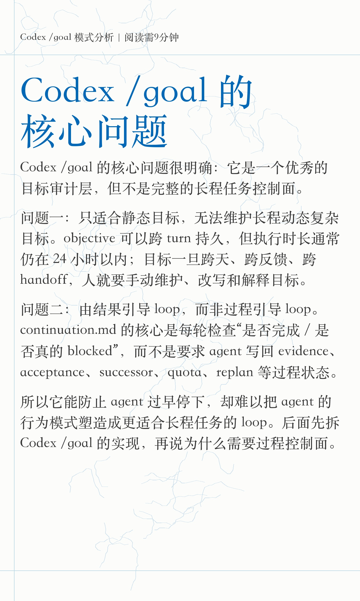
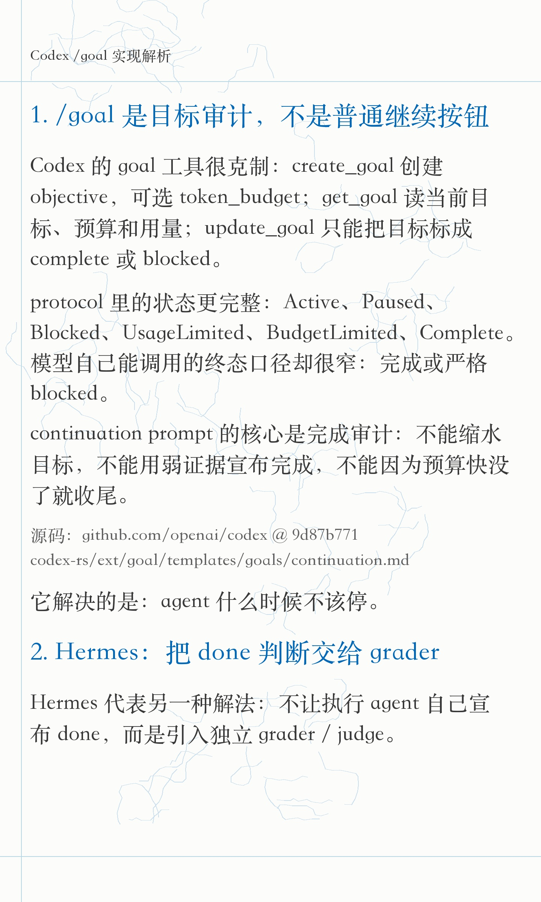
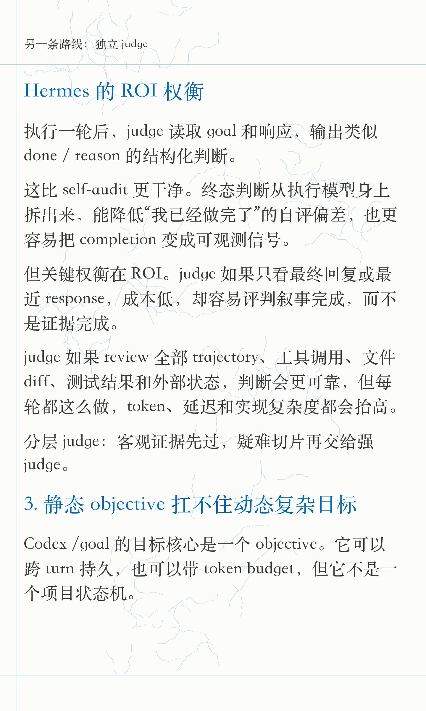
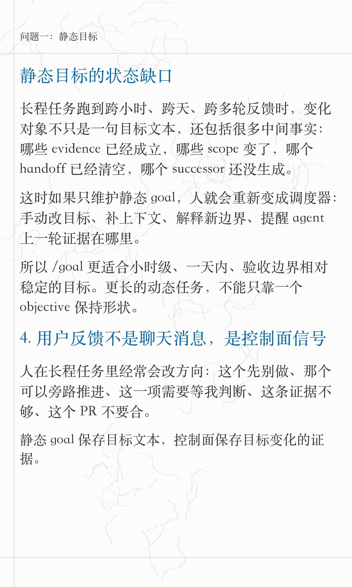
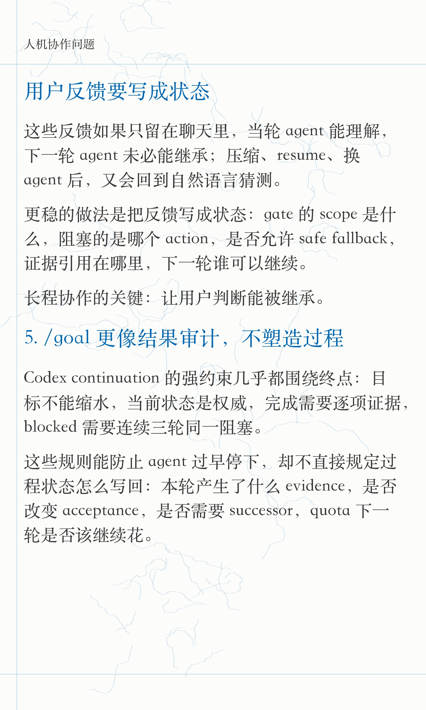
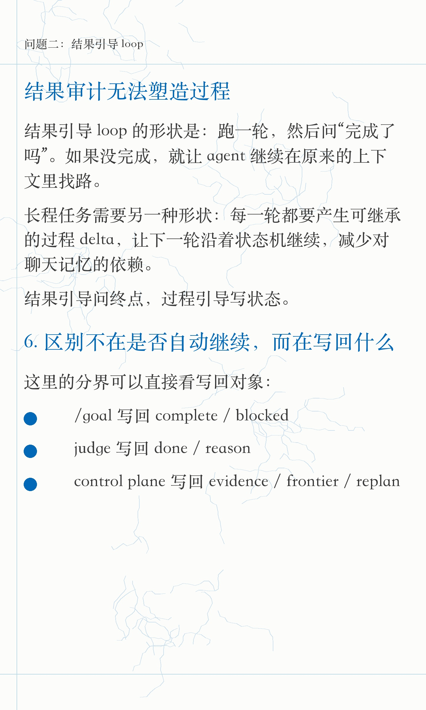
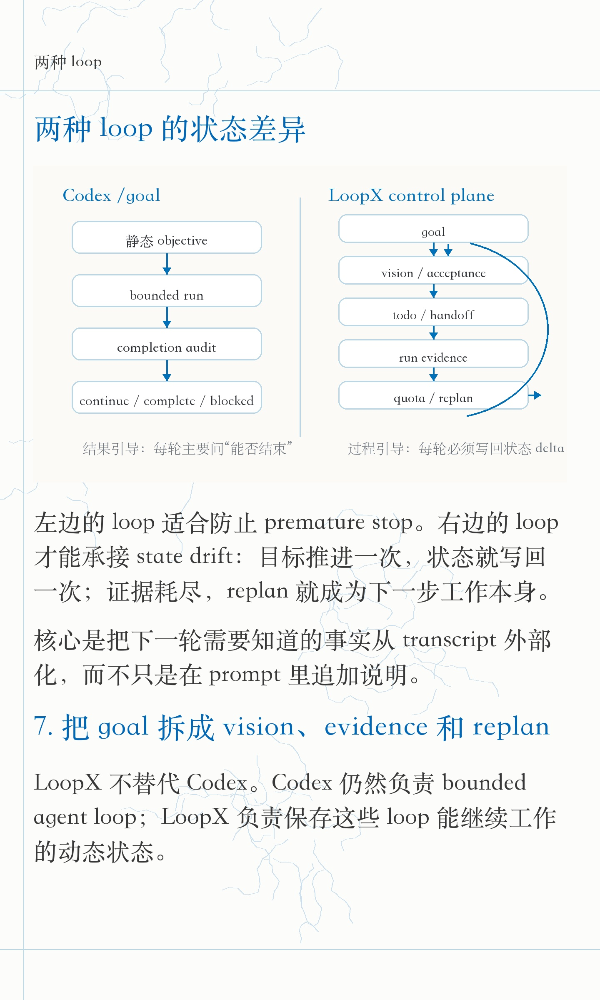
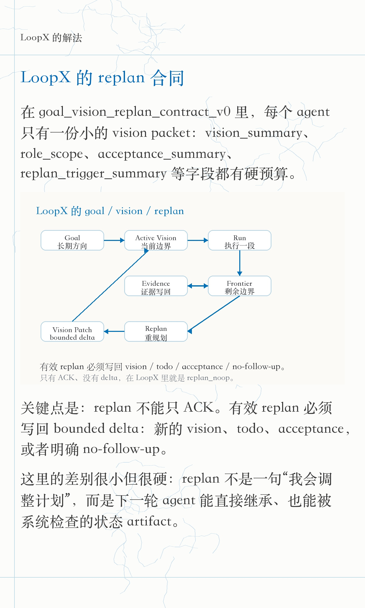
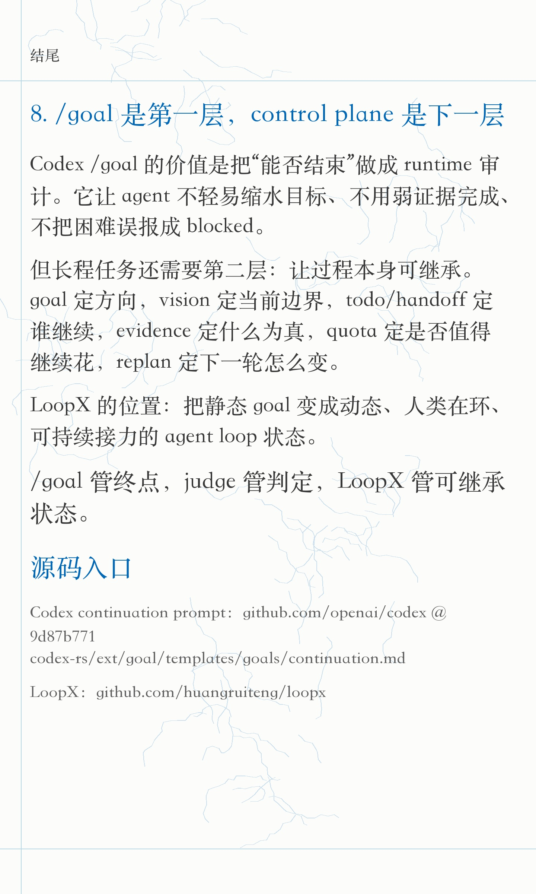

# Codex /goal 模式问题小红书素材 - 小逸排版版

## 图片上传顺序

1. 
2. 
3. 
4. 
5. 
6. 
7. 
8. 
9. 

## 标题

推荐：

Codex /goal 的核心问题

备选：

- Codex /goal 核心问题：目标不会演化
- Codex /goal：管终点，难管目标演化
- Codex /goal 的短板：目标不会自己演化
- Codex /goal 很强，但它不是长程控制面
- 为什么 Codex /goal 更像结果审计
- 长程 Agent 不能只有一个静态 Goal

## 正文

Codex /goal 的核心问题很明确：

它是一个优秀的目标审计层，但不是完整的长程任务控制面。

问题一：只适合静态目标，无法维护长程动态复杂目标。

objective 可以跨 turn 持久，也可以带 token budget。但它仍然更适合小时级、一天内、验收边界相对稳定的任务。执行时长一旦拉到跨天、跨多轮反馈、跨 handoff，人就要手动维护目标、改写目标、解释新边界。

这也是人机协作体验差的地方：

目标看似持久，真实目标状态却仍然散在聊天、文件、证据、用户反馈和 agent 自己的记忆里。

问题二：由结果引导 loop，而非过程引导 loop。

Codex continuation.md 的核心问题是：

这轮之后，目标完成了吗？

证据够不够？

是不是真的 blocked？

如果没有完成，就继续。

这套设计能防止 agent 过早停下，但很难主动塑造 agent 的过程行为。长程任务还需要每一轮都写回过程状态：

- 本轮产生了什么 evidence；
- acceptance 是否变化；
- 是否需要 successor；
- handoff 是否清空；
- 是否应该 replan；
- quota 下一轮是否值得继续花。

所以 /goal 的问题落在 loop 的驱动力上。

结果引导 loop 会不断问“完成了吗”。

过程引导 loop 要求每一轮都写回状态 delta。

先看 Codex /goal 的实现。

Codex 的 create_goal / get_goal / update_goal 把 objective、status、token budget、usage accounting 做成 thread-level state；update_goal 只允许模型把目标标成 complete 或 blocked。

protocol 里的状态更完整：Active、Paused、Blocked、UsageLimited、BudgetLimited、Complete。但模型自己能写入的终态口径很窄。

continuation prompt 的核心是完成审计：不能缩水目标，不能用弱证据宣布完成，不能因为预算快没了就收尾，blocked 需要连续多轮同一阻塞。

这层能力很有价值。它解决的是：agent 什么时候不该停。

Hermes 代表另一种补法：把 done 判断交给独立 grader / judge。

执行 agent 跑完一轮后，不由它自己宣布完成，而是让 judge 读取 goal 和响应，输出类似 done / reason 的结构化判断。

这能降低 self-audit 偏差，也能把 completion 变成更独立的信号。

但它的权衡在 ROI。

如果 judge 只看最终回复或最近 response，成本低，却容易评判叙事完成，而不是证据完成。

如果 judge review 全部 trajectory、工具调用、文件 diff、测试结果和外部状态，判断会更可靠，但每轮都这么做，token、延迟和实现复杂度都会很高。

分层 judge 更适合这类任务：默认不全量 review traj；客观证据先过，疑难切片、高风险 gate、无法被 deterministic check 覆盖的部分，再交给强 judge。

但无论是 /goal 的终点审计，还是 Hermes 的独立 judge，长程任务还需要另一层：agent 每一轮应该如何留下可继承的过程状态。

LoopX 想补的就是这一层。

它不替代 Codex。Codex 仍然负责 bounded agent loop：读文件、改代码、跑命令、回复用户。

LoopX 负责保存这些 loop 能继续工作的动态状态：goal、vision、todo、handoff、run history、evidence、quota 和 replan。

更具体一点，在 goal_vision_replan_contract_v0 里，每个 agent 有一份小的 vision packet：当前方向、role scope、acceptance、replan trigger 都有硬预算。

当 advancement frontier 耗尽、monitor-only lane 无法推进、handoff 清空但没有 successor、用户目标或 acceptance 变化时，系统进入 replan。

有效 replan 不能只是 ACK。

它必须写回 bounded delta：新的 vision、todo、acceptance，或者明确 no-follow-up。

/goal 的位置可以压成一句：

它是长程 agent 的第一层能力，负责终点审计。

下一层能力，是过程控制面。

goal 定方向，vision 定当前边界，todo/handoff 定谁继续，evidence 定什么为真，quota 定是否继续花，replan 定下一轮怎么变。

LoopX 的位置：把静态 goal 变成动态、人类在环、可持续接力的 agent loop 状态。

GitHub 搜：huangruiteng/loopx

#Codex #OpenAI #AIAgent #AI编程 #LoopX #LoopEngineering #ClaudeCode #Cursor #AgentInfra #开发者工具

## 技术来源

- Codex continuation prompt：<https://raw.githubusercontent.com/openai/codex/9d87b771cebd0f80e4637e80c93b0d66b10d86c0/codex-rs/ext/goal/templates/goals/continuation.md>
- Codex goal tools：<https://raw.githubusercontent.com/openai/codex/9d87b771cebd0f80e4637e80c93b0d66b10d86c0/codex-rs/ext/goal/src/spec.rs>
- Codex ThreadGoalStatus：<https://github.com/openai/codex/blob/9d87b771cebd0f80e4637e80c93b0d66b10d86c0/codex-rs/protocol/src/protocol.rs#L3661-L3701>
- Hermes Persistent Goals：<https://hermes-agent.nousresearch.com/docs/user-guide/features/goals>
- Hermes slash commands reference：<https://hermes-agent.nousresearch.com/docs/reference/slash-commands>
- LoopX repo：<https://github.com/huangruiteng/loopx>
- LoopX goal / vision / replan contract：<https://github.com/huangruiteng/loopx/blob/main/docs/reference/protocols/goal-vision-replan-contract-v0.md>

## 发布备注

- 标题要保留 Codex /goal，保证第一眼知道在蹭什么话题。
- 正文不要写成“Codex 不行”。主线是：/goal 做对了终点审计，但长程任务还需要过程控制面。
- 小红书正文里写“GitHub 搜：huangruiteng/loopx”，评论区可放完整链接。
