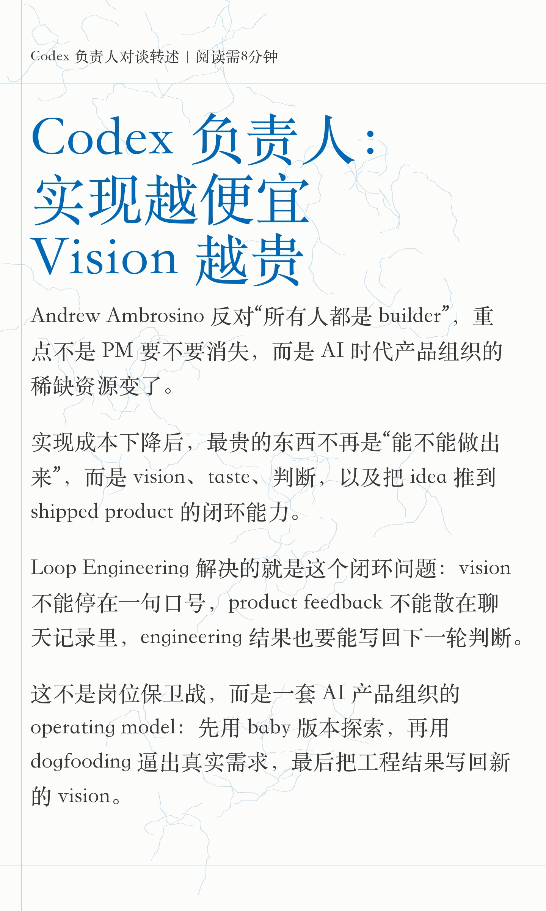
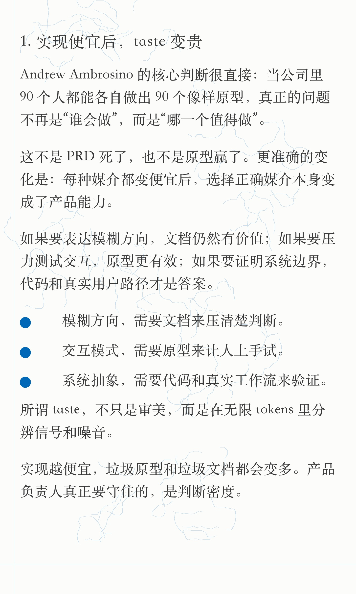
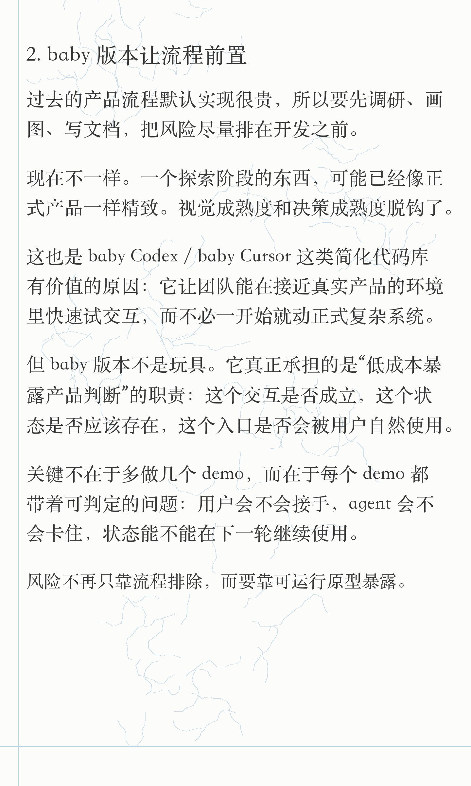
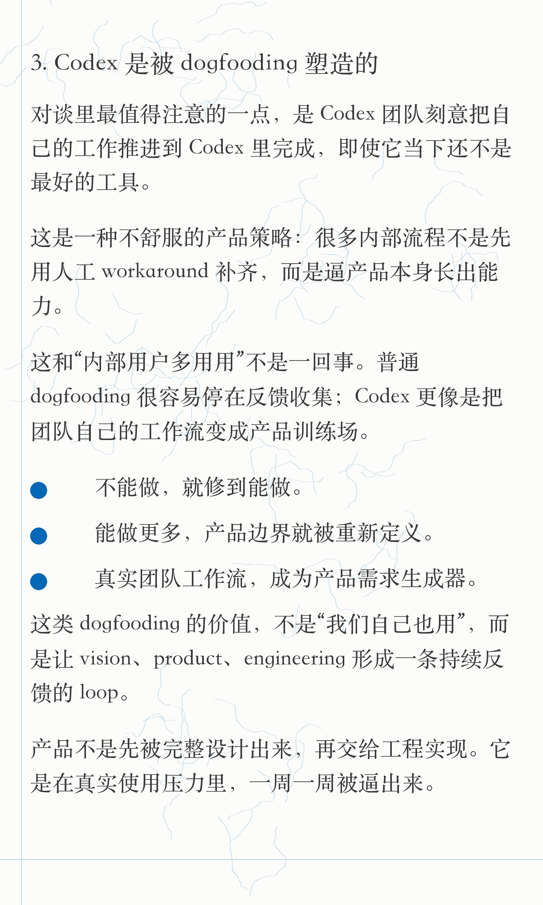
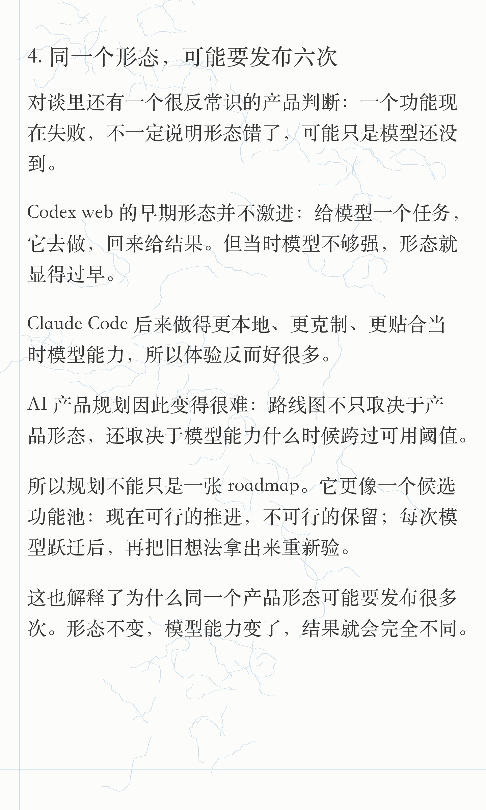
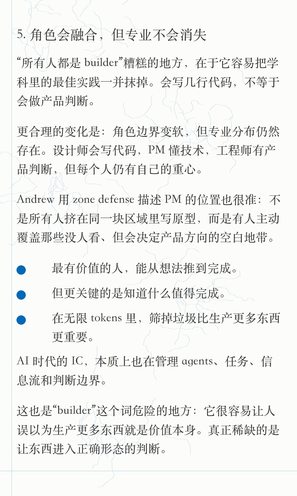
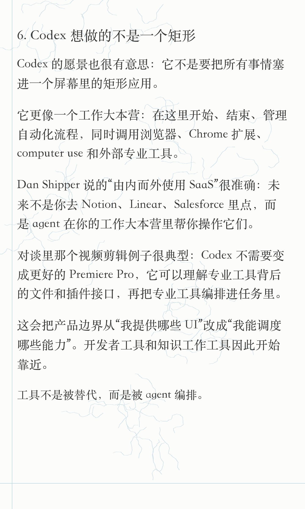
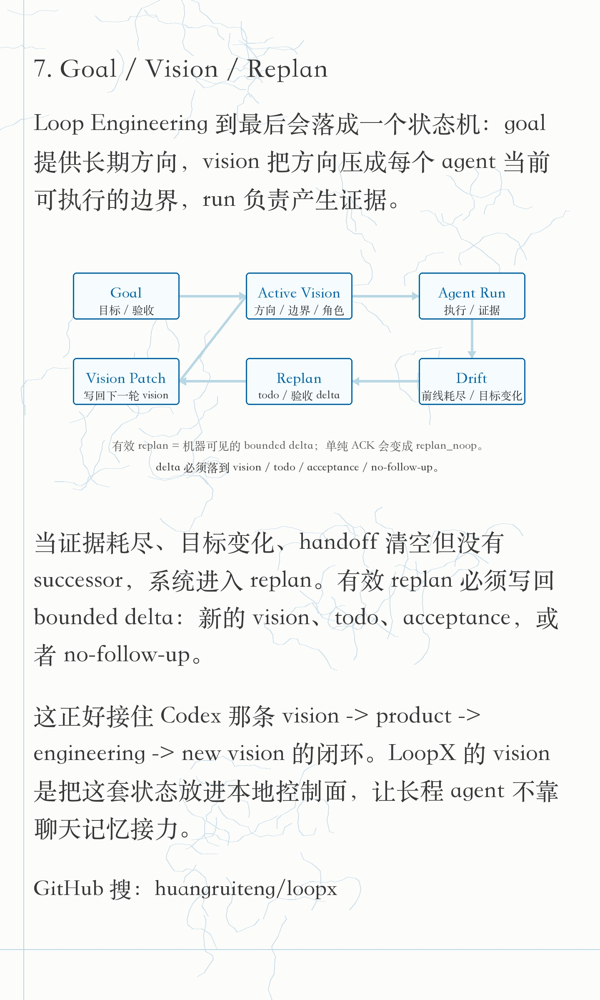

# Codex 负责人 builder 观点小红书素材 - 小逸排版版

## 图片上传顺序

1. 
2. 
3. 
4. 
5. 
6. 
7. 
8. 

## 标题

推荐：

Codex 负责人：实现越便宜，Vision 越贵

备选：

- 实现越便宜，Vision 越贵
- 实现越便宜，Vision 越贵：不是所有人都该 Builder
- AI 产品到最后，不是拼 Builder，是拼 Vision
- AI 时代最稀缺的不是 builder，而是 taste
- Codex 负责人：所有人都是 Builder，是个糟糕的主意
- Codex 负责人谈 AI 产品：实现便宜后，判断变贵
- 从 Codex 团队看 Loop Engineering
- Codex 的真正启发：产品是一个持续闭环

## 正文

读完 Founder Park 转述的 Codex 负责人 Andrew Ambrosino 访谈，最想写的不是“PM 会不会消失”。

更核心的变化是：当 AI 把实现成本压低后，产品组织的稀缺资源变了。

过去最贵的是实现，所以产品流程围绕“实现前排风险”展开：调研、PRD、原型、评审。

现在更难的是判断：

哪些东西值得做？
哪些原型只是看起来能发？
哪些 feature request 应该忽略、合并、重新定义？
什么时候一个功能不是坏，而只是模型还没到？

这也是 Andrew 反对“所有人都是 builder”的原因。

角色边界会变软，但专业不会消失。

AI 时代最有价值的人，不只是能从 idea 推到 shipped product，而是有 vision 和 taste，知道什么值得推到 shipped product。

这条线索可以叫做 Loop Engineering。

Codex 团队每个人都在执行一条 loop：

vision -> product -> engineering -> new vision

他们用 Codex 做 Codex，刻意把真实工作流推回产品里，让产品自己长出能力。

Loop Engineering 解决的是这条闭环的工程化问题：goal 不能停在一句口号，vision 要被压成当前 agent 可执行的边界，run 产生的证据要能触发 replan。

有效 replan 不能只是 ACK。它必须写回 bounded delta：新的 vision、todo、acceptance，或者 no-follow-up。

LoopX 的 vision 就落在这里：为长程 agent 提供一层 harness / 控制面，让 goal、vision、replan、handoff 和 run history 能持续支撑下一轮执行。

GitHub 搜：huangruiteng/loopx

#Codex #OpenAI #AIAgent #AI产品 #产品经理 #AI编程 #LoopEngineering #LoopX #开发者工具 #AgentInfra

## 技术来源

- Founder Park 微信文章：<https://mp.weixin.qq.com/s/wJrUsBSs0owDascwDZBd-w>
- 来源状态：已通过本机 Chrome / Playwright 读取全文，标题为《Codex 负责人：「所有人都是 builder」是个很糟糕的主意》，发布时间 2026-07-02 19:06。

## 发布备注

- 主线不要写成“我也聊 PM 是否消失”：实现成本下降 -> taste 稀缺 -> dogfooding loop -> Codex vision -> LoopX 控制面。
- LoopX 只在首图和最后一图自然露出，不抢 Andrew 的观点本身。
- 小红书正文里写“GitHub 搜：huangruiteng/loopx”，评论区可放完整链接。
