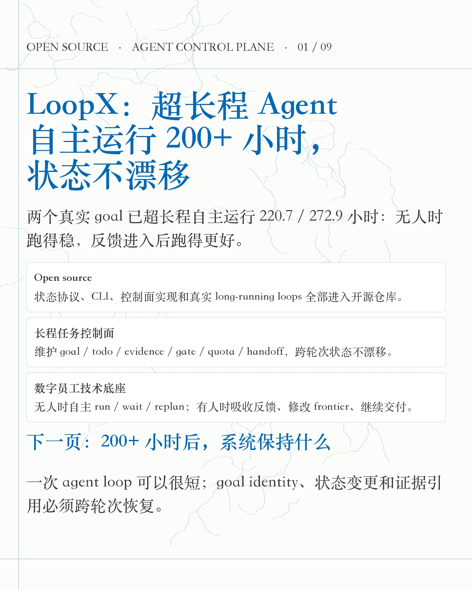
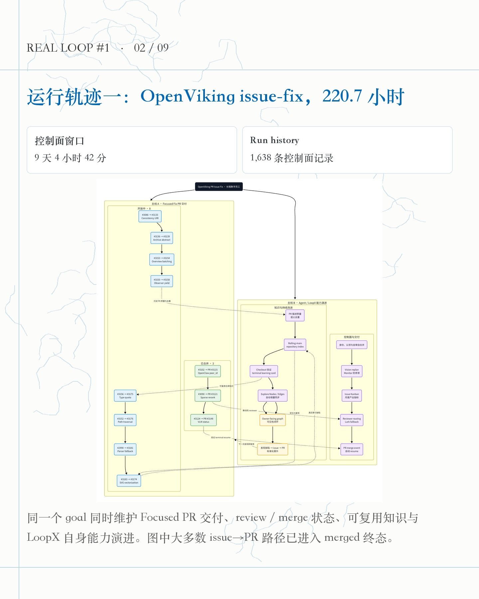
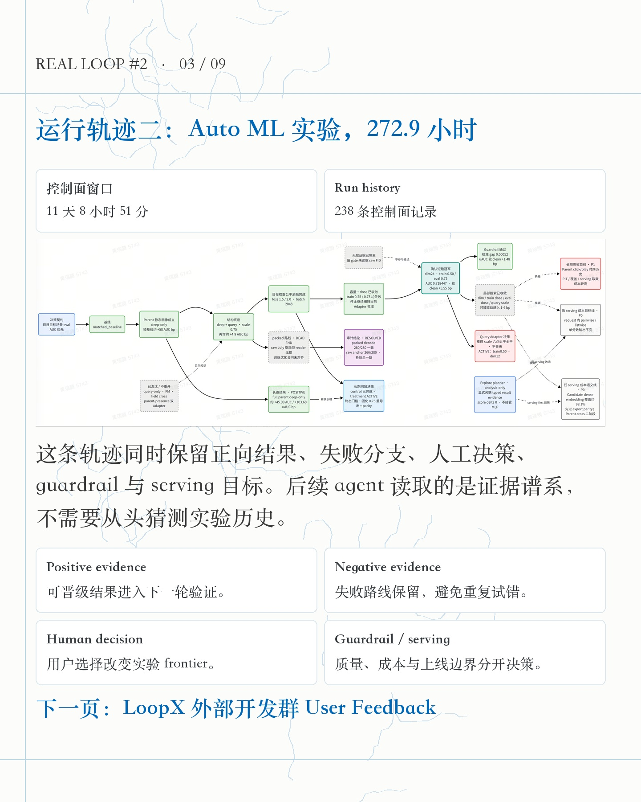
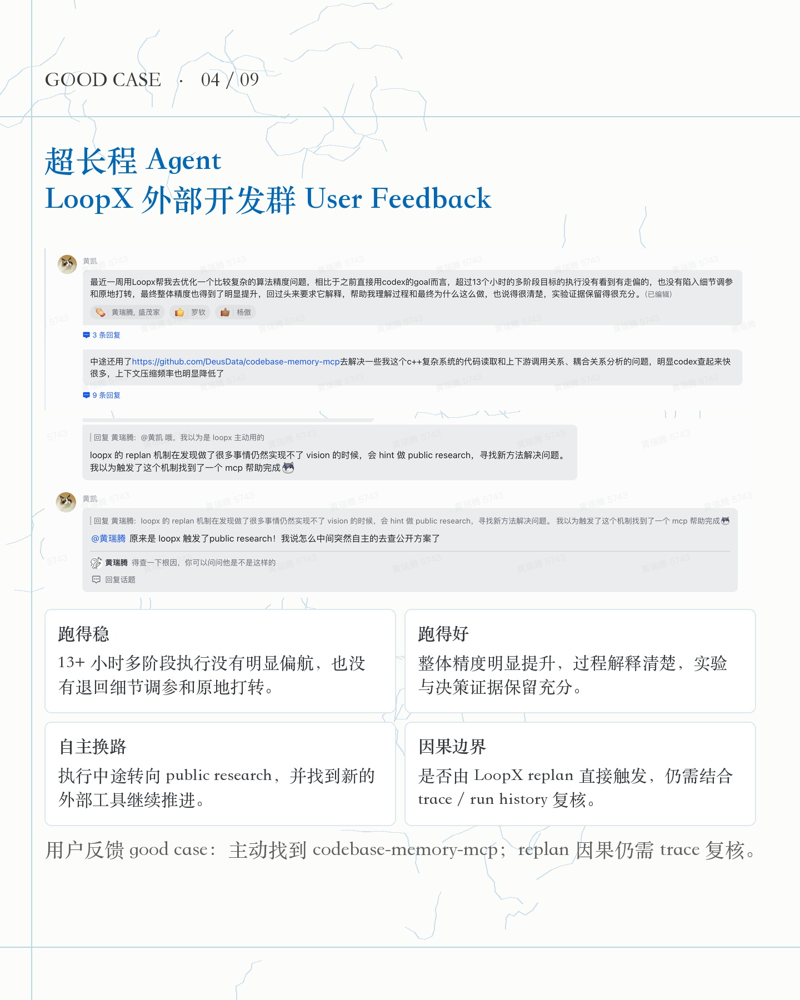
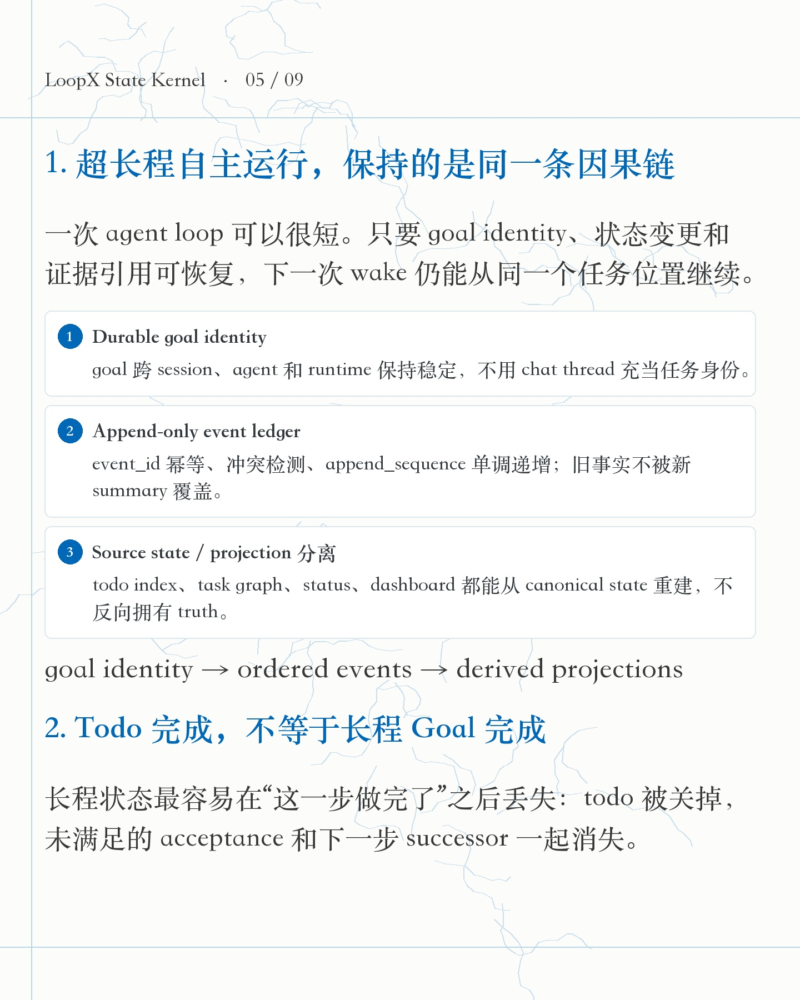
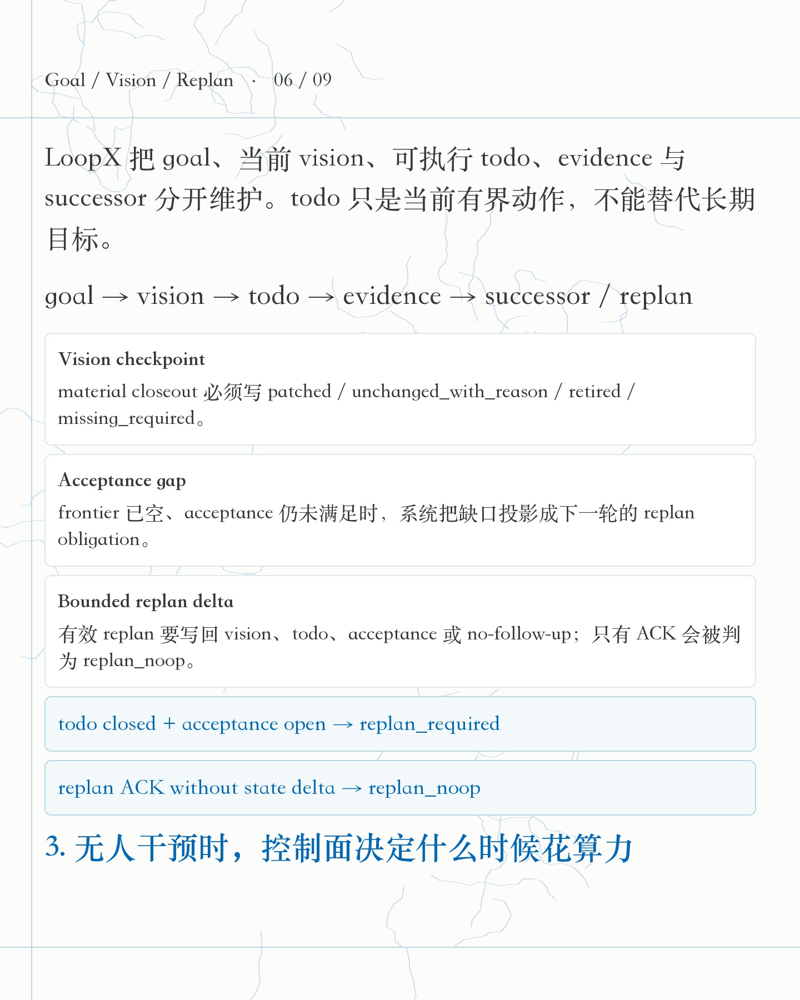
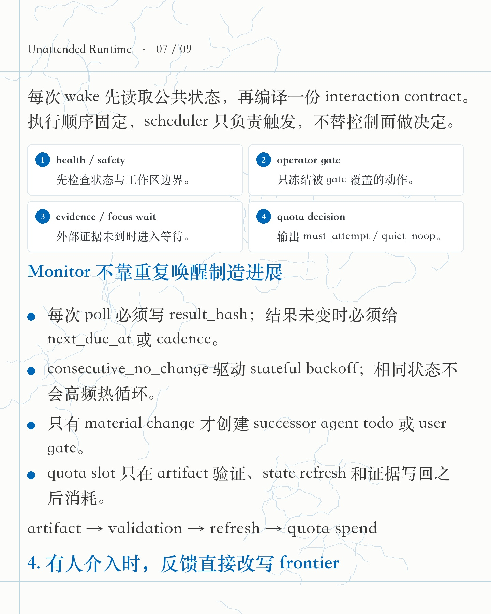
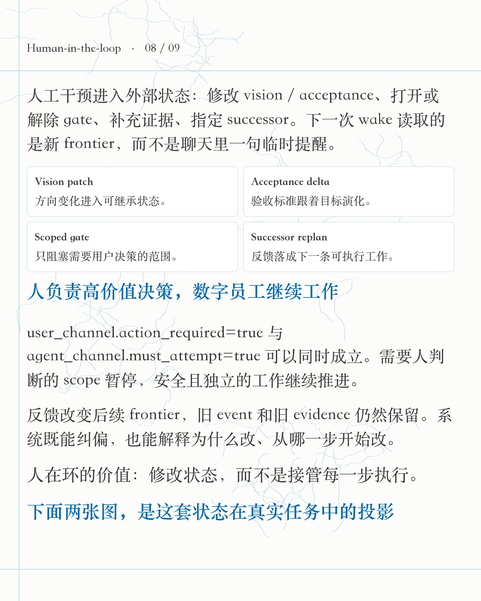
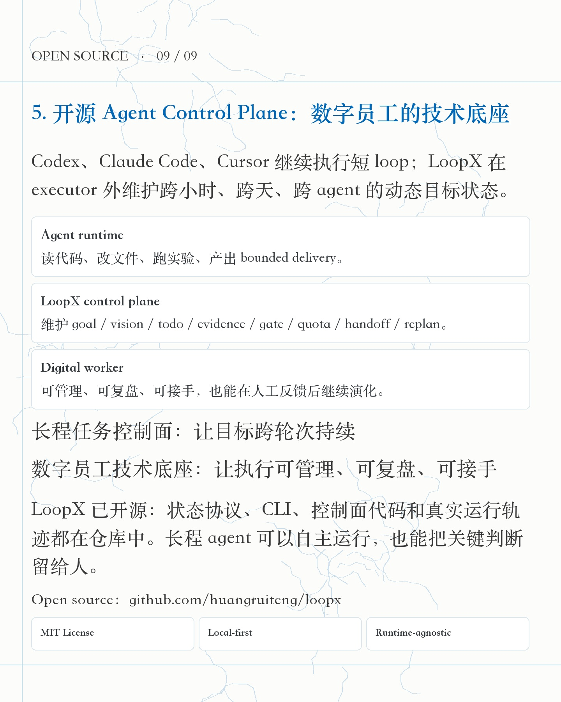

# LoopX 200+ 小时长程任务 - 小红书发布稿

## 格式决策

采用 **小逸浅色衬线长文 + 两页真实证据图**：

- 小逸长文适合连续解释 event ledger、vision / replan、quota 和 human gate，技术逻辑不会被拆成宣传卡片。
- 两张真实轨迹图各占一页。OpenViking 图按纵向主路径展示；Auto ML 图保留横向全貌，再用四个短结论解释读图方式。
- 不选黑底纯文字：长文与细图同时出现时阅读压力偏大。
- 不选 LoopX 产品卡片作为主风格：这篇先证明长程状态机制，再引向仓库，不能做成 feature list。

## 图片上传顺序

1. 
2. 
3. 
4. 
5. 
6. 
7. 
8. 
9. 

## 标题

推荐：

**LoopX：超长程 Agent 自主运行 200+ 小时，状态不漂移**

备选：

- LoopX：开源长程任务控制面
- 超长程 Agent 自主运行十天，怎么保持状态
- 200+ 小时后，Agent 还知道自己在做什么

## 正文

LoopX 是面向超长程自主运行任务的开源 Agent Control Plane，也是数字员工的技术底座。

目前有两个真实长程 goal：

- OpenViking issue-fix：控制面窗口跨越 220.7 小时；
- Auto ML experiment：控制面窗口跨越 272.9 小时。

两个 goal 分别超长程自主运行了 220.7 小时和 272.9 小时：无人时跑得稳，反馈进入后跑得更好。

两张真实轨迹图分别来自 OpenViking issue-fix 和 Auto ML experiment。图里保留的是跨轮次仍有决策价值的 issue、PR、实验、正负证据、gate 与结果路径，不是完整 transcript。

这两组案例证明的是长期状态保持：多个 bounded agent loop 可以共享同一个 goal、同一份证据账本和持续演化的 frontier。

LoopX 外部开发群里，一段复杂算法精度任务的用户反馈提供了质量侧 good case：多阶段执行没有明显偏航，也没有退回细节调参和原地打转；最终精度明显提升，过程解释清楚，证据保留充分。

执行中途还出现了自主换路：agent 转向 public research，找到 codebase-memory-mcp 补充代码理解能力，context 压缩频率也随之下降。是否由 LoopX replan 直接触发，仍需结合 trace / run history 复核。

这组反馈证明的不是单纯“跑得久”，而是超长程自主运行同时满足两条：过程跑得稳，结果跑得好。

这里的时长按同一个 goal 的 control-plane window 计算：中间经历多次 agent wake、等待、handoff、人工 decision、review / merge 与 runtime restart，不等于模型连续推理十天。

长程任务的难点也在这里：一次 loop 可以很短，几天后重新唤醒时，系统仍要知道同一个 goal 做到哪、哪些证据可信、谁在等谁、下一步是否值得继续花算力。

LoopX 作为长程任务的控制面，把这组信息写进外部状态：goal、vision、todo、evidence、gate、quota、handoff、replan。

状态不漂移至少包括三件事：

1. goal identity 跨 session 和 runtime 保持稳定；
2. 状态变更进入 append-only event ledger，event_id 幂等、冲突可检测、顺序可恢复；
3. status、todo index、task graph、dashboard 都是 projection，可以从 canonical state 重建。

todo 完成也不能直接等价于 goal 完成。每次 material closeout 都要写 vision checkpoint；frontier 已空但 acceptance 仍未满足时，系统进入 replan。有效 replan 必须写回 vision、todo、acceptance 或 no-follow-up，只有一句 ACK 会被判成 no-op。

自主运行的关键，是系统知道什么时候工作，什么时候不工作。

每次 wake 先过 health / safety、operator gate、evidence wait、focus wait，再做 quota decision。monitor 没发现变化时会写 result_hash、next_due_at 和 no-change counter，并逐步 backoff；只有 material change 才创建 successor。quota 也只在 artifact 验证、state refresh 和证据写回之后消耗。

人工介入后，反馈会直接改变后续 frontier。

用户可以修改 vision / acceptance、打开或解除 gate、补充证据、指定 successor。需要人判断的 scope 暂停，独立工作仍可继续；旧 event 和 evidence 不被覆盖，因此系统既能纠偏，也能解释为什么改。

所以 LoopX 有两个直接定位：

1. **长程任务的 Agent Control Plane**：让动态目标跨轮次、跨 runtime、跨 agent 持续；
2. **数字员工的技术底座**：让 agent 可管理、可复盘、可接手，在无人时自主运行，在有人时吸收反馈。

LoopX 已开源。状态协议、CLI、控制面代码和真实运行轨迹都在仓库里。

GitHub 搜：**huangruiteng/loopx**

#LoopX #LoopEngineering #AIAgent #LongHorizonAgent #MultiAgent #AgentInfra #Codex #开源项目

## 置顶评论

开源仓库（MIT License）：<https://github.com/huangruiteng/loopx>

README 的 **Real Long-Running Loops** 已放入这两组轨迹图。数字口径是同一 goal 的控制面窗口，不是单次模型调用时长。

注：这里使用完整写法 `Agent Control Plane`。业界的 `ACP` 也常指 `Agent Client Protocol`，不在正文里单独使用缩写，避免把 session 协议和长程控制面混在一起。

## 技术来源

- LoopX README / Real Long-Running Loops：<https://github.com/huangruiteng/loopx#real-long-running-loops>
- Long-Horizon Agent State Protocol：<https://github.com/huangruiteng/loopx/blob/main/docs/reference/protocols/long-horizon-agent-state-protocol-v0.md>
- Goal / Vision / Replan Contract：<https://github.com/huangruiteng/loopx/blob/main/docs/reference/protocols/goal-vision-replan-contract-v0.md>
- Core Control Plane State Machine：<https://github.com/huangruiteng/loopx/blob/main/docs/product/core-control-plane/state-machine.md>
- Quota Allocation：<https://github.com/huangruiteng/loopx/blob/main/docs/quota-allocation.md>
- Append-only event store 实现：<https://github.com/huangruiteng/loopx/blob/6d51032df64f0f95de3f9433b0d2636cf1401ad6/loopx/event_sourced_state.py#L480-L497>
- Interaction contract 实现：<https://github.com/huangruiteng/loopx/blob/6d51032df64f0f95de3f9433b0d2636cf1401ad6/loopx/control_plane/work_items/interaction_contract.py#L736-L869>
- Monitor poll writeback 实现：<https://github.com/huangruiteng/loopx/blob/6d51032df64f0f95de3f9433b0d2636cf1401ad6/loopx/control_plane/scheduler/monitor_poll_writeback.py#L53-L169>
- Vision checkpoint 实现：<https://github.com/huangruiteng/loopx/blob/6d51032df64f0f95de3f9433b0d2636cf1401ad6/loopx/state_refresh.py#L229-L302>

## 证据口径

- OpenViking goal：`2026-07-10 14:09:15 +08:00` 至 `2026-07-19 18:52:13 +08:00`，共 220.72 小时、1,638 条 run-history 记录。
- Auto ML goal：`2026-06-01 01:14:04 +08:00` 至 `2026-06-12 10:05:04 +08:00`，共 272.85 小时、238 条 run-history 记录。
- run-history 同时包含 delivery、wait、monitor poll、quota / state writeback 等控制面记录，不能表述为 1,638 次模型推理。
- 第二张实验图带有作者水印；发布前保留，不做擦除。

## 公开边界

- 图片与正文不包含内部 URL、token、私有 workspace 路径或未公开的 goal id。
- reward-style replanning 仍是设计合同，不在正文中写成已经上线的隐式偏好学习。
- “状态不漂移”限定为 control-plane identity、event、evidence、projection 与 frontier 的可恢复性，不扩张为模型输出永不出错。
