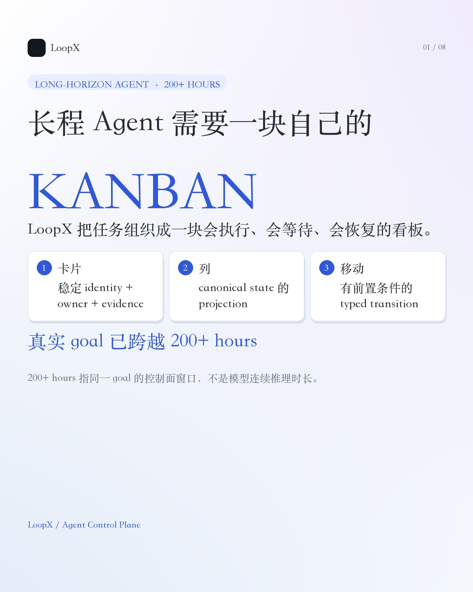
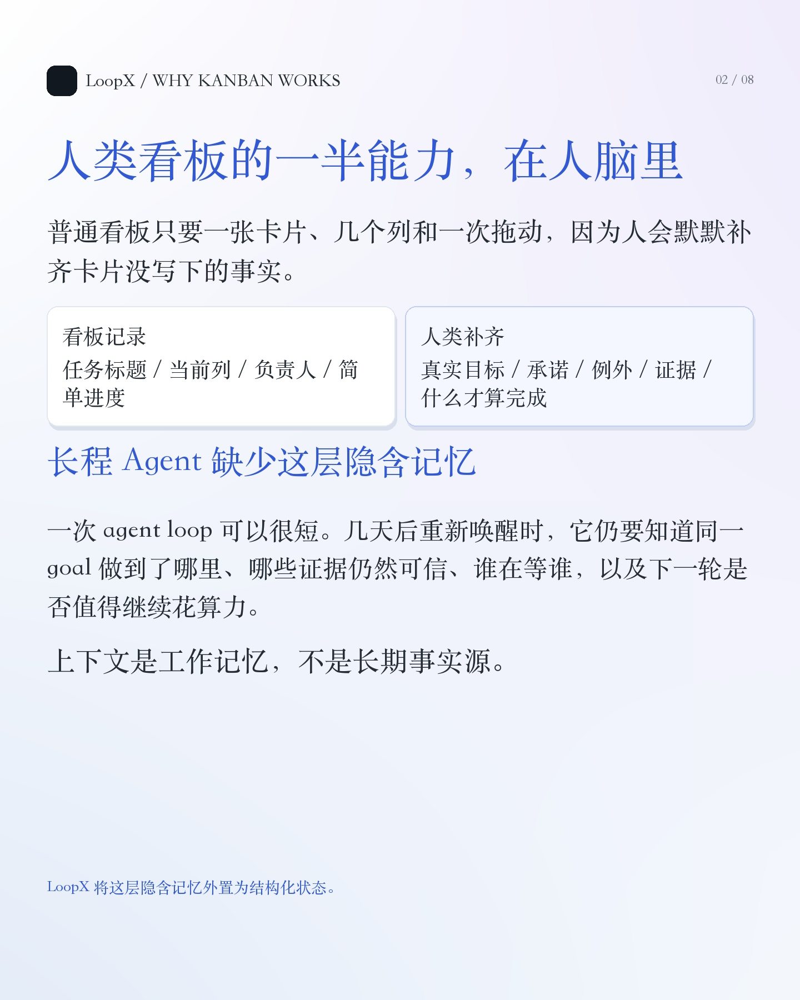
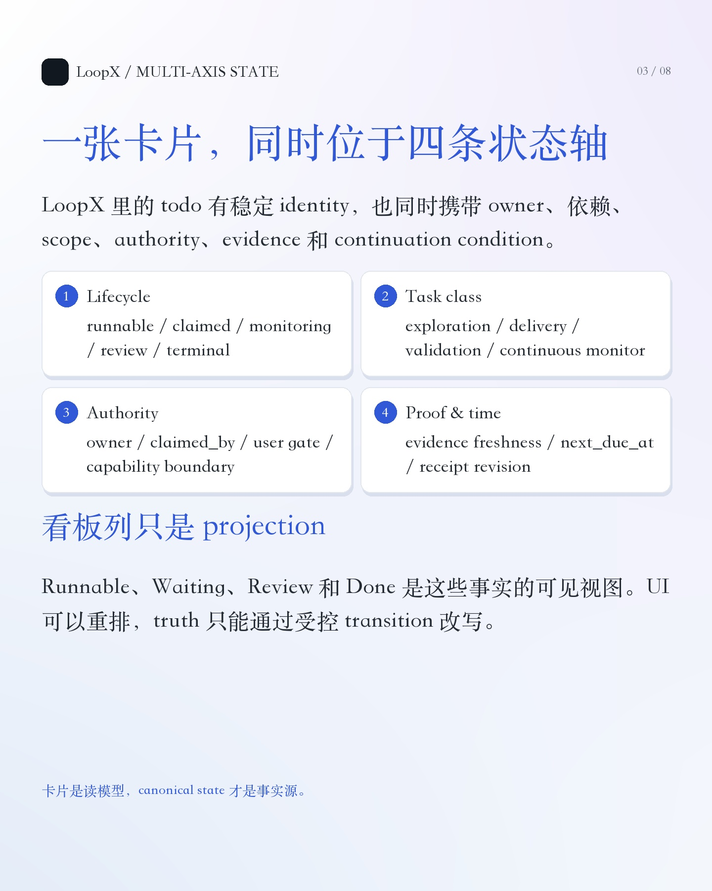
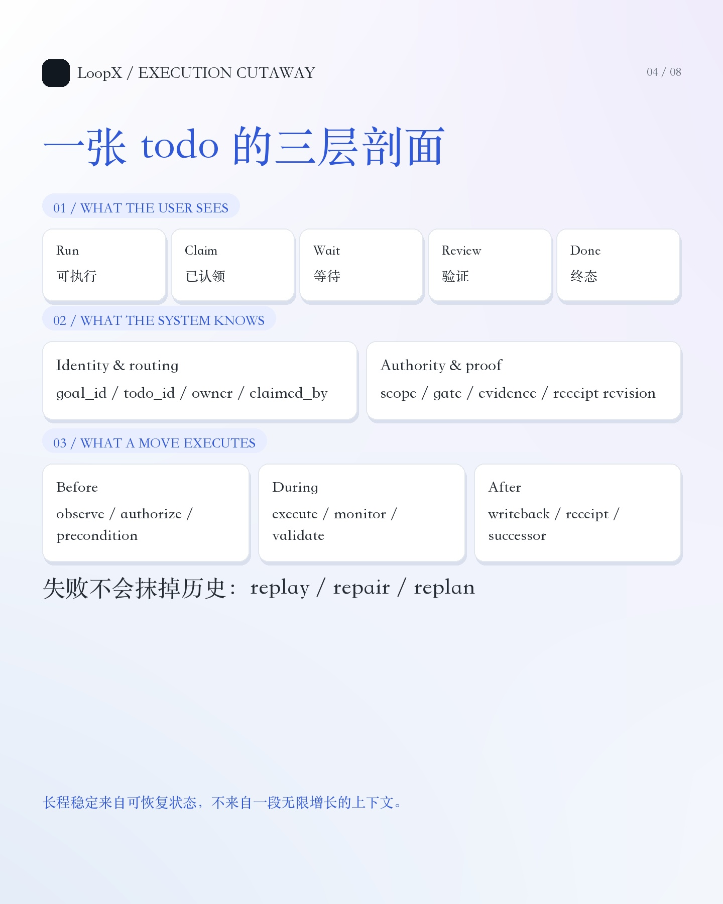
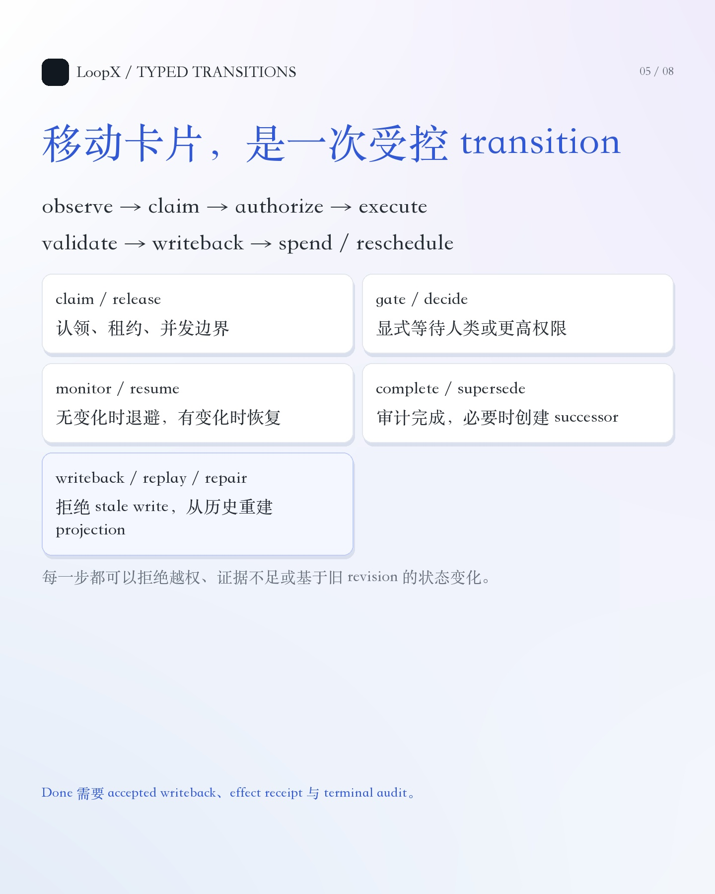
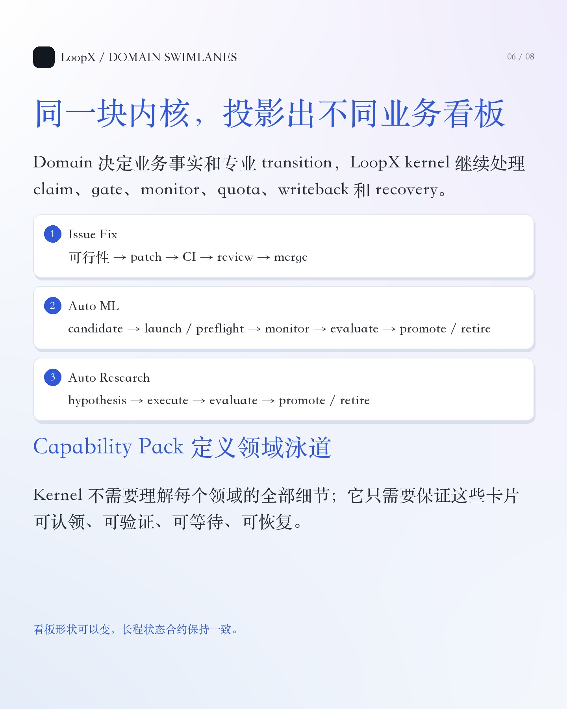
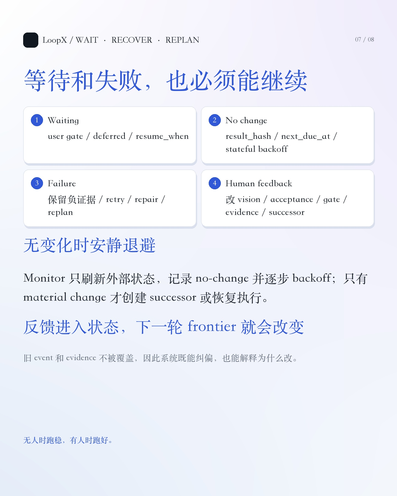
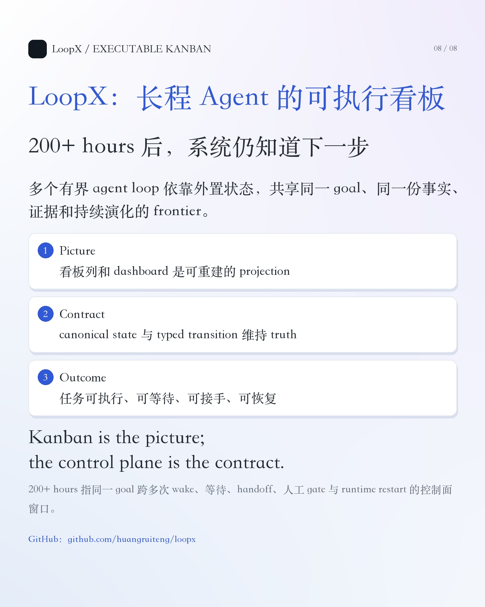

# LoopX：长程 Agent 的可执行看板

## 排版决策

采用「小逸浅色衬线技术长文 + 状态卡片」混合版：

- 主体保留连续推导：普通看板为什么对人有效，换成长程 Agent 后缺了什么，LoopX 如何补上。
- 看板列、多轴状态、operator 和 transition 用紧凑卡片或剖面图表达。
- 首屏先建立「长程 Agent 需要自己的 Kanban」这个独特命题，`200h+` 只作为真实长程执行的证据锚点。
- 全部图片保持 `1440 x 1800`，浅底、蓝色标题、衬线正文；卡片只承载结构化信息。

## 图片规划

1. 
2. 
3. 
4. 
5. 
6. 
7. 
8. 

## 小红书标题

推荐：

**长程 Agent 为什么需要一块自己的 Kanban**

备选：

- LoopX：给长程 Agent 一块会执行的看板
- 普通看板只放卡片，Agent 看板还要会恢复
- 200h+ 长程任务背后，是一块可执行看板

## 正文

如果只用一个概念向开发者介绍 LoopX，我会选「面向长程 Agent 的可执行看板」。

看板的表面很简单：一张卡片代表一件事，从 Todo 移到 Doing，再移到 Done。

这套方法对人类团队有效，因为人会自然补齐看板没有记录的东西：

- 这张卡片真正想解决什么；
- 为什么现在还不能开始；
- 谁已经承诺处理；
- 哪些证据足以说明它完成了；
- 外部条件没有变化时，什么时候再看。

这些信息不一定在卡片上，却在人的记忆、会议、群聊、代码和组织关系里。

长程 Agent 不能依赖这层隐含记忆。

一次 agent loop 可以很短。任务拉长到跨天、跨 session、跨 runtime 之后，模型的当前上下文无法承担长期事实源。几天后重新唤醒时，系统仍然要知道同一个 goal 做到了哪里、谁在等谁、哪些证据仍然有效，以及下一轮是否值得继续花算力。

LoopX 将这些信息外置为结构化状态。

因此，LoopX 里的一张「卡片」不再是一行文字。它有稳定的 `todo_id`，也有 owner、依赖、scope、authority、evidence 和 continuation condition。

一张卡片还同时位于多个状态轴上：

- 生命周期：runnable / claimed / monitoring / review / terminal；
- 任务类型：exploration / delivery / validation / continuous monitor；
- 路由与权限：owner / claimed_by / user gate / capability boundary；
- 证明与时间：evidence freshness / next_due_at / receipt revision。

所以看板上的 Runnable、Waiting、Review 和 Done，都只是这些状态的 projection。用户可以换一种排序或展示方式，但不能通过改一列文字来改写事实。

更关键的变化发生在「移动卡片」上。

普通看板中，人把卡片从 Doing 拖到 Done，系统就接受了。

LoopX 需要先回答一组问题：

- 当前 agent 有权写这个 scope 吗？
- 前置依赖和 operator gate 都满足了吗？
- 产物、外部状态和验证证据对得上吗？
- 这次写回是否基于最新 revision？
- 完成之后应该终止、创建 successor，还是进入 monitor？

因此，一次状态变化实际上是一个受控 transition：

`observe → claim → authorize → execute → validate → writeback → spend / reschedule`

LoopX 为这些 transition 提供了一组 operator：

- `claim / release`：处理认领、租约和并发边界；
- `gate / decide`：让需要人类或更高权限的决策显式等待；
- `monitor / resume`：外部条件没变化时安静退避，有变化时恢复；
- `complete / supersede`：用证据和 receipt 关闭旧任务，必要时建立 successor；
- `writeback / replay / repair`：维持 canonical state，检测 stale write，并从历史事件重建 projection。

普通看板的 WIP limit，在这里变成 claim、lease、quota 和 workspace guard。

普通看板的 Waiting，在这里变成 user gate、monitor、deferred 和 `resume_when`。

普通看板的 Done，在这里需要 accepted writeback、effect receipt 和 terminal audit。

这也是 LoopX 能够支撑 200h+ 长程 goal 的原因。

这里的 200h+ 指同一 goal 的 control-plane window：期间可以经历多次 agent wake、等待、handoff、人工 decision、review / merge 与 runtime restart，不等于模型连续推理 200 小时。

它证明的是：多个有界的 agent loop 可以围绕同一个 goal，共享同一份事实、证据和持续演化的 frontier。

不同长程任务可以在这套内核上投影出不同 swimlane：

- Issue Fix：可行性 → patch → CI → review → merge；
- Auto ML：candidate → launch / preflight → monitor → evaluate → promote / retire；
- Auto Research：hypothesis → execute → evaluate → promote / retire。

Domain 决定卡片上的业务事实和专业 transition，LoopX kernel 继续处理 claim、gate、monitor、quota、writeback 和 recovery。

这块看板也不是只服务无人运行。

用户可以修改 vision / acceptance，打开或解除 gate，补充新 evidence，或指定 successor。反馈进入结构化状态后，后续 frontier 和每轮 CLI packet 都会发生变化。

这就是 LoopX 的核心目标：

**长程任务无人干预时能跑稳，有人干预时能跑好。**

一句话收束：

**Kanban is the picture; the control plane is the contract.**

GitHub 搜：**huangruiteng/loopx**

#LoopX #LoopEngineering #AIAgent #LongHorizonAgent #AgentControlPlane #Codex #MultiAgent #开源项目

## 置顶评论

LoopX 开源仓库：<https://github.com/huangruiteng/loopx>

`200h+` 指同一 goal 的控制面时间窗口，不是单次模型调用或连续推理时长。看板只是可见 projection，真正的长期事实来自 canonical state 与受控 transition。

## 技术来源

- LoopX：<https://github.com/huangruiteng/loopx>
- Control Plane Course / Concept Primer：<https://github.com/huangruiteng/loopx/blob/main/docs/development/control-plane-course/00-concept-primer.md>
- Control Plane Course / State Substrate：<https://github.com/huangruiteng/loopx/blob/main/docs/development/control-plane-course/02-state-substrate.md>
- Long-Horizon Agent State Protocol：<https://github.com/huangruiteng/loopx/blob/main/docs/reference/protocols/long-horizon-agent-state-protocol-v0.md>
- Goal / Vision / Replan Contract：<https://github.com/huangruiteng/loopx/blob/main/docs/reference/protocols/goal-vision-replan-contract-v0.md>
- Core Control Plane State Machine：<https://github.com/huangruiteng/loopx/blob/main/docs/product/core-control-plane/state-machine.md>

## 证据边界

- 长程时长只表达 control-plane identity、event、evidence、projection 与 frontier 的跨轮可恢复性。
- 它不意味着模型永远不犯错，也不意味着单次推理持续 200 小时。
- 不将某个领域 demo 的收益扩张成 LoopX 内核的通用 benchmark 结论。
