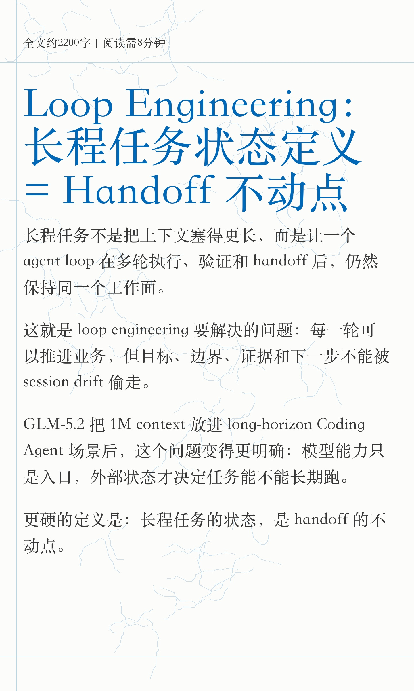
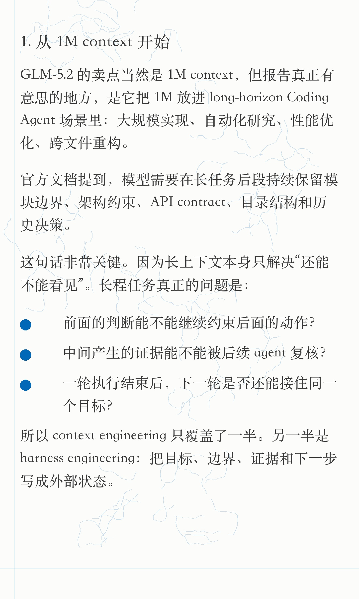
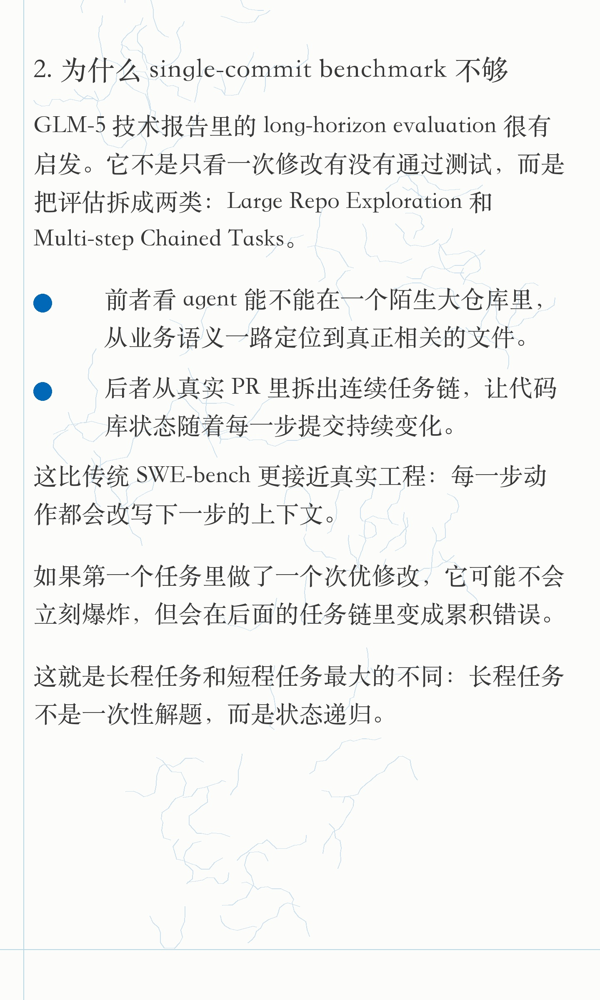
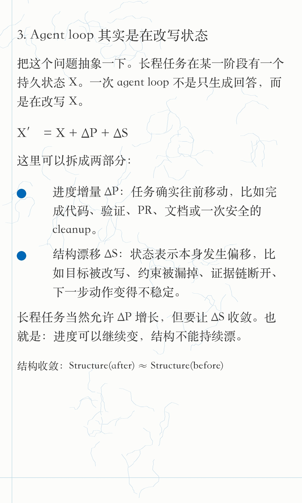
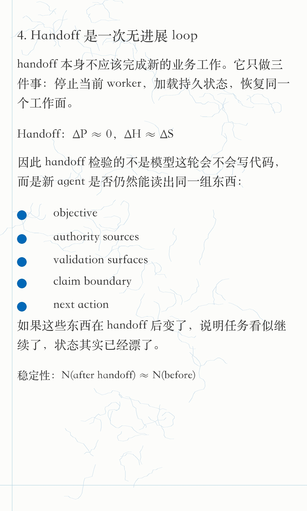
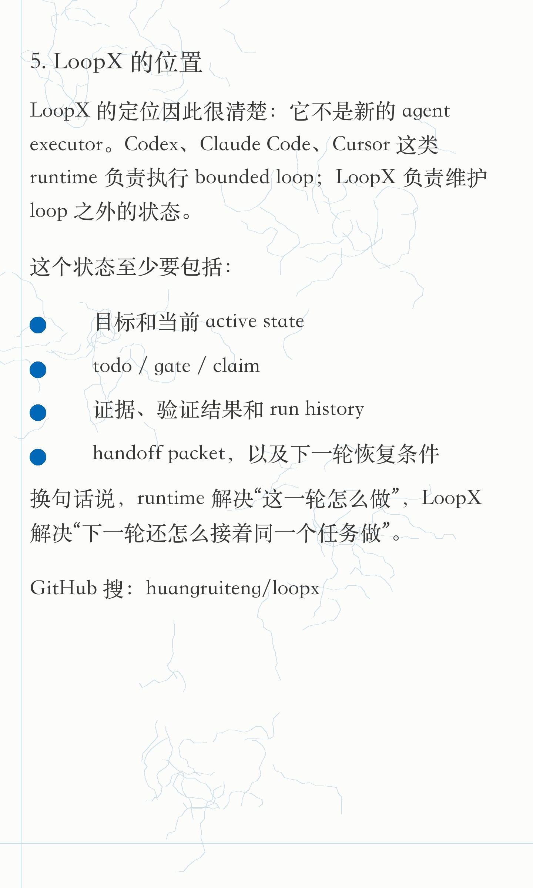
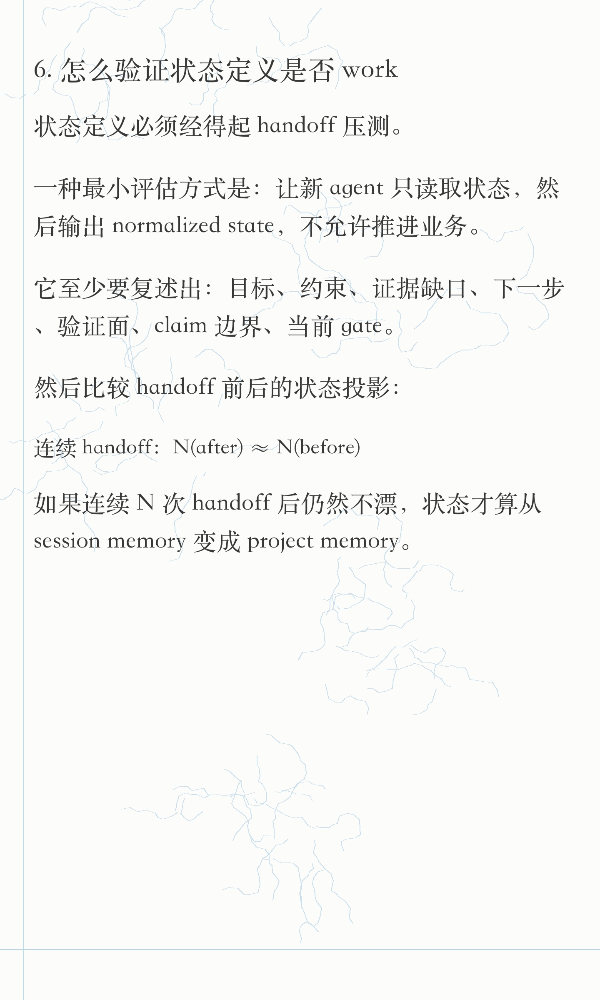
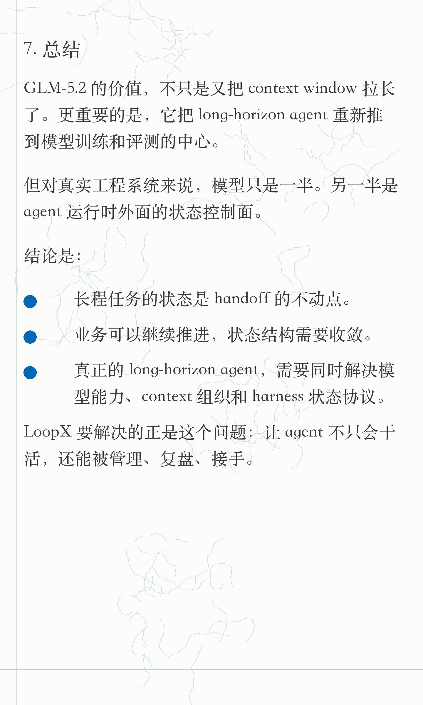

# LoopX 长程任务状态定义小红书素材 - 小逸排版版

## 排版调研结论

参考帖：<http://xhslink.com/o/84v0M16TMVD>

它不是海报式排版，更像“长文截图模板”：

- 画布比例：`1440 x 2400`，比常规 3:4 图更长，适合长文阅读。
- 字体气质：宋体 / 衬线体为主，正文偏粗，英文和中文混排不避讳。
- 首图：小字阅读提示 + 蓝色超大标题 + 正文开场，不做卡片、不做按钮。
- 装饰：浅蓝细边线 + 很淡的线稿水印，装饰只做氛围，不抢文字。
- 信息层级：正文黑灰，标题蓝色，列表用大蓝点；几乎没有图标、渐变、阴影、色块。
- 公式处理：不使用大块公式截图，改成正文同款字体的短规则行；公式只辅助定义，不抢阅读重心。

所以新版按这个模板复刻：保留长文截图感，弱化设计感，增强技术博主笔记感。

## 图片上传顺序

1. 
2. 
3. 
4. 
5. 
6. 
7. 
8. 

## 标题

推荐：

Loop Engineering：长程任务状态定义 = Handoff 不动点

备选：

- 长程任务的外部状态定义：Handoff 不动点
- GLM-5.2 之后，长程 Agent 真正缺什么？
- Long-Horizon Agent 不只是 1M context
- 长程任务的状态，是 handoff 的不动点

## 正文

Loop Engineering 不是 prompt engineering 的换皮。

它真正要处理的是：一个 agent loop 在多轮执行、验证、handoff 后，能不能继续保持同一个任务状态。

GLM-5.2 的 long-horizon 叙事里，这个信号非常明显：

长程 Agent 的问题，已经不只是“模型能看多长上下文”，而是“它能不能在多轮 loop / handoff 后保持同一个任务状态”。

问题可以继续往工程侧推一步：

context window 解决还能不能看见；
context engineering 解决该给它看什么；
harness engineering 解决它做完这一轮后，下一轮还能不能接着同一个任务做。

LoopX 的定位也在这里：不是新的 executor，而是长程 agent 的状态控制面。

GitHub 搜：huangruiteng/loopx

#LoopEngineering #GLM #AIAgent #长程任务 #LongHorizonAgent #Codex #ClaudeCode #LoopX #开源项目

## 技术来源

- Z.ai GLM-5.2 官方文档：<https://docs.z.ai/guides/llm/glm-5.2>
- GLM-5 技术报告 HTML：<https://arxiv.org/html/2602.15763v2>
- GLM-5 GitHub 仓库：<https://github.com/zai-org/GLM-5>
- 参考小红书排版帖：<http://xhslink.com/o/84v0M16TMVD>

## 公开边界

- 这版没有放内部飞书链接、内部文档引用或私有实现细节。
- 旧版蓝框海报保留在原目录；这版是新的可发版本。
