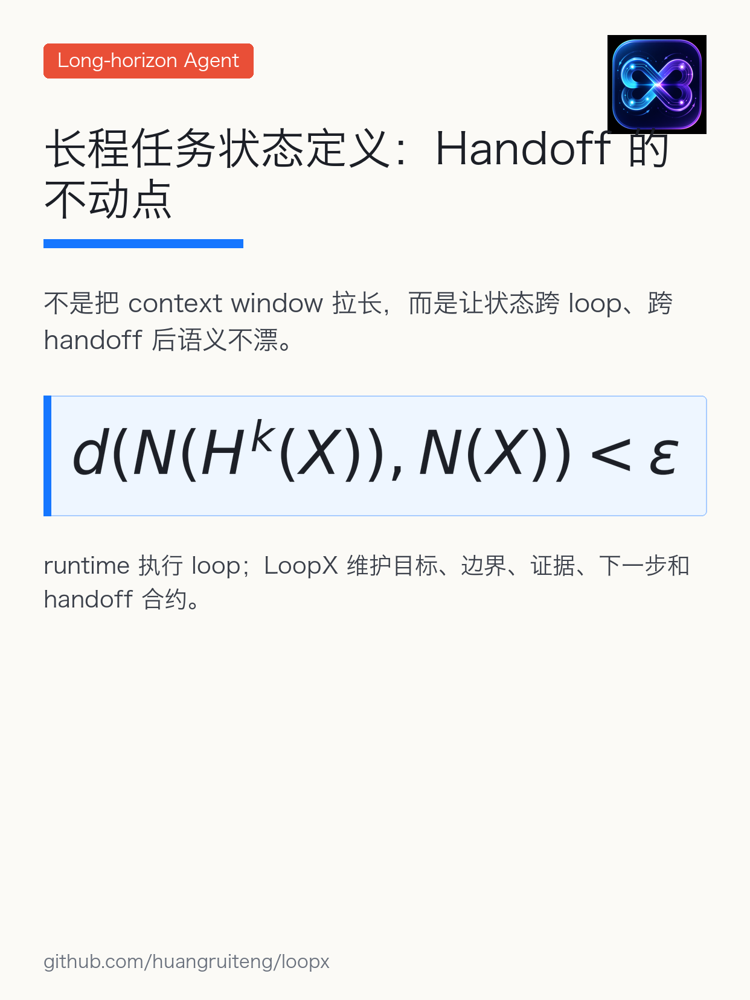
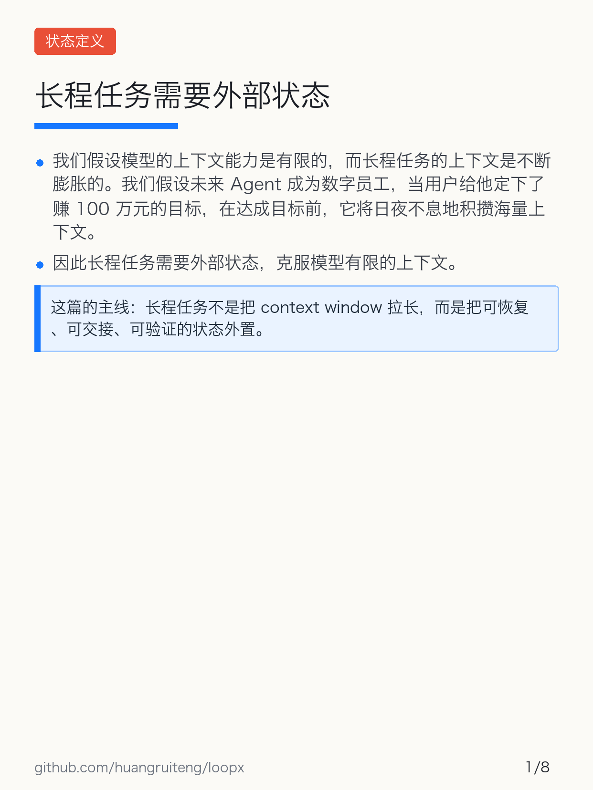
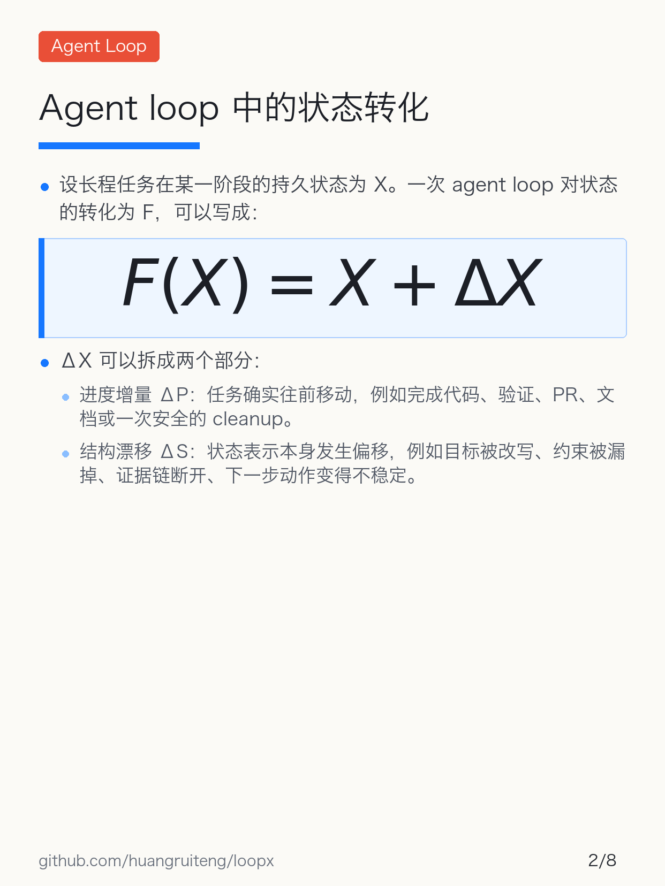
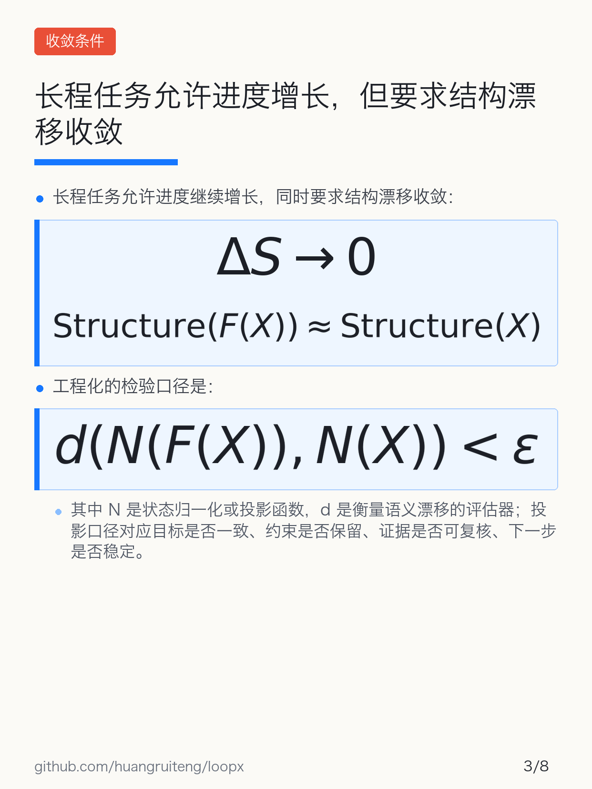
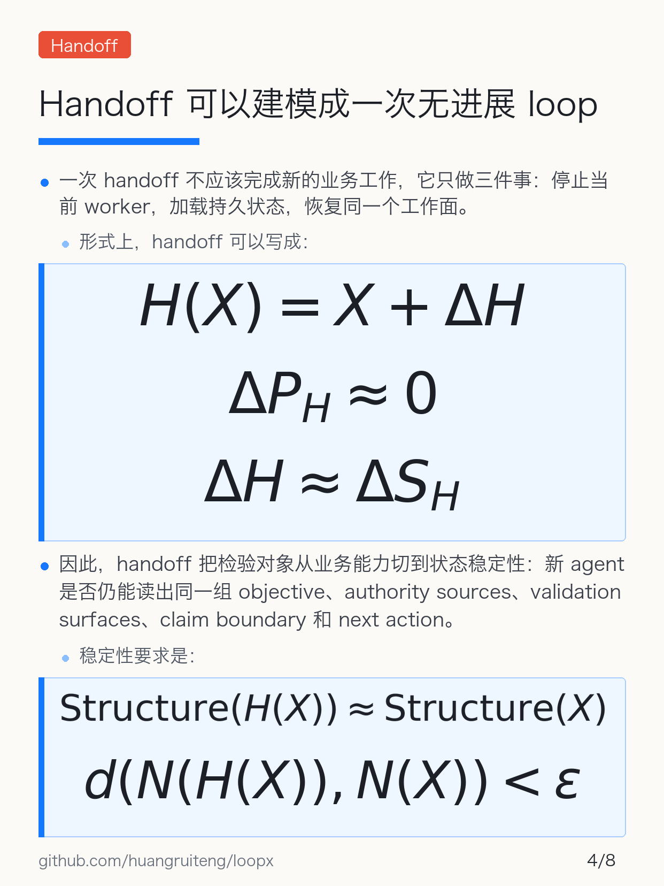
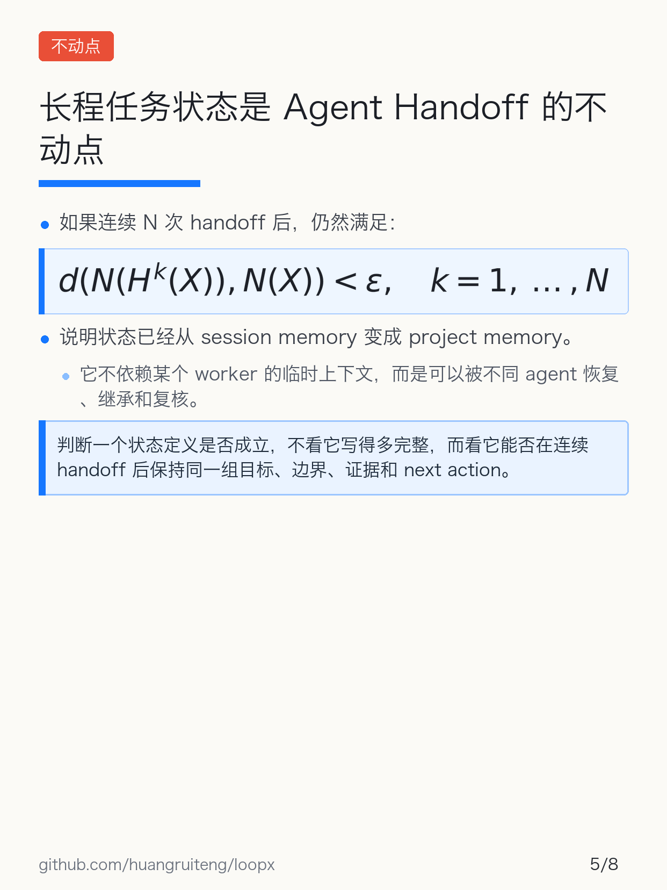
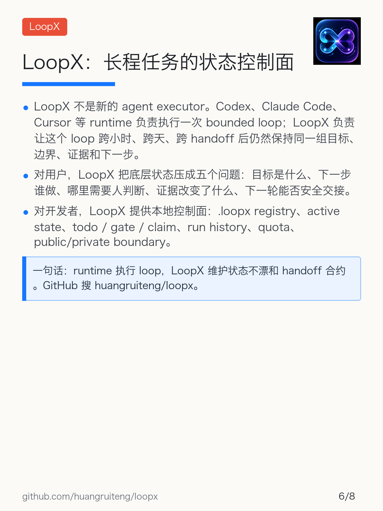
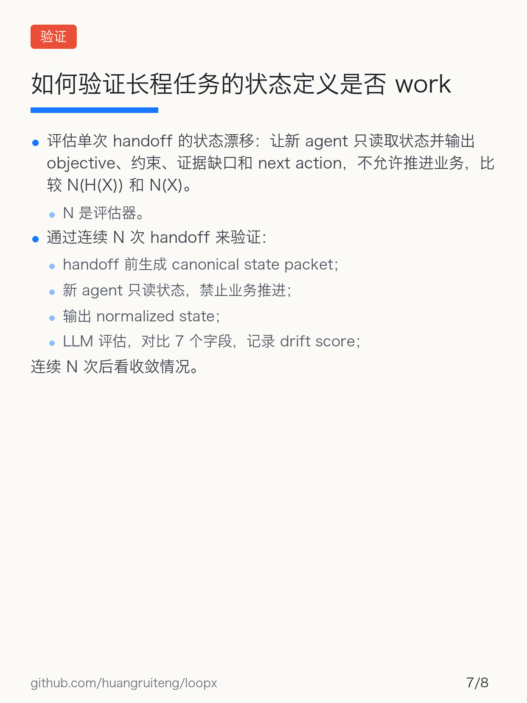
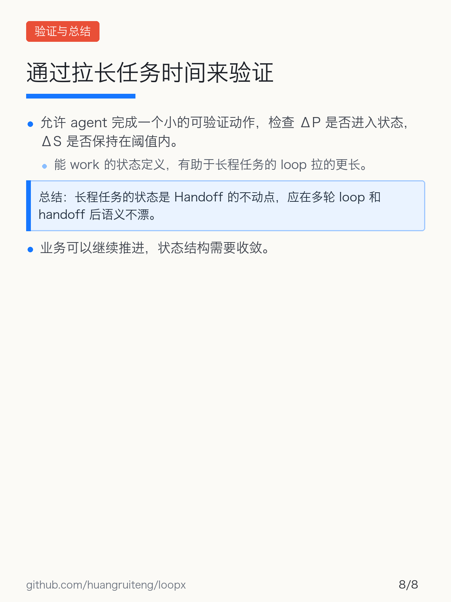

# LoopX 长程任务状态定义小红书素材

## 标题

推荐：

长程任务状态定义：Handoff 的不动点

备选：

- Agent 为什么做不成长程任务？因为状态会漂
- 我用公式写了一版长程 Agent 状态定义
- LoopX：给长程 Agent 做一个状态控制面

## 图片上传顺序

推荐上传 `00-cover.png` 作为首图，然后接正文页：

1. 
2. 
3. 
4. 
5. 
6. 
7. 
8. 
9. 

如果想保持长文更克制，就从 `01-long-task-external-state.png` 开始，不发封面。

## 正文

长程任务的问题，不只是 context window 够不够长。

我现在更倾向于用「状态是否能在 handoff 后不漂」来定义一个长程 agent 系统是否成立。

这篇把 agent loop 看成状态转化，把 handoff 看成一次无进展 loop，最后用不动点来定义可交接的 project memory。

LoopX 页说的是它的位置：它不是 executor，而是长程 agent 的状态控制面。runtime 执行 loop，LoopX 维护目标、边界、证据、下一步和 handoff 合约。

GitHub 搜：huangruiteng/loopx

#AIAgent #长程任务 #LoopX #Codex #ClaudeCode #Agent工程 #开源项目

## 发布备注

- 第 5 节已替换为公开版 LoopX 介绍，不保留内部链接、内部文档引用或私有实现细节。
- 仓库露出方式：图片 footer 每张都放 `github.com/huangruiteng/loopx`，正文再写一次「GitHub 搜：huangruiteng/loopx」。小红书里裸链接通常不可点击，这种写法比单独贴链接更稳。
- 不建议单独放 GitHub 截图：这篇是公式长文，截图会消耗一张图的信息密度；如果后续仓库 README / star / release 信号足够强，再单独做一篇开源项目介绍更合适。
