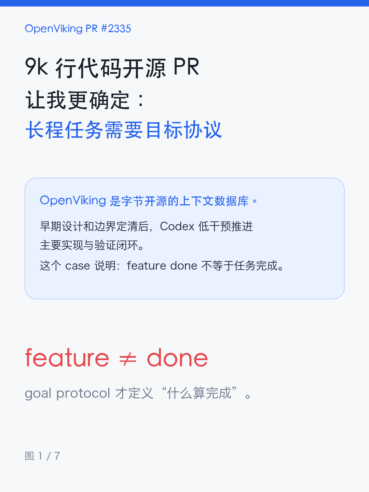
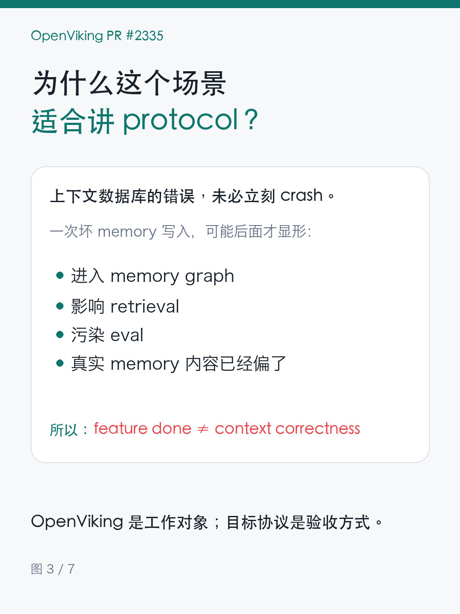
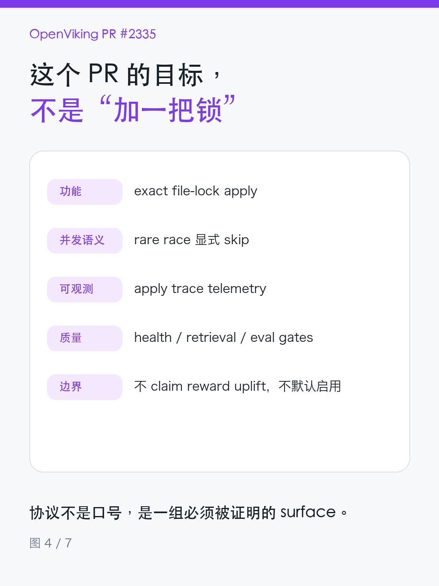
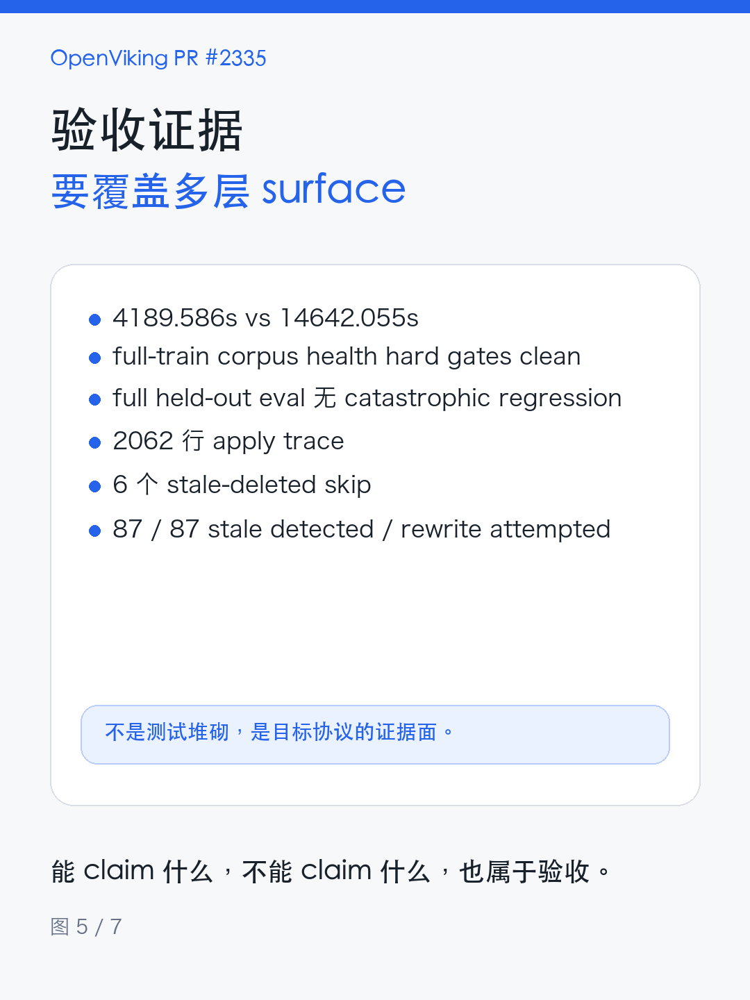
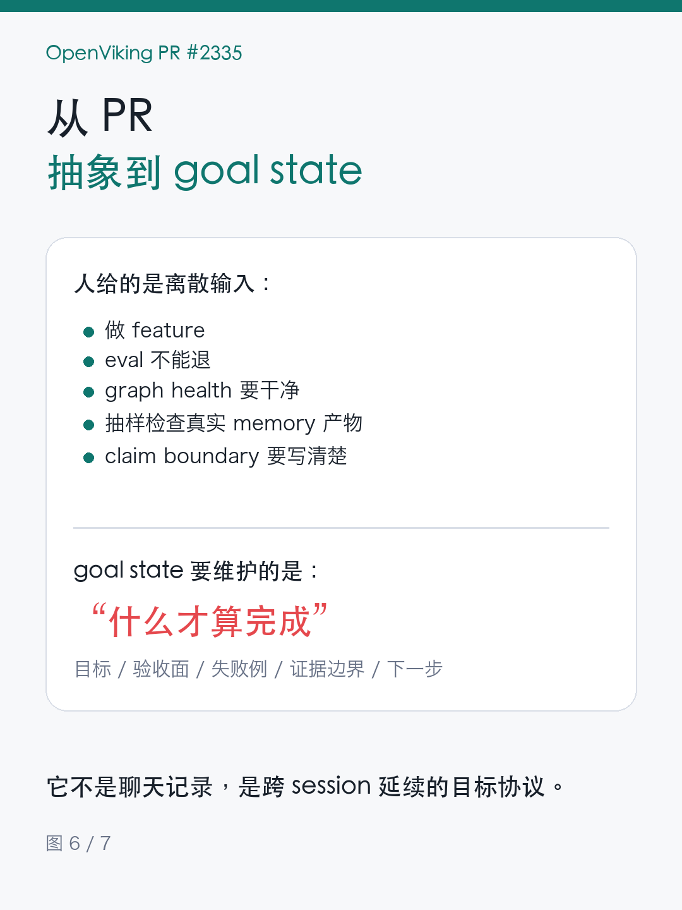
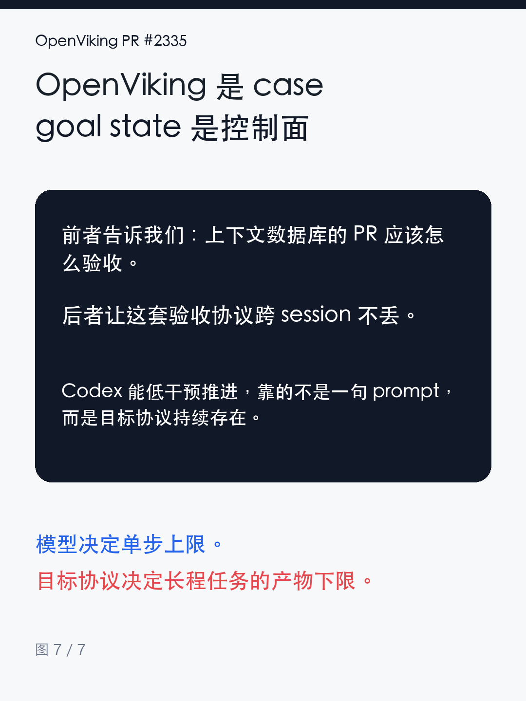

# OpenViking PR：长程任务的目标 protocol

## 小红书标题

推荐：

> 9k 行代码开源 PR 让我更确定：长程任务需要目标协议

备选：

- OpenViking 这个 9k 行 PR，不只是做完一个 feature
- 长程任务里，Goal State 不是记事本
- 为什么 agent 需要记住“什么才算完成”

## 配图顺序

1. 封面：9k 行代码开源 PR 让我更确定，长程任务需要目标协议
   

2. 直接使用截图：`_apply_upsert_uri()` 里的 rare case

3. 为什么上下文数据库放大了目标协议问题
   

4. 这个 PR 的目标，不是“加一把锁”
   

5. 验收证据要覆盖多层 surface
   

6. 从 OpenViking PR 抽象到 goal state
   

7. 一句话收束：OpenViking 是 case，goal state 是控制面
   

如果只发 5 张，优先删第 6、7 张。

## 每张图文案

### 图 1：封面

一个 9k 行代码的开源 PR，让我更确定：

长程任务需要目标协议。

OpenViking 是字节开源的上下文数据库。

PR #2335 改的是 agent memory 并发写入。

### 图 2：直接使用截图

使用这次给的截图。

重点保留：

- `_apply_upsert_uri(): lock 内重读 latest`
- `stale deleted`
- `create-vs-existing race`
- “不再让它们看起来写成功”

### 图 3：为什么上下文数据库放大了目标协议问题

OpenViking 管的是 agent 的 context。

一次错误写入，未必立刻 crash。

它可能变成坏 memory：

- 进入 graph；
- 影响 retrieval；
- 污染 eval；
- 但真实 memory 内容已经偏了。

所以在上下文数据库里，feature done 不等于 context correctness。

### 图 4：这个 PR 的目标，不是“加一把锁”

PR #2335 的目标协议至少包括：

- 功能：exact file-lock apply；
- 并发语义：rare race 显式 skip；
- 可观测：apply trace telemetry；
- 质量：graph / schema / retrieval / eval gates；
- 边界：不乱 claim reward uplift，不默认启用。

### 图 5：验收证据要覆盖多层 surface

公开 PR 里写了：

- exact C4 vs safe tree C1：4189.586s vs 14642.055s；
- full-train corpus health hard gates clean；
- full held-out eval 无 catastrophic regression；
- 2062 行 apply trace；
- 6 个 stale-deleted skip；
- 87 / 87 stale detected / rewrite attempted。

这不是测试堆砌，是目标协议的证据面。

### 图 6：从 OpenViking PR 抽象到 goal state

人给 agent 的输入是离散的：

- 做 feature；
- eval 不能退；
- graph health 要干净；
- 要抽样检查真实 memory 产物；
- claim boundary 要写清楚。

goal state 要维护的不是聊天记录。

它要维护“什么才算完成”。

### 图 7：收束

OpenViking 是具体工作对象。

goal state 是控制面能力。

前者告诉我们：上下文数据库的 PR 应该怎么验收。

后者让这套验收协议跨 session 不丢。

Codex 能低干预推进，靠的不是一句 prompt，而是目标协议持续存在。

## 正文

先说结论：

长程任务里的 goal state，不是把聊天历史存下来。

它更像是在维护一份“什么才算完成”的目标协议。

这个判断来自一个具体开源贡献：OpenViking PR #2335，一个 9k 行代码级别的开源 PR。

OpenViking 是字节开源的上下文数据库，面向 AI Agent 管理 memory、resources、skills 等 context。PR #2335 改的是 Memory V2 并发写入：让 agent memory extraction 可以并发写 `trajectories` / `experiences`，同时在 apply 阶段守住正确性。

还有一个值得写的背景：这个 PR 在早期设计、目标协议和边界定清之后，Codex 基本低干预完成了主要实现与验证闭环。

这里的重点不是“AI 自动写了 9k 行代码”。

重点是：当目标协议足够清楚，agent 才能在长程任务里持续沿着功能、并发语义、trace、health / eval、claim boundary 推进，而不是每轮重新退回到“找一个能写代码的小步”。

这个场景很适合讲 goal protocol。

因为上下文数据库的错误，很多时候不是立刻 crash。

它可能是一次坏 memory 写入。

它可能在当轮看起来成功，后面才污染 graph health、retrieval、eval，或者让真实 memory 产物的内容偏离预期。

所以对 OpenViking 这种上下文底座来说，`feature done` 不等于任务完成。

如果只把目标写成：

做一个并发写入优化。

agent 很自然会沿着主路径推进：

- 加锁；
- 跑通单测；
- CI 绿；
- 写总结。

这条路径不一定错，但不够。

PR #2335 真正需要的是一份更完整的目标协议：

1. 功能层：实现 exact file-lock apply。
2. 并发语义层：把 stale deleted、create-vs-existing race 这类 rare case 显式化。
3. 可观测层：记录 apply trace telemetry，区分 applied、failed、skipped。
4. 质量层：打平 graph / schema / retrieval / eval gates，并抽样检查真实 memory 产物内容。
5. 边界层：写清楚什么能 claim，什么不能 claim。

截图里那段 `_apply_upsert_uri()` 就是一个典型例子。

在 lock 内重读 latest 后，至少有三种情况：

- latest file 存在，LLM 也有 old snapshot：正常 update，或 stale update。
- latest file 不存在，但 LLM 有 old snapshot：stale deleted，skip。
- latest file 存在，但 LLM 没有 old snapshot：create-vs-existing race，skip。

这三种情况如果不显式区分，很容易把冲突写成“成功”。

但对上下文数据库来说，伪成功比失败更危险。

失败会暴露。

伪成功会进入 context。

最后这个 PR 的验证也不是一句 `tests passed`。

公开 PR 里写得很具体：

- targeted validation 有 12 passed；
- additional PR-1 validation 有 14 passed、166 passed、client regeneration 16 passed；
- exact C4 vs safe serial tree C1 的总耗时是 4189.586s vs 14642.055s；
- full-train corpus health 的 hard gates 干净；
- full held-out eval 支持 exact path 没有 catastrophic corpus / retrieval / scoreboard regression；
- apply trace 里明确记录 6 个 stale-deleted skip，87 / 87 stale detected / rewrite attempted。

更重要的是，它也明确写了不 claim 什么：

不 claim TAU reward uplift。

不 claim same-concurrency tree C4 speedup。

不 claim user memory / tools / skills 全覆盖。

这就是目标协议的作用。

它不是让 agent “更努力”这种抽象要求。

它是把任务拆成可验证 surface：

功能是否存在。

并发语义是否守住。

中间产物是否健康。

下游 eval 是否不退。

证据边界是否写清。

然后再说 goal state。

OpenViking 是这次的具体工作对象。

goal state 是从这个例子里抽象出来的控制面能力。

长程任务里，人给 agent 的输入往往是离散的：

这一轮说“做 feature”。

下一轮说“eval 不能退”。

又一轮说“graph health 要看”。

再一轮说“要抽样检查真实 memory 产物内容”。

如果没有 goal state，下一轮 agent 可能只看到一个任务标题，然后重新退化成“先找一个能写代码的小步”。

goal state 的价值，是把这些离散输入维护成连续协议。

它要保存的不是“上轮聊了什么”。

而是：

- 当前 objective；
- 必须覆盖的 validation surfaces；
- 已知 failure cases；
- claim boundary；
- next action；
- 哪些证据已经足够，哪些还没有。

所以当下一个 agent session 接手时，它不应该只问：

我还能写什么代码？

它应该先问：

这份目标协议里，还有哪个 surface 没被证明？

这就是我想表达的长程任务 insight。

OpenViking PR #2335 提供了一个具体 case：上下文数据库里的 memory write 优化，不能只用 feature 完成度验收。

goal state 提供的是更通用的抽象：让“什么才算完成”跨 session 不丢。

模型决定单步上限。

目标协议决定长程任务的产物下限。

资料来源：

- OpenViking 仓库：`https://github.com/volcengine/OpenViking`
- OpenViking PR #2335：`https://github.com/volcengine/OpenViking/pull/2335`

## 标签

`#AIAgent` `#AI编程` `#开源项目` `#OpenViking` `#程序员` `#工程实践` `#软件工程` `#AgentInfra` `#长程任务`

## 发布备注

1. 第 2 张图直接用你这次贴的截图，能把 rare case 讲得更有现场感。
2. 正文里不要放太多裸代码链接；小红书正文链接不可点击，容易打断阅读。
3. 可以在评论区置顶 PR 链接：`https://github.com/volcengine/OpenViking/pull/2335`。
4. 如果正文偏长，可以删掉 validation 数字里的 `14 passed / 166 passed / client regeneration 16 passed`，保留 speed、health、eval、trace 四类证据。
