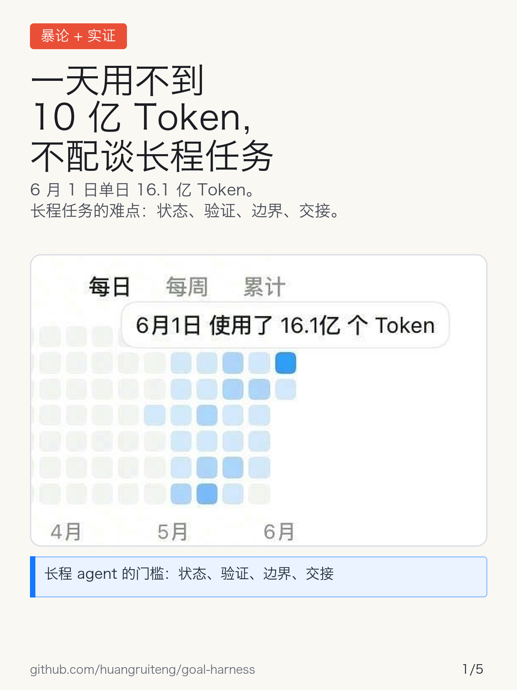
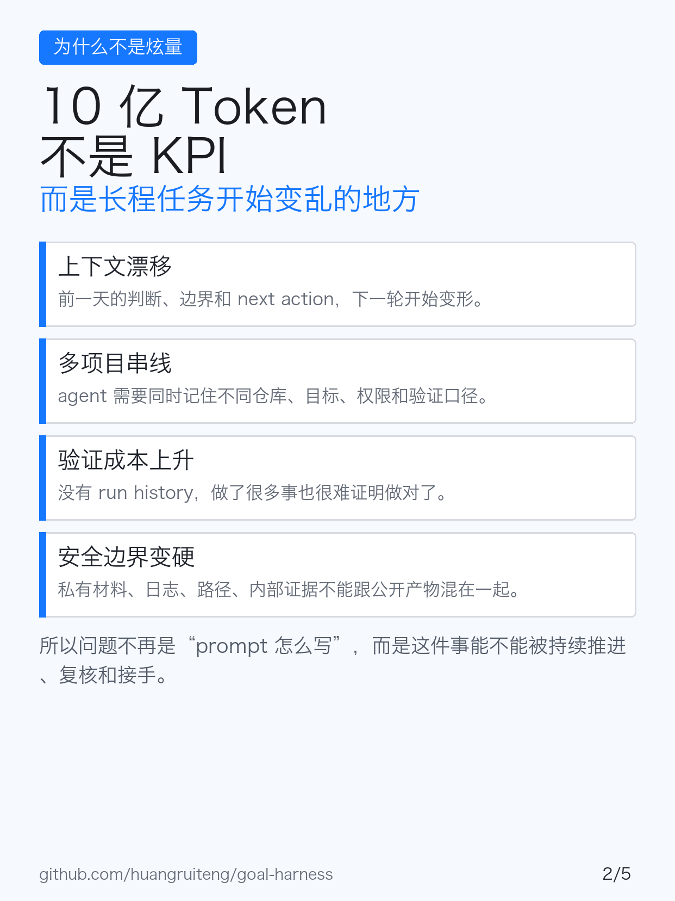
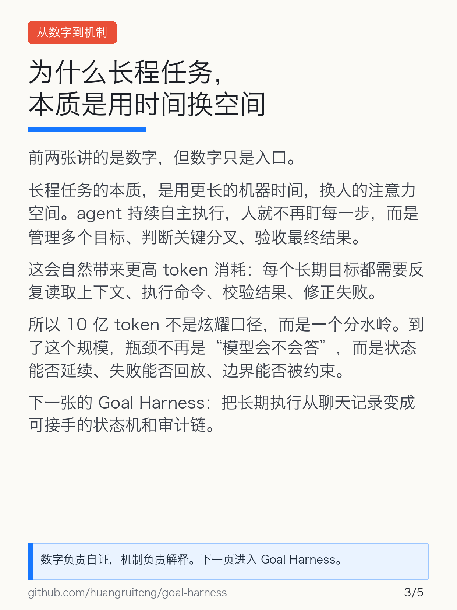
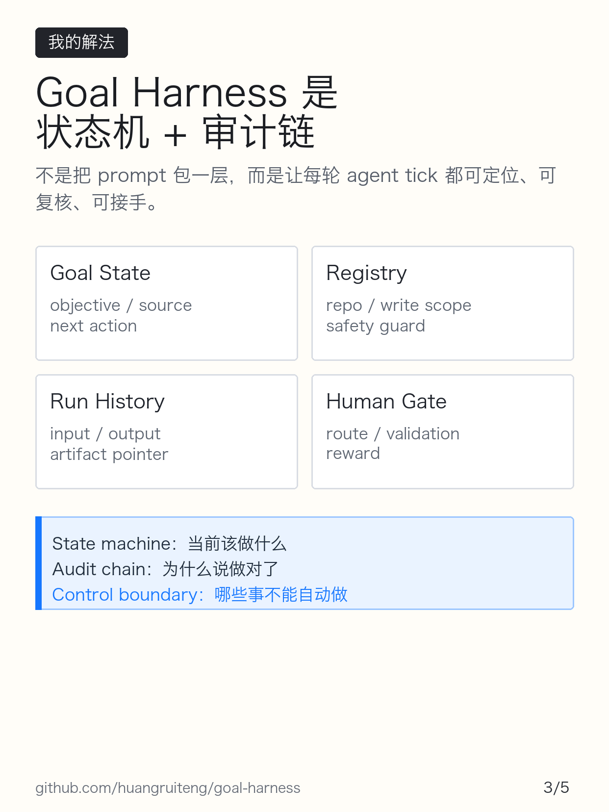
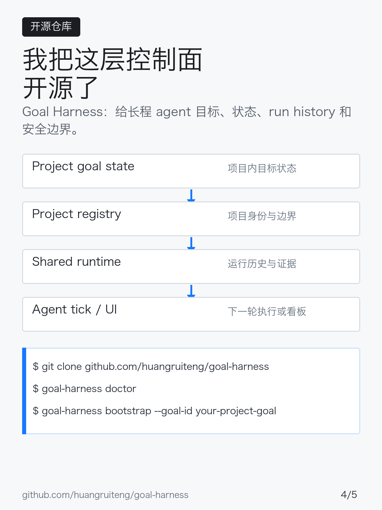
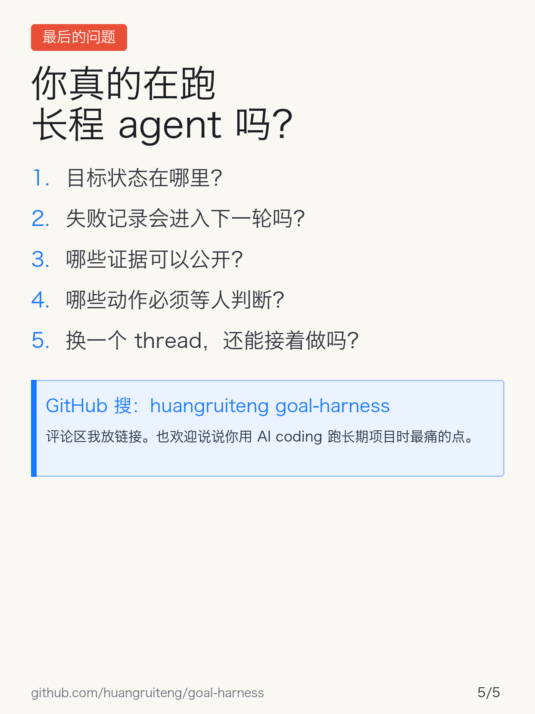

# 长程任务的门槛是一天 10 亿 token

## 小红书标题

推荐：

> 暴论：一天用不到 10 亿 Token，不配谈长程任务

备选：

- 我用 16.1 亿 Token 才明白：AI 长程任务不是聊天
- AI Agent 的门槛，不是 prompt，是一天 10 亿 Token
- 跑完 16.1 亿 Token 后，我开源了一个 Goal Harness

## 配图顺序

1. 暴论 + 16.1 亿截图自证
   

2. 为什么 10 亿 token 是问题规模
   

3. 文字卡：从数字到机制
   

4. Goal Harness 的工程机制
   

5. 仓库与接入方式
   

6. 评论区问题与仓库搜索词
   

如果只发 5 张，优先删第 6 张。仓库搜索词已经出现在第 5 张和正文里。

## 正文

先上结论：长程任务的门槛不是“上下文窗口够长”，而是你能不能把大量 agent run 变成可管理、可回放、可验收的工程系统。

昨天我单日用了 16.1 亿 token。

这里面大概 60% 消耗的是 Codex 最高档额度。按 API 调用粗估，等价成本接近上万元。

这不是在炫 token。恰恰相反，token 只是暴露了一个现实：真正的长程任务，消耗的是时间、上下文、验证、回滚、人工判断和状态管理。模型越强，越容易把这些成本藏起来，让人误以为“多开几轮对话”就是长期自动化。

所以我有个暴论：

一天用不到 10 亿 token 的人，不配谈“长程任务”的工程难点。

这句话当然冒犯，也不是说用得少就不懂 AI。它真正指的是：如果你的 agent 还没有跑到足够长、足够贵、足够乱，你看到的问题大概率还是 demo 问题，不是长程任务问题。

当 agent 真正进入多项目、长周期、带验证的工作流，问题会变成：

- next action 如何不漂；
- 多个项目状态如何隔离；
- 每轮 run 如何留下证据；
- 私有材料如何不外泄；
- 哪些动作必须等人判断；
- 失败经验如何进入下一轮。

这也是我开源 `goal-harness` 的原因。

它不是新的 agent framework，而是一层很薄的目标控制面：project goal state、registry、run history、public/private boundary check，帮助 Codex / Claude Code / Cursor 这类 agent 在受控边界里持续行动。

我的判断是：AI agent 下一阶段会从 prompt / context 优化，进入控制面工程。模型能力决定单步上限，harness 决定长期运行的下限。

更具体一点，`goal-harness` 不是把 prompt 包一层，而是把长程 agent 抽成一个可审计的状态机：

- goal state 保存当前 objective、authority sources、next action 和 validation surfaces；
- registry 隔离不同项目的 repo、写入范围和安全边界；
- run history 把每轮 agent tick 的输入、输出、证据、失败原因压成可回放记录；
- public/private boundary check 阻止本地路径、内部日志、私有证据进入公开产物；
- human gate 把路线取舍、验收和 reward 留给人，而不是让模型自己宣布 done。

换句话说，真正难的不是让模型多想几步，而是让每一步都能被定位、复核、回滚、接手。长程 agent 要从聊天记录，变成一个有状态、有审计、有权限边界的控制系统。

仓库：GitHub 搜 `huangruiteng goal-harness`

链接：`github.com/huangruiteng/goal-harness`

如果你也在用 AI coding 工具跑长期项目，我更想知道：你现在最大的痛点是模型不够强，还是目标、状态、验证和交接不够稳？

## 标签

`#AI编程` `#Codex` `#ClaudeCode` `#Cursor` `#AIAgent` `#程序员` `#GitHub开源` `#效率工具` `#独立开发` `#AI工作流`

## 发布备注

正文里不要只放裸链接。小红书正文链接不可点击，且容易被当作外链噪音。

更稳的方式：

1. 正文末尾写：`GitHub 搜 huangruiteng goal-harness`。
2. 第 5 张图里放仓库和命令。
3. 评论区第一条放完整链接：`https://github.com/huangruiteng/goal-harness`。
4. 如果担心外链影响分发，正文写 `github.com / huangruiteng / goal-harness`，评论区再放完整链接。

